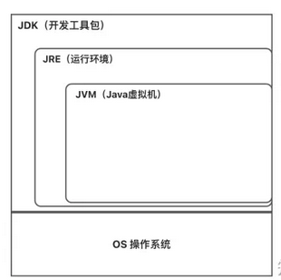
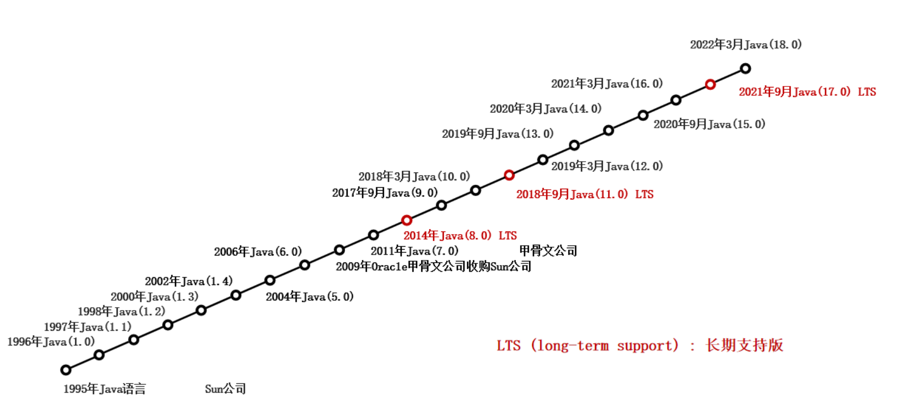
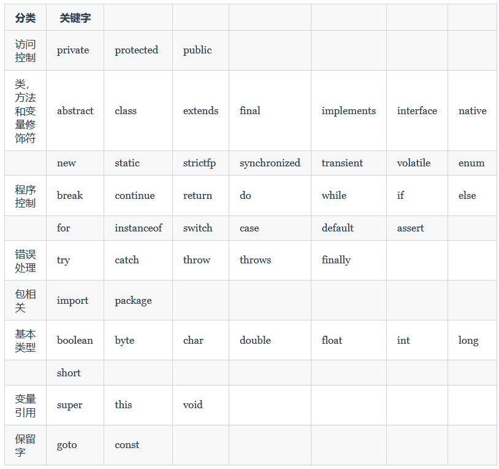
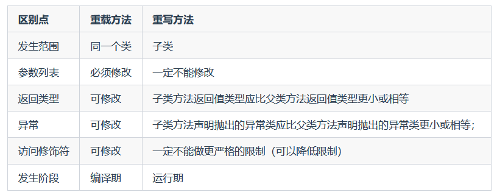

---
tags:
  - Java
createTime: 2025/03/20 15:28:27
title: 基础知识
permalink: /ToBeABD/Java/698k5or6/
---
---

## Java背景知识

==【八股】介绍一下Java语言？==

Java 是一种面向对象的编程语言。它的主要特点包括：

- 平台无关性：通过编译生成的字节码可以在任何支持 Java 虚拟机（JVM）的平台上运行，实现“编写一次，到处运行”。
- 面向对象：支持封装、继承、多态等面向对象的特性，有助于提高代码的可重用性和可维护性。
- 内存管理：自动内存管理和垃圾回收机制，减少手动管理内存的风险。
- 安全性和稳定性：提供内置的安全模型，防止常见的编程漏洞，如缓冲区溢出。
- 多线程支持：原生支持多线程编程，适用于并发和并行计算。

Java广泛用于开发企业级应用、移动应用（如 Android 应用）、Web 应用和嵌入式系统等。

---

==【八股】Java的3种技术架构？==

- Java SE：Java Platform Standard Edition（标准版）

  - 完成桌面应用程序的开发，是其它两者的基础；
  - 包含一些核心类库：集合、IO、网络、并发等；
- Java ME：Java Platform Micro Edition

  - 开发电子消费产品和嵌入式设备，如手机中的程序、电视机顶盒和打印机相关的嵌入式设备软件；
- Java EE：Java Platform Enterprise Edition

  - 开发企业环境下的应用程序，**在Java SE的基础上构建的**，主要针对web程序开发；

---

==【八股】Java跨平台工作的原理？==

JVM是java代码可以跨平台运行的关键（跨平台的是程序，不是JVM，不同的平台有对应不同的JVM）

这个问题可以从java代码的两个步骤来回答：编译和运行。

- java代码编译时会产生 .class 字节码文件，这是一个结构中立的中间文件格式，可以在不同的平台上被识别；
- java运行是通过不同平台的JVM虚拟机来实现：JVM虚拟机将java编译产生的.class字节码文件解释为对应平台的机器语言，从而实现java代码的运行。

---

==【八股】JDK、JRE、JVM的区别和联系？==

整体关系图如下，是一个子集的包含关系：



接下来从内容组成、面向的适用对象两个角度来区分这三者：

- JDK：Java开发工具包的简称，为Java开发者提供了一整套的开发工具

  - 组成：JRE、java类库、java编译器、java开发工具等
  - 适用对象：Java开发者
- JRE：java运行环境的简称，提供运行java应用程序所需要的所有资源

  - 组成：JVM、java类库、java API
  - 适用对象：运行Java程序的用户，他们不需要编译器、调试器等
- JVM：Java虚拟机的简称，负责执行Java字节码文件

  - 组成：主要是功能实现，JVM有内存模型、垃圾回收、类加载等相关功能
  - 适用对象：不直接面向开发者或用户，但是开发者了解JVM有助于更好的开发代码

---

**Java发展历程**：



---

==【八股】Java的项目结构组成？==

**Project**：项目、工程（苍穹外卖）

- **module**：模块（common模块、pojo模块、service模块）
  - **package**：包（config、controller、service、mapper...）
    - **class**：类（EmployeeController、JwtTokenAdminInterceptor）

解释：

1. 一个Java工程可以包含多个模块，不同模块是平行的关系。若要在一个模块中引入另一个模块的方法，需要在pom.xml文件中引入
2. 一个Java模块可以包含多个包。同一个包的资源是互通的（除非private）；不同包之间调用方法，需要在类中导入
3. 一个java包里面可以有多个类。而1个功能的实现，往往需要多个类之间的组合

## Java基础语法

### 基本语法

==【八股】Java注释有哪些？用途？==

Java注释分为：单行注释、多行注释、文档注释。

各自用途：

- 单行注释：解释某一行代码
- 多行注释：解释某一段代码
- 文档注释：可用于生成Java开发文档

```java
// 单行注释

/*
	多行
	注释
*/

/**
	文档注释
*/
```

---

==【八股】Java标识符和关键字的区别？关键字主要有哪些？==

1、标识符就是一个名字，可以用于表示类、变量、方法，有相应的命名规则，也有一些业界约定的一些命名规范（驼峰命名）

```
标识符命名规则：
- 名字只能由数字、字母、下划线、$符号组成
- 不能以数字开头
- 名称不能跟Java中的关键字一样

业界约定：
- 小驼峰命名，常给变量、方法命名：name、firstName
- 大驼峰命名，常给类命名：Student、GoodStudent
```

2、关键字是一个具有特殊意义的标识符。

例如：开店要起名字：可以是xxx蛋糕店，但是不能叫警察局。同理：给变量命名可以用自定义的标识符，但是不能跟关键字一样。

3、关键字也有自己的分类：

- 访问控制：private、public、protected
- 程序修饰：abstract、class、final
- 程序控制：break、continue、return、if、else
- 基本数据类型：boolean、int等



---

==【八股】Java中字面量、变量和常量的区别？==

1、字面量：由字母、数字等构成的字符串或者数值，只能在等号右边出现

2、变量：定义的在特定范围内变化的符号。必须要声明，可以不赋初值

3、常量：被final修饰的变量。必须赋初值，且其类型和值不能再改变

- 对于基本数据类型来说：是数值不能改变
- 对于引用数据类型来说：是地址值不能改变，但是地址值所对应的内容还可以改变（对应的类成员变量）

```java
//a为变量，10为字面量
int a = 10;

//b为常量，10为字面量
final int b = 10;  

//str为变量，Hello World为字面量
static str = "Hello World";  
```

### 数据类型

==【八股】基本数据类型和对应包装类型的区别？（发散一下就是：基本数据类型和引用数据类型的区别？）==

1、Java基本数据类型主要有8中，也有对应的8个包装数据类型：

| 关键字  | 数据类型 | 内存占用大小（字节） | 默认值             | 补充                                                                       |
| ------- | -------- | -------------------- | ------------------ | -------------------------------------------------------------------------- |
| byte    | 整数     | 1                    | 0                  |                                                                            |
| short   | 整数     | 2                    | 0                  |                                                                            |
| int     | 整数     | 4                    | 0                  | 默认的整数类型                                                             |
| long    | 整数     | 8                    | 0L                 |                                                                            |
| float   | 浮点数   | 4                    | 0.0f               |                                                                            |
| double  | 浮点数   | 8                    | 0.0d               | 浮点数默认类型                                                             |
| char    | 字符     | 2                    | '\u0000'  空格字符 | 在程序中用单引号表示（String，字符串，引用数据类型，在程序中是双引号表示） |
| boolean | 布尔     | 1                    | false              |                                                                            |

2、可以从：用途、存储方式、默认值、比较方法四个方面来体现两者的区别

- 用途：基本类型主要用在一些常量和局部变量上使用。对象中的变量基本都用包装类型来定义。而且包装类型可以用于泛型，基本类型不可以。
- 存储方式：对于基本数据类型（局部变量放在栈中，成员变量放在堆中）；包装类型属于引用数据类型，基本都放在堆中。
- 占用空间：基本数据类型占用空间普遍较小
- 默认值：基本数据类型都有对应的默认值；引用数据类型不赋值就是null
- 比较方法：

  - 基本数据类型比较的是值，可以用 `==`比较
  - 包装类型应该比较对应值，用 `==`仅比较的是对象的地址值；要用 `equals()`方法比较才行

3、简单来说：非基本数据类型的都是引用数据类型。常见的有：类、接口、数组、String字符串、枚举类型、注解类型

### 运算符

参考文章：[Java常见运算符](/ToBeABD/Java/eww4cjor/)

---

==【八股】运算符和表达式的概念？==

- 运算符：对字面量或者变量进行操作的符号
- 表达式：用运算符把字面量或者变量**连接**起来符合java语法的式子就可以称为表达式

示例：

```java
int a = 10;
int b = 20;
int c = a + b;

/*
	+：是运算符，并且是算术运算符
	a + b：是表达式，由于+是算术运算符，所以这个表达式叫算术表达式
*/
```

---

==【八股】++i和i++的区别？==

在运算逻辑上：

- ++i：先将i的值+1，再把i的值拿去运算
- i++：先将i的值拿去运算，再把i的值+1

在使用上：

- 若单独使用，两者结果上没有去比
- 若进行赋值操作：根据两者的运算逻辑，是有所区别的

---

==【八股】Java中的类型转换？==

隐形类型转换：

- 赋值转换：基本数据类型赋值的时候，取值范围小的数值或者变量，赋值给取值范围大的变量；
- 运算转换：
  - 取值范围小的数据和取值范围大的数据进行运算，小的提升为大的，再运算；
  - byte、short、char，三者运算时，会先提升为int，再进行运算；

强制类型转换：

- 基本数据类型：把一个取值范围大的数值或者变量，赋值给另一个取值范围小的变量，不允许直接赋值，需要强制转换；
- 引用数据类型：将父类转为子类，方便使用子类中的方法；

示例：

```java
public class Test {
    public static void main(String[] args) {
    	int a = 10;
        double b = a;  // b=10.0
    }
}
```

```java
public class Test {
    public static void main(String[] args) {
        int a = 10;
        double b = 12.3;
        double c = a + b;
    }
}
```

```java
public class Test {
    public static void main(String[] args) {
        int a = 1;
        char b = 'a';
        int c = a + b;
        System.out.println(c);	// c=98
    }
}
```

```java
public class Test {
    public static void main(String[] args) {
        double b = 12.3;
        int a = (int) b;  // a=12
    }
}
```

---

==【八股】Java基本数据类型中的字符类型，怎么进行比较？==

编码表（例如ASCLL编码表）表示：程序中**字节**到**字符**之间的映射关系

java中字符的比较，本质是将字符按照编码表转为对应的字节值，然后进行数字之间大小的比较

---

==【八股】移位运算符有哪些？各自特点？==

针对整数类型（byte、short、int、long）的操作，有三种移位运算符：左移运算符、右移运算符、无符号右移运算符。

|                 |                                                                      |                                     |
| --------------- | -------------------------------------------------------------------- | ----------------------------------- |
| 左移运算符：<<  | 左移n位。高位丢弃，低位补0                                           | 不溢出的情况下，等于将数字扩大2^n倍 |
| 右移运算符：>>  | 右移n位。低位丢弃，最高位：符号位（正数补0，负数补1），其余位（补0） | 等于将数组缩小1/2^n倍               |
| 无符号右移：>>> | 右移n位。低位丢弃，高位：统一补0（忽略符号位）                       |                                     |

```java
int negNum = -8; // 二进制表示为（补码）1111 1000  
int unsignedShifted = negNum >>> 1; // 无符号右移一位，结果为 0111 1100，即十进制的 2147483644（因为是无符号的，所以解释为一个大的正数）  
System.out.println(unsignedShifted); // 输出 2147483644
```

### 方法（函数）

什么是函数？java中一段具有独立功能的代码块，不调用就不执行，称为：function

方法定义格式：

```java
权限修饰符 返回值类型 方法名(参数1, 参数2, ...){
	方法内容
}

public static void method(){}	// 无返回值，用void
public static int method(){}	// 有返回值，给定具体的返回值类型
```

---

==【八股】overload和override的区别？==

1、概念上区别：

- overload：在同一个类中，可以存在多个方法名相同但参数列表（参数个数、参数类型、参数顺序）不同的方法。这被称为方法的重载；
- override：当一个子类中存在一个和父类中同名同参数的方法时，我们说子类重写了父类的方法；

2、位置上的区别：

- overload：发生在一个类里面；
- override：发生在子类和父类之间；

3、目的上：

- overload：主要用于提高程序的易用性，通过提供多个重载版本的方法，可以更方便地调用具有不同参数的方法；
- override：主要用于实现多态性，子类通过重写父类的方法，提供自己特有的实现；

4、用法：

- 可以使用@overload来判断一个方法是否是重载方法；
- 可以使用@override注解，来标识一个方法重写了父类方法；

总结：



---

**方法调用在JVM内的内存图解**

示例代码：

```java
public class MethodDemo1 {
    public static void main(String[] args) {
        System.out.println("开始");
        getMax();
        System.out.println("结束");
    }
 
    public static void getMax() {
        int num1 = 10;
        int num2 = 20;
        int max = num1 > num2 ? num1 : num2;
        System.out.println(max);
    }
}
```

1、在程序执行前：将待加载的类信息、待执行的方法加载到方法区。此时栈内存是空的

```
## 方法区

MethodDemo1.class
main
getMax
```

```
## 栈内存

```

2、程序开始执行：首先是main方法入栈

```
## 方法区

MethodDemo1.class
main
getMax
```

```
## 栈内存

main
- System.out.println("开始");
```

3、执行到另一个方法：getMax，方法入栈，此时main方法还没有执行完毕，不出栈

```
## 方法区

MethodDemo1.class
main
getMax
```

```
## 栈内存

getMax
- int num1 = 10;
- int num2 = 20;
- int max = num1 > num2 ? num1 : num2;
- System.out.println(max);

main
- System.out.println("开始");
- getMax();
```

4、getMax方法执行完毕，出栈，程序继续执行（main方法后续内容）

```
## 方法区

MethodDemo1.class
main
getMax
```

```
## 栈内存

main
- System.out.println("开始");
- getMax();
- System.out.println("结束");
```

5、main方法执行完毕，出栈，程序结束

```
## 方法区

MethodDemo1.class
main
getMax
```

```
## 栈内存

```

### 流程控制语句

**顺序结构**：默认的代码执行结构

```java
public class Test {
    public static void main(String[] args) {
        System.out.println("A");
        System.out.println("B");
        System.out.println("C");
    }
}
```

---

**分支结构：if、switch**

- [if语句](https://www.runoob.com/java/java-if-else-switch.html)
- [switch语句](https://www.runoob.com/java/java-switch-case.html)

---

**循环结构：for、while、do...while**

- [循环结构](https://www.runoob.com/java/java-loop.html)

---

**跳转控制语句：break、continue**

break：强行退出**当前**循环

continue：仅结束当前循环的后续代码，并进入下一次循环

### 数组

什么是数组？一种容器，可以存储同种数据类型的多个值

---

一维数组的声明方式：

```java
public class Demo1Array {
    public static void main(String[] args) {
        int[] array1;		// 推荐
        int array2[];
        System.out.println(array1);
        System.out.println(array2);  
    }
}
```

一维数组的两种初始化方式：

- 静态初始化：手动指定数组元素，系统会根据元素个数，计算出数组的长度

```java
// 完整格式：数据类型[] 数组名 = new 数据类型[] { 元素1，元素2，元素3… };
int[] array = new int[]{ 11，22，33 };

// 简化格式：数据类型[] 数组名 = { 元素1，元素2，元素3… };
int[] array = { 11，22，33 };
```

- 动态初始化：手动指定数组长度，由系统给出默认初始化值

```java
int[] arr  = new int[3];
```

---

常见一维数组的默认值：

| 类型                   | 初始化                                                         | 默认值                 | 补充         |
| ---------------------- | -------------------------------------------------------------- | ---------------------- | ------------ |
| 整数数组               | `int[] arr = new int[5];`                                    | 0                      | 基本数据类型 |
| 浮点数数组             | `double[] arr = new double[5];`                              | 0.0                    | 基本数据类型 |
| 字符数组               | `char[] arr = new char[5];`                                  | ‘\u0000’（空白字符） | 基本数据类型 |
| 布尔数组               | `boolean[] arr = new boolean[5];`                            | false                  | 基本数据类型 |
| （类、接口、数组）数组 | `String[] arr = new String[5];  Array[] arr = new Array[1];` | null                   | 引用数据类型 |

解释：

- （数组）数组，指数组里面存数组，不是指二维数组。而是指一维数组里面存储的数据类型为数组。
- 二维数组的长和宽是规范的，但是一维数组中存入数组，每一个存入的数组，其长度可以是任意合理的数字

---

二维数组定义：

```java
public class Demo1Array {
    public static void main(String[] args) {
        int[][] array1;		// 推荐
        int array2[][];
        System.out.println(array1);
        System.out.println(array2);  
    }
}
```

二维数组的两种初始化方式：

- 静态初始化：手动指定数组元素，系统会根据元素个数，计算出数组的长度

```java
// 完整格式：数据类型[][] 数组名 = new 数据类型[][] {{元素1,元素2},{元素1, 元素2}};
int[][] arr = new int[][]{{11,22},{33,44}};

// 简化格式：数据类型[][] 数组名 = {{元素1,元素2}, {元素1, 元素2}};
int[][] arr = {{11,22},{33,44}};
```

- 动态初始化：手动指定数组长度，由系统给出默认初始化值

```java
int[][] arr = new int[2][3];
```

## 字符串

### 基础知识

==【八股】String、StringBuilder、StringBuffer的区别？==

主要有三个方面：

- 可变性：String不可变（也是一个八股）；另外两个可变，并且还有修改字符串的相关方法
- 线程安全性：

  - String不可变，可以理解为常量，是线程安全的
  - StringBuilder中关于字符串的操作函数没有加同步锁，是线程不安全的
  - StringBuffer中关于字符串的操作函数加了同步锁，是线程安全的
- 性能：

  - String是引用数据类型，改变String的时候会新建了一个String对象，然后将指针指向新的String对象
  - StringBuilder、StringBuffer也是引用数据类型，但是可以对自身进行修改，性能要好一点。

---

==【八股】String为什么不可变？这样设计有什么好处？==

主要有两个原因：

- 保存字符串的数组被final和private修饰，是静态且私有的，而且没有提供/暴漏修改这个数组的方法；
- String类被final修饰，不可被继承，避免了子类提供修改数组的方法，进而避免了子类破坏String的不可变；

好处：

- 使得String是线程安全的；
- 可以在创建的时候就缓存哈希值，方便用在Set、Map等集合中作为元素或键使用，既减少了计算哈希值带来的开销，也避免了键被更改的风险；
- 字符串常量池：因为String是不可变的，就可以通过字符串常量池来实现字符串的复用，减少内存消耗和提高性能；

---

==【八股】字符串拼接操作使用+还是用StringBuilder好==

在JDK8及以前，使用+号拼接字符串本质是：创建StringBuilder，调用append()方法，然后调用toString()方法

- 若是一次拼接：两种使用都行
- 若是循环拼接：会重复创建StringBuilder，还是直接用StringBuilder更好

在JDK9及以后，使用+号拼接字符串改用了动态方法makeConcatWithConstant()，不会循环创建StringBuilder了（但也还是用的StringBuilder），所以两种方式区别不大

---

==【八股】了解字符串常量池嘛？以下示例判断是否相等==

```java
String str1 = "str";
String str2 = "ing";
String str3 = "str" + "ing";
String str4 = str1 + str2;
String str5 = "string";
System.out.println(str3 == str4);	//false
System.out.println(str3 == str5);	//true
System.out.println(str4 == str5);	//false
```

字符串常量池介绍：

- 字符串常量池是JVM为了减少内存消耗，针对String类专门开辟的一个内存区域，主要目的是避免字符串的重复创建。
- 字符串常量池的位置：jdk7以前是在方法区；jdk7以后是在堆内存中。

上述示例：

- `String str1 = "str";`  常量池中没有该字符串，会在字符串常量池中创建一个str
- `String str2 = "ing";`  常量池中没有该字符串，会在字符串常量池中创建一个ing
- `String str3 = "str" + "ing";`

  - 根据常量优化机制，该行代码等同于 `String str3 = "string";`
  - 常量池中没有该字符串，会在字符串常量池中创建一个string
- `String str4 = str1 + str2;`

  - 调用StringBuilder的append方法和toString方法，得到的字符串对象，会创建新的对象
  - 创建后的字符串对象不会放在字符串常量池中，而是放在堆内存里面（显示调用intern()方法，可以让存储的对象放到字符串常量池里面）
- `String str5 = "string";`  常量池中有这个字符串，是由第5行代码创建的，直接引用，不创建新的对象

因此上述示例的结果就是：false、true、false

其他示例：

```java
public class Demo1Array {
    public static void main(String[] args) {
        String s1 = "abc";				// 常量池内没有，创建
		String s2 = "abc";				// 常量池内有，引用
        System.out.println(s1 == s2);  // 两者是一个东西，true  
    }
}
```

```java
public class Demo1Array {
    public static void main(String[] args) {  
        String s1 = "abc";				// 常量池内没有，创建
        String s2 = new String("abc");	// 在堆内存中开辟
        System.out.println(s1 == s2);  // 两者不是一个东西，false  
    }
}
```

```java
public class Demo1Array {
    public static void main(String[] args) {  
        String s1 = "abc";				// 常量池内没有abc，创建
        String s2 = "ab";				// 常量池内没有ab，创建
        String s3 = s2 + "c";			// 常量池内没有c，创建，StringBuilder内完成相加操作，并在堆内存开辟新的空间存储abc
        System.out.println(s1 == s3);  // 两者不是一个东西，false  
    }
}
```

```java
public class Demo1Array {
    public static void main(String[] args) {
        String s1 = "abc";				// 常量池内没有，创建
        String s2 = "a" + "b" + "c";	// 常量优化机制，等同于abc。常量池内有，引用
        System.out.println(s1 == s2);	// 两者是一个东西，true
    }
}
```

### StringBuilder类

该类可以提高字符串操作效率：StringBuilder的拼接速度比单纯的字符串运算拼接速度快上一个量级。

其本质是字符串的缓冲区，可以理解为一个容器，其内存储的内容长度可变。

---

构造方法：

```java
// 无参构造，创建空的字符串缓冲区，初始容量16
StringBuilder()
  
// 有参构造，创建一个字符串缓冲区，按照给定的参数完成初始化，初始容量:16+str的长度
StringBuilder(String str)
```

---

字符串的基本操作 vs StringBuilder的基本操作：

- 字符串自身的基本操作主要有：内容比较、切割、截取、替换、遍历等，基本跟索引无关
- StringBuilder在字符串本身具备的操作基础上，额外具有：添加、反转、字符数组转为字符串等操作

[两者常用方法总结](https://blog.csdn.net/Cherils/article/details/105889084)

---

==【八股】StringBuilder的长度可变原理==

[参考文章](https://blog.csdn.net/qq_44713454/article/details/109090381)

总体思路：

- 根据有参或无参构造方法，先初始化stringbuilder，带有特定的长度（无参构造长度为16；带参构造长度为16+str的长度）
- 在添加元素的过程中，可能会超越原有长度，因此每次执行添加过程，都要先判断长度是否越界
  - 若不越界，添加元素到末尾
  - 若越界，容量不够，需要扩容
    - 默认扩容长度：新容量长度=老容量长度*2+2
    - 默认长度扩容之后还不足：老数组长度+append中新增的数组长度（此时再次填满stringbuilder）
