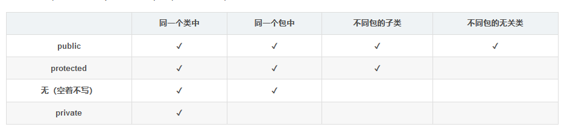
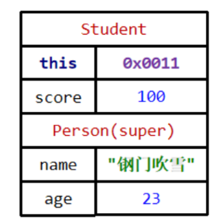
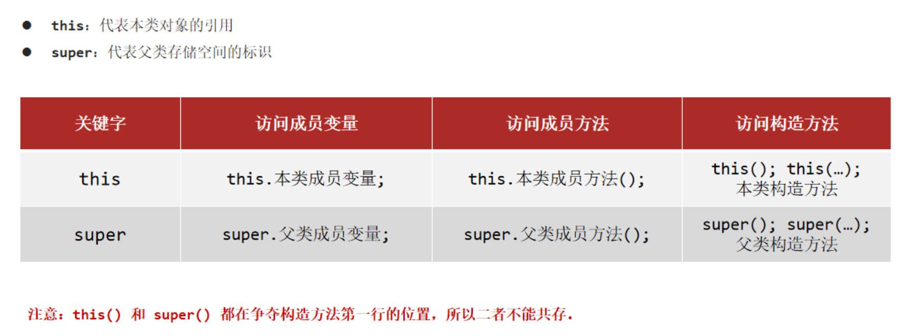
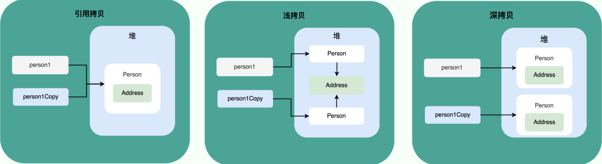

---
tags:
  - Java
createTime: 2025/03/20 15:28:27
title: 1-面向对象
permalink: /ToBeABD/Java/l2m4fuhi/
---

---


## 基本概念

### 类、对象、类的组成

==【八股】Java中OOP的概念？==

- OOP，面向对象，是一种编程范式，将现实世界的事物抽象为对象，并通过类和对象来构建软件系统。
- OOP提供了一种更贴近人类思维习惯的方式来理解和处理复杂问题。
- OOP的三要素：封装、继承、多态（若问四要素，就多一个抽象）

---

==【八股】Java中类和对象的概念？==

类和对象概念的理解相辅相成：

- 类：是一个模板，描述一类对象的行为（成员方法）和状态（成员属性）
- 对象：对象是类的一个实例（一个类可以有多个对象，想要创建对象，必须现有类的存在），有相应的行为和状态

---

==【八股】Java中类的组成？==

类由属性和方法组成

- 属性：成员变量；
- 方法：成员方法，可分为普通方法和构造方法。

---

==【八股】Java中构造方法的用途、特点、类别？==

- 什么是构造方法：构建、创造对象的时候，所调用的方法
- 构造方法的用途：可以用来给对象中的属性进行初始化赋值
- 构造方法的类别：无参构造（只有一个）和有参构造（可以有多个）
- 构造方法的执行时机：创建对象的时候调用，每创建一次对象，就执行一次构造方法
- 构造方法有哪些特点：

  - 名称：方法名与类名一样；只有一个权限修饰符和方法名；没有返回值类型（也没有void）、没有具体返回值（没有return）；

    - 系统默认提供无参构造方法；
    - 人工定义了有参构造方法，系统就不提供无参构造了，需要自行定义出无参构造
    - 构造方法支持重载（overload），但不支持重写（override）

---

==【八股】成员变量的局部变量的区别==

成员变量和局部变量的区别主要分为如下几个方面：

- 语法形式上：成员变量属于类，可以被访问控制符修饰；而局部变量不能被访问控制符修饰
- 存储位置：成员变量在堆内存中保存；局部变量在栈内存中保存
- 默认值：成员变量没赋初值的话，会根据数据类型，自动赋予默认值；局部变量不会被赋予默认值
- 生命中期：成员变量随着对象的创建而存在，对象的销毁而消失；局部变量随着方法的调用而存在，方法的消亡而消失。


### 关键字 | static

==【八股】static关键字有什么用途？==

static表示静态的意思，可以用于修饰类、修饰成员变量，也可以用于修饰成员方法

---

==【八股】被static修饰的成员，具有哪些特点？==

成员包括：成员变量和成员方法

- 该成员可供该类的所有对象共享
- 多了一种调用该成员的方式：

  - 正常调用方式：实例化对象调用（new一个对象）
  - 多个调用方式：直接通过 `类名.成员`调用【被static修饰的成员，推荐使用这种方法调用】
- 随着类的加载而加载，优先于对象存在

  - 即使没有实例化对象，也可以访问到该成员

---

==【八股】若成员方法被static修饰，需要注意什么？==

- 方法中只能访问静态成员，不能访问非静态成员：因为当类加载的时候，还没有初始化对象，因此不能访问非静态的成员
- 方法中不允许使用this关键字：当类加载的时候，对象可能还没有创建，因此不能使用this


### 关键字 | final

==【八股】final关键字有什么用？==

final表示最终的意思，可以用来修饰类、成员方法、成员变量

---

==【八股】被final修饰的对象有什么特点？==

- 被修饰的类：是最终类，不能被继承
- 被修饰的成员方法：是最终方法，不能被重写
- 被修饰的成员变量：

  - 是基本数据类型：该变量是常量，不能再被赋值
  - 是引用数据类型：地址值不可以变，但其中的内容可以变

若一个变量被final修饰，在命名上有如下行业约束：

- 变量是单个词：纯大写
- 变量是多个词：纯大写且每个词中间用下划线连接

---

==【八股】被final修饰的成员变量在什么时候初始化？==

- 在变量定义的时候，直接初始化

```java
public class FinalExample {  
    public final int finalVar = 10; // 在声明时初始化  
}
```

- 在变量定义的时候仅定义，在构造方法中完成对该成员变量的初始化

```java
public class FinalExample {  
    public final int finalVar;  
    public FinalExample() {  
        finalVar = 20; // 在构造器中初始化  
    }  
}
```


### 包（package）

==【八股】什么是包？怎么建包？怎么导包？==

- 包，package，本质就是文件夹，用来管理Java类的文件夹
- 怎么建包？

```java
package 公司域名倒写.技术名称			// 全部小写，且具有意义。package后面所有的内容都是包名

// 建包语句必须在文件第一行写出【IDEA工具默认会给出建包语句】
```

- 怎么导包？

  - 相同包下的类可直接访问，不同包之间的类访问才需要导包，导入方法：`import 包名.类名`
  - 假如一个包中的两个类，他们名字一样，还都被另一个类用到了，此时，只能通过导包的方式导入一个类，导入后可仅通过类名访问，另一个类需要带包名访问，不能只通过写类名访问


### 抽象类 vs 接口

相关关系：

|        | 普通类     | 抽象类     | 接口       |
| ------ | ---------- | ---------- | ---------- |
| 普通类 | （单）继承 | -          | -          |
| 抽象类 | （单）继承 | （单）继承 | -          |
| 接口   | （多）实现 | （多）实现 | （多）继承 |

区别：

|        | 特点                 | 成员变量   | 成员方法           | 构造方法 |
| ------ | -------------------- | ---------- | ------------------ | -------- |
| 普通类 | 没有抽象方法的类     | 常量、变量 | 普通方法           | 有       |
| 抽象类 | 不完全是抽象方法的类 | 常量、变量 | 抽象方法、普通方法 | 有       |
| 接口   | 完全是抽象方法的类   | 常量       | 抽象方法           | 无       |

接口：

- jdk8以后，接口增加默认方法和静态方法，用于解决接口升级的兼容问题
- 接口的成员变量只能是常量，默认提供修饰符：`public static final`
- 接口的成员方法只包含抽象方法，默认提供abstract标识符，可不显式写出
- 一个类可以实现多个接口。实现接口的类要么重写所有抽象方法，成为普通类；要了重写部分抽象方法，成为抽象类
- 接口类的设计目的：给出一组规范，任意的子类都有不同的实现

  - 是行为的抽象，是一种对行为的规范；
  - 是一种like a的关系，例如一个 `Shape`接口，定义一个 `draw()`方法，任何实现 `Shape`接口的类都需要实现 `draw()`方法的具体逻辑；
- 接口和接口之间：继承关系，可以单继承，也可以多继承

  - 可以多继承的原因是：接口中全是抽象方法，就算不同的父类中有一样的方法名，继承哪一个也都无所谓
  - 类不能多继承的原因是：父类中若有相同的方法，不知道该继承哪一个（python中是就近原则，所以python支持多继承）

抽象类：

- 一个类只能继承一个抽象类。继承抽象类的类要么重写所有抽象方法，成为普通类；要了重写部分抽象方法，继续是抽象类
- 抽象类的设计目的：给出一组任何子类的共同点（非抽象方法），也给出一组规范（抽象方法，任何子类都有不同的实现）

  - 是对类的抽象，是一种模板设计；
  - 是一种is a的关系，例如一个 `Animal`抽象类，有公共方法 `eat、sleep`，以及一些抽象方法（都有的方法，但是不同的子类，实现手段不一样）比如 `makeSound`；`Dog`这个子类，`makeSound`是汪汪叫；`cat`这个子类，`makeSound`方法是喵喵叫；


==【八股】接口和抽象类定义格式的区别？==

```java
// 接口
public interface 接口名{
	// 抽象方法，默认提供abstract标识符
	public [abstract] 返回值类型 方法名(参数列表);
}
```

```java
// 抽象类
public abstract class 类名{
    // 抽象方法
	public abstract 返回值类型 方法名(参数列表);
};
```

---

==【八股】普通类和接口之间有什么关系？==

- 普通类和普通类之间：继承关系，仅单继承和多层继承，不可多继承
- 普通类和接口之间：实现关系：可以单实现、可以多实现、可以在继承的同时多实现

```java
// 单实现
public class 类名 implements A {}

// 多实现
public class 类名 implements A, B {}

// 继承中多实现
class Zi extends Fu implements A, B {}
```

---

==【八股】接口和抽象类之间的关系和区别？==

共同点：

- 都不能通过new实例化
- 都可以包含抽象方法
- 都可以有默认实现的方法（在Java8中，接口可以用default定义默认方法）

区别：

|          | 抽象类                     | 接口                       |
| -------- | -------------------------- | -------------------------- |
| 用途     | 主要用于代码复用           | 主要用于对类的行为进行约束 |
| 继承关系 | 一个类可只能继承一个抽象类 | 一个类可以实现多个接口     |
| 成员变量 | 可以定义常量、变量         | 只能定义常量               |

---

==【八股】接口在Java8、Java9中有什么新特性？使用场景是什么？==

Java8中接口的新特性：允许在接口中定义默认方法和静态方法

- 定义格式如下：

```java
public interface MyInterface {
    // 默认方法的定义格式
    public default void myMethod() {}
  
    // 静态方法的定义格式
    public static void myStaticMethod() {}
}
```

- 上述新特性的应用场景：

  - 默认方法（可被重写）：

    - 解决接口升级的问题。以往都是抽象方法，接口引入新的抽象方法后，所有的实现类中都要重写新的方法，影响范围极大
    - 有了默认方法后，已经实现该接口的实现类，不需要再改动代码；新的实现类，可以重写新增的默认方法
  - 静态方法（不可被重写）：

    - 解决接口升级的问题。常规，同上
    - 可以在不重写且不增加实现类的基础上，直接 `接口.方法`的调用形式，提供新的功能
- 新特性的注意事项：

  - 默认方法不是抽象方法，不强制重写【可以重写，重写之后记得去掉 `default`关键字即可】
  - 默认方法里面的 `public`关键字可以省略，`default`关键字不可以省略
  - 如果实现了多个接口，且接口中有相同的方法声明（默认方法），子类就必须对该默认方法进行重写【强制】

---

Java9中的接口新特性：允许定义私有（静态）方法

- 私有（静态）方法的定义格式：

```java
public interface MyInterface {
    // 私有方法的定义格式
    public private void myMethod() {}
  
    // 静态私有方法的定义格式
    public private static void myStaticMethod() {}
}
```

- 私有（静态）方法的特点：

  - 静态方法逻辑已经写完了，不可被重写
  - 私有静态方法只能在接口内部调用，不能对外使用


## 封装、继承、多态【重要】

> 封装、继承和多态是面向对象的三要素

### 封装

==【八股】什么是封装？有哪些注意要素？怎么实现？==

**封装**

封装更多是针对属性（成员变量）而言的。

使用类设计对象时，把一个对象的状态信息（也就是属性）隐藏在对象内部，不允许外部对象直接访问对象的内部信息。但是可以提供一些可以被外界访问的方法来操作属性。

---

**封装的注意要素**

合理隐藏、合理暴露。

---

**怎么实现封装**

- 通过对需要封装的成员属性添加private权限修饰符，使得在类外无法直接访问、修改该成员属性。
- 通过编写相关成员方法，提高间接访问、修改这些成员属性的渠道，从而完成封装。

权限修饰符：




### 继承

**什么是继承**？

继承就是子类拥有父类的特征和行为，具备父类的属性和方法。

使用继承可以提高代码的重用、程序的维护，可以快速的创建类

---

**什么时候使用继承**？

当类与类之间，存在相同的内容，并且具有 is a的关系【是xxx的一个xxx】，就可以考虑使用继承

---

**Java中怎么实现继承**？

通过extend关键字来实现

---

**Java中继承的特点**？

- Java只支持单继承，不支持多继承，但支持多层继承
- 子类拥有父类对象所有的属性和方法（包括私有属性和私有方法），但是父类中的私有属性和方法子类是无法访问，**只是拥有**。
- 子类可以拥有自己属性和方法，即子类可以对父类进行扩展

继承关系下的内存图解：



子类在初始化的时候，会在其内存空间留一块存储父类数据的内存。

该块内存可以被继承到，但是会根据权限修饰符的不同，有时不具备对其的访问条件【一定能继承到，不一定能访问到】，这就是上述继承的第二个特点

---

==【八股】Java继承关系下，成员变量、成员方法、构造方法的特点？==

继承关系中的成员变量：

- 子类和父类中出现重名的变量，就近原则，子类优先使用自己的变量。若要用父类变量：super.变量名
- 该用法同this一样：this指向该类地址；super指向父类地址

继承关系中的成员方法：

- 在子类中运行父类的方法：`super.method()`
- 在子类中重写父类的方法：（1）保证方法声明一致：方法名、参数、返回值类型均一致；（2）若要判断是否是重写，可以用@override装饰器装饰一下

继承关系中的构造方法：

- 子类的构造方法中**必须**调用基类的构造方法
- 若显式调用基类的构造方法，必须将基类的构造方法放在子类构造方法的第一行
- 若无显式调用基类的构造方法，会默认调用基类的空参构造方法。基类若无空参构造方法，程序会报错

---

==【八股】this和super的区别和联系？==

this代表当前类对象的引用（即子类对象的引用），是一个地址值；super代表父类对象的引用，也是一个地址值。通过this和super，可以访问相应的：成员变量、成员方法、构造方法。

this和super都可以在就近原则下，指定要访问的变量或方法是哪个：

- 针对this：当局部变量和成员变量出现了重名的情况，java采用就近原则，使用局部变量，通过this关键字，可以让其使用成员变量

```java
public class Account {
    private String name;
    private double balance;
    private String pwd;

	//Account类的一个构造器
	public Account (String name,double balance,String pwd){
		//构造器的实现---初始化对象
		this.name = name;			// 通过this关键字，将name这个局部变量赋值给成员变量name
		this.balance = balance;
		this.pwd = pwd;
	}
}
```

- 针对super：当子类和父类出现重名的变量，java采用就近原则，访问子类中的变量，通过super关键字，可以让其访问父类中的成员变量

this和super的图示：



### 多态

==【八股】什么是多态？==

包含以下问题：

- 什么是多态？
- 多态的实现前提？
- 多态中访问成员的特点？
- 多态的优点和不足？
- 怎么判断一个对象是不是一个类的实例？

---

**【具体解释】**

**什么是多态**？

同一个行为具有多个不同表现形式或形态的能力，称为多态。

**多态的实现前提**？

- 有继承或者实现；
- 有方法的重写（override）
- 有父类引用（等号左边）指向子类对象（等号右边）

```java
abstract class Animal {
    public abstract void eat();
}
```

```java
// 有继承
class Dog extends Animal {

    // 有方法重写
    @Override
    public void eat() {
        System.out.println("狗吃肉");
    }
}
```

```java
class Cat extends Animal {
    @Override
    public void eat() {
        System.out.println("猫吃鱼");
    }
}
```

```java
package com.itheima.polymorphism;

public class PolymorphismTest1 {
    public static void main(String[] args) {
        // 有父类引用指向子类对象  
        Animal a = new Dog();
        useAnimal(a);

        useAnimal(new Cat());
    }

    public static void useAnimal(Animal a) {        // Animal a = new Dog();
          a.eat();                                  // Animal a = new Cat();
    }
}
```

【补充】子类引用指向子类对象：`Dog a = new Dog();`

【多态的效果就是】同一个表现吃的代码，输入对象不同，吃的结果也不同

---

**多态的成员访问特点**？

访问非静态成员

- 访问成员变量：编译看左边（看父类是否有该成员），执行看左边（执行父类的成员变量）
- 访问成员方法：编译看左边（看父类是否有该方法），执行看右边（执行子类的成员方法，不执行父类的方法，防止该方法是一个抽象方法，也是多态实现的前提）

访问静态成员

- 编译判断：不管是变量还是方法，都是编译看左边，执行看左边（静态方法不用担心是抽象方法）
- 调用方式：推荐使用 `类名.成员`方式调用

```java
class Fu {
    int num = 10;

    public void show() {
        System.out.println("Fu...show");
    }

    public static void print(){
        System.out.println("Fu...print");
    }
}
```

```java
class Zi extends Fu {
    int num = 20;

    @Override
    public void show() {
        System.out.println("Zi...show");
    }

    public static void print(){
        System.out.println("Zi...print");
    }
}
```

```java
package com.itheima.polymorphism;

public class PolymorphismTest2 {
    public static void main(String[] args) {
        // 多态
        Fu f = new Zi();
  
        // 结果：10
        // 访问成员变量，编译输出均看左边，输出父类中的值
        System.out.println(f.num);
  
        // 结果：Zi...show
        // 访问非静态成员方法，编译看左边：字节码文件中是zi.show()；执行看右边：输出结果是子类中的值
        f.show();
  
        // 结果：Fu...print
        // 访问静态成员方法，编译看左边：字节码文件中是Fu.print()；执行看右边：输出结果是父类中的值
        f.print();
    }
}
```

---

**多态的好处与不足**？

好处：可以提高程序的扩展性

- 对象多态：将方法的形参定义为父类类型，这个方法可以接受该父类的任意子类类型
- 行为多态：同一个行为具有多个不同表现形式或形态

不足：

- 多态下不能使用子类的特有成员，因为编译都是看左边，子类的特有成员，父类不具备，编译就不通过

```java
// 比如Java集合中的一个使用

// 该写法下，addLast()方法用不了，因为父类引用List<obj>中没有addLast()方法，此时要么变为子类引用，要么强制类型转换
List<Object> objects = new LinkedList<>();
objects.addLast(1);		// x

// 这种写法下就可以正常使用
LinkedList<Object> objects = new LinkedList<>();
objects.addLast(1);	    // √
```

**多态中的转型问题**

向上转型【父类引用指向子类对象】

```java
FU f = new Zi();
```

向下转型【子类引用指向父类对象】

```java
Zi z = (Zi)f;
```

**示例**

```java
package com.itheima.order;

import java.util.Scanner;

public class Test {
    public static void main(String[] args) {
        Scanner sc = new Scanner(System.in);
        System.out.println("请输入:  1. 国内订单   2. 国外订单");

        OrderService orderService = null;

        int choice = sc.nextInt();
        switch (choice) {
            case 1:
                // 创建国内订单的业务类
                orderService = new OrderServiceImpl();		// 向上转型
                break;
            case 2:
                // 创建国外订单的业务类
                orderService = new OverseasServiceImpl();	// 向上转型
                break;
        }

        // instanceof : 判断左边的引用, 是否是右边的数据类型
        if(orderService instanceof OverseasServiceImpl){
            OverseasServiceImpl osi = (OverseasServiceImpl) orderService;	// 向下转型
            osi.check();	// OverseasServiceImpl子类对象特有的方法
        }

        orderService.create();
        orderService.findOne();
        orderService.findList();
        orderService.cancel();
        orderService.finish();
        orderService.paid();
    }
}
```

**instanceof关键字**

- 用途：判断一个对象是不是一个类的实例
- 用法：`实例对象 instanceof 类名`


## 其他概念

### 代码块

==【八股】Java中有哪些代码块？有什么用途？什么区别？==

Java中的代码块主要有四种：局部代码块、构造代码块、静态代码块、同步代码块。

他们的定义位置和用途，如下：

| 代码块     | 位置                                     | 用途                                                                     |
| ---------- | ---------------------------------------- | ------------------------------------------------------------------------ |
| 局部代码块 | 定义在方法中                             | 可以限定局部变量的生命周期为局部代码块执行期间；执行结束，变量释放       |
| 构造代码块 | 定义在类中的方法外                       | 每次执行构造方法，都会在执行前，运行构造代码块里面的内容；提高代码的复用 |
| 静态代码块 | 定义在类中的方法外<br />额外被static修饰 | 随着类的加载而加载，只执行一次；可以初始化一些数据                       |
| 同步代码块 |                                          | 主要用于多线程环境                                                       |

每种代码块的示例：

```java

public class BlockTest {
    public static void main(String[] args) {
		// 局部代码块
        {
            int num = 10;
            System.out.println(num);
        }
        xxx;
        xxx;
    }
}
```

```java
class Student {
    // 构造代码块
    {
        System.out.println("Student类的构造代码块");
        System.out.println("好好学习");
    }

    public Student(){
        System.out.println("空参构造方法...");
    }

    public Student(int num){
        System.out.println("带参构造方法...");
    }

}
```

```java
// 静态代码块和构造代码块所处的位置是一样的，都是在类中的方法外，区别在于一个有static修饰，另一个没有
class Student {
    // 静态代码块
    static {
        System.out.println("静态代码块");
    }
  
    // 构造代码块
    {
        System.out.println("构造代码块");
    }

    public Student(){
        System.out.println("空参构造方法...");
    }

    public Student(int num){
        System.out.println("带参构造方法...");
    }
}
```

```java
// 同步代码块，暂无
主要用在多线程那一块，用来保证多线程环境下，公共变量的数值安全。
```


### 内部类

> 定义在类里面的类
>
> 主要有四种：成员内部类、静态内部类、局部内部类、匿名内部类


==【八股】各个内部类在创建位置上的区别？==

他们在创建位置上的区别如下：

|            | 创建位置                       |
| ---------- | ------------------------------ |
| 成员内部类 | 类中方法外                     |
| 静态内部类 | 类中方法外，且被static修饰     |
| 局部内部类 | 方法、代码块、构造器等执行体中 |
| 匿名内部类 | 特殊的局部内部类，定义在方法中 |

```java
// 成员内部类
class MyOuter(){
    xxx
    class MyInner(){
       xxx 
    }
}

// 静态内部类
class MyOuter(){
    xxx
    static class MyInner(){
       xxx 
    }
}

// 局部内部类
class MyOuter {
    public void show(){
        class MyInner {
			xxx
        }
    }
}

// 匿名内部类
单独介绍
```


==【八股】各个内部类与外部类在成员访问上的区别？==

各个内部类与其外部类的访问关系如下：

|            | 内部类访问外部类的成员                                             | 外部类访问内部类的成员                                                             |
| ---------- | ------------------------------------------------------------------ | ---------------------------------------------------------------------------------- |
| 成员内部类 | 直接访问，包括私有<br />【因为创建内部类的时候，外部类一定有创建】 | 需要创建内部类对象后访问<br />【因为创建外部类的时候，内部类不一定有创建】         |
| 静态内部类 | 静态成员变量：直接访问；非静态成员变量：需要创建外部类再访问       | 静态成员变量：直接访问；非静态成员变量：需要创建内部类再访问                       |
| 局部内部类 | 直接访问，包括私有                                                 | 无法直接访问；<br />若局部内部类定义在方法中，可以通过方法返回值，返回内部类的实例 |
| 匿名内部类 |                                                                    |                                                                                    |

- 成员内部类

```java
class MyOuter {
    int num = 10;
    private int A = 1;
    static int B = 2;

    private void method(){
        // 外部类访问内部类成员
        Inner i = new Inner();
        System.out.println(i.num);	// 20
    }
  
    class MyInner {
        int num = 20;

        public void show(){
            int num = 30;
            System.out.println(num);                            // 30
            System.out.println(this.num);                       // 20
            System.out.println(MyOuter.this.num);               // 10
  
            // 内部类访问外部类成员
            System.out.println(A);
            System.out.println(B);
        }
    }
}
```

- 静态内部类

```java

```

- 局部内部类

```java

```

- 匿名内部类

```java

```


==【八股】在其他地方创建内部类的方式？==

成员内部类

```java
// 方法1，通过外部类实例创建内部类：外部类名.内部类名 对象名 = new 外部类对象().new 内部类对象();
Outer.Inner in = new Outer().new Inner();

// 方法2：在外部类中定义一个方法，方法返回内部类的实例化对象
```

静态内部类

```java
// 外部类名.内部类名 对象名 = new 外部类名.内部类对象();
Outer.Inner in = new Outer.Inner();  // 这里Outer后面没有括号
```

局部内部类

```java

```

匿名内部类

```java

```


**匿名内部类【单独】和Lambda表达式的区别和联系**？

**匿名内部类**

- 什么是匿名内部类：匿名内部类本质是一个特殊的局部内部类（定义在方法内部）
- 匿名内部类的前提：需要存在一个接口或类，才能写匿名内部类

示例

- 有一个接口

```java
interface Inter {
    void show();
}
```

- 有一个接口的实现类

```java
class InterImpl implements Inter {
    @Override
    public void show() {
        System.out.println("InterImpl...show...");
    }
}
```

- 匿名内部类

```java
public class AnonClassTest1 {
    public static void main(String[] args) {

        // 问题: useInter方法的形参是接口类型, 我们该传入什么?
        // 答案: 传入该接口的实现类对象
  
        // 不使用匿名内部类：需要借助接口实现类来完成。暗含着：父类引用指向子类对象
        useInter(new InterImpl());

        // 使用匿名内部类：不需要额外写接口的实现，直接定义匿名内部类，即可完成功能
        useInter(new Inter(){

            @Override
            public void show() {
                System.out.println("匿名内部类...show...");
            }
        });

    }

    public static void useInter(Inter i){
        i.show();
    }
}
```

**Lambda表达式**

可以简化匿名内部类的写法（正常写匿名内部类，鼠标移动到匿名内部类()里面，alt+enter，一键修改为lambda表达式）

---

Lambda和匿名内部类的区别：

|          | 匿名内部类                               | Lambda表达式                                                                 |
| -------- | ---------------------------------------- | ---------------------------------------------------------------------------- |
| 使用上   | 可以操作类、接口                         | 只能操作函数式接口<br />当匿名内部类操作函数式接口，可以转为lambda表达式写法 |
| 实现原理 | 编译之后，产生一个单独的.class字节码文件 | 编译之后，没有一个单独的.class字节码文件                                     |

【概念】

- 函数式接口：只有一个方法的类或者接口


## 引用拷贝、浅拷贝、深拷贝

==【八股】Java中引用拷贝、浅拷贝、深拷贝的区别？==

一图看懂区别：



引用拷贝：仅是两个引用，指向堆中的同一个对象。对象是相同的，对象的属性当然也相同。

浅拷贝和深拷贝，需要类实现Cloneable接口，并重写里面的clone方法：

- 针对浅拷贝：会有两个对象，但是对象中的属性如果是引用数据类型的话，两个对象的属性是一致的。
- 针对深拷贝：会有两个对象，对象及对象的属性完完全全独立，只是两者的”内容“相同。
