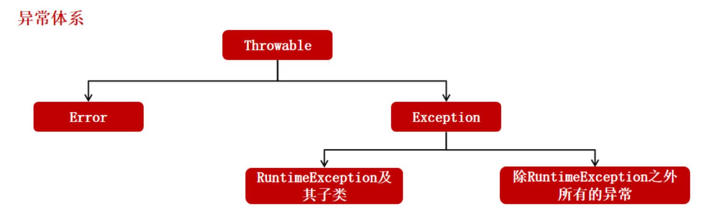
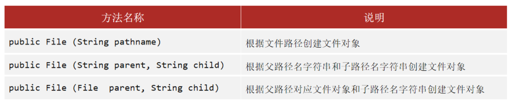
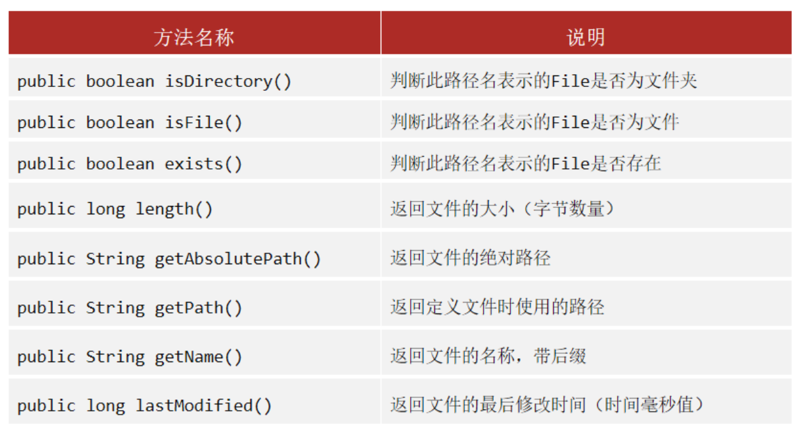
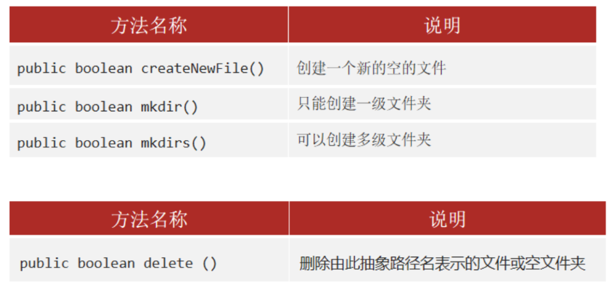

---
tags:
  - Java
createTime: 2025/03/20 15:28:27
title: 2-递归-异常-流-File
permalink: /ToBeABD/Java/b3jkaymp/
outline: [1, 3]
---

---


# 常用的基本Java类

|    类名    | 用途                                                     |
| :--------: | -------------------------------------------------------- |
|  Objects  | 所有的类都直接或间接继承该类（祖宗类），其内的方法都可用 |
|    Math    | 包含基本的数字运算方法                                   |
|   System   | 都是静态方法，可以直接调用                               |
| BigDecimal | 用于解决小数运算中，出现的不精确问题                     |


# 包装类、事件类、递归

## 包装类

**什么是包装类？**

将基本数据类型及一些辅助方法包装成为类，转为引用数据类型，就可以方便操作

---

**基本数据类型对应的包装类**

| 基本数据类型 |    对应的包装类    |
| :----------: | :-----------------: |
|     byte     |        Byte        |
|    short    |        Short        |
|     int     |  **Integer**  |
|     long     |        Long        |
|     char     | **Character** |
|    float    |        Float        |
|    double    |       Double       |
|   boolean   |       Boolean       |

除了int、char的包装类之外，其余基本数据类型的包装类都是首字母大写

---

==【八股】包装类的自动拆箱和自动装箱了解嘛？原理？==

什么是拆箱和装箱：

- 装箱：将基本类型用它们对应的引用类型包装起来
- 拆箱：将包装类型转换为基本数据类型

JDK5之前需要手动拆箱和装箱，不然无法进行运算：

```java
// 手动装箱操作
int i=500;
Integer t = new Integer(i);

// 手动拆箱操作
int i = t.intValue()
```

JDK5之后，有自动拆、装箱操作。基本数据类型和对应的包装类可以直接相互赋值运算，不用担心转换问题。

```java
// 自动装箱
Integer I = 5;	// 等价于：Integer I = Integer.valueOf(5);

//自动拆箱
int i = I;		// 等价于：int i = I.intValue();
```

其中，自动装箱是调用了包装类的 `valueOf()方法`；自动拆箱是调用了 `xxxValue()`方法

---

==【八股】包装类型的缓存机制了解嘛？==

8中常见的基本数据类型，有缓存机制的包装数据类型有5种，另外3中包装数据类型没有缓存机制：

- `Byte、Short、Integer、Long` 创建了数值在[-128, 127]之间对应包装类型的缓存数据
- `Character` 创建了数值在[0, 127]之间的对应包装类型的缓存数据

缓存机制直观的体现就是：2个同一类型的包装数据类型，当数值在缓存机制对应的范围内时，`==`和 `equals()`的比较结果是相等的。

缓存机制的实现原理是：底层定义了一个数组，存有范围内的包装数据类型。在范围内，不会创建新的包装数据类型；在范围外，会创建新的包装数据类型。


## 时间类

时间类总共分为两大部分：jdk8以前的时间类和jdk8以后的时间类，主要特点如下：

|          JDK8以前的时间类          |            JDK8以后的时间类            |
| :--------------------------------: | :------------------------------------: |
|    设计欠妥，使用不方便，已淘汰    |      设计合理，功能丰富，使用方便      |
| 都是可变对象，修改后会丢失原有数据 | 都是不可变对象，修改后返回新的时间对象 |
|             线程不安全             |                线程安全                |
|           只能精确到毫秒           |             可以精确到纳秒             |

jdk8以前的时间类主要有：

```
Date、SimpleDateFormat、Calendar
```

jdk8以后的时间类主要有：

|          时间类别          |                 类                 |
| :------------------------: | :---------------------------------: |
|   日历类（获取当前时间）   | LocalDate、LocalTime、LocalDateTime |
| 日期格式化类（格式化时间） |          DateTimeFormatter          |
|     时间类（获取时间）     |    Instant、ZoneId、ZoneDateTime    |
|   工具类（计算时间间隔）   |    Period、Duration、ChronoUnit    |

## 递归

**什么是递归？**  方法直接或间接的调用本身

刷leetcode的时候就会碰到了


# 异常

## 异常的体系

==【八股】Java的异常体系？==

所有的Java异常均继承父类：`Throwable`，在其下分为两类异常：`Error`和 `Exception`；

`Exception`异常下又分为两类：`RunTimeException`和除了 `RunTimeException`之外的所有异常。

---

==【八股】Error和Exception的区别？==

`Error`：

- 属于程序无法处理的错误，不建议通过 `try...catch`来捕获异常。
- 常见的 `Error`异常有：`OutOfMemoryError、VirtualMachineError`等。
- 这些异常发生时，程序一般选择终止，退出JVM虚拟机。

`Exception`：

- 程序本身可以处理的异常，建议通过 `try...catch`来捕获异常。
- 除了上述体系中的分类方法外，还可以这样分：`Checked Exception`  和 `Unchecked Exception`
  - `Checked Exception`：受检查异常，在编译前就必须进行处理；
    - 包含：`Exception`类别下 `除RunTimeException之外`的所有异常；
    - 常见的类别有：SQLException（与JDBC的API相关操作）、IO相关的异常（IO过程中的文件不存在、网络中断、连接超时等问题）
  - `Unchecked Exception`：不受检查异常，可以不处理；
    - 包含：`Exception下的RunTimeException`；
    - 常见的有：空指针异常（NPE）、数组越界异常等
- 这些异常发生时，可以通过捕获异常，并选择处理逻辑。



---

==【八股】在项目中，对于异常是怎么理解的？如何正确运用异常？==

- 回答异常的体系：上文内容；
- 回答异常的作用：向调用者传递错误信息，并允许调用者根据这些信息做出相应的处理，保证程序的健壮性和可维护性；
- 异常的相关使用场景：
  - 记录发生异常情况的case，用于日志记录；
  - 自定义异常类型，用于全局异常处理；


## 异常的处理方式

==【八股】Java异常的处理方式？==

主要分为两种方式：默认处理和 `try...catch...finally`异常捕获。

默认的处理方式主要分为四步：创建异常、逐层抛出、打印异常、程序终止。

- 创建异常对象：虚拟机在异常代码位置，自动创建一个异常对象：`ArithmeticException`
- 逐层抛出：在出现异常的地方抛出给调用者，再抛出给JVM虚拟机
- 打印异常（接受处理）：虚拟机接收到异常对象后，在控制台输出异常信息
- 程序终止：异常点之后的代码不再运行

另外一种处理方式：

- 在可能出现异常的地方对异常进行捕获，并给出处理方案
- 在异常处理后，代码可以继续运行。

---

==【八股】try...catch...finally怎么使用？==

- `try块`：用于捕获异常，在程序代码可能出现异常的位置使用该块
- `catch块`：用于指定捕获特定异常后的处理逻辑；可以有多个catch块
- `finally`：无论是否捕获或处理异常，该块里面的代码都会执行；如果只有 `try块没有catch块，finally快必须有`，其他情况，可以添加也可以不添加。

---

==【八股】finally块中是否建议使用return语句？若try块或者catch块以及finally块中都有return语句的时候，程序会怎么执行？==

首先，finally块中不建议使用return语句。

其次，try、catch、finally中带有return语句的情况有如下几种：

| Case  | 情况                                               | 是否有问题                                                |
| ----- | -------------------------------------------------- | --------------------------------------------------------- |
| case1 | 仅Finally中带有return语句                          | 没有问题                                                  |
| case2 | 仅Finally中没有带有return语句（try...catch中都有） | 没有问题                                                  |
| case3 | try...catch...finally中都带有return语句            | 有问题（finally中的return值会覆盖try或catch中的return值） |

```java
public static void main(String[] args) {
    System.out.println(f(2));
}

public static int f(int value) {
    try {
        return value * value;
    } finally {
        if (value == 2) {
            return 0;
        }
    }
}

// 结果为0 
```

---

==【八股】try...with...resources和try...catch...finally的区别？==

- 需要手动关闭的资源，比如 `InputStream`、`OutputStream`、`Scanner`、`PrintWriter`等，要用 `try...catch...finally`。
- 实现了 `AutoCloseable`或 `Closeable`接口的对象，可以用 `try...with...resources`，可以自动关闭资源，无需手动处理。

---

**两种方式写法示例**：

- `try-catch-finally`写法

```java
//读取文本文件的内容
Scanner scanner = null;
try {
    scanner = new Scanner(new File("D://read.txt"));
    while (scanner.hasNext()) {
        System.out.println(scanner.nextLine());
    }
} catch (FileNotFoundException e) {
    e.printStackTrace();
} finally {
    if (scanner != null) {
        scanner.close();
    }
}
```

- Java7之后用 `try...with...resources`代替上述写法

```java
// 单资源
try (Scanner scanner = new Scanner(new File("test.txt"))) {
    while (scanner.hasNext()) {
        System.out.println(scanner.nextLine());
    }
} catch (FileNotFoundException fnfe) {
    fnfe.printStackTrace();
}

// 多资源
try (BufferedInputStream bin = new BufferedInputStream(new FileInputStream(new File("test.txt")));
     BufferedOutputStream bout = new BufferedOutputStream(new FileOutputStream(new File("out.txt")))) {
    int b;
    while ((b = bin.read()) != -1) {
        bout.write(b);
    }
} catch (IOException e) {
    e.printStackTrace();
}
```

- 在java9之后，简化上述写法，可以将资源的定义放在try语句前边来实现：

```java
// 单资源
Scanner scanner = new Scanner(new File("test.txt"))
try (scanner) {
    while (scanner.hasNext()) {
        System.out.println(scanner.nextLine());
    }
} catch (FileNotFoundException fnfe) {
    fnfe.printStackTrace();
}

// 多资源
BufferedInputStream bin = new BufferedInputStream(new FileInputStream(new File("test.txt")));
BufferedOutputStream bout = new BufferedOutputStream(new FileOutputStream(new File("out.txt")))
try (bin; bout) {
    int b;
    while ((b = bin.read()) != -1) {
        bout.write(b);
    }
} catch (IOException e) {
    e.printStackTrace();
}
```


## throw和throws的区别

**throw**

- 使用位置：方法中
- 作用：程序运行到此处，若有异常，抛出异常对象
- 时机：人为抛出异常，可以用于日志记录；程序终止。

**throws**

- 使用位置：方法名后面
- 作用：声明该方法存在异常，需要调用者进行处理
- 时机：编写代码时候，若有方法可能在运行过程中出现异常，就用 `throws`创建，以通过编译


# Stream流

用途：简化对集合、数据的一些复杂操作。流操作不会改变原数据。

---

思想：

- 首先：将数据放到流中，获取一个流对象
- 其次：调用中间方法。对流对象进行操作，操作后的返回值依然是流对象，就可以实现**链式调用**
- 最后：调用终结方法。对流对象的最终操作，操作后的流对象不可再用，操作结束

---

特点：

- 中间方法操作后的返回结果，依旧是流对象；
- 终结操作操作后，或有返回结果，结果不再是流对象；或没有返回值
- 被终结方法操作过的流对象，不能再进行中间方法操作；
- stream具有延迟执行的特性，只有调用终端操作的时候，中间操作才会被执行。

---

Stream流的用法

[参考文章](https://blog.csdn.net/qq_43410878/article/details/123716629)


# File类

> 什么是File类？：File类代表操作系统的文件对象（文件、文件夹）


## 从文件/文件夹 -> File类

### File类的创建



```java
package com.itheima.day12.file;

import java.io.File;
import java.io.IOException;

public class FileDemo1 {
    public static void main(String[] args) throws IOException {
        // 根据文件路径创建对象
        File f1 = new File("D:\\A.txt");
        f1.createNewFile();
		// 根据文件夹路径创建对象
        File f2 = new File("D:\\test");
        System.out.println(f2.exists());

        // 根据父路径+子路径名字的字符串创建对象
        File f3 = new File("D:\\", "test");
        System.out.println(f3.exists());

        // 根据父路径对应的文件对象+子路径名字的字符串创建对象
        File f4 = new File(new File("D:\\"), "test");
        System.out.println(f4.exists());
    }
}
```

**File封装的特点**：

- File封装的对象是一个路径，这个路径可以表示文件，也可以表示文件夹；
- File封装的对象所对应的路径，可以存在，也可以不存在。


### File类的常用方法



**【补充】**

针对 `length()`方法：

- 对于文件对象，返回结果就是文件实际的字节个数
- 对于文件夹对象，返回结果与文件夹实际的字节个数有所偏差

```java
public class FileMethodDemo3 {
    public static void main(String[] args) {
        File f1 = new File("D:\\A.txt");
        System.out.println(f1.isDirectory());       // false
        System.out.println(f1.isFile());            // true
        System.out.println(f1.exists());            // true

        System.out.println("----------------------");

        File f2 = new File("D:\\test");

        System.out.println(f1.length());
        System.out.println(f2.length());

        System.out.println("----------------------");

        File f3 = new File("A.txt");
        System.out.println(f3.getAbsolutePath());

        System.out.println("----------------------");

        System.out.println(f1.getName());
        System.out.println(f2.getName());
        System.out.println(f3.getName());

        System.out.println("----------------------");

        long time = f1.lastModified();
        System.out.println(new Date(time));
    }
}
```


### File类遍历方法

```java
package com.itheima.day12.file;

import java.io.File;

public class FileMethodDemo5 {
    /*
        File类的遍历方法 :
            public File[] listFiles() 获取当前目录下所有的  "一级文件对象"  返回 File 数组

     */
    public static void main(String[] args) {
        File f = new File("D:\\test");

        File[] files = f.listFiles();

        for (File file : files) {
            System.out.println(file);
        }
    }
}
```

- 当调用者File表示的路径不存在时，返回null
- 当调用者File表示的路径是文件时，返回null
- 当调用者File表示的路径是需要权限才能访问的文件夹时，返回null
- 当调用者File表示的路径是一个空文件夹时，返回一个长度为0的数组


## 从File类->文件/文件夹

### 文件、文件夹的创建、删除



**注意：delete方法：针对文件（无论是否有内容），都可以删除；针对文件夹，只能删除空的文件夹**

```java
public class FileMethodDemo4 {
    public static void main(String[] args) throws IOException {
        File f1 = new File("src\\com\\itheima\\day12\\B.txt");
        System.out.println(f1.createNewFile());

        File f2 = new File("src\\com\\itheima\\day12\\aaa");
        System.out.println(f2.mkdirs());

        File f3 = new File("src\\com\\itheima\\day12\\C.txt");      // 也是创建的文件夹，C.txt就是文件夹的名字
        															// 创建的是什么，跟路径没关系，跟调用的方法有关
        System.out.println(f3.mkdirs());

        System.out.println(f1.delete());
        System.out.println(f2.delete());
    }
}
```
