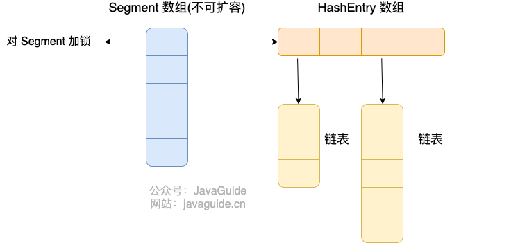

---
tags:
  - Java
createTime: 2025/03/20 15:28:27
title: 3-Java集合
permalink: /ToBeABD/Java/c2ozun1j/
outline: [1, 3]
---
---


# 集合

## 补充 | 泛型

==【八股】什么是泛型？有几种使用方式？==

什么是泛型：

- Java 泛型（Generics）是 JDK 5 中引入的一个新特性；
- 允许在定义类、接口、方法时使用类型参数，类型参数会在具体的实例中被替换，从而使得代码编写更加灵活。

泛型的优点：

- 消除强制的类型转换：使用泛型之后，可以指定数据类型，避免获取集合元素之后，还需要进行类型转换；
- 提高代码的重用性：通过类型参数，编写适用不同类型的代码，提高代码的重用性；

有几种使用方式：

- 三种使用方式：泛型类、泛型接口、泛型方法（静态、非静态）

注意事项：

- 因为静态方法的加载是随着类的加载而加载，所以静态方法不能使用类上定义的泛型，需要自定义自己的泛型；
- 泛型类型不可以是基本数据类型，只能是引用数据类型；
- 泛型接口在实例化的时候，可以保留泛型信息，继续是一个泛型类；可以给定泛型类型，变成一个普通类；

---

==【八股】泛型在编译和运行时，有哪些特点？==

泛型在编译和运行时的特点：

- 编译时，使用泛型标识符作为占位符，来保证类型安全，不会出现非法的类型转换和方法调用
- 编译时，编译器会检查泛型方法的调用，保证传递给泛型方法的参数和返回类型是兼容的
- 在被编译为字节码时，大部分泛型类型信息会被擦除，主要是为了确保早期的Java虚拟机和现有的Java代码兼容

---

==【八股】泛型代码在编译为字节码时哪部分泛型被保留，哪部分是不被保留的？==

泛型擦除时保留的部分：

- 类、接口、方法的签名

泛型擦除时不保留的部分：

- 泛型类型信息：`List<String>`会被擦除为 `List`
- 类型参数信息：`List<T>`会被擦除为 `Object`

---

==【八股】泛型标识符和泛型通配符各自有哪些？有什么区别？==

泛型标识符：

|    E    |          T          |   K   |   V   |    N    |
| :------: | :------------------: | :----: | :----: | :------: |
| Element |         Type         |  Key  | Value |  Number  |
| 集合元素 | 表示任意Java类的类型 | 键类型 | 值类型 | 数值类型 |

泛型通配符：

|                   ?                   |                       ? extends xxx                       |                ? super xxx                |
| :------------------------------------: | :-------------------------------------------------------: | :---------------------------------------: |
|              无边际通配符              |                     固定上边界统配符                     |             固定下边界统配符             |
|                  <?>                  |                       <? extends E>                       |                <? super E>                |
| 泛型可以接受未知类型的数据（任意类型） | 限制泛型可以接受的类型为：xxx及xxx的子类、实现接口xxx的类 | 限制泛型 可以接受的类型为：xxx及xxx的父类 |

区别：

- 泛型标识符：表示一种参数，充当占位符，在实际使用的时候替换为对应的类型。可以修饰接口、类、方法
- 泛型通配符：表示一种未知的类型，通常用在方法上。

泛型使用示例

```java
// 父类
@Data
abstract class Employee {
    private String name;
    private double salary;

    public abstract void work();
}
```

```java
// 继承的子类
class Coder extends Employee {
    @Override
    public void work() {
        System.out.println("程序员写代码...");
    }
}

class Manager extends Employee {
    @Override
    public void work() {
        System.out.println("项目经理分配任务...");
    }
}
```

```java
// 调用
public class GenericsDemo5 {
    public static void main(String[] args) {

        ArrayList<Coder> list1 = new ArrayList<>();
        list1.add(new Coder());

        ArrayList<Manager> list2 = new ArrayList<>();
        list2.add(new Manager());

        method(list1); // 固定上界统配符
        method(list2); // 固定下界统配符
    }

    public static void method(ArrayList<? extends Employee> list){
        for (Employee o : list) {
            o.work();
        }
    }
  
    public static void method1(ArrayList<? super Employee> list){
        for (Object A : list) {
            Employee o = (Employee)A;
            o.work();
        }
    }  
}
```

## 集合 | 基础知识

==【八股】什么是集合？==

Java集合是一种容器，用来装数据对象的引用（非对象本身），类似数组，但集合的长度可变。

---

==【八股】Java集合整体分类？==

Java集合的整体框架如下图所示：


---

==【八股】Java中常见集合的底层数据结构实现？==

集合整体分类：

|          |                        单列集合                        |            双列集合            |
| :------: | :----------------------------------------------------: | :-----------------------------: |
|   区别   |                    一次添加一个元素                    |        一次添加两个元素        |
|   成员   | ArrayList、LinkedList、TreeSet、HashSet、LinkedHashSet | TreeMap、HashMap、LinkedHashMap |
| 接口实现 |                   实现Collection接口                   |           实现Map接口           |

单列集合中的底层数据结构：

|          | List接口 implements Collection接口        | Set接口 implements Collection接口                                                            |
| :------: | :---------------------------------------- | :------------------------------------------------------------------------------------------- |
|   成员   | ArrayList、LinkedList                     | TreeSet、HashSet、LinkedHashSet                                                              |
| 总体特点 | 存取有序、有索引、可以重复存储            | 存取无序、没有索引、不可以重复存储                                                           |
| 底层结构 | ArrayList：数组<br />LinkedList：双向链表 | TreeSet：红黑树<br />HashSet：哈希表（数组+链表+红黑树）<br />LinkedHashSet：哈希表+双向链表 |

双列集合中的底层数据结构：

|          | Map接口                                                                                      |
| :------: | :------------------------------------------------------------------------------------------- |
|   成员   | TreeMap、HashMap、LinkedHashMap                                                              |
| 总体特点 | 存取无序、没有索引、不可以重复存储                                                           |
| 底层结构 | TreeMap：红黑树<br />HashMap：哈希表（数组+链表+红黑树）<br />LinkedHashMap：哈希表+双向链表 |

    其余数据结构的底层实现：

|          | Queue                                                           |
| -------- | --------------------------------------------------------------- |
| 成员     | PriorityQueue、Deque、ArrayDeque                                |
| 总体特点 | 满足先入先出的特点                                              |
| 底层结构 | PriorityQueue：最小堆（动态数组）；<br />ArrayDeque：循环数组； |

[参考文章](https://javabetter.cn/collection/arraydeque.html#%E6%A0%88%E5%92%8C%E9%98%9F%E5%88%97)

---

==【八股】什么时候选用集合？什么时候选用数组？==

当需要存储的数据类型一致且长度固定，就选择数组；否则，选集合。

==【八股】如何选择集合？==

大分类的选择：

- 有键值对，需要查找的情况，选用Map
- 否则，选用Collection

针对Collection集合的选用：

| Case                                                       |    Choice    |
| :--------------------------------------------------------- | :-----------: |
| 如果想要集合中的元素可重复                                 |   ArrayList   |
| 如果想要集合中的元素可重复，而且当前的增删操作明显多于查询 |  LinkedList  |
| 如果想对集合中的元素去重                                   |    HashSet    |
| 如果想对集合中的元素去重，而且保证存取顺序                 | LinkedHashSet |
| 如果想对集合中的元素进行排序                               |    TreeSet    |

针对Map集合的选用：

| Case                                             |      Choice      |
| :----------------------------------------------- | :---------------: |
| 如果想根据集合中的键进行去重                     |      HashMap      |
| 如果想根据键对集合中的元素去重，而且保证存取顺序 |   LinkedHashMap   |
| 如果想根据集合中的键进行排序                     |      TreeMap      |
| 如果想要线程安全                                 | ConcurrentHashMap |

## 集合 | 常用的函数

- [Java集合常见的函数](/ToBeABD/Java/unfp1zj2/)

## 集合 | 常用的遍历方式

- [Java集合的常见遍历方式](/ToBeABD/Java/bl3n4g5y/)

---

==【八股】Java集合常用的遍历方式有哪些？==

针对Collection接口，通用的遍历方式：

- Iterator迭代器遍历
- 增强for遍历（本质还是迭代器）
- Foreach方式遍历（本质是匿名内部类）

针对Collection接口下的List接口集合，额外具备的遍历方式：

- 普通for循环
- ListIterator迭代器

针对Map接口下的集合，额外具备的遍历方式：

- 增强For循环（迭代器）

  - `map.keySet() + map.get(key)`：获取map集合的所有键，并用增强for遍历所有键，然后用get方法获取每一个键对应的值
  - `map.values()`：获取map集合的所有值，进行遍历
  - `map.entrySet() + entry.getKey() + entry.getValue()`：获取map集合的Entry对象，每个对象里面包含键和值
- 通过forEach方法遍历

  - `map.forEach`：直接获取每一个集合对象的键和值，进行遍历操作

---

==【八股】ListIterator和Iterator的区别==

两者的区别主要体现在遍历过程中添加、删除元素上。具体见下表：（表中的方法均在遍历过程中使用）

|                                                                  | 仅add()             | 仅remove() |
| ---------------------------------------------------------------- | ------------------- | ---------- |
| 不管在任何迭代过程中，调用集合本身的方法                         | 引发异常            | 引发异常   |
| 在 `Iterator`迭代过程中，调用 `Iterator`迭代器的方法         | 不支持（无add方法） | 支持       |
| 在 `ListIterator`迭代过程中，调用 `ListIterator`迭代器的方法 | 支持                | 支持       |

针对 `ListIterator`迭代器：

- 删除操作：删除当前迭代到的数据
- 添加操作：添加数据到当前迭代到的数据后面
- **在一个迭代内，不允许既增加，又删除，会报错**

```java
package com.itheima.collection.list;

import java.util.ArrayList;
import java.util.Iterator;
import java.util.List;
import java.util.ListIterator;

public class ListDemo3 {
    public static void main(String[] args) {

        List<String> list = new ArrayList<>();

        list.add("眼瞅着你不是真正的高兴");
        list.add("温油");
        list.add("离开俺们这旮表面");
        list.add("伤心的人别扭秧歌");
        list.add("私奔到东北");

        ListIterator<String> it = list.listIterator();
        while (it.hasNext()) {
            String s = it.next();
            if ("温油".equals(s)) {
                it.add("哈哈");  		// 迭代器的添加操作：没问题
                it.remove();		 // 迭代器的删除操作：没问题（但是和上边的添加操作放在一个迭代内，就报错了）
                list.add("哈哈"); 	// 集合本身的添加操作：报错
                list.remove("温油"); 	// 集合本身的删除操作：报错
            }
        }
        System.out.println(list);
    }
}
```

# 八股 | Collection接口

## List接口

==【八股】ArrayList和Array的区别？==

|            | ArrayList                                    | Array                                        |
| ---------- | -------------------------------------------- | -------------------------------------------- |
| 实现上     | 动态数组，在创建时不需要指定长度，且长度可变 | 静态数组，在创建时需要指定长度，且长度不可变 |
| 泛型使用上 | 允许使用                                     | 不允许使用                                   |
| 存储对象上 | 只能存储引用数据类型                         | 基本数据类型、引用数据类型都可以存储         |
| 元素访问   | 支持索引访问、元素访问                       | 只能进行索引访问                             |
| 元素操作   | 增删改查都支持；具备动态添加、删除的能力     | 增删改查都支持；不具备动态添加、删除的能力   |

==【八股】ArrayList相关操作的时间复杂度?==

| 方法             | 时间复杂度                                |
| ---------------- | ----------------------------------------- |
| 头部插入         | O(n)                                      |
| 尾部插入         | 容量不到极限：O(1);<br />容量到极限：O(n) |
| 指定位置插入     | O(n)                                      |
|                  |                                           |
| 头部删除         | O(n)                                      |
| 尾部删除         | O(1)                                      |
| 指定位置删除     | O(n)                                      |
|                  |                                           |
| 根据索引查找元素 | O(1)                                      |
| 根据元素查找元素 | O(n)                                      |

---

==【八股】ArrayList的扩容原理？==

在实例化ArrayList的时候：

- 空参构造时，底层创建长度为10的数组（JDK6以后）
- 带参构造时，若指定长度，则创建指定长度的数组

ArrayList的扩容发生在添加元素的时候，即执行add()方法的时候：

- 当数组还有空间，添加元素不会引发数组扩容
- 当数组空间被填满，进行数组扩容，将容量扩大为原先的1.5倍；
- 将原数组元素复制到新数组中

然后继续添加元素，进行是否扩容的条件判断。

---

==【八股】LinkedList相关操作的时间复杂度？==

| 方法              | 时间复杂度 |
| ----------------- | ---------- |
| 头部插入/删除     | O(1)       |
| 尾部插入/删除     | O(1)       |
| 指定位置插入/删除 | O(n)       |
|                   |            |
| 根据索引访问元素  | O(n)       |
| 根据元素访问元素  | O(n)       |

---

==【八股】LinkedList 为什么不能实现 RandomAccess 接口？==

RandomAccess接口是一个标识，表示该数组支持随机访问，即：支持按照索引快速访问元素（O(1)的时间复杂度）。

LinkedList的底层实现是链表，内存地址不连续。虽然支持索引访问，但是时间复杂度是O(n)，因此不能实现该接口

---

==【八股】LinkedList接口 `get(int index)`方法的实现原理是什么？==

将索引大小与集合长度进行对比：

- 若索引更靠近头部（index < n/2）：从头往尾，一个一个结点的找数据。
- 若索引更靠近尾部（index > n/2）：从尾往头，一个一个结点的找数据。

该方法的综合时间复杂度：O(n)


## Set接口

==【八股】TreeSet实现排序功能的方式有几种？优先级是什么？==

TreeSet有两种方式实现排序：

- 第一种：让存入TreeSet中的类实现Comparable接口，定义自己的排序规则。
- 第二种：自定义Comparator比较器，在TreeSet初始化的时候传入。

针对第一种排序方式：

- 常见的类：比如String类，底层已经实现该接口，默认排序方式为增序
- 自定义类：可以按照如下规则，自定义排序方式

针对第二种排序方式：

- 在实例化TreeSet的时候，自定义一个比较器，作为参数传入TreeSet

两种排序方式的优先级是：若两种排序方式都存在，优先按照比较器的排序规则。

- 优先按照比较器的排序规则，可以自定义增序或降序，且不用更改底层代码；
- 重写类的底层代码来实现排序，不仅不方便，且只能有一种排序方式，需要更改排序方式就得再次重写底层代码。

---

【补充】怎么方便记忆是增序排序还是降序排序？

- 实现Comparable接口：this.xx - o.xx，增序
- 自定义Comparator比较器：o1.xxx - o2.xxx，增序

---

==【八股】HashSet的无序性和不可重复性怎么理解？==

- 无序性：不等于随机性，指存储的数据在底层数组中不是按照索引的顺序添加，而是根据数据的哈希值决定
- 不可重复性：指添加元素时，先按照 `hashCode()`方法，确定元素索引位置；然后按照 `equals()`方法进行比较，返回false()的时候，才能添加元素。需要重写存储对象的 `equals()`和 `hashCode()`方法

---

==【八股】HashSet的底层数据结构？存储数据的过程？==

HashSet的底层数据结构：

- 在JDK7以前：数组+链表
- 在JDK8以后：数组+链表+红黑树

存储过程：

- 对于每个存入的元素，需要重写自身的 `hashCode()`和 `equals()`方法
- 首先调用 `hashCode()`方法，将结果与数组长度求余，确定元素在数组中的位置
  - 如果该位置没有元素，直接存
  - 如果该位置有元素：调用 `equals()`方法，与该位置的元素进行比较。不是同一个元素，存储；是同一个元素，不存储

---

==【八股】数组扩容时机？链表转红黑树的时机？==

首先创建一个默认长度为16的数组，数组名为table，加载因子为0.75。

- 数组扩容的条件：当数组中元素数量 > 数组长度*加载因子。每次扩容，数组长度为**原先长度**的2倍
- 链表转红黑树的条件：当一条链表的元素数量达到8个以后 && table数组的大小达到64

---

==【八股】HashSet中不同数据在一个链表中的存入方式？==

- 在JDK7及以前，采用头插法：新元素占老元素位置，指向老元素
- 在JDK8及以后，采用尾插法：新元素挂在老元素下面

---

==【八股】HashSet增删改查的时间复杂度==

在不考虑Hash冲突的情况下，增删改查的平均时间复杂度均为O(1)

---

==【八股】LinkedHashSet的底层数据结构是什么？==

哈希表 + 双向链表。图示如下：


# 八股 | Map接口

==【八股】HashMap采用什么方法解决Hash冲突？==

HashMap采用**链地址法**解决Hash冲突：Hash结果相同的元素，在数组同一个索引下，以链表的形式存储。

此外解决Hash冲突的方法还有：

- **开放定址法**：Hash冲突时，以第一次Hash的结果为输入，再次进行Hash，直到不冲突
- **再Hash法**：Hash冲突时，换一个Hash函数进行Hash，直到不冲突

---

==【八股】HashMap和HashSet的区别及联系？==

相同点：

- 底层实现是一样的，都是HashMap；
- 都能对元素去重

不同点：

- HashSet的键就是存储的元素，值存储的是一个固定的对象（`PRESENT`，本质是 `new Object()`）；
- HashSet允许存储一个 `null`元素；HasMap允许存储一个 `null`键和多个 `null`值；

---

==【八股】HashMap的扩容和缩容过程会发生什么？==

HashMap扩容条件：

- 数组扩容条件：元素数量 > 数组长度 * 加载因子
- 链表转红黑树条件：当一条链表的元素数量达到8个以后 && table数组的大小达到64

HashMap扩容后，有哪些操作：

- Rehash操作：重新计算map中原有元素在扩容后新数组中的位置
- 分配元素：按照Rehash的结果，将元素分配到对应的数组索引下

HashMap的缩容操作：

- 首先，HashMap本身不具备缩容操作。若是人为缩容，可能会出现Hash冲突
- 如果人工缩容，也大概是两个步骤：Rehash + 分配元素

---

==【八股】HashMap和TreeMap的区别？==

共同点：两者都能对集合中的元素进行去重；

不同点：相比较于HashMap，TreeMap主要多了对集合内元素的排序功能（根据键）以及对集合内元素的搜索能力

---

==【八股】HashMap的长度为什么是2的幂次方？==

目的：为了HashMap能够高效的进行Hash运算；为了能使数据均匀的分散在数组各个索引下。

原理：在进行元素存入的时候，会对元素的hash值进行取模运算，来确定元素存入在数组中的索引位置。

- 正常的取模运算方式：

```
hash % n

hash：表示元素的哈希值；
n：表示数组的长度。
```

- 在计算机中，位运算的效率更高，而且在如下特定情况下，取模运算可以用相应的位运算来实现，且扩容后的长度依旧是2的幂次方，依旧可以使用位运算：

```
hash%n <=> (n-1) & hash		当n是2的幂次方
```

- `n-1`除了最高位是0，其余位都是1，即低位均可参与运算，就使得Hash分布比较均匀。当然，Hash函数自身的好坏也是影响分布是否均匀的一个重要因素。

所以在HashMap的底层，数组的长度是2的幂次方，取模运算也是用的位运算。

---

==【八股】HashMap为什么是线程不安全的？==

[参考文章](https://blog.csdn.net/qq_46074155/article/details/120072178)

在多线程环境下，HashMap存在数据丢失和扩容时造成死循环的问题（这两个问题也可以单独是一个八股）

首先是《扩容时造成死循环问题》:

- JDK7及以前，HashMap采用头插法，将新数据插入到链表中。

  ```
  在并发环境下，若一个桶位中有多个元素需要扩容，头插法会导致链表中的结点指向错误的位置，从而出现死循环问题。
  （具体原理可以看上述参考文章）
  ```
- JDK8及以后，HashMap采用尾插法，解决了这个问题

其次是《存在数据丢失问题》：

- 数据丢失问题在JDK7前后都存在

  ```
  假设线程1和线程2所put的元素在同一个桶内，且当前桶内没有数据
  
  - 假设线程1进行hash判断后，cpu执行权被线程2抢走。线程2完成数据写入操作
  - 随后线程1抢回cpu执行权，因为已经完成了hash判断，线程1认为这个地方没有数据，直接进行写入操作
  
  综上，就导致了线程2添加的数据被覆盖掉，存在数据丢失问题。
  ```

---

==【八股】ConcurrentHashMap线程安全的实现方式==

**在JDK8以前，**ConcurrentHashMap采用：Segment数组结构 + HashEntry数组结构来保证并发安全，图示如下：



- Segment是一个数组，长度固定为16；HashEntry用于存储键值对数据。
- 一个元素存储Map，需要经过两次hash：一次hash找到元素对应的segment，另一次hash找到元素在HashEntry数组中对应的位置。
- 当对ConcurrentHashMap进行写入数据操作时，会对Segment加锁（ReentrantLock锁），防止其他线程对该Segment进行修改。

**在JDK8以后，**ConcurrentHashMap采用：Node + CAS + synchronized来保证并发安全，图示如下：


- 底层实现跟HashMap1.8类似（数组+链表/红黑树）；
- 常规写入操作：对Node加CAS锁，保证数据安全，也减少了锁冲突；
- 特殊情况（链表转红黑树、红黑树重平衡）：对Node加sync锁；

**在ConcurrentHashMap的两种实现下：**

- 在JDK8中，锁的颗粒度更小了。Segment锁一次锁定多个链表；Node锁一次仅锁定一个链表/红黑树；
- 在JDK8中，支持的并发度更高了。Segment锁最高支持16的并发度；Node锁支持更高的并发度；

**CAS和Sync两种锁的使用场景：**

- 大部分情况下，尽量使用CAS乐观锁机制来处理并发场景的写入操作；
- 在链表变红黑树，或者红黑树的重平衡及大规模修改场景，会使用Sync锁来保证数据安全。

---

==【八股】ConcurrentHashMap 为什么 key 和 value 不能为 null？==

主要是为了避免二义性。若key或value为null，有两种情况：

- 键不存在，默认为null
- 键存在，键的值为null

在多线程环境下，不容忍二义性的存在。

而HashMap中允许键为null，也是因为：单线程环境下，可以容忍上述二义性的存在；多线程环境下不能容忍。

---

==【八股】ConcurrentHashMap能保证复合操作的原子性嘛？==

ConcurrentHashMap本身是线程安全的，但是不能保证复合操作的原子性。复合操作是指：由多个基本操作组成的操作（比如put、get、remove）

要想保证复合操作的原子性，有两种方法：

- 加synchronized锁：可以使用但不推荐，违背了CurrentHashMap的初衷。【这种方式相当于对整个ConcurrentHashMap加锁】
- 使用ConcurrentHashMap提供的复合操作：推荐使用，例如：`putIfAbsent、computeIfAbsent`等

---
