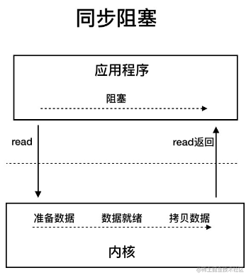
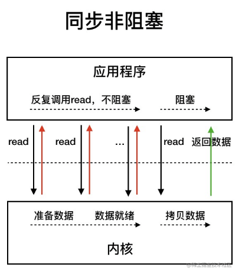
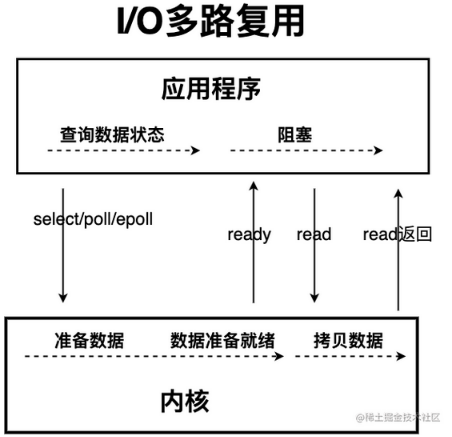
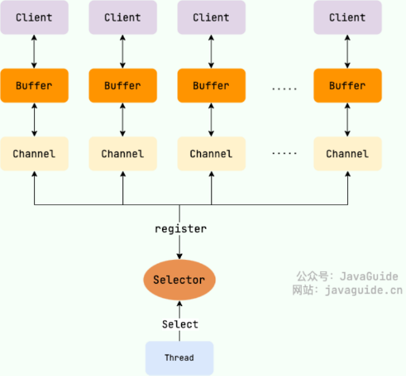
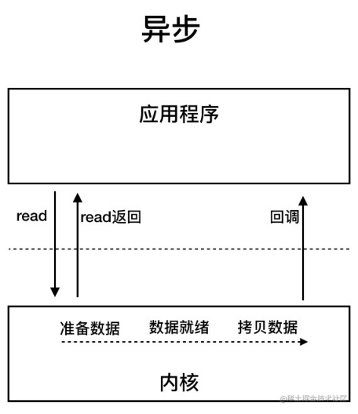

---
tags:
  - Java
createTime: 2025/03/20 15:28:27
title: 4-Java的IO
permalink: /ToBeABD/Java/on5fiz2k/
---
---

## 概述

IO方面问概念，不会问某个IO怎么写，太变态了。

## IO基本概念

### 常见的IO模型

- [参考文章](https://javaguide.cn/java/io/io-model.html)

#### BIO（Blocking I/O）

==【八股】BIO的工作流程？==

图示：



模型特点：

- 应用程序发起 `read`调用，会一直阻塞（准备数据，数据就绪，拷贝数据这三个状态都阻塞），直到内核把数据拷贝到用户空间

适用场景：

- 适用于客户端连接数量不高的情况。当并发量上来之后，BIO模型就乏力了

---

==【八股】Java中BIO的底层实现？==

BIO的底层实现是：输入流、输出流。通过流处理来阻塞式的进行IO操作。

代码示例 - 服务端：

```java
public class BIOServer {

    public static void main(String[] args) throws IOException {
        // ********************建立连接***********************
        ServerSocket serverSocket = new ServerSocket(9999);
        Socket socket = serverSocket.accept();				// 阻塞等待客户端连接到来；
        InputStream in = socket.getInputStream();			// 获取输入流，客户端向服务端写数据；
        OutputStream out = socket.getOutputStream();		// 获取输出流，服务端向客户端写数据；

        // ********************处理数据***********************
        while (true){
			// 将数据读到buf中
            byte[] buf = new byte[32];				  
            int len = in.read(buf);
            if(len == -1){
                throw  new RuntimeException("连接已断开");
            }
            System.out.println("recv:" + new String(buf, 0, len));

            // 将数据再写回客户端
            out.write(buf, 0, len);
        }
    }
}

```

代码示例 - 客户端：

```java
public static void main(String[] args) throws IOException, InterruptedException {
        // ********************建立连接***********************  
        Socket socket = new Socket("127.0.0.1", 9999);
        InputStream in = socket.getInputStream();
        OutputStream out = socket.getOutputStream();
        byte[] send = "hello".getBytes();
  
        // ********************处理数据***********************
        while (true){
            // 给服务端发送数据
            out.write(send);
  
            // 从服务端接收数据
            byte[] buf = new byte[32];
            int len = in.read(buf, 0 , send.length);
            if(len == -1){
                throw  new RuntimeException("连接已断开");
            }
            System.out.println("recv:" + new String(buf, 0, len));
  
            // 控制发数据的频率
            Thread.sleep(1000);
        }
    }
```

#### NIO（Non-Blocking I/O）

==【八股】NIO的工作流程？==

演进 | 非阻塞调用read：



演进 | IO多路复用：



模型特点：

- `非阻塞调用read`：

  - 这种方式的思路是将read函数设置为非阻塞;
  - 用户可以反复发起 `read`调用，在准备数据和数据就绪阶段是不阻塞的；但是在拷贝数据阶段，仍然是阻塞状态；
- `IO多路复用`：

  - 通过 `select/poll/epoll`的调用，来监听内核数据是否准备就绪；
  - 内核数据准备就绪，向应用程序发信号，用户程序进行read调用；
- 对比BIO，仅在准备数据、数据准备就绪阶段是非阻塞的，在拷贝数据阶段仍然是阻塞的。

适用场景：

- 有大量客户端连接

---

==【八股】NIO的底层实现？==

> [参考文章](https://blog.csdn.net/qq_18297675/article/details/100628025#t3)

NIO的底层实现是基于Buffer、Channel、Selector的概念：



- `Buffer`：作为存储数据的容器，存储即将被读取或写入的数据；
- `Channel`：双向通信的通道，支持非阻塞操作；可以直接与Buffer进行数据交互；
- `Selector`：用于管理多个通道的组件；可以注册通道并设定感兴趣的类型（连接、写、读）；可以监听一个或多个通道变为可读、可写或可连接状态；

---

代码示例 -- 服务端：

```java
public class NIOServer {
    public static void main(String[] args) throws IOException {
        // ********************建立连接***********************  
        ServerSocketChannel serverSocketChannel = ServerSocketChannel.open().bind(new InetSocketAddress(9999));
        //设置为非阻塞模式
        serverSocketChannel.configureBlocking(false);					  

        // ********************注册通道，监听感兴趣的事件***********************  

        // 新创建一个selector
        Selector selector = Selector.open();
        // 将该通道注册到该selector上，并且注明感兴趣的事件：因为是服务端通道，所以只对accept（连接事件）感兴趣
        serverSocketChannel.register(selector, SelectionKey.OP_ACCEPT);
  
        // ********************处理数据***********************  
        while (true){
            /**
            	selector会帮我们去轮询，检测当前是否有我们感兴趣的事件发生，一直阻塞到有为止
	            select还有一个方法，可以指定阻塞时间，超过这个时间就会返回，此时可能返回的key个数为0
            */
            selector.select();
  
            // 若返回的key个数不为0，那么就可以一一处理这些事件
            Set<SelectionKey> selectionKeys = selector.selectedKeys();
            Iterator<SelectionKey> iterator = selectionKeys.iterator();
            while (iterator.hasNext()){
                SelectionKey selectionKey = iterator.next();

                /**
                	上述代码获取的已经有事件就绪的事件集合 跟 selector内部轮询，监听就绪事件，并写入事件集合，是一个东西
                	所以此处进行删除操作，避免下次获取就绪事件的时候，重复处理该事件
  
                	简单来说：在外，只对set进行删除操作，进行add操作会抛出异常；在内，只对set进行add操作；
                */
                iterator.remove();
  
        		// ********************事件处理，以及更改感兴趣的事件类型***********************  
  
                // SelectionKey.OP_ACCEPT事件
                if(selectionKey.isAcceptable()){
                    SocketChannel socketChannel = ((ServerSocketChannel) selectionKey.channel()).accept();
                    socketChannel.configureBlocking(false);
                    socketChannel.register(selector, SelectionKey.OP_READ);

                // SelectionKey.OP_READ事件：
                } else if(selectionKey.isReadable()){
                    SocketChannel socketChannel = (SocketChannel)selectionKey.channel();
                    // NIO规定，必须要用Buffer进行读写
                    ByteBuffer buffer = ByteBuffer.allocate(32);
                    int len = socketChannel.read(buffer);
                    if(len == -1){
                        throw  new RuntimeException("连接已断开");
                    }
  
                    //上面那一步只是读到缓冲区，这里是从缓冲区真正的拿出数据
                    byte[] buf = new byte[len];
                    buffer.flip();
                    buffer.get(buf);
                    System.out.println("recv:" + new String(buf, 0, len));

                    //注册写事件
                    selectionKey.interestOps(selectionKey.interestOps() | SelectionKey.OP_WRITE);
  
                //SelectionKey.OP_WRITE事件
                } else if(selectionKey.isWritable()){
                    SocketChannel socketChannel = (SocketChannel)selectionKey.channel();
  
                    // 写数据，也要用Buffer来写
                    int len = socketChannel.write(ByteBuffer.wrap("hello".getBytes()));
                    if(len == -1){
                        throw  new RuntimeException("连接已断开");
                    }
                    // 这里为什么要取消写事件呢？ 因为只要底层的写缓冲区不满，就会一直收到这个事件。所以只有想写数据的时候，才要注册这个写事件
                    // 或者是只希望在特定情况下，处理写事件；
                    selectionKey.interestOps(selectionKey.interestOps() & ~SelectionKey.OP_WRITE);
                }
            }
        }
    }
}

```

代码示例 -- 客户端：

```java
public class NIOClient {
    public static void main(String[] args) throws IOException, InterruptedException {
        // ====== 创建客户端socket通道 & 连接host:port
        SocketChannel socketChannel = SocketChannel.open();
        //设置为非阻塞模式
        socketChannel.configureBlocking(false);
        // 非阻塞的形式连接服务器，如果直接使用open带参数的，连接的时候是阻塞连接
        socketChannel.connect(new InetSocketAddress("127.0.0.1", 9999));

        //新创建一个selector
        Selector selector = Selector.open();
        //将该通道注册到该selector上，并且注明感兴趣的事件
        socketChannel.register(selector, SelectionKey.OP_CONNECT | SelectionKey.OP_READ);
  
        while (true){
            selector.select();
            Set<SelectionKey> selectionKeys = selector.selectedKeys();
            Iterator<SelectionKey> iterator = selectionKeys.iterator();
            while (iterator.hasNext()){
                SelectionKey selectionKey = iterator.next();
                iterator.remove();

                //连接事件
                if(selectionKey.isConnectable()){
                    // 看源码的注释可以知道，如果不使用带参数的open，那么需要手动调用这个方法完成连接
                    // 如果是阻塞模式，该方法会阻塞到连接成功，非阻塞模式下，会立刻返回，已连接true，未连接false
                    if(socketChannel.finishConnect()){
                        // 需要取消连接事件，否则会一直触发该事件,注册写事件
                        selectionKey.interestOps(selectionKey.interestOps() & ~SelectionKey.OP_CONNECT | SelectionKey.OP_WRITE);
                    }
                } else if(selectionKey.isReadable()){
                    ByteBuffer buffer = ByteBuffer.allocate(32);
                    int len = socketChannel.read(buffer);
                    if(len == -1){
                        throw  new RuntimeException("连接已断开");
                    }
                    byte[] buf = new byte[len];
                    buffer.flip();
                    buffer.get(buf);
                    System.out.println("recv:" + new String(buf, 0, len));
                    selectionKey.interestOps(selectionKey.interestOps() | SelectionKey.OP_WRITE);
                } else if(selectionKey.isWritable()){
                    int len = socketChannel.write(ByteBuffer.wrap("hello".getBytes()));
                    if(len == -1){
                        throw  new RuntimeException("连接已断开");
                    }
                    selectionKey.interestOps(selectionKey.interestOps() & ~SelectionKey.OP_WRITE);
  
                    //这个只是控制一下发送数据的速度
                    Thread.sleep(1000);
                }
            }
        }
    }
}
```

#### AIO（Asynchronous I/O）



模型特点：

- 基于事件和回调机制来实现，即用户发起 `read`操作后会直接返回结果，不会阻塞，当后台处理完成之后（三个阶段都完成），会通过回调的形式通知线程，进行后续操作；
- AIO是不阻塞的，在准备数据、数据就绪、拷贝数据三个阶段都是不阻塞的；

适用场景：

- 应用场景较少，因为AIO对比NIO，并没有多少的效率提升。

### 八股

==【八股】当100个请求到来，NIO和BIO分别会开启多少个线程？==

- BIO：会开启100个线程，每个线程操作一个请求。
- NIO：会开启1个线程，NIO中引入select概念，可以监控多个通道的读写，即使100的请求来，也只用1个线程处理。

---

==【八股】文本文件、视频文件各自采用哪种流来处理（字符流？字节流？）==

文本文件采用字符流来处理：在处理纯文本数据时，特别是中文文本，用字符流更合适，可以很好的支持Unicode字符，对不同国家的语言支持性较好；

视频文件采用字节流来处理：视频文件在计算机上的存储形式就是二进制的，字节流在处理二进制对象时更方便。

---

==【八股】Java中BIO和NIO的区别？==

|   特点   | BIO                | NIO                                        |
| :------: | ------------------ | ------------------------------------------ |
|  IO模式  | 阻塞IO             | 非阻塞IO                                   |
| 操作方式 | 面向字节/字符      | 面向块/缓冲                                |
| 线程模型 | 一个线程操作一个IO | 一个线程操作多个IO                         |
| 并发处理 | 多线程处理多个IO   | Selector实现IO多路复用：单一线程处理多个IO |
| 数据读取 | 逐字节读取         | 批量读取到缓冲区                           |
| 文件处理 | 顺序文件读取/写入  | 支持随机访问、内存映射文件                 |
|   性能   | 适合简单的IO       | 适合高并发、高性能的IO                     |
