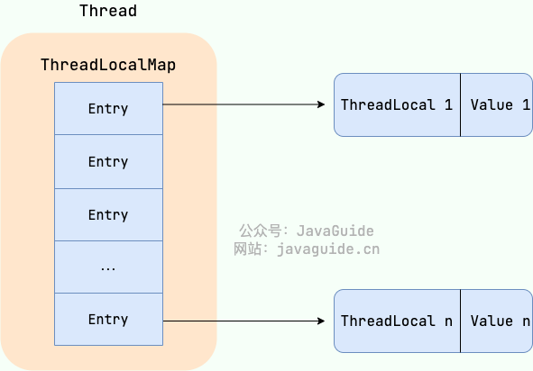

---
tags:
  - Java
createTime: 2025/03/20 15:28:27
title: 5-多线程-并发编程
permalink: /ToBeABD/Java/m8ryxnq1/
---
---

## JUC | 基本概念

==【八股】你了解juc吗？juc包下有哪些常用的类？==

- 线程池：`ThreadPoolExecutor`
- 阻塞队列：`ArrayBlockingQueue`、`DelayQueue`
- 锁相关：`ReentrantLock`
- 同步工具类：`Semaphore`、`CountDownLatch`
- 并发集合：`ConcurrentHashMap`、`CopyOnWriteArrayList`

### 进程和线程的概念

> 单纯线程和进程的一些概念，在【操作系统】的总结里面看相关内容；
>
> 与Java相关的进程、线程概念，还在本文件后文中查看。

==【八股】多线程和多进程的区别？==

资源共享与同步的区别：

- 多进程：数据分开。共享数据较难，但是同步操作简单
- 多线程：数据共享。共享数据简单，但是同步操作较难

资源占用：

- 多进程：每个进程占用独立的地址空间，多进程整体占用较多的系统资源
- 多线程：每个线程共享进程的地址空间，多线程整体占用较少的系统资源

独立性：

- 多进程：每个进程相互独立，一个进程的崩溃不会影响另一个进程的运行；
- 多线程：虽然每个线程也相互独立（有自己的运行栈和程序计数器），但是共享一个进程的地址空间，所以一个线程的崩溃可能导致整个进程的崩溃；

---

==【八股】Java线程和操作系统线程的区别？==

JDK2以前，Java线程是绿色线程，是用户级线程；JDK2以后，Java线程是内核线程，这个时候可以说：Java线程的本质就是操作系统的线程。

内核线程和用户线程的各自特点：

- 用户线程：创建和切换成本低，但是不可以利用多核
- 内核线程：创建和切换成本高，可以利用多核

---

==【八股】线程模型有哪些？Java的线程模型是什么？==

线程模式是指：用户线程和内核线程的关联方式。常见的线程模型主要有三种：

- 一对一：一个用户线程对应一个内核线程
- 多对一：多个用户线程对应一个内核线程
- 多对多：多个用户线程对应多个内核线程

在Win和Linux等主流操作系统中，Java的线程模型是：一对一

---

==【八股】线程的生命周期和状态？==

如下图示：（图中运行状态是不存在的，仅为了理解）


- 新建状态 | NEW：线程刚被创建还没有调用start()方法
- 就绪状态 | RUNNABLE：线程被调用了start()方法，起始线程有执行资格，可能没有执行权。假定有执行权，线程进入运行状态
- 阻塞状态 | BLOCKED：当前线程想要获取一个对象锁，但是这个锁被其他线程占用着，线程就会进入阻塞状态。当获取到锁，线程进入就绪状态。
- 等待状态 | WAITING：表示该线程需要等待其他线程做出一些特定动作。使得线程进入等待状态的情况有：

  - 调用 `Object`类的 `wait()`方法：线程会进入等待状态，唤醒方式：另一个线程调用 `Object.notify()`或 `Object.notifyAll()`方法来唤醒该线程；
  - 调用 `Thread`类的 `join()`方法：当一个线程A调用 `join()`方法，参数为另一个线程B时，当前线程A会等待直到被 `join()`的线程B执行完毕，才会执行线程A `join()`方法所在行后续的代码。
- 计时状态 | TIMED_WAITING：在一定时间后，可转为就绪状态，不需要被唤醒。使得线程进入计时等待的情况有：

  - 调用 `Thread`类的 `sleep(long millis)`方法
- 结束状态 | TERMINATED：当线程执行完run()方法中的内容后。

### JMM（Java内存模型）

==【八股】什么是JMM？为什么需要JMM？JMM的用途？==

概念：JMM是Java内存模型的意思（Java Memory Model）

为什么要JMM？

- 一般来说，编程语言可以直接复用操作系统层面的内存模型。但是不同的操作系统，内存模型有所差异，可能导致一套代码在另一个平台上无法运行；
- Java是一门跨平台的语言，就需要自己提供一套内存模型来屏蔽操作系统之间的差异。

JMM的用途？

- 可以把JMM看作是Java定义的并发编程相关的一组规范，其目的是为了简化多线程编程，增强程序的可移植性；
- 除了抽象线程与主内存之间的关系之外，还规定了从Java源代码到CPU可执行指令的这个转化过程中要遵守的原则和规范。

## JUC | 锁

### 基本概念

==【八股】什么是锁机制？==

- Java中的锁机制是一种同步机制，用于控制多个线程之间对共享资源的访问；
- 锁机制能保证同一时刻只有一个线程能访问共享数据，从而保证数据的一致性。

### 死锁

==【八股】什么是死锁？死锁发生的条件？如何避免死锁？==

死锁是一种Bug现象：多个线程同时被阻塞，都在等待对方释放锁资源，从而进入无限期的等待状态。

死锁发生的条件（4个）：

- 【资源互斥】：该资源任意一个时刻只能被一个线程占用
- 【请求与保持条件】：一个线程因请求资源未果而进入阻塞状态时，自身已经获取到的锁保持持有，不释放
- 【不可剥夺条件】：线程获得的资源，在没有使用完毕之前，不会被其他线程强制剥夺，只有自己使用完毕后释放。
- 【循环等待】：若干线程形成一个头尾衔接的循环资源等待关系。

如何避免死锁？破坏造成死锁的必要条件即可

---

==【八股】假设代码本身有问题，该怎么排查死锁现象？怎么解决死锁问题？==

排查死锁现象：

- 使用工具/相关命令，检查线程状态，来判断是否有线程死锁的情况出现；

解决死锁问题：

- 若有多个互斥的资源，指定一个一致的获取顺序，只有在获得前边的锁之后，才能获取后续的锁；

### 乐观锁和悲观锁

==【八股】讲一下悲观锁和乐观锁？==

**悲观锁**：总是假设最坏的情况，认为每次访问共享资源时都会出现问题，所以在获取资源进行操作的时候就上锁，不让别的线程获取操作该资源。

- 资源访问特点：共享资源一次只能给一个线程用，其他获取该资源的线程进入阻塞状态，等待该共享资源的锁释放。
- Java中的实现：`synchronized`、`ReentrantLock`
- 特点：在高并发场景下，悲观锁会有大量的线程阻塞，导致频繁的上下文切换，增加提供开销，还可能造成死锁问题。

**乐观锁**：总是假设最好的情况，认为每次访问共享资源都不会有问题，线程不需要加锁，也不需要等待，**只是**在提交资源的时候，验证资源是否被其他线程修改。

- 资源访问特点：不需要加锁，线程不需要进入阻塞状态，共享资源可以供不同的线程访问。
- Java中的实现：JUC的 `atomic`包里面的原子类：`AtomicInteger`、`LongAdder`等。
- 特点：在高并发场景下，乐观锁不会造成线程阻塞，也不会有死锁；但如果写冲突频繁发生的话，会频繁导致重试，造成CPU飙升。
- 乐观锁的实现手段：版本号机制和CAS算法。

---

==【八股】乐观锁的版本号机制实现原理？==

基本原理：

- 前提：在数据表中加入一个版本字段Version
- 步骤1：在读取数据以作更新的时候，除了读取数据以外，也读取这个版本号，记录下来
- 步骤2：在提交更新操作的时候，先对比数据库中现有的版本号和自身保存的版本号是否一致：
  - 步骤3：若版本一致，数据没有被修改过，提交更新操作，结束；
  - 步骤4：若版本不一致，证明数据被别的线程修改过，不能提交更新操作。从步骤1开始，重新按步骤操作，直到更新成功。

特点：

- 不会造成死锁的情况，不会造成线程阻塞
- 写操作多的话，可能会造成冲突频繁，会导致CPU使用率飙升

---

==【八股】乐观锁的CAS算法实现原理？==

参考文章：[JavaGuide](https://javaguide.cn/java/concurrent/optimistic-lock-and-pessimistic-lock.html#%E5%A6%82%E4%BD%95%E5%AE%9E%E7%8E%B0%E4%B9%90%E8%A7%82%E9%94%81)

基本原理：

- CAS是一种思想，通过用一个预期值和要更新的变量值进行比较，两者相等才能进行更新操作；
- CAS涉及三个操作数：V（Var）- 要更新的变量值、E（Expected）- 预期值、N（New）- 拟写入的新值；
- 举例：
  - 步骤1：假设线程A要修改变量i的值，先读取i的原值为1，后续需要将其修改为6，则CAS（E-1、N=6）
  - 步骤2：尝试使用CAS修改，再次读取i的值：假设此时i的值为1，则CAS（V=1、E=1、N=6），V=E，可以修改成功；假设此时i的值为2，则CAS（V=2、E=1、N=6），V!=E，修改操作失败，重新从步骤1开始尝试。

CAS存在的问题及解决思路：

- ABA问题 --> 加版本号、时间戳来解决
- 循环时间长 --> 优化重试策略（动态更改重试的频率、改变重试的策略）、结合其他同步机制（加锁）
- 只能保证一个共享变量的原子操作 --> 使用 `AtomicReference`类、使用锁

```
AtomicReference类可以保证引用数据类型操作的原子性，将多个共享变量放入类中作为成员变量，即可实现对多个共享变量的原子操作
```

Java中关于CAS的概念点：

- Java没有CAS的直接实现，相关实现是通过调用C++内联汇编的形式实现；

### 共享锁和独占锁

共享锁和独占锁是数据库管理系统中用于控制并发访问的两种不同类型的锁，各自具有不同的特点：

共享锁：

- 允许多个事务或进程同时获取同一份数据的共享锁；
- 当一个事务或进程对某个资源加共享锁之后，其他事务或进程也只能对该数据加共享锁，不能对数据进行修改；
- 特点：共享锁保证了数据的一致性，避免了”脏读“和”不可重复读“的问题。

独占锁：

- 只允许一个事务或进程持有某一共享资源的独占锁；
- 当一个事务或进程对某个资源加独占锁之后，其他事务或进程无法对该数据加任何锁，即没有访问权限；直到该事务释放加载共享资源上的独占锁之后，其他事务或线程才能尝试对该共享资源加锁；
- 特点：独占锁在写操作的时候性能较好，能保证数据的一致性和完整性；在读操作的时候性能较差，因为其他事务需要等待独占锁释放后才能获取该锁。

## JUC | 相关关键字

### volatile

==【八股】讲一讲volatile关键字？==

概念：volatile是Java中的一个关键字，用于修饰变量，表示这个变量是共享变量且不稳定，每次都需要到主存中读取。

用途：保证多线程环境下变量的**可见性**以及**有序性**，变量操作的原子性无法保证。

原理：

- 可见性：指一个线程对共享变量所作的修改可以被其他线程及时的看到。

```
volatile通过内存屏障来保证被修饰变量的可见性。
- Load屏障：执行读数据操作的时候，强制每次都从主存中读取最新的值；
- Store屏障：每次执行修改数据的时候，强制将数据刷新到主内存中；
通过这两个屏障，就可以解决变量的可见性问题。
```

- 有序性：针对被volatile修饰的变量的更新/修改操作，都是按照原有指令顺序执行的，不会因为编译器优化而改变操作顺序，从而避免指令顺序优化而在多线程环境下发生意外。

```
volatile也是通过内存屏障来保证被修饰变量的有序性。
- LoadLoad屏障：load1指令 LoadLoad屏障 load2指令，就可以强制先执行load1指令再执行load2指令；
- LoadStore屏障
- StoreStore屏障
- StoreLoad屏障
```

参考文章：[内存屏障](https://blog.csdn.net/fengyuyeguirenenen/article/details/123595503)

---

==【八股】volatile关键字的应用场景？==

场景1：用作状态标志。一个变量只在有限状态下改变，可以用volatile关键字修饰该变量。

场景2：实现单例模式。

```java
// 这个单例模式的实现，也可以回答另一个八股：【用双重检验锁的方式手写一个单例模式】
  
public class Singleton {
	// 使用volatile修饰，保证instance的可见性
    private volatile static Singleton uniqueInstance;

    // 私有构造方法，防止外部通过new Singleton()创建对象
    private Singleton() {
    }

    public static Singleton getUniqueInstance() {
        // 第一次检查
        if (uniqueInstance == null) {
            //类对象加锁
            synchronized (Singleton.class) {
                // 第二次检查
                if (uniqueInstance == null) {
                    uniqueInstance = new Singleton();	// 创建实例
                }
            }
        }
        return uniqueInstance;
    }
}
```

通过上述单例模式的示例，讲解两个概念：禁止指令重排 和 双重校验锁：

1、禁止指令重排：

- 创建实例这一行代码实际分为三个步骤：（1）给单例对象分配地址（2）构造单例对象；（3）将uniqueInstance指向单例对象的地址
- 若无volatile修饰变量，在编译器的优化下，上述指令可能重新排序，变为：（1）->（3）->（2），在多线程环境下就有风险：

```
线程1刚刚执行完1、3步，还没执行第2步

线程2来获取实例对象了，这时候已经将uniqueInstance指向对象引用，线程2拿着实例对象走了
	- 但这个时候还没有实例对象，仅仅只是有了一个地址

若是禁止指令重排，就可以避免这个问题
```

2、双重校验锁：

主要理解以下方面：

- 延迟初始化：该实例在被引用时才创建，而不是类加载的时候创建。这样可以提高程序启动速度
- 第一次校验检查：第一次校验没有加入同步代码块，也是减少了非必要的开销。
- 同步代码块：当需要实例对象但还没有的时候，就需要创建实例对象，在多线程环境下，需要加锁
- 第二次校验检查：这是为了避免线程进入代码块后，有其他线程已经创建了实例对象。这是第二重保证
- volatile关键字：保证了实例的可见性和禁止指令重排（保证多线程环境下变量的安全）

---

==【八股】volatile关键字可以保证操作的原子性嘛？若不能，如何保证？==

volatile关键字不能保证操作的原子性。若要保证，可用如下几种措施：

- 加 `synchronized`锁
- 加 `ReentrantLock`锁

### synchronized

==【八股】synchronized是什么？用途？==

是什么：synchronized是Java中的一个关键字，翻译为中文就是同步的意思

用途：保证多线程操作下，访问共享资源的同步性，即共享资源一次只能被一个线程访问，是悲观锁的一种实现。

可用于：

| 修饰对象     | 默认锁对象           |
| ------------ | -------------------- |
| 修饰实例方法 | 当前对象实例（默认） |
| 修饰静态方法 | 当前类               |
| 修饰代码块   | 可以自行指定         |

```java
// 代码示例

// ===== 修饰实例方法
synchronized void method() {
	xxx
}

//  ===== 修饰静态方法
synchronized static void method() {
    xxx
}

//  ===== 修饰代码块

// 锁对象是object这个实例
synchronized(object) {
    xxx
}
// 锁对象是当前类的实例
synchronized(this) {
    xxx
}
```

---

==【八股】synchronized锁的粒度是什么？（类/对象）==

synchronized锁的粒度可以是类也可以是对象：

- 当修饰静态方法的时候，可以指定锁的粒度为类，即类的任意实例使用该方法都会去竞争锁
- 当修饰非静态方法的时候，可以指定锁的粒度为对象，即类不同对象实例间不会存在锁竞争

锁的粒度越精细，产生锁冲突的可能性就越小，需要合理设置锁的粒度。

---

==【八股】synchronized的底层原理有了解嘛？==

底层原理：synchronized的底层原理属于JVM层面，没有过多的API暴漏，底层实现依赖于JVM的监视器锁（Monitor Lock）

原理分析：可以通过命令行操作类的字节码文件（类中使用了synchronized关键字），对它的原理加以分析：

- 当synchronized修饰代码块：

```java
字节码文件中有两个指令：monitorenter和monitorexit
    monitorenter指令：用于获取对象监视器monitor的持有权：当锁的计数器=0，表示可以获取，获取后将值改为1
    monitorexit指令：用于释放对象监视器monitor的持有权: 当锁的计数器=1，且是该锁的持有对象，将计数器的值改为0，释放锁对象。
```

- 当synchronized修饰方法：

```
是同步方法的话，有个标识：ACC_SYNCHRONIZED，从而执行相应的同步操作。
```

- **两者的本质都是对 `对象监视器monitor`的获取。**

该过程中JVM与操作系统的交互：

- 线程调度：线程获取Monitor锁，成功了，进行后续操作；失败了，进入阻塞状态
- 互斥锁：若是共享资源，Monitor可能会使用系统的互斥锁来保证共享资源安全

---

==【八股】JDK6之后的synchronized有哪些优化？锁升级原理有了解嘛？==

- 在jdk6之后，synchronized引入了大量的优化来减少锁操作的开销。比如：自旋锁、适应性自旋锁、锁消除、锁粗化、偏向锁、轻量级锁等技术
- 锁主要有四种状态：无锁状态、偏向锁状态、轻量级锁状态、重量级锁状态。锁状态会随着竞争的激烈而升级，但是不会降级。

**synchronized锁为什么不会降级**？

- 设计目的：syn锁设计之初主要是提供一套可靠的同步机制，没有往复杂的锁策略上面想
- 设计复杂度：锁降级会使得syn的使用更加复杂，所以在JUC包中提供其他的锁实现，来作为替代方案，比如 `ReentrantReadWriteLock`

## JUC | ThreadLocal

> ThreadLocal：线程变量副本

==【八股】ThreadLocal有什么用？项目中什么地方用到了？==

- ThreadLocal概念：通常情况下，定义的公共变量可以被所有线程访问并修改，ThreadLocal可以给每个线程提供自己专属使用的本地变量，不被其他线程访问。
- 项目中应用：项目中一个请求为一个线程，在请求到来时，在拦截器中将该请求对应的用户id等信息，记录到 `ThreadLocal`中，供该请求（线程）后续使用。

---

==【八股】ThreadLocal的底层原理有了解嘛？==

**概述**：ThreadLocal的底层原理与Thread和ThreadLocal两个类有关。

**详解**：

1、Thread类源码里面有个初始化为null的变量 `threadLocals`。这是一个 `ThreadLocalMap`类型的变量，可以理解为一个定制化的HashMap，用来存储ThreadLocal变量

```java
public class Thread implements Runnable {
    //......
    //与此线程有关的ThreadLocal值。由ThreadLocal类维护
    ThreadLocal.ThreadLocalMap threadLocals = null;

    //与此线程有关的InheritableThreadLocal值。由InheritableThreadLocal类维护
    ThreadLocal.ThreadLocalMap inheritableThreadLocals = null;
    //......
}
```

2、查看ThreadLocal类源码里面的set()、get()方法：

```java
public void set(T value) {
    //获取当前请求的线程
    Thread t = Thread.currentThread();
    //取出 Thread 类内部的 threadLocals 变量(哈希表结构)
    ThreadLocalMap map = getMap(t);
    if (map != null)
        // 将需要存储的值放入到这个哈希表中
        map.set(this, value);
    else
        createMap(t, value);
}

public T get() {
    Thread t = Thread.currentThread();
    ThreadLocalMap map = getMap(t);
    if (map != null) {
        ThreadLocalMap.Entry e = map.getEntry(this);
        if (e != null) {
            @SuppressWarnings("unchecked")
            T result = (T)e.value;
            return result;
        }
    }
    return setInitialValue();
}

ThreadLocalMap getMap(Thread t) {
    return t.threadLocals;
}
```

可以看出：

- ThreadLocal保存数据的set方法，本质是调用Thread类里面的threadlocals变量（ThreadLocalMap类型），然后把当前类实例作为键、写入的数据作为值，一起写入ThreadLocalMap。
- ThreadLocal获取数据的get方法，本质就是从ThreadLocalMap中获取键为当前类实例所对应的值。

ThreadLocalMap的数据结构大致如下：



---

==【八股】ThreadLocal的内存泄露问题是怎么导致的？==

通过ThreadLocalMap的数据结构及Entry的源码可知：ThreadLocalMap中的key是关于ThreadLocal的弱引用。

```java
static class Entry extends WeakReference<ThreadLocal<?>> {
    /** The value associated with this ThreadLocal. */
    Object value;

    Entry(ThreadLocal<?> k, Object v) {
        super(k);
        value = v;
    }
}
```

当垃圾回收器工作的时候，会把弱引用的对象给回收，ThreadLocalMap里面就会出现key为null的Entry，这个value就无法被GC回收，就造成了内存泄漏。所以，在使用完ThreadLocal之后，最好主动调用remove()方法。

---

==【八股】ThreadLocal可以存储多个数据嘛？==

不可以。只能存一个变量

## JUC | 线程、线程池的应用

### 线程 | 创建方式

==【八股】Java中创建线程的方式？==

Java创建线程的方式主要有3种：继承Thread类、实现Runnable接口、实现Callable接口。

三种多线程实现方法对比：

|                            |                     优点                     |                    缺点                    |
| :------------------------: | :------------------------------------------: | :----------------------------------------: |
| 实现Runnable、Callable接口 | 扩展性强，实现该接口的同时还可以继承其他的类 | 编程相对复杂，不能直接使用Thread类中的方法 |
|        继承Thread类        |  编程比较简单，可以直接使用Thread类中的方法  |      可扩展性较差，不能再继承其他的类      |

还有更多的一些创建方式：[https://mp.weixin.qq.com/s/NspUsyhEmKnJ-4OprRFp9g](https://mp.weixin.qq.com/s/NspUsyhEmKnJ-4OprRFp9g)

---

**Thread类中有一些常用的线程方法**：

| 方法名                                      | 说明                                                                                                                                                                                                         |
| ------------------------------------------- | ------------------------------------------------------------------------------------------------------------------------------------------------------------------------------------------------------------ |
| `void start()`                            | 创建一个线程，然后启动                                                                                                                                                                                       |
| `void  setName(String name)`              | 设置线程名称                                                                                                                                                                                                 |
| `String  getName()`                       | 获取线程名称                                                                                                                                                                                                 |
| `Thread  currentThread()`                 | 返回对当前正在执行的线程对象的引用。理解：[CSDN例子](https://blog.csdn.net/zxyy2627/article/details/98876834)                                                                                                   |
| `static void sleep(long millis)`          | 静态方法，使当前正在执行的线程停留（暂停执行）指定的毫秒数                                                                                                                                                   |
| `final int getPriority()`                 | 返回此线程的优先级                                                                                                                                                                                           |
| `final void setPriority(int newPriority)` | 更改此线程的优先级线程默认优先级是5；线程优先级的范围是：1-10**（数字越大，优先级越高）**                                                                                                                    |
| `void setDaemon(boolean on)`              | 将此线程标记为守护线程，当非守护线程运行完毕后，守护线程也会相继结束                                                                                                                                         |
| `static void yield()`                     | 出让线程，当前线程让出cpu的执行权                                                                                                                                                                            |
| `static void join()`                      | 插入线程，把一个线程A插入到当前线程B前面，线程A执行完毕，才会执行当前线程B后面的代码                                                                                                                         |
| `void interrupt()`                        | 告诉线程，让其中断执行（不强制，线程是否中断，由线程方法的具体逻辑决定）<br />1、若线程处于阻塞状态，执行该方法后会退出阻塞状态然后报错；<br />2、若线程正常运行，根据线程逻辑，选择是正常执行还是选择中断。 |

---

==【八股】Java多线程中暂停线程的方法？==

- `Thread.sleep()`方法
- `Object.wait()`方法 + `Object.notify() / Object.notifyAll()`方法
- Lock的 `Condition.await()` + `Condition.signal()`
- `LockSupport.park()` + `LockSupport.unpark()`

---

==【八股】上述线程的唤醒与等待的方式的各自优劣？==

首先针对 `synchronized`的 `await()` / `notify()`：

|          |                                                                                                                                                                          |
| -------- | ------------------------------------------------------------------------------------------------------------------------------------------------------------------------ |
| 方法归属 | Java中Object类中的方法                                                                                                                                                   |
| 使用范围 | 被synchronized修饰的代码块内部使用或方法内使用                                                                                                                           |
| 作用     | `await()`：让持有该对象锁的线程进入阻塞等待状态并释放锁<br />`notify()`：唤醒等待该对象锁的一个线程，不确定是哪一个<br />`notifyAll()`：唤醒等待该对象锁的所有线程 |

然后是Lock的Condition.await() / Condition.signal()：

|          |                                                                                                                                                                                                                    |
| -------- | ------------------------------------------------------------------------------------------------------------------------------------------------------------------------------------------------------------------ |
| 方法归属 | `Condition`是JUC包下的一个接口，用于线程间通信；Condition不能直接使用，需要基于已有锁创建                                                                                                                        |
| 使用范围 | `lock.lock()`和 `lock.unlock()`之间使用                                                                                                                                                                        |
| 作用     | `Condition.await()`：让持有对象锁的当前线程等待，并释放持有的锁<br /> `Condition.signal()`：唤醒在该Condition上的一个线程，具体是哪个线程不确定<br /> `Condition.signalAll()`：唤醒在该Condition上的所有线程 |

```java
// Condition的创建
Lock lc = new ReentrantLock();
Condition cd = lc.newCondition();
```

最后是LockSupport的park() / unpark()：

|          |                                                                                                                                                          |
| -------- | -------------------------------------------------------------------------------------------------------------------------------------------------------- |
| 方法归属 | JUC并发包下的一个工具类，提供了一种灵活的线程阻塞和恢复机制                                                                                              |
| 使用范围 | 灵活，在任何需要暂停线程/恢复线程的地方都可以调用；且不需要保证线程持有锁，即不依赖于特定的锁或监视器对象                                                |
| 作用     | `LockSupport.park(Threadxxx)`：让Threadxxx等待<br />`LockSupport.unpark(Threadxxx)`：唤醒Threadxxx                                                   |
| 特点     | 可重入：调用了几次park()方法，就需要相应的调用几次unpark()方法<br />线程独立性：park()方法和unpark()方法是线程独立的，可以在不同的线程中，调用这两个方法 |

### 线程池 | 概念

==【八股】【重要】进程、线程、线程池的区别和联系？==

首先是进程、线程的主要区分：

- 从概念上介绍（看前文）
- 从上下文的切换成本分析

  - 进程：切换成本高。需要保存CPU寄存器的值、程序计数器的值等
  - 线程：切换成本低。线程共享进程的内存空间，因此只有少量的数据需要恢复
- 从通信方式分析：

  - 进程：消息队列、共享内存、管道等方式，在操作系统级别进行支持和协调
  - 线程：共享内存、锁等
- 从资源占用分析：

  - 进程：进程具备独立性、动态性、并发性。进程之间资源是独立的，资源占用大
  - 线程：线程共享进程的内存空间，资源占用小

介绍一下线程池：

- 概念介绍：池化技术（维护一组原先分配的资源集合，可以快速获取资源，使用后可以归还资源，能减少资源的创建和消耗开销）
- 池化技术的应用：数据库连接池、线程池都是该技术的应用
- 线程池相关概念：线程池创建方式、线程池核心参数、线程池的执行流程

---

==【八股】什么是线程池？有什么用？==

线程池就是管理一系列线程的资源池。当有任务要处理时，直接从线程池中获取线程来处理，处理完之后线程并不会立即被销毁，而是等待下一个任务。

线程池的使用，有如下好处：

- 降低资源消耗：线程使用的时候从线程池中申请，结束的时候归还给线程池，避免重复创建和销毁线程
- 提高响应速度
- 提高线程的可管理性：避免线程无限创建，使用线程池可以进行线程的统一分配

---

### 线程池 | 创建方式及使用

==【八股】线程池的创建方式有几种？==

有两种创建方式。

一种是通过Executor框架的工具类Executors创建，提供了几种默认的实现：

- FixedThreadPool | 固定线程数量的线程池
- SingleThreadExecutor | 单一线程的线程池
- CachedThreadPool | 可调整线程数量的线程池
- ScheduledThreadPool | 定期执行任务的线程池

另一种是通过ThreadPoolExecutor来构造线程池，需要指定一些参数（下一个八股详细介绍）

---

==【八股】为啥不允许使用Executors提供的默认的线程池实现？==

因为几种默认的线程池实现，要么是任务队列不限制长度，要么是不限制允许创建的线程数量。

- 当任务队列不限制长度：会堆积大量的请求，造成OOM
- 当不限制允许创建的线程数量：会导致创建大量的线程，造成OOM

总体来说就是：默认的线程池实现，容易造成OOM。

---

==【八股】自定义线程池的参数有哪些？常用的有哪些？==

ThreadPoolExecutor自定义线程池的参数有7个：

- corePoolSize| 核心线程数量
- maximumPoolSize | 最大线程数量
- keepAliveTime | 空闲线程存活时间（当前线程数>核心线程数，剩余的线程为空闲线程）
- unit | 时间单位
- workQueue | 任务队列：存储等待中的任务
- threadFactory | 线程工厂：创建线程的工厂，默认即可，也可以自定义
- handler | 饱和策略：当线程过多时，对再来任务的处理策略

常用的参数有3个：

- corePoolSize| 核心线程数量
- maximumPoolSize | 最大线程数量
- workQueue | 任务队列

---

==【八股】怎么计算线程池的这些参数？==

- 核心线程数量：公式

```java
CPU密集型任务：corePoolSize = N+1（N为CPU核心数）
IO密集型任务：corePoolSize = 2N（N为CPU核心数）

根据接口的QPS：
    corePoolSize = 1000 / QPS
```

- 最大线程数量：核心线程数量+1
- 任务队列长度：核心线程数量*64

---

==【八股】怎么给线程池命名？==

给线程池自定义命名规则，主要通过线程工厂来实现。关于线程工厂，有两种获取方法：

- 使用Google的guava包提供的ThreadFactoryBuilder
- 自定义ThreadFactory

---

==【八股】线程池满了怎么办？有什么处理策略？==

当线程池满了，就会按照构建线程池时指定的饱和策略来处理新任务。

常见的策略有（能回答两个就行）：

- AbortPolicy：抛出异常来拒绝新任务的处理（spring boot默认的饱和策略）
- CallerRunsPolicy：将任务送给执行了 `execute()`方法或 `submit()`方法的线程来执行；
- DiscardPolicy：不处理新任务，直接丢弃，也不爆出异常
- DiscardOldestPolicy：丢弃最早的未处理的任务请求

如何自定义拒绝策略：

- 实现RejectedExecutionHandler，重写rejectExecution方法；

---

==【八股】线程池常用的阻塞队列有哪些？==

- LinkedBlockingQueue：基于链表的无界阻塞队列（可以设置容量，不设置容量的话，默认容量为Integer.MAX_VALUE），任务满了就阻塞入队；
- ArrayBlockingQueue：基于数组的有界阻塞队列（需要指定队列容量），任务满了就阻塞入队；
- SynchronousQueue：同步队列，不存储任务，即每有一个任务到来，都会提交执行；
- DelayedWorkQueue：支持延迟获取元素的无界阻塞队列，元素只有到期了才能被取走；
- PriorityBlockingQueue：具有优先级的无界阻塞队列，放入的任务需要保证可排序（实现接口或提供比较器）

---

==【八股】讲一下线程池的工作流程？==


一图胜千言。

---

==【八股】怎样判断线程池的任务是否执行完了？==

- 线程池的原生方法 `isTerminated()`：若全部任务执行完成，返回True；否则，返回False
- 使用可重入锁，维持一个公共计数：每完成一个任务，计数+1，让任务树=计数，说明任务都执行完毕
- 使用 `CountDownLatch`：`countDown()` + `await()`
- 使用 `submit()`函数向线程池提交任务，通过 `Future`类型的返回值，调用其 `future.isDown()`来判断任务是否执行完成

---

==【八股】线程池提交任务的方法：execute和submit的区别==

| 区别     | submit                                                                                           | execute        |
| -------- | ------------------------------------------------------------------------------------------------ | -------------- |
| 任务类型 | Runnable、Callable                                                                               | Runnable       |
| 异常处理 | 遇异常不抛出，在使用 `Future`类型的 `get`方法时才抛出异常                                    | 遇异常直接抛出 |
| 返回值   | 有 `Future`类型的返回值。若任务是Runnable，返回值是null；若任务是Callable，返回值是 `Future` | 无返回值       |

---

==【八股】run()方法和start()方法的区别？==

- 线程创建：start()方法调用后会创建一个线程；run()方法调用后，不会产生线程
- 调用次数：start()方法只能调用一次，再次调用报错；run()方法可以多次调用

### 线程池 | ForkJoinPool

==【八股】ForkJoinPool是什么？==

ForkJoinPool是Java并行计算框架中的专用线程池，主要用于递归任务（能分治处理）的高效执行。

适用场景：

- 大规模计算：并行计算、矩阵计算、机器学习；
- 分块处理：文件分块下载、日志分析；
- 递归任务：遍历目录、分治算法；

主要特点：

### 线程池 | 进阶八股

==【八股】线程池的工作原理下，为什么任务队列满了之后，才会启用核心线程之外的线程执行任务？==

主要目的是：资源管理和节约、平衡任务处理

- 当下的顺序可以保证在任务量上来之后，不会立马创建大量的线程；如果任务量进一步增加，则可以使用非核心线程来环节压力；
- 多数线程任务的执行时间并不长，可以通过复用有限的线程来节约资源，让暂时无法被处理的任务先放入队列中，而不是开启大量的线程资源来处理对时间响应没有那么敏感的任务；

---

==【八股】Java线程池的底层原理？==

### 线程池 | 示例：文件下载

代码地址：[https://github.com/Web-Learn-GSF/JUC_Examples_FileDownload](https://github.com/Web-Learn-GSF/JUC_Examples_FileDownload)

## JUC | Future类

> 代码示例：Java_Learn_Enhance / JUC / JUC_Example_FileDownload

==【八股】JUC中Future类是什么？==

是一个接口，**表示异步计算的结果**。

- 理解场景：在定义子线程执行任务后，无论是继承Thread类还是实现Runnable接口的方式，都无法获取子线程的执行结果。但通过实现Callable接口，可以在字线程任务完成后给出一个返回结果。
- 理解Future类：通过线程池的 `submit()`方法提交子线程任务，函数返回结果是一个Future类。这个Future类提供一些方法，可以在主线程中获取该子线程任务的状态以及对应的返回结果。

上述就是异步思想的典型应用，可以避免同步等待返回结果而造成时间浪费。

---

==【八股】Future类中有哪些方法？==

Future类定义了5个方法，方便用户对线程的操作：

|                                           |                                                                                            |
| ----------------------------------------- | ------------------------------------------------------------------------------------------ |
| `get()`                                 | 获取任务的返回结果。若调用时任务未结束，**阻塞调用线程**，直到任务执行完毕，返回结果 |
| `get(long timeout,TimeUnit unit)`       | 获取任务的返回结果。最多等待timeout的时间                                                  |
| `cancel(boolean mayInterruptIfRunning)` | 用来停止一个任务。若任务可以停止，返回true；若任务不可以停止，返回false                    |
| `isDone()`                              | 判断当前方法是否完成                                                                       |
| `isCancelled()`                         | 判断当前方法是否已取消                                                                     |

---

==【八股】CompletableFuture类了解吗？==

CompletableFuture的由来：

- `Future`类在使用过程中存在一些局限；

```
- 无法支持多个任务的链式调用：希望某一任务执行完毕后再执行特定动作，比如发邮件，Future没法实现；

- 无法对多个任务进行编排：假设有N个任务，需要按照一定的顺序编排并执行，Future没法实现；

- 没有用于处理异常的钩子函数：子任务若有异常，会在Future.get()的时候抛出，只能通过在主方法上抛出或者通过try...catch...捕捉
```

- 为了解决上述问题，Java8引入 `CompleteableFuture`类

CompletableFuture中常见的方法：

- 参考文章：https://blog.csdn.net/2401_85648342/article/details/139976604

---

==【八股】FutureTask是什么？==

FutureTask是Future的一个实现类，同时也实现了Runable接口。其有两个作用：

- 定义线程任务，用于执行；
- 作为Future类，获取线程任务的执行结果。

示例：

```java
import java.util.concurrent.FutureTask;

public class FutureTaskExample {
    public static void main(String[] args) {
        FutureTask<String> futureTask = new FutureTask<>(() -> {
            Thread.sleep(2000);
            return "Hello, FutureTask!";
        });

        // 定义线程任务，用于执行
        new Thread(futureTask).start();

        try {
            // 获取线程任务的执行结果
            String result = futureTask.get();
            System.out.println(result);
        } catch (Exception e) {
            e.printStackTrace();
        }
    }
}
```

## JUC | Atomic原子类

==【八股】Atomic原子类的作用？==

原子类就是一种提供原子性操作的类，原子类里面的方法都是线程安全的，可以避免在多线程环境下人工手动加锁，降低多线程编程的难度。

---

==【八股】Atomic原子类主要有哪些？==

基本类型原子类：

- 示例：`AtomicInteger` - 整型原子类、`AtomicLong` - 长整型原子类、`AtomicBoolean` - 布尔型原子类；
- 实现原理：CAS + volatile + native方法；

数组类型原子类：

- 示例：`AtomicIntegerArray` - 整型数组原子类、`AtomicLongArray` - 长整型数组原子类、`AtomicReferenceArray` - 引用类型数组原子类；

引用类型原子类：

- 示例：`AtomicReference` - 引用类型原子类；

## JUC | Lock接口

### 基本概念

==【八股】概述Java的Lock接口？==

- Lock接口是Java提供的一种强大而灵活的线程同步机制，用于控制多个线程对共享资源的访问；
- Lock接口对比 `synchronized`，功能更加强大，比如：可以显示获取锁、支持中断锁、能实现公平锁等；
- Lock接口的实现有：ReentrantLock、ReentrantReadWriteLock等，适用于不同的场景。

### 锁 | ReentrantLock

==【八股】讲一讲ReentrantLock？==

- `ReentrantLock`实现了Lock接口，是一个可重入且独占式的锁；
- `ReentrantLock`和 `synchronized` 关键字类似，但 `ReentrantLock` 更灵活、更强大，增加了轮询、超时、中断、公平锁和非公平锁等高级功能。

概念补充：

- 公平锁：锁释放后，先申请的线程先获取锁。公平锁的时间顺序严格，上下文切换要频繁一点，性能要差一点；
- 非公平锁：锁释放后，按照随机或特定优先级来获取锁。后申请的线程也可能先获取锁，性能更好，但是可能有的线程永远无法获取到锁。
- 可重入锁：也叫递归锁，指已经获取锁的线程，可以再次获取该锁。若是不可重入锁，上述再次获取的过程就会造成死锁。常见的可重入锁有：ReentrantLock、synchronized
- 不可重入锁：当一个线程获取到锁之后，再次获取该锁，会进入阻塞状态，造成死锁；Java没有不可重入锁的实现。
- 可中断锁：指获取锁的过程可以中断，不需要等到获取锁之后才执行其他逻辑，`ReentrantLock`属于可中断锁
- 不可中断锁：指获取锁的过程不可中断，等拿到锁之后才能执行后序逻辑，`synchronized`属于不可中断锁

---

==【八股】synchronized和ReentrantLock的区别及联系？==

相同点：两者都是可重入锁，都是一种线程同步机制，用于控制多个线程对某一个共享资源的访问

区别：

| 特点       | synchronized                            | ReentrantLock                                                 |
| ---------- | --------------------------------------- | ------------------------------------------------------------- |
| 实现上     | 依赖JVM实现的，很多细节都没有暴漏给用户 | 依赖JDK实现的，即API层面，可以看到源代码                      |
| 是否可中断 | 是不可中断锁                            | 是可中断锁                                                    |
| 锁释放上   | 自动释放锁                              | 需要手动释放锁                                                |
| 功能上     |                                         | 更高级：可中断锁、实现公平锁、借助Condition接口实现选择性通知 |

【补充】ReentrantLock高级功能实现的依据：

- 可中断功能：`trylock()`方法非阻塞式的获取锁，立刻返回结果。获取不到锁，返回结果为false；获取到锁，返回结果为true
- 公平锁：ReentrantLock可以是公平锁，也可以是不公平锁；synchronized只能是非公平锁
- 选择性通知：借助 `Condition`接口实现

---

==【八股】ReentrantLock在公平锁和非公平锁的实现上有什么区别？==

公平锁的实现：基于FIFO队列实现，任何线程到来，如果锁空闲 + 队列里无线程等待，就可以获取锁，否则就入队等待；

非公平锁的实现：任何线程到来，先通过CAS的方式获取锁，若获取成功，锁归该线程持有；若获取失败，则入队，进入等待状态；

---

==【八股】ReentrantLock为什么默认实现是非公平锁？==

因为非公平锁的效率更高，能够提供更高的并发支持，虽然有线程饥饿问题，但是能提供更高的吞吐量。

公平锁效率低的原因：

- 线程队列和调度开销：严格维护一个FIFO队列，当锁释放时，唤醒下一个线程，涉及操作系统的线程调度，产生额外的开销；
- 上下文切换增加：当一个线程释放锁，操作系统需要进行上下文切换，将队列头的等待线程唤醒，并切换到该线程的执行上下文；

### 锁 | ReentrantReadWriteLock

==【八股】介绍一下ReentrantReadWriteLock锁？==

概念：该锁实现了 `ReadWriteLock`接口，是一个可重入的读写锁，即能保证多个线程同时读的效率，也能保证有写入操作时的线程安全。

- 包含两把锁：写锁（WriteLock）和读锁（ReadLock）
- 读锁是共享锁，可以被多个线程持有；
- 写锁是独占锁，只能被一个线程持有。

使用场景：该锁适用于读操作多、写操作少的情况。

---

==【八股】读写锁的特点？==

一般的锁：读读互斥、读写互斥、写写互斥

读写锁：读读不互斥、读写互斥、写写互斥

- 当有线程持有读锁，其他线程可以获取读锁；
- 当有线程持有读锁，其他线程包括自身线程，无法获取写锁（因为读写互斥）；
- 当前线程持有写锁，当前线程获取读锁，可以成功；其他线程获取读锁，会失败。

---

==【八股】关于ReentrantReadWriteLock的锁降级？==

- 写锁可以降级为读锁：可以让其他线程读取数据；
- 读锁不可以升级为写锁：可能出现死锁情况，即两个读锁都等待对方释放读锁，以此来升级为写锁；

## JUC | AQS

### 基本概念

==【八股】什么是AQS？==

- 结构上：AQS，AbstractQueuedSynchronizer，抽象同步队列，是一个双向链表；
- 概念上：是一个抽象类，定义了一套多线程访问共享资源的同步器框架，通过继承的方式，由其子类实现具体的共享资源访问方式；
- 实现类：JUC包下的常用类，如 `ReentrantLock`、`CountDownLatch`等。

---

==【八股】理解CLH队列==

概念：CLH队列是一种基于链表结构的自旋锁等待队列。

原理：

- CLH队列是一个FIFO队列
- 当一个线程尝试获取同步状态失败后，会进入CLH队列
- 当首节点的同步状态被释放后，后继节点会尝试再次获取同步状态

特点：

- 公平锁：是公平锁的实现，线程是按照服务的先后顺序来入队列的
- 高效性：通过链表来实现队列的特点，每个只需要关注前驱节点的状态即可
- 可扩展性：通过增加、减少节点的数量，来应对不同的并发场景

缺点：

- CPU消耗：高并发场景下，大量的自旋等待可能会消耗大量的CPU资源，导致系统性能下降
- 资源浪费：若锁长时间被占用，线程会一直空转，浪费资源

---

==【八股】请你谈一谈对AQS原理的理解？==


原理：

- AQS是基于CLH队列锁来实现的
- AQS将每条请求共享资源的线程封装为CLH队列中的一个节点，节点包含这些信息：线程引用、节点在队列中的状态、前驱节点、后继节点
- AQS内部维护一个属性 `state`，表示资源的可用状态
- AQS定义了资源访问的方式：独占访问和共享访问
- AQS定义了两种队列：同步等待队列和条件等待队列

### AQS vs Lock

==【八股】理解AQS和Lock？==

- Lock接口：面向使用者的，定义了使用者与锁交互的接口，隐藏式实现细节，给锁的使用者提供可重入、可中断、公平锁等高级功能
- AQS抽象类：面向定义锁的人，简化了锁的实现方式，屏蔽了背后的同步状态管理、线程的排队、线程的等待与唤醒等底层操作，给锁的定义者提供快捷的实现方法。

### 实现 | Semaphore

==【八股】Semaphore有什么用？==

`synchronized`和 `ReentrantLock`等一次都只允许一个线程来访问某个资源，而 `Semaphore`允许控制同时访问特定资源的线程数量（n>=1）

---

==【八股】Semaphore的原理是什么？==

Semaphore是共享锁的一种实现方式：

- 设置可以同时访问某资源的线程数量为n（n>=1），`Semaphore`会设置state=n
- 调用 `semaphore.acquire()`方法，表示尝试获取许可证：

  - 若state>=0，表示可以获取许可，使用CAS修改state的值（state = state - 1），然后访问共享资源
  - 若state<0，表示不可以获取许可，访问资源的线程数量已经达到上限，会将该线程加入阻塞队列
- 调用 `semaphore.release()`方法，表示释放许可证：

  - 使用CAS操作修改state的值（state=state+1），此时若有在阻塞状态的线程，则唤醒同步队列中的一个线程
  - 被唤醒的线程会尝试去修改state的值，回到了上边获取许可的判断过程了。

### 实现 | CountDownLatch

==【八股】CountDownLatch有什么用？==

作用：

- `CountDownLatch`允许某个线程等待count个线程任务执行完毕之后，才执行后续操作。
- `CountDownLatch`是一次性的，使用之后不可再次被使用。

实现：

- 基于AQS实现

---

==【八股】CountDownLatch的原理是什么？==

`CountDownLatch`是共享锁的一种实现：

- 初始化的时候，设置一个 `count`值，表示可以等待的线程数量；
- 当某一个线程使用 `CountDown()`方法的时候，实际是以CAS的方式，将 `count`的值-1；最多可以有 `count`个线程执行 `CountDown()`方法；
- 当一个/多个线程调用 `await()`方法的时候：
  - 如果此时 `count`的值不为0，`await()`方法就会阻塞，即调用 `await()`方法的线程进入等待状态；
  - 当 `count`的值为0的时候，表示 `count`个线程的任务已经完成，并调用了 `CountDown()`方法，调用 `await()`方法的线程会继续执行后续代码。

---

==【八股】CountDownLatch的使用场景是什么？==

- 已知线程的数量
- 在开启多线程下载文件、解析文件内容的时候使用
- 因为要返回完整的文件内容或返回完整的解析后的数据，开启的多个线程没有明显的先后执行顺序，就可以用到 `CountDownLatch`

### 实现 | CyclicBarrier

==【八股】CyclicBarrier有什么用？==

作用：

- `CyclicBarrier`允许多个线程都阻塞的等待在某个任务点上，直到所有的线程任务都到达该任务点，才将这些线程放行

原理：

- 基于 `ReentrantLock`和 `Condition`接口（`ReentrantLock`也是基于AQS的）

---

==【八股】CyclicBarrier的原理是什么？==

- 初始化的时候，设置一个 `count`值，表示等待在某个任务点上的线程数量；
- 当某一个线程到达任务点后，执行 `await()`方法，将 `count`的值-1：
  - 若 `count`的值 = 0，表示已经有 `count`个线程到达任务点，就可以将所有等待的线程放行，执行后续操作；
  - 若 `count`的值 != 0，就将该线程阻塞，继续等待其他线程到达任务点并执行 `await()`方法；

---

==【八股】CyclicBarrier的使用场景是什么？==

跟CountDownLatch差不多。
