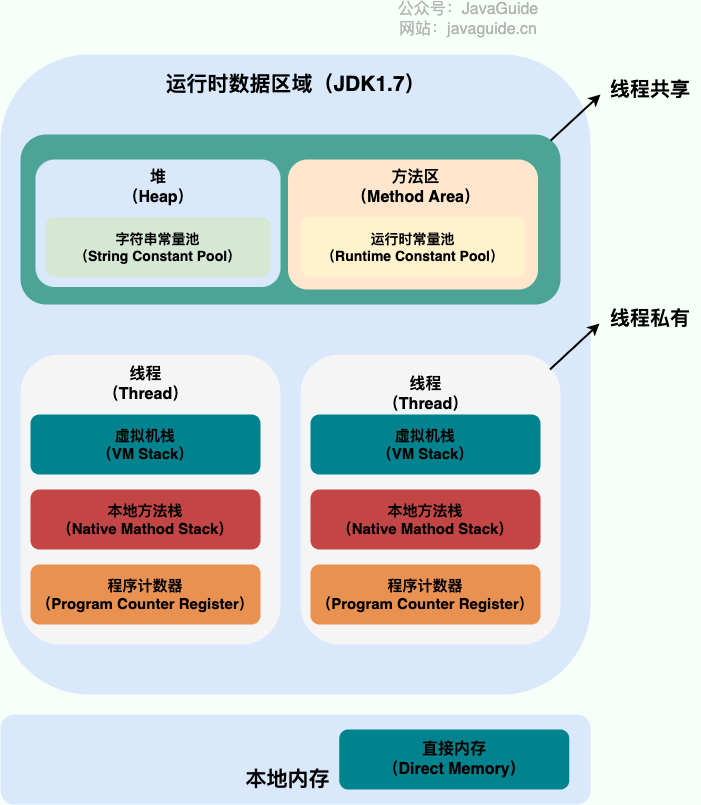
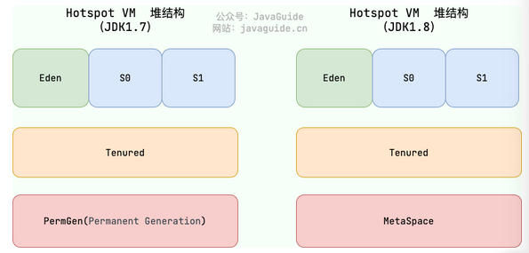
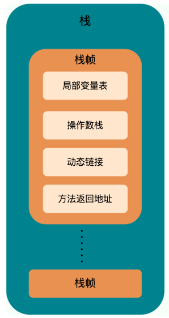
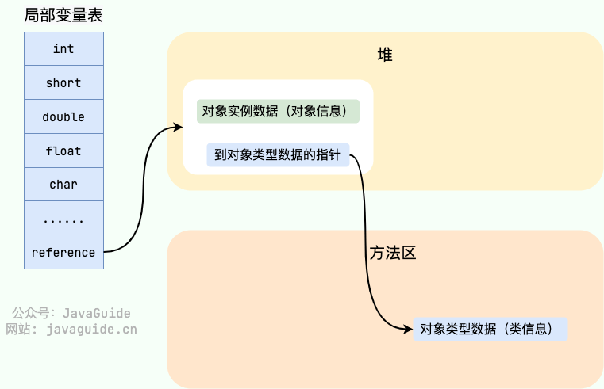
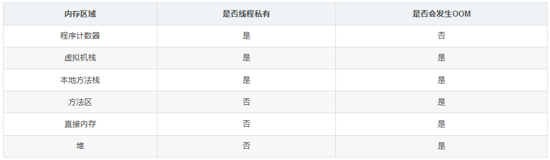

---
tags:
  - Java
createTime: 2025/03/20 15:28:27
title: 7-Java虚拟机（JVM）
permalink: /ToBeABD/Java/hajpyjjs/
---
---

## JVM | 内存区域

### 概念 | JVM的内存区域

#### 整体介绍

==【八股】介绍一些Java内存区域？==

Java虚拟机运行Java程序的过程，会把管理的内存划分为不同的数据区域。有些是**线程共享**的区域，有些是**线程独有**的区域。

|                              | jdk7                     | jdk8                 |
| ---------------------------- | ------------------------ | -------------------- |
| 线程共享\| 堆                | 在运行时数据区           | 在运行时数据区       |
| **线程共享 \| 方法区** | **在运行时数据区** | **在本地内存** |
| 线程共享\| 直接内存          | 在本地内存               | 在本地内存           |
|                              |                          |                      |
| 线程私有\| 程序计数器        | 在运行时数据区           | 在运行时数据区       |
| 线程私有\| 虚拟机栈          | 在运行时数据区           | 在运行时数据区       |
| 线程私有\| 本地方法栈        | 在运行时数据区           | 在运行时数据区       |

图示：




#### 线程共享 | 堆

==【八股】Java虚拟机中堆的作用？堆的分区？==

**什么是堆**：堆是Java虚拟机管理的一个内存区域，是所有线程共享的一块内存区域【堆是JVM管理内存区域中最大的一块内存区域】

**堆的作用/目的**：存放对象实例（管理几乎所有的对象实例以及数组等引用数据对象），只包含成员变量，成员方法不在这里，成员方法在方法区；

**堆的分区**：

- 新生代内存（Young Generation）

```java
新生代又分为三个区：eden、survivor*2
```

- 老生代内存（Old Generation）
- 永久代内存（Permanent Generation）

```java
在JDK8中，永久代由元口空间代替，并且元空间在本地内存中
```

图示如下：



---

==【八股】Java堆中容易出现的异常类型？==

- `java.lang.OutOfMemoryError: GC Overhead Limit Exceeded`：当 JVM 花太多时间执行垃圾回收并且只能回收很少的堆空间时，就会发生此错误。
- `java.lang.OutOfMemoryError: Java heap space` ：假如在创建新的对象时, 堆内存中的空间不足以存放新创建的对象, 就会引发此错误

#### 线程共享 | 方法区

==【八股】Java方法区是什么？有什么作用？==

**什么是方法区**：方法区是JVM运行时数据区域的一块逻辑区域，是各个线程共享的内存区域；

**作用**：

- 存储类元数据（类名称、类方法、类字段、接口等信息。这些信息被JVM加载后放到内存区域中）；
- 存放静态变量（静态变量随着类的加载而加载，也被放在方法区存储）；
- 存放JIT编译后的代码；
- 存放运行时常量池（后续介绍）；
- 存放类加载器的应用，帮助JVM追踪类是由哪么类加载器加载的。

**特点**：方法区是Java虚拟机的一个规范，具体的实现是虚拟机自己考虑的事情，即不同的虚拟机上，方法区的实现不同。

---

==【八股】方法区、永久代以及元空间的关系？==

方法区是一个规范，可以理解为**接口**；永久代及元空间是方法区的两个不同实现，可以理解为**类**。

- 永久代实现：JVM本身设置有一个固定上限，不可修改调整，在java8中彻底废弃该概念，用元空间来代替。
- 元空间实现：使用本地内存，受本机内存大小的限制，可以设置元空间大小。元空间发生OOM的概率低于永久代。

#### 线程共享 | 直接内存

==【八股】什么是直接内存？==

- 直接内存是一种特殊的内存缓冲区域，不是Java虚拟机运行时数据区的一部分，而是通过JNI在本地内存上分配的。
- 直接内存也是内存，也会发生OOM；直接内存在堆外，不受GC的约束，可以减少垃圾回收的压力。
- 直接内存主要用于存储那些需要频繁进行I/O操作的数据，如文件读写、网络通信等。这些数据存放在堆外，可以减少在Java堆和Native堆之间复制数据的开销，从而提高性能。

#### 线程私有 | 程序计数器

==【八股】Java内存区域组成中，程序计数器的作用？==

程序计数器属于线程私有的，每个线程都有，是一块较小的内存区域。

主要有两个作用：

- **记录当前线程字节码文件执行的位置**：字节码解释器工作的时候，通过改变该程序计数器的值来确定下一条待执行的字节码指令
- **多线程环境下，用于线程切换后恢复上下文**：这也是第一个作用的体现，记录了字节码文件执行的位置，就可以在线程切换回来后恢复。

特点：程序计数器不会出现OOM（唯一一个），他的生命周期随着线程的创建而创建，随着线程的消亡而消亡。

#### 线程私有 | Java虚拟机栈

==【八股】Java虚拟机栈的作用？==

- Java虚拟机栈属于线程私有的，是JVM运行时数据区域的一个核心。
- 除了一些Native方法通过本地方法栈实现，其他所有的Java方法都通过虚拟机栈来实现（配合其他区域如：程序计数器等）

---

==【八股】Java虚拟机栈的组成？==

方法调用的数据通过虚拟机栈进行传递，基本组成是一个栈帧。每当有一个方法调用，对应一个栈帧压入栈；每当有一个方法调用结束，对应一个栈帧出栈。

栈帧的基本组成：局部变量表、操作数栈、动态链接、方法返回地址。

- **局部变量表**：存放编译器可知的8种基本数据类型和对象引用（不是对象本身，是对象的一个引用，即一个地址值）
- **操作数栈**：作为方法调用的中转站使用，存放方法执行过程中的中间计算结果及临时变量
- **动态链接**：
- **方法返回地址**：存放该方法执行完毕后，下一条指令的地址（PC计数器的值）



---

==【八股】Java虚拟机栈可能出现的异常类型？==

虚拟机栈可能出现的异常类型有：

- `StackOverFlowError` ：假设方法循环调用，栈帧压入过多，超过虚拟机栈允许的最大深度之后，就会报该异常。
- `OutOfMemoryError` ：线程申请栈空间失败，就会爆出该异常。

#### 线程私有 | 本地方法栈

和虚拟机栈比较类似。主要区别：

- Java虚拟机栈：为执行Java方法提供服务
- 本地方法栈：为执行Native方法提供服务

在HotSpot虚拟机中，两者合为一个，即：Java虚拟机栈。

相关组成及可能产生的异常类型均可参考：Java虚拟机栈。

---

【补充】

- 什么是Native方式？在Java中声明，但是在其他语言中实现的方法，通过JNI和JVM进行交互。

#### 方法区组成 | 运行时常量池

==【八股】什么是运行时常量池？有什么作用？==

**概念及作用**：运行时常量池是方法区的一部分，主要存放编译器生成的各种字面量和符号引用。

```
Class字节码文件中除了有类的版本、字段、方法、接口等描述信息，还有常量池表（用于存放编译器生成的字面量和符号引用）。
常量池表会在类加载后，存放到方法区的运行时常量池中。
```

**运行时常量池的位置变化**：

- 在JDK 1.6及之前的版本中，运行时常量池在**永久代**

```
在JDK 1.6及之前的版本中，方法区是以永久代的方式实现的（在HotSpot虚拟机中），而运行时常量池是方法区的一部分，因此，它位于永久代中。
```

- 在JDK 1.7中，运行时常量池在**堆内存**中

```
在JDK 1.7中，方法区被合并到了堆内存中，因此运行时常量池可以说是在堆内存中。
```

- 在JDK 1.8，运行时常量池在**元空间**中，即本地内存中

```
在JDK 1.8中，方法区又被剥离出来，但实现方式不再是永久代，而是被称为元数据区（Metaspace）。所以，在JDK 1.8及以后的版本中，运行时常量池位于元数据区中。
```

#### 堆内存组成 | 字符串常量池

**概念及作用**：字符串常量池主要用于避免字符串的重复创建，是JVM针对字符串专门开辟的一个内存区域。

```
HotSpot虚拟机中字符串常量池的实现是：stringTable，可以理解为一个HashTable，键-表示字符串；值-表示字符串对象的引用。
```

**字符串常量池位置的变动**：

- 在JDK 1.6及之前的版本中，字符串常量池存储在**永久代**中

```
在JDK 1.6及之前的版本中，字符串常量池存储是放在方法区中的，而方法区在HotSpot虚拟机中是以永久代（PermGen）的形式实现的。这意味着字符串常量池在这个时期是存储在永久代中的。
```

- 在JDK 7及以后的版本，字符串常量池存储在**堆内存**中

```
然而，到了JDK 7，情况发生了变化。在这个版本中，字符串常量池被移动到了堆内存中。这一变动主要是基于性能优化的考虑。由于字符串常量池的使用频率非常高，将其放在堆中可以提高访问效率，并减少垃圾回收的影响。

随着JDK 8的发布，JVM的内存管理又进行了一次重要的改进。在JDK 8中，方法区的实现方式从永久代变为了元空间（Metaspace）。但此时，字符串常量池已经位于堆中，因此这一变化并未影响到字符串常量池的位置。
```

### 概念 | Java对象的创建过程

==【八股】java对象的创建过程？==

Step1：类加载检查

- 虚拟机遇到一条new指令，就会进行类加载检查。
- 如果一个类没有被加载、解析和初始化过，就需要先执行相应的类加载流程

Step2：分配内存

- 虚拟机将对对象分配内存，内存大小在类加载完成后即可确定。
- 分配过程等价于：将一块固定大小的区域从堆内存中划分出来。这个划分方式有两种：

```
指针碰撞：
	- 在堆内存规整的情况下使用。
	- 堆内存一边用过，一边没用过，中间有一个分界指针，沿着未使用的内存方向移动指定大小的位置即可。
	- 使用该分配方式的GC收集器：Serial, ParNew
空闲列表：
	- 在堆内存不规整的情况下使用。
	- 虚拟机维护一个列表，记录哪些内存可用，在分配的时候，找一块足够大的内存块来划分给对象实例，然后更新这个列表即可。
	- 使用该分配方式的GC收集器：CMS

堆内存的规整与否取决于使用的垃圾回收算法。
	- 堆内存不规整：标记-清除算法
	- 堆内存规整：标记-整理算法、复制算法
```

Step3：初始化零值

- 虚拟机将分配的内存空间都初始化为0值（不包括对象头）
- 保证对象的实例字段在Java中可以不赋初值使用

Step4：设置对象头

- 针对一个对象，有如下信息：如何判断是哪个类的实例、怎样找到类的元数据信息、对象的哈希码是多少等
- 这些信息都存放在对象头中，因此需要对对象头进行设置。

Step5：执行构造方法

- 上述步骤执行之后，从虚拟机视角来看，一个对象已经产生了。
- 但是所有字段还没有赋值，所以还需执行构造方法，按照代码逻辑，给对象字段赋值

Setp6：返回对象引用

- 至此，一个java对象才是真正的诞生了。

### 概念 | Java对象的内存布局

==【八股】Java对象的内存布局有哪些组成部分？==

在HotSpot虚拟机中，java对象在内存中的布局分为三个区域：对象头、实例数据、对齐填充

- 对象头：包含两部分信息
  - 第一部分：存储对象自身的运行时数据（哈希码、GC年龄、锁状态标志等）
  - 第二部分：类型指针，虚拟机通过这个来确定这个对象是哪个类的实例
- 实例数据：存储对象的内容，通常是各个类型的字段内容。
- 对齐填充：仅起到占位作用，不是必要存在的。HotSpot虚拟机要求对象的起始地址必须是8字节的整数倍，当实例数据没有对齐的时候，通过对齐填充来补全

### 概念 | 对象的访问定位方式

==【八股】Java对象的访问定位方式有几种？==

主要有两种：句柄访问、直接指针。HotSpot虚拟机主要使用句柄访问。

Java虚拟机栈中的局部变量表-reference中存储着引用对象的访问。

- 若通过句柄访问：

  - java堆中将划分一个内存来作为句柄池
  - reference指向句柄地址，句柄地址指向对象实例
- 若通过直接指针访问：

  - reference指向对象实例

两种方式各有优劣：

- 使用句柄访问：当对象发生变化的时候，reference中的句柄地址不用变化，仅句柄的指向发生变化。
- 使用直接指针：减少一次指针定位的时间开销，更快一点。

---

图示：先是句柄访问，后是直接指针




## JVM | 垃圾回收

### 对象的内存分配和GC回收原则

==【八股】Java新建实例对象在堆中区域的位置变动过程？==

**对象优先在eden区分配**

- 当使用New关键字新建一个Java对象时，首先在eden区进行分配
- 当eden区域没有足够的空间进行分配的时候，会触发一次Minor GC，对新生代进行垃圾收集

**对象在新生代中的移动**

- 当触发Minor GC的时候，eden区中仍然存活的对象会移动到Survivor区中。Survivor区对象的存活年龄设置为1，且以后每Minor GC一次，该区对象年龄+1

**对象从新生代移动到老年代**

- 正常移动到老年代：当新生代Survivor区中的对象存活年龄达到一定阈值的时候，会移动到老年代；
- 触发分配担保机制：当对象在新生代中从eden区往survivor区移动的时候，若survivor区空间不足以存放从eden区过来的对象，就会通过**分配担保机制**，提前把对象从eden区移动到老年代中；
- 大内存对象直接移动到老年代：大量连续内存空间的对象比如字符串、数组，会直接放在老年代，避免在新生代中的移动；

**老年代中对象的管理**

- 随着老生代对象的累积，当空间不足时会进行一次垃圾回收，回收不用的对象，称为：Old GC / Major GC。垃圾回收后，老生代中仍然存活的对象会依然存在；不用的对象会被回收掉；

---

==【八股】Java中GC的分类？==

针对HotSpot虚拟机，GC的分类及触发时机：

部分收集 | Partial GC

- 新生代收集 | Yong GC、Minor GC：只对新生代进行收集
  - 当Eden区空间不足时，会触发；
- 老年代收集 | Old GC、Major GC：只对老年代进行收集
  - 当老年代空间不足的时候，会触发；
- 混合收集 | Mixed GC：对整个新生代和部分老年代进行收集
  - 在Yong GC执行过程中，如果判断内存整体大于一定阈值（堆大小的45%），会进行标记，下一次触发垃圾回收的时候，就执行Mixed GC；

整堆收集 | Full GC：收集整个Java堆和方法区

- 当尝试了Yong GC或Mixed GC之后，内存依然不足，触发Full GC；
- 通过Yong GC后进入到老年代的对象的平均大小大于老年代的可用内存；
- 永久代或元空间的内存不足；
- 代码中调用 `System.gc()`

### 死亡对象的判断方法

==【八股】如何判断对象是否死亡？==

死亡对象，即垃圾对象。

判断Java对象是否死亡主要有两种方法：引用计数法和可达性分析算法。两种算法可有优劣

引用计数法：

- 原理：给对象添加一个引用奇数器。每有一个引用，计数器+1；引用失效，计数器-1；当计数器=0的时候，对象就不可能再被引用
- 特点：简单、效率高
- 缺点：没有办法解决循环引用的情况（两个对象相互引用，没有外界的引用）

可达性分析算法：

- 原理：以一个GC Roots的对象作为起点往下搜索，结点走过的路径称为引用链，结点走过的对象加入到引用链上。若一个对象不在引用链上，就需要被回收。

```
哪些对象可以作为GC Roots？（记住前3个就行：栈中的引用对象，被同步锁持有的对象）
	- 虚拟机栈中引用的对象（在栈帧的局部变量表里面）
	- 本地方法栈中引用的对象
	- 所有被同步锁持有的对象
	- 方法区中类静态属性引用的对象
	- 方法区中常量引用的对象
	- JNI（Java Native Interface）引用的对象

对象可以被回收就一定回收嘛？
	- 被判定需要回收之后不会立刻回收，还会进行二次标记
	- 若期间对象可以与引用链上的对象建立关系，就不会被回收；否则，就会被回收。
```

---

==【八股】如何判断一个常量是废弃常量？==

字符串常量池中的常量：

- 假设有一个字符串“abc”，如果没有任何一个String对象引用该字符串常量池，就说明该常量是一个废弃常量。

运行时常量池中的常量：

- 这些常量是在类加载之后放入常量池中的，当类没有被卸载以前，一般不会进行回收。

---

==【八股】如何判断一个类是无用的类？==

满足以下三个条件：

- 类的所有实例都被回收
- 类加载器ClassLoader被回收
- 该类对应的Class对象（字节码文件对象）没有任何引用，没法通过反射访问该类的方法（Class对象通常由类加载器负责加载和创建的）

一个类是无用的类，就可以被回收，但是不一定回收；而对象是一个无用的对象，就一定会被回收。

### 4种引用类型总结

==【八股】简单介绍一下：强引用、软引用、弱引用、虚引用？==

强引用：

- 日常的引用方式就是强引用，可以理解为必不可少的生活用品。
- 特点：GC不会对其进行回收，如果内存不足，宁可抛出OOM异常终止程序，也不回收该对象

软引用：

- 软引用可以理解为可有可无的生活用品
- 特点：内存足够，就不会回收软引用对象；内部不足的时候，就会回收这些具有软引用的对象（可以配合引用队列使用）

弱引用：

- 弱引用也可以理解为可有可无的生活用品
- 特点：只具有弱引用的对象，在GC过程中一旦被发现，不管内存是否足够，都会对其进行回收（可以配合引用队列使用）

虚引用：

- 可以理解为形同虚设的引用，如果只有虚引用，就跟没有任何引用一样，随时都可以被回收。
- 特点：虚引用主要用来跟踪对象被垃圾回收的活动（当一个对象只有虚引用的时候，就会在回收的时候，将相关信息放入引用队列，这样就可以执行一些操作信息，比如资源释放。）

上述几种引用的使用方式如下：

```java
// 强引用
Object strongRef = new Object();

// 软引用
import java.lang.ref.SoftReference;  
SoftReference<Object> softRef = new SoftReference<>(new Object());  
Object obj = softRef.get();

// 弱引用
import java.lang.ref.WeakReference;  
WeakReference<Object> weakRef = new WeakReference<>(new Object());  
Object obj = weakRef.get();

// 虚引用
import java.lang.ref.PhantomReference;  
import java.lang.ref.ReferenceQueue;  
  
ReferenceQueue<Object> queue = new ReferenceQueue<>();  
PhantomReference<Object> phantomRef = new PhantomReference<>(new Object(), queue);  
  
// 虚引用本身不会阻止对象被回收，但可以通过ReferenceQueue观察对象何时被回收  
Object obj = phantomRef.get(); // 始终返回null  
  
// 检查队列中是否有待回收的对象的引用  
PhantomReference<?> ref = (PhantomReference<?>) queue.poll();  
if (ref != null) {  
    // 对象已被回收  
}
```

---

==【八股】虚引用和软引用、弱引用的区别==

虚引用必须和引用队列进行配合，其他两个引用是可以和引用队列配合。

- 虚引用一般用于：对象回收的跟踪
- 软引用和弱引用一般用于：实现缓存功能（缓存的数据可以被删，也可以不删）

==【八股】软引用的好处？==

可以加速JVM垃圾回收的速度，维护系统安全，减少OOM的发生。

### 垃圾收集算法

==【八股】常见的垃圾收集算法有哪些？各自特点？==

标记-清除算法 \|Mark-and-Sweep

- 原理：首先标记不需要回收的对象，标记完成后统一回收掉没有被标记的对象；
- 特点：标记和回收的效率都不高；该算法会产生较多的空间碎片；适用于老年代

复制算法 \| Copying

- 原理：将内存分为大小相等的2块，每次只使用其中的一块，当一块内存用完了，将活着的对象移动到另一块内存，然后统一清理内存，以此循环使用
- 特点：可用内存只有一半；不适合老年代，存活数量较多，复制效率就低了；

标记-整理算法 \| Mark-and-Compact

- 原理：首先是标记过程，跟标记-清除算法一样，然后让所有存活的对象向一端移动，直接清理掉边界以外的内存；
- 特点：多了整理的步骤，效率不高，但是空间内存碎片较少；适合老年代，垃圾回收的频率不高；

分代收集算法：

- 原理：没啥创新的，就是对堆中不同的代采用不同的垃圾收集算法；

---

==【八股】HotSpot虚拟机为什么要有新生代和老年代？==

==【八股】讲一下Java的分代收集算法？==

将堆内存划分为新生代和老年代，主要是基于对象的生命周期和垃圾回收的效率考虑。

根据弱分代假设：绝大多数对象都是朝生夕灭的，只有少数对象能够长期存活。因此划分新生代和老年代：

- 新生代：刚创建的对象都放在这里面。因为有大量的对象死亡，所以新生代采用【**复制算法**】进行垃圾回收，只需要复制少量存活对象就可以完成垃圾回收
- 老年代：存活时间较长的对象放在这里面。因为对象存活几率较高，所以用【**标记-清除算法**】或【**标记-整理算法**】进行垃圾收集

### 垃圾收集器

垃圾收集算法是方法论，而垃圾收集器就是对不用垃圾收集算法的实现。

==【八股】常见的垃圾收集器有哪些？==

参考文章：[文章链接](https://javaguide.cn/java/jvm/jvm-garbage-collection.html#%E5%9E%83%E5%9C%BE%E6%94%B6%E9%9B%86%E5%99%A8)

常见收集器及其简要特点：

| 收集器            |                                                                      |                          |      |              |
| ----------------- | -------------------------------------------------------------------- | ------------------------ | ---- | ------------ |
| Serial            | 单线程收集器，且收集的时候，会暂停其他所有工作线程（stop the world） | **主要用于新生代** | 串行 |              |
| ParNew            | Serial 收集器的多线程版本（其余同serial收集器）                      | 同上                     | 并行 |              |
| Paraller Scavenge | 跟ParNew几乎差不多                                                   | 同上                     | 并行 | 吞吐量优先   |
| Serial Old        | Serial的老年代版本                                                   | **主要用于老年代** | 串行 |              |
| Paraller Old      | Paraller Scavenge的老年代版本                                        | 同上                     | 并行 | 吞吐量优先   |
| CMS               | 第一款真正意义上的并发收集器                                         | 同上                     | 并发 | 停顿时间优先 |
| G1                | 面向服务器的垃圾收集器                                               | **主要用于整堆**   | 并发 |              |
| ZGC               |                                                                      |                          |      |              |

概念解释：

- 串行：只有一条垃圾收集线程工作，用户线程等待
- 并行：多条垃圾收集线程并行工作，用户线程等待
- 并发：用户线程与垃圾收集线程同时执行（不一定是并行），在不同的CPU上
- 吞吐量优先和停顿时间优先：

```
吞吐量优先（Throughput Priority）：
- 概念：吞吐量 = CPU用于运行用户代码的时间 / CPU总消耗时间；
- 目标：最大化应用程序在单位时间内的处理能力，意味着减少用于垃圾回收的总体时间；
- 适用场景：批处理、后台任务等对响应时间不敏感的应用；
- 实现方式：采用多线程并行收集垃圾，可能导致较长的STW时间（停顿时间），但是总体的垃圾收集时间较短

停顿时间优先（Pause Time Priority）：
- 概念：最小化应用程序（用户线程）因为垃圾收集而暂停的时间；
- 目标：最小化每次垃圾回收的停顿时间，意味着每次垃圾回收所停顿的时间越短越好；
- 适用场景：适用于交互式应用、实时系统等对时间敏感的应用；
- 实现方式：采用并发、增量收集，减少停顿时间，甚至可以以更多的CPU运行时间来减少每次垃圾回收所停顿的时间
```

---

==【八股】介绍一下CMS收集器？==

CMS收集器非常注重用户体验，是一款以获得最短回收停顿时间为目标的收集器。

CMS收集器的收集过程主要分为4步，并发操作居多：

- 初始标记：暂停所有其他线程，标记直接与root相连的对象。速度很快
- 并发标记：GC和用户同时启动，标记可达对象。可能存在引用更新，所以算法会记录跟踪引用发生更新的地方。
- 重新标记（并行执行GC线程）：暂定所有其他线程，暂停时间会长于初始标记。标记发生引用更新的对象。
- 并发清除：开启用户线程，同时GC线程对未标记区域清扫。


---

==【八股】介绍以下G1收集器？==

> [参考文章](https://blog.csdn.net/mm1274889792/article/details/139030273)

G1收集器是一款面向服务器的垃圾收集器，以极高概率满足GC停顿时间的同时，还具备高吞吐量。

G1收集器的收集过程主要分为以下几个步骤，并行操作居多：

- 初始标记：暂停用户线程
- 并发标记：开启GC和用户线程
- （并行）最终标记：暂停用户线程
- （并行）筛选回收：暂停用户线程，回收结束后，开启用户线程


G1收集器的主要特点：

- 并行和并发：并行和并发在G1的垃圾回收过程均存在；
- 分代收集：虽然G1是整堆收集器，但是还保留了分代的概念；
- 空间整合：G1整体上看是 `标记-整理算法`，局部上看是基于 `标记-复制`算法；
- 可预测的停顿：G1可以建立可预测的停顿时间模型，使得垃圾收集时间的消耗在一定时间内不超过多少的限制。

---

==【八股】CMS收集器和G1收集器的区别？==

使用范围：

- CMS：主要用于老年代的收集器，通常与用于新生代的收集器配合使用（Serial、ParNew）；
- G1：整堆收集器，覆盖了新生代和老年代，不需要与其他收集器配合；

GC停顿时间：

- CMS：以最小停顿时间为目标；
- G1：保证尽可能小的停顿时间前提下，还具备高的吞吐量。提供可预测的停顿时间模型，允许用户指定最大停顿时间；

内存碎片：

- CMS：使用”标记-清除“算法进行垃圾回收，容易产生内存碎片；
- G1：使用”标记-整理“算法，进行了空间整合，降低了内存空间碎片；

垃圾收集过程：

- CMS：3步标记+1步垃圾回收，多数操作是在并发下执行；（并发：用户线程和垃圾回收线程一起执行）
- G1：3步标记+1步垃圾回收，多数操作是在并行下执行；（并行：多条垃圾回收线程一起执行，用户线程等待）

---

==【八股】以G1垃圾回收器为例，有哪些设置参数？==

- `-XX:+UseG1GC`：使用G1垃圾回收器；
- `-Xms4g`：设置初始堆的大小为4GB；
- `-XX:G1NewSizePercent=10`：设置新生代最小为堆的10%，默认为5%；
- `-XX:G1MaxNewSizePercent=50`：设置新生代最大为堆的50%，默认为堆的60%；
- `-XX:G1HeapRegionSize=4m`：设置每个Regin的大小为4MB，这个值通常是2的幂，范围在1MB-32MB之间；

---

==【八股】G1垃圾回收器对应的堆内存布局？==

G1是基于Region的堆内存布局，即将Java堆划分为多个大小相等的独立区域，每个区域称为Region；

- Region的数量：将Java堆大约划分为2048个独立的Region块，每个块的内存为1MB-32MB，即G1能管理的最大内存为64G左右；
- Region扮演的角色：G1逻辑上分代，但是物理上不分，即每一个Region可以根据需要，扮演不同的角色

  - 新生代角色：Eden、Survivor；
  - 老年代角色：Old；
  - Humongous（H-Region）：专门用来存储大对象，可以简单理解为对应着老年代；连续的几个Region组成一个H-Region
- G1存储对象的规则：

  - G1认为如果一个对象的大小超过一个Region区域的一半，就可以判定为大对象，不会直接放到新生代，而是放到H-Region里面；
  - 对于对象大小是几倍个Region区域容量的对象，会放到N个连续的Region区域中；
  - H-Region里面的对象可以理解为是老年代的对象，不会被Yong GC回收；

---

==【八股】G1垃圾回收器可预测停顿时间模型的原理？==

G1可预测模型的关键主要有两点：Region布局和优先级队列

- G1将Region作为单次回收的最小单元，即每次收集的内存空间都是Region大小的整数倍；
- G1会跟踪各个Region里面堆积垃圾的【价值】大小，价值的意思就是：回收所获得的空间大小及回收所需要时间的一个经验判断的值，然后在后台维护一个优先级列表；
- 每次根据用户设定允许的收集停顿时间，优先处理回收价值最大的那些Region；

---

==【八股】为什么说G1收集器整体上看是标记-整理算法，局部上看是标记-复制算法？==

G1垃圾回收器整体的工作流程包含：3次垃圾标记过程 + 1次垃圾回收操作

- 3次标记过程：
  - 第一次标记可达对象（需要暂停用户线程）；
  - 第二次标记引用链上的对象，并记录引用更新；
  - 第三次标记发生引用更新的对象（需要暂停用户线程）；
- 1次垃圾回收操作：
  - 更新Region的统计数据，对各个Region的回收价值和回收成本进行排序，根据用户期望的停顿时间来指定回收计划，可以自由选择任意多个Region进行回收；
  - 把决定要回收的区域里面仍存活的对象复制到空的Region里面，再清理掉旧Region的全部空间；
  - 因为设计到存活对象的移动，所以需要暂停用户线程（并行操作：多条垃圾回收线程工作，暂停用户线程）；

所以说G1垃圾回收器从整体上看是【标记-整理】算法，但是从局部来看（Region视角）又是基于【标记-复制】算法实现；

---

==【八股】如果将G1的垃圾回收时间设置的很小，是不是垃圾回收速度就更快？==

直观上看好像是这样，但其实这个结论是不对的。

- 过短的垃圾回收时间可能导致每次垃圾回收的空间只占用堆内存很小的一部分，最终会出现收集器收集的速度跟不上分配器分配对象的速度，就会导致垃圾逐渐积累；
- 时间一长，容易触发Full GC，反而降低了性能；
- 因此期望停顿时间设置为100ms-300ms是比较合理的；

---

==【八股】如果JVM频繁放生GC，有什么排查思路和改进措施？==

可以从代码层面和JVM两个方面进行分析和改进：

代码层面：

- 检查循环代码，里面可能创建大量的临时对象；
- 尝试复用对象，减少对象的频繁创建和销毁；

JVM层面：

- 合理设置各分区的大小：

  - 如果频繁发生Yong GC，可以适当增加新生代的大小、调整Eden和Survivor的比例，降低大对象直接进入老年代的阈值，避免大对象频繁在新生代进行分配和回收；
  - 如果频繁发生Old GC，可以增加堆内存整体的大小、尝试在代码层面拆分对象，避免大对象的出现；
- 选用合适的垃圾回收器：根据业务调整垃圾回收器的参数

### JVM | 类加载过程

==【八股】概述JVM中的类加载过程？==

参考文章：[文章链接](https://javaguide.cn/java/jvm/class-loading-process.html)

JVM类加载过程主要分为以下几步：

- 加载

  - 由类加载器完成
  - 主要完成三个任务：

  ```
  - 通过全类名获取定义此类的二进制字节流；
  - 将字节流所代表的静态存储结构（访问标志、字段表集合等）转换为方法区的运行时数据结构；
  - 在内存中生成一个代表该类的 `Class` 对象，作为方法区这些数据的访问入口；
  ```
- 连接 | 验证

  - 确保Class字节码文件中的信息复合要求，不会对JVM产生危害
  - 主要有4个方面的验证步骤：

  ```
  - 文件格式验证（Class文件格式检查）
  - 元数据验证（字节码语义检查）
  - 字节码验证（程序语义检查）
  - 符号引用验证（类的正确性检查）
  ```
- 连接 | 准备

  - 正式为类变量分配内存并设置类变量的初始值
  - 有以下注意点：

  ```
  - 这时候参与分配的都是类中的静态变量，不包括实例变量
  - 这里的初始值是指数据类型对应的默认值。若在代码中被赋予初始值，也不会在这个阶段生效。
  ```
- 连接 | 解析

  - 虚拟机将常量池内的符号引用替换为直接引用的过程
- 初始化

  - 类加载的最后一个阶段；开始执行类中定义的Java程序代码
- 使用
- 卸载

  - 该类的Class对象被GC（不是类实例被GC，是Class对象）
  - 需要满足以下条件：

  ```
  - 该类的实例对象都被GC了，即堆中不存在对应的实例对象
  - 该类在任何地方没有被引用
  - 该类的类加载器实例被GC了
  ```

## JVM | 类加载器

### 概念 | 类加载器介绍

==【八股】什么是类加载器？有什么作用？==

一个类在JVM中会经历：加载-连接-初始化-使用-卸载整个过程；而类加载器就负责其中的加载过程。

类加载器的作用就是将 `.Class`字节码文件加载到JVM中生成一个Class对象。

---

==【八股】类加载器在加载过程主要做的事情？==

加载过程主要完成三件事：

- 通过全类名获取定义此类的二进制字节流
- 将字节流所代表的静态存储结构（访问标志、字段表集合等）转换为方法区的运行时数据结构
- 在内存中生成一个代表该类的 `Class` 对象，作为方法区这些数据的访问入口

---

==【八股】类加载器的加载规则==

- JVM不会在启动的时候一次性加载所有的类，而是根据需要动态的加载类。
- 已加载的类会被记录在加载这个类的类加载器中，不会重复加载

---

**【补充】类加载器的理解**

- 类加载器是一个负责加载类的对象（类加载器的对象类型为ClassLoader），用于实现类加载过程中的加载这一步
- 每个Java类都有一个引用指向加载他的类加载器
- 数组类不是通过类加载器创建的（数组类没有对应的二进制字节流），是由JVM直接生成的

```java
class Class<T> {
  ...
  private final ClassLoader classLoader;
  @CallerSensitive
  public ClassLoader getClassLoader() {
     //...
  }
  ...
}
```

### 概念 | 双亲委派模型

==【八股】什么是双亲委派模型？怎么工作？有什么特点？==

1、双亲委派模型是Java类加载器加载类的一种工作模式，主要作用是保证Java类加载的安全性和一致性；通过这种模式，Java虚拟机将类文件加载到内存中。

2、双亲委派模型主要针对Java虚拟机中的三个类加载器：

- Bootstrap ClassLoader | 启动类加载器
- Extension ClassLOader | 扩展类加载器
- Application ClassLoader | 应用类加载器

这三个类加载器通过组合形成一种 `子类、父类的继承关系`。每个类加载器中包含：自己加载过的类集合（下文称呼为缓存）、父类的类加载器。

3、双亲委派模型加载类的流程大概如下：

- 自底向上查找缓存：
  - 在 `Application ClassLoader`的缓存中判断是否加载过该类：加载过，返回类对象；没加载过，向上查找
  - 在 `Extension ClassLoader`的缓存中判断是否加载过该类：加载过，返回类对象；没加载过，向上查找
  - 在 `Bootstrap ClassLoader`的缓存中判断是否加载过该类：加载过，返回类对象；没加载过，开始尝试加载类（顶层了，没有父类了）
- 自顶向下尝试加载类：
  - 在 `Bootstrap ClassLoader`中尝试加载类：能加载，将加载的类加入缓存，返回对象；不能加载，向下尝试加载
  - 在 `Extension ClassLoader`中尝试加载类：能加载，将加载的类加入缓存，返回对象；不能加载，向下尝试加载
  - 在 `Application ClassLoader`中尝试加载类：能加载，将加载的类加入缓存，返回对象；不能加载，爆出异常（ClassNotFound）

4、可以通过自定义类加载器，将自定义的类加载器加入到上述双亲委派模型的流程中。自定义的类加载器应该继承 `Application ClassLoader`

---

==【八股】双亲委派模型的优点？==

- 安全：可以保证核心API不被篡改，保证程序安全。即使个人定义了一个跟核心类名字一样的类，因为双亲委派模型，也不会加载该类，从而保证程序安全。
- 避免类重复加载：
  - Java判断两个类是否是同一个类的方法：类的全类名是否相同 && 类的类加载器是否相同。两个条件都满足，才能保证是一个类
  - 双亲委派模型可以保证类不会重复加载，也能保证加载到正确的类。

==【八股】双亲委派模型的缺点？==

双亲委派模型的流程决定了：父级的类加载器无法委托子级的类加载器来加载某些类。

常规情况下，没有什么影响，但是在Java的SPI机制下就显露不足了

---

==【八股】怎么自定义类加载器，打破双亲委派模型？==

自定义类加载器，需要继承 `ClassLoader`，并且重写其中的 `loadClass()`方法。

## JVM | OOM

==【八股】java中的OOM有哪些？怎么触发？有什么解决方案？==

参考文章：[文章1](https://zhuanlan.zhihu.com/p/257128368)、[文章2](https://blog.csdn.net/yangbaggio/article/details/94626578)、[文章3](https://zhuanlan.zhihu.com/p/95150243)

**堆内存溢出**：

- 原理：
  - 堆内存用于存储对象实例，不停的创建对象，并且保证对象可达，超过堆内存限制后就会发生OOM；
  - 抛出的异常信息为：`java.lang.OutOfMemoryError: Java heap space`；
- 排查思路：使用内存映像分析工具；

**栈内存溢出**：

- 原理：

  - 若线程请求的深度 > 虚拟机所允许的最大深度，抛出异常：`java.lang.StackOverflowError`
  - 若虚拟机栈能动态扩展，当扩展时无法申请到足够的内存时，抛出 `OutOfMemoryError`异常
- 排查思路：检查代码递归调用的地方，递归终止条件是否合理；检查代码创建线程的地方，线程创建手段是否合理；

**方法区溢出**：

- 原理：

  - 方法区主要存放Class的相关信息，若运行时产生大量的类填满方法区，就会出现OOM
  - 使用CGLib生成大量的代理类，撑爆方法区，就会抛出异常：`java.lang.OutOfMemoryError: Metaspace`
- 排查思路：

**直接内存溢出**：

- 原理：
  - 直接内存的分配虽然不受Java堆大小的限制，但是受本机总内存大小的限制；有些方法是直接分配直接内存的
  - 当直接内存溢出时，抛出异常：`java.lang.OutOfMemoryError: Direct buffer memory`
- 排查思路：

**示例代码**：

```java
package com.example.OOM;

import org.springframework.cglib.proxy.Enhancer;
import org.springframework.cglib.proxy.MethodInterceptor;
import org.springframework.cglib.proxy.MethodProxy;

import java.lang.reflect.Method;
import java.nio.ByteBuffer;
import java.util.ArrayList;
import java.util.List;

public class example {
    public static void main(String[] args) {

        //heap_oom();

        //stack_oom();

        // 需要设置方法区的大小，不然不太容易出OOM
        //method_oom();

        direct_memory_oom();
    }


    public static void heap_oom(){
        ArrayList<int[]> arrayList = new ArrayList<>();
        while (true){
            arrayList.add( new int[1024*5*10*10] );
        }
    }

    public static void stack_oom(){
        stack_oom();
    }

    public static void method_oom(){
        while (true) {
            Enhancer enhancer = new Enhancer();
            enhancer.setSuperclass(example.OOMObject.class);
            enhancer.setUseCache(false);
            enhancer.setCallback(new MethodInterceptor() {
                public Object intercept(Object obj, Method method,
                                        Object[] args, MethodProxy proxy) throws Throwable {
                    return proxy.invokeSuper(obj, args);
                }
            });
            enhancer.create();
        }
    }
    static class OOMObject {

    }

    public static void direct_memory_oom(){
        while (true){
            ByteBuffer bb = ByteBuffer.allocateDirect(1024*5*10*10);
        }
    }
}
```

---

==【八股】Java内存区域中那些地方会发生OOM？==



- 程序计数器是唯一一个不会发生OOM的地方；

## JVM | 其他问题：牛客看到的

==【八股】JIT了解过嘛？==

- 首先Java的编译器（JDK自带的javac指令）可以将Java代码编程成字节码文件，该文件可以被不同平台JVM中的interpreter解释器执行。
- 由于interpreter解释器的效率地下，JIT（Just In Time compiler，即时编译器）就会将一些运行频率比较高的代码编译成二进制代码，直接运行在底层硬件上，提高代码执行效率。
- JIT编译后的结果会存储在方法区。

---

==【八股】String对象创建和回收的过程？String对象和普通对象有什么区别？==

创建String对象的过程，有不同的方式：

- 通过字面量创建String对象：

  - 字符串常量池中有对应的String对象，直接将引用指向它
  - 字符串常量池中没有对应的String对象，创建后，将引用指向它
- 通过New创建String对象：在堆内存中开辟空间，创建对象，将引用指向该对象
- 通过char数组创建String对象：同样在堆内存中开辟空间，创建对象，将引用指向该对象

---

==【八股】JVM中的TLAB了解嘛？==

概念：TLAB是JVM中一种用于线程本地对象分配的优化技术，可以提高对象分配的性能，减少线程之间的竞争。

原理：

- 在Eden区，JVM为每个线程分配一块LAB区域
- 当线程需要创建对象的时候，首先在分配的LAB区域上创建，这时候不需要同步操作
- 当TLAB用尽或对象比较大的时候，线程才会在堆上分配空间，这时才需要注意线程之间的同步

优势：

- 可以减少锁竞争，提升系统的并发性能
