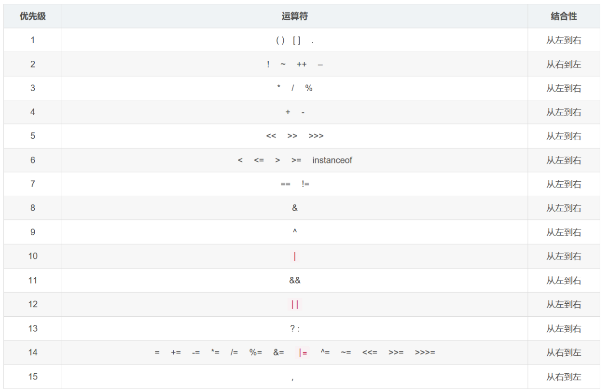

---


## 运算符的概念

两个基本概念：

- 运算符：对字面量或者变量进行操作的符号
- 表达式：用运算符把字面量或者变量**连接**起来符合java语法的式子就可以称为表达式

示例：

```java
int a = 10;
int b = 20;
int c = a + b;

/*
	+：是运算符，并且是算术运算符
	a + b：是表达式，由于+是算术运算符，所以这个表达式叫算术表达式
*/
```

## 常见的运算符

### 算数运算符

| 符号 | 意义 |
| ---- | ---- |
| +    | 加   |
| -    | 减   |
| *    | 乘   |
| /    | 除   |
| %    | 取余 |

示例：

```java
public class Test {
    public static void main(String[] args) {
    	// 同类别算数运算符，从左到右依次参与运算
    
        System.out.println(1 + 23);        			// 24
        System.out.println("年龄为:" + 23);		// 年龄为：23
        System.out.println(1 + 99 + "年黑马");		// 100年黑马
        System.out.println("练习时长" + 1 + 1.5 + '年');		// 练习时长11.5年（当碰到字符串后，+就变成了字符串连接符，而不是算数运算符）
        System.out.println("练习时长" + (1 + 1.5) + '年');		// 练习时长2.5年
    }
}
```

### 自增自减运算符

```java
public class Test {
    public static void main(String[] args) {
    	// 单独使用
        int a = 10;
        a++		// a=11
        ++a		// a=12
    
        // 组合使用
        int b;
        b = ++a;		// a=13, b=13
       	a++;			// a=14
        b = a++;		// a=15,b=14
    }
}

// --运算符计算逻辑同理
```

### 赋值运算符

| 符号 | 意义         |
| ---- | ------------ |
| =    | 赋值         |
| +=   | 相加后赋值   |
| -=   | 相减后赋值   |
| *=   | 相乘后赋值   |
| /=   | 相除后赋值   |
| %=   | 相取余后赋值 |

赋值运算符中，隐含着强制类型转换

### 关系运算符

| 符号 | 补充                                                                                                         |
| ---- | ------------------------------------------------------------------------------------------------------------ |
| ==   | （可以比较任意基本数据类型）对于基本数据类型，比较的是数值是否一致；对于引用数据类型，比较的是地址值是否一致 |
| !=   | 比较除了boolean类型外的任意基本数据类型                                                                      |
| >    | 比较除了boolean类型外的任意基本数据类型                                                                      |
| >=   | 比较除了boolean类型外的任意基本数据类型                                                                      |
| <    | 比较除了boolean类型外的任意基本数据类型                                                                      |
| <=   | 比较除了boolean类型外的任意基本数据类型                                                                      |

关系运算符处理的结果都是boolean数据类型，结果是true或false

### 逻辑运算符

| 符号 | 意义                                                                                      | 补充 |
| ---- | ----------------------------------------------------------------------------------------- | ---- |
| &    | 结果：有false就是false；特点：多个表达式进行与操作，前边有false，也会进行后边的运算判断   |      |
| &&   | 结果：有false就是false；特点：多个表达式进行与操作，前边有false，就不会进行后边的运算判断 | 常用 |
| \|   | 结果：有true就是true；特点：多个表达式进行或操作，前边有true，也会进行后边的运算判断      |      |
| \|\| | 结果：有true就是true；特点：多个表达式进行或操作，前边有true，就不会进行后边的运算判断    | 常用 |
| ！   | true即false，false即true                                                                  | 常用 |
| ^    | 异或运算符：相同为false，不同为true                                                       |      |

### 三元运算符

```java
public class test {
    public static void main(String[] args) {
        int a = 2;
        int v = a == 1 ? 1 : 10;
        System.out.println(v);  // v=10
    }
}
```

### 移位运算符

有三种移位运算符：左移运算符、右移运算符、无符号右移运算符。

|                 |                                                                    |                                     |
| --------------- | ------------------------------------------------------------------ | ----------------------------------- |
| 左移运算符：<<  | 左移n位。高位丢弃，低位补0                                         | 不溢出的情况下，等于将数字扩大2^n倍 |
| 右移运算符：>>  | 右移n位。低位丢弃，高位：符号位（正数补0，负数补1），其余位（补0） | 等于将数组缩小1/2^n倍               |
| 无符号右移：>>> | 右移n位。低位丢弃，高位：统一补0（忽略符号位）                     |                                     |

## 常见运算符的优先级


