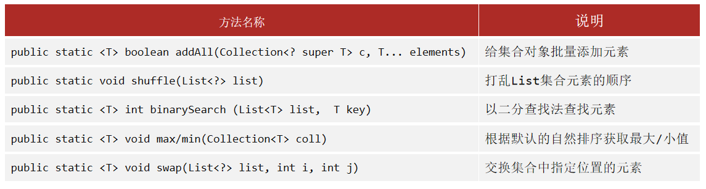

---


## Collection接口

### 通用函数 | Collections工具类



### 通用函数 | List接口 + Set接口

通用函数，均与索引无关。

| 方法                                    | 作用               |
| --------------------------------------- | ------------------ |
| `public boolean add(E e)`             | 增                 |
| `public boolean remove(E e)`          | 删                 |
| `public void clean()`                 | 删完               |
| `public boolean contains(Object obj)` | 包含               |
| `public boolean isEmpty()`            | 判空               |
| `public int size()`                   | 返回集合的元素数量 |

`remove()`、`contains()`两个函数依赖对象底层的 `equals()`方法

- 若对象没有重写 `equals()`方法，比较的是地址值，无法按照要求删除
- 需要重写该方法，让对象比较属性值是否一致

### List接口

#### ArrayList

ArrayList的创建：

```java
List<Integer> al = new ArrayList<Integer>;

List<List<Integer>> al = new ArrayList<List<Integer>>;			// 这种创建方式是对的

List<List<Integer>> al = new ArrayList<ArrayList<Integer>>;		// 这种创建方式是错的
```

方法（均与索引有关）：

| 函数                                       | 功能 |
| :----------------------------------------- | :--- |
| `public void add(int index, E element);` | 增   |
| `public E remove(int index);`            | 删   |
| `public E set(int index, E element);`    | 改   |
| `public E get(int index);`               | 查   |

示例：

```java
package com.itheima.collection.list;

import java.util.ArrayList;
import java.util.List;

public class ListDemo1 {
    public static void main(String[] args) {

        List<String> list = new ArrayList<>();

        list.add("张三");
        list.add("李四");
        list.add("王五");

        list.set(0, "赵六");
        list.remove(1);		// 根据索引删除：List接口的特点，传入的参数是int类型的索引

        System.out.println(list.get(0));
        System.out.println(list);

        System.out.println("-------------------------");

        List<Integer> list2 = new ArrayList<>();

        list2.add(111);        // Integer e = 111;
        list2.add(222);
        list2.add(333);

        list2.remove(Integer.valueOf(222));		// 根据元素删除，需要这样写，以跟索引删除的方法区分开
        System.out.println(list2);
    }
}
```

- 根据索引删除元素：是List接口（子）的特点
- 根据元素删除元素：是Collection接口（父）的特点

#### LinkedList

| 函数                                       | 功能 |
| :----------------------------------------- | :--- |
| `public void add(int index, E element);` | 增   |
| `public void addFirst(E e);`             |      |
| `public void addLast(E e)`               |      |
|                                            |      |
| `public E remove(int index);`            | 删   |
| `public E removeFirst()`                 |      |
| `public E removeLast()`                  |      |
|                                            |      |
| `public E set(int index, E element);`    | 改   |
|                                            |      |
| `public E get(int index);`               | 查   |
| `public E getFirst()`                    |      |
| `public E getLast()`                     |      |

### Set接口

#### TreeSet

| 函数                                          | 功能                     |
| --------------------------------------------- | ------------------------ |
| `boolean addAll(Collection<? extends E> c)` | 增                       |
|                                               |                          |
| 通用方法里面，针对对象的删除                  | 删                       |
|                                               |                          |
| 删 + 增                                       | 改（移除元素并重新添加） |
|                                               |                          |
| `E first()`                                 | 查                       |
| `E last()`                                  |                          |

#### HashSet

| 函数                       | 功能 |
| -------------------------- | ---- |
| 通用方法里面，按照元素的增 | 增   |
| 通用方法里面，按照元素的删 | 删   |
| 删 + 增                    | 改   |
| 不具备                     | 查   |

#### LinkedHashSet

用到再说

## Map接口

### 通用函数

| 函数                                    | 操作                 |
| --------------------------------------- | -------------------- |
| `V put(K, key, V value)`              | 增                   |
| `V remove(Object key)`                | 删                   |
| `void clear()`                        |                      |
| `boolean containsKey(Object key)`     | 包含                 |
| `boolean containsValue(Obejct value)` |                      |
| `boolean isEmpty()`                   | 判空                 |
| `int size()`                          | 返回集合中元素的数量 |

### TreeMap

| 函数           | 功能 |
| -------------- | ---- |
| 通用方法里面的 | 增   |
| 通用方法里面的 | 删   |
| 删 + 增        | 改   |
|                | 查   |

### HashMap

| 函数           | 功能 |
| -------------- | ---- |
| 通用方法里面的 | 增   |
| 通用方法里面的 | 删   |
| 删 + 增        | 改   |
|                | 查   |

### LinkedHashMap

用到再说
