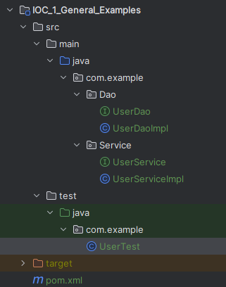
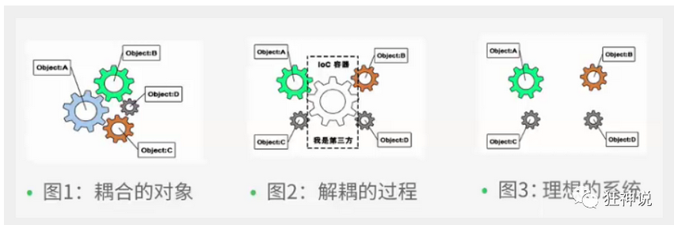
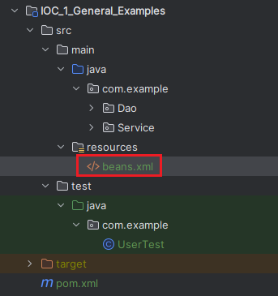

---


# 前言

本文从常规的开发示例（DAO、Service、Client）入手，逐步体会理解IOC的原理及实现。

文中示例的代码地址：

| GitHub | [仓库地址](https://github.com/Web-Learn-GSF/Java_Learn_Examples) |
| ------ | ------------------------------------------------------------- |
| 父工程 | Java_Framework_Spring                                         |

# 示例 | 常规三层开发示例

## 层级结构及代码展示

**代码层级结构：经典三层**：

- Dao：获取数据库数据，处于数据库和Service层之间（在示例中没有真的获取数据库，仅展示）
- Service层：业务逻辑实现的地方
- Client：客户端调用，在这里面就是UserTest



**源码实现**

DAO | UserDao

```java
public interface UserDao {
   public void getUser();
}
```

DAO | UserDaoImpl

```java
public class UserDaoImpl implements UserDao {
   @Override
   public void getUser() {
       System.out.println("Dao获取用户数据");
  }
}
```

Service | UserService

```java
public interface UserService {
   public void getUser();
}
```

Service | UserServiceImpl

```java
public class UserServiceImpl implements UserService {
   private UserDao userDao = new UserDaoImpl();

   @Override
   public void getUser() {
       userDao.getUser();
  }
}
```

UserTest

```java
public class UserTest {
    @Test
    public void test(){
        UserService service = new UserServiceImpl();
        service.getUser();
    }
}
```

## 增加一个新的实现

增加一个新的实现需要：新增DAO实现、修改Service实现的代码

Dao | UserSqlImpl

```java
public class UserSqlImpl implements UserSql {
   @Override
   public void getUser() {
       System.out.println("Sql获取用户数据");
  }
}
```

Service | UserServiceImpl

```java
public class UserServiceImpl implements UserService {
    // 原内容
	// private UserDao userDao = new UserDaoImpl();
   
    // 修改后的内容
    private UserSqlImpl userDao = new UserSqlImpl();

   @Override
   public void getUser() {
       userDao.getUser();
  }
}
```

## 思考？

针对常规开发模式，每增加一个源码实现，都需要对服务端实现的代码进行更改，非常麻烦。代码耦合性太高。

怎样降低代码之间的耦合度呢？利用Set函数

## 添加Set()函数

保持其他内容不变，修改服务端实现类的代码内容：

```java
public class UserServiceImpl implements UserService {
   private UserDao userDao;
   
    // 利用set实现
   public void setUserDao(UserDao userDao) {
       this.userDao = userDao;
  }

   @Override
   public void getUser() {
       userDao.getUser();
  }
}
```

修改客户端代码实现如下：

```java
@Test
public void test(){
   
    UserServiceImpl service = new UserServiceImpl();
    // Dao实现
    service.setUserDao( new UserDaoImpl() );
    service.getUser();

    //Sql实现
    service.setUserDao( new UserSqlImpl() );
    service.getUser();
}
```

## 思考？

可以看到，针对新的源码实现，不再需要修改业务端的逻辑，仅是在客户端，通过传入不同的业务端实现对象，即可完成更改。

添加set函数前后的对比：

| 添加前                                                  | 添加后（IOC原型）                                  |
| ------------------------------------------------------- | -------------------------------------------------- |
| 对象创建主动权在程序，在Service层                       | 对象创建主动权在调用者，在Client层                 |
| 对象是写死的，更改实现对象，就需要更改业务端Service代码 | 对象是通过接口动态接收的，调用者给什么，就实现什么 |

# 理解 | IOC

在没有应用IOC思想的程序中，我们使用面向对象编程，对象的创建与对象间的依赖关系完全硬编码在程序中，对象的创建由程序自己控制。

在使用IOC的思想后，控制反转，将对象的创建转移给第三方，实现解耦。



# 示例 | 修改上述示例为IOC实现

## 引入xml配置文件



```xml
<?xml version="1.0" encoding="UTF-8"?>
<beans xmlns="http://www.springframework.org/schema/beans"
       xmlns:xsi="http://www.w3.org/2001/XMLSchema-instance"
       xsi:schemaLocation="http://www.springframework.org/schema/beans
       http://www.springframework.org/schema/beans/spring-beans.xsd">

    <!--底层源码实现-->
    <bean id="MysqlImpl" class="com.example.Dao.UserDaoImpl"/>
    <bean id="DaoImpl" class="com.example.Dao.UserSqlImpl"/>

    <!--业务端代码实现-->
    <bean id="ServiceImpl" class="com.example.Service.UserServiceImpl">
        <!--注意: 这里的name并不是属性, 而是UserServiceImpl实现类里面setUserDao方法中set后面的那部分, 其中首字母要小写-->
        <!--该方法的参数是引用另外一个bean, 这里不能用value，而是用ref：一个已经存在的对象-->
        <property name="userDao" ref="MysqlImpl"/>
    </bean>

</beans>
```

## 修改客户端的实现

```java
public class UserTest {
    @Test
    public void test(){
        ApplicationContext context = new ClassPathXmlApplicationContext("beans.xml");
        UserServiceImpl serviceImpl = (UserServiceImpl) context.getBean("ServiceImpl");
        serviceImpl.getUser();
    }
}
```

## 思考？

可以看到，使用Spring的IOC容器后，我们并没有在客户端中实例化Dao层对象，也没有把Dao的实例化对象传递给Service，但是完成了结果输出。

我们可以思考下面两个问题：

- Dao层的实例化对象由谁创建？

```
由Spring创建的
```

- Service层userDao这个对象属性是怎么设置的？

```
通过DI-属性注入的方式实现外部注入

	- 外部：指xml配置文件
	- 属性注入：本质是利用类的set()方法
```

上述示例，可以总结为一句话：

- IoC(Inversion of Control，控制反转) 是一种设计思想，DI(Dependency Injection，依赖注入) 是实现IoC的一种方法
- 在Spring中，通过DI，可以将对象的创建和管理交由Spring来完成
