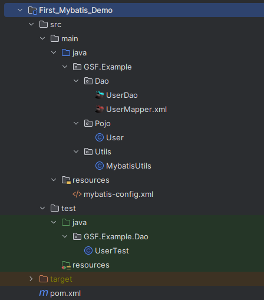
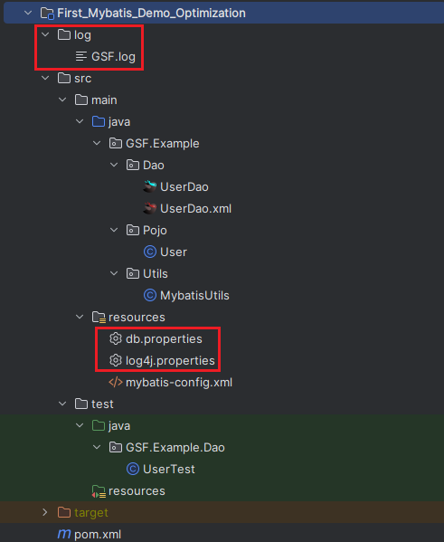
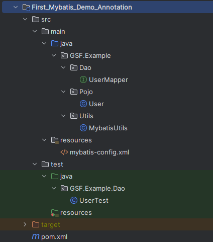
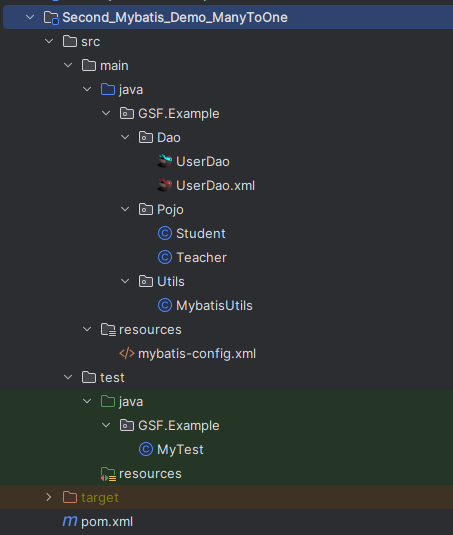
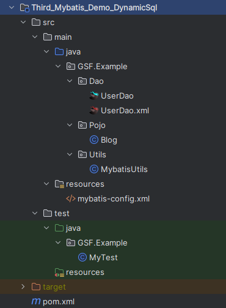

---


# 前言

本文主要学习Mybatis相关标签的使用及Mybatis的工作流程。

文中用到的示例，代码存储位置：

| GitHub | [https://github.com/Web-Learn-GSF/Java_Learn_Examples](https://github.com/Web-Learn-GSF/Java_Learn_Examples) |
| ------ | --------------------------------------------------------------------------------------------------------- |
| 父工程 | Java_Framework_Mybatis                                                                                    |

# 基础

## 示例 | 初始Mybatis

**数据库初始化**

```sql
-- 建表
CREATE TABLE `user`(
`id` INT(20) NOT NULL PRIMARY KEY,
`name` VARCHAR(30) DEFAULT NULL,
`pwd` VARCHAR(30) DEFAULT NULL
)ENGINE=INNODB DEFAULT CHARSET=utf8;

-- 插入语句
INSERT INTO `user`(`id`, `name`, `pwd`) VALUES
(1, "狂神", "123456"),
(2, "张三", "1234567"),
(3, "李四", "1234568")
```

**项目目录及内容**



|                    |                                                                                                                                                                                                                      |
| ------------------ | -------------------------------------------------------------------------------------------------------------------------------------------------------------------------------------------------------------------- |
| UserDao            | Dao接口，提供获取数据库数据的接口方法                                                                                                                                                                                |
| UserMapper.xml     | Dao接口对应的配置文件，每个接口方法都有对应的具体SQL语句                                                                                                                                                             |
| User               | 数据库对象                                                                                                                                                                                                           |
| MybatisUtils       | 每次连接数据库之前，都需要通过sqlSessionFactory来获取sqlSession对象，从而进行后续的数据库连接、sql执行、关闭操作<br />可以理解为：获取Dao接口的代理类对象，已经对接口方法进行增强，能运行相应的SQL语句及返回查询结果 |
| mybatis-config.xml | mybatis的配置文件，用于定义数据库的配置连接、Mapper的注册（将Dao接口与对应的xml文件相关联）                                                                                                                          |
| UserTest           | 测试文件                                                                                                                                                                                                             |

**常见问题汇总**

- Dao层Mapper.xml配置文件没有在mybatis-config.xml中注册
- maven导出资源问题：资源不放在resources文件夹下，正常情况下没法输出到target文件夹中。通过配置资源导出的目录解决该问题。

  通过设置：src/main/resources和src/main/java目录下的所有.xml文件和.properties文件，都会被识别为资源，从而在构建的时候输出到target目录

```xml
<!-- 在项目的pom.xml文件中加入此配置 -->

<build>
    <resources>
        <resource>
            <directory>src/main/resources</directory>
            <includes>
                <include>**/*.properties</include>
                <include>**/*.xml</include>
            </includes>
        </resource>
        <resource>
            <directory>src/main/java</directory>
            <includes>
                <include>**/*.properties</include>
                <include>**/*.xml</include>
            </includes>
        </resource>
    </resources>
</build>
```

## 示例 | 上述示例完善

**调整后的目录结构**



|                  |                                                                                                                                                                                      |
| ---------------- | ------------------------------------------------------------------------------------------------------------------------------------------------------------------------------------ |
| log              | 存放日志的文件夹                                                                                                                                                                     |
| db.properties    | 将数据库连接配置放在该配置文件中，提供一个key-value的访问结构，在mybatis-config.xml中导入后，可以通过变量标识符${}替换相应的连接对象                                                 |
| log4j.properties | Maven导入日志依赖、mybatis-config.xml中开启日志，`log4j.properties`配置文件配置日志细节（名字是默认的，放在resources目录下就能访问到；不同的日志实现，配置文件的默认名字也不一样） |

**相关改动细节**

- 通过 `db.properties`配置数据库连接，不再需要转义符了
- `mybatis-config.xml`：

  - 配置多套数据库环境
  - 映射Mapper的三种方式
- `UserDao.xml`：resultMap标签解决数据库字段与poji实体字段不一致的情况

## 示例 | 基于注解开发上述示例

**项目目录结构**



UserMapper.xml文件去掉了，转而在UserMapper.java中加入注解，实现SQL语句。

**注意：**即使没了UserMapper.xml配置文件，也要在mybatis-config.xml配置文件中注册mapper

# 进阶

## 示例 | resultMap多对一处理

**项目目录结构**



Pojo中，增加了学生和老师的实体对象。

---

**案例背景及概念理解：关联、集合**

在学校里，一个老师对应多个学生。

- 对于学生而言：是多对一的关系，多个学生**关联**一个老师
- 对于老师而言：是一对多的关系，一个老师**集合**多个学生

现在要求：查询所有的学生，及其关联的老师信息

数据库创建：

```sql
-- 新建老师表
CREATE TABLE `teacher` (
  `id` INT(10) NOT NULL,
  `name` VARCHAR(30) DEFAULT NULL,
  PRIMARY KEY (`id`)
) ENGINE=INNODB DEFAULT CHARSET=utf8

-- 插入老师数据
INSERT INTO teacher(`id`, `name`) VALUES (1, '秦老师');

-- 新建学生表
CREATE TABLE `student` (
  `id` INT(10) NOT NULL,
  `name` VARCHAR(30) DEFAULT NULL,
  `tid` INT(10) DEFAULT NULL,
  PRIMARY KEY (`id`),
  KEY `fktid` (`tid`),
  CONSTRAINT `fktid` FOREIGN KEY (`tid`) REFERENCES `teacher` (`id`)
) ENGINE=INNODB DEFAULT CHARSET=utf8

-- 插入学生数据
INSERT INTO `student` (`id`, `name`, `tid`) VALUES 
('1', '小明', '1'),
('2', '小红', '1'),
('3', '小张', '1'),
('4', '小李', '1'),
('5', '小王', '1')
```

---

**复杂查询的两种查询思路：**

- **子查询 | 按照查询嵌套处理**：先查询学生，为每一个查询到的学生，查询其对应的老师。

```sql
-- 对应的SQL写法
select id, name, tid, (select name from teacher as t where t.id = s.tid) as t_name from student s;
```

```xml
<select id="getTeacher"  resultType="GSF.Example.Pojo.Teacher">
    select * from learn_mybatis.teacher where id=#{id}
</select>

<!--根据查询嵌套处理-->
<select id="getStudent" resultMap="getStudent">
    select id, name, tid from learn_mybatis.student;
</select>

<resultMap id="getStudent" type="GSF.Example.Pojo.Student">
    <result property="id" column="id"/>
    <result property="name" column="name"/>
    <association property="teacher" column="tid" javaType="GSF.Example.Pojo.Teacher" select="getTeacher"/>
</resultMap>
```

- **连接查询 | 按照结果嵌套处理**：先查询所有的学生、老师，然后封装查询结果

```sql
select  s.id s_id ,s.name s_name, t.id t_id, t.name t_name 
from learn_mybatis.student s, learn_mybatis.teacher t
where s.tid=t.id
```

```xml
<select id="getStudent2" resultMap="getStudent2">
    select  s.id s_id ,s.name s_name, t.id t_id, t.name t_name 
    from learn_mybatis.student s, learn_mybatis.teacher t
    where s.tid=t.id
</select>

<resultMap id="getStudent2" type="GSF.Example.Pojo.Student">
    <result property="id" column="s_id"/>
    <result property="name" column="s_name"/>
    <association property="teacher" javaType="GSF.Example.Pojo.Teacher">
        <result property="id" column="t_id"/>
        <result property="name" column="t_name"/>
    </association>
</resultMap>
```

测试结果：

```
Student(id=1, name=小明, teacher=Teacher(id=1, name=秦老师))
Student(id=2, name=小红, teacher=Teacher(id=1, name=秦老师))
Student(id=3, name=小张, teacher=Teacher(id=1, name=秦老师))
Student(id=4, name=小李, teacher=Teacher(id=1, name=秦老师))
Student(id=5, name=小王, teacher=Teacher(id=1, name=秦老师))
```

---

**总结：association标签**

association标签，处理关联关系，即多对一关系


## 示例 | resultMap一对多处理

**项目目录结构**

同上述示例。

---

**案例背景及概念理解：关联、集合**

同上述示例。

现在要求：查询所有的老师，及其集合的学生信息

---

**复杂查询的两种查询思路：**

- **子查询 | 按照查询嵌套处理**：先查询老师，为每一个查询到的学生，查询其对应的老师。

```sql
-- 对应的SQL写法：好像没法写

-- 上述多对一关系中的写法：关注点在学生
-- 这个写法也是有隐患的，当一个学生对应多个老师的时候，同样会报错
select id, name, tid, (select name from teacher as t where t.id = s.tid) as t_name from student s;

-- 尝试的写法：关注点在老师。直接报错
-- 这样的子查询写法在()中语句返回不是单个值的时候会出现错误，因为select后的子查询，通常希望返回单个值。
select id, name, (select name from student as s where s.tid = t.id) as s_name from teacher as t;

-- 总的来说：还是用连接查询要好点，理解简单，还不容易出错，效率还高
```

```xml
<select id="getTeacher2" resultMap="TeacherStudent2">
    select * from learn_mybatis.teacher where id=#{id}
</select>

<resultMap id="TeacherStudent2" type="GSF.Example.Pojo.Teacher">
	<!--两个地方用到id，这个result就得写出来，不然不展示老师的id-->
    <result property="id" column="id"/>
    <result property="name" column="name"/>
    <collection property="students" column="id" javaType="ArrayList" ofType="GSF.Example.Pojo.Student" select="getStudentByTeacherId"/>
</resultMap>

<select id="getStudentByTeacherId" resultType="GSF.Example.Pojo.Student">
    select * from learn_mybatis.student where tid =#{id}
</select>
```

- **连接查询 | 按照结果嵌套处理**：先查询所有的学生、老师，然后封装查询结果

```sql
select s.id s_id, s.name s_name, t.name t_name, t.id t_id
from learn_mybatis.student s, learn_mybatis.teacher t
where s.tid = t.id
```

```xml
<select id="getTeacher"  resultMap="getTeacher">
    select s.id s_id, s.name s_name, t.name t_name, t.id t_id
    from learn_mybatis.student s, learn_mybatis.teacher t
    where s.tid = t.id and t.id=#{id}
</select>

<resultMap id="getTeacher" type="GSF.Example.Pojo.Teacher">
    <result property="id" column="t_id"/>
    <result property="name" column="t_name"/>
    <collection property="students" javaType="ArrayList" ofType="GSF.Example.Pojo.Student">
        <result property="id" column="s_id"/>
        <result property="name" column="s_name"/>
        <result property="tid" column="t_id"/>
    </collection>
</resultMap>
```

测试结果：

```
Teacher(id=1, name=秦老师, students=[Student(id=1, name=小明, tid=1), Student(id=2, name=小红, tid=1), Student(id=3, name=小张, tid=1), Student(id=4, name=小李, tid=1), Student(id=5, name=小王, tid=1)])
```

---

**总结：collection标签**

collection标签，处理集合关系，即一对多关系


# 进阶 | 动态SQL标签学习

## 项目准备

**项目目录**



**数据库环境**

```sql
-- 
CREATE TABLE `blog`(
`id` VARCHAR(50) NOT NULL COMMENT '博客id',
`title` VARCHAR(100) NOT NULL COMMENT '博客标题',
`author` VARCHAR(30) NOT NULL COMMENT '博客作者',
`create_time` DATETIME NOT NULL COMMENT '创建时间',
`views` INT(30) NOT NULL COMMENT '浏览量'
)ENGINE=INNODB DEFAULT CHARSET=utf8

INSERT INTO `blog`(`id`,`title`,`author`,`create_time`,`views`) VALUES
(1, "如何学Python", "青", "2022-10-11", 300),
(2, "如何学Java", "刘", "2022-10-12", 400),
(3, "如何学Django", "郭", "2022-10-13", 700)
```


## 动态SQL-IF

```java
public interface UserDao {
    List<Blog> getBlogIf(Map<String, Object> map);
}
```

```xml
<select id="getBlogIf"  parameterType="map" resultType="GSF.Example.Pojo.Blog">
    select * from learn_mybatis.blog where 1=1
    <if test="title != null">
        and title=#{title}
    </if>

    <if test="author != null">
        and author=#{author}
    </if>
</select>
```

- IF标签不具备自动添加and的功能，每个拼接的子SQL语句，需要自行添加and

```sql
-- 若传入空的map，真实的sql语句：
select * from learn_mybatis.blog where 1=1

-- 若传入的map带有title键，真实的sql语句：
select * from learn_mybatis.blog where 1=1 and title=?

-- 若传入的map带有title键和author键，真实的sql语句：
select * from learn_mybatis.blog where 1=1 and title=? and author=?
```


## 动态SQL-where、choose、when、otherwise

```java
public interface UserDao {
    List<Blog> getBlogChoose_When_Otherwise(Map<String, Object> map);
}
```

```xml
<select id="getBlogChoose_When_Otherwise"  parameterType="map" resultType="GSF.Example.Pojo.Blog">
    select * from learn_mybatis.blog
    <!-- 这里用到了下一个查询才讲述的where标签 -->
    <where>
        <choose>
            <when test="title != null">
               and title = #{title}
            </when>

             <when test="author !=null">
                and author = #{author}
            </when>

            <otherwise>
                and id = 1
            </otherwise>
        </choose>
    </where>
</select>
```

- choose、when、otherwisel类似java的switch用法：从上到下的判断语句，遇到满足的就用，即使后续有条件也满足，也不会调用
- where标签具备自动添加where字符和删除首个子SQL语句的and字符的功能

```sql
-- 若传入空的map，真实的sql语句：
select * from learn_mybatis.blog where id=1

-- 若传入的map带有title键，真实的sql语句：
select * from learn_mybatis.blog where title=?

-- 若传入的map带有title键和author键，真实的sql语句：
select * from learn_mybatis.blog where title=?
```


## 动态SQL-Set

```java
public interface UserDao {
    int updateBlogSet(Map<String, Object> map);
}
```

```xml
<update id="updateBlogSet" parameterType="map">
    update learn_mybatis.blog
    <set>
        <if test="title != null">
            title = #{title},
        </if>
        <if test="author != null">
            author = #{author},
        </if>
    </set>
    where id = #{id}
</update>
```

- set标签具备补充set字符和删除sql语句末尾“,”字符的功能
- if标签中sql子句末尾的“,”需要写入，不然sql语句报错

```sql
-- 若传入空的map或仅仅有id的map，真实的sql语句：
报错

-- 若传入的map带有title键，真实的sql语句：
update learn_mybatis.blog SET title = ? where id = ?

-- 若传入的map带有title键和author键，真实的sql语句：
update learn_mybatis.blog SET title = ?, author = ? where id = ?
```


## 动态SQL-trim、sql片段

```java
public interface UserDao {
    int updateBlogTrim(Map<String, Object> map);
}
```

```xml
<sql id="if-title-author">
    <if test="title != null">
        title = #{title},
    </if>
    <if test="author != null">
        author = #{author},
    </if>
</sql>

<update id="updateBlogTrim" parameterType="map">
    update learn_mybatis.blog
    <trim prefix="SET" suffixOverrides=",">
        <include refid="if-title-author">
        </include>
    </trim>
    where id = #{id}
</update>
```

```sql
-- 若传入空的map或仅仅有id的map，真实的sql语句：
报错

-- 若传入的map带有title键，真实的sql语句：
update learn_mybatis.blog SET title = ? where id = ?

-- 若传入的map带有title键和author键，真实的sql语句：
update learn_mybatis.blog SET title = ?, author = ? where id = ?
```

- trim标签可以自定义待拼接sql语句的相关前缀、后缀的补充操作及去除操作
- 上述用trim标签，实现set标签的相关功能

| trim标签属性    | 描述                                                                                                                    |
| --------------- | ----------------------------------------------------------------------------------------------------------------------- |
| prefix          | 给sql语句拼接的前缀                                                                                                     |
| suffix          | 给sql语句拼接的后缀                                                                                                     |
| prefixOverrides | 去除sql语句**前面**的关键字或者字符；<br />假设该属性指定为"AND"，当sql语句的开头为"AND"，trim标签将会去除该"AND" |
| suffixOverrides | 去除sql语句**后面**的关键字或者字符；<br />假设该属性指定为","，当sql语句的结尾为","，trim标签将会去除该","       |


## 动态SQL-foreach

```java
public interface UserDao {
    List<Blog> getBlogForeach(Map<String, Object> map);
}
```

```xml
<select id="getBlogForeach"  parameterType="map" resultType="GSF.Example.Pojo.Blog">
    select * from learn_mybatis.blog
    <where>
        <foreach collection="ids" item="id" open="and (" close=")" separator="or">
            id=#{id}
        </foreach>
    </where>
</select>
```

- 提供遍历操作
- 还是传入的map，只是map的键对应的值是一个list

```sql
-- 若传入空的map，真实的sql语句：
select * from learn_mybatis.blog

-- 若传入的map中的list带有值1，真实的sql语句：
select * from learn_mybatis.blog WHERE ( id=? )

-- 若传入的map中的list带有值1、2、3，真实的sql语句：
select * from learn_mybatis.blog WHERE ( id=? or id=? or id=? )
```


# 进阶 | 缓存

## 缓存的概念

**什么是缓存？**

存在内存中的临时数据。将用户经常查询的数据放在缓存（内存）中，用户去查询数据就不用了从磁盘上（关系型数据库数据文件）查询，而是从缓存中查询，从而提高查询效率，解决了高并发系统的性能问题。

**为什么使用缓存？**

减少和数据库的交互次数，较少系统开销，提高系统效率

**什么样的数据能使用缓存？**

经常查询而且不经常改变的数据


## Mybatis缓存

MyBatis包含一个非常强大的查询缓存特性，它可以非常方便地定制和配置缓存。缓存可以极大的提升查询效率。

MyBatis系统中默认定义了两级缓存：一级缓存和二级缓存

- 默认情况下，只有一级缓存开启 (SqlSession级别的缓存，也称为本地缓存)
- 二级缓存需要手动开启和配置，他是基于namespace级别的缓存
- 为了提高扩展性，MyBatis定义了缓存接口Cache。我们可以通过实现Cache接口来自定义二级缓存（学到了再说）


### 一级缓存

> 与数据库同一次会话期间查询到的数据会放在本地缓存中，以后如果需要获取相同的数据，直接从缓存中拿，没必须再去查询数据库

**测试验证一级缓存**

```java
@Test
public void  test(){
    SqlSession sqlSession = MybatisUtils.getSqlSession();
    UserMapper mapper = sqlSession.getMapper(UserMapper.class);
    User user = mapper.queryUserById(1);
    System.out.println(user);
    System.out.println("=================================================================");
    User user2 = mapper.queryUserById(1);
    System.out.println(user2);

    // true：返回结果为true，且只执行了一次sql语句
    System.out.println(user==user2);

    sqlSession.close();
}
```

**一级缓存失效条件**

- 查询不同的东西
- 增删改操作，可能会改变原来的数据，所以必定会刷新缓存！
- 查询不同的Mapper.xml
- 手动清理缓存！

```java
@Test
public void  test(){
    SqlSession sqlSession = MybatisUtils.getSqlSession();
    UserMapper mapper = sqlSession.getMapper(UserMapper.class);
    User user = mapper.queryUserById(1);
    System.out.println(user);

    // 更新数据，导致缓存时效
    //mapper.updateUser(new User(2,"niahoooo","309487"));

    // 手动清理缓存，导致缓存时效
    //sqlSession.clearCache();

    System.out.println("=================================================================");
    User user2 = mapper.queryUserById(1);
    System.out.println(user2);

    System.out.println(user==user2);

    sqlSession.close();
}
```

**一级缓存生命周期**

生命周期为一个特定mapper.xml的一次sqlsession会话


### 二级缓存

> 二级缓存也叫全局缓存，一级缓存作用域太低了，所以诞生了二级缓存
>
> 基于namespace级别的缓存，一个名称空间，对应一个二级缓存
>
> 工作机制：
>
> - 一个会话查询一条数据，这个数据就会被放在当前会话的一级缓存中：
> - 如果当前会话关闭了，这个会话对应的一级缓存就没了，一级缓存中的数据被保存到二级缓存中；
> - 新的会话查询信息，就可以从二级缓存中获取内容
> - 不同的mapper.xml查出的数据会放在自己对应的缓存(map)中

**测试验证二级缓存**

- 在全局开启二级缓存：mybatis-config.xml

```xml
<setting name="cacheEnable" value="true"/>
```

- 在要开启缓存的mapper.xml中开启

```xml
<cache  eviction="FIFO"
        flushInterval="60000"
        size="512"
        readOnly="true"/>
```

- 测试

```java
@Test
public void  test(){
    SqlSession sqlSession = MybatisUtils.getSqlSession();
    SqlSession sqlSession2 = MybatisUtils.getSqlSession();

    UserMapper mapper = sqlSession.getMapper(UserMapper.class);

    User user = mapper.queryUserById(1);
    System.out.println(user);
  
    UserMapper mapper2 = sqlSession2.getMapper(UserMapper.class);
    User user2 = mapper.queryUserById(1);
    System.out.println(user2);

    System.out.println(user==user2);

    sqlSession.close();
    sqlSession2.close();
}
```

**注意事项：**

- 我们需要将实体类序列化(实现Serializable接口)，否则就会报错
- sqlsession关闭的时候一定要在最后关闭，不能先关闭sqlsession再关闭sqlsession2，这样会导致Cause: org.apache.ibatis.executor.ExecutorException: Executor was closed

**二级缓存的生命周期**

在同一个Mapper.xml下的多次Sqlsession

只有当sqlsession关闭的时候，数据才会从一级缓存扔到二级缓存


### 自定义二级缓存-ehcache

- EhCache 是一个纯Java的进程内缓存框架，具有快速、精干等特点，是Hibernate中默认的CacheProvider
- Ehcache是一种广泛使用的开源Java分布式缓存。主要面向通用缓存

具体使用，用到再说，开发中常用Redis数据库来做缓存。


## Mybatis缓存的调用顺序

1. 先看二级缓存中有没有
2. 再看一级缓存中有没有
3. 查询数据库：查询后将数据放入一级缓存
