---


# 前言

本文简要介绍SpringBoot的自动配置原理。

本文讲述的SpringBoot版本为：3.1.2。


# 前置知识

在看原理介绍之前，需要知道 `@Import`注解的作用：

- 可以导入@Configuration注解的配置类、声明@Bean注解的bean方法；
- 可以导入ImportSelector的实现类；【自动配置原理用到注解的这个作用】
- 可以导入ImportBeanDefinitionRegistrar的实现类。


# 原理介绍

## 从启动类入手

**一个常规的SpringBoot项目的启动类内容如下**：

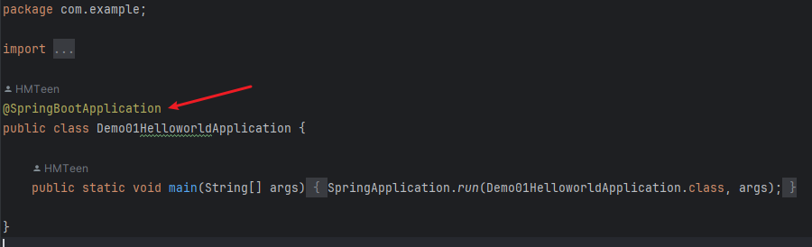

**从启动类上的 `@SpringBootApplication`入手**：

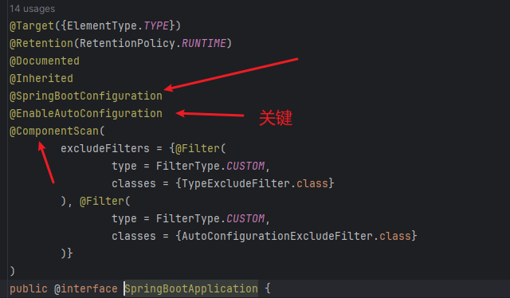

三个注解箭头指示的注解，各有各的作用：

- `@SpringBootConfiguration`：组合了 `@Configuration`注解，表示这是一个配置类
- `@EnableAutoConfiguration`：允许自动配置
- `@ComponentScan`：Spring的组件扫描，默认扫描main方法所在类所在的包及其子包

其中第二个注解 `@EnableAutoConfiguration`是实现自动配置的关键。

**从 `@EnableAutoConfiguration`注解入手**：

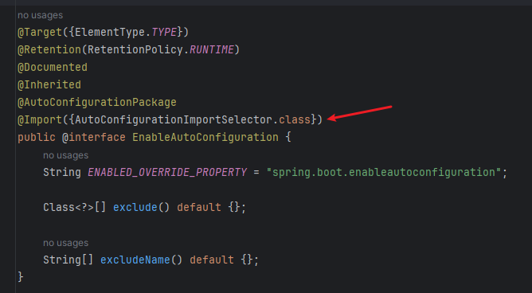

可以看到该注解中有一个 `@Import`注解，先说结论：在 `AutoConfigurationImportSelector`类中加载了哪些需要自动配置的Bean，并完成加载，注入到IOC容器中。


## 到AutoConfigurationImportSelector类

**从 `AutoConfigurationImportSelector`类入手**：

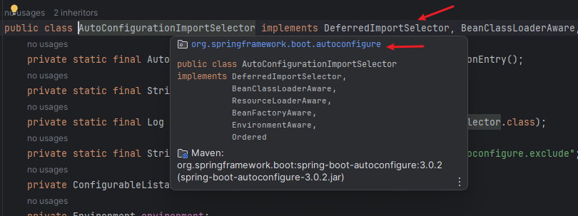

可以看出：`AutoConfigurationImportSelector`类是 `org.springframework.boot.autoconfigure`包下的一个类，实现了 `DeferredImportSelector`等接口

- `org.springframework.boot.autoconfigure`：望名生意，自动配置，就是在该包里面，规定了哪些Bean需要配置。
- `DeferredImportSelector`：该接口是实现自动配置的关键，里面的 `selectImports`方法规定了哪些Bean需要自动配置。

**往下滑，看 `AutoConfigurationImportSelector`类的 `selectImports`方法**：

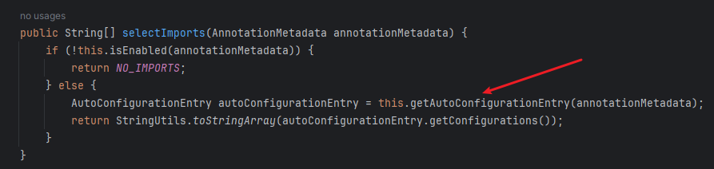

红框所示代码：返回了需要自动配置的Bean列表。

**从 `this.getAutoConfigurationEntry`方法入手**：

```java
protected AutoConfigurationEntry getAutoConfigurationEntry(AnnotationMetadata annotationMetadata) {
    if (!this.isEnabled(annotationMetadata)) {
        return EMPTY_ENTRY;
    } else {
        AnnotationAttributes attributes = this.getAttributes(annotationMetadata);
      
        // 获取该类所在包下的META-INF/spring/目录中以.imports为后缀结尾的文件里面的内容，作为候选配置列表
        List<String> configurations = this.getCandidateConfigurations(annotationMetadata, attributes);
      
        // 去除重复的配置
        configurations = this.removeDuplicates(configurations);
      
        // 排除部分元注解信息中需要排除的配置
        Set<String> exclusions = this.getExclusions(annotationMetadata, attributes);
        this.checkExcludedClasses(configurations, exclusions);
        configurations.removeAll(exclusions);
      
        // 过滤掉一些暂时不生效的配置：加了如下注解的bean：@OnxxxCondition
        configurations = this.getConfigurationClassFilter().filter(configurations);
        this.fireAutoConfigurationImportEvents(configurations, exclusions);
        return new AutoConfigurationEntry(configurations, exclusions);
    }
}
```

该方法中代码的逻辑如上。就剩一个 `this.getCandidateConfigurations`方法需要再探究，里面规定了从哪个地方寻找需要配置的bean列表。

**从 `this.getCandidateConfigurations方法入手`**：

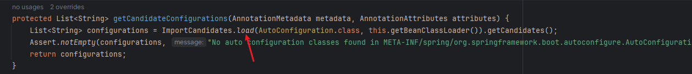

**再进入箭头所指向的load方法**：

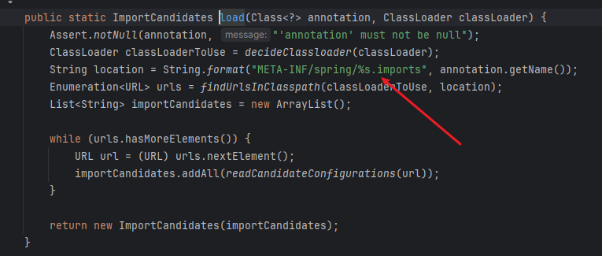

可以看到：该方法往包下的 `META-INF/spring/`目录中寻找后缀名为 `.imports`的文件。


## 到org.springframework.boot.autoconfigure包中看看

**从idea左侧的依赖列表里面查看：**

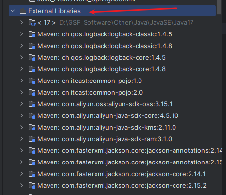

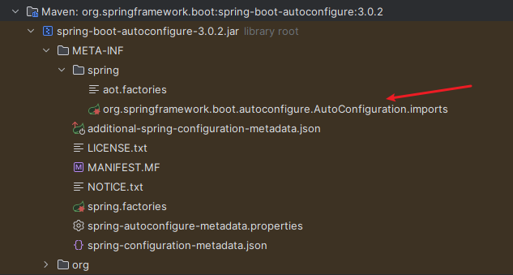

**点开文件里面任意一个类：**

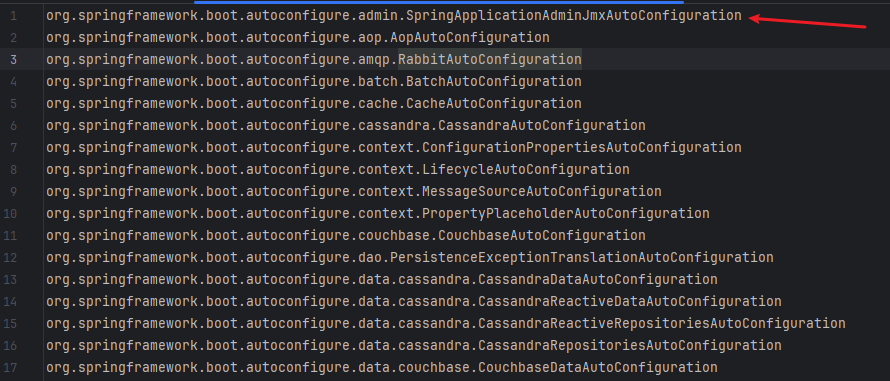

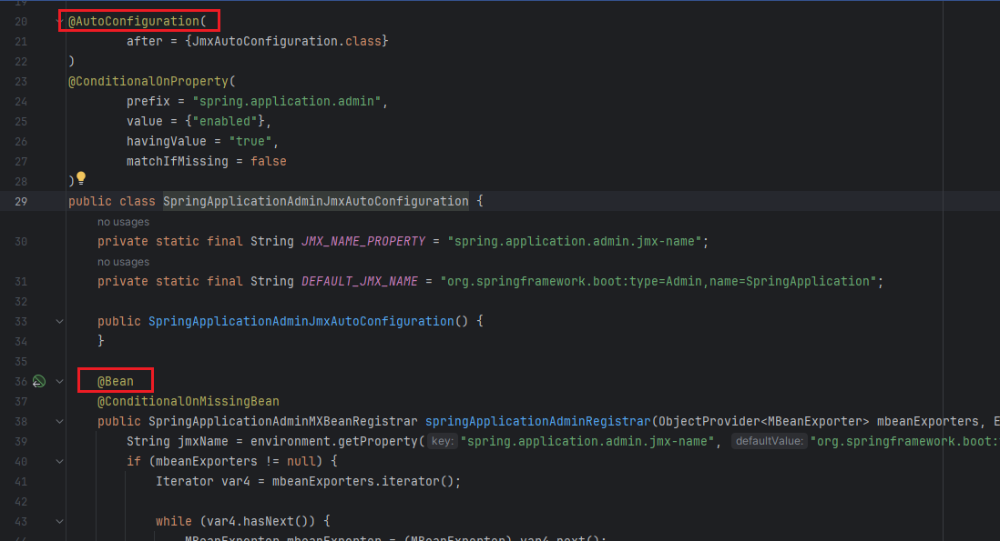

都是一个自动配置类，定义有相应的Bean方法。

至此，SpringBoot的自动配置原理就明白了。


# 原理总结

- 启动类中有一个@SpringBootApplication注解，包含了@EnableAutoConfiguration代表开启自动装配
- @EnableAutoConfiguration注解里面组合了一个 `@Import`注解，这个注解是实现自动配置的关键。
- `@Import`注解最终的作用可以总结如下：到spring-boot-autoconfigure包下的META-INF/spring目录中寻找.imports结尾的文件，这里面列举了所有需要自动配置的类，程序会读取这些类并加载（但这些类不会全部加载，因为有的类上面有条件注解，需要满足特定条件时才会生效）
  - spring-boot-autoconfigure包下的 `AutoConfigurationImportSelector`类实现了 `ImportSelector`，并重写了 `selectImports`方法
  - 在 `selectImports`方法中，定义类自动配置类的加载位置。还有一些配置类的去重操作、排除操作等。
