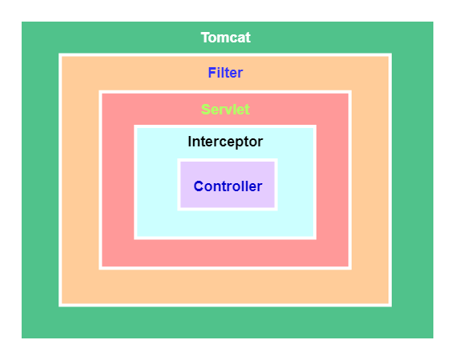

---


## Spring-必问基础

==【八股】什么是Spring？==

概念：Spring是一个轻量级的控制反转（IOC）和面向切面（AOP）的容器/框架。

优点：

- 通过控制反转（IOC）和依赖注入（DI）实现代码的松耦合
- 支持面向切面（AOP）编程，把业务逻辑和系统服务分开
- 支持声明式事务管理，提高开发效率
- 方便继承其他各种优秀框架
- 方便程序测试，Spring支持Junit4，可以通过注解添加测试程序

---

==【八股】Spring、SpringMVC、SpringBoot的区别？==

- Spring是一个轻量级的控制反转和面向切面的容器，包含很多模块；
- Spring MVC是Spring的一个核心模块之一，主要赋予Spring快速构建MVC框架的Web程序的能力；
- SpringBoot是Spring的扩展升级，旨在简化Spring开发。Spring需要繁琐的xml配置，SpringBoot可以大大减少这些配置过程。

---

==【八股】Spring中用到了哪些设计模式？==

- 工厂模式：Spring获取Bean对象
- 单例模式：Spring创建的Bean实例默认是单例的
- 代理模式：Spring的AOP的实现就是动态代理模式
- 适配器模式：SpringMVC的适配器HandlerAdatper
- 模板模式：Spring中jdbcTemplate

---

==【八股】Spring包含哪些核心模块？==


- `Spring MVC`：赋予Spring快速构建MVC架构的Web程序的能力；
- `Spring Core`：提供了Spring框架的基本功能，核心组件是BeanFactory，用来统一创建、组织、管理Bean实例；
- `Spring AOP`：为Spring提供面向切面的编程功能，可以借助AOP，使得Spring以注解的形式，快捷的使用声明式事务；
- `Spring Context`：
- `Spring ORM`：
- `Spring Dao`：
- `Spring Web`：

理解了某个模块的意义，再网上整理。

|      模块      | 作用                                                                                                                                                                                                                                                                                      |
| :------------: | ----------------------------------------------------------------------------------------------------------------------------------------------------------------------------------------------------------------------------------------------------------------------------------------- |
|  Spring Core  | 核心容器提供 Spring 框架的基本功能。核心容器的主要组件是 BeanFactory，它是工厂模式的实现。BeanFactory 使用*控制反转*（IOC） 模式将应用程序的配置和依赖性规范与实际的应用程序代码分开                                                                                                    |
| Spring Context | Spring 上下文是一个配置文件，向 Spring 框架提供上下文信息。Spring 上下文包括企业服务，例如 JNDI、EJB、电子邮件、国际化、校验和调度功能                                                                                                                                                    |
|   Spring AOP   | 通过配置管理特性，Spring AOP 模块直接将面向切面的编程功能 ， 集成到了 Spring 框架中。所以，可以很容易地使 Spring 框架管理任何支持 AOP的对象。Spring AOP 模块为基于 Spring 的应用程序中的对象提供了事务管理服务。通过使用 Spring AOP，不用依赖组件，就可以将声明性事务管理集成到应用程序中 |
|   Spring DAO   | JDBC DAO 抽象层提供了有意义的异常层次结构，可用该结构来管理异常处理和不同数据库供应商抛出的错误消息。异常层次结构简化了错误处理，并且极大地降低了需要编写的异常代码数量（例如打开和关闭连接）。Spring DAO 的面向 JDBC 的异常遵从通用的 DAO 异常层次结构                                   |
|   Spring ORM   | Spring 框架插入了若干个 ORM 框架，从而提供了 ORM 的对象关系工具，其中包括 JDO、Hibernate 和 iBatis SQL Map。所有这些都遵从 Spring 的通用事务和 DAO 异常层次结构                                                                                                                           |
|   Spring Web   | Web 上下文模块建立在应用程序上下文模块之上，为基于 Web 的应用程序提供了上下文。所以，Spring 框架支持与 Jakarta Struts 的集成。Web 模块还简化了处理多部分请求以及将请求参数绑定到域对象的工作                                                                                              |
|   Spring MVC   | MVC 框架是一个全功能的构建 Web 应用程序的 MVC 实现。通过策略接口，MVC 框架变成为高度可配置的，MVC 容纳了大量视图技术，其中包括 JSP、Velocity、Tiles、iText 和 POI                                                                                                                         |


## Spring-IOC

### 概念 | IOC相关

==【八股】什么是IOC？有什么作用？==

概念：IOC，Inversion of Control，控制反转，是一种设计思想；

IOC在Spring中的体现就是：将原本由程序手动创建对象的控制权交给Spring来管理，Spring通过反射完成对对象的控制，包括对象的初始化、创建、销毁。

理解IOC的两个点：

- 控制：创建、管理对象的权力；
- 反转：控制权从程序用户手上交给外部环境（Spring框架，IOC容器）；

IOC的好处：IOC实现了将资源移交到第三方来管理，而不是让资源的使用者来管理，使得：

- 资源管理集中：通过Spring，统一来管理对象资源，使得资源可配置和易管理；
- 降低耦合度：降低使用资源双方的依赖程度（资源的创建者 和 资源的使用者）；
- 延迟加载：可以使得Bean实例在需要的时候创建，减少应用程序的启动时间；

IOC在生活中的举例：日常生活中的淘宝就可以看作是IOC的一种体现。

---

==【八股】IOC容器初始化的过程？==

1、创建容器

2、加载配置文件：

- IOC首先会读取配置文件信息，配置文件中定义了需要管理的Bean以及Bean之间的依赖关系
- 这个配置文件可以是：XML配置文件、YAML文件、Java配置类、注解等

3、注册BeanDefination：

- 在加载配置文件的过程中，IOC容器会去解析配置文件中的Bean定义，然后转换为内部的BeanDefination对象
- BeanDefination对象包含Bean的元数据信息：Bean的类型、作用域、是否懒加载、所依赖的Bean等

4、创建BeanFactory：

- 在上述两个步骤完成之后，IOC容器会创建一个BeanFactory
- BeanFactory是Spring框架的核心，定义了管理Bean的规范

5、完成Bean的创建：

- Bean有完整的生命周期，可以参考后文回答
- 大致还有如下步骤：实例化Bean、注入依赖、返回Bean、缓存Bean


### 概念 | DI相关

==【八股】什么是DI？DI的实现方式？==

参考文章：[Spring-Bean注入-xml+注解 ](/ToBeABD/Java/dn9s5lfg/)

概念：Dependency Injection，DI，依赖注入。指在Spring创建对象的过程中，把对象依赖的属性注入到对象中。DI是Spring中IOC思想的一种实现方式。

DI两种实现方式：构造器注入和属性注入

- 构造器注入：依赖于类的全参构造方法
- 属性注入：依赖于类的set()方法 + 类的无参构造方法

此外还有p标签注入和c标签注入，但本质还是上述两种注入方式。


### 概念 | Bean相关

==【八股】什么是SpringBean？将一个类声明为Bean的方式有哪些？==

Bean的概念：代指那些被IOC容器管理的类的实例化对象。

将一个类声明为Bean，主要有两大类方式：

- 通过xml配置文件：定义Bean标签
- 通过注解的方式：

|             |                                         |
| ----------- | --------------------------------------- |
| @Component  | 通用注解，将类注入到IOC容器中           |
| @Repository | 将持久层DAO的对象注入到IOC容器中        |
| @Service    | 将服务层Service的对象注入到IOC容器中    |
| @Controller | 将控制层Controller的对象注入到IOC容器中 |

---

==【八股】讲一下Bean的生命周期？==

Bean的生命周期整体分为四步：

- 实例化：主要是在内存中创建出来一个类的实例化对象（此时还没注册到容器中）；类实例化对象的创建主要是使用Java的反射机制来实现
- 属性赋值：为类的实例对象赋予相关的属性和依赖
- 初始化：配置和准备Bean的过程，此过程用于将类的实例对象注入到IOC容器中为一个Bean
- 销毁Bean：释放Bean所持有的资源

具体流程图如下：


其他操作的补充：

- 给Bean进行属性赋值的手段：

```
注解赋值：
- @Autowired：注解注入对象的属性，该属性已经是IOC容器的一个bean
- @value：注解注入对象的属性，该属性是一个值，跟在注解后面给出
- @Resource：注解注入字段、方法的属性。该属性已经是IOC容器的一个bean，有一定的bean查找规则。

配置文件的标签赋值：
- xml-bean标签-property标签：本质是调用类的set方法注入属性
- xml-bean标签-constructor-arg标签：本质是调用类的构造器方法注入属性。
```

- xxxAware相关接口：

```
该接口用于让Bean对象能感知到Spring容器中的一些资源或功能
- 如果 Bean 实现了 BeanNameAware 接口，调用 setBeanName()方法，这个Bean就能知道自己在IOC容器的名字是什么。
- 如果 Bean 实现了 BeanClassLoaderAware 接口，调用 setBeanClassLoader()方法，这个Bean就知道自己的类加载器是什么了。
```

---

==【八股】Spring AOP在Bean的哪一个生命周期？==

一般来说，在初始化之后

---

==【八股】Bean的作用域有哪些？==

|                                               |                                                                                              |
| --------------------------------------------- | -------------------------------------------------------------------------------------------- |
| singleton                                     | 单例模式，Bean只有一个实例，默认的作用域                                                     |
| prototype                                     | 每次 `getBean()`获取Bean，都是不同的Bean实例                                               |
| request（仅 Web 应用可用）                    | 每一次 HTTP 请求都会产生一个新的 bean，该 bean 仅在当前 HTTP request 内有效                  |
| session（仅 Web 应用可用）                    | 每一次来自新 session 的 HTTP 请求都会产生一个新的 bean，该 bean 仅在当前 HTTP session 内有效 |
| application/global-session（仅 Web 应用可用） | 每个 Web 应用在启动时创建一个 Bean，该 bean 仅在当前应用的启动时间内有效                     |
| websocket（仅 Web 应用可用）                  | 每一次 WebSocket 会话产生一个新的 bean                                                       |

---

==【八股】Bean是线程安全的嘛？==

以常见的两种作用域为例：prototype 和 singleton

- prototype：每次获取都是新的Bean实例，不存在资源竞争
- singleton：

  - 如果Bean是无状态的（没有可变的成员变量），那就是线程安全的
  - 如果Bean是有状态的（有可变的成员变量），那就是线程不安全的。

==【八股】对于线程不安全的Bean，有什么解决办法？==

线程不安全的Bean：有状态单例 Bean；

常见的两种解决办法：

- 在 Bean 中尽量避免定义可变的成员变量。
- 在类中定义一个 `ThreadLocal` 成员变量，将需要的可变成员变量保存在 `ThreadLocal` 中（推荐）

```
ThreadLocal可以给每个线程提供一个变量副本。

这样当多个线程访问一个有状态的Bean单例时：
- 无状态的变量：值不变，不影响不同线程使用
- 有状态的变量：每个线程都有自己的线程副本，改变这些变量后，不影响其他线程对该Bean单例的使用
```

---

==【八股】Bean的循环依赖是什么？会产生什么问题？怎么解决？==

循环依赖：两个或多个Bean之间相互依赖，形成一个闭环

产生的问题：会提前暴漏不完整的Bean，使得对象状态不完整或不一致

解决方案：

- Spring的三级缓存
- 重新设计方案

---

Spring的三级缓存参考文章：[文章链接](https://blog.csdn.net/yuanchangliang/article/details/128935135)

需要明确的一些概念：

- 三级缓存在底层是一个什么？（Map集合）
- 三级缓存每层都存储什么？（完整的Bean、没有完全属性注入和初始化的半成品Bean、单例Bean的Factory对象）
- 三级缓存不能解决什么类型的循环依赖？（构造器类型的循环依赖）
- 三级缓存解决循环依赖的一个大体步骤？（以A依赖B，B依赖A为例，看文章讲解一下）
- 其他问题，看文章吧


### 示例 | 理解IOC、DI

- 参考文章：[Spring-IOC-理解](/ToBeABD/Java/i18mrej7/)


## Spring-AOP

### 基本概念

==【八股】什么是AOP？==

概念：AOP，面向切面编程，通过预编译方式和运行期动态代理实现程序功能的统一维护的一种技术，可以在方法的执行前后，添加统一的处理逻辑，为方法进行增强。

用途：为某些方法实行无侵入式的增强；提供日志、权限、事务等功能。

---

==【八股】AOP的底层原理？Java实现AOP的方式？==

AOP的实现依赖于代理模式，代理模式有两类：静态代理（用的少）和动态代理；

Spring中AOP的底层实现是动态代理，动态代理的实现依赖于Java的反射机制；

其中动态代理又分为两类：JDK动态代理 和 CGLIB动态代理。

---

==【八股】JDK动态代理和CGLIB动态代理的区别？==

实现机制：

- JDK：底层实现是Java的反射机制
- CGLIB：底层实现是字节码技术，通过继承目标类来创建子类作为代理对象

使用场景：

- JDK：要求目标对象实现一个或多个接口
- CGLIB：要求目标对象可以被继承

---

==【八股】AOP中通知Advice有几种？有什么区别？==

- 前置通知：在目标方法前边执行；一般用于参数校验、日志记录
- 后置通知：在目标方法正常执行后执行，只有目标方法正常执行了，才会触发
- 异常通知：在目标方法执行过程中抛出了异常，才会执行该通知；一般用于捕获和处理方法中抛出的异常
- 最终通知：无论目标方法是否正常执行，都会执行最终通知
- 环绕通知：在目标方法之前、之后都执行；


### 示例 | AOP实现+相关概念

- 参考文章：[Spring-AOP理解](/ToBeABD/Java/0tddvz4m/)


## Spring-事务

### 基本概念

**Spring事务编程式和声明式，怎么实践的，要注意哪些问题？底层是什么设计模式？复杂场景应该用哪个**？

- 怎么实践的？ 意思就是说怎么使用
- 要注意哪些问题？ 意思就是使用的特点和缺点
- 底层是什么设计模式？  主要是针对声明式事务，底层是基于动态代理的AOP面向切面；编程式没有具体的设计模式
- 复杂场景用哪个？  用编程式，往编程式的特点上靠

---

==【八股】Spring中管理事务的方式有几种？==

Spring中有两种管理事务的方式：

- 编程式事务：事务管理硬编码到代码中，通过 `TransactionTemplate`或 `TransactionManager`手动管理事务。
  - 特点：更推荐在分布式系统中推荐使用，编程式事务的控制力度更强大、更精细
  - 缺点：每次使用事务都需要额外写事务的提交、回滚代码
- 声明式事务：在XML配置文件中配置或基于注解（`@Transactional`，本质是基于AOP实现的）
  - 特点：更推荐在单体系统中使用，声明式事务基于AOP，是方法级别的事务管理，事务控制力度要比编程式事务粗糙一点。
  - 缺点：方法级别的事务管理，不够精细。

复杂场景下推荐使用声明式事务，可以对代码进行更精细的控制；而且也不容易被开发者忽略，在添加诸如RPC远程调用这些方法的时候也能注意到。

---

==【八股】Spring中有哪些事务传播行为？==

应用场景：业务层方法之间可能会经常相互调用，不同的方法有不同的事务。事务传播行为就规定了事务方法中包含事务方法的处理规则。

常见的事务传播行为有：

| 事务传播                         | 当前方法没有在事务中 | 当前方法在事务A中                         |
| -------------------------------- | -------------------- | ----------------------------------------- |
| `propagation_requierd（默认）` | 新建一个事务         | 加入事务A                                 |
| `propagation_required_new`     | 新建一个事务         | 挂起事务A；新建事务B，处理完毕后恢复事务A |
| `propagation_nested`           | 新建一个事务         | 新建一个事务B嵌套在事务A中                |
| `propagation_mandatory`        | 抛出异常             | 加入事务A                                 |
| `propagation_supports`         | 以非事务方式运行     | 加入事务A                                 |
| `propagation_not_supported`    | 以非事务方式运行     | 把事务A挂起                               |
| `propagation_never`            | 以非事务方式运行     | 抛出异常                                  |

【补充】

- 挂起事务：指暂定事务的运行以方便开启另外一个事务，被挂起的事务后续可以恢复。
- 嵌套事务：嵌套事务指一个事务A中有另外一个事务B，他们之间有一个父子关系。通常：父事务的回滚会让所有子事务也会滚；子事务可以独立回滚。

---

==【八股】Spring中的事务隔离级别有几种？==

 就是MySQL数据库的4种事务隔离级别：RU、RC、RR、Seralizable；多了一个参数：`ISOLATION_DEFAULT`，表示采用数据库默认的事务隔离级别；

MySQL的默认隔离级别是RR，Oracle的默认隔离级别是RC

---

==【八股】@Transactional注解怎么使用？默认的回滚策略是什么？怎么更改默认的回滚策略？==

使用：

- 可以用在类上，等价于给类所有的方法添加上该注解
- 可以用在方法上，相当于单独给该方法添加注解（若此时类上也有该注解，最终会采用方法上的注解设置进行生效）

默认的回滚策略：`RuntimeException`和 `Error`下的异常才进行回滚操作；不回滚 `Cheaked Exception`（认为这种异常可预测，应该用业务逻辑处理）

修改默认的回滚策略：

- `@Transactional(rollbackFor = Exception.class )` ：指定哪些异常需要回滚
- `@Transactional(norollbackFor = CustomException.class )`：指定哪些异常不需要回滚

---

==【八股】通过注解实现的Spring事务在什么情况下失效？==

- 方法自身问题：方法的权限不是public，Spring事务只能在权限修饰符为public的方法上生效；
- 方法调用问题：通过 `this`调用方法，而没有用代理对象调用（Spring注解事务是基于AOP来实现的，需要代理对象执行目标方法）；
- 方法内部逻辑问题：手动catch了异常，Spring事务要正常回滚，需要方法抛出异常，若是手动捕捉了异常，则不会触发事务回滚；
- 数据库层面问题：所用的数据库引擎不支持事务

---

==【八股】Spring事务，同一个类中A方法调用事务注解修饰的B方法为什么会失效？==

```java
public Test{
    void A(){
        this.B()
    }
  
    @Transactional
    void B(){}
}
```

因为Spring事务是基于AOP来实现的，在方法A中调用方法B，就没有走代理对象，而是用的this

**如何保证上述应用场景下的事务不失效**？

- 通过Spring Context 获取代理对象，用代理对象调用方法：
- 在类中使用@Autowired注入自身，通过自身来调用方法而不是this

[参考文章](https://blog.csdn.net/hellozhxy/article/details/109753711)


### 示例 | 使用Spring事务

**编程式事务使用示例：TransactionTemplate**

```java
@Service
public class PaymentService {
    private final TransactionTemplate transactionTemplate;

    // 1、先在构造方法上注入PlatformTransactionManager
    @Autowired
    public PaymentService(PlatformTransactionManager platformTransactionManager){
        this.transactionTemplate = new TransactionTemplate(platformTransactionManager);
        // 2、参数设定
      
        // 事务的隔离级别
        transactionTemplate.setIsolationLevel(TransactionDefinition.ISOLATION_REPEATABLE_READ);
        // 事务超时时间20秒
        transactionTemplate.setTimeout(20);
        // 事务的传播行为
        transactionTemplate.setPropagationBehavior(TransactionDefinition.PROPAGATION_MANDATORY);
    }

    // 示例1：执行事务，带有返回值
    public Order payOrder(Order order){
       Order result = transactionTemplate.execute(new TransactionCallback<Order>() {
            @Override
            public Order doInTransaction(TransactionStatus status) {
                createOrder(order);
                updateOrder(order);
                return order;
            }
        });
       return result;
    }
  
    // 示例2：执行事务，不带有返回值
    public void payOrderWithoutReturnResult(Order order){
            // 使用TransactionCallbackWithoutResult类型的匿名类
            transactionTemplate.execute(new TransactionCallbackWithoutResult() {
                @Override
                protected void doInTransactionWithoutResult(TransactionStatus status) {
                    updateOrder(order);
                    updateOrder(order);
                }
            });
    }
  
    // 示例3：执行事务，手动回滚事务
    public void payOrderWithoutReturnResult(Order order){
            transactionTemplate.execute(new TransactionCallbackWithoutResult() {
                @Override
                protected void doInTransactionWithoutResult(TransactionStatus status) {
                    try {
                        updateOrder(order);
                        updateOrder(order);
                    }catch (Exception e){
                        // 记录错误日期
                        // 回滚事务
                        status.setRollbackOnly();
                    }
                }
            });
    }
  
  
    private void createOrder(Order order){};
    private void updateOrder(Order order){};
}
```

**编程式事务使用示例：TransactionManager**

`TransactionManager`是更低一级的事务管理方法，使用之前需要设定各种参数；

`@Transactional`注解和 `TransactionTemplate`都是用其来管理事务的。

```java
@Service
public class CartService {
    private final PlatformTransactionManager platformTransactionManager;

    // 1、构造方法上注入PlatformTransactionManager
    @Autowired
    public CartService(PlatformTransactionManager platformTransactionManager){
        this.platformTransactionManager = platformTransactionManager;
    }

    public void registerOrder(Order order){
        // 2、相关参数设置
        DefaultTransactionDefinition def = new DefaultTransactionDefinition();
        def.setName("registerOrderTransaction");									// 事务的名字
        def.setIsolationLevel(TransactionDefinition.ISOLATION_REPEATABLE_READ);		// 事务的隔离级别
        def.setTimeout(10);															// 事务超时时间10秒

        // 3、事务的执行
        TransactionStatus status = platformTransactionManager.getTransaction(def);

        try {
            // 需要事务的代码
            // 更新用户购买信息
            // 更新购物车信息
            // ....
        } catch (Exception e){
            e.printStackTrace();
            // 异常回滚事务
            platformTransactionManager.rollback(status);
        }
      
        // 正常执行，提交事务
        platformTransactionManager.commit(status);
    }
}
```

**声明式事务使用示例**

```java
@Service
public class CartService {
    @Transactional
    public void payment(){
        // 保存请求记录到本地数据库
        savePaymentRequest();
        // 调用第三方支付接口
        callWechatPaymentAPI();
        // 更新本地数据库支付状态
        updatePaymentState();
    }
}
```

【补充】第二步：调用第三方支付接口，如果因为网络波动，该请求较为耗时，会导致该事务一直占据数据库连接，若该接口调用频繁，则会耗尽连接，影响后续请求使用，所以在涉及第三方接口调用的场景时，还是使用编程式事务更为合理一点。


## Spring-SpringMVC

### 基本概念

==【八股】谈谈对SpringMVC的理解？==

SpringMVC是一种基于Java的实现MVC设计模式的请求驱动类型的轻量级Web框架，属于Sprng框架的一个模块。

MVC是一种设计模式，全称是：Model（模型） - View（视图） - Controller（控制器），通过将业务逻辑、数据、显示三者分开来组织代码。

MVC每个模块都有自己的作用：

- `Module`： 提供要展示的数据，即处理后需要渲染到页面上的数据
- `View`： 负责进行模型的展示，即我们看到的界面
- `Controller`： 接受用户请求，委托给模型处理，将处理结果返回给视图，由视图负责展示。

---

==【八股】SpringMVC的流程？==


步骤1：

- 用户发送请求，被 `DispatcherServlet`拦截，进行统一的处理；
- 我们假设用户的请求是：`localhost:8080/SpringMVC/hello`
- 需要在Web.xml配置文件中，将 `DispatcherServlet`声明出来

步骤2：

- `DispatcherServlet` 根据请求信息调用 `HandlerMapping`，后者根据URL去匹配对应的Handler，即 `Controller`控制器
- `HandlerMapping`的Bean实例需要在Spring的xml配置文件中声明

步骤3-4：

- `HandlerMapping`根据URL找到了对应的控制器 `hello`，将控制器和与之相关的拦截器封装后返回给 `DispatcherServlet`

步骤5-6：

- `DispatcherServlet`通过 `HandlerAdapter`（处理器适配器），查找对应的控制器，并执行相关代码
- `HandlerAdapter`的Bean实例需要在Spring的xml配置文件中声明

步骤7-8：

- `Controller`执行完毕后，将结果信息原路返回给 `DispatcherServlet`
- 返回的对象是 `ModelAndView`，Model指的是数据对象，View是一个逻辑上的View，后续通过 `ViewResolver`找到View的真实位置

步骤9-10：

- `DispatcherServlet`将 `ModelAndView`发送给 `ViewResolver`，让其找到真实的View，找到后将结果返回给 `DispatcherServlet`
- `ViewResolver`的Bean实例需要在Spring的xml配置文件中声明

步骤11-12：

- `DispatcherServlet`将Model数据写入真实的View视图，然后返回给用户

---

==【八股】SpringMVC流程中，有哪些Bean实例需要注入到IOC中？==

- `HandlerMapping`：处理器映射，用来根据URL匹配对应的Headler
- `Interceptors`：拦截器，用来拦截特定的请求
- `HandlerAdapter`：处理器适配器，用来让特定的Headler执行任务，并转发任务处理后的返回结果
- `Handler`：就是控制器，各种各样的控制器
- `ViewResolver`：视图解析器，用来给逻辑视图找寻真正的视图位置

---

==【八股】拦截器和过滤器的区别？==

实现原理：

- 过滤器：基于函数回调实现，是Servlet的一个规范，任何Web应用都可以使用
- 拦截器：基于Java的反射机制（动态代理），是SpringMVC的一个组成部分，任何使用了SpringMVC的框架都可以使用

使用范围：

- 过滤器：依赖Tomcat等容器，主要在Web程序中使用
- 拦截器：Spring的一个组件，可以单独使用

触发时机：

- 过滤器：2个时机。请求进入容器后，进入Servlet前进行一次预处理；Servlet执行完毕后进行一次结束处理
- 拦截器：2个时机。请求到达目标方法前进行一次预处理；请求到达目标方法执行后进行一次结束处理



使用场景：

- 过滤器：主要完成请求的编码设置、用户登录状态判断等
- 拦截器：也可以完成用户登录状态判断，还有：权限认证、日志记录、异常处理等

配置方式：

- 过滤器：注解配置、Web.xml方式配置
- 拦截器：注解配置、Spring的xml配置文件配置

生命周期：

- 过滤器：
  - 初始化：Web服务器启动的时候，若配置了过滤器，就会进行初始化，执行init()方法（整个生命周期中只会执行一次）
  - 销毁：在Web服务器关闭的时候，调用 `destory()`方法销毁实例
- 拦截器：
  - 初始化：Spring容器启动的时候，若配置了拦截器，Spring会创建拦截器实例
  - 销毁：Spring容器关闭后，拦截器实例被销毁

## Spring-Spring Security

### 基本概念

==【八股】介绍以下Spring Security？==

Spring Security是一个基于Spring框架的安全认证和授权框架，用于保护应用程序的安全性。能够实现：认证、授权、会话管理、加密等功能。

---

==【八股】Spring Security核心组件有哪些？==

按照如下流程图，简单梳理：


`UsernamePasswordAuthenticationFilter implements AbstrictAuthenticationProcessingFilter`：

- 将提交的用户名密码封装 `authentication`对象，用于后续认证、授权
- 如果认证、授权通过，将 `authentication`放入 `SecurityContextHolder`上下文中，方便后续使用

`ProviderManager implements AuthenticationManager`：

- 调用相关认证方法，处理用户的身份认证

`DaoAuthenticationProvider implements AbstractUserDetailAuthenticationProvider`：

- 调用 `UserDetailService`对象的方法，查询用户的权限信息，装到 `UserDetails`对象中并返回
- 通过 `authentication`对象，对用户进行认证，认证通过的话，将 `UserDetails`对象里面的权限信息封装到 `authentication`对象中

`InMemoryUserDetailsManager implements UserDetailsService`：

- 默认实现是在内存中查找用户的权限信息
- 通过自定义实现类，实现从数据库中查询相关的权限信息，然后封装成 `UserDetails`对象

---

其他一些核心组件：

- `PasswordEncoder`：加密用户密码

==【八股】怎么设计一个高可用、性能比较高的鉴权模块？==

应该要明确以下这些概念：

- 确定鉴权策略：明确使用RBAC还是ABAC这些鉴权策略
- 遵守设计原则：无状态、松耦合、可扩展
- 保证安全性：HTTPS信息传输、敏感信息加密存储等
- 使用缓存：保证权限信息在模块间的传递

### 示例 | 使用Spring Security

代码地址：[https://github.com/Web-Learn-GSF/Java_Authentication_SpringSecurity](https://github.com/Web-Learn-GSF/Java_Authentication_SpringSecurity)
