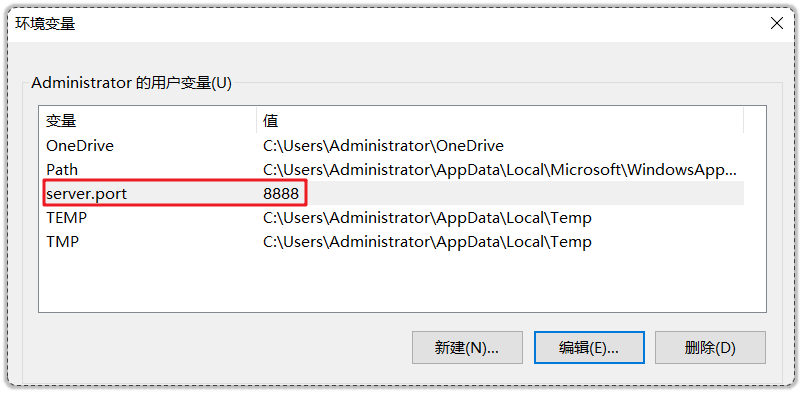
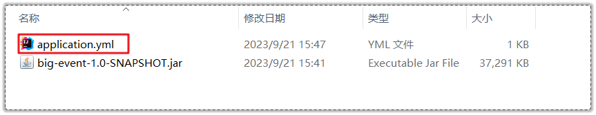
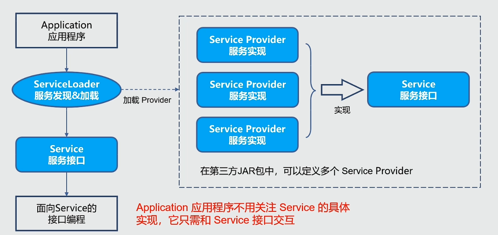

---


# 概念 | SpringBoot基本

## 必问基础

==【八股】SpringBoot和Spring的区别？==

总体来说：SpringBoot是Spring框架的一个扩展和简化版本。

扩展：

- 自动配置：SpringBoot能根据项目的依赖和配置，自动装配需要的Bean，减少手动配置的工作量；
- 内嵌服务器：SpringBoot内置了Tomcat等服务器，允许直接运行应用而不需要外部服务器；
- 独立运行：SpringBoot可以打包为独立的jar包，单独运行，适合微服务架构。

简化：

- 简化配置方式：SpringBoot遵循“约定大于配置”的原则和自动配置，简化繁琐的配置过程；
- 简化依赖导入：SpringBoot通过starter起步依赖，可以一键导入某功能相关的所有jar包，并且统一维护版本信息，避免手动配置；
- 简化项目结构：SpringBoot提供基于约定的目录结构，简化了项目的组织。

---

==【八股】SpringBoot的优点？==

- 内置servlet容器，不需要在服务器部署Tomcat容器
- 提供starter，将常用的库聚合在一起，简化配置
- 可以快速创建运行spring项目，并集成主流框架

---

==【八股】SpringBoot有哪几种运行方式？==

- 方式1：打包命令行运行，`java -jar xxx.jar`
- 方式2：main方法运行
- 方式3：用Maven插件运行，`mvn spring-boot:run`

---

==【八股】SpringBoot构建项目和普通构建项目有什么区别？==

普通构建项目：

- 依赖导入：需要逐个导入依赖
- Bean配置：手动配置；
- 项目运行：需要打包为jar包后放到tomcat容器中运行

SpringBoot构建项目：

- 依赖导入：通过起步依赖的方式，整合功能所需的所有依赖，可以一键导入；
- Bean配置：自动配置，相关的Bean在项目启动后自动装配到IOC容器中；
- 项目运行：内嵌Tomcat服务器，项目打包为jar包后可直接运行。

## 配置文件相关概念

==【八股】SpringBoot除了通过配置文件配置属性外，还有哪些配置方式？优先级如何？==

按照优先级从高到低排列：

- 命令行参数配置属性（优先级最高）：

```cmd
java -jar 包的位置+名字 --server.port=9999
```

- 在环境变量中配置属性（配置完成后，需要重新打开cmd命令行才能生效）：



- 项目外部配置文件配置（在jar包同目录下的配置文件中配置属性）：



- 项目中配置文件配置（优先级最低）

---

==【八股】SpringBoot中配置文件的常用参数？==

- `server.port`
- `spring.datasource.username/password/url/driver-class-name`
- `spring.profiles.active`
- `mybatis.mapper-locations`等

---

==【八股】SpringBoot加载配置文件（application.yml）的原理？==

参考文章：[文章1](https://blog.csdn.net/Mr_Liu946/article/details/118898901)、[文章2](https://blog.csdn.net/weixin_43732955/article/details/106600869)

**大致分为如下几个步骤**：

- 查找配置文件：扫描classpath下的默认位置和额外指定的位置，来查找配置文件
- 创建PropertySource对象并添加到Environment中：根据配置文件的配型创建对应的PropertySource对象并添加到Environment中
- 应用程序通过Environment或@Value注解来获取配置属性

**一些相关问题**：

1. springboot何时加载配置文件：容器启动时，会最终调用 `ConfigFileApplicationListener`对应的方法，从而加载配置文件
2. 不同配置文件指定了相同属性的不同值：
   - 无active，根据配置文件加载的优先级，优先级高的配置文件中的值生效
   - 有active，指定的配置文件生效
3. 不同配置文件指定了不同属性的值：互补生效

# 概念 | SpringBoot进阶

## 重要 | SPI机制

> 参考视频：[链接](https://www.bilibili.com/video/BV1RY4y1v7mN?spm_id_from=333.788.videopod.sections&vd_source=75f2cdd698206302b100ea9951611214)
>
> 参考代码：Java/Java_Learn_Enhance/SpringBoot-Enhance/Learn-SPI-Demo

==【八股】什么是SPI？由哪些部分组成？==

全称是“Service Provider Interface”，是一种基于Class Loader来发现并加载服务的机制。

SPI提供了一种**组件发现和注册的方式**，可以用于实现各种插件，或者可以灵活替换框架中使用的组件。

- 优点：面向接口编程，模块之间是解耦的；
- 设计思想：面向接口+配置文件+反射技术；
- 应用场景：JDBC、SLF4J、Servlet容器初始化等；

---

一个标准的SPI，由3个组件构成，分别是：

- Service：一个公开的接口或抽象类，定义了一个抽象的功能模块；
- Service Provider：Service接口的一个实现类，可以有多个实现；
- Service Loader：是SPI机制中的核心组件，负责在**运行时**发现并加载Service Provider。

---

SPI机制的运行流程：



==【八股】Service Loader如何查找并发现类？==

执行类加载命令：`ServiceLoader.load(XXX.class)`

1、获取对应的ClassLoader；

2、遍历所有Jar包，查找 `META-INF/services/`目录，获取对应的文件（文件名是接口的全限定名，文件内容是所有实现该接口的实现类的全限定名）；

3、使用ClassLoader加载类；

---

==【八股】Java SPI的3大规范要素有哪些？==

规范的配置文件（以Service接口为例）

- 文件路径：必须在 `META-INF/services`目录下；
- 文件名称：必须是Service接口的全限定名；
- 文件内容：是Service接口的实现类的全限定名，如果有多个实现类，每一个实现类在文件中单独占一行；

Service实现类必须要有无参构造方法：

- Java SPI机制下，通过反射创建类的时候，默认调用的是无参构造方法；

确保能加载到配置文件和Service实现类；

- 通过Maven导入Jar包；

## 重要 | Web项目启动流程

==【八股】SpringBoot的启动流程主要有哪些？==

> 参考视频：[链接](https://www.bilibili.com/video/BV1e14y1A7pT/?spm_id_from=333.788.videopod.sections&vd_source=75f2cdd698206302b100ea9951611214)

SpringBoot的启动流程大致有如下几个步骤，本质是 `SpringApplication.run()`方法触发的一系列自动化流程。

（1）首先是服务构建

`New`创建一个强大的Spring服务对象 `SpringApplication`，有一系列的组装过程：

- 把资源加载器和主方法类记录在内存中；

  - 资源加载器：用于查找和加载外部资源，比如YAML等文件、静态文件；
  - 主方法类：也称为源配置类，是SpringBoot应用的入口，通常包括main()方法，并标注@SpringBootApplication注解；
- 确定Web服务类型：默认是基于Servlet的Web服务，例如Tomcat；还有响应式非阻塞服务Reactive，例如spring-webflux；还有什么都不使用的None。
- 加载初始化类：读取所有 `META-INF/spring.factories`文件中注册初始化（默认有0个）、上下文初始化（默认有7个）、监听器（默认有8个）这三类配置。

（2）环境准备

调用 `SpringApplication`的 `run()`方法，进入环境准备阶段，为后续 `容器创建`阶段做准备。

- 参数设置：确保项目在缺少显示器、键盘等输入设备时，程序也可以启动；
- 监听器相关：启动 `运行监听器`，并发布启动事件，会引入上述的8个监听器，这样就可以在启动流程中加入自定义的逻辑；
- 组装启动参数：包括系统环境、JVM系统属性、命令行启动项目时的传参等；
- 打印Banner图；

（3）容器创建

将环境准备阶段做的工作进行组合，来创建容器。

- 创建ApplicationContext，实例化内容包含：
  - 定义BeanFactory；
  - 定义处理Bean注解（@Autowired、@Component等）的配置类后处理器（PostProcessor）；

（4）容器填充

生产自身提供以及用户自定义的所有Bean对象，这一步骤也称为“SpringBoot的自动装配”；

- 自动装配；
- 发布启动完成事件的同时，回调用户自定义的Runner接口，用于定制化一些启动后的操作；

## 重要 | 自动配置原理

==【八股】SpringBoot的自动配置原理是什么？==

> 参考视频，可反复观看：[链接](https://www.bilibili.com/video/BV1NY411P7VX/?spm_id_from=333.337.search-card.all.click&vd_source=75f2cdd698206302b100ea9951611214)
>
> 参考文章，自己整理的：[SpringBoot-自动配置原理](/ToBeABD/Java/s72bj2im/)

SpringBoot的自动配置能将项目需要的配置类自动注入到IOC容器中，用户仅需要启动项目即可。主要包含两方面的配置类：

- 项目本身定义的配置类：通过@ComponentScan注解实现，在Web项目启动类上定义有该注解，会扫描并创建对应包下所有的配置类；
- 第三方Jar包中的配置类：本质通过@Import注解来实现，在Web项目中仅引入第三方jar包，就能在启动后，将对应的配置类注入到IOC容器中（自动配置的重点所在）；

（1）注解分析：

- 启动类上有 `@SpringBootApplication`注解，包含3个重要部分：

  - `@SpringBootConfiguration`：表明当前的启动类是一个配置类，需要注入到Spring容器中，即原配置类；
  - `@ComponentScan`：默认将启动类所在包及其子包下带有特定注解的类，将其作为组件，注入到Spring容器中；
  - `@EnableAutoConfiguration`：代表开启自动配置，是实现SpringBoot自动配置的关键；
- 分析 `@EnableAutoConfiguration`注解：

  - `@Import({AutoConfigurationImportSelector.class})`：该注解通过导入一个ImportSelector来导入第三方jar包中的配置类；

（2）具体过程

- `AutoConfigurationImportSelector`类是 `org.springframework.boot.autoconfigure`包下的一个类；
- 这个类实现了 `ImportSelector`导入器接口，其中有一个 `selectImports`方法，该方法返回结果即需要导入的配置类；
- `selectImports`方法会从项目的 `classpath: META-INF/spring/`路径下寻找 `.imports`结尾的文件（SpringBoot3.0以下版本是从 `classpath: META-INF/spring.factories`文件中查找），查找键名为 `xxx.EnableAutoConfiguration`的内容，该键的值就是所有需要导入的配置类；

（3）迭代处理

- 如果在处理 `@Import`注解的过程中，发现有新的 `@Import`注解，就会重复处理步骤（2），直到导入所有的配置类；

（4）配置类过滤

- Spring容器不会立刻加载所有的配置类，而是根据类上的条件注解，选择性的加载需要的配置类到Spring容器中；

## 重要 | 自定义starter

==【八股】SpringBoot中的starter是什么？==

是一组预定义的依赖项集合，旨在简化依赖管理，一个starter包含实现特定功能需要的库、组件及相应的配置文件。

- 库：一个starter包含该功能需要的所有jar包，并且提供统一的版本信息，无需人工维护，可直接使用

**SpringBoot常见的starter有什么？**

- `spring-boot-starter-web`：提供SpringMVC+内置Tomcat
- `spring-boot-starter-Redis`：提供Redis依赖
- `mybatis-spring-boot-starter`：提供Mybatis依赖

==【八股】自定义starter，实现自动配置==

> 代码参考：[链接](https://gitee.com/cnmemset/spring-boot-starter-example)、Java/Java_Learn_Enhance/SpringBoot-Enhance
>
> 视频链接：[链接](https://www.bilibili.com/video/BV1Zu4116714?spm_id_from=333.788.videopod.sections&vd_source=75f2cdd698206302b100ea9951611214)

主要步骤：

- 定义自动配置类：通过 `@Configuration`和 `@Bean`注解完成Bean的配置
- 创建配置属性类：如果需要用户自定义属性，就用 `@ConfigurationProperties`注解绑定这些属性
- 编写xxxAutoConfiguration自动配置类，并在META-INF/spring目录下的xx.imports文件中指定类的全限定名


# 应用 | SpringBoot使用

## 使用 | SpringBoot常用注解

参考文章，JavaGuide的，很全：[https://javaguide.cn/system-design/framework/spring/spring-common-annotations.html](https://javaguide.cn/system-design/framework/spring/spring-common-annotations.html)

---

核心注解：

- SpringBoot启动类相关注解：`@SpringBootApplication`、`@ComponentScan`

Bean管理相关注解：

- Bean注入：`@Autowired`、`@Component`、`@Repository`、`@Service`、`@Controller（@RestController）`、`@Configuration`、`@Bean`
- Bean作用域指定：`@Scope`
- Bean属性注入（配置文件相关）：`@Value`、`@ConfigurationProperties`、`@PropertySource`

Web开发相关：

- 请求处理：`@GetMapping`、`@PostMapping`、`@PutMapping`、`@DeleteMapping`
- 前后端数据交互（后端接收前端参数，后端返回结果给前端）：`@PathVariable`、`@RequestParam`、`@RequestBody`
- 前端参数验证：`@Valid`、`@Null`、`@NotNull`
- 异常处理：`@RestControllerAdvice` + `@ExceptionHandler`
- 数据库相关：

  - JPA：`@Entity`、`@Table`、`@Id`
- Entity实体类相关注解：`@JsonIgnoreProperties`、`@JsonIgnore`、`@JsonFormat`

代码测试：

- `@SpringBootTest`
