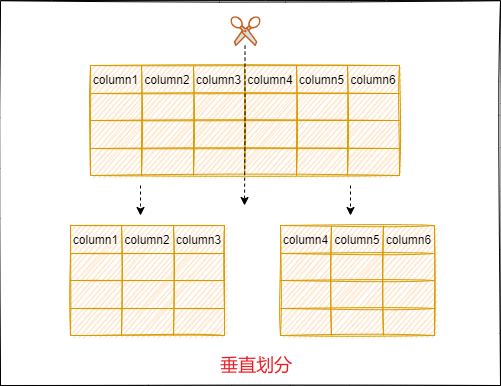
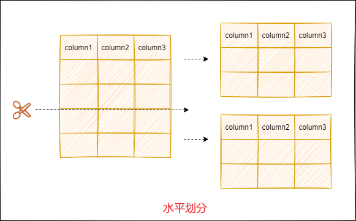
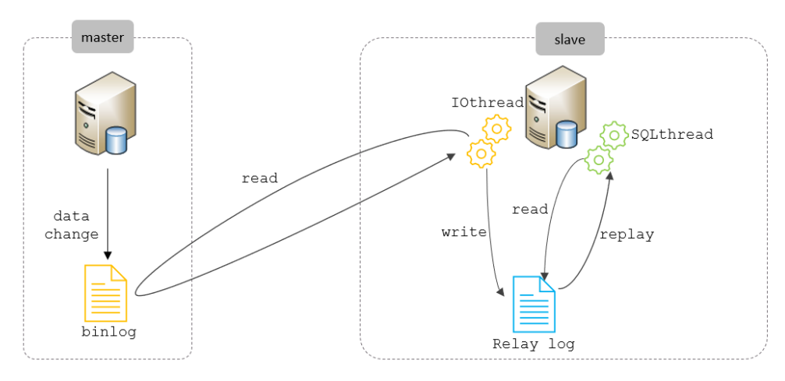
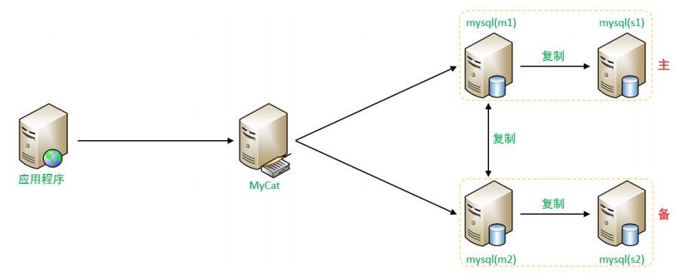

---

# 分库分表

==【八股】为什么要进行分库分表？==

随着互联网及移动互联网的发展，应用系统的数据量也是成指数式增长，若采用单数据库进行数据存储，存在以下性能瓶颈：

- IO瓶颈：热点数据太多，数据库缓存不足，产生大量磁盘IO，效率较低。 请求数据太多，带宽不够，网络IO瓶颈。
- CPU瓶颈：排序、分组、连接查询、聚合统计等SQL会耗费大量的CPU资源，请求数太多，CPU出现瓶颈。

为了解决上述问题，需要对数据库进行分库分表处理。

---

- 当单表的数据量达到1000W或100G以后，优化索引、添加从库等手段对数据库性能的提升作用不大，就可以采用分库分表。
- 分库分表可以减少数据库的负担，缩短查询时间。
- 分库分表的中心思想都是将数据分散存储，使得单一数据库/表的数据量变小来缓解单一数据库的性能问题，从而达到提升数据库性能的目的。

---

==【八股】有哪些分库分表策略？==

垂直划分：

- 方案：垂直分库、垂直分表
- 特点：通过减少单表的体积，来存储更多的数据，从而缓解数据库的性能问题
- 优点：行记录变小，数据页可以放更多记录，查询时IO次数减少
- 缺点：

  - 主键存在冗余
  - 单表数据量依旧没有减少，只是体积减少了

---

**水平划分**

- 方案：水平分库、水平分表
- 特点：通过减少单表的数据量，来环节数据库性能问题
- 优点：单表数据减少，提高性能；切分出的表结构相同，代码改动少
- 不足：

  - 分片事务一致性难以保证
  - 跨界点join()性能差，逻辑复杂

## 技术实现

主要有两种技术实现：

- `shardingJDBC`：基于AOP原理，在应用程序中对本地执行的SQL进行拦截，解析、改写、路由处理。需要自行编码配置实现，只支持java语言，性能较高。已改名为 `sharding-sphere`
- `MyCat`：数据库分库分表中间件，不用调整代码即可实现分库分表，支持多种语言，性能不及前者。

### Sharding-Sphere

==【八股】Sharding-Sphere的使用步骤？==

### MyCat

==【八股】MyCat的使用步骤？==

---

==【八股】MyCat有哪些分片规则？==

范围分片

- 特点：根据某一字段（id）的取值范围，将数据划分到不同的结点中
- 优点：后续新增节点实例，无需对数据进行迁移扩容
- 缺点：数据倾斜严重，数据分布不平衡，若id顺序增长，一个节点实例的数据满了，才会存储到另一个节点实例中

取模分片：

- 特点：根据某一字段（id）与节点数量的取模结果，将数据划分到不同的结点中
- 优点：数据分布均匀
- 缺点：扩容困难；扩容后数据迁移量大；数据范围查询难度大

一致性hash分片：

- 特点：通过一致性hash算法，将数据分配到不同的节点上（参考文章：[知乎](https://zhuanlan.zhihu.com/p/129049724)）
- 优点：数据分布均匀；新增、删除节点会，所影响的数据量很少，不会进行全局的数据迁移
- 缺点：节点数量少的时候，可能会造成大量数据迁移，可通过设置虚拟节点来实现

## 分库分表的扩容问题

==【八股】如果分库分表之后，发现表不够用了，然后需要扩容表，这个时候会发生什么？如何解决？==

可能有如下几个问题需要考虑：

- 调整路由规则
- 进行数据迁移

调整路由规则：

- 假定原先的路由规则是范围分片，那么进行扩容后无需对原有数据进行迁移；
- 假定原先的路由规则是取模分片或一致性Hash分片，那么扩容后会有数据需要进行迁移；

进行数据迁移（以取模分片为例）：

- 可以采用停机数据迁移：数据迁移的过程比较简单，但是业务会暂停
- 可以采用不停机数据迁移：数据迁移的过程会难一点，会有新的数据写入，但是业务能够继续运行

## 分区表【补充】

==【八股】什么是分区表？有什么类型？存在哪些问题？==

概念：把一张表的数据分成N个区块。分区表是一个独立的逻辑表，但是底层由多个子表组成。

特点：

- 当查询条件的数据分布在某一个分区的时候，查询引擎只会去某一个分区查询，而不是遍历整个表。
- 在管理层面，如果需要删除某一个分区的数据，只需要删除对应的分区即可。

使用场景：

- 分区一般都是放在单机里的，用的比较多的是时间范围分区，方便归档

---

分区表的类型：

- range分区：按照范围划分数据【常用】
- list分区：按照既定的枚举值划分数据（数据不在枚举值内，无法插入数据）
- hash分区

---

分区表的问题：

- 打开和锁住所有底层表的成本较高
- 维护分区的成本上升
- 所有分区的存储引擎必须一致

---

==【八股】分库分表和分区表有什么区别？==

从目的上来说：

- 分区表：将大的物理表分为若干小的物理表，仍在一个数据库中。目的在于提高查询性能、均衡IO负载
- 分库分表：将数据和表分散到多个数据库和表中的策略。目的在于减少单一数据库中数据存储的数量、提高查询性能、提高并发能力

从逻辑上看：

- 分区表：逻辑上，任然是一张表；物理上，数据分散到不同的小表
- 分库分表：逻辑上，就是多张表；物理上，数据也确实在不同的表中，甚至在不同的数据库中

分库分表和分区表不冲突，可以都使用

# 主从复制

==【八股】介绍一下MySQL的主从复制？==

单一MySQL服务器故障后，整个数据库都不可用，存在严重的单点故障问题；

采用【一主多从】的架构，主数据库提供读写操作，对于每条修改的数据都同步给从数据库进行备份；当主数据库不可用的时候，可以切换到从数据库提供服务；

并且如果需要数据备份操作，可以在从数据库中进行，不会影响主数据库提供服务。

---

==【八股】主从复制的原理==

大致有如下三个阶段：

（1）主数据库的Binlog日志

- 主数据库会把所有的DDL和DML操作都记录到Binlog日志中，不记录DQL操作；
- 主从复制需要主数据库开启Binlog日志；

（2）从数据库的RelayLog日志（中继日志） - 写

- 从数据库开启一个IO线程从主数据库读取Binlog日志，并写入到自己的Relaylog日志中；
- Relaylog日志相当于从数据库本地的Binlog日志副本，可以在从数据库上重放主数据库的操作；

（3）从数据库的RelayLog日志（中继日志） - 用

- 从数据库开启一个SQL线程，从Relaylog中读取内容，并按照记录的结果，在从库上重现SQL操作，来同步主库中的数据；

---

实现步骤：可通过自身配置文件完成

- 准备两台服务器
- 配置主服务器
  - `.cnf`配置服务ID，启用binlog日志，并记录日志文件的名字和位置，重启MySQL
  - 登录主服务器，创建远程连接账号，赋予主从复制权限
- 配置从服务器
  - `.cnf`配置服务ID，重启MySQl
  - 配置从机信息：主服务器IP、端口；具备复制权限的远程连接账号的账户、密码；主服务器上二进制日志的文件名、位置

---

==【八股】MySQL中主从复制的同步模式有哪些？==

**异步复制**

- 默认的复制模式，主库在写完Binlog后不等待从库确认即可继续处理其他请求；
- 主库和从库没有严格的同步保证，可能导致从库数据滞后；但性能最好

**半同步复制**

- 主库写完Binlog后，会等待至少一个从库确认收到了日志才会进行后续操作；
- 可以减少数据丢失的可能性，但会损失一部分性能；

**全同步复制**

- 主库写完Binlog后，需要等到所有的从库确认收到日志后，才会继续提交事务；
- 保证了主库和所有从库的完全一致，但性能开销最大；

# 读写分离

==【八股】介绍一些读写分离？==

概念：

- 简单地说是把对数据库的读和写操作分开，以对应不同的数据库服务器；
- 主数据库提供写操作，从数据库提供读操作，这样能有效地减轻单台数据库的压力。

实现手段：MyCat

---

==【八股】有什么实现模式？==

- 一主一从模式

  - 按照主从复制方案配置
  - 主机提供写操作
  - 从机提供读操作
- 双主双从模式

  - 常规情况下：M1负责写请求，S1、M2、S2负责读请求
  - 特殊情况下：M1挂掉，M2负责写请求，S2负责读请求

