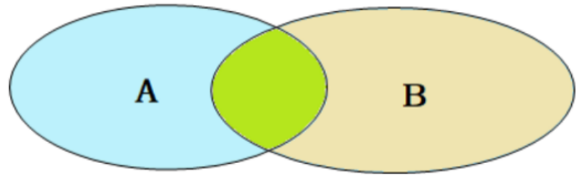

---


# 前言

多表查询是在Web开发时候比较常用的操作。一般复杂一点的项目，都需要进行多表查询。本文以自建数据表，完成多表查询的讲解学习。

# 关系型数据库中数据表之间的关系

**一对多关系**

- 案例：部门和员工之间
- 关系：一个部门对应多个员工，一个员工对应一个部门
- 实现：在多的一方建立外键，指向一的一方的主键

**多对多关系**

- 案例：学生和课程的关系
- 关系：一个学生可以选择多个课程，一个课程可以有多个学生
- 实现：建立第三张中间表，表中至少有两个外键：一个关联学生表的主键；一个关联课程表的主键

**一对一关系**

- 案例：用户和用户详细信息的关系
- 关系：一对一关系，多用于单表拆分，将一张表的基础字段放在一张表中，其他详情字段放在另一张表中，以提升操作效率
- 实现：在任意一方加入外键，关联另外一方的主键，并且设置外键为唯一的(UNIQUE)

# 数据准备

## 数据内容

**根据给出的SQL文件，将数据导入MySQL**

- 数据导入操作参照该文章：[MySQL导出所有数据到sql文件](/ToBeABD/Database/MySQL/oc9q62j1/)
- 看最后一章即可：【补充】通过命令行，执行sql文件，将数据导入到数据库

**SQL文件内容**

自己新建一个.sql文件，将如下内容复制到文件中。该段sql最终将数据存入一个名字叫 `learn_mysql`的数据库

```sql
-- MySQL dump 10.13  Distrib 5.7.31, for Win64 (x86_64)
--
-- Host: 127.0.0.1    Database: learn_mysql
-- ------------------------------------------------------
-- Server version	5.7.31

/*!40101 SET @OLD_CHARACTER_SET_CLIENT=@@CHARACTER_SET_CLIENT */;
/*!40101 SET @OLD_CHARACTER_SET_RESULTS=@@CHARACTER_SET_RESULTS */;
/*!40101 SET @OLD_COLLATION_CONNECTION=@@COLLATION_CONNECTION */;
/*!40101 SET NAMES utf8 */;
/*!40103 SET @OLD_TIME_ZONE=@@TIME_ZONE */;
/*!40103 SET TIME_ZONE='+00:00' */;
/*!40014 SET @OLD_UNIQUE_CHECKS=@@UNIQUE_CHECKS, UNIQUE_CHECKS=0 */;
/*!40014 SET @OLD_FOREIGN_KEY_CHECKS=@@FOREIGN_KEY_CHECKS, FOREIGN_KEY_CHECKS=0 */;
/*!40101 SET @OLD_SQL_MODE=@@SQL_MODE, SQL_MODE='NO_AUTO_VALUE_ON_ZERO' */;
/*!40111 SET @OLD_SQL_NOTES=@@SQL_NOTES, SQL_NOTES=0 */;

--
-- Current Database: `learn_mysql`
--

CREATE DATABASE /*!32312 IF NOT EXISTS*/ `learn_mysql` /*!40100 DEFAULT CHARACTER SET utf8 */;

USE `learn_mysql`;

--
-- Table structure for table `course`
--

DROP TABLE IF EXISTS `course`;
/*!40101 SET @saved_cs_client     = @@character_set_client */;
/*!40101 SET character_set_client = utf8 */;
CREATE TABLE `course` (
  `id` int(11) NOT NULL AUTO_INCREMENT COMMENT '主键ID',
  `name` varchar(10) DEFAULT NULL COMMENT '课程名称',
  PRIMARY KEY (`id`)
) ENGINE=InnoDB AUTO_INCREMENT=5 DEFAULT CHARSET=utf8 COMMENT='课程表';
/*!40101 SET character_set_client = @saved_cs_client */;

--
-- Dumping data for table `course`
--

LOCK TABLES `course` WRITE;
/*!40000 ALTER TABLE `course` DISABLE KEYS */;
INSERT INTO `course` VALUES (1,'Java'),(2,'PHP'),(3,'MySQL'),(4,'Hadoop');
/*!40000 ALTER TABLE `course` ENABLE KEYS */;
UNLOCK TABLES;

--
-- Table structure for table `dept`
--

DROP TABLE IF EXISTS `dept`;
/*!40101 SET @saved_cs_client     = @@character_set_client */;
/*!40101 SET character_set_client = utf8 */;
CREATE TABLE `dept` (
  `id` int(11) NOT NULL AUTO_INCREMENT COMMENT 'ID',
  `name` varchar(50) NOT NULL COMMENT '部门名称',
  PRIMARY KEY (`id`)
) ENGINE=InnoDB AUTO_INCREMENT=7 DEFAULT CHARSET=utf8 COMMENT='部门表';
/*!40101 SET character_set_client = @saved_cs_client */;

--
-- Dumping data for table `dept`
--

LOCK TABLES `dept` WRITE;
/*!40000 ALTER TABLE `dept` DISABLE KEYS */;
INSERT INTO `dept` VALUES (1,'研发部'),(2,'市场部'),(3,'财务部'),(4,'销售部'),(5,'总经办'),(6,'人事部');
/*!40000 ALTER TABLE `dept` ENABLE KEYS */;
UNLOCK TABLES;

--
-- Table structure for table `emp`
--

DROP TABLE IF EXISTS `emp`;
/*!40101 SET @saved_cs_client     = @@character_set_client */;
/*!40101 SET character_set_client = utf8 */;
CREATE TABLE `emp` (
  `id` int(11) NOT NULL AUTO_INCREMENT COMMENT 'ID',
  `name` varchar(50) NOT NULL COMMENT '姓名',
  `age` int(11) DEFAULT NULL COMMENT '年龄',
  `job` varchar(20) DEFAULT NULL COMMENT '职位',
  `salary` int(11) DEFAULT NULL COMMENT '薪资',
  `entrydate` date DEFAULT NULL COMMENT '入职时间',
  `managerid` int(11) DEFAULT NULL COMMENT '直属领导ID',
  `dept_id` int(11) DEFAULT NULL COMMENT '部门ID',
  PRIMARY KEY (`id`),
  KEY `fk_emp_dept_id` (`dept_id`),
  CONSTRAINT `fk_emp_dept_id` FOREIGN KEY (`dept_id`) REFERENCES `dept` (`id`)
) ENGINE=InnoDB AUTO_INCREMENT=18 DEFAULT CHARSET=utf8 COMMENT='员工表';
/*!40101 SET character_set_client = @saved_cs_client */;

--
-- Dumping data for table `emp`
--

LOCK TABLES `emp` WRITE;
/*!40000 ALTER TABLE `emp` DISABLE KEYS */;
INSERT INTO `emp` VALUES (1,'金庸',66,'总裁',20000,'2000-01-01',NULL,5),(2,'张无忌',20,'项目经理',12500,'2005-12-05',1,1),(3,'杨逍',33,'开发',8400,'2000-11-03',2,1),(4,'韦一笑',48,'开发',11000,'2002-02-05',2,1),(5,'常遇春',43,'开发',10500,'2004-09-07',3,1),(6,'小昭',19,'程序员鼓励师',6600,'2004-10-12',2,1),(7,'灭绝',60,'财务总监',8500,'2002-09-12',1,3),(8,'周芷若',19,'会计',48000,'2006-06-02',7,3),(9,'丁敏君',23,'出纳',5250,'2009-05-13',7,3),(10,'赵敏',20,'市场部总监',12500,'2004-10-12',1,2),(11,'鹿杖客',56,'职员',3750,'2006-10-03',10,2),(12,'鹤笔翁',19,'职员',3750,'2007-05-09',10,2),(13,'方东白',19,'职员',5500,'2009-02-12',10,2),(14,'张三丰',88,'销售总监',14000,'2004-10-12',1,4),(15,'俞莲舟',38,'销售',4600,'2004-10-12',14,4),(16,'宋远桥',40,'销售',4600,'2004-10-12',14,4),(17,'陈友谅',42,NULL,2000,'2011-10-12',1,NULL);
/*!40000 ALTER TABLE `emp` ENABLE KEYS */;
UNLOCK TABLES;

--
-- Table structure for table `student`
--

DROP TABLE IF EXISTS `student`;
/*!40101 SET @saved_cs_client     = @@character_set_client */;
/*!40101 SET character_set_client = utf8 */;
CREATE TABLE `student` (
  `id` int(11) NOT NULL AUTO_INCREMENT COMMENT '主键ID',
  `name` varchar(10) DEFAULT NULL COMMENT '姓名',
  `Num` varchar(10) DEFAULT NULL COMMENT '学号',
  PRIMARY KEY (`id`)
) ENGINE=InnoDB AUTO_INCREMENT=5 DEFAULT CHARSET=utf8 COMMENT='学生表';
/*!40101 SET character_set_client = @saved_cs_client */;

--
-- Dumping data for table `student`
--

LOCK TABLES `student` WRITE;
/*!40000 ALTER TABLE `student` DISABLE KEYS */;
INSERT INTO `student` VALUES (1,'黛绮丝','2000100101'),(2,'谢逊','2000100102'),(3,'殷天正','2000100103'),(4,'韦一笑','2000100104');
/*!40000 ALTER TABLE `student` ENABLE KEYS */;
UNLOCK TABLES;

--
-- Table structure for table `student_course`
--

DROP TABLE IF EXISTS `student_course`;
/*!40101 SET @saved_cs_client     = @@character_set_client */;
/*!40101 SET character_set_client = utf8 */;
CREATE TABLE `student_course` (
  `id` int(11) NOT NULL AUTO_INCREMENT COMMENT '主键',
  `studentid` int(11) NOT NULL COMMENT '学生ID',
  `courseid` int(11) NOT NULL COMMENT '课程ID',
  PRIMARY KEY (`id`),
  KEY `fk_courseid` (`courseid`),
  KEY `fk_studentid` (`studentid`),
  CONSTRAINT `fk_courseid` FOREIGN KEY (`courseid`) REFERENCES `course` (`id`),
  CONSTRAINT `fk_studentid` FOREIGN KEY (`studentid`) REFERENCES `student` (`id`)
) ENGINE=InnoDB AUTO_INCREMENT=7 DEFAULT CHARSET=utf8 COMMENT='学生课程中间表';
/*!40101 SET character_set_client = @saved_cs_client */;

--
-- Dumping data for table `student_course`
--

LOCK TABLES `student_course` WRITE;
/*!40000 ALTER TABLE `student_course` DISABLE KEYS */;
INSERT INTO `student_course` VALUES (1,1,1),(2,1,2),(3,1,3),(4,2,2),(5,2,3),(6,3,4);
/*!40000 ALTER TABLE `student_course` ENABLE KEYS */;
UNLOCK TABLES;

--
-- Table structure for table `tb_user`
--

DROP TABLE IF EXISTS `tb_user`;
/*!40101 SET @saved_cs_client     = @@character_set_client */;
/*!40101 SET character_set_client = utf8 */;
CREATE TABLE `tb_user` (
  `id` int(11) NOT NULL AUTO_INCREMENT COMMENT '主键ID',
  `name` varchar(10) DEFAULT NULL COMMENT '姓名',
  `age` int(11) DEFAULT NULL COMMENT '年龄',
  `gender` char(1) DEFAULT NULL COMMENT '1: 男 , 2: 女',
  `phone` char(11) DEFAULT NULL COMMENT '手机号',
  PRIMARY KEY (`id`)
) ENGINE=InnoDB AUTO_INCREMENT=5 DEFAULT CHARSET=utf8 COMMENT='用户基本信息表';
/*!40101 SET character_set_client = @saved_cs_client */;

--
-- Dumping data for table `tb_user`
--

LOCK TABLES `tb_user` WRITE;
/*!40000 ALTER TABLE `tb_user` DISABLE KEYS */;
INSERT INTO `tb_user` VALUES (1,'黄渤',45,'1','18800001111'),(2,'冰冰',35,'2','18800002222'),(3,'码云',55,'1','18800008888'),(4,'李彦宏',50,'1','18800009999');
/*!40000 ALTER TABLE `tb_user` ENABLE KEYS */;
UNLOCK TABLES;

--
-- Table structure for table `tb_user_edu`
--

DROP TABLE IF EXISTS `tb_user_edu`;
/*!40101 SET @saved_cs_client     = @@character_set_client */;
/*!40101 SET character_set_client = utf8 */;
CREATE TABLE `tb_user_edu` (
  `id` int(11) NOT NULL AUTO_INCREMENT COMMENT '主键ID',
  `degree` varchar(20) DEFAULT NULL COMMENT '学历',
  `major` varchar(50) DEFAULT NULL COMMENT '专业',
  `primaryschool` varchar(50) DEFAULT NULL COMMENT '小学',
  `middleschool` varchar(50) DEFAULT NULL COMMENT '中学',
  `university` varchar(50) DEFAULT NULL COMMENT '大学',
  `userid` int(11) DEFAULT NULL COMMENT '用户ID',
  PRIMARY KEY (`id`),
  UNIQUE KEY `userid` (`userid`),
  CONSTRAINT `fk_userid` FOREIGN KEY (`userid`) REFERENCES `tb_user` (`id`)
) ENGINE=InnoDB AUTO_INCREMENT=5 DEFAULT CHARSET=utf8 COMMENT='用户教育信息表';
/*!40101 SET character_set_client = @saved_cs_client */;

--
-- Dumping data for table `tb_user_edu`
--

LOCK TABLES `tb_user_edu` WRITE;
/*!40000 ALTER TABLE `tb_user_edu` DISABLE KEYS */;
INSERT INTO `tb_user_edu` VALUES (1,'本科','舞蹈','静安区第一小学','静安区第一中学','北京舞蹈学院',1),(2,'硕士','表演','朝阳区第一小学','朝阳区第一中学','北京电影学院',2),(3,'本科','英语','杭州市第一小学','杭州市第一中学','杭州师范大学',3),(4,'本科','应用数学','阳泉第一小学','阳泉区第一中学','清华大学',4);
/*!40000 ALTER TABLE `tb_user_edu` ENABLE KEYS */;
UNLOCK TABLES;
/*!40103 SET TIME_ZONE=@OLD_TIME_ZONE */;

/*!40101 SET SQL_MODE=@OLD_SQL_MODE */;
/*!40014 SET FOREIGN_KEY_CHECKS=@OLD_FOREIGN_KEY_CHECKS */;
/*!40014 SET UNIQUE_CHECKS=@OLD_UNIQUE_CHECKS */;
/*!40101 SET CHARACTER_SET_CLIENT=@OLD_CHARACTER_SET_CLIENT */;
/*!40101 SET CHARACTER_SET_RESULTS=@OLD_CHARACTER_SET_RESULTS */;
/*!40101 SET COLLATION_CONNECTION=@OLD_COLLATION_CONNECTION */;
/*!40111 SET SQL_NOTES=@OLD_SQL_NOTES */;

-- Dump completed on 2024-03-25 22:41:27
```

## 表间关系

| 数据表         | 字段                                                                                    |
| -------------- | --------------------------------------------------------------------------------------- |
| course         | id、name                                                                                |
| dept           | id、name                                                                                |
| emp            | id、name、age、job、salary、entrydate、managerid、**dept_id**（dept）             |
| student        | id、name、Num                                                                           |
| student_course | id、**studentid**（student）、**courseid**（course）                        |
| tb_user        | id、name、age、gender、phone                                                            |
| tb_user_edu    | id、degree、major、primaryschool、middleschool、university、**userid**（tb_user） |

- 加粗的表示外键

# 基础查询 | 全部查询

```sql
# 全部查询：笛卡尔积：列举所有组合情况，但有的是无效的
select * from emp, dept;  -- count=102

# 筛选出上述操作中有效的数据
select * from emp, dept where emp.dept_id = dept.id;
```

# 多表查询

假设如下两个数据表A、B，中间绿色部分表示两者的交集。



关于多表查询，可以分为如下两类：

|          |                                                                        |
| -------- | ---------------------------------------------------------------------- |
| 连接查询 | 通过连接运算符实现多个表的查询（两张表需要有联系，通过外键连接）       |
| 子查询   | 把一次查询的结果作为条件放到另一个查询中（两张表之间不需要有关联字段） |

一般来说：**连接查询的效率要高一点**，因为子查询走的是笛卡尔积，会将两个表中的数据都查询比较一遍

## 分类1 | 连接查询

### 内连接

内连接是查询两个表交集部分的数据（上图绿色部分），主要分为隐式内连接和显式内连接：

**隐式内连接**

```sql
SELECT 字段列表 FROM 表1 , 表2 WHERE 条件 ... ;
```

**显式内连接**

```sql
SELECT 字段列表 FROM 表1 [ INNER ] JOIN 表2 ON 连接条件 ... ;
```

**查询案例：根据员工表和部门表，查询所有员工姓名及对应部门**

```sql
# 隐式内连接
select emp.name , dept.name from emp , dept where emp.dept_id = dept.id;

select e.name,d.name from emp e , dept d where e.dept_id = d.id; -- 为每一张表起别名,简化SQL编写


# 显式内连接
select e.name, d.name from emp e inner join dept d on e.dept_id = d.id;

select e.name, d.name from emp e join dept d on e.dept_id = d.id; -- 为每一张表起别名,简化SQL编写
```

- 对表格起了别名之后，就只能用别名，不能用原有表名来获取表了

### 外连接 | 左外连接

左外连接是查询表A的所有数据（包含两者交集部分）

**基础语法**

```sql
SELECT 字段列表 FROM 表1 LEFT [ OUTER ] JOIN 表2 ON 条件 ... ;
```

**查询案例：查询emp表中的所有数据和对应的部门信息**

```sql
select e.*, d.name from emp e left outer join dept d on e.dept_id = d.id;

select e.*, d.name from emp e left join dept d on e.dept_id = d.id;
```

### 外连接 | 右外连接

右外连接是查询表B的所有数据（包含两者交集部分）

**基础语法**

```sql
SELECT 字段列表 FROM 表1 RIGHT [ OUTER ] JOIN 表2 ON 条件 ... ;
```

**查询案例：查询dept表的所有数据, 和对应的员工信息**

```sql
select d.*, e.* from emp e right outer join dept d on e.dept_id = d.id;

select d.*, e.* from dept d left outer join emp e on e.dept_id = d.id;
```

### 自连接 | 自连接

自己和自己做连接查询。**自连接查询必须有一个使用别名**，自连接可以是内连接，也可以是外连接

基础语法：同上述的内连接和外连接

---

查询案例1：查询员工及其所属领导（两个信息均在emp表中体现）

```sql
# 内连接解决：无所属领导的数据不会被查询（最高领导没有所属领导）
select a.name , b.name from emp a , emp b where a.managerid = b.id;
```

查询案例2：查询所有员工及其领导的名字  , 如果员工没有领导, 也需要查询出来

```sql
# 左外连接解决：任何员工都被查询，无所属领导的员工也被查询到
select a.name '员工', b.name '领导' from emp a left join emp b on a.managerid = b.id;
```

查询案例3：查询所有领导及其下属员工的名字

```sql
# 右外连接解决：该SQL会产生冗余数据，因为这个领导表本质是员工表，里面有的员工没有下属
# 若是员工表和领导表在两张表存储，右外连接就没问题，不会产生冗余信息，就像emp和dept
select a.name '员工', b.name '领导' from emp a right join emp b on a.managerid = b.id;
```

### 自连接 | 联合查询

联合查询就是多次查询的结果合并起来，形成一个新的查询结果集，每次查询的结果是独立的。

联合查询的要求：每次查询表要获取的列数一致，且类型要一致

**基础语法**

```sql
SELECT 字段列表 FROM 表A ...
UNION [ ALL ]
SELECT 字段列表 FROM 表B ....;
```

- union all 会将每次查询的结果直接合并在一起，不去重；union 会对合并之后的数据去重

**查询案例：将薪资低于 5000 的员工 或 年龄大于 50 岁的员工全部查询出来**

- 方案1：多条件查询，or连接即可（条件查询就是每行数据判断是否满足，不会产生重复）

```sql
select * from emp where salary < 5000 or age > 50;
```

- 方案2：联合查询（将多次查询的结果合并在一起，可能出现重复，需要去重）

```sql
select * from emp where salary < 5000
union
select * from emp where age > 50;
```

## 分类2 | 子查询

**基础语法**

```sql
SELECT * FROM t1 WHERE column1 = ( SELECT column1 FROM t2 );
```

- 子查询的外部语句可以是：INSERT、UPDATE、DELETE、SELECT中的任何一个

**子查询分类**

| 根据查询结果分类 | 根据子查询位置分类 | 解释                                       |
| ---------------- | ------------------ | ------------------------------------------ |
| 标量子查询       |                    | 返回结果是单个的值（数字、字符串、日期等） |
| 列子查询         |                    | 返回结果是一列数据（可以是多行）           |
| 行子查询         |                    | 返回结果是一行数据（可以是多列）           |
| 表子查询         |                    | 返回的结果是多行多列                       |
|                  | 在WHERE后面        |                                            |
|                  | 在FROM后面         |                                            |
|                  | 在SECELT后面       |                                            |

### 返回结果分类 | 标量子查询

**查询案例： 查询 "销售部" 的所有员工信息**

- 查询销售部id
- 查询员工部门id=销售部id的员工

```sql
select * from emp where dept_id = (select id from dept where name = '销售部');
```

### 返回结果分类 | 列子查询

**常用操作符**

| 操作符 | 描述                                   |
| ------ | -------------------------------------- |
| IN     | 在指定的集合范围之内，多选一           |
| NOT IN | 不在指定的集合范围之内                 |
| ANY    | 子查询返回列表中，有任意一个满足即可   |
| SOME   | 与ANY等同，使用SOME的地方都可以使用ANY |
| ALL    | 子查询返回列表的所有值都必须满足       |

**查询案例：  查询 "销售部" 和 "市场部" 的所有员工信息**

- 查询 "销售部" 和 "市场部" 的部门ID
- 根据部门ID, 查询员工信息

```sql
select * from emp where dept_id in (select id from dept where name = '销售部' or name = '市场部');
```

**查询案例：  查询比 财务部 所有人工资都高的员工信息**

- 查询所有 财务部 人员工资
- 比 财务部 所有人工资都高的员工信息

```sql
select * from emp where salary > all ( select salary from emp where dept_id = (select id from dept where name = '财务部') );
```

### 返回结果分类 | 行子查询

**查询案例： 查询与 "张无忌" 的薪资相同及直属领导也相同的员工信息 ;**

- 查询 "张无忌" 的薪资及直属领导
- 查询与 "张无忌" 的薪资及直属领导相同的员工信息

```sql
select * from emp where (salary,managerid) = (select salary, managerid from emp where name = '张无忌');
```

### 返回结果分类 | 表子查询

**查询案例：  查询与 "鹿杖客" 或 "宋远桥" 的职位和薪资都相同的员工信息**

- 查询 "鹿杖客" , "宋远桥" 的职位和薪资
- 查询与 "鹿杖客" , "宋远桥" 的职位和薪资相同的员工信息

```sql
select * from emp where (job,salary) in ( select job, salary from emp where name = '鹿杖客' or name = '宋远桥' );
```

### 查询位置分类 | WHERE

- 上述任一案例

### 查询位置分类 | FROM

> 子查询返回的结果是多行多列

**查询案例：  查询入职日期是 "2006-01-01" 之后的员工信息 , 及其部门信息**

- 入职日期是 "2006-01-01" 之后的员工信息
- 查询这部分员工, 对应的部门信息

```sql
select e.*, d.* from (select * from emp where entrydate > '2006-01-01') e left join dept d on e.dept_id = d.id ;
```

### 查询位置分类 | SELECT

> 子查询返回的结果是多行多列

**查询案例： 显示每个员工的姓名、年龄及其部门名称**

- 内连接实现：对于没有部门的员工，无法查询出来

```sql
select e.name, e.age, d.name from emp e join dept d on e.dept_id = d.id ;
```

- 子查询实现：可以查询所有员工，即使员工没有部门

```sql
select e.name, e.age, (select name from dept d where d.id = e.dept_id) as d_name from emp e;
```
