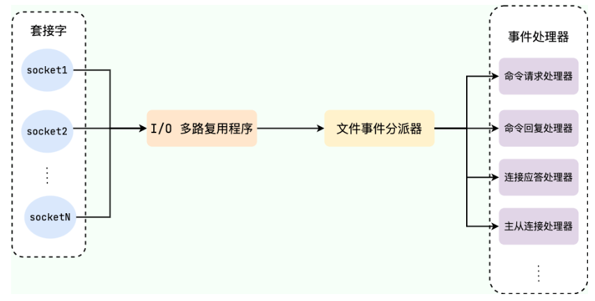

---

# Redis基础知识

## 认识NoSQL

==【八股】什么是NoSQL？==

NoSQL可以翻译为 `Not Only Sql`（不仅仅是SQL），或者是翻译成 `No Sql`（非Sql的）数据库

NoSQL是相对于传统关系型数据库而言有很大差异的一种特殊的数据库，因此也称之为**非关系型数据库**

---

==【八股】常见的NoSQL数据库有哪些？==

常见的非关系型数据库大概有四种：

- 键值型：Redis
- 列族型：HBase
- 文档型：MongoDB
- 图形型：Neo4j

---

键值型

- 相关产品：Redis、Memcached、Riak
- 应用场景：
  - 作为内容缓存：如会话、配置文件、参数等
  - 用在频繁读写、拥有简单数据模型的应用上
- 数据模型：`key, value` 键-值类型
- 优点：扩展性好，灵活性好，大量操作时性能高
- 缺点：数据无结构化，只能通过键来查询值。

列族型

- 相关产品：Bigtable、HBase、Cassandra
- 应用场景：分布式数据存储与管理
- 数据模型：将同一列数据存在一起
- 优点：可扩展性强，查找速度快，复杂性低
- 缺点：功能局限，不支持事务的强一致性

文档型

- 相关产品：MongoDB、ES、CouchDB
- 应用场景：Web 应用，存储面向文档或类似半结构化的数据
- 数据模型：`key, value`  value是JSON结构的文档
- 优点：数据结构灵活，可以根据 value 构建索引
- 缺点：缺乏统一查询语法

图形型

- 相关产品：Neo4j、InfoGrid
- 应用场景：社交网络、推荐系统，专注构建关系图谱
- 数据模型：图结构
- 优点：支持复杂的图形算法
- 缺点：复杂性高，只能支持一定的数据规模

---

**NoSQL VS SQL 整体总结**

关系型数据库和非关系型数据库可以从如下7个方面来区分特点：

|      对比维度      | SQL                                                | NoSQL                                                |
| :----------------: | :------------------------------------------------- | :--------------------------------------------------- |
| **数据结构** | 结构化存储（Structured）                           | 非结构化存储                                         |
| **数据关联** | 数据间有关联（Relational）                         | 数据间无关联                                         |
| **查询方式** | SQL查询，语法统一                                  | 非SQL查询，且语法不统一                              |
|      事务特性      | 支持事务，满足ACID                                 | 不满足ACID，只能保证基本的一致性                     |
|      存储方式      | 磁盘                                               | 内存                                                 |
|       扩展性       | 垂直扩展：通过加CPU、内存，提高效率                | 水平扩展：通过加机器数量，提高效率                   |
|      使用场景      | 数据结构固定<br />业务对数据安全性、一致性要求较高 | 数据结构不固定<br />业务对数据安全性、一致性要求不高 |

**对比 | 数据结构层面**

SQL型数据库：每张表都要严格的约束信息：字段名（id、name）、字段数据类型（int、char）、字段约束（外键）

NoSQL型数据库：没有严格的的约束，数据结构可以是：键值型、文档型、图型、列型

**对比 | 数据关联层面**

SQL型数据库：表与表之间，可以存在外键关联（物理外键）

NoSQL型数据库：不存在关联，若要实现关联，可以靠：代码的业务逻辑维护；数据之间的耦合

**对比 | 数据查询层面**

SQL型数据库：有统一标准

NoSQL型数据库：没有统一标准


## 初识Redis

==【八股】简单介绍一下Redis？==

**概念：**Redis诞生于2009年，名字全称是**Re**mote  **Di**ctionary **S**erver（远程词典服务器），是一个基于内存的键值型NoSQL数据库。

**特征：**

- 键值（key-value）型，value支持多种不同数据结构，功能丰富
- 单线程，每个命令具备原子性
- 低延迟，速度快（基于内存、IO多路复用、良好的编码）。
- 支持数据持久化
- 支持主从集群、分片集群
- 支持多语言客户端（java、C）

**应用场景：**

- Redis的特点使得Redis适合高并发场景
- Redis常用于：缓存、分布式Session、分布式锁、限流、好友关系、简易消息队列

# Redis概念 | 数据类型

==【八股】Redis的键、值都有哪些数据类型？==

针对Key来讲：Redis的Key只有String类型，而且使用的时候要避免重复性问题

针对Value来讲：有5中基本数据类型+3种特殊数据类型

---

==【八股】如何避免Redis键的重复？==

增加键的组成以提高键的复杂性，从而减少Redis键重复的概率。

- 常规情况下键的使用：

```
示例：
	id_100 : {id : 100}

一个MySQL数据库基本都是多张表，每个表都有自己的ID，很容易造成键重复
```

- 结合业务场景，增加Key的复杂度

```
示例：
	icwp:user:1 - '{"id":1, "name":"Jack", "age": 21}'
	icwp:product:1 - '{"id":1, "name":"小米11", "price": 4999}'

上述2条数据均存储id=1的结果数据，通过在键的组成上加入业务场景，避免键的重复
```

---

==【八股】8中数据类型简要介绍？==

基本数据类型：

|     数据类型     |            示例            | 应用场景                                                 |
| :---------------: | :-------------------------: | :------------------------------------------------------- |
|      String      |       `hello world`       | 用作计数器：文章阅读量、微博点赞数；用作全局ID；用作限流 |
|       Hash       | `{name: "Jack", age: 21}` | 用作购物车                                               |
|       List       | `[A -> B -> C -> D -> E]` | 用作队列、栈                                             |
|        Set        |        `{A, B, C}`        | 共同好友；抽奖系统                                       |
| SortedSet（zset） |   `{A: 1, B: 2, C: 3}`   | 用于排行榜                                               |

特殊数据类型：

|        数据类型        |          示例          | 应用场景                                                                 |
| :---------------------: | :---------------------: | :----------------------------------------------------------------------- |
| Geospatial（地理位置） | `{A: (120.3, 30.5)}` | 用于实现附近的人功能                                                     |
|     BitMap（位图）     | `0110110101110101011` | 用于实现二值统计的场景：用户签到、活跃用户统计、用户行为统计（是否点赞） |
| HyperLogLog（基数统计） | `0110110101110101011` | 用于网站UV统计：热门网站的每日访问ip                                     |

上述8中数据类型的具体应用场景见文章后边章节。

---

==【八股】Redis不同数据类型的底层实现及常用命令？==

JavaGuide参考文章：[基本数据类型](https://javaguide.cn/database/redis/redis-data-structures-01.html)、[特殊数据类型](https://javaguide.cn/database/redis/redis-data-structures-02.html#%E5%B8%B8%E7%94%A8%E5%91%BD%E4%BB%A4-2)

# Redis概念 | 线程模型

==【八股】介绍一下Redis的线程模型？==

Redis基于[Reactor模式](https://blog.csdn.net/ldw201510803006/article/details/124365838)开发了网络事件处理器，这个处理器被称为【文件事件处理器】；

文件事件处理器整体包含如下4个部分：

- 多个socket套接字；
- IO多路复用程序；
- **文件事件分派器；**
- 事件处理器（连接应答器、命令请求处理器、命令回复处理器）；




模型核心是【文件事件分配器】，是单线程操作的，所以说Redis是单线程模型。

---

==【八股】讲一讲Redis的线程模型变化？==

Redis在不同版本中采用的线程模型是不一样的：

- 在Redis4.0之前，采用的是单线程模型
- 在Redis4.0之后，引入了多线程模型
- 在Redis6.0之后，引入了多线程来处理网络IO请求，提高网络IO的读写性能

虽然4.0之前称为单线程模型，但主要是针对Set、Get操作来讲，Redis的持久化、集群同步等还是由其他线程完成；

在4.0版本之后，虽然引入了多线程模型，但主要针对的是大键值对的异步删除操作命令，比如：unlink key等；

关于Redis的写操作，一直来说，都是单线程，因此无需担心线程安全问题。

---

==【八股】为什么说Redis是单线程模型？==

Redis基于[Reactor模式](https://blog.csdn.net/ldw201510803006/article/details/124365838)开发了网络事件处理器，这个处理器被称为：文件事件处理器；

文件事件处理器包含4个组成部分：

- 多个套接字（客户端连接）
- IO多路复用程序（支持多个客户端连接的关键）
- 文件事件分派器（将 socket 关联到相应的事件处理器）
- 事件处理器（连接应答处理器、命令请求处理器、命令回复处理器）

由于【文件事件分派器】消费socket是单线程的，所以Redis称为是单线程模型。

---

==【八股】Redis为什么采用单线程模型？还这么快==

==【八股】Redis为什么采用Reactor单线程模型？==

性能瓶颈分析：

- Redis的大部分操作在内存中完成，效率很高，即Redis的性能瓶颈不在操作上，而是在IO上，所以在命令操作上没必要上多线程；
- 后续版本迭代引入的多线程模型，也是针对部分的大键值对删除操作以及网络IO请求，基本的命令处理还是单线程。

单线程的好处：

- 单线程不存在锁竞争，可以省去线程切换带来的开销，而且以单线程模型编写代码，模型更为简单，要考虑的事情更少

操作快的原因：（内存 + 高效的数据结构）

- Redis的数据模型采用高效的数据结构，比如哈希表和跳表
- Redis的操作主要在内存中完成

---

==【八股】Redis的后台线程有了解嘛？==

【关键字】：处理持久化过程产生的临时文件、强制处理未及时持久化到磁盘的数据、释放内存空间

Redis主要逻辑靠主线程（单线程）完成，还有一些后台线程应用：

- 通过 `bio_close_file`，释放持久化（ AOF / RDB）过程中产生的临时文件资源；
- 通过 `bio_aof_fsync`，调用 `fsync` 函数将系统内核缓冲区还未同步到到磁盘的数据强制刷到磁盘（ AOF 文件）；
- 通过 `bio_lazy_free`，释放大对象（已删除）占用的内存空间；

# Redis概念 | 持久化机制

==【八股】Redis持久化的方式有哪些？==

Redis有三种持久化的方式：

- 快照（RDB，snapshotting）
- 只追加文件（AOF，append-only-file）
- RDB 和 AOF的混合持久化

---

==【八股】什么是RDB持久化？==

**概念：**通过快照的方式记录某一时刻的数据副本，用于数据备份

**实现方式：**配置文件配置

```
save 900 1		# 900s之后，若有1个key发生变化，触发bgsave命令创建快照
```

- 问题：RDB持久化方式是否会阻塞主进程？
- 回答：

  - 若显式调用save命令进行持久化，会阻塞主进程；
  - 若显式调用bgsave命令，会通过fork一个子进程执行持久化操作，不会阻塞主进程；
  - 若配置了RDB持久化策略，持久化的时候默认调用bgsave命令。

---

==【八股】什么是AOF持久化？==

**概念：**默认没有开启AOF持久化。开启后，每执行一条Redis中的数据命令，就会将该命令写入AOF缓冲区，然后再写入AOF文件，最后根据持久化策略决定何时将数据同步到磁盘中。只有数据同步到磁盘中，才算完成持久化。

- 写入AOF缓冲区：server.aof_buf；
- 写入AOF文件：在系统内核缓冲区，还未同步到磁盘；
- 写入磁盘：才算完成持久化；

**工作流程：**


1. **命令追加（append）**：所有的写命令会追加到 AOF 缓冲区中。
2. **文件写入（write）**：将 AOF 缓冲区的数据写入到 AOF 文件中。这一步需要调用 `write`函数（系统调用），`write`将数据写入到了系统内核缓冲区之后直接返回了（延迟写）。
3. **文件同步（fsync）**：AOF 缓冲区根据对应的持久化方式（ `fsync` 策略）向硬盘做同步操作。这一步需要调用 `fsync` 函数（系统调用）， `fsync` 针对单个文件操作，对其进行强制硬盘同步，`fsync` 将阻塞直到写入磁盘完成后返回，保证了数据持久化。
4. **文件重写（rewrite）**：随着 AOF 文件越来越大，需要定期对 AOF 文件进行重写，达到压缩的目的。
5. **重启加载（load）**：当 Redis 重启时，可以加载 AOF 文件进行数据恢复。

**实现方式：**配置文件配置

```
# 配置文件名
appendfilename "appendonly.aof"

# 配置文件同步方式（以下三种方式任选1个）

appendfsync always		# 主线程调用write操作完成之后，立刻调用fsync“同步”刷盘
appendfsync everysec	# 主线程调用write操作完成之后，后台每秒调用fsync函数刷盘一次
appendfsync no			# 主线程调用write操作完成之后，让系统决定何时刷盘，通常为每30s一次
```

---

==【八股】Redis为什么先写命令，再写日志（文件）？==

原因：

- 避免额外的检查开销，不需要再检查Redis命令的正确与否
- 不会阻塞命令的执行
- 避免记录错误的命令

缺点：

- 会造成数据丢失
- 可能阻塞后续命令的执行

# Redis概念 | 内存管理

==【八股】redis可以做缓存，了解哪些过期策略？==

为了防止内存占满，需要对redis缓存的数据设置相关的过期策略：

- 概念点1：设置redis数据的过期时间；
- 概念点2：回答redis关于过期数据的淘汰策略；
- 概念点3：回答内存淘汰机制，解决redis过期数据无法及时清除的情况；

---

==【八股】Redis数据设置过期时间的意义？==

内存是有限的，防止OOM的产生

---

==【八股】Redis怎么判断Key是过期的？==

Redis中有一个过期字典保存数据过期的时间。

- 键：指向Redis中所有的键
- 值：一个long long类型的整数，表示对应键的过期时间

---

==【八股】Redis中关于过期数据的删除策略有什么？==

- 惰性删除：只会在取出 key 的时候才对数据进行过期检查。这样对 CPU 最友好，但内存不友好，可能会造成太多过期 key 没有被删除。
- 定期删除：每隔一段时间抽取一批 key 执行删除过期 key 操作。并且Redis 底层会通过限制删除操作执行的时长和频率来减少删除操作对 CPU 时间的影响。

两种策略仍不能保证所有过期的key被及时删除，接下来就用到了内存淘汰机制。

---

==【八股】Redis的内存淘汰机制？==

内存淘汰机制，即Redis中数据的淘汰策略，当redis中的数据大小超过设定的maxmemory值时，为了保证redis继续可用，就需要将其中的一些数据进行删除；

删除数据的范围（过期数据 / 全部数据）、删除数据的策略如下：

```
当使用的内存空间超过maxmemory值时，如下策略有不同的处理逻辑：

noeviction：不会淘汰任何数据，返回错误。

针对设置过期时间的键值对:
	- volatile-ttl：选择过期时间早的键删除。
	- volatile-random：随机删除。
	- volatile-lru：选择最近一次访问时间越早的键删除。
	- volatile-lfu：选择使用频率最少的键删除。

针对所有的键值对：
	- allkeys-random：随机删除
	- allkeys-lru：选择最近一次访问时间越早的键删除。
	- allkeys-lfu：选择使用频率最少的键删除。
```

不同的场景可以选用不同的内存淘汰策略：

- 如果对内存使用和响应时间要求严格，可以使用 `allkeys-lru`或 `allkeys-lfu`策略
- 如果对缓存命中率要求较高且过期时间控制严格，可以使用 `volatile-lru`或 `volatile-lfu`策略

---

==【八股】讲一下Redis的LRU算法？==

Redis的LRU算法不是严格的LRU，而是基于采样的LRU，因为在全部的键空间内搜索最优解会额外增加系统的开销。

Redis中基于采样的LRU原理如下：

- Redis维护一个淘汰池，通常是大小为16的数组，用于存储候选、可能淘汰的key；
- 对每一个采样到的key，计算其空闲时间：当下时间 - 最后一次访问的时间；
- 当需要进行淘汰操作的时候，从淘汰池中选择空闲时间最长的key进行淘汰；

---

==【八股】讲一讲Redis的LFU算法？==

LFU是从使用频率上来淘汰使用次数最少的键值对。

原理：

- Redis的每一个键值对都有一个计数器，记录该键被访问的次数，是一个8位长度的字段（255）
  - 计数器增加：counter计数器的增长是概率增长，不是每次访问都+1操作；当访问频率较高的时候，counter计数器的增长越困难；
  - 计数器衰减：当一个key在某一段时间被高频访问，之后慢慢不用了，Redis有一个counter衰减机制，避免这种key保持高访问频率而无法被淘汰的情况；衰减机制与Key的空闲时间有关：空闲时间越长，counter衰减的就越多。
- Redis维护一个淘汰池，排序依据是counter计数器的值；
- 当需要进行淘汰操作的时候，从淘汰池中选择访问频率最小的key进行淘汰；

# Redis概念 | 缓存读写策略

==【八股】Redis有哪些读写缓存策略？==

Redis有三种读写缓存策略：

- 旁路缓存模式：Cache Aside Pattern
- 读写穿透模式：Read / Write Through Pattern
- 异步缓存写入模式：Write Behind Pattern

三种策略，各有优劣，下文详解。

---

**旁路缓存模式：Cache Aside Pattern**

策略：


缺点：

- 修改后首次请求，cache中一定没有数据
- 修改频繁，cache的删除操作就频繁，影响缓存的命中率

应用场景：读请求比较多的情况。

---

【详解】该模式中cache和db的一致性问题：

```
先删除cache，后更新db：【极大概率】出现数据不一致。示例：

- 线程A：---删除cache，A=10 ------------------------------------------> 更新db，A=20
- 线程B：------------------- 查询cache，无 ----> 查询数据库，A=10 ------> 写入cache，A=10
- 线程C：---查询cache，有 --------> 返回，A=10

只要不再更新db，cache中的数据一定是错的

===============================================================================================================

先更新db，再删除缓存：旁路缓存模式的做法，也有可能出现数据不一致

- 线程A：更新db，A=20 -----------------> 删除缓存，A=20
- 线程B：查询cache，有 ----> 返回，A=10
- 线程C：-------------------------------------------> 查询cache，无 --------> 查询db，A=20 ------->写入cache，A=20

最多也就是在更新db后，删除cache前这段时间内的请求会出现数据不一致。而且cache的写入速度极快，出现不一致的概率比较低
```

---

**读写穿透模式：Read / Write Through Pattern**

策略：


特点：

- 以cache服务为核心

---

**异步缓存写入模式：Write Behind Pattern**

策略：和读写穿透模式很像。读操作一致，写操作上“同步和异步的区别”


缺点：

- 可能出现数据丢失：cache服务挂掉，数据就没了

# Redis概念 | 事务

==【八股】怎么理解Redis的事务？==

Redis中的事务跟MySQL数据库中的事务有所差别。

Redis中的事务可以理解为：提供一种将多个命令请求打包的功能，然后按照顺序执行命令，命令中途不会被打断。

虽然多个命令一起打包后按顺序执行，但是每条命令还是会单独与Redis服务器进行网络交互，没啥意义。

---

==【八股】Redis中怎么使用事务？==

通过命令来实现：

- `MULTI`：开启事务，然后可以写多条命令，不会立刻执行
- `EXEC`：按顺序执行 `MULTI`命令到该命令之间写入的其他Redis命令
- `DISCARD`：取消一个事务。在 `MULTI`和 `EXEC`之间使用，清空里面的命令（使这些命令失效）
- `WATCH`：在 `MULTI`命令之前使用。监视一个Key，若Key（另一个线程中改动）在命令 `MULTI`写入后，`EXEC`命令写入前被改动，则事务不会执行成功，在写入 `EXEC`时会报错。

```
WATCH key;

MULTI;

命令1xxx
命令2xxx

DISCARD;

EXEC;
```

---

==【八股】Redis中的事务满足四大特性嘛？==

- 原子性：不满足。不支持回滚，事务失效了，已经执行的命令不可回滚；错误之后的命令不再执行
- 持久性：支持持久化，但是不支持持久性。存在数据丢失的可能
- 隔离性：支持简单的隔离，但是不满足隔离性

```
简单的隔离特点由：单线程 + WATCH乐观锁来实现
```

- 一致性：一致性是目的。原子性、持久性、隔离性都不保证，一致性也就不保证

# Redis概念 | Redis部署（集群）

> [参考文章](https://blog.csdn.net/qq_26012495/article/details/120299332)

## 部署 | 单机部署

Redis默认启动，什么也不用配置，默认就是Master节点，简单但不具备高可用；

- 优点：部署简单，操作简单；
- 缺点：无法避免单点故障带来的灾难、数据丢失；单点服务器存在内存瓶颈，纵向扩容麻烦；


## 部署 | 主从部署

**主从部署架构**


优点：

- 可用性提高：当主节点挂掉，可以把从节点手动升级为主节点，继续提供服务；
- 读写分离：Master节点负责提供写服务；Slave节点负责提供读服务；

缺点：

- 主节点挂掉后，需要手动指定新的主节点，麻烦；

---

==【八股】主从复制的原理？==

**RDB持久化图示**


---

**主从复制介绍**

Redis早期只支持全量复制，后续更新版本，提供了增量复制的功能。

全量复制：

- 当Slave节点第一次连接Master节点，一定会进行一次全量复制；全量复制数据量过大，会造成很大的网络开销，消耗CPU资源和内存；
- 如果Slave节点断开并再次连接的Master节点是新选举的，那么只能进行全量复制；

增量复制：

- 增量复制用于处理在主从复制中因网络等数据丢失的场景，当Slave再次连接Master，还是原来的Master，条件允许的情况下就会进行增量复制；
- 增量复制是Master补发数据给Slave，补发数据量较小；

---

**原理 | 全量复制**

（1）slave给master发送一个sync同步命令；

（2）master通过bgsave命令fork一个子进程，持久化一份RDB文件；

（3）master通过网络将RDB文件传给slave；

（4）slave节点清空老的数据，载入新的RDB文件，此时slave阻塞，无法响应客户端请求，专心进行复制操作；

---

**原理 | 增量复制**

（1）主从节点各自维护自己的复制偏移量offset；当主节点写入命令时，offset = offset + 命令字节长度；从节点收到主节点命令后也会更新自己的offset，并同步给主节点；即主节点同时维护2份offset，来判断主从节点的数据是否一致；

（2）主节点指令记录在本地Buffer，异步将Buffer同步给从节点；

（3）如果网络不好，同步速度慢了，Buffer满了就会从头开始覆盖前面的内容，于是就无法实现增量复制，从而退化为全量复制；

## 部署 | 哨兵模式

**哨兵模式架构**

哨兵模式的组成分为：哨兵集群  + （一）主节点  + （多）从节点

- 哨兵集群有多个节点，可以防止单点故障；
- 整体还是一主多从的架构，主节点提供写服务，从节点提供读服务；

优点：

- 解决了主从模式中无法自动选出Master节点的问题；

缺点：

- Master节点挂了，切换到新的Master节点会造成主从同步的数据丢失问题；
- 整体还是一个Master节点，高并发下存在性能瓶颈；
- 每个节点都保有全量数据，主从之间的全量复制仍然要耗费大量时间；


---

**集群变更 | Redis拓扑结构监控**

- 每隔10s，每个Sentinel节点会向主节点以及从节点发送info命令来获取最新的拓扑结构，可以感知是否有新节点加入或已有节点发生故障；
- 每隔2s，每个Sentinel节点会向其他Sentinel节点通信，用于：发现新的Sentinel节点、主节点状态判断、故障转移、Master选举；
- 每隔1s，每个Sentinel节点会向主节点、从节点以及其他Sentinel节点发送Ping做心跳检测，来确定节点是否可达，实现对每个节点的监控；

---

**集群变更 | 节点下线判断**

主观下线：

- 一个Sentinel节点Ping其他节点，超时未回复，主观判定该节点下线；
- 存在误判的风险；

客观下线：

- 当Sentinel节点主观下线的是Master节点，该Sentinel节点会询问其他Sentinel节点对Master节点的判断；
- 当大部分Sentinel都对Master的下线做出了同意判断，就可以客观认定Master节点下线了；

---

**集群变更 | Master节点选取**

Sentinel节点认定Master节点下线了，就需要进行故障转移操作；该操作仅需要一个Sentinel节点即可，所以在故障转移前，会先在Sentinel集群中选举一个Leader出来。

Redis使用Raft算法实现领导者选举：

- 每个在线的Sentinel节点都有资格成为领导者，可以要求其他Sentinel节点给自己投票；
- Sentinel节点先收到谁的要求，就给谁投票，但不能给自己投票；
- 首先拿到过半票数的Sentinel节点当选领导者；

---

**集群变更 | 故障转移**

1、在从节点中选择一个健康的节点来成为新的主节点；有如下几个判断标准（从上到下，优先级降低）

- 优先级高的从节点；
- 复制偏移量最大的从节点；
- runid最小的从节点；

2、提升从节点为主节点

- 接管Redis的写操作；
- 完成对其他从节点的数据同步；

3、通知客户端

- 哨兵会更新内部的配置，并通知其他从节点及Redis客户端新的主节点地址；
- 客户端后续与新的主节点进行通信；

4、恢复正常监控，保证系统的健康状态；

## 部署 | 集群部署

> [参考文章](https://blog.csdn.net/a745233700/article/details/112691126)

### 整体结构

**数据分布**

Redis的集群模式实现了数据的分布式存储，对数据进行分片，将不同的数据存储在不同的Master节点上，从而解决海量数据的存储问题。

---

**集群特点**

- Redis集群采用去中心化的思想，没有中心节点的说法；
- Redis支持N个Master节点（对应N个node），每个Master节点可以挂载多个slave节点（每个node都是一主多从的架构）；当一个Node里面的Master节点挂掉，集群会提升它的某个Slave节点作为新的Master节点；
- 对于客户端来说，集群可以看作是一个整体，可以连接其中的任意一个节点进行通信；如果客户端操作的Key没有在通信的节点上，Redis会返回一个转向指令，指向正确的Node；


### 数据分布 | 哈希槽算法

**分布式存储**

Redis集群通过分布式存储的方式解决了单节点的海量数据存储问题，对于分布式存储，需要考虑的重点是如何将数据进行拆分到不同的Redis节点上；

常见的拆分方法有：哈希算法、一致性哈希算法。

Redis集群采用的拆分方式是：哈希槽算法。

---

**哈希槽算法**

Redis集群中有16384个哈希槽，将不同的哈希槽分布在不同的节点上面进行管理（以node为一个节点整体）；

客户端存放一个key-value键值对，先使用CRC16算法对key进行计算，并对16384进行取模，得到的结果就是该key-value要存放的槽，即：`CRC16(key)%16384`

---

**数据查询**

Redis集群中的每一个节点负责管理一定数量的哈希槽；集群将哈希槽均匀的分布到所有节点上，并且Redis客户端维护了一个槽到节点的映射表；

一条数据查询的请求到来：

- 选择集群中的一个节点进行通信（节点A）；
- 通过哈希槽算法计算该key对应的槽，并根据Redis客户端的映射表，获取存储该key的集群节点（节点B）；
- 如果节点A、B是一个节点，则直接返回数据；如果节点A、B不是一个节点，会返回一个转向指令，转向正确的node；

---

==【八股】Redis客户端和Redis集群的区别？==

（1）角色定义

**Redis客户端**：

- 指与你的应用程序一起运行的库或工具，用于与Redis服务器进行通信；
- 客户端通过向Redis服务器发送命令并接收返回结果；它知道如何连接Redis集群中的节点，并通过槽与节点的映射表，向正确的节点发送数据请求。
- **Redis客户端是一个虚拟概念**，映射表是保存在客户端的内存中，不是Redis服务节点上，映射表会随着集群节点的变更而动态更新；

**Redis集群**：

- 是一组Redis服务器的集合，负责管理数据的存储、槽的分配以及节点间的通信和故障迁移；
- 通过哈希槽机制将数据分片分布到不同的节点上，并确保数据冗余和可用性；

### 集群变更 | 集群的扩容与收缩

**集群扩容**

- 启动新节点；
- 使用 `cluster meet`命令将新节点加入到集群；
- 迁移槽和数据：添加新节点后，需要将一些槽和数据从旧节点迁移到新节点；


---

**集群收缩**

- 迁移槽；
- 忘记节点；
