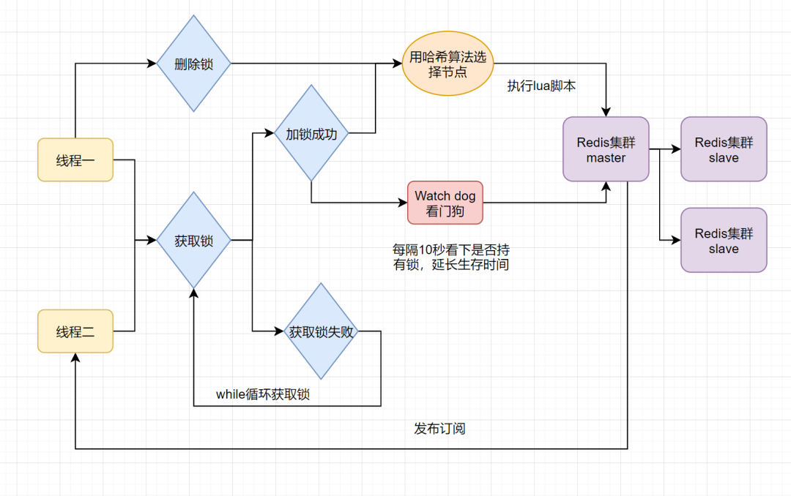

---

# Redis概念 | 性能优化

## BigKey问题

==【八股】什么是BigKey？==

某个Key对应的Value值很大，占用Redis较多的内存空间；通常从两个方面来描述BieKey：数据大小、成员数量；

以下是一个简单的判断标准：

- 一个String类型的Key，它的值为5MB（数据过大）；
- 一个List类型的Key，它的列表数量为20000个（列表数量过多）；
- 一个ZSet类型的Key，它的成员数量为10000个（成员数量过多）；
- 一个Hash格式的Key，它的成员数量虽然只有1000个但这些成员的value总大小为100MB（成员体积过大）；

---

==【八股】BigKey问题产生的原因？（产生的场景？）==

- Redis数据结构使用不当：将二进制数据存入String类型数据；
- 没有合适的数据清理机制：哈希表的Key只有写入数据的操作，没有删除数据的操作；
- 业务预估不准确：没有将Key进行合理的拆分，导致业务后期Key的数量变多；

---

==【八股】BigKey的危害？==

- 阻塞请求：对BigKey读写的时候比较耗时，会阻塞后续请求的执行；
- 内存增大：BigKey的内存占用过大，容易引发OOM；若触发了Redis的最大内存限制，可能会阻塞新key的写入或将重要的Key驱逐出去；
- 阻塞网络：BigKey会占用服务器网卡较多的带宽，可能影响服务器上其他服务的运行；
- 影响主从同步：删除BigKey可能造成主库较长时间的阻塞并引发同步中断问题或主从切换问题；

---

==【八股】如何解决BigKey问题？==

- 拆分BigKey
- 定期对数据进行清理，预防BigKey的产生
- 监控Redis的内存占用、超时等指标

---

==【八股】如何识别BigKey？==

- 自带命令操作
- 开源分析工具分析RDB文件
- 公有云的Redis分析服务

## 大量Key集中过期问题

==【八股】大量Key集中过期产生的原因？（产生的场景？）==

- 在对多个Key进行过期时间设置的时候，设置了相同的过期时间

---

==【八股】大量Key集中过期产生的危害？==

- 性能下降：当大量Key集中过期的时候，Redis需要花费一定时间才能完成这些过期Key的请求工作
- 内存浪费：过期Key的空间会在清理后释放，但是不会立刻将这些空间分配出去，造成空间浪费
- 造成数据库压力过大：缓存中的数据消息，请求过来的时候会落在数据库上

---

==【八股】如何避免大量Key集中过期的问题？==

治本的方法：

- 在给多数Key赋予过期时间的时候，加上随机值，避免在短时间内大量过期

治标的方法：

- 使用多级缓存，避免发生大量Key过期后，请求直接落在数据库上
- 限流，防止发生大量Key过期后，请求全部落在数据库上

## HotKey问题

==【八股】什么是HotKey？==

如果一个 key 的访问次数比较多且明显多于其他 key 的话，那这个 key 就可以看作是 hotkey（热 Key）；

例如在 Redis 实例的每秒处理请求达到 5000 次，而其中某个 key 的每秒访问量就高达 2000 次，那这个 key 就可以看作是 hotkey。

---

==【八股】产生HotKey的原因？==

- 某个数据的访问量激增，比如：热搜新闻、秒杀的商品

---

==【八股】HotKey有什么危害？==

- HotKey会占用大量的CPU和带宽，影响Redis实例处理其他请求
- HotKey若突然过期，可能会将大量的请求落入到数据库上，对数据库造成巨大压力

---

==【八股】如何解决HotKey问题？==

针对HotKey的内存占用问题：

- 设置读写分离：主节点处理写请求，从节点处理读请求
- 使用Redis集群：将热点数据分散到不同的Redis节点上

针对HotKey可能突然过期问题：

- HotKey的访问有明显的时效性，比如商品秒杀，通过合理设置过期时间，保证秒杀期间，HotKey能生效
- 使用多级缓存，即使HotKey失效，也不会对数据库造成太多压力
- 限流

## 内存碎片问题

==【八股】什么是内存碎片？==

一句话来说，就是不可用的空闲内存

---

==【八股】内存碎片产生的原因？==

- Redis存储数据申请内存的时候，申请的空间会大于数据实际需要的存储空间
- Redis频繁修改数据，例如删除数据，多余的空间不会轻易的还给操作系统

---

==【八股】内存碎片率的计算标准？内存碎片的处理措施？==

内存碎片率 = 操作系统实际分配给Redis的物理内存空间大小 / Redis为了存储数据申请使用的内存空间大小；

内存碎片率 > 1.5，表示需要清理内存碎片。

---

怎么处理内存碎片：

- 自带命令处理

```sh
#### 开启内存碎片清理
config set activedefrag yes

#### 设置清理条件
# 内存碎片占用空间达到 500mb 的时候开始清理
config set active-defrag-ignore-bytes 500mb
# 内存碎片率大于 1.5 的时候开始清理，即内存碎片占用了50%的内存空间
config set active-defrag-threshold-lower 50

#### 清理碎片是会影响Redis性能，设置CPU占用率的大小
# 内存碎片清理所占用 CPU 时间的比例不低于 20%
config set active-defrag-cycle-min 20
# 内存碎片清理所占用 CPU 时间的比例不高于 50%
config set active-defrag-cycle-max 50
```

- 重启节点进行内存碎片整理

## Redis性能优化

==【八股】在使用Redis的时候怎么优化性能？==

- 尽量使用批量操作命令，减少网络传输：

  - 使用原生的批量操作命令 `MGet、SADD；`
  - 使用pipeline封装命令，一次性提交给Redis服务器；
  - 使用Lua脚本，保证命令的原子性执行；
- 避免大量Key集中过期，防止缓存雪崩；
- 避免出现BigKey；
- 关注hotKey，防止缓存击穿；

# Redis概念 | 缓存相关问题

## 缓存穿透、缓存击穿、缓存雪崩

==【八股】什么是缓存穿透？==

概念：客户端请求的数据，既不在缓存中，也不在数据库中，导致缓存永远不会生效，大量的请求落在数据库上，造成数据库压力过大。

产生场景：

- 不合理的请求访问系统，例如黑客制造一些非法的Key来访问系统

解决方法：

- 参数校验：防止不合理的请求进入到系统中
- 缓存空值的key

  ```
  做法：当缓存和数据库中均不存在某数据时，将一个空值写入缓存；这样后续来的请求就可以根据缓存进行判断而不会将压力给到数据库

  不足：key如果频繁变化，会导致缓存大量的无效key

  弥补：设置无效key的失效时间

  注意：要有相应的缓存失效策略。比如数据库创建了该数据，缓存要删除失效
  ```
- 使用布隆过滤器

  ```
  组成：大型位数组 + 多个无偏Hash函数

  使用：
  	- 将所有可能存在的key，通过多个Hash函数，映射到位数组的索引上，将这些索引位置对应的值改为1
  	- 后续key过来，同样进行Hash操作：
  		- 若对应索引的值均为1，视为合理，允许后续的缓存操作；
  		- 若对应索引的值有0，视为不合理，拒绝请求

  特点：会存在误判，但不会存在漏判
  	- 误判：不存在的数据说存在
  	- 漏判：存在的数据说不存在
  ```
- 接口限流：限制异常频繁访问的ip；黑名单机制

---

==【八股】什么是缓存击穿==

概念：缓存击穿问题也叫热点Key问题，指一个被高并发访问并且缓存重建业务较复杂的key突然失效了，无数的请求访问会在瞬间给数据库带来巨大的冲击。

产生场景：

- 秒杀活动中，某个商品的缓存数据突然过期，造成大量请求落到数据库上

解决方法（HotKey问题中突然过期的应对策略）：

- 设置热点数据不过期或延长过期时间
- 缓存预热：提前将数据存入缓存，并设置合理的失效时间，避免在大量访问的时间点上失效，造成缓存击穿
- 互斥锁：

  ```
  原理：请求数据库将数据写入缓存前，先获取互斥锁，保证只有一个请求能落到数据库上

  不足：并发访问时，会造成大量请求中只有一个生效，其余的请求都失效
  ```

---

==【八股】什么是缓存雪崩？==

概念：缓存雪崩是指在同一时段大量的缓存key同时失效或者Redis服务宕机，导致大量请求到达数据库，带来巨大压力。

产生场景：

- 一小段时间内，大量Key同时失效

解决方法：

- 给Key的TTL加上随机值，尽量避免同时失效
- 使用多级缓存
- 限流

## 缓存预热

概念：系统上线后，将缓存数据直接加载到缓存系统（Redis），避免用户查询的时候，再请求一遍数据库。

示例：秒杀活动上线前，将相关数据加载到缓存中，并设置合理的有效时间。既避免了秒杀时对数据库的压力，也避免了缓存击穿的问题。

## 缓存降级

概念：缓存降级是指在某些情况下，为了保证核心服务的可用性和稳定性，主动将部分关键数据或功能进行降级处理，以避免缓存系统出现问题导致整个应用崩溃。这通常涉及到一些策略和措施，用于在缓存系统面临压力、故障或其他异常情况时，保障关键业务的正常运行。

具体实现：

- 数据降级：将部分请求或全部请求直接发送至数据库，不走缓存。保证在缓存出现问题的时候，系统仍然可用。
- 限流降级：当系统压力过大时，通过限流策略来降低对Redis的请求量，以保证Redis能够正常使用

### 限流

==【八股】常见的限流算法有哪些？==

参考文章：[文章1](https://www.cnblogs.com/liqiangchn/p/14253924.html)、[文章2](https://mp.weixin.qq.com/s/Kmy1gy0z7gaopKMmAsAd3g)

算法1：固定窗口算法

- 原理：统计单位时间内的请求个数，超过及拒绝
- 不足：会有临界问题，导致流量激增

算法2：滑动窗口算法

- 原理：将固定窗口每次向后移动一小格，统计窗口内的流量，解决方案1的临界问题
- 不足：算法1、2都是将流量瞬间切断，而不是让流量平滑的进入系统

算法3：漏桶算法

- 原理：请求来了入桶；桶内若满了，拒绝请求；服务器定速从桶内拿请求处理
- 理解：线程池思想、消息队列的削峰填谷
- 不足：任务时候请求速率一致，在流量激增的时候更希望提高一些处理效率

算法4：令牌桶算法

- 原理：定速往桶内放入令牌，桶的大小也有限制；请求来了，先拿令牌，再处理；没有令牌的请求不能进行后续处理，被丢弃
- 理解：Semaphore信号量的思想
- 好处：瞬态流量大的时候，可能瞬间将令牌桶内的令牌拿走，然后去处理，既保证了请求速率的加快，也保证了请求不会击穿服务器（桶的大小）
- 不足：需要预热，不然刚上线，桶内没有令牌，请求就误杀了

---

各自应用场景：

- 漏桶和令牌桶算法：适合阻塞式的限流场景，即没有令牌等着，就不会有误杀了，也能限流
- 时间窗口、滑动窗口：适合时间敏感的场景，请求超限了就立刻告知，后续再请求就完事了

---

单机限流和分布式限流：

- 针对上述算法，主要就是令牌获取位置的区别。单机的话，就放内存中处理；分布式的话，就可以用Redis处理。

# Redis应用 | Java客户端

参考文章：[如何在Java中使用Redis](/ToBeABD/Database/Redis/sgcrldex/)

# Redis应用 | 8中数据类型的应用场景

## 思路 | 使用Redis实现分布式锁

==【八股】分布式锁跟本地锁有什么区别？需要具备什么条件？==

多个请求访问同一个共享资源，如果要保证一次只有一个请求能访问，就需要在访问的时候对该共享资源加锁。

- 本地锁：在单个JVM进程下，可以使用 `ReentrantLock、synchronized`关键字实现一个JDK自带的本地锁。
- 分布式锁：如果一个项目有多个实例，那么就有多个JVM在运行，一个JVM上的本地锁就没法锁住另一个JVM上的请求，就需要用到分布式锁

分布式锁具备的基本条件：

- 互斥：锁的基本条件
- 高可用：即使代码运行出现问题，锁最终一定可以释放，不影响其他请求使用
- 可重入：获得锁的请求可以再次获得锁

分布式锁的额外条件：

- 高性能
- 非阻塞

分布式锁的常见实现方案：

- 基于关系型数据库比如 MySQL 实现分布式锁。
- 基于分布式协调服务 ZooKeeper 实现分布式锁。
- 基于分布式键值存储系统比如 Redis 、Etcd 实现分布式锁。

---

==【八股】基于MySQL实现一个分布式锁的思路？==

通过行锁来实现：

- 开启事务;
- 获取行锁：`Select * From xxx Where xxx = xxx For Update`；
- 执行锁操作；
- 释放锁并提交事务；

优点：

- 基于行级锁，支持多个MySQL实例的复制架构；
- 利用MySQL事务管理，锁的粒度更加精细；

缺点：

- 锁实现复杂度较高，需要单独设计表；
- 锁只能存在与事务中，如果事务未提交，其他客户端会阻塞；

---

==【八股】基于Redis实现一个分布式锁的思路==

保证互斥性：

- 锁获取：借助Redis的SETNX命令，可以用其他命令代替，主要是获取锁过程的原子性
- 锁删除：

  - 存储线程标识：防止误删锁，保证删锁的时候删除的是自己创建的锁

  ```
  解释：考虑特殊情况
  	- 线程1获取锁之后执行代码，卡顿了，在删除锁之前，锁过期了
  	- 线程2在线程1创建的锁过期后，尝试创建锁成功
  	- 线程1开始执行删除锁操作，若不判断就删了线程2创建的锁
  ```

  - 使用Lua脚本：删除锁的过程往往是多个步骤，需要保证删除锁的原子性

保证高可用：

- 获取锁是向Redis中写入一条数据，对该数据加入过期时间，避免锁一致被持有

保证可重入：

- 设计该数据组成的时候，使用计数器。每次获取锁之后，数值+1；最终释放锁时，当数值=0才可以删除锁

---

==【八股】【重要】基于Redis实现分布式锁==

参考文章：[https://www.cnblogs.com/wangyingshuo/p/14510524.html](https://www.cnblogs.com/wangyingshuo/p/14510524.html)

 方案1：`SETNX + EXPIRE`

- 原理：创建Redis数据，设置过期时间，创建成功即表示获取锁成功
- 不足：创建锁的过程不是原子性的，是两条命令；若创建锁之后，还未添加过期时间，线程维护了，这个锁就变成永久的了。

方案2：`SETNX + Value(系统时间+过期时间)`

- 原理：将过期时间的处理逻辑放在value中，解决方案1的不足
- 不足：该方法要求分布式环境下，每个客户端的时间是同步的；锁没有持有者的标识

方案3：Lua脚本执行 `SETNX + EXPIRE`两条指令

- 原理：Lua脚本执行多个指令，可以看作原子性的操作

方案4：使用 `SET`的扩展命令，仅一个命令兼顾设置过期时间

- 原理：通过一个命令完成锁获取，一个命令自然是原子性的
- 不足：方案3、方案4旨在使得锁获取的过程是原子性的，但还有其他问题：（1）锁过期释放了，业务没执行完；（2）锁被别的线程误删

方案5：使用 `SET`的扩展命令 + 校验唯一值

- 原理：在Value中写入当前线程的id，在删除锁的时候进行id判断，是该线程创建的锁，该线程才回去进行删除操作
- 不足：没有解决锁过期的问题

方案6：开源框架Redisson + 看门狗机制

- 原理：线程A创建锁成功后，启动一个后台线程（看门狗线程），每隔10s判断线程A是否还持有锁，持有的话就不断延长锁的生存时间



---

==【八股】为什么用lua脚本实现分布式锁？==

- 提供原子性操作：Lua脚本的执行在Redis中是原子执行的；
- 减少网络传输的开销：使用Lua脚本向Redis传输数据的时候是一次性传输所有命令，减少了网络传输的开销；

---

==【八股】基于Redis实现分布式锁的上锁+解锁操作？==

上锁：Redisson框架 + 看门狗机制；

解锁：lua脚本保证原子性（确保是持有锁的线程来删除锁 + 锁删除命令）；

## 不同场景下8中Redis数据类型的应用

==【八股】存储Java对象，建议用String还是Hash？==

建议使用String类型存储Java对象。

针对String类型：

- 存储的是序列化后的整个Java对象，而且占用内存较低；

针对Hash类型：

- 存储的是Java对象的字段及字段值，能够单独修改和访问某些字段；
- 若是某些Java对象的某些字段需要频繁访问，可以用Hash存储；其余情况还是用String存储即可；

---

==【八股】若用Redis存储购物车数据，用String还是Hash？==

用Hash。购物车数据需要频繁修改，建议使用Hash存储。

- 键：表示购物车中的产品
- 值：表示对应产品的数量

---

==【八股】使用Redis实现一个抽奖系统？==

利用Redis的Set数据结构实现：

- `SADD key member1 member2 ...`：向指定集合添加一个或多个元素（添加参与抽奖的用户）
- `SPOP key count`：随机选出一个或多个元素从集合中剔除（抽奖，适合不可重复中将）
- `SRANDMEMBER key count` : 随机获取指定集合中指定数量的元素（抽奖，适合允许重复中奖的场景）

==【八股】使用Redis实现共同好友功能？==

使用Redis的Set数据类型实现共同好友功能。

将两个人的好友列表放入两个set集合，通过Redis提供的并交集操作，筛选共同好友

---

==【八股】使用Redis实现统计活跃用户？==

统计活跃用户需要明确3点：什么时间、哪些用户、活跃/不活跃。可以借助Bitmap实现活跃用户的统计：

- 记录用户状态：

```
SETBIT 20210308 1 1		# 2021年3月8日，id=1的用户，记录为活跃状态

SETBIT 20210308 2 0		# 2021年3月8日，id=2的用户，记录为不活跃状态

......
```

- 统计某个时间段的活跃用户

```
BITOP and result 20210308 20210309	# 对20210308和20210309两个key下的数据进行与操作，将结果赋值给result

BITCOUNT result		# 统计result中，值=1的位数有多少，即统计活跃用户数量
```

类似这种2值状态的统计都可以用BitMap来实现，例如：签到情况

---

==【八股】使用Redis实现UV统计？==

概念理解：

* UV：全称Unique Visitor，也叫独立访客量，是指通过互联网访问、浏览这个网页的自然人。1天内同一个用户多次访问该网站，只记录1次。
* PV：全称Page View，也叫页面访问量或点击量，用户每访问网站的一个页面，记录1次PV，用户多次打开页面，则记录多次PV。往往用来衡量网站的流量。

**可以借助Redis的HyperLogLog实现UV统计：**

- `PFADD key element1 element2 ...`：添加一个或多个元素到 HyperLogLog 中（添加访问网站的用户id）
- `PFCOUNT key1 key2`：获取一个或者多个 HyperLogLog 的唯一计数（统计UV数量）

为什么用HyperLogLog 统计UV而不用Set？（GPT答案）

```
- 空间效率：SET 类型需要为每个唯一的元素存储一个完整的值。这意味着如果你有一个包含大量唯一元素的集合，它将占用大量的内存空间。相比之下，HyperLogLog 只需要很少的空间来估计集合的大小，即使集合中包含数亿个唯一元素。这是因为 HyperLogLog 使用概率算法来估算唯一元素的数量，而不是精确地存储每个元素。

- 内存使用：对于大规模数据集，SET 可能会消耗过多的内存，导致成本上升或系统性能下降。而 HyperLogLog 在保持相对准确的估计的同时，可以极大地减少内存消耗。

- 性能：在处理大规模数据时，SET 的插入和查找操作可能会变得相对较慢，特别是当集合变得非常大时。而 HyperLogLog 的操作通常是常数时间的，这意味着无论集合的大小如何，操作的速度都是相对稳定的。

- 误差容忍：由于 HyperLogLog 是基于概率的算法，它提供的是一个近似值而不是精确值。然而，在大多数情况下，这个近似值已经足够准确，能够满足统计需求。如果精确性不是关键要求，那么 HyperLogLog 的误差是可以接受的。

- 扩展性：HyperLogLog 支持合并操作，这意味着你可以从多个源收集数据，并将它们合并到一个最终的统计结果中。这对于分布式系统或需要从多个位置收集数据的场景非常有用。
```

**可以借助String类型实现PV的统计：**

- 记录一个String类型的value：key-表示某页面，value：默认=0，每次访问该页面后值自增即可

---

==【八股】使用Redis实现排行榜功能？==

排行榜功能一般都可以使用Redis的SortedSet数据类型来实现。

一般来说：

- key：设置为时间
- value：用户id/用户昵称

根据实现的排行榜类别，score写入不同的值：

- 点赞排行榜：写入点赞时间
- 步数排行榜：写入步数的值

---

==【八股】使用Redis实现附近的商户？==

涉及地理位置的功能，用GEO数据类型来实现即可。

看相关命令即可：

```
- GEOADD：			添加一个地理空间信息，包含：经度（longitude）、纬度（latitude）、值（member）
- GEODIST：			计算指定的两个点之间的距离并返回
- GEOHASH：			将指定member的坐标转为hash字符串形式并返回
- GEOPOS：			返回指定member的坐标
- GEORADIUS：		指定圆心、半径，找到该圆内包含的所有member，并按照与圆心之间的距离排序后返回。		  6.以后已废弃
- GEOSEARCH：		在指定范围内搜索member，并按照与指定点之间的距离排序后返回。范围可以是圆形或矩形。	 6.2.新功能
- GEOSEARCHSTORE：	与GEOSEARCH功能一致，不过可以把结果存储到一个指定的key。 					  		 6.2.新功能
```

==【八股】介绍一下GeoHash？==

Redis中GEO数据类型就用到GeoHash来将二维的地址数据转为一维的字符串数据来记录

什么是GeoHash：

- 是一种地址编码方式，将二维的经纬度坐标编码成一维的字符串；
- 具有层次性：GeoHash字符串越长，表示的区域越精确；
- 具有相邻性：相似经纬度坐标编码后的结果，前缀是相同的；
- 具有隐私保护性：由于GeoHash的层次性，可以对GeoHash的结果进行截取来模糊用户的精确位置，还能实现近似匹配

通过GeoHash实现查找附近的商户（假设自己使用GeoHash，而非借助Redis的GEO数据类型）：

- 用GeoHash存储每个商户的地址
- 若一个商户发起查找附近商户的请求，用该商户的地址结果在数据库中检索
- 由于层次性，可以在数据库中对该列数据建立前缀索引，加快查询速度
- 可以根据精度要求，来对查询出来的结果进行筛选
- 将结果返回

# Redis补充 | 牛客八股

==【八股】为什么使用布隆过滤器不用set，布隆过滤器有什么优点？==

使用布隆过滤器主要考虑以下这些方面：

- 空间效率更高：set需要存储元素本身，而布隆过滤器只需要存储位数组 + Hash函数
- 查询性能更好：空间查询效率仅O(k) -- k表示哈希函数个数；set集合需要Redis命令来查询，对Redis也是一种压力
- 对保密性有优势：set会存储元素本身，就存在数据泄露的风险
