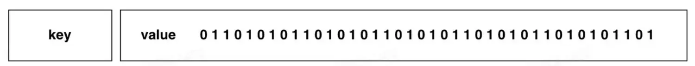

---

## 参考文章

小林Coding：[https://xiaolincoding.com/redis/data_struct/data_struct.html](https://xiaolincoding.com/redis/data_struct/data_struct.html)

## Redis底层数据结构实现总结

|                 | Redis3.0                     | 最新                       |
| --------------- | ---------------------------- | -------------------------- |
| `String`      | `SDS`                      | -                          |
| `List`        | `压缩列表` 或 `双向链表` | `quicklist`              |
| `Hash`        | `压缩列表` 或 `哈希表`   | `listpack` 或 `哈希表` |
| `Set`         | `整数集合` 或 `哈希表`   | -                          |
| `ZSet`        | `压缩列表` 或 `跳表`     | `listpack` 或 `跳表`   |
| `BitMap`      | `bit数组`                  | -                          |
| `HyperLogLog` | 不知道                       | 不知道                     |
| `GEO`         | `ZSet集合类型`             | -                          |

## Redis数据库类型 | 键-值

Redis是一个键-值型数据库，通过Hash表保存所有的键值对。

Redis保存键值过程涉及的所有数据结构如下：


- `redisDb`：猜测：一个redisDb可能存储所有Redis库，也可能一个redisDb存储一个Redis库，然后有多个redisDb
- `void* key 和 void* value`表示Redis对象（常见的5中数据类型 + 3中特殊数据类型）

Redis对象的基本结构如下：

- type：标识该对象是啥类型的对象（String对象、List对象、Hash对象...）；
- encoding：标识该对象使用了哪种底层的数据结构（SDS、压缩列表、...、哈希表等）；
- ptr：指向底层数据结构的指针；


## 基本数据类型：String

### SDS（simple dynamic string）

Redis中存储String类型的数据，没有用C语言自己的String结构，而是自定义了一个SDS结构：


==【八股】Redis为什么不用C语言默认的String结构，而是使用自定义的SDS结构？==

默认的String结构有如下缺点：

- 获取字符串长度的时间复杂度为O(n)；
- 字符串结尾标识是 `\0`，只能保存String类型数据，无法保存二进制数据
- 字符串相关操作函数不高效也不安全，有缓存区溢出的风险，没有相应的检查措施

自定义的SDS结构可以完美解决上述问题：

- len变量，可以O(1)的获取字符串长度
- 通过专门的len变量记录数据长度，解决了C语言中String数组不能保存 `\0`的特点，使得SDS可以保存二进制数据
- SDS在为新的数据分配空间的时候，会通过alloc和len自动判断剩余空间是否满足要求，若不满足要求，会自动扩容

---

==【八股】SDS扩容的过程是怎么样的？==

- 当剩余容量足以扩容时，直接返回
- 当剩余容量不足以扩容时，进行扩容（假设数组已存数据大小 + 新存入数据大小 = newlen）：
  - newlen < 1MB，数组扩容为2*newlen
  - newlen > 1MB，数组扩容为newlen + 1MB

---

==【八股】SDS中flags成员变量类型有5种，为什么这样设计？==

有如下5种：sdshdr5、sdshdr8、sdshdr16、sdshdr32 和 sdshdr64

他们的区别在于：len和alloc可表示的范围（sdshdr16表示uint16_t；sdshdr32表示uint32_t）

这样设计的原因：

- 为了能够灵活保存不同大小的字符串，节省内存空间；在保存小字符串的时，结构体占用的空间也少一点

## 基本数据类型：List

Redis中存储List数据类型的底层数据结构有三种：压缩列表、双向链表、quicklist。

### 压缩列表

使用场景：Redis3.0之前，Redis只有在List列表中数据量较少的时候，使用压缩列表来保存数据。

压缩列表的结构如下：


- `zlbytes`：记录整个压缩列表占用的内存字节数
- `zltail`：记录压缩列表尾部节点的偏移量
- `zllen`：记录压缩列表中的节点数量
- `zlend`：记录压缩列表的结束点，是一个固定值0xFF（十进制的255）
- `prelen`：前一个节点的长度，为了实现从后往前遍历
- `encoding`：记录数据的类型和长度，主要数据类型是字符串和整数
- `data`：记录当前节点的实际数据

---

==【八股】讲一讲压缩列表的连锁更新问题？==

Redis压缩列表的节点，有一个变量prelen，用来记录前一个结点的长度：

- 当其长度 < 254字节，prelen需要用1个字节长度就能保存
- 当其长度 > 254字节，prelen需要用5个字节长度来保存

连锁更新问题：

- 若原先压缩列表中的节点，长度都<254，prelen都只用1个字节长度来保存，
- 当新增/修改一个元素放在压缩列表的头部，且该元素的长度>254字节，
- 可能会引起后续节点的prelen变量长度发生变化，一个影响一个，可能产生连锁反应

### 双向链表

使用场景：Redis3.0之前，Redis在List列表中数据量较多的时候，使用双向链表来保存数据。

双向链表的结构如下：


- `head`：记录双向链表的头节点
- `tail`：记录双向链表的尾节点
- `len`：记录双向链表的节点数
- `dup、free、match`：表示相应的函数方法

ListNode的底层实现：

```c
typedef struct listNode {
    //前置节点
    struct listNode *prev;
    //后置节点
    struct listNode *next;
    //节点的值，是一个指针
    void *value;
} listNode;
```

---

==【八股】Redis双向链表的好处？不足？==

好处：

- 访问首位节点的时间复杂度为O(1)
- 访问元素数量的时间复杂度为O(1)

不足：

- 内存不连续，无法很好利用CPU缓存
- 内存开销比较大

### quicklist

使用场景：最新版本中，Redis采用quicklist结构来作为List数据类型的底层实现。

quicklist就是 [ 双向列表 + 压缩列表 ] 的组合，结构如下：


quicklist的设计思想就是：通过控制每个quicklistNode节点里面压缩列表的元素数量，来减少连锁更新问题，但是没有完全解决。

辅以源码定义，来理解 `quicklist`和 `quicklistNode`：

```c
typedef struct quicklist {
    //quicklist的链表头
    quicklistNode *head;      //quicklist的链表头
    //quicklist的链表尾
    quicklistNode *tail; 
    //所有压缩列表中的总元素个数
    unsigned long count;
    //quicklistNodes的个数
    unsigned long len;     
    ...
} quicklist;
```

```c
typedef struct quicklistNode {
    //前一个quicklistNode
    struct quicklistNode *prev;     //前一个quicklistNode
    //下一个quicklistNode
    struct quicklistNode *next;     //后一个quicklistNode
    //quicklistNode指向的压缩列表
    unsigned char *zl;            
    //压缩列表的的字节大小
    unsigned int sz;              
    //压缩列表的元素个数
    unsigned int count : 16;        //ziplist中的元素个数 
    ....
} quicklistNode;
```

---

==【八股】quicklist对比压缩列表，怎么避免连锁更新问题？==

quicklist就是压缩列表 + 双向链表的结合体，双向链表的每一个节点对应一个压缩列表。

quicklist通过控制每个双向链表节点下，压缩列表中元素的数量，来减少连锁更新问题，但是该问题没有彻底解决。

- 向quicklist插入元素，对应插入位置的压缩列表能容纳该元素，就放入；不能容纳，就新建一个quicklistNode节点
- 向quicklist中插入元素或修改元素，还是会有连锁更新的问题

## 基本数据类型：Hash

### 压缩列表

使用场景：Redis3.0，只有在Hash数据类型中元素数量较少的时候，才会采用压缩列表作为底层数据结构

该数据结构在List中已有介绍

### listpack

使用场景：Redis最新版，在Hash数据类型中元素数量较少的时候，用listpack来存储数据而不再用压缩列表来存储了

listpack的数据结构：


listpack采用了压缩列表的设计思想。

---

==【八股】listpack对比压缩列表，怎么解决连锁更新的问题？==

listpack中，节点对象存储的是该节点的数据长度，而不是上一个节点的数据长度，这样插入元素或修改元素的时候，就不会有连锁更新问题了。

### 哈希表

使用场景：不管Redis的哪个版本，Hash数据类型中元素数量较多的时候，都采用哈希表来作为底层数据结构，存储数据

通过源码+图示的方式，来理解Redis中的哈希表底层数据结构：


```c
typedef struct dictht {
    //哈希表数组
    dictEntry **table;
    //哈希表大小
    unsigned long size;  
    //哈希表大小掩码，用于计算索引值
    unsigned long sizemask;
    //该哈希表已有的节点数量
    unsigned long used;
} dictht;
```

```c
typedef struct dictEntry {
    //键值对中的键
    void *key;
  
    //键值对中的值
    union {
        void *val;
        uint64_t u64;
        int64_t s64;
        double d;
    } v;
    //指向下一个哈希表节点，形成链表
    struct dictEntry *next;
} dictEntry;
```

==【八股】Redis哈希表中的基本结构 `dictEntry`，键是指针，值是定义的联合体，为什么这样设计？==

- 当值是一个整数或者浮点数的时候，就可以直接将值嵌入在dictEntry结构中，而无需再多使用一个指针
- 当值是一个其他类型的结构数据时，可以作为指针，指向该值对应的底层位置

---

==【八股】什么是Hash冲突，怎么解决？==

多个数据经过Hash映射后，存储到Hash数组的同一个索引位置下，就会产生冲突，就叫哈希冲突

解决Hash冲突的方法：链式哈希；还有其他的解决方法：开放定址法 和 再哈希法

---

==【八股】讲一讲Redis哈希表中的rehash操作？渐进式rehash？触发rehash的条件？==

什么是rehash？

- 当哈希表中存储的元素越来越多，需要对哈希表的数据进行扩容
- 扩容后，元素在哈希表中的位置会重新分配，这就是rehash操作

触发rehash的条件？

- rehash的判断条件，跟负载因子有关（ 负载因子 = 哈希表已保存节点数量 / 哈希表大小）
- 负载因子 >= 1，当没有RDB快照或AOF重写的时候，会进行rehash操作
- 负载因子 >= 5，不管有没有RDB操作或AOF操作，强制rehash操作

rehash操作的大体步骤：

- 给哈希表2分配空间，一般是哈希表1的二倍
- 将哈希表1中的数据移动到哈希表2中
- 释放哈希表1的空间，将哈希表2设置为哈希表1

什么是渐进式rehash？

- rehash操作移动元素，不是一步到位的
- 在Redis进行增删改查期间，按照顺序将元素移动到哈希表2中，最后会在某一个节点完成rehash操作
- 好处：避免一次rehash操作造成的时间开销，将rehash操作分摊到多个请求中

---

==【八股】rehash操作期间，哈希表的增删改查操作，有什么特点？==

新增操作：只在哈希表2中操作，不在哈希表1中操作

删除操作：

- 若该元素已同步到哈希表2中，需要在两个哈希表中都进行删除操作
- 若该元素未同步到哈希表2中，只需要把元素在哈希表1中删除即可

修改操作：

- 同删除操作

查询操作：

- 查询哈希表1，看看有没有元素，有就返回
- 查询哈希表1，看看有没有元素，没有；查询哈希表2，看看有没有对应元素

rehash完成之后，哈希表1的内存就会释放，后续只维护哈希表2；

## 基本数据类型：Set

### 整数集合

使用场景：当一个Set集合只包含整数值元素，并且元素数量不大时，会使用整数集合作为底层实现

整数集合的定义如下：

```c
typedef struct intset {
    //编码方式
    uint32_t encoding;
    //集合包含的元素数量
    uint32_t length;
    //保存元素的数组
    int8_t contents[];
} intset;
```

本质是一个连续的内存空间。

补充：`contents[]`定义为 `int8_t`类型，但是其内保存的具体数据长度跟编码方式有关

---

==【八股】整数集合的升级操作了解嘛？==

假设整数集合中，原有元素的类型为 `int16_t`，现插入一个类型为 `int32_t`的元素，那么就会将整数集合中所有元素都改为 `int32_t`类型

升级操作的好处：

- 节省内存空间：当需要存储更大类型元素的时候，才会对元素的占用空间进行升级

整数集合支持降级操作嘛？

- 不支持

### 哈希表

该底层数据结构已在Hash数据类型中介绍过。

## 基本数据类型：ZSet

### 压缩列表

该底层数据结构已在前边介绍过

### listpack

该底层数据结构已在前边介绍过

### 跳表

跳表是在双向链表的基础上改动的，实现了一种多层的有序双向链表，可以快速定位数据。

展示一个层级为3的跳表：


跳表中节点的底层源码实现：

```c
typedef struct zskiplistNode {
    //Zset 对象的元素值
    sds ele;
    //元素权重值
    double score;
    //后向指针
    struct zskiplistNode *backward;
  
    //节点的level数组，保存每层上的前向指针和跨度
    struct zskiplistLevel {
        struct zskiplistNode *forward;
        unsigned long span;
    } level[];
} zskiplistNode;
```

调表的底层源码实现：

```c
typedef struct zskiplist {
    struct zskiplistNode *header, *tail;
    unsigned long length;
    int level;
} zskiplist;
```

---

==【八股】跳表查询元素的过程？==

- 从头结点的最高层开始查询，逐一遍历每一层
- 在遍历每一层节点时，有如下两个规则：
  - 当前节点的权重 < 要查找的权重时，访问该层上的下一个节点；
  - 当前节点的权重 = 要查找的权重时 && 当前节点的SDS类型数据 < 要查找的数据，访问该层的下一个节点
- 当上述两个规则都不满足时 || 下一个节点为空，跳表会沿着该层的下一层开始查找

---

==【八股】跳表节点层数的设置？==

跳表的层数、每一层的节点数都会影响查询性能。

跳表相邻层节点数量的理想比例是2:1，可以使得查询复杂度降低为O(logN)。

Redis对于跳表不同层数的节点数量没有做严格限制，创建规则是：

- 每创建一个节点，生成一个随机数种子（0-1）
- 如果值>p，层数就是1；如果值<p，层数+1，继续生成随机数种子
- 直到随机数种子的结果>p || 层数==64，停止层数创建

---

==【八股】Redis为什么采用跳表而不是平衡树来作为ZSet的底层数据结构？==

从以下三点来讲述：

- 内存占用更加灵活：

  - 平衡树每个节点一定有2个指针
  - 跳表中每个节点的指针数量跟层数有关，平均层数为1/(1-p)
- 范围查询的时候，更加灵活：

  - 平衡树做范围查询，需要找到起始节点，然后进行中序遍历
  - 跳表做范围查询，只需要找到起始节点，然后按照顺序访问即可
- 增删操作简单

  - 平衡树的增删操作，可能引发子树的调整
  - 跳表的增删操作，只需要改变相邻节点即可

## 特殊数据类型：BitMap

### Bit数组

使用场景：数据量大且只进行二值统计的场景

底层实现就是一个数组：



只不过数组中的每一位都会被用到，并表示特定的状态。

## 特殊数据类型：HyperLogLog

学不明白

## 特殊数据类型：GEO

### 跳表

GEO用于存储地理位置信息，其底层实现是ZSet数据类型对应的底层实现：跳表

---

==【八股】GEO如何存储地址信息？==

通过GeoHash，将二维经纬度信息编码为一维的字符串信息

将二维的经纬度区间进行编码，每一个区间对应不同的编码值

这样一个地址元素存入GEO中：

- ZSet的值：GeoHash之后的结果；
- ZSet的权值：地址元素对应的区间编码；
