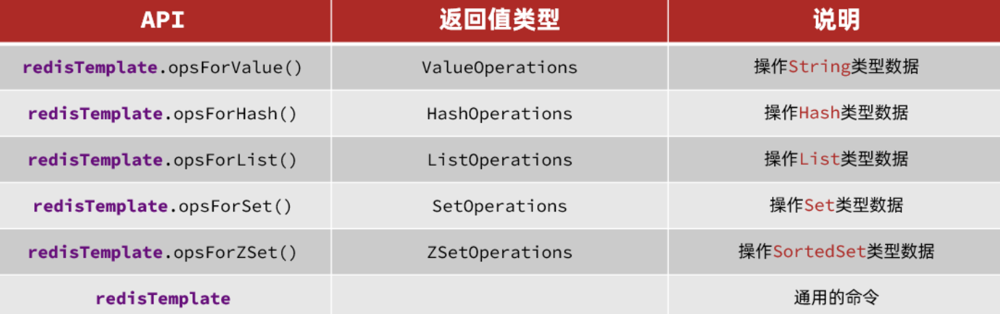
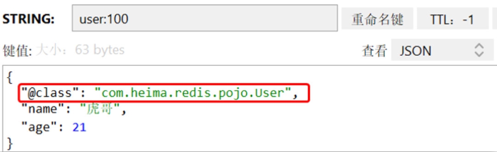

## 前言

以下涉及的代码均在Github上有完整记录。

| GitHub | [https://github.com/Web-Learn-GSF/Java_Learn_Examples](https://github.com/Web-Learn-GSF/Java_Learn_Examples) |
| ------ | ------------------------------------------------------------ |
| 父工程 | Java_Client_Redis                                            |


## Java中应用Redis

### 方式1 | Jedis裸连

#### 依赖引入

```xml
<!--jedis-->
<dependency>
  <groupId>redis.clients</groupId>
  <artifactId>jedis</artifactId>
  <version>3.7.0</version>
</dependency>
<!--单元测试-->
<dependency>
  <groupId>org.junit.jupiter</groupId>
  <artifactId>junit-jupiter</artifactId>
  <version>5.7.0</version>
  <scope>test</scope>
</dependency>
```

#### 代码测试

```java
package com.example;

public class AppTest {
    private Jedis jedis;
    @BeforeEach
    void setUp() {
        // 1.建立连接
         jedis = new Jedis("192.168.93.128", 6379);
        // 2.设置密码
        jedis.auth("123456");
        // 3.选择库
        jedis.select(0);
    }
    @Test
    void testString() {
        // 存入数据
        String result = jedis.set("name", "虎哥");
        System.out.println("result = " + result);
        // 获取数据
        String name = jedis.get("name");
        System.out.println("name = " + name);
    }

    @Test
    void testHash() {
        // 插入hash数据
        jedis.hset("user:1", "name", "Jack");
        jedis.hset("user:1", "age", "21");

        // 获取
        Map<String, String> map = jedis.hgetAll("user:1");
        System.out.println(map);
    }

    @AfterEach
    void tearDown() {
        // 这里的close指关闭连接
        if (jedis != null) {
            jedis.close();
        }
    }
}
```

#### 特点

每次调用，新建一个jedis线程，使用完毕后，关闭该线程。

jedis本身是线程不安全的，在多线程环境下，还是要用连接池来实现。


### 方式2 | Jedis_pool

#### 依赖引入

```xml
<!--jedis-->
<dependency>
  <groupId>redis.clients</groupId>
  <artifactId>jedis</artifactId>
  <version>3.7.0</version>
</dependency>
<!--单元测试-->
<dependency>
  <groupId>org.junit.jupiter</groupId>
  <artifactId>junit-jupiter</artifactId>
  <version>5.7.0</version>
  <scope>test</scope>
</dependency>
```


#### 代码 | 自定义连接池工具类

```java
package com.example.util.jedis;

public class JedisConnectionFactory {
    private static JedisPool jedisPool;

    static {
        // 配置连接池
        JedisPoolConfig poolConfig = new JedisPoolConfig();
        poolConfig.setMaxTotal(8);
        poolConfig.setMaxIdle(8);
        poolConfig.setMinIdle(0);
        poolConfig.setMaxWaitMillis(1000);
        // 创建连接池对象，参数：连接池配置、服务端ip、服务端端口、超时时间、密码
        jedisPool = new JedisPool(poolConfig, "192.168.93.128", 6379, 1000, "123456");
    }

    public static Jedis getJedis(){
        return jedisPool.getResource();
    }
}
```

#### 代码 | 测试

```java
package com.example;

public class AppTest {
    private Jedis jedis;
    @BeforeEach
    void setUp() {
        // 1.建立连接
        jedis = JedisConnectionFactory.getJedis();
        // 2.设置密码
        jedis.auth("123456");
        // 3.选择库
        jedis.select(0);
    }
    @Test
    void testString() {
        // 存入数据
        String result = jedis.set("name", "虎哥");
        System.out.println("result = " + result);
        // 获取数据
        String name = jedis.get("name");
        System.out.println("name = " + name);
    }

    @Test
    void testHash() {
        // 插入hash数据
        jedis.hset("user:1", "name", "Jack");
        jedis.hset("user:1", "age", "21");

        // 获取
        Map<String, String> map = jedis.hgetAll("user:1");
        System.out.println(map);
    }

    @AfterEach
    void tearDown() {
        // 这里的close指归还资源给线程池
        if (jedis != null) {
            jedis.close();
        }
    }
}
```

#### 特点

- 通过线程池，避免了线程的频繁创建和销毁，减少资源的消耗


### 方式3 | SpringDataRedis

> **SpringData是Spring中数据操作的模块，包含对各种数据库的集成，其中对Redis的集成模块就叫做SpringDataRedis**
>
> - 提供了对不同Redis客户端的整合（Lettuce和Jedis）
> - 提供了RedisTemplate统一API来操作Redis
> - 支持Redis的发布订阅模型
> - 支持Redis哨兵和Redis集群
> - 支持基于Lettuce的响应式编程
> - 支持基于JDK、JSON、字符串、Spring对象的数据序列化及反序列化
> - 支持基于Redis的JDKCollection实现

通过调用RedisTemplate来连接Redis


#### SpringBoot默认的实现

##### 常用API




##### 使用方式

依赖导入：SpringBoot已经提供了对SpringDataRedis的支持，使用非常简单。

```xml
<dependency>
    <groupId>org.springframework.boot</groupId>
    <artifactId>spring-boot-starter-data-redis</artifactId>
</dependency>
```

配置文件配置Redis：

- 根据SpringBoot版本的不同，`data`这一层级的关系，在3.x版本中才出现，2.x版本没有

```yaml
spring:
  data:
    redis:
      port: 6379
      host: 192.168.93.128
      password: 123456
      lettuce:
        pool:
          max-active: 8
          max-idle: 8
          min-idle: 0
          max-wait: 100ms
```

- 测试

```java
package com.example;

@SpringBootTest
class Demo03SpringDataRedisRedisTemplateApplicationTests {
   @Autowired
   private RedisTemplate redisTemplate;

    @Test
    void contextLoads() {
        // 写入一条String数据
        redisTemplate.opsForValue().set("name", "虎哥");
        // 获取string数据
        Object name = redisTemplate.opsForValue().get("name");
        System.out.println("name = " + name);
    }
}
```


##### 特点

存入Redis的数据和原始数据不太一样。


#### 自定义实现方式

RedisTemplate存入Redis的数据与原数据展示形式不同，因为默认的set函数接受的参数是`Object`类型，默认进行了序列化操作。

若要实现数据写入和保存结果一致，可以自定义RedisTemplate，并注入到Spring容器里面，代替默认的。


##### 自定义redisTemplate

```java
package com.example.config;

@Configuration
public class RedisConfig {

    @Bean
    public RedisTemplate<String, Object> redisTemplate(RedisConnectionFactory connectionFactory){
        // 创建RedisTemplate对象
        RedisTemplate<String, Object> template = new RedisTemplate<>();
        // 设置连接工厂
        template.setConnectionFactory(connectionFactory);
        // 创建JSON序列化工具
        GenericJackson2JsonRedisSerializer jsonRedisSerializer =
                new GenericJackson2JsonRedisSerializer();
        // 设置Key的序列化
        template.setKeySerializer(RedisSerializer.string());
        template.setHashKeySerializer(RedisSerializer.string());
        // 设置Value的序列化
        template.setValueSerializer(jsonRedisSerializer);
        template.setHashValueSerializer(jsonRedisSerializer);
        // 返回
        return template;
    }
}
```


##### 测试

```java
package com.example;

@SpringBootTest
class Demo04SpringDataRedisRedisTemplateDiyApplicationTests {

    @Autowired
    private RedisTemplate redisTemplate;

    @Test
    void testsaveString() {

        // 写入一条String数据
        redisTemplate.opsForValue().set("name", "虎哥");
        // 获取string数据
        Object name = redisTemplate.opsForValue().get("name");
        System.out.println("name = " + name);
    }

    @Test
    void testsaveUser() {
        User user = new User("你好", 18);
        redisTemplate.opsForValue().set("user:100", user);
        User object = (User) redisTemplate.opsForValue().get("user:100");
        System.out.println(object);
    }
}
```

**结果**




##### 特点

- 实现了自动序列化和反序列化，存入Redis的内容和原始内容一致
- 代价就是有额外的内存开销。上述红框额外存入的内容比正式存入的内容所占内存还大


#### 手动序列化、反序列化

通过自定义redisTemplate，实现自动序列化和反序列化，并且key的存入保持原样。缺点就是有额外的内存开销

若要节省内存空间，就需要手动序列化和反序列化：自带的stringRedisTemplate就可以满足要求


##### StringRedisTemplate的源代码

```java
package org.springframework.data.redis.core;

import org.springframework.data.redis.connection.DefaultStringRedisConnection;
import org.springframework.data.redis.connection.RedisConnection;
import org.springframework.data.redis.connection.RedisConnectionFactory;
import org.springframework.data.redis.serializer.RedisSerializer;

public class StringRedisTemplate extends RedisTemplate<String, String> {
    public StringRedisTemplate() {
        this.setKeySerializer(RedisSerializer.string());
        this.setValueSerializer(RedisSerializer.string());
        this.setHashKeySerializer(RedisSerializer.string());
        this.setHashValueSerializer(RedisSerializer.string());
    }

    public StringRedisTemplate(RedisConnectionFactory connectionFactory) {
        this();
        this.setConnectionFactory(connectionFactory);
        this.afterPropertiesSet();
    }

    protected RedisConnection preProcessConnection(RedisConnection connection, boolean existingConnection) {
        return new DefaultStringRedisConnection(connection);
    }
}
```

**测试**

```java
package com.example;

@SpringBootTest
class Demo04SpringDataRedisStringRedisTemplateApplicationTests {

    @Autowired
    private StringRedisTemplate stringRedisTemplate;
    // JSON序列化工具
    private static final ObjectMapper mapper = new ObjectMapper();

    @Test
    void testSaveUser() throws JsonProcessingException {
        // 创建对象
        User user = new User("虎哥", 21);
        
        // 手动序列化
        String json = mapper.writeValueAsString(user);
        
        // 写入数据
        stringRedisTemplate.opsForValue().set("user:200", json);
        // 获取数据
        String jsonUser = stringRedisTemplate.opsForValue().get("user:200");

        // 手动反序列化
        User user1 = mapper.readValue(jsonUser, User.class);
        System.out.println("user1 = " + user1);
    }

    @Test
    void testHash(){
        stringRedisTemplate.opsForHash().put("user:400", "name", "胡歌");
        stringRedisTemplate.opsForHash().put("user:400", "age", "32");

        Map<Object, Object> entries = stringRedisTemplate.opsForHash().entries("user:400");
        System.out.println(entries);
    }
}
```


##### 特点

- 优点：节省内存的同时，使得Redis数据库中存储的Key和Value跟实际的一样
- 缺点：需要手动序列化和反序列化，比较麻烦