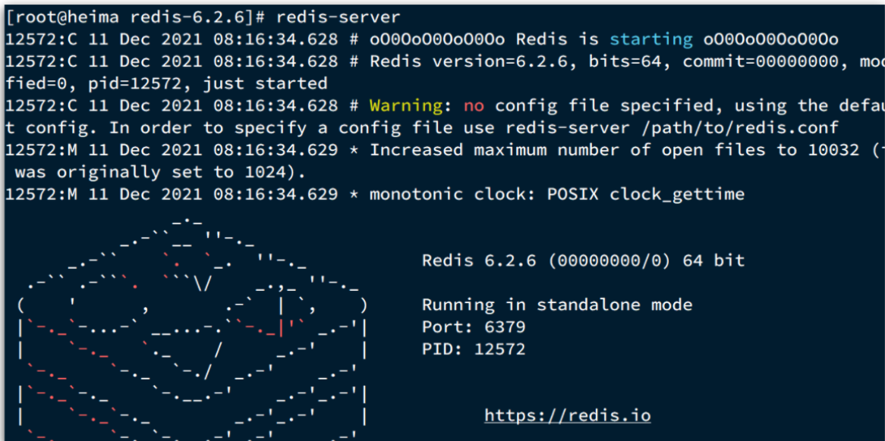

---


## 前言

大多数企业都是基于Linux服务器来部署项目，而且Redis官方也没有提供Windows版本的安装包。

针对windows版本的Redis，一般是绿色软件：直接是一个压缩包，解压缩后就可以运行

本文基于Linux系统来安装Redis，选择的Linux版本为CentOS-7


## 安装

**1、Redis压缩包下载**

下载地址：[https://redis.io/download/](https://redis.io/download/)

下载结果：redis-x.x.x.tar.gz

**2、Linux中安装Redis需要的gcc依赖（c语言有关的）**

```sh
yum install -y gcc tcl
```

**3、解压缩安装包，并安装编译，需要root权限**

```sh
## 压缩包上传到自己指定目录，例如：/usr/local/src

## 解压缩
tar -xzf redis-6.2.6.tar.gz

## 进入解压缩后的目录
cd redis-6.6.6

## 运行编译命令，如果没出错，就是安装成功了
make && make install
```

默认的安装路径是在`/usr/local/bin`目录下，这个目录默认配置到环境变量，可以在任意目录运行有关命令

- `redis-cli`：是redis提供的命令行客户端
- `redis-server`：是redis的服务端启动脚本
- `redis-sentinel`：是redis的哨兵启动脚本


## 启动

### 默认启动方式

```sh
redis-server
```



属于前台启动，会阻塞整个窗口

`关闭窗口`或`ctrl+c`可以停止redis


### 以配置文件方式启动

**1、备份并修改配置文件**

```sh
## 配置文件位置：/usr/loacl/src/redis-6.2.6/redis.conf

## 进入该目录，并备份该配置文件
cp redis.conf redis.conf.bck

## 进入配置文件，并修改有关配置
vim redis.conf

###### 进行如下设置 ######
## 允许监听的地址，默认是127.0.0.1，会导致只能在本地访问。修改为0.0.0.0则可以在任意IP访问，生产环境不要设置为0.0.0.0
bind 0.0.0.0
## 守护进程，修改为yes后即可后台运行
daemonize yes 
## 密码，设置后访问Redis必须输入密码
requirepass 123456

###### 其他可以修改的配置 ######
## 监听的端口
port 6379
## 工作目录，默认是当前目录，也就是运行redis-server时的命令，日志、持久化等文件会保存在这个目录
dir .
## 数据库数量，设置为1，代表只使用1个库，默认有16个库，编号0~15
databases 1
## 设置redis能够使用的最大内存
maxmemory 512mb
## 日志文件，默认为空，不记录日志，可以指定日志文件名
logfile "redis.log"
```

**2、启动redis**

```sh
## 修改保存后，在配置文件所在目录下，启动redis（该启动方式是后台启动）
redis-server redis.conf
```

**3、关闭redis**

```sh
## 停止redis
redis-cli -u 密码 shutdown
```


### 开机自启（自定义服务）【推荐】

将启动方式2：以配置文件方式启动 制作为服务，能够开机自启动

**1、新建系统服务文件，并添加内容**

```sh
## 新建文件
vi /etc/systemd/system/redis.service

## 添加如下内容
[Unit]
Description=redis-server
After=network.target

[Service]
Type=forking
ExecStart=/usr/local/bin/redis-server /usr/local/src/redis-6.2.6/redis.conf
PrivateTmp=true

[Install]
WantedBy=multi-user.target
```

- `/usr/local/bin/redis-server` ：redis的安装目录
- `/usr/local/src/redis-6.2.6/redis.conf` ：redis解压缩后，配置文件所在的目录

**2、重载系统服务**

```sh
systemctl daemon-reload
```

**3、操作redis**

```sh
## 启动
systemctl start redis
## 停止
systemctl stop redis
## 重启
systemctl restart redis
## 查看状态
systemctl status redis
## 设置redis开机自启动
systemctl enable redis
```


## Redis客户端使用

### 自带的命令行客户端

**使用方式**

```sh
redis-cli [options] [commonds]
```

**options**：可选项

- `-h 127.0.0.1`：指定要连接的redis节点的IP地址，默认是127.0.0.1
- `-p 6379`：指定要连接的redis节点的端口，默认是6379
- `-a 123321`：指定redis的访问密码 

**commonds**：Redis的操作命令，可选，例如：

- `ping`：与redis服务端做心跳测试，服务端正常会返回`pong`

**若不指定commond**：会进入`redis-cli`的交互控制台（类似python），持续进行命令输入-结果返回

```sh
[hmteen@localhost ~]$ redis-cli -h 127.0.0.1	# 连接
127.0.0.1:6379> ping
(error) NOAUTH Authentication required.			# 需要输入密码
127.0.0.1:6379> auth 123456						# 输入密码
OK
127.0.0.1:6379> ping							# 心跳测试
PONG
127.0.0.1:6379> 
```


### 第三方图形化桌面客户端

**下载地址**

原作者，仅免费提供源代码，需要自己编译：[https://github.com/uglide/RedisDesktopManager](https://github.com/uglide/RedisDesktopManager)

第三方作者，提供上述安装包：[https://github.com/lework/RedisDesktopManager-Windows/releases](https://github.com/lework/RedisDesktopManager-Windows/releases)

**连接方式**

按照流程，安装软件，键入ip地址-密码，连接即可

**注意事项**

可能会连接不上Redis。原因之一：Linux服务器防火墙没有开放有关端口，解决措施：

- 开放端口

```sh
## 放通6379/tcp端口
firewall-cmd --zone=public --permanent --add-port=6379/tcp
firewall-cmd --reload
```

- 关闭防火墙

```sh
## 直接关闭防火墙
systemctl stop firewalld.service
```
