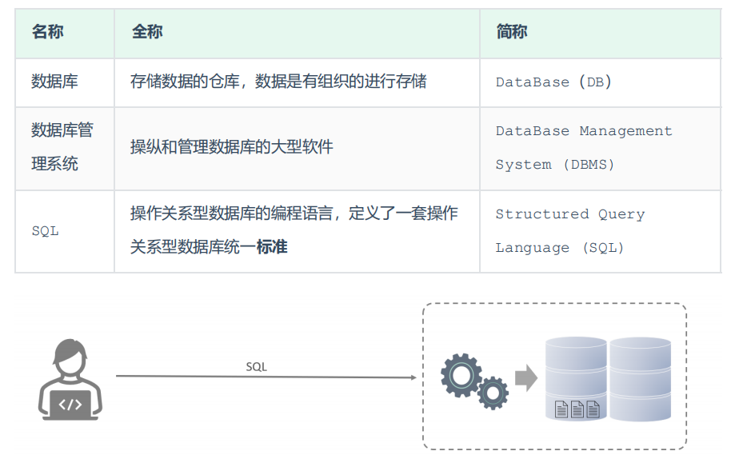
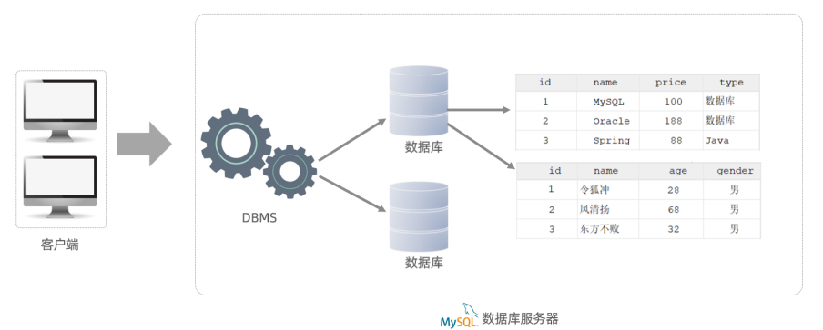
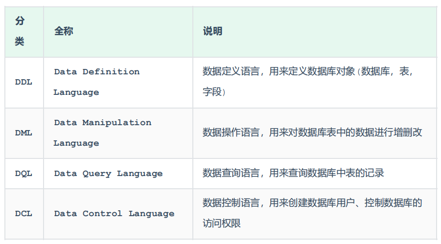
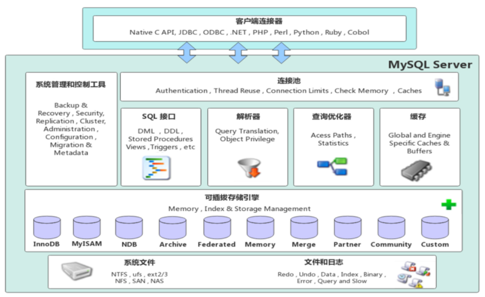
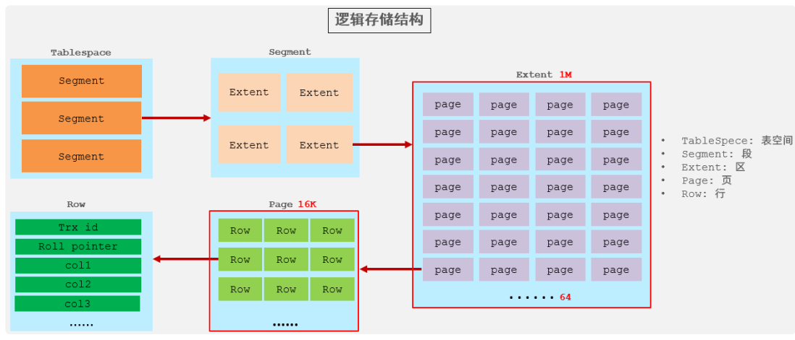

---

# MySQL基本概念

==【八股】MySQL在什么时候会产生临时表？==

- 执行创建临时表的命令：`Create Temporary Table`，这个临时表仅在当前数据库连接（Session）中存在，关闭连接，临时表就没了；
- 在执行复杂的查询或排序操作时，MySQL可能在内部自动创建临时表来存储中间结果，比如 `UNION`查询、`from`中的子查询；

---

==【八股】MySQL的五大范式？==

- 第一范式：
  - 概念：数据表中的每一列都是原子性的，不可再拆分
  - 反例：[“张伟，24岁，男”, 180]（第一列的数据应该拆分为三列）
- 第二范式：
  - 概念：数据表中的每一列都应该依赖于主键
  - 反例：["张伟",  180，"语文", 95] （语文和语文分数跟张伟不是依赖关系，这样设计会造成数据冗余）
- 第三范式：
  - 概念：数据表的每一列数据不能与主键之外的字段有关联
  - 反例：["张伟"，"计算机系"，“院长张xx”]（后两个字段，院长字段明显依赖于学生所在的系别，而不仅仅是依赖主键，因此这样设置也不合理）
- 巴斯-科德范式
  - 概念：细节忘了
- 第四范式：
  - 概念：细节忘了

参考文章：[https://zhuanlan.zhihu.com/p/568559424](https://zhuanlan.zhihu.com/p/568559424)

---

==【八股】什么是MySQL？==

MySQL是一个关系型数据库，采用表的形式来存储数据；

- 关系型数据库：建立在数据关系上，数据关系有：一对一、一对多、多对多
- 表形式存储数据：表有行列
  - 行：表示一行数据；
  - 列：表示一个数据中，每个数据值的类型。类型有三类：字符串类型、数值类型、日期时间类型。

【补充】与关系型数据库对应的是非关系型数据库。非关系型数据库主要针对：键值、文档、图形等类型的数据进行存储。

---

==【八股】数据库、数据库管理系统、数据库系统、数据库管理员？==

- 数据库（DataBase，DB）：我项目中的那些数据的集合
- 数据库管理系统（DataBaseManagementSystem，DBMS）：操作和管理数据库的大型软件。我在项目中用MySQL管理数据库
- 数据库管理员（DataBase Administrator）：负责管理和控制数据库。项目中就是我。
- 数据库系统（DataBase System）：通常包括：数据库、数据库管理系统、应用程序、数据库管理员、用户。报文数据 + MySQL + ICWP + 我 + 操作部/泊位部成员。

---



举例：

- 数据库：存储数据的仓库
- 数据库管理系统：MySQL、Oracle等
- SQL：操作数据库的语言

**客户、数据库管理系统、数据库三者关系图**



- 通过客户端【Navicat】连接数据库管理系统（DBMS）【MySQL】，再通过DBMS操作数据库
- 通过SQL语句实现上述操作【`select xx from tb_xx where id = xx`】
- 一个数据库服务器可以有多个数据库，一个数据库可以有多个表，一个表可以有多条记录

---

# MySQL的表字段类型

## 概念 | 表字段类型

==【八股】MySQL有哪些数据类型？==

- 数值类型
- 字符串类型
- 日期时间类型

### 数值类型

| 类型         | 大小（byte） | 有符号(SIGNED)范围                                    | 无符号(UNSIGNED)范围                                      | 描述               |
| ------------ | ------------ | ----------------------------------------------------- | --------------------------------------------------------- | ------------------ |
| TINYINT      | 1            | (-128，127)                                           | (0，255)                                                  | 小整数值           |
| SMALLINT     | 2            | (-32768，32767)                                       | (0，65535)                                                | 大整数值           |
| MEDIUMINT    | 3            | (-8388608，8388607)                                   | (0，16777215)                                             | 大整数值           |
| INT或INTEGER | 4            | (-2147483648，2147483647)                             | (0，4294967295)                                           | 大整数值           |
| BIGINT       | 8            | (-2^63，2^63-1)                                       | (0，2^64-1)                                               | 极大整数值         |
| FLOAT        | 4            | (-3.402823466 E+38，3.402823466351 E+38)              | 0 和 (1.175494351 E-38，3.402823466 E+38)                 | 单精度浮点数值     |
| DOUBLE       | 8            | (-1.7976931348623157 E+308，1.7976931348623157 E+308) | 0 和 (2.2250738585072014 E-308，1.7976931348623157 E+308) | 双精度浮点数值     |
| DECIMAL      |              | 依赖于M(精度)和D(标度)的值                            | 依赖于M(精度)和D(标度)的值                                | 小数值(精确定点数) |

### 字符串类型

| 类型       | 大小（byte）    | 描述                         |
| ---------- | --------------- | ---------------------------- |
| CHAR       | 0-255           | 定长字符串                   |
| VARCHAR    | 0-65535         | 变长字符串                   |
| TINYBLOB   | 0-255           | 不超过255个字符的二进制数据  |
| TINYTEXT   | 0-255           | 短文本字符串                 |
| BLOB       | 0-65 535        | 二进制形式的长文本数据       |
| TEXT       | 0-65 535        | 长文本数据                   |
| MEDIUMBLOB | 0-16 777 215    | 二进制形式的中等长度文本数据 |
| MEDIUMTEXT | 0-16 777 215    | 中等长度文本数据             |
| LONGBLOB   | 0-4 294 967 295 | 二进制形式的极大文本数据     |
| LONGTEXT   | 0-4 294 967 295 | 极大文本数据                 |

### 日期事件类型

| 类型      | 大小 | 范围                                       | 格式                | 描述                     |
| --------- | ---- | ------------------------------------------ | ------------------- | ------------------------ |
| DATE      | 3    | 1000-01-01 至 9999-12-31                   | YYYY-MM-DD          | 日期值                   |
| TIME      | 3    | -838:59:59 至 838:59:59                    | HH:MM:SS            | 时间值或持续时间         |
| YEAR      | 1    | 1901 至 2155                               | YYYY                | 年份值                   |
| DATETIME  | 8    | 1000-01-01 00:00:00 至 9999-12-31 23:59:59 | YYYY-MM-DD HH:MM:SS | 混合日期和时间值         |
| TIMESTAMP | 4    | 1970-01-01 00:00:01 至 2038-01-19 03:14:07 | YYYY-MM-DD HH:MM:SS | 混合日期和时间值，时间戳 |

**举例使用**

```sql
# 举例
create table emp(
	id int comment '编号',
	workno varchar(10) comment '工号',
	name varchar(10) comment '姓名',
	gender char(1) comment '性别',
	age tinyint unsigned comment '年龄',
	idcard char(18) comment '身份证号',
	entrydate date comment '入职时间'
) comment '员工表';
```

==【八股】整数类型的UNSIGNED属性有什么用？==

MySQL的整数类型可以用UNSIGNED属性来表示非负整数，可以将正整数的上限提高一倍。

对于从0开始增长的ID来说，最适合加入该属性，可以将该类型可以表示的正整数数量上限提高一倍。

---

==【八股】MySQL字符类型的CHAR和VARCHAR有什么区别？==

两者都是字符串类型，但CHAR是定长的，VARCHAR是变长的。

- CHAR：在存储字符时，在末尾补充空格以达到固定长度；检索时去掉。
- VARCHAR：在存储字符时，需要额外字节记录字符的长度；检索时不需要处理。

CHAR适合用于字符长度较短或长度都差不多的字段，比如：身份证号、md5加密后的密码等。

VARCHAR适合用于字符串长度较长或长度变化较大的字段，比如：文章内容，昵称。

---

==【八股】MySQL中存储货币类型数据用什么字段类型？==

用Decimal数据类型：

- 指定精度：能够指定小数点前和小数点后的数字位数，符合货币定义的精度要求
- 计算准确性：Decimal类型满足常见的数值计算，加法、乘法、除法等

## 示例 | 表字段处理函数

参考文章：[基础-1-表字段处理函数](/ToBeABD/Database/MySQL/t72bete7/)

# SQL语言

==【八股】什么是SQL？==

SQL（Structured Query Language）：结构化的查询语言，专门用来和数据库打交道。是操作关系型数据库的编程语言，定义了一套操作关系型数据库**统一标准**

---

==【八股】MySQL中SQL语言的特点==

- SQL语句可以单行或多行书写，以分号表示1行SQL的结束
- SQL语句可以使用空格/缩进来增强语句的可读性，缩进不严格
- MySQL数据库的SQL语句不区分大小写，关键字建议使用大写
- 注释方式：

```mysql
-- 单行注释
# 单行注释

/* 
	多行
	注释
*/
```

## SQL语言 | 分类

==【八股】SQL语言有几种分类？各自有什么作用？==



## SQL语言 | 示例

参考文章：[基础-2-DDL-DML-DCL](/ToBeABD/Database/MySQL/q5tqd62g/)、[基础-3-DQL](/ToBeABD/Database/MySQL/ovzo2rra/)

---

==【八股】MySQL怎么实现分页的？深度分页为什么速度慢？怎么优化深度分页速度慢的问题？==

分页实现：MySQL通过Limit关键字实现分页操作。

```sql
-- 示例SQL语句
select id, name, balance from account where update_time> '2020-09-19' limit 1000000,10;
```

分析示例SQL的查询流程：

- 根据普通二级索引update_time，过滤条件，找到满足条件的ID
- 通过满足条件的ID，根据主键索引，找到满足条件的行，展示对应的列（回表操作）
- 扫描满足条件的1000000 + 10行数据，然后扔掉前1000000 行，返回最后10行数据

深度分页查询慢的原因：

- 回表操作多：有二级索引的使用；
- 查询大量的无用数据：将前1000000行数据也查询出来返回，然后再筛选去除；大量的无用数据查询也直接的增加了回表操作；

深度分页查询的优化思路：

- 子查询 + 主键索引
  - 减少回表操作：二级索引update_time仍然使用了，但是不需要回表，只用查询id即可；
  - 主键索引范围查询：通过主键索引，使用范围查询，仅获取满足条件的10条数据即可。

```sql
select id, name, balance FROM account where id >= (select a.id from account a where a.update_time >= '2020-09-19' limit 1000000 , 1) LIMIT 10
```

- 使用Elastic Search搜索引擎优化（基于倒排索引）

---

==【八股】MySQL完整性约束主要有哪些？==

实体完整性：规定了表中每一行是实体的完整性

- 主键约束：`Primary Key`
- 唯一约束：`Unique`
- 自动增长约束：`Auto_Increment`

域完整性：指表中的列必须满足某种特定的数据类型约束

- 非空约束：`Not Null`
- 默认值约束：`Default`

参照完整性：两个表的主关键字和外关键字的数据应该一致，保证表间数据的一致性

- 外键约束：`Foreign Key`

用户自定义完整性：用户自己对表中某些列加以条件限制

- 自定义约束：`Check`

---

==【八股】MySQL外连接、内连接、自连接的区别？==

首先介绍内连接：

- 返回两个表中满足连接条件的行，拼接在一起返回，结果集中的每一行数据既包含【左表】的所有字段，也包含【右表】的所有字段；

然后介绍外连接：

- 左外连接：返回【左表】的所有行。对于满足连接条件的行，将【右表】的对应行内容拼接过来； 对于不满足连接条件的行，将【右表】对应的字段拼接过来，字段值设置为null。
- 右外连接：返回【右表】的所有行。对于满足连接条件的行，将【左表】的对应行内容拼接过来； 对于不满足连接条件的行，将【左表】对应的字段拼接过来，字段值设置为null。

最后介绍自连接：

- 自连接是两个一样的表做连接查询，自连接可以做内连接查询，也可以做外连接查询；

---

==【八股】MySQL中%和_的区别？==

这两个是MySQL中的通配符，用来进行模糊查询。

- `%`：表示匹配0个、1个或多个任意字符，用在 `Like`句子里面
- `_`：表示匹配1个任意字符，也是用在 `Like`句子里面

---

==【八股】count(1)、count(*)、count(列名)的区别？==

- `count(1)`：将数据库中每一行数据替换为1，然后统计行数，不考虑列的值是否为Null；
- `count(*)`：统计数据表中的数据行数，不考虑列的值是否为Null；
- `count(列)`：统计数据表中特定列的行数，该列的值如果为Null，会被忽略，不参与行数统计。

---

# MySQL事务

## 基本概念

==【八股】什么是事务？==

事务是一组操作的结合，他是一个不可分割的工作单位，事务会把所有的操作作为一个整体一起向系统提交或撤销操作请求，即这些操作要么都成功，要么都失败

MySQL事务对于保持数据的完整性和一致性有非常重要的作用。

---

==【八股】什么情景下会用到事务？==

对数据的完整性和一致性要求较高的情景会需要用到事务，比如：银行转账、订单管理、航空系统售票等场景，写场景居多；

一些读场景也会用到事务：

- 要读取某个时间点之前的数据，其之后完成的数据更新操作，不能影响读取结果，就可以开启事务，保证数据视图的一致性，并在可重复读事务隔离级别下实现；
- 复杂查询下可能要联合查询多张表，为了避免在查询过程中，所涉及的数据不会被其他事务修改，也可以使用事务。

---

==【八股】MySQL中的事务分为几种？==

MySQL事务有两种：隐式事务、显式事务

MySQL默认是隐式事务，即：执行insert、update、delete操作的时候，数据库自动开启、提交或回滚事务

---

改变默认的事务方式：设置autocommit的值

```sql
# 显示变量
show variables like 'autocommit';

# 关闭隐式事务
set autocommit=0;

# 开启隐式事务
set autocommit=1;
```

---

==【八股】讲一讲事务的四大特性？==

**原子性（Atomicity）**

- 事务是不可分割的最小操作单元，要么全部成功，要么全部失败

**一致性（Consistency）**

- 事务完成时，必须使所有的数据都保持一致状态。这个一致是语义上的一致，而不是语法上的一致。

```
语义的一致：

比如：A转账100给B，A的账户钱少100，B的账户钱多100。
在转账这个事务开启前，两者的账户余额正确，数据保持一致性;
转账后，两者的账户状态语义上也正确，即：转账的人账户金额-100；收款的人账户金额+100。
```

**隔离性（Isolation）**

- 数据库系统提供的隔离机制，保证事务在不受外部并发操作影响的独立环境下运行。即并发状态下，各个事务之间相互不干扰。

**持久性（Durability）**

- 事务一旦提交或回滚，它对数据库中的数据的改变就是永久的。

```
永久是指不可回退。

虽然可以通过其他手段恢复数据库的数据，例如：执行相反操作的事务；数据库备份或恢复手段。
但这些都不是通过事务的回滚或提交完成的，因此说事务具有持久性，提交了就不可修改。
```

事务的四个特性中：A、I、D是手段，C是目的。

- A-原子性：通过undo log实现
- I-隔离性：事务隔离机制 + 锁 + MVCC
- D-持久性：redo log + bin log实现
- C-一致性：A、I、D实现了，C就实现了

---

**概念 | savepoint关键字**

我们在进行事务操作的时候出现错误，不想回滚所有操作，只想回滚最后某部分操作，就可以借助该关键字。

具体示例看下边：【事务示例：账户转账】

## 事务示例：账户转账

参考文章：[基础-4-savepoint关键字](/ToBeABD/Database/MySQL/yigva20d/)

## 并发事务存在的问题

==【八股】并发事务存在哪些问题？==

并发事务通常会存在两大类问题：数据读问题和数据更新问题。

**数据读问题**，是读-写事务组合过程中产生的问题，有三类：

- 脏读（Dirty-Read）：一个事务读到另外一个事务还没有提交的数据后，数据被另一个事务回滚，导致读到的数据无效。
- 不可重复读（Unrepeatable Read）：一个事务前后两次读取同一个数据，结果不一致；原因是另一个事务完成了对该数据的**修改**事务提交。
- 幻读（Phantom read）：与不可重复读类似，只是侧重点不同。
  - 不可重复读是说对一个数据读取的值前后不一；
  - 幻读是说对一个数据集的查询，前后行数不一样，像是凭空多了或少了几行数据；
  - 幻读主要是因为其他事务完成了对该数据集的**增/删**事务提交。

**数据更新问题**，是写-写事务组合过程中产生的问题，主要就是：

- 两个事务A、B，都对同一个数据有所修改；事务B已经提交，事务A的回滚操作或提交操作均会影响事务B的修改结果。这就是数据更新问题。

---

==【八股】幻读和不可重复读的区别是什么？==

两者类似，但是侧重点不同：

- 不可重复读：侧重点在更新操作上，两次DQL查询的同一个数据的值不一样
- 幻读：侧重点在增/删操作上，两次DQL查询的数据行数不一致

幻读可以看作是不可重复读的特殊情况，将他们分开表示是因为数据库中解决这两类情况的方案不一样。

==【八股】幻读和不可重复读的解决方案有什么区别？==

不可重复读：MySQL在RR隔离级别及以下可解决不可重复读

- 在快照读的情况下：通过MVCC来实现，没有加锁
- 在当前读的情况下：通过行锁来实现

幻读：MySQL在Serializable隔离级别下能完全解决幻读问题；在RR隔离级别下，可解决大部分幻读问题。

- 在快照读的情况下：通过MVCC解决，没有加锁
- 在当前读的情况下：通过加临键锁来解决

---

==【八股】并发事务的控制方式有哪些？==

锁、MVCC

## 事务隔离机制

==【八股】事务隔离是干什么的？==

事务隔离用来解决并发事务问题。

---

==【八股】MySQL的事务隔离级别有哪些？默认隔离级别是什么？==

MySQL的事务隔离级别有四种：

| 隔离级别                                       | 是否会产生脏读 | 是否会产生不可重复读 | 是否会产生幻读 |
| ---------------------------------------------- | -------------- | -------------------- | -------------- |
| READ UNCOMMITTED，读未提交                     | √             | √                   | √             |
| READ COMMITTED，读已提交                       | ×             | √                   | √             |
| REPEATABLE READ（MySQL默认隔离级别），可重复读 | ×             | ×                   | √             |
| SERIALIZABLE，串行化读                         | ×             | ×                   | ×             |

隔离级别从上到下，越来越高。隔离级别越高，数据越安全，性能越低。

MySQL的默认隔离级别是：RR，可重复读。

---

==【八股】MySQL的事务隔离级别是基于什么实现的？==

MySQL的事务隔离级别是基于锁+MVCC来实现的。

**MySQL事务隔离级别设置**

```sql
# 查看事务隔离级别
SELECT @@TRANSACTION_ISOLATION;

# 设置事务级别
SET [ SESSION | GLOBAL ] TRANSACTION ISOLATION LEVEL { READ UNCOMMITTED | READ COMMITTED | REPEATABLE READ | SERIALIZABLE }
```

- `SESSION`：表示修改仅对本次会话的配置有效
- `GLOBAL`：表示修改全局有效

# MySQL架构

## 概念 | 整体-体系结构

整体体系结构如下图所示（用于全面认知）：



主要分为四大块：**连接层、服务层、引擎层、存储层**

---

**连接层**

主要是和每个访问的客户端建立连接。大致包括：连接处理、授权认证、及相关的安全方案。

主要连接方式类似：TCP/IP、基于SSL的安全连接

**服务层**

核心模块，大多数核心服务功能（如：SQL接口、缓存查询、SQL分析和优化）和所有的跨存储引擎功能（如：过程、函数）都在这一层实现。

**引擎层**

在这一层，实现了MySQL中数据的存储和提取。服务器通过API和存储引擎通信。

**存储层**

主要用于存储数据（比如：redolog、undolog、数据、索引、其他日志）到文件系统上，并完成与存储引擎的交互。

---

==【八股】简要讲一下MySQL的架构？==

MySQL简要架构图如下：


主要分为两部分：服务层（Service）和存储引擎。

对于服务层：所有跨存储引擎的操作都在该层实现。主要包含：

- 连接器：在登录MySQL的时候进行身份认证和权限校验
- 查询缓存：执行查询语句的时候，会先看缓存中是否有
- 分析器：没有命中缓存后，SQL语句会进入分析器：一方面分析SQL语句要干什么，另一方面分析语法是否正确
- 优化器：MySQL会按照自己认为最优的方案执行SQL语句
- 执行器：执行SQL语句，然后从存储引擎中返回结果（执行前会进行权限校验）

对于存储引擎：主要负责数据的存储和读取。服务层是通过API与存储引擎通信。

---

==【八股】为什么在执行器执行语句的时候，还要再进行一次权限验证？==

连接器的权限验证，主要是验证：用户是否合规。但是有的用户没有特定表格的执行权限。

在执行器的时候，主要验证：当前用户是否有该SQL语句涉及的表的执行权限。

## 概念 | 部分-存储引擎

==【八股】什么是存储引擎？==

概念：存储引擎就是存储数据、建立索引、更新/查询数据等技术的实现方式。

重要性：存储引擎是MySQL的核心。在合适的场合要选择合适的存储引擎。

==【八股】MySQL的存储引擎是基于库的还是基于表的？==

MySQL的存储引擎是基于表的，也叫表引擎，不用的表可以设置不同的引擎

---

**使用存储引擎：建表**

```sql
# 建表时候指定存储引擎：默认是InnoDB
CREATE TABLE 表名(
	字段1 字段1类型 [ COMMENT 字段1注释 ] ,
	......
	字段n 字段n类型 [COMMENT 字段n注释 ]
) ENGINE = INNODB  [ COMMENT 表注释 ] ;

# 查看数据库支持的存储引擎
SHOW engines;

# 查看某个数据表的建表语句
show create table account;
```

---

==【八股】MySQL支持哪些存储引擎？默认引擎是什么？==

通过命令：`show engines;`可以查看支持哪些引擎。

常见的一些引擎有：InnoDB、MyISAM、Memory。

MySQL默认的存储引擎是InnoDB。

---

==【八股】MySQL引擎的架构了解嘛？==

MySQL存储引擎采用插件式的架构，支持多种存储引擎；而且MySQL存储引擎是基于表级别的。

---

==【八股】InnoDB和MyISAM两个存储引擎的区别？==

MySQL5.5之前，默认的存储引擎是MyISAM；之后，默认的存储引擎是InnoDB。

两者的区别可以从以下几个方面体现（InnoDB/MyISAM）：

- 是否支持事务：支持/不支持
- 锁机制的最小支持粒度：行级/表级
- 是否支持外键：支持/不支持

---

==【八股】存储引擎的选择？==

一把梭InnoDB（不是）。大部分情况下默认InnoDB即可，不同的引擎有不同的侧重点

InnoDB：对事务完整性要求较高；数据操作涵盖插入、查询、更新、删除

MyISAM：对事务完整性要求不高；数据操作以插入和读为主

MEMORY：临时表或缓存（无法缓存太大的表）

---

==【八股】常见三种存储引擎的各自特点及区别：==

|                 | InnoDB                                                                    | MyISAM                                                | Memory                      |
| --------------- | ------------------------------------------------------------------------- | ----------------------------------------------------- | --------------------------- |
| 数据存储文件类  | 元数据：xxx.sdi（最新格式）；xxx.frm（早期格式）<br />数据和索引：xxx.ibd | 元数据：xxx.sdi<br />数据：xxx.MYD<br />索引：xxx.MYI | 元数据：xxx.sdi             |
| 事务            | 支持                                                                      | -                                                     | -                           |
| 锁机制          | 行级                                                                      | 表级                                                  | 表级                        |
| 外键            | 支持                                                                      | -                                                     | -                           |
| 索引\| B+tree   | 支持                                                                      | 支持                                                  | 支持                        |
| 索引\| Hash     | -                                                                         | -                                                     | 支持                        |
| 索引\| 全文索引 | 支持（5.6版本之后）                                                       | 支持                                                  | -                           |
| 空间使用        | 高                                                                        | 低                                                    | N/A（内存型引擎，不占空间） |
| 内存使用        | 高                                                                        | 低                                                    | 中                          |
| 批量插入速度    | 低                                                                        | 高                                                    | 高                          |

【补充】

- 表格的元数据：即表结构的定义，比如表的列名、数据类型、索引等信息。这些信息在MySQL中被称为表的元数据（metadata）
- `sdi`：`Serialized Dictionary Information`
- `frm`：`format`
- `ibd`：`InnoDB Data File`
- `MYD`：`MyISAM Data`
- `MYI`：`MyISAM Index`

## 存储引擎介绍 | InnoDB引擎

### 概念 | 逻辑存储架构



**组成 | 表空间**

表空间是InnoDB存储引擎逻辑结构的最高层。用于存储记录、索引等数据。

若启用参数 `innodb_file_per_table`，则每张表都会有一个表空间（xxx.ibd）

---

**组成 | 段**

段有多个分类：数据段、索引段、回滚段。

InnoDB是索引组织表：数据段就是索引（B+树）的叶子结点；索引段就是索引（B+树）的非叶子结点。

段是用来管理区的。

---

**组成 | 区**

区，表空间的单元结构，每个区的大小为1M

---

**组成 | 页**

**页是InnoDB引擎磁盘管理的最小单元**，每个页的默认大小是16K。即一个区中一共有64个连续的页

为了保证页的连续行，InnoDB存储引擎每次从磁盘中申请4-5个区。

---

**组成 | 行**

行，InnoDB引擎中数据就是按行存放的。

每一行除了包含一张表的所有字段外，**还一定包含两个隐藏字段**：

- `Trx_id`  每次对数据进行修改，都算作一次事务。该字段存储每次对该行数据进行修改时，对应事务的id
- `Roll_pointer`  每次对数据进行修改，都会把旧的版本（修改前数据）写入undo日志。这个列存储的内容就相当于一个指针，指向undo日志中对应旧的版本

**当**对应的表没有主键时，其数据对应的行**还有另外一个隐藏字段**：`ROW_id`，作为表的隐藏主键。

### 概念 | 物理架构

包括内存架构 + 磁盘架构。

先跳过，有点难。

# MySQL进阶

> 接下来的几个概念，都是MySQL进阶部分的，但是又不是面试高频点，就放到这里讲述

## SQL语句优化

参考文章：[基础-5-SQL语句优化](/ToBeABD/Database/MySQL/88fjlori/)

SQL语句的优化过程也是尽可能的利用索引。

## 视图、存储过程、触发器

参考文章：[基础-6-视图、存储过程、触发器](/ToBeABD/Database/MySQL/9xoh6hi3/)

这三个概念的介绍及其作用，总结如下：

**视图**

- 概念：视图（View）是一种虚拟存在的表。定义的视图只包含查询的存储逻辑，不保存查询的结果集，所以创建视图的时候，重心落在SQL查询语句的创建上
- 特点：
  - 简化操作，复杂查询语句可以写为视图，方便后续再次使用或基于该查询结果使用
  - 安全：将数据库授权给别人，可以通过视图限制某些行、列的访问权限

**存储过程**

- 概念：事先编译好并存储在数据库中的一段SQL语句集合，即SQL代码的封装和重用
- 特点：
  - 可以简化网络传输
  - 可以封装复用SQL代码

**触发器**

- 概念：触发器是与表有关的数据库对象，指在insert/update/delete之前(BEFORE)或之后(AFTER)，触发并执行触发器中定义的SQL语句集合
- 特点：
  - 可以协助应用在数据库端完成日志记录、数据校验、保证数据的完整性
  - 触发器只支持行级触发，还不支持语句触发

## MySQL管理

### 概念 | 系统数据库

MySQL数据库安装后，自带四个数据库，主要有如下用途：


### 工具 | 常用命令行

在CMD命令行，可以使用如下工具：

| 工具                   | 用途                                                                                       |
| ---------------------- | ------------------------------------------------------------------------------------------ |
| `mysql`              | 登录连接数据库，命令行执行SQL语句（不进入MySQL交互端）                                     |
| `mysqladmin`         | 检查服务器的配置和当前状态，创建并删除数据库                                               |
| `mysqlbinlog`        | 服务器生成的二进制日志文件以二进制格式保存，如果想要检查这些文本的文本格式，就会使用该工具 |
| `mysqlshow`          | 可以很快的查找存在哪些数据库、数据库中有哪些表、表中的列或索引                             |
| `mysqldump`          | 备份数据                                                                                   |
| `mysqlimport/source` | 导入数据的工具，配合 `mysqldump`实现                                                     |
