---


# 前言

本文主要讲述MySQL中常见的锁。

# 总结 | 各类别锁的名字

| 锁级别                                   | 锁名字                                                                                                           | 解释             |
| ---------------------------------------- | ---------------------------------------------------------------------------------------------------------------- | ---------------- |
| 全局锁                                   | `read lock`                                                                                                    | 全局锁只有可读锁 |
|                                          |                                                                                                                  |                  |
| 表级锁 - 表锁                            | `read lock`  表共享读锁<br />`write lock`  表独占写锁                                                        |                  |
| 表级锁 - 元数据锁（meta data lock，MDL） | `SHARED_READ_ONLY`<br />`SHARED_NO_READ_WRITE`<br />`SHARED_READ`<br />`SHARED_WRITE`<br />`EXCLUSIVE` |                  |
| 表级锁 - 意向锁                          | `IS`  意向共享锁<br />`IX`  意向排他锁                                                                       |                  |
|                                          |                                                                                                                  |                  |
| 行级锁 - 行锁（Record Lock）             | `S`  共享锁<br />`X`  排他锁                                                                                 |                  |
| 行级锁 - 间隙锁（Gap Lock）              | `Gap Lock`                                                                                                     |                  |
| 行级锁 - 临键锁（Next-Key Lock）         | `Next-Key Lock`                                                                                                |                  |

# 全局锁

## 概念 | 什么是全局锁？

**什么是全局锁？**

全局锁就是对整个数据库实例加锁，加锁后整个数据库实例就处于只读状态，后续的DML的写语句，DDL语句，已经更新操作的事务提交语句都将被阻塞。

**全局锁应用场景？**

全数据库的数据备份。在这个场景下，需要对数据库整体加锁，然后进行数据备份。

如果不加锁进行数据备份，会使数据一致性得不到保证。

## 应用 | 全局锁存在的问题及解决？

**全局锁语法**

```sql
# 加全局锁
flush tables with read lock;

# 进行相关操作

# 释放全局锁-1：SQL语句
unlock tables;

# 释放全局锁-2：关闭当前会话窗口
```

**全局锁应用存在的问题**

加了全局锁，整个数据库处于只读状态：业务正常的进展就会停滞。

**如何解决该问题？**

如果数据库的存储引擎支持**可重复读的隔离级别**，就能解决。原理是：

- 在备份数据库之前先开启事务，会先创建 Read View，然后整个事务执行期间都在用这个Read View，而且由于 MVCC 的支持，备份期间业务依然可以对数据进行更新操作。
- 因为在可重复读的隔离级别下，即使其他事务更新了表的数据，也不会影响备份数据库时的 Read View，这就是事务四大特性中的隔离性，这样备份期间备份的数据一直是在开启事务时的数据。

**`mysqldump`工具进行数据库备份**：

针对数据库全库备份这个情况，如果使用的备份数据库工具是 mysqldump，按如下用法即可：

```sql
mysqldump --single-transaction -uroot –p123456 itcast > itcast.sql
```

加上 `–single-transaction` 参数的时候，就会在备份数据库之前先开启事务。这种方法只适用于支持「可重复读隔离级别的事务」的存储引擎。

InnoDB 存储引擎默认的事务隔离级别正是可重复读，因此可以采用这种方式来备份数据库。但是对于 MyISAM 这种不支持事务的引擎，在备份数据库时就要使用全局锁的方法。

# 表级锁

## 概念 | 什么是表级锁

表级锁就是每次操作锁住整张表。锁定粒度较大，容易发生锁冲突，并发性能较低。在MyISAM、InnoDB、BDB引擎中都有应用。

对于表级锁，主要有三类：表锁、元数据锁、意向锁

## 应用 | 表锁

表锁主要有两类：

- 表共享读锁：`read lock`
- 表独占写锁：`write lock`

应用语法：

```sql
# 加锁
lock tables 表名 read;	# 表共享读锁
lock tables 表名 write;	# 表独占写锁

# 释放锁-1：SQL语句
unlock tables;

# 释放锁-2：关闭当前会话窗口
```

表锁的特点：

| 锁                         | 特点                                            |
| -------------------------- | ----------------------------------------------- |
| 表共享读锁：`read lock`  | 事务A上锁。不影响事务B的读操作，但影响B的写操作 |
| 表独占写锁：`write lock` | 事务A上锁。既影响事务B的读操作，也影响B的写操作 |

## 应用 | 元数据锁

元数据锁，`meta data lock`，简称：MDL。元数据锁是表级锁，是对一张表加的锁。元数据锁加锁的过程是**系统自动控制**，无需显示调用。

---

元数据锁的**作用**主要是维护一张表元数据的一致性，在表上有事务的时候，不能对元数据进行写入操作。

理解一下上面这段话涉及到的概念：

- 元数据：指一张表的表结构
- 不能对元数据进行写入操作：就是说不能更改表的表机构，即DDL操作失效。

---

**在一些常见的SQL语句中，系统自动加入的是不同的元数据锁**，主要有如下几类：

| SQL                                                                                                                                                                                         | 元数据锁的类型       | 说明                                                                                 |
| ------------------------------------------------------------------------------------------------------------------------------------------------------------------------------------------- | -------------------- | ------------------------------------------------------------------------------------ |
| `lock tables xxx read`  加表锁-表共享读锁                                                                                                                                                 | SHARED_READ_ONLY     | 可以叫：MDL读锁（共享），特点可以参照表共享读锁                                      |
| `lock tables xxx write`  加表锁-表独占写锁                                                                                                                                                | SHARED_NO_READ_WRITE | 可以叫：MDL写锁（排他），特点可以参照表独占写锁                                      |
| `SELECT ...`  常规查询语句，不加锁<br />`SELECT ... lock in share mode`  加行锁-共享锁                                                                                                  | SHARED_READ          | 与这两个元数据锁兼容：SHARED_READ、SHARED_WRITE<br />与这一个元数据锁互斥：EXCLUSIVE |
| `INSERT ...`  常规插入语句，加行锁-排他锁<br />`UPDATE ...`  常规更新语句，加行锁-排他锁<br />`DELETE ...`  常规删除语句，加行锁-排他锁<br />`SELECT ... FOR UPDATE`  加行锁-排他锁 | SHARED_WRITE         | 与这两个元数据锁兼容：SHARED_READ、SHARED_WRITE<br />与这一个元数据锁互斥：EXCLUSIVE |
| `ALTER TABLE ...`                                                                                                                                                                         | EXCLUSIVE            | 与其他任意的元数据锁都互斥                                                           |

- 兼容：即两个用户访问同一张表，一个是上锁A，一个是上锁B。锁A和锁B兼容，A、B两用户的请求就不会相互阻塞
- 互斥：解释同上，但是A、B两用户的请求会相互阻塞

## 应用 | 意向锁

**意向锁是作用是**为了避免在进行SQL-DML操作的时候，加的行锁与表锁产生冲突。**意向锁也是系统控制的**。

在InnoDB中加入意向锁，使得表锁在上锁的时候不用检查每行数据是否加行锁，从而减少了表锁的检查操作。

- 若没有意向锁：A对某一行加了行锁，B需要对该表加表锁，就需要判断每一行数据是否有锁，效率较慢。
- 若是有了意向锁：A对某一行加了行锁，同时对该表加上意向锁，B锁需要对该表加表锁，通过是否有意向锁，就可以知道能否成功加锁，而不用遍历每一行数据

---

**意向锁主要有如下两类：**

| SQL                                                                                                                                                                                         | 意向锁的类型     | 说明                                             |
| ------------------------------------------------------------------------------------------------------------------------------------------------------------------------------------------- | ---------------- | ------------------------------------------------ |
| `SELECT ... lock in share mode`  加行锁-共享锁                                                                                                                                            | 意向共享锁（IS） | 兼容：表锁-表锁共享锁<br />互斥：表锁-表锁排他锁 |
| `INSERT ...`  常规插入语句，加行锁-排他锁<br />`UPDATE ...`  常规更新语句，加行锁-排他锁<br />`DELETE ...`  常规删除语句，加行锁-排他锁<br />`SELECT ... FOR UPDATE`  加行锁-排他锁 | 意向排他锁（IX） | 互斥：表锁-表锁共享锁、表锁-表锁排他锁           |

---

**意向锁的主要特点有：**

- 一旦事务完成提交：意向共享锁、意向排他锁，都会自动释放
- 意向锁之间不会互斥：即该表可以同时存在：意向共享锁、意向排他锁，这个时候，两个表锁类型的任意一个都不能成功上锁
- 意向锁同元数据锁一样，不是主动加的，而是SQL操作后，系统会对应加上相应的意向锁。

## 总结 | 表锁、元数据锁、意向锁

三种表级锁，关键的是表锁。另外两个表级锁：元数据锁、意向锁，都是随着SQL语句的执行，自动添加的对应锁。

# 行级锁

## 概念 | 什么行级锁？

行级锁，每次操作锁住对应的行数据。锁定粒度最小，发生锁冲突的概率最低，并发度最高。应用在InnoDB存储引擎中。

InnoDB引擎是基于索引组织的，**行锁也是通过索引上锁的，而不是通过记录上锁**，行级锁主要有如下三类：行锁、间隙锁、临键锁。

---

**三种行级锁的图示：**

- 行锁（Record Lock）：锁住单个行记录的数据，可防止其他事务对该数据进行：UPDATE、DELETE操作

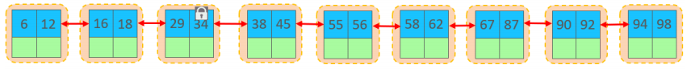

- 间隙锁（Gap Lock）：锁住索引记录间隙，不对行记录上锁，可防止其他事务对该数据进行：INSERT操作。用来防止幻读

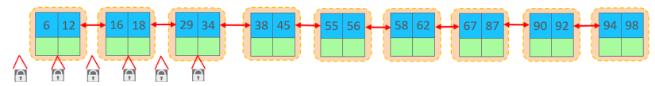

- 临键锁（Next-Key Lock）：**行锁和间隙锁的组合**，既锁住数据，又锁住间隙

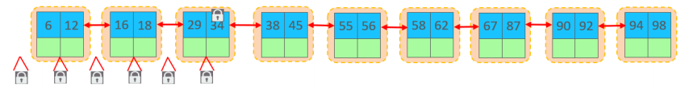

---

**行锁的分类**

行锁主要有两种类型：

- 共享锁（S）：允许其他事务对加了该锁的行记录进行读取，但不允许修改
- 排他锁（X）：不允许其他事务对加了该锁的行记录进行读取，也不允许修改

| 锁     | 解释                           |
| ------ | ------------------------------ |
| 共享锁 | 兼容：共享锁<br />排斥：排他锁 |
| 排他锁 | 排斥：共享锁、排他锁           |

---

**三种行级锁的排斥、共享情况：**

- 行锁：有共享锁和排他锁之间的排斥、兼容规则
- 间隙锁：不同间隙锁之间相互兼容。即使两个事务锁住同一个间隙，也是相互兼容的
- 临键锁：组成是间隙锁 + 行锁，行锁之间是有排斥规则的。当获取到一个X型的临键锁，有范围重叠的临键锁是会互斥的

## 概念 | 行锁&间隙锁&临键锁的使用规则

相关应用示例，参考文章：[小林Coding](https://xiaolincoding.com/mysql/lock/how_to_lock.html#%E5%94%AF%E4%B8%80%E7%B4%A2%E5%BC%95%E7%AD%89%E5%80%BC%E6%9F%A5%E8%AF%A2)。文章里面关于加锁顺序的判断还是很直观明确的，赞！

下文为文章内容总结：

> 默认情况下，InnoDB引擎在RR事务隔离级别下运行，使用临键锁进行搜索和索引扫描，来防止幻读。而在某些情况下，临键锁会优化或者说退化为间隙锁/行锁。
>
> **在RR事务隔离级别下**，相关加锁规则可以总结如下：

**原则1：查找过程中访问到的对象才会加锁**

**原则2：加锁的基本单位是临键锁，其区间是前开后闭：(前开，后闭]**

---

下面的优化原则，针对如下数据库记录进行验证：

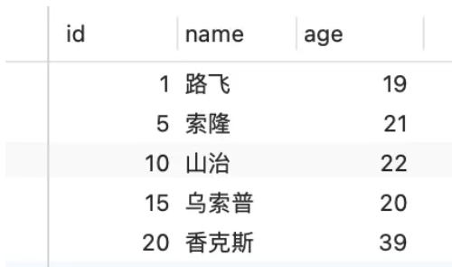

**优化：在（唯一）索引上进行等值查询，如果这条记录存在，则将临键锁退化为行锁。**

```sql
select * from user where id = 1 for update;
```


**优化：在（唯一）索引上进行等值查询，如果这条记录不存在，则将临键锁退化为间隙锁**

```sql
select * from user where id = 2 for update;
```

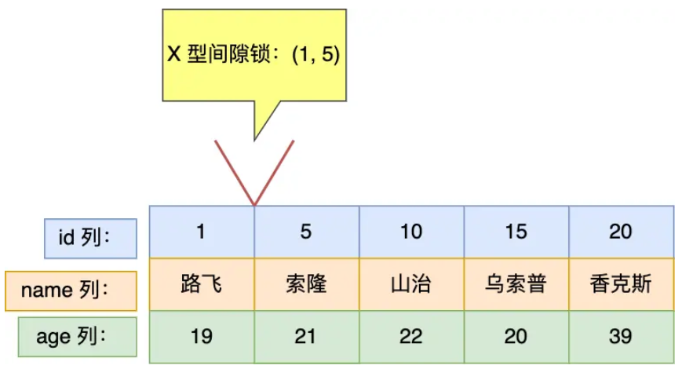

**优化：在（唯一）索引上进行范围查询，加锁的范围视情况而定**：

- **范围查询：>**

```sql
select * from user where id > 15 for update;
```

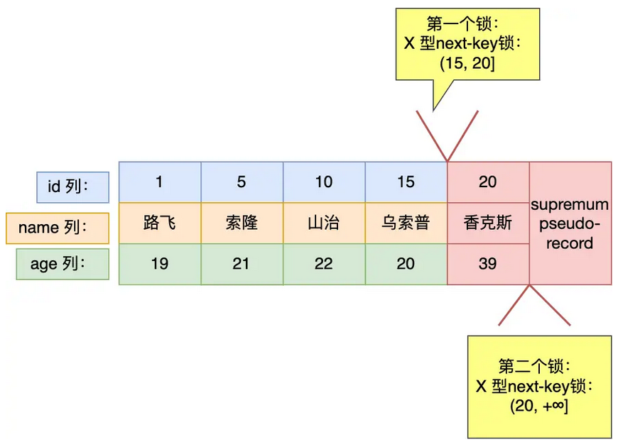

- **范围查询：>=**

```sql
select * from user where id >= 15 for update;
```

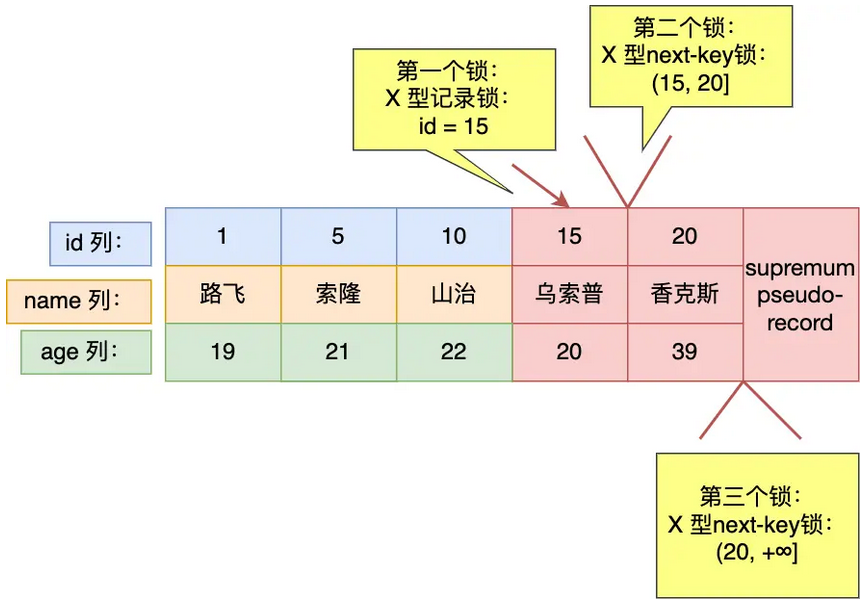

- **范围查询：<    并且条件值记录不存在**

```sql
select * from user where id < 6 for update;
```


- **范围查询：<=   并且条件值记录存在**

```sql
select * from user where id <= 5 for update;
```

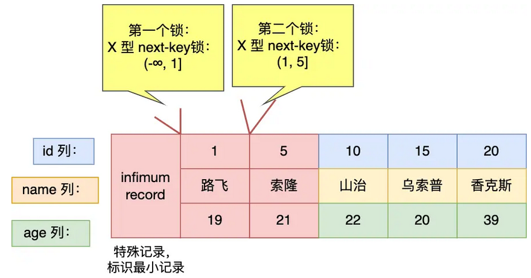

- **范围查询：<  并且条件值的记录存在**

```sql
select * from user where id < 5 for update;
```

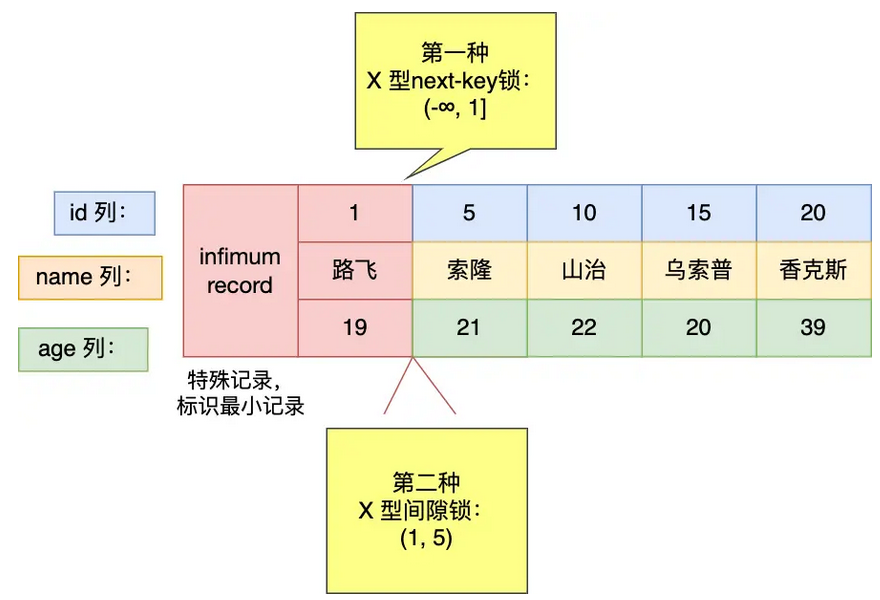

**优化：在（非唯一）索引上进行等值查询，加锁的范围视情况而定**：

- **等值查询，查询的值不存在**

```sql
select * from user where age = 25 for update;
```

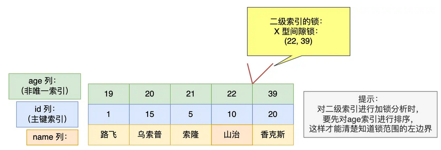

- **等值查询，查询的值存在**

```sql
select * from user where age = 22 for update;
```

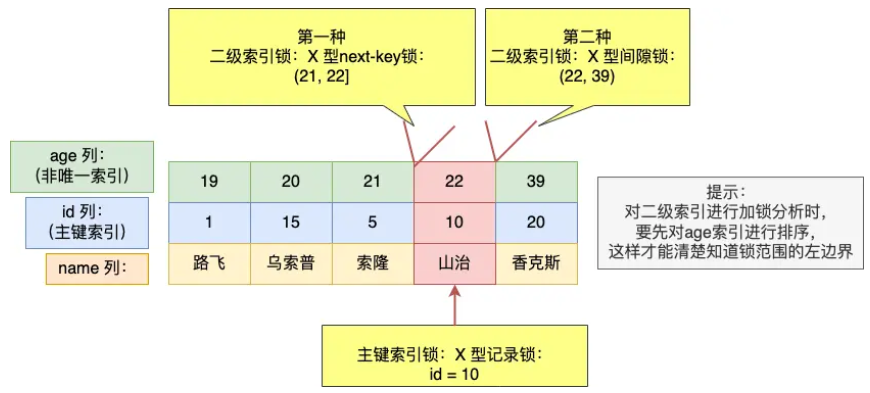

**优化：在（非唯一）索引上进行范围查询**

```sql
select * from user where age >= 22  for update;
```

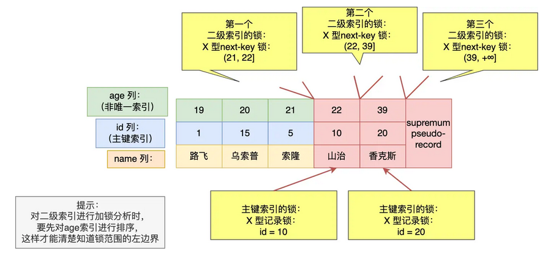

## 概念 | 不同事务隔离级别下，行级锁的使用情况

**不同事务隔离级别下，行级锁的使用情况：**（总结不到位，边学边完善吧）

| 隔离级别                                       | 是否会产生脏读 | 是否会产生不可重复读 | 是否会产生幻读         | 行级锁支持           |
| ---------------------------------------------- | -------------- | -------------------- | ---------------------- | -------------------- |
| READ UNCOMMITTED，读未提交                     | √             | √                   | √                     | 行锁                 |
| READ COMMITTED，读提交                         | ×             | √                   | √                     | 行锁                 |
| REPEATABLE READ（MySQL默认隔离级别），可重复读 | ×             | ×                   | √（没有完全解决幻读） | 行锁、间隙锁、临键锁 |
| SERIALIZABLE，串行化读                         | ×             | ×                   | ×                     | 行锁、临键锁         |

隔离级别从上到下，越来越高。隔离级别越高，数据越安全，性能越低。

---

RR隔离级别下，没法解决的幻读场景：

- [https://zhuanlan.zhihu.com/p/382010436](https://zhuanlan.zhihu.com/p/382010436)
- [https://blog.csdn.net/u012836410/article/details/139381338](https://blog.csdn.net/u012836410/article/details/139381338)
