---


# 索引

## 概念 | 基本概念

参考文章：[https://javaguide.cn/database/mysql/mysql-index.html#hash-%E8%A1%A8](https://javaguide.cn/database/mysql/mysql-index.html#hash-%E8%A1%A8)

---

==【八股】什么是索引？==

索引是一种【快速查询】和【检索数据】的【有序数据结构】，具备较高的查询效率；

索引一般通过某种引用指向数据，这样就可以通过索引高效查询数据。

==【八股】索引的好处和缺点？==

好处：提高查询效率，减少IO次数；

缺点：索引同数据一样，也需要创建和维护，需要消耗一定的成本。当表中数据发生变动的时候，索引也要变动。

==【八股】哪些数据结构可以用来作为索引？==

Hash表、二叉树（二叉搜索树、AVL数、红黑树）、B数和B+数。

| 数据结构            | 特点                                 | 缺点                                                                                                                       |
| ------------------- | ------------------------------------ | -------------------------------------------------------------------------------------------------------------------------- |
| Hash表              | 一次查询一个数                       | 范围查询慢、不支持顺序查询                                                                                                 |
| 二叉树\| 二叉搜索树 | 效果比Hash表好                       | 性能表现依赖于树的结构，当树退化为链表的时候，查询性能极具下降；<br />当数据量大的时候，树的深度比较大，是二叉树的通病缺点 |
| 二叉树\| AVL树      | 效果比二叉搜索树好（保证了树的平衡） | 需要频繁的旋转操作来保持平衡，消耗资源，也就没广泛使用                                                                     |
| 二叉树\|红黑树      | 大差不差                             | 不严格保持平衡，树比较高，查询效率也因此有所下降                                                                           |
| B树、B+树           | 好的很                               | MySQL使用B+树作为索引默认的数据结构                                                                                        |

---

==【八股】B树和B+树有什么区别？==

- 数据存储：

  - B树所有结点既放key（索引），也放value（数据值）
  - B+树非叶子结点只有key；叶子结点既有key，也有value
- 叶子结点特点：

  - B树所有叶子结点之间是分开独立的
  - B+相邻树叶子结点有一个引用链，指向相邻的叶子结点
- 检索过程：

  - B树的检索过程可能不到叶子节点就结束了
  - B+树的检索过程一定是从根节点到叶子结点
- 范围查询的特点：

  - B树中范围查询：首先查找范围下限，然后进行中序遍历查找上限
  - B+树中范围查询：首先查找范围下限，然后按照叶子结点的链条方向移动，直到找到上限

---

**概念**

- 度：一个结点最多的子节点个数
- 一个结点内存储的数的最大个数：度-1

**示例 | 度为5的B树**

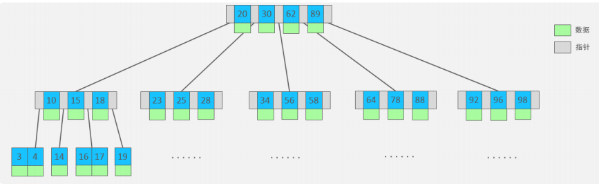

**示例 | 度为4的B+树**

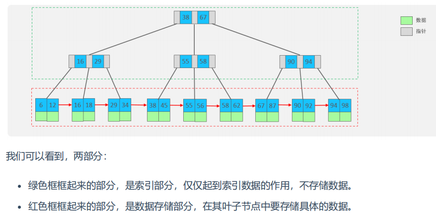

---

==【八股】高度为3的B+树，可以存放多少数据？==

规则：B+树的叶子结点存放数据，非叶子结点存放索引。计算B+树可以存储的数据个数就是计算：叶子结点数 + 每个叶子结点可以存储的数据数量

假定：假定B+数每个叶子结点的大小为一页（一页即16kb）；一行数据大小为1k；一个索引大小为8bit，一个指针大小为6bit

计算：

- 非叶子结点可以存放的索引数量 = 16 * 1024 / ( 8 + 6 ) = 1170
- 叶子结点可以存放的数据数量 = 16 / 1 = 16

基于上述假设，可以认定MySQL中B+数的度为1170。

B+数的叶子结点数量：

- 高度为2，数量 = 1170
- 高度为3，数量 = 1170 * 1170
- 高度为n，数量 = 1170^n

B+数可以存放的数据量：

- 高度为2，数量 = 1170 * 16
- 高度为3，数量 = 1170 * 1170 * 16
- 高度为n，数量 = 1170^n * 16

---

==【八股】MySQL有哪些索引类型？==

按照索引的数据结构来分：

- 哈希索引、BTree索引、B+Tree索引、全文索引

按照数据库数据在索引的存储方式来划分：

- 聚簇索引：索引结构和数据一起存放的索引；
  - InnoDB的主键索引就是聚簇索引
- 非聚簇索引：索引结构和数据分开存放的索引；
  - 非聚簇索引的叶子结点可能存放数据的引用
  - 非聚簇索引的叶子结点也可能存放数据的主键，二级索引就是存放数据的主键。

按照应用维度来划分：

| 分类         | 含义                                                               | 特点                               | 关键字   |
| ------------ | ------------------------------------------------------------------ | ---------------------------------- | -------- |
| 主键索引     | 针对主键创建的索引。列值不允许为NULL；不允许重复                   | 默认以主键创建且只能有一个主键索引 | PRIMARY  |
| 唯一索引     | 创建该索引的列，不允许有重复值                                     | 可以有多个                         | UNIQUE   |
| 常规索引     | 快速定位数据                                                       | 可以有多个                         |          |
| 前缀索引     | 只用于字符串类型的数据，以前n个字符创建索引                        | 可以有多个                         |          |
| 全文索引     | 查找的是文本关键词，而不是对比索引值                               | 可以有多个                         | FULLTEXT |
| 联合索引     | 将几个字段组合起来，共建索引，遵循“最左前缀”原则                 | 可以有多个                         |          |
| 唯一联合索引 | 将几个字段组合起来，共建索引，遵循“最左前缀”原则，且索引不能重复 | 可以有多个                         |          |

**其他分类**：

- 二级索引：叶子结点存储的数据是主键的值
  - 二级索引属于非聚簇索引
  - 唯一索引、常规索引、前缀索引都属于二级索引
- 覆盖索引：一个索引包含需要查询的字段的值，就称为覆盖索引。跟查询的字段内容有关，查询内容有变，可能就不是覆盖索引了。

---

**索引相关补充**：

聚簇索引是一定存在的，他的创建规则是：

- 有主键：主键索引就是聚集索引
- 无主键：唯一索引且其值不允许为NULL，选择该列为主键，就是聚集索引
- 无主键、无唯一索引：InnoDB会生成一个隐藏列row_id，作为聚簇索引

索引区分度的概念：

- 计算公式：索引区分度 = 不同值的数量 / 总的记录数
- 若一个索引的区分度较低，则索引可能失效，会走全表扫描；

## 应用 | 创建命令

**创建语法**

```sql
CREATE [UNIQUE | FULLTEXT] INDEX index_name ON table_name(index_col_name, ...);

# 主键索引：当创建表格时指定主键，默认创建主键索引 
# 常规索引：没有[UNIQUE | FULLTEXT]；index_col_name只有一列
# 前缀索引：没有[UNIQUE | FULLTEXT]；index_col_name(length)只有一列且指定长度
# 唯一索引：有UNIQUE；index_col_name只有一列
# 全文索引：有FULLTEXT；index_col_name只有一列
# 联合索引：没有[UNIQUE | FULLTEXT]；index_col_name有多列
# 唯一联合索引：有UNIQUE；index_col_name有多列
```

**查看索引**

```sql
SHOW INDEX FROM table_name;
```

**删除索引**

```sql
DROP INDEX index_name ON table_name;
```


## 应用 | 索引相关命令及规则

参考文章：[进阶-1-索引使用](/ToBeABD/Database/ivid0ywt/)

==【八股】什么是最左前缀原则？==

==【八股】什么是回表查询？==

==【八股】什么是索引下推？==

简单来说就是：将一些过滤操作从服务层下放到引擎层，允许引擎层在检索数据的时候直接过滤掉不合适的条件的记录，从而减少回表查询。

---

==【八股】MySQL中explain命令的作用？具体看哪些参数？==

参考文章：[https://segmentfault.com/a/1190000023565685](https://segmentfault.com/a/1190000023565685)

作用：explain命令用于分析SQL查询的执行计划，可以了解MySQL如何执行你的查询语句的细节，有助于优化查询以提高性能；

常用的参数有：

- `id` + `table`：两个加起来可以判断每一条SQL语句的执行顺序和表的查询顺序

  - id相同，自上向下就是表的查询顺序；
  - id不同，id自大向小就是表的查询顺序；
- `select_type`：查询的类型

  ```
  SIMPLE - 简单查询，不包含子查询和Union查询
  PRIMARY - 存在子查询的时候，最外面的查询被标记为主查询
  SUBQUERY - 子查询
  ......
  Union：当一个查询在Union关键字之后
  ```
- `Type`：连接类型，即找到所需数据使用的扫描方式

  ```SQL
  -- 扫描方式，从快到慢
  NULL > system > const > eq_ref > ref > ref_or_null > index_merge > range > index > ALL
  
  -- range：索引的范围查询； index：只遍历索引树； ALL：全表查询
  ```
- `key` + `key_len`：前者表示查询过程中，实际用到的索引；后者表示索引的字节数，可以用来推断索引的长度；
- `Extra`：不在上述其他字段下显示，但是也挺重要的额外信息，就会在这里显示；

  ```
  Using filesort - 没有找到索引，又需要排序；
  Using temporary - 使用了临时表排序，常见于order by和group by；
  Using index - 表示使用了索引；
  ```

---

==【八股】当联合索引（a，b，c）中列a的范围查询为>=的时候，为什么后边列的索引依然生效？==

参考文章：[https://blog.csdn.net/weixin_44146398/article/details/134657019](https://blog.csdn.net/weixin_44146398/article/details/134657019)

汇总：

假定有联合索引（a, b）

| SQL语句                                                 | 用到的索引                                                          |
| :------------------------------------------------------ | ------------------------------------------------------------------- |
| `select * from Table where a > 1 and b=2`             | a                                                                   |
| `select * from Table where a >= 1 and b=2`            | (a, b)                                                              |
| `select * from Table where a Between 2 And 8 and b=2` | between...and..包含边界：(a, b)；<br />between...and..不包含边界：a |
| `select * from Table where a like 'j%' abd b = 2`     | (a, b)                                                              |

---

==【八股】MySQL中profile命令的作用？==

作用：可以对SQL查询语句进行性能分析和诊断。它可以提供指定SQL语句在各个阶段所消耗的时间，方便追溯问题所在，以供后续优化参考

- profile：提供指定SQL查询语句在各个阶段的执行时间，从执行时间角度入手；
- explain：提供当前SQL查询语句的执行细节，比如查表顺序、数据扫描方式、索引使用情况、额外信息等；

相关的参数：

- 横向参数：SQL执行的步骤

  ```
  starting：开始
  checking permissions：检查权限
  Opening tables：打开表
  init ： 初始化
  System lock ：系统锁
  optimizing ： 优化
  statistics ： 统计
  preparing ：准备
  executing ：执行
  Sending data ：发送数据
  Sorting result ：排序
  end ：结束
  query end ：查询 结束
  closing tables ： 关闭表 ／去除TMP 表
  freeing items ： 释放物品
  cleaning up ：清理
  ```
- 纵向参数：每个步骤的执行时间、CPU占用、内存占用等信息


## 应用 | 索引失效的情况

参考文章：[进阶-2-索引失效](/ToBeABD/Database/ncbj22j8/)

参考文章：[https://mp.weixin.qq.com/s/mwME3qukHBFul57WQLkOYg](https://mp.weixin.qq.com/s/mwME3qukHBFul57WQLkOYg)

==【八股】索引失效的情况有哪些？==

- 不满足最左匹配原则；
- 索引列参与【函数运算】、【类型转换】
- 模糊查询使用不当：%xxx
- OR表达式中，有字段没有建立索引，MySQL优化器就会将全表扫描作为最优选择；
- IN的取值范围较大的时候，会走全表扫描（跟is null和is not null情况类似）

---

==【八股】is null 和 is not null是否走索引？==

跟数据分布有关，不一定用索引，也不一定不用索引。

## 总结 | 索引设计原则

**表选择**

- 针对数据量较大，且查询比较频繁的表建立索引

**列选择**

- 针对于常作为查询条件（where）、排序（order by）、分组（group by）操作的字段建立索引；
- 尽量选择区分度高的列作为索引；
- 如果索引列不能存储NULL值，请在创建表时使用NOT NULL约束它。当优化器知道每列是否包含NULL值时，它可以更好地确定哪个索引最有效地用于查询；
- 被频繁更新的列慎重选择作为索引。

**索引选择**

- 尽量建立唯一索引，查询效率高
- 如果是字符串类型的字段，字段的长度较长，可以针对于字段的特点，建立前缀索引
- 尽量使用联合索引，减少单列索引，查询时，联合索引很多时候可以覆盖索引，节省存储空间，避免回表，提高查询效率。
- 应该扩展已有的索引，而不是创建新的索引

**索引数量**

- 要控制索引的数量，索引并不是多多益善，索引越多，维护索引结构的代价也就越大，会影响增删改的效率；
- MySQL一张表的索引数量建议为3-5个（主键索引、常见查询列的索引、联合索引）

# 锁

## 基本概念

==【八股】什么是锁？==

锁是计算机协调多个进程或线程并发访问某一资源的机制。锁是一种常见的并发事务的控制方式。

---

除了传统的计算资源：CPU、RAM、I/O，数据库中的数据也是一种供多用户共享的资源。

锁对于数据库而言也很重要：

- 如何通过锁保证数据并发访问的一致性？
- 数据库加锁之后出现锁冲突，也会进一步影响数据库的并发性能。

在MySQL中，按照锁的粒度，分为三类：全局锁、表级锁、行级锁。

---

==【八股】SQL语句发生死锁，怎么排查定位？怎么修复？==

定位：

- 开启MySQL死锁监控；
- 查看死锁日志；
- 定位死锁日志涉及的事务、表、锁定的资源；
- 解决死锁问题；

修复手段：

- 事务本身：（1）缩小事务范围；（2）按顺序访问表；（3）尽量避免大事务，避免对某一资源的长期占用；
- 降低锁的粒度：尽量使用行级锁；
- 拆分复杂操作：将事务中复杂的SQL操作拆分为多个简单的操作，避免在一个事务中执行大量的插入、更新或删除操作；

## 总结 | 各类别锁的名字

| 锁级别                                   | 锁名字                                                                                                           | 解释             |
| ---------------------------------------- | ---------------------------------------------------------------------------------------------------------------- | ---------------- |
| 全局锁                                   | `read lock`                                                                                                    | 全局锁只有可读锁 |
|                                          |                                                                                                                  |                  |
| 表级锁 - 表锁                            | `read lock`  表共享读锁<br />`write lock`  表独占写锁                                                        |                  |
| 表级锁 - 元数据锁（meta data lock，MDL） | `SHARED_READ_ONLY`<br />`SHARED_NO_READ_WRITE`<br />`SHARED_READ`<br />`SHARED_WRITE`<br />`EXCLUSIVE` |                  |
| 表级锁 - 意向锁                          | `IS`  意向共享锁<br />`IX`  意向排他锁                                                                       |                  |
|                                          |                                                                                                                  |                  |
| 行级锁 - 行锁（Record Lock）             | `S`  共享锁<br />`X`  排他锁                                                                                 |                  |
| 行级锁 - 间隙锁（Gap Lock）              | `Gap Lock`                                                                                                     |                  |
| 行级锁 - 临键锁（Next-Key Lock）         | `Next-Key Lock`                                                                                                |                  |

## 概念 | 各类别锁的介绍

参考文章：[进阶-3-常见的锁](/ToBeABD/Database/p5mxhm2h/)

---

==【八股】行锁什么情况下会失效？==

行锁在InnoDB引擎下是针对索引而言的，当 `update、delete`语句的 `where`条件没有命中索引，原本的 `行锁-排他锁`就会失效，然后回根据相应的并发控制算法和锁调度策略采取措施。

---

==【八股】行级锁的加锁规则？==

2原则 + 多优化

# MVCC

## 基本概念

==【八股】什么是MVCC？==

MVCC，Multi-Version Concurrency Control，多版本并发控制。

原理：通过对同一份数据保留多个版本，来实现并发控制，使得**读-写过程**没有冲突。

作用：为了提高并发性能，且高并发下，MVCC的开销比行级锁小，且可以解决数据读-写操作中的冲突问题。

---

==【八股】MVCC的实现原理？==

MVCC的实现依赖于：版本链 + undo log日志 + readView。

具体原理参考下文。

【补充】MVCC是一个概念，并非只有InnoDB引擎具备，但是不同的存储引擎中关于MVCC的实现原理不同，本文讲述的MVCC是在InnoDB引擎下的实现。

## MVCC实现原理

### 版本链 + undo log日志

- 版本链的实现依赖于MySQL表的三个隐藏字段，分别是：事务id（Trx_id）、数据版本id（Roll_Pointer）、主键id（ROW_id）
- undo log日志主要用于保证事务的原子性，可以提供回滚操作恢复数据到修改前的状态。

这两个组合起来，能够实现数据的多版本保存。

---

**假设有一张表，里面有一条原始数据：**

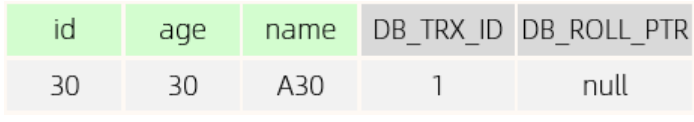

现在依次对该数据，按照以下事务顺序，对数据进行修改：

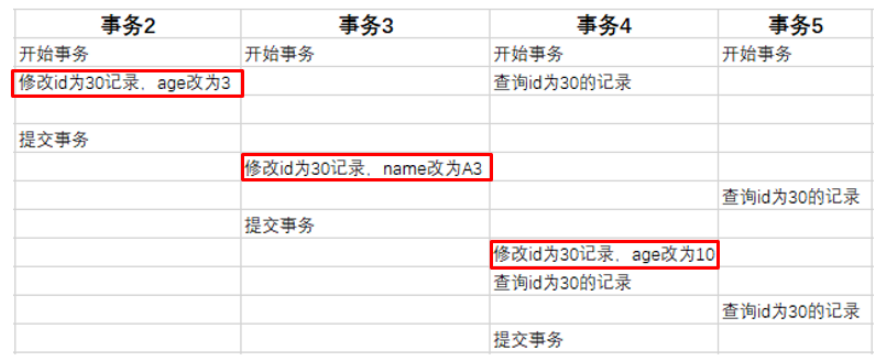

最终会有如下效果：

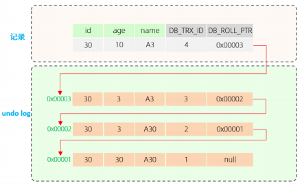

undo log生成了一个数据的版本链表：链表头部是最新记录；链表尾部是最早的旧纪录。

### readView

==【八股】怎么理解readView？==

readView可以理解在，把数据在每个时刻的状态，拍成照片记录下来。若要获取t时刻的数据，就到那个点的readView上获取。

readView给事务可以访问的数据版本提供了一套判断规则。

---

==【八股】readView的核心组成？==

ReadView内部记录并维护了 `系统当前活跃的事务（未提交的）id`。活跃事务id指：在创建readView时还没提交的事务（包含创建readView的事务）。

ReadView主要有如下核心字段：

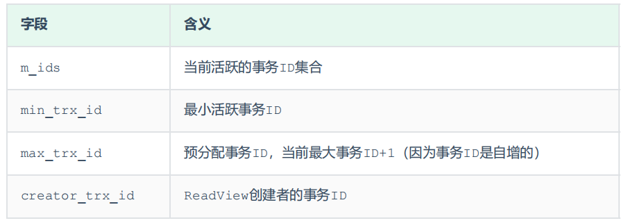

**在readView中规定了版本链中数据的访问规则。**假定 `trx_id`表示undo log版本链中对应的事务id，

- `trx_id == creator_trx_id`  ：可以访问，表明这个版本的数据是当前事务更改的

```
这种情况发生的条件是：
- 开启当前事务，进行修改操作
- 查询修改的数据
这个时候，虽然事务没有提交，但是修改操作对本事务是可见的，对其他事务，则是不可见的
```

- `trx_id < min_trx_id`  ：可以访问，表明修改该版本数据的事务，在创建readView的时候就已经提交了
- `trx_id > max_trx_id`  ：不可以访问，表明修改该版本数据的事务，在创建readView之后才开启
- `min_trx_id <= trx_id <= max_trx_id` ：需要分情况讨论：
  - `trx_id in m_ids` ：不可访问，表明修改该版本数据的事务，在创建readView的时候已经开启并完成了数据修改，但是还没有提交
  - `trx_id not in m_ids`  ： 可以访问，表明修改该版本数据的事务，在创建readView的时候已经开启并完成了数据修改，而且已经提交

---

【补充】可以了解到，当数据被修改后，即使事务还没提交，数据的版本已经更新。当需要回滚事务的时候，回滚数据版本到更改前的状态；当需要提交事务的时候，就正常提交事务，数据的版本依旧是最新（如果没有其他事务对数据进行修改的话）。

## MVCC在不同隔离级别下的应用

==【八股】快照读和当前读的区别？==

先理解两个概念：快照读和当前读。

快照读：读取的是数据的可见版本。因为是可见版本，就不需要加锁，

- 这些操作可以看作是快照读：普通的 `select`语句

当前读：读取的是数据的最新版本。因为是最新版本，就需要加锁，来防止其他事务进行修改。

- 这些操作可以看作是当前读：行锁-共享锁：`SELECT ... lock in share mode`、行锁-排他锁：`SELECT ... for update`、`update`、`insert`、`delete`

---

在RU隔离级别下，不使用MVCC版本控制。

在剩余隔离级别下：RC、RR、Serlizable，会使用MVCC进行版本控制，根据隔离级别的不同，readView有不同的生成规则。

readView的生成在不同隔离机制下，有不同的表现，表现形式跟快照读一样：

- RC：读已提交隔离级别，**每次select都生成一个快照读，对应每次生成一个readView**
- RR：可重复读隔离级别，开启事务后，只在第一个select语句的时候生成快照读，后续select都以第一个快照读的结果为依据，**对应只生成一次readView**
- Serializable：**快照读退化为当前读**。在这个隔离级别下，每个事务都需要在另一个数据结束后才能开启，就没有了快照读的存在，也就没有readView的概念

---

==【八股】MySQL在RR隔离级别下为什么不能（完全）解决幻读？==

参考文章：[https://blog.csdn.net/m0_61227789/article/details/135978941](https://blog.csdn.net/m0_61227789/article/details/135978941)

RR隔离级别下，可以解决部分幻读的情况，有些幻读的情况是没法解决的。

可以解决的情况：

- 前后多次进行快照读的 `select`语句

不可以解决的情况：

- 事务A下先快照读，然后其他事务新增数据并提交，然后事务A用当前读，就会产生幻读；

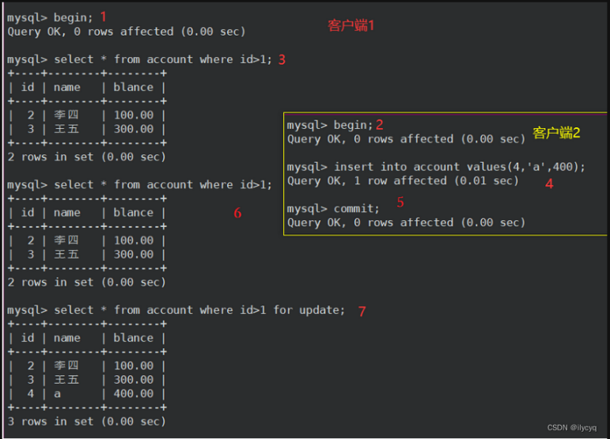

- 事务A下先快照读，然后其他事务新增数据并提交，然后事务A修改该数据，再快照读，也会产生幻读（原因就是当前事务修改了数据，该行数据事务隐藏列的值已经变了，从 `trx_id > creator_trx_id`变成了：`trx_id = creator_trx_id`，满足readview访问该版本数据的条件）；

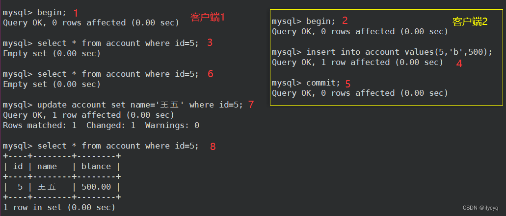

---

==【八股】MySQL中是如何保证ACID的？==

- 持久性是通过 `redo log` 和 `bin log`来实现的
- 原子性是通过 `undo log`来实现
- 隔离性是通过MVCC机制和锁来实现的

当保证了原子性、持久性和隔离性，数据的一致性就达成了。前三者是手段，后者是目的

# 三种日志

> redo log、undo log、bin log

> 参考小林Coding，一次介绍一种日志，然后介绍该日志的基本功能、持久化思路、其他（缓存等）

## 日志 | undo log

### 基本功能

==【八股】undo log的作用？==

- 保证事务的原子性，提供回滚操作；
- MVCC的实现条件之一

---

==【八股】undo log的流程？==

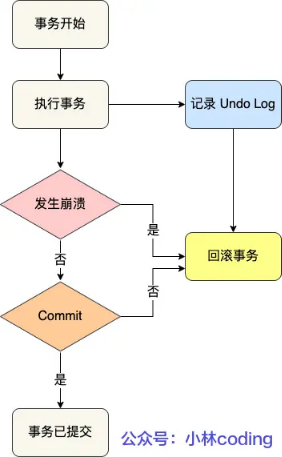

==【八股】undo log记录的内容？==

undo log是逻辑日志：

- 当insert数据的时候，undo log日志记录数据的主键，回滚的时候就可以通过主键来delete数据来恢复数据；
- 当delete数据的时候，undo log日志记录原有的数据，回滚的时候就可以通过这些内容执行insert操作来恢复数据；
- 当update数据的时候，undo log记录旧的内容，回滚的时候就可以通过旧的内容执行update操作来恢复数据

### 持久化

==【八股】undo log的持久化？==

- 事务开启后，对数据的更改会写入Buffer Pool，涉及到的数据页会标记为脏页，后续进行持久化操作；此时的undo log会写入Buffer Pool中的undo页；
- undo页的更改也会记录相应的redo log日志，后续进行undo log的持久化；
- **undo log日志的持久化需要通过redo log日志来保证；**

## 缓冲池 | Buffer Pool

**背景：**

MySQL的数据都是存储在磁盘中，当我们更新数据的时候，就需要先从磁盘中读取记录，然后在内存中修改，那么修改后的数据是写回磁盘？还是缓存起来？

当然是缓存起来，这样后续查询语句命中了这条记录，就可以直接返回结果。

Buffer Pool就是起到这个缓存作用。

---

**结构图：**

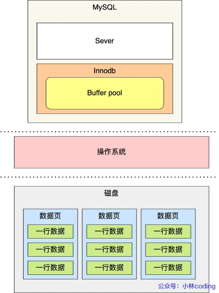

1、逻辑架构：

- InnoDB的表结构基本单元是“页”，Buffer Pool的基本单元同样也是“页”；一页的大小是16kb；
- MySQL启动的时候，InnoDB会为Buffer Pool申请一片连续的内存空间，然后按照16kb的大小，划分一个一个的页，叫做“缓冲页”；
- 这些缓冲页都是空闲的，随着程序运行，才逐渐有数据写入（刚开始：虚拟内存大-物理内存小；当运行一段时间，有数据写入，操作系统申请物理内存，将虚拟内存与物理内存之间建立联系）

2、Buffer Pool的内容：

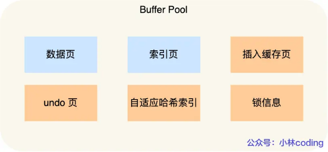

- undo页：启动事务后，InnoDB层更新前，会记录相应的undo log，就会写入Buffer Pool的undo页；

---

**相关问题：**

1、查询一条数据，就会缓冲一条记录嘛？

- 不是，查询数据的时候会将整个页都加载到Buffer Pool中，然后通过页里面的“页目录”去定位数据；

---

==【八股】Buffer Pool的刷盘时机？==

- redo log日志满了，会主动触发脏页数据写入磁盘；
- Buffer Pool空间不足，需要淘汰部分数据页，如果是脏页，就会先将脏页同步到磁盘
- MySQL认为空闲时，后台线程也会定期把适量的脏页数据写入磁盘；
- MySQL正常关闭前，会把所有脏页数据刷入到磁盘；

因为MySQL实行的是WAL技术（日志先于数据刷盘），即使MySQL崩溃，数据丢失，也能通过redo log恢复；

## 日志 | redo log

### 基本功能

==【八股】redo log的作用？==

- 基于Buffer Pool的操作固然可以提高效率，但因为操作是在内存中进行，若遇到故障断电情况，没有及时持久化到磁盘，就会出现数据不一致；
- 因此需要redo log：当执行修改操作之后，将修改的结果通过redo log记录下来，只要redo log持久化成功，更新操作就算完成了，这个时候即使内存中的数据没有及时持久化到磁盘中，也可以通过redo log日志，完成数据恢复；

---

什么是WAL技术？

WAL，Write Ahead Logging，指MySQL的写操作，先将数据写入redo log日志，再将结果持久化到磁盘；

---

==【八股】redo log日志工作的流程？==

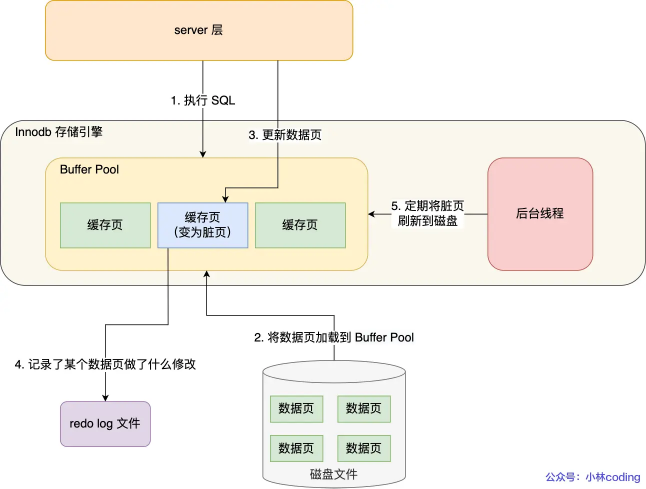

---

==【八股】redo log和undo log所记录数据的区别？==

- redo log记录：事务【完成后】的状态，记录的是更新后的值；
- undo log记录：事务【完成前】的状态，记录的是更新前的值；

事务提交之前的崩溃，通过undo log来恢复原样；事务提交之后的崩溃，通过redo log来恢复原样：

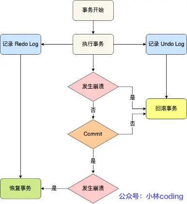

---

==【八股】redo log需要写入磁盘，数据也需要写入磁盘，那么redo log是否是多此一举？==

 不是。

- redo log数据写入磁盘的方式是【追加写】，即写在上次位置的后面；
- 数据写入磁盘的方式是【随机写】，即先找到数据在磁盘的原位置，然后再写入修改后的内容；

追加写的效率要优于随机写，因此通过redo log，可以快速的保证MySQL事务的持久性，即使后续的随机写过程出现问题，也能通过redo log来恢复。

redo log的出现，赋予了MySQL：

- 崩溃恢复的能力：crash-safe
- 提高MySQL数据写入磁盘的性能：从【随机写】变为【顺序写】

### 持久化

==【八股】redo log的持久化？==

> redo log也是先写入内存，然后再通过策略，持久化到磁盘中。

**持久化流程：**

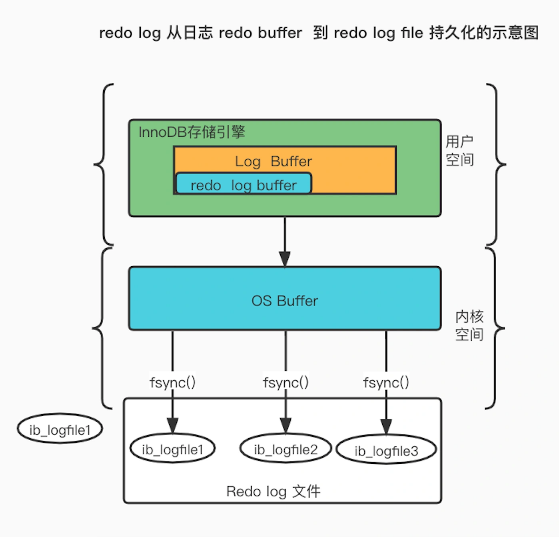

- 每产生一条redo log，就会先写入redo log buffer，后续通过持久化策略，写入磁盘；
- redo log buffer默认大小为16MB，可以通过 `innodb_log_Buffer_size`参数调整大小；

---

**刷盘时机：**

- MySQL正常关闭；
- redo log buffer中记录的写入量 > redo log buffer内存空间的一半；
- InnoDB的后台线程，每隔1s，进行持久化操作；
- 事务提交后，将redo log buffer中的数据进行刷盘（可通过参数控制策略：innodb_flush_log_at_trx_commit）

---

**innodb_flush_log_at_trx_commit参数：**

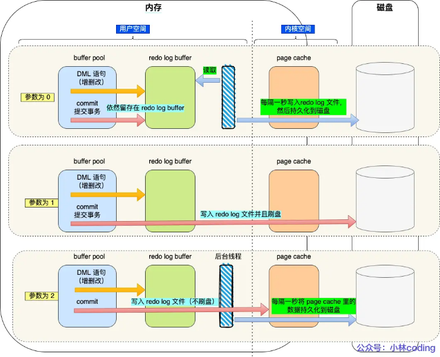

参数=0：

- 事务提交后，仅留存在redo log buffer中，不进行刷盘操作（MySQL线程崩溃了，数据就没了）；
- 后台线程每隔1s，从redo log buffer中读取数据，调用write()函数，将数据写入page cache文件，并且调用fsync()函数，进行刷盘操作；

参数=1：

- 事务提交后，将redo log buffer的数据直接进行刷盘操作；

参数=2：

- 事务提交后，将redo log buffer的数据写入redo log文件（不算刷盘，只是将数据保存在内核空间，这样当MySQL进程奔溃了，系统进程还在的时候，也能保证数据不丢失）；
- 后台线程每隔1s，将page cache里面的数据持久化到磁盘中；

这3个参数值对应的策略：

- 数据安全性：参数1 > 参数2 > 参数0；
- 性能：参数0 > 参数2 > 参数1；

---

==【八股】redo log文件写满了该怎么办？==

**redo log的结构：**

- 默认情况下，InnoDB引擎有1个重做日志组（redo log Group），由2个redo log文件组成：`ib_logfile0`和 `ib_logfile1`，他们两个大小一致，首位相连
- 采用循环写的方式工作：`ib_logfile0`写满，开始写 `ib_logfile1`


**redo log的刷盘操作：**

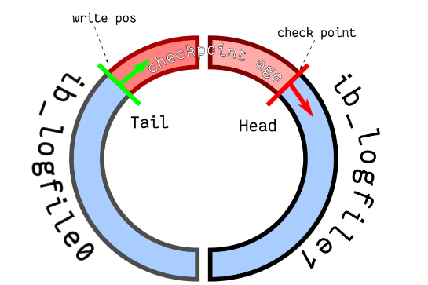

- 指针移动：write pos 和 check point的移动方向都是顺时针；
- 红色部分：空闲的，用来记录新的更新操作；
- 蓝色部分：已经记录的，等到刷盘的数据；

如果write pos 追上了 check point，表示redo log被写满了，此时会阻塞MySQL，禁止更新操作，然后执行刷盘；

有空间了，check point 指针就会继续移动，MySQL就可以继续执行更新操作了

## 日志 | bin log

### 基本功能

==【八股】bin log 与 redo log的时间线？==

==【八股】为什么有了redo log还要 bin log？==

最开始MySQL只有MyISAM引擎，只有bin log，此时不具备crash-safe的能力；

后来另一个公司以插件的形式，将InnoDB引擎引入MySQL，通过redo log来保证crash-safe的能力；

---

==【八股】redo log 和 bin log的区别？==

适用对象：

- bin log：MySQL Server层的日志，所有引擎都可用；
- redo log：InnoDB引擎的日志，只有该引擎具备；

文件格式：

- bin log有3种类型，是逻辑日志

|          |                                                                                                                                                                                                  |
| :-------: | ------------------------------------------------------------------------------------------------------------------------------------------------------------------------------------------------ |
| statement | 记录每一条会修改数据的sql语句，不需要记录每一行的变化，但是sql执行有上下文，会额外保存一些信息；<br />空间占用小，但是有动态函数的问题（SQL语句中有now函数执行，这样主从复制的时候就会出现问题） |
|    row    | 记录哪条数据被更改，以一行数据的改动为基本单位；<br />日志信息太多，日志量太大；                                                                                                                 |
|   mixed   | 折中的方案，普通操作使用statement记录，当无法使用statement的时候使用row                                                                                                                          |

- redo log是物理日志：记录某个数据页做了什么修改操作；

写入方式：

- bin log：追加写，写满就创建新文件，不会覆盖以前的老文件；
- redo log：循环写，日志空间大小是固定的；

用途：

- bin log：用于恢复备份，主从复制；
- redo log：用于掉电等故障场景的数据恢复；

### 持久化

==【八股】bin log 的刷盘时机？==

**整体思路：**

事务执行过程中，先把日志写到binlog cache（Server层的cache）；

事务提交的时候，再把binlog cache写入到binlog文件中。

---

**刷盘框架：**

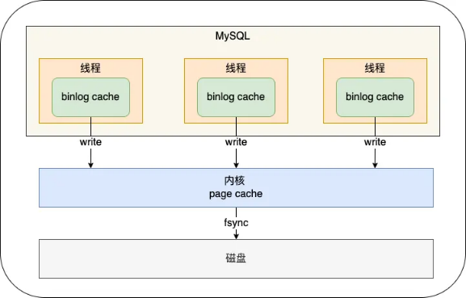

- 每个线程都有自己的binlog cache，但是最终都会写入到一个binlog文件中；
- write()操作是指：将数据从binlog cache写入page cache，此时不算刷盘，只是保证MySQL进程崩溃之后，系统进程还在，仍然能保证数据的完整性
- fsync()操作，才是将数据从page cache中刷盘

---

**sync_binlog参数**

用来控制刷盘频率：

| 参数值        | 操作                                                               |
| ------------- | ------------------------------------------------------------------ |
| = 0【默认】   | 每次提交事务，只write()操作，不fsync()，后续刷盘操作由操作系统决定 |
| = 1           | 每次提交事务，都会write()，然后立刻执行fsync()操作来刷盘           |
| = N（ N > 1） | 每次提交事务都write()，累计N个事务之后，再fsync()操作              |

## 两阶段提交 | redo log + bin log

==【八股】redo log 两阶段提交的过程？==

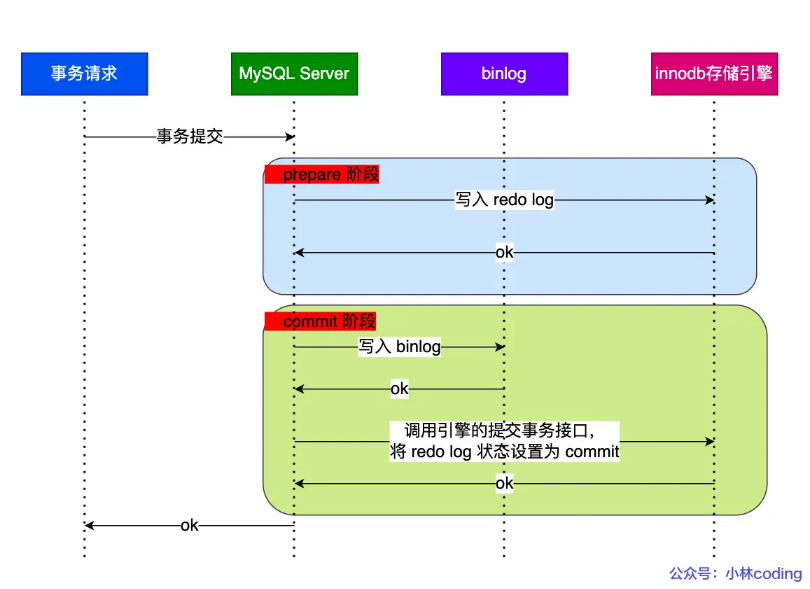

- prepare阶段：redo log需要持久化到磁盘；
- commit阶段：bin log需要持久化到磁盘；
- commit阶段：redo log的状态设置为commit，该状态并不需要持久化到磁盘，只需要write到文件系统的page cache即可。因为只要bin log写磁盘成功，无论redo log状态是prepare还是commit，事务都算成功；

---

==【八股】两阶段提交是如何保证数据一致性的？==

==【八股】在两阶段提交过程，出现异常重启，会出现什么现象？==

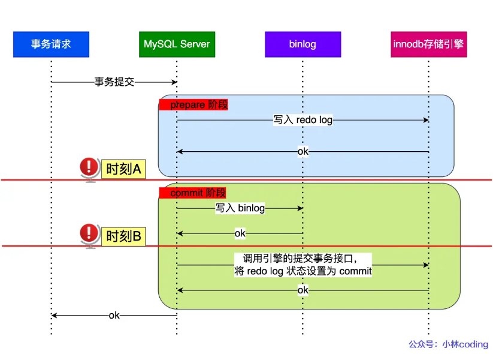

时刻A出现异常：

- 重启恢复后，通过redo log来恢复数据；
- 拿着事务XID，去bin log中查找，没找到，则回滚事务；

时刻B出现异常：

- 重启恢复后，通过redo log来恢复数据；
- 拿着事务XID，去bin log中查找，找到相关ID，则提交事务；

## 总结 | 一条DML语句的执行过程

**图示：**

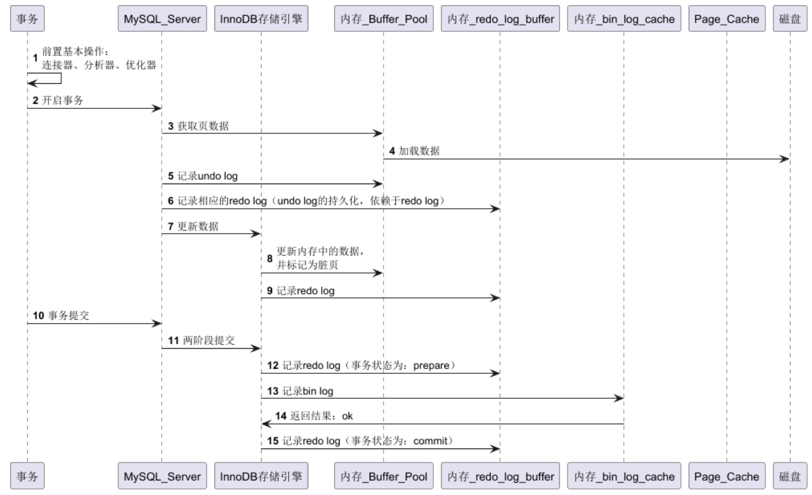

**文字：**

示例：`UPDATE t_user SET name = 'xiaolin' WHERE id = 1;`

1、前置基本操作：连接器、分析器、优化器

2、执行器操作：

- 调用存储引擎的接口，通过主键索引树搜索获取 id = 1 这一行记录：

  - 如果 id=1 这一行所在的数据页本来就在 buffer pool 中，就直接返回给执行器更新；
  - 如果记录不在 buffer pool，将数据页从磁盘读入到 buffer pool，返回记录给执行器。
- 执行器得到聚簇索引记录后，会看一下更新前的记录和更新后的记录是否一样：

  - 如果一样的话就不进行后续更新流程；
  - 如果不一样的话就把更新前的记录和更新后的记录都当作参数传给 InnoDB 层，让 InnoDB 真正的执行更新记录的操作；
- 开启事务， InnoDB 层更新记录前，首先要记录相应的 undo log，因为这是更新操作，需要把被更新的列的旧值记下来，也就是要生成一条 undo  log，undo log 会写入 Buffer Pool 中的 Undo 页面，不过在内存修改该 Undo 页面后，需要记录对应的 redo  log；
- InnoDB 层开始更新记录，会先更新内存（同时标记为脏页），然后将记录写到 redo log 里面，这个时候更新就算完成了。为了减少磁盘I/O，不会立即将脏页写入磁盘，后续由后台线程选择一个合适的时机将脏页写入到磁盘。这就是 **WAL 技术**，MySQL 的写操作并不是立刻写到磁盘上，而是先写 redo log，然后在合适的时间再将修改的行数据写到磁盘上。

3、至此，一条记录更新完了。

4、开始记录该语句对应的 binlog，此时记录的 binlog 会被保存到 binlog cache，并没有刷新到硬盘上的 binlog 文件，在事务提交时才会统一将该事务运行过程中的所有 binlog 刷新到硬盘。

5、事务提交，剩下的就是「两阶段提交」的事情了。

---

**补充：**

- undo log会写在Buffer Pool中的undo页，undo log的持久化依赖于redo log；
- redo log的刷盘操作有多个时机：MySQL关闭；后台线程每隔1s处理；事务提交后；（即会出现事务还没提交，redo log就刷盘的情况）
- bin log的刷盘操作需要在事务提交之后才进行，bin log成功提交并刷盘，就是事务成功的标志。
