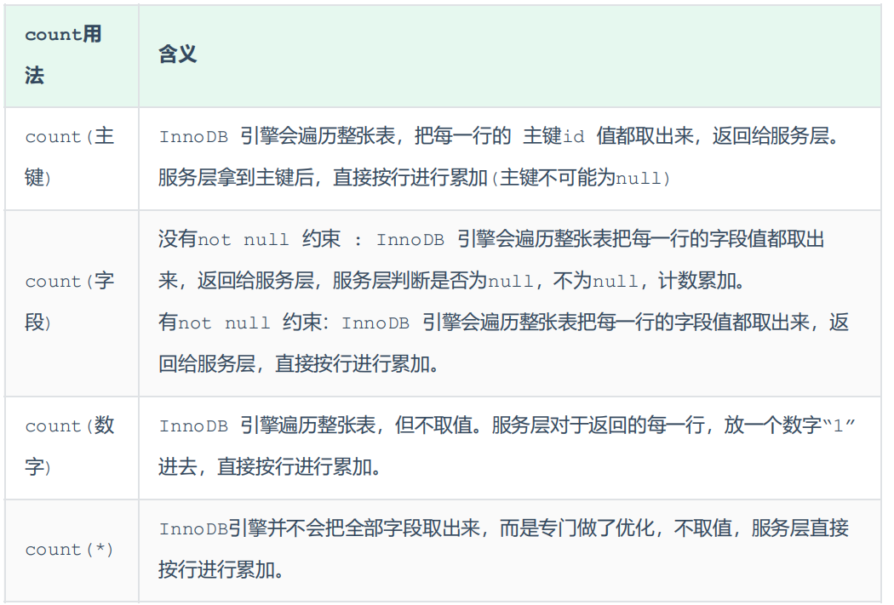

---


# 前言

本文主要讲述不同SQL语句的优化策略。


# SQL | DML语句

## insert语句

- 插入数据的时候，改为批量插入

- 插入数据的时候，按照主键顺序插入
- 大批量插入数据的时候（百万），用load指令，从本地文件载入（需要在全局变量中开启，从而允许load指令）


## update

注意更新语句的检索条件，尽量选择有索引的列；尽量选择主键索引。

- 当使用索引的时候：InnoDB引擎下执行update语句，添加的是行锁；当使用主键索引的时候，能减少回表查询

```sql
# 该事务下使用的锁是：行锁
update course set name = 'javaEE' where id = 1;
```

- 当没有索引或者索引失效的时候，会从行锁升级为表锁：

```sql
# 该事务下使用的锁是：表锁
update course set name = 'SpringBoot' where name = 'PHP' ;
```


# SQL | DQL语句

## order by

MySQL的排序有两种方式，尽量使用`Using index`：

- `Using filesort`：将满足条件的数据行放到`sort buffer`中完成排序操作。使用索引或不适用索引的情况，都有可能出现该种排序方式

- `Using index`：通过有序索引，按照顺序扫描，直接返回有序数据，不需要额外排序。效率要高于`Using filesort`

不同场景下，会选用不同的排序方式，也有某些场景，两种排序方式都存在。

---

**使用`Using filesort`的情况**：

- 无索引排序
- 多列排序，各列都单独创建索引

```sql
# 无索引
explain select id,age,phone from tb_user order by age;
explain select id,age,phone from tb_user order by age, phone;

# 多列排序，均为单列索引
explain select id,age,phone from tb_user order by age, phone;
```

**使用`Using index`的情况**：

- 单列排序，有单列索引
- 联合索引正常使用

```sql
# 单列索引
explain select age from tb_user order by age;

# 联合索引正常使用。给(age、phone)创建联合索引
explain select id,age,phone from tb_user order by age;
explain select id,age,phone from tb_user order by age, phone;
```

**其他情况**：

```sql
# 给(age、phone)创建联合索引

# Using index; Using filesort
explain select id,age,phone from tb_user order by phone;
explain select id,age,phone from tb_user order by phone, age;

# Backward index scan; Using index;
explain select id,age,phone from tb_user order by age, phone desc;
```

---

联合索引默认是增序的，在MySQL8版本中，可以建立降序索引：

```sql
CREATE [UNIQUE | FULLTEXT] INDEX index_name ON table_name(index_col_name asc, index_col_name_2 desc, ...);
```


## group by

在分组操作的时候，通过索引可以提升效率，但是同时也遵循最左匹配原则：

```sql
# === 无索引
# Using temporary
explain select profession , count(*) from tb_user group by profession;


# === 建立单独索引
# Using index
explain select profession , count(*) from tb_user group by profession;


# === 建立联合索引：(profession，age)
# Using index
explain select profession , count(*) from tb_user group by profession;

# Using index，Using temporary
explain select age , count(*) from tb_user group by age;
```


## imit

limit查询，查询的数据越往后，时间消耗越大：

```sql
# 0.00sec
select * from tb_sku limit 0, 10;

# 10.79sec
select * from tb_sku limit 100000, 10;
```

可以通过：覆盖索引 + 子查询（根据位置分类，属于from后面的子查询；根据返回结果分类，属于列子查询），对SQL进行优化：

```sql
explain select * from tb_sku t , (select id from tb_sku order by id limit 2000000,10) a where t.id = a.id;
```


## count

MySQl中统计数量的函数是`count()`。针对count的优化：

- 方案1：不使用count，自己计数（难搞）
- 方案2：合理的选用count用法。效率：count(字段) < count(主键) < count(1) = count(*)




# 其余 | 主键优化

- 满足业务的前提下，尽量减低主键的长度
- 插入数据尽量顺主键插入，可以选择自增主键
- 尽量不要用uuid或身份证号作为主键，插入数据不具备排序性质
- 业务操作，避免对主键进行修改

