---

## 认识微服务

**微服务架构下，涉及的相关功能**：

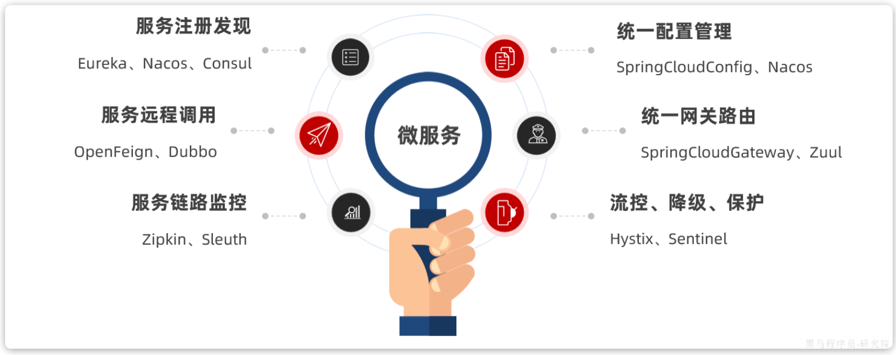

**各个功能的实现框架及与美团的对比**：

| 功能             | 开源框架                                   | 美团     |
| ---------------- | ------------------------------------------ | -------- |
| 服务注册发现     | Eureka、Nacos、Consul、**zookeeper** | OCTO     |
| 服务远程调用     | openFeign、Dubbo、Thrift                   | MTThrift |
| 服务链路监控     | Zipkin、Sleuth                             | MTrace   |
| 统一配置管理     | SpringCloudConfig、Nacos                   |          |
| 统一网关路由     | SpringCloudGatway、Zuul                    |          |
| 流控、降级、保护 | Hystix、Sentinel                           |          |

## 模块学习 | 服务注册与发现

### 基本概念

**【问题】服务注册与发现解决了微服务中的什么问题？ /  为什么需要服务注册与发现**？

我们首先从单体服务入手，分析了单体服务的不足，进而引入了微服务的概念；在微服务中，我们需要进行服务拆分及远程调用；

在没有引入”服务注册与发现“的概念之前，我们进行远程调用是写死服务实例的ip地址 + 端口 + 请求路径；该方法在实际生产中就存在如下问题：

- 某个服务有多个实例，该怎么知道每个实例的地址？
- 知道某个服务的实例后，该调用哪一个？
- 运行过程中，某个服务的某个实例夯机，其他服务却依然在调用，该怎么办？
- 如果流量增高，某个服务临时多部署了N个实例，该怎么让其他服务知道？

上述问题，都可以通过【服务注册与发现】解决。

---

**【问题】服务拆分的原则有哪些**？

纵向拆分：

- 根据模块功能来拆分；
- 比如商城项目，可以拆分为：用户服务、商品服务、订单服务、购物车服务、支付服务等；

横向拆分：

- 根据模块间的关联来拆分；
- 比如商城项目，用户登录和下单支付模块都需要消息发送、风控数据记录的功能，因此就可以将该公共功能抽取为公共服务；

### 核心概念 | 服务注册与发现

**【问题】服务注册与发现的实现原理**？

这一块主要涉及三个概念：**注册中心、服务调用者、服务提供者**。

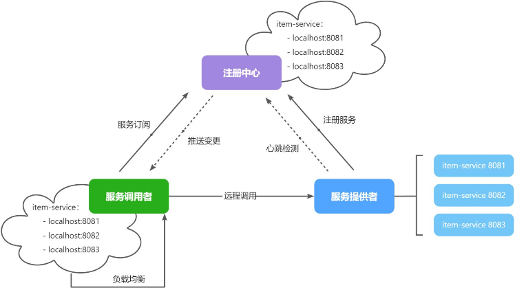

整体有如下几个步骤：

**服务注册**：

- 涉及对象：服务提供者 -> 注册中心
- 概念：每个微服务启动的时候，将自身的元数据信息（比如服务名称、IP地址、端口号、实例ID）注册到注册中心；注册中心通常会维护一个服务列表，保存所有已注册的服务实例的详细信息。

**服务发现**：

- 涉及对象：服务调用者 -> 注册中心
- 概念：某个服务需要调用另一个服务的时候，会向注册中心查询目标服务的地址和实例信息，然后发起RPC服务调用。
- 服务发现的模式：

```
客户端发现模式：客户端直接从注册中心获取服务列表，并选择合适的实例进行调用，客户端自身实现负载均衡策略；

服务端发现模式：客户端请求网关或者负载均衡器，由网关或负载均衡器从注册中心获取服务实例，并代替客户端选择合适的实例，进行请求转发；
```

**健康检查**：

- 涉及对象：注册中心 <-> 服务提供者
- 概念：注册中心需要定期对注册的服务实例进行健康检查，保证只有健康的服务实例可以用。
- 健康检查的两种模式：

```
主动健康检查：注册中心主动发起心跳检查（HTTP或TCP ping）；

被动健康检查：服务实例定期向注册中心发送心跳信号，如果注册中心长时间没有收到服务实例的心跳，就认为该实例不可用，就从服务列表中移除该实例；
```

**服务续约与注销**：

- 涉及对象：注册中心 <-> 服务提供者
- 服务续约：就是维持服务提供者的注册状态，实现手段就是健康检查；
- 服务注销：与服务注册对应，当服务实例主动停止时，会发送注销请求给注册中心，通知注册中心将自己从注册列表中移除。注销动作本身不会导致服务停止运行，只是保证服务不会被其他服务调用。

**负载均衡策略**：

- 涉及对象：注册中心、服务调用者
- 概念：某个服务有多个运行实例，需要有一定的规则，来确定调用哪一个实例，就是负载均衡策略（轮询、最少链接、加权等），可以通过负载均衡器实现。

### 开源框架 | zookeeper

> 单开一章介绍

## 模块学习 | 服务远程调用

## 模块学习 | 服务链路监控

## 模块学习 | 统一配置管理

## 模块学习 | 统一网关路由

## 模块学习 | 微服务保护

> 保护服务运行的健壮性，避免级联失败导致的雪崩问题；
>
> 开源的微服务保护框架：Sentinel

### 保护-对上 | 请求限流

解决的问题：服务故障的最重要原因就是并发太高，解决并发问题就能避免大部分故障；

实现手段：限制 / 控制 接口访问的并发流量在某个阈值之内；

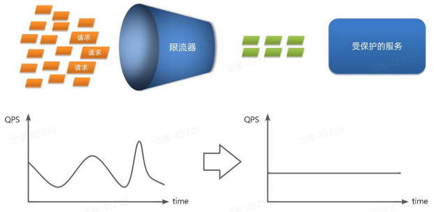

Sentinel实现示例：

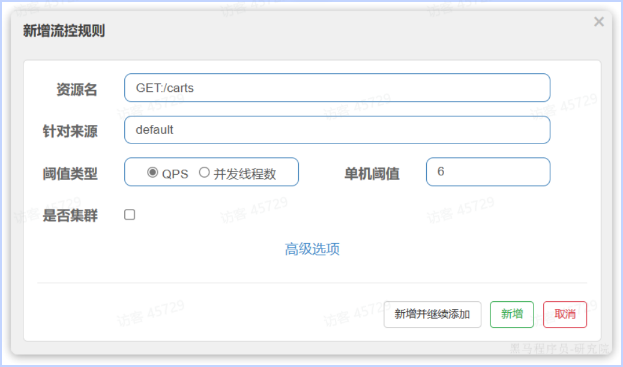

- 针对访问购物车列表接口，限制单机访问的QPS在6以内。

### 保护-对上 | 线程隔离

解决的问题：

- 当一个服务的业务接口响应时间长，并且并发较高，就可能耗尽服务器的资源，从而导致服务内的其他接口受到影响；

实现手段：

- 使用线程隔离，限制某个接口可以使用的资源上限（比如线程数上限）

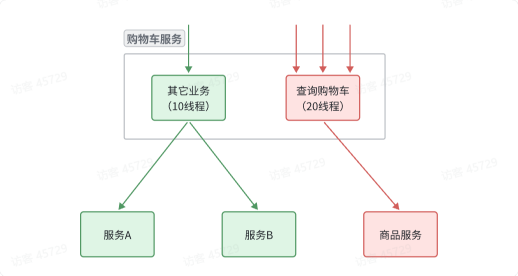

Sentinel示例：

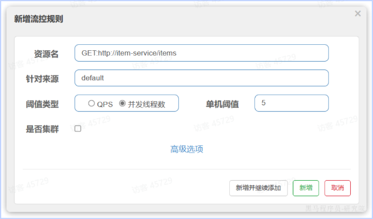

### 保护-对下 | 服务熔断

解决的问题：

- 线程隔离 + 请求限流，虽然避免了雪崩问题，但依然解决不了故障服务对其他服务的影响；
- 购物车业务对商品展示业务有强依赖，假设商品展示业务故障，则必然会拖累购物车业务；

实现手段（业务正常方实现）：

- 编写服务降级逻辑：当调用下游失败的时候，根据业务场景，抛出异常或给出默认提示；
- 异常统计和熔断措施：统计服务提供方的异常比例，当比例过高的时候，拒绝调用该接口，直接走降级逻辑；

  （熔断示例图）

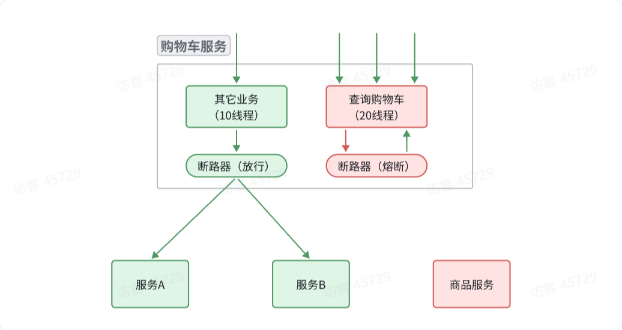

    （熔断实现原理：状态机）

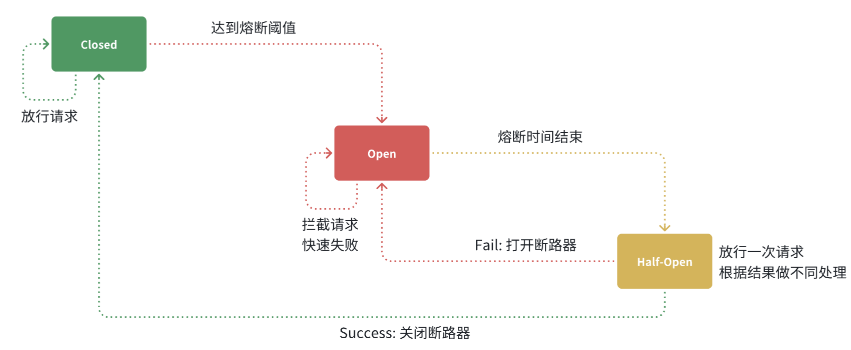

通过一个状态机来实现熔断，状态机有3中状态：

- closed（关闭状态）：放行所有的请求，并统计异常数、异常比例、慢请求比例；
- open（打开状态）：服务调用被熔断，拦截任何请求，直接走降级逻辑；
- half-open（半开状态）：熔断持续一定时间后会进入该状态；放行一次请求，根据执行结构来判断后续操作
  - 请求成功：切换到closed状态；
  - 请求失败：切换到open状态；

Sentinel示例：

- 降级逻辑：实现openFeign的FallbackFactory接口；
- 熔断实现：

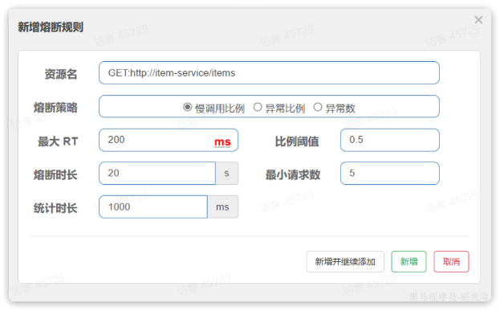

接口调用时长超过200ms就算慢调用；每1000ms最少统计5次请求，如果慢调用的比例不小于0.5，就触发熔断，熔断时长为20s；熔断内，直接走降级逻辑；

## 模块学习 | 分布式事务

### 基本概念

==【八股】什么是分布式事务？==

在单体应用中，一个功能的所有环节、所有数据库均在一起实现，可以通过一个本地事务来处理；当任一环节失败，通过事务回滚使得数据恢复到提交前的状态。

在分布式系统中，一个功能的所有环节可能由不同的服务实现，每个服务可能有自己的数据库，这样就没法通过本地事务来保证数据的一致性，就延伸出了分布式事务的概念。

---

==【八股】分布式事务有哪些实现方案？各自特点？==

[参考文章](https://blog.csdn.net/a745233700/article/details/122402303#:~:text=%E6%9C%AC%E6%96%87%E5%B0%86%E6%8E%A2%E8%AE%A8%E5%87%A0%E7%A7%8D%E5%B8%B8%E7%94%A8%E7%9A%84)、[参考文章](https://blog.csdn.net/zzming2012/article/details/113755608)

**方案1：两阶段提交（2PC）**

概述：

- 将事务的提交过程分为资源准备和资源提交两个阶段，并且由事务协调者来协调所有事务参与者。当第一阶段全部成功，则进入第二阶段，否则事务回滚。

缺点：

- 性能问题：在执行过程中，所有参与节点的事务都是阻塞性的，对性能影响较大；
- 可靠性问题：非常依赖协调者，当协调者夯机，所有参与者都会处于锁定事务资源的状态；
- 数据一致性问题：若第二阶段出现网络问题，导致部分节点没有收到commit请求，事务没有提交，就会出现数据不一致的问题；
- 无法解决的问题：协调者发出第二阶段的commit请求后夯机了，唯一的参与者同时也夯机了；即使再次选出一个协调者，该条事务的状态也是不确定的。

---

**方案2：三阶段提交（3PC）**

概述：

- 2PC的改进版本；
- 在协调者和参与者中都引入超时机制；在第一阶段和第二阶段中插入一个准备阶段，整体分为CanCommit、PreCommit、DoCommit

优缺点：

- 【降低阻塞范围、避免协调者的单点问题】：在第二阶段，如果有参与者给出absort响应或者在超时时间内没有收到协调者的请求，都会执行事务中断，停止事务执行；
- 【数据不一致依然存在】：在第三阶段，如果部分节点（A节点）同意执行DoCommit，部分节点（B节点）发出absort请求中断事务，但是协调者因为网络原因，无法将中断信号发送给A节点，在超时之后，A节点仍然会提交事务，而B节点不会提交事务，就会出现数据不一致的问题；

为什么第三阶段，准备好提交事务的节点，在没有收到commit命令或absort命令的时候，仍然会提交事务？

- 因为经过前两个阶段的验证，他有理由相信：成功提交事务的概率很大，即使会有某些网络原因。

---

**方案3：TCC**

概述：

- TCC（Try-Confirm-Cancel）是应用层的两阶段提交，对业务侵入大；核心思想是：针对每个操作，都要实现对应的确认操作和补偿操作；
- 第一阶段：执行Try接口，并预留资源（在业务应用中执行加锁等操作）；
- 第二阶段：Try成功，执行Comfirm接口，走业务逻辑，提交事务，并释放资源；Try失败，执行Cancel接口，回滚事务，并释放Try阶段预留的资源；

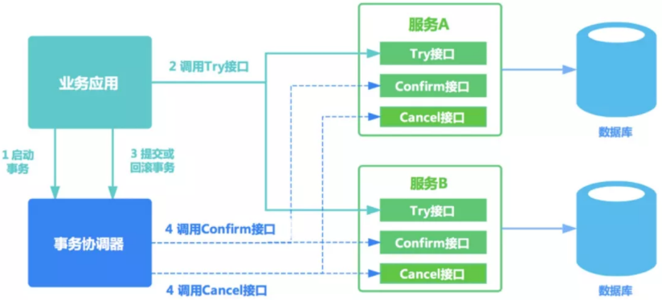

注意事项：

- 【允许空回滚】：Try阶段出现丢包，即没有执行Try里面的资源锁定操作，但是事务管理器收到了Cancel请求，执行了Cancel操作，就需要在不存在事务ID的情况下，也返回成功信息，让事务协调器认为回滚成功；
- 【防悬挂控制】：Try阶段延迟超时，触发了Cancel操作，然后Try阶段的数据到达了，后又返回Try成功的响应；此时事务协调器先收到Cancel成功的响应，认为事务回滚成功了，所以就要拒绝Try成功的响应，就避免执行预留资源的操作；
- 【幂等控制】：由于网络原因或者重试操作，回导出Try-Confirm-Cancel接口被反复执行，因此需要保证接口幂等；

优缺点：

- 性能提升：资源锁定粒度小；
- 数据一致性高：基于Confirm和Cancel的幂等性，保证事务的最终执行或取消，保证了数据的一致性；
- 可靠性：由业务方发起并控制整个业务活动，避免了事务协调器的单点故障问题；
- 缺点：Try-Confirm-Cancel接口要基于业务实现，业务耦合度较高，开发成本较高；

---

**方案4：Saga事务**

概念：

- 将长事务拆分为多个短事务依次提交，如果所有的事务都执行成功，就认为分布式事务执行成功；
- 每个短事务都是幂等的，且都有对应的补偿操作，用来撤销该事务的操作；

恢复策略：

- 向后恢复：第i个事务执行失败，则通过补偿操作，回滚第1-i个事务；
- 向前恢复：第i个事务执行失败，就重试，直到成功；

### 相关八股 | Seata

==【八股】Seata的部署架构？==

在Seata中，有3个重要角色：

- TC（Tanasaction Coordinator，事务协调者）：负责维护全局和分支事务的状态，协调全局事务的提交或回滚；**需要单独部署**
- TM（Transaction Manager，事务管理器）：负责定义全局事务的范围、开始、提交或回滚全局事务；
- RM（Resource Manager，资源管理器）：管理分支事务，与TC交谈，实现注册分支事务、报告分支事务的状态，并驱动分支事务的提交或回滚；

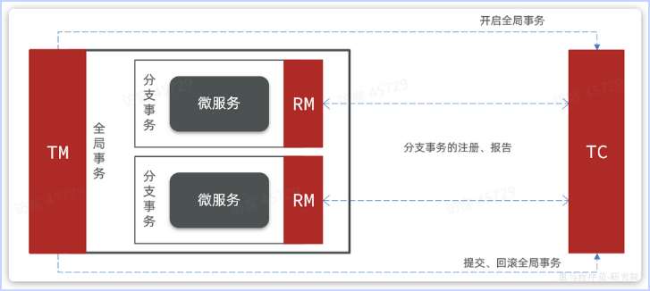
