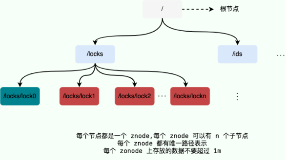
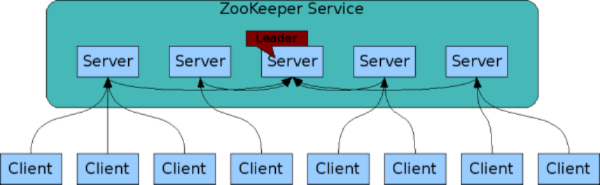
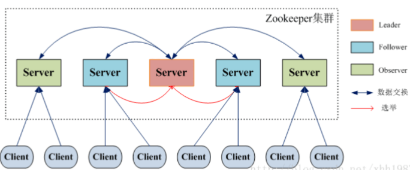
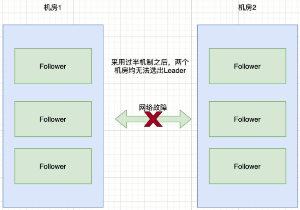
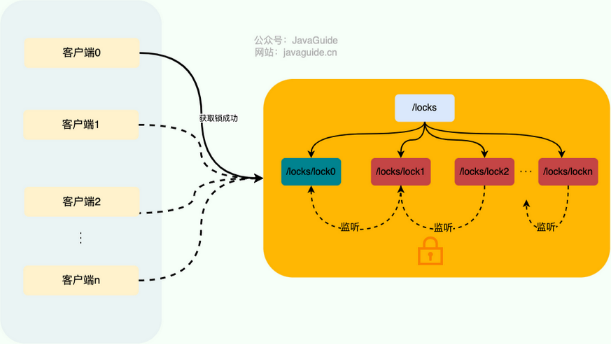

---

# 基本概念

## 认识zookeeper

**概念**

ZooKeeper是一个开源的【分布式协调服务】，它的设计目标就是将复杂容易出错的分布式一致性服务封装起来，构成一个高效可靠的原语集，并以一系列简单易用的接口提供给用户。

**具备的功能**

- 提供高可用、高性能、稳定的分布式数据一致性解决方案；
- 用于实现数据发布/订阅、复杂均衡、命名服务、分布式协调/通知、集群管理、Master选举、分布式锁等功能；

这些功能主要依赖ZooKeeper提供的【数据存储】+【事件监听】功能。

**ZooKeeper的特点**

【顺序一致性】：从同一客户端发起的事务请求，最终将会严格地按照顺序被应用到 ZooKeeper 中去；

【原子性】：所有事务请求的处理结果在整个集群中所有机器上的应用情况是一致的，要么整个集群中所有的机器都成功应用了某一个事务，要么都没有应用；

【单一系统映像】：无论客户端连到哪一个 ZooKeeper 服务器上，其看到的服务端数据模型都是一致的。

【可靠性】：一旦一次更改请求被应用，更改的结果就会被持久化，直到被下一次更改覆盖。

【实时性】：一旦数据发生变更，其他节点会实时感知到。每个客户端的系统视图都是最新的。

【集群部署】：3~5 台机器就可以组成一个集群，每台机器都保存了 ZooKeeper 的全部数据，机器之间互相通信来同步数据，客户端连接任何一台机器都可以。

【高可用】：如果某台机器宕机，会保证数据不丢失。集群中挂掉不超过一半的机器，都能保证集群可用。

## 数据模型

### Data Model（数据模型）

**数据结构**

- zookeeper的数据模型采用层次化的多叉树形结构；
- 每个数据节点都可以存储数据，可以是：数字、字符串或二进制序列，每个节点可以拥有N个子节点；
- 每个数据节点在zookeeper中称为znode，是【最小的数据单元】



**数据容量**

zookeeper主要用于协调服务的，并不是用来存储业务数据，所以不能存放较大的数据，并且每个节点的容量上限是1M；

### znode（数据节点）

**znode分类**

【持久节点】：一旦创建就一直存在即使zookeeper集群夯机，直到将其删除；

【临时节点】：生命周期与会话绑定，会话消失则节点消失。临时节点只能做叶子节点，不能创建子节点；

【持久顺序节点】：具备持久节点的所有特点，且其子节点的名称具有顺序性（也是唯一性），比如 `/node1/app0001`、`/node1/app0002`

【临时顺序节点】：具备临时节点的所有特点，且其子节点的名称具有顺序性（也是唯一性）

**znode组成**

- stat（状态信息）：事务ID、节点创建时间、子节点个数等状态
- data（节点存放的数据）

## 相关概念

### 版本（Version）

记录各种信息的版本号：

- dataVersion：当前znode的版本号；
- cversion：当前znode子节点的版本号；
- aclVersion：当前znode的acl版本号；

### ACL（权限控制）

ACL，AccessControlLists

对于znode操作的权限，zookeeper提供如下几种：

|        |                            |
| :----: | -------------------------- |
| CREATE | 可以创建子节点             |
| DELETE | 可以删除子节点             |
| WRITE | 可以更新节点数据           |
|  READ  | 可以获取节点数据及其子节点 |
| ADMIN | 可以设置节点的ACL权限      |

### Watcher（事件监听器）

是zookeeper中的一个重要特性，是实现分布式协调服务的基础；

zookeeper允许用户在指定节点上注册一些Watcher，当一些特定的事件触发的时候，zookeeper就会将事件通知到感兴趣的客户端上；


### Session（会话）

Session可以看作是Zookeeper服务器与客户端之间的TCP长连接，通过这个连接，能实现：

- 客户端通过心跳检测与服务器保持有效的会话；
- 客户端向Zookeeper服务器发送请求并接收响应；
- 客户端接收Zookeeper服务器的Watcher事件通知；

sessionTimeout属性：

- 代表会话的超时时间，假设因为网络原因或服务器压力，TCP长连接断开了；
- 只要在sessionTimeout之内重新连接，那么之前的会话仍然有效；

sessionID：

- 在会话创建之间，服务端会给每个客户端分配一个sessionID；
- sessionID需要保证全局唯一；

## zookeeper集群

为了保证高可用，通常都是用集群来部署zookeeper。



- 上图中每一个 Server 代表一个安装 ZooKeeper 服务的服务器；
- 组成 ZooKeeper 服务的服务器都会在内存中维护当前的服务器状态，并且每台服务器之间都互相保持着通信；
- 集群间通过 ZAB 协议（ZooKeeper Atomic Broadcast）来保持数据的一致性。

### 部署架构 | 集群角色

zookeeper没有采用传统的Master/Slave概念，而是引入3中角色，来完成集群的部署。



- Leader节点：为客户端提供读、写服务；负责向集群中的其他节点发送更新数据的提案，并收集它们的确认响应；可以更新系统状态
- Follower节点：为客户端提供读服务；对于写服务会转发给Leader节点；参与选举过程的投票；
- Observer节点：为客户端提供读服务；对于写服务会转发给Leader节点；【不】参与选举过程的投票，也【不】参与”过半写成功“策略；作用是在不影响写性能的情况下提升集群的读性能；

### 部署架构 | Leader-Follower

==【八股】zookeeper集群在什么情况下选取Leader？过程是怎样的？==

在集群初始化的时候，或集群中的Leader节点出现网络中断、崩溃、重启等异常情况时，会进入Leader的选举过程，产生新的Leader服务器。

选举过程大致如下：

- 选举阶段：节点均处于选举状态，有一个节点获得超半数节点的投票，就可以当选准Leader；
- 发现阶段：Followers跟准Leader进行通信，同步Followers最近接收的事务提议；
- 同步节点：利用Leader在【发现阶段】获取的最新提议历史，同步集群中所有的副本，至此完成同步后的准Leader成为Leader；
- 广播阶段：到了这个阶段，zookeeper集群才能对外提供事务服务，并且Leader可以进行消息广播；如果有新的节点加入，还需要对新的节点进行同步；

【补充】zookeeper集群中的服务器的状态有：

|          |                                      |
| :-------: | ------------------------------------ |
|  LOOKING  | 寻找Leader                           |
|  LEADING  | Leader状态，自身节点是Leader节点     |
| FOLLOWING | Follower状态，自身节点是Follower节点 |
| OBSERVING | Observer状态，自身节点是Observer节点 |

### 相关八股

==【八股】zookeeper的部署架构是什么？==

zookeeper是一个分布式协调服务，广泛用于分布式系统中，用于协调和管理分布式应用的元数据。

zookeeper部署架构的关键组成部分：

- 三种节点；
- Leader + Followers架构；
- 会话与连接机制；

==【八股】zookeeper是分布式系统中的CP架构，怎么保证CP的？==

**保证一致性（C）**

（1）Leader-Follower模型

- 仅Leader节点负责处理所有写请求，Follower节点负责处理读请求；
- 当客户端有写请求时，Leader节点会通过Zab协议来广播给所有Follower，在收到过半机器确认之后，Leader才会提交该事务并将结果返回给客户端；
- Follower会实时同步Leader的最新状态，确保所有节点的数据最终一致；

（2）Zab协议

- 广播写请求：Leader会将所有写请求以事务日志的形式广播给集群中的Follower；
- 过半确认机制：当Leader收到一半以上的机器确认，才认为事务成功；当集群中有一半以上的机器可以通信，就保证集群可用；
- 原子性：Leader确保每个节点在一个事务上达成共识，要么执行，要么不执行；
- 顺序性：所有事务严格按照顺序执行，保证所有客户端读取到的数据顺序是一致的。

（3）会话和版本机制

- 每个数据节点有一个版本号，客户端的每次写操作都需要指定版本号；如果该版本号和当前数据的版本号不一致，操作将失败；
- 通过版本号机制，避免了多个客户端并发写导致的不一致问题；

**保证分区容忍性（P）**

（1）过半机制：

- 在发生网络分区的情况下，如果一个节点能够获取一半以上节点的支持，就能成为Leader节点，保证服务可用；
- 无法与Leader进行通信的那些节点，暂停对外提供服务；

（2）夯机后恢复：

- 发生网络分区的情况下，如果能选出Leader节点，zookeeper正常提供服务，如果无法选出Leader节点，整体停止提供服务；
- 针对无法与Leader通信的节点，在网络恢复后会自动从Leader同步最新的数据，来保证数据一致。

==【八股】zookeeper中的脑裂现象有了解嘛？怎么解决？==

> 脑裂现象是分布式系统中的一个常见问题，而不仅仅局限于微服务系统。这里以配置中心中的脑裂现象为例，讲解脑裂的概念

当项目中出现分布式系统的时候，就会引入更多复杂的场景和解决方案。其中一个问题就是脑裂现象。

脑裂出现原因：

- 在使用zookeeper集群的时候，通常要有一个”脑子“，即Leader节点；Leader节点的出现通常是通过选取产生的；
- 当一个集群中的机器因为网络原因，分为两个部分，每个部分内的机器可以通信，每个部分间的机器不可以通信；
- 这时候就会重新选择Leader节点，就可能出现两部分机器，各自选举一个Leader节点，各自对外提供服务，最终出现数据不一致的情况；

防止脑裂的措施：过半原则

- 确保获得过半数量机器投票的节点，才能成为Leader节点；
- 这种原则可以保证：整个集群要么没有Leader节点，无法对外提供服务；要么只有1个Leader节点；

==【八股】常见的解决脑裂现象的方法汇总？==

|                         |                                                                                                                                                                                                          |
| ----------------------- | -------------------------------------------------------------------------------------------------------------------------------------------------------------------------------------------------------- |
| Quorums（法定人数）方式 | 即过半选取原则                                                                                                                                                                                           |
| 添加心跳线              | 集群中采用多种通信方式。<br />当原先的心跳线路正常，其余的心跳线不工作，节约资源；<br />当原先的心跳线路异常，另一条心跳线路马上工作，保证集群可用                                                       |
| 提供磁盘锁定            | 保证集群中只有一个Leader，能获取磁盘锁，对外提供服务；<br />可能的问题：Leader夯机，无法释放锁，导致其他节点获取不到共享资源；<br />解决措施：只有当心跳线全部断开的时候，才启用磁盘锁，其余情况，不加锁 |

==【八股】zookeeper的集群节点数量为什么建议是奇数个？==

集群节点数量设置为奇数个，即是因，也是果。

【因】：假设集群有偶数个节点，被平均分为两部分，这时候根据过半原则，就无法选出Leader节点。所以设置为奇数个节点



【果】：机器数量为2N或者2N-1，集群的容忍度均为N-1，没有变化，而且设置为偶数，还会引发无法选举Leader节点的问题，所以设置为奇数个节点

```
根据过半原则：

假设有5台机器，集群容忍度=2，还剩3台，可以工作；
假设有6台机器，集群容忍度=2，还剩4台，可以工作；容忍度=3，还剩3台，无法工作；

他们的容忍度是一样的。
```

==【八股】zookeeper怎么解决新旧Leader的争夺？==

假死的概念：假设旧的Leader假死，选取新的Leader后，旧的Leader复活，仍然认为自己是Leader，怎么避免这种情况？

避免假死的措施：zookeeper维护一个epoch的变量，每次选举新的Leader后，该值就递增；这样旧的Leader发起写请求，发现epoch的值小于当前值，就不认可该节点为Leader。

# 相关协议 | ZAB协议

==【八股】讲一讲zookeeper中的Zab协议？==

[参考文章](https://www.cnblogs.com/Jacian/p/14212401.html#:~:text=ZAB%E5%85%A8%E7%A7%B0Zooke)

Zab协议包含两种基本的模式：

（1）崩溃恢复

- 当整个服务在启动过程中，或是Leader服务器故障、崩溃、重启等异常情况时，Zab协议就会进入恢复模式并选举新的Leader；
- 当选举产生了新的Leader，同时集群中有过半的机器与该Leader完成了数据同步之后，Zab协议就会退出恢复模式；

（2）消息广播

- 当整个集群中有过半的Follower服务器完成了和Leader服务器的状态同步，整个服务就会进入消息广播模式；
- 当一台遵守Zab协议的新服务器加入服务，如果此时存在一个Leader负责消息广播，那么新加入的服务器就会自觉地进入数据恢复模式：找到Leader，进行数据同步，一起参与到消息广播流程中去；

# ZooKeeper应用 | 分布式锁

**实现原理**

zookeeper分布式锁基于【临时顺序节点】+【Watcher】实现；

**锁获取**

首先要有一个持久节点 `/locks`，客户端获取锁地过程就是在该节点下创建临时顺序节点；

- 客户端1创建节点 `/locks/lock1`，创建成功后，判断该子节点是否是 `/locks`节点下最小的子节点；
- 如果是最小的子节点，表示锁获取成功；
- 如果不是最小的子节点，表示锁获取失败，则会在前置节点上加一个【节点删除】的Watcher；当前一个节点删除，就表明锁释放了，即客户端1获取锁成功。

**锁删除**

1、成功获取锁的客户端在执行完毕业务流程后，会将对应子节点删除；

2、成功获取锁的客户端如果出现故障，对应的子节点由于是临时节点，也会被自动删除，避免了锁无法被释放；


