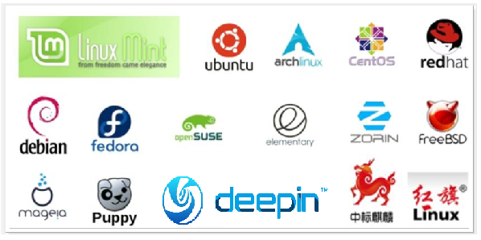

---

# Linux基础知识

==【八股】计算机的组成？==

- **硬件+软件：**

  - 硬件：计算机系统中由电子，机械和光电元件等组成的各种物理装置的总称
  - 软件：用户和计算机硬件之间的接口和桥梁，用户通过软件与计算机进行交流。**操作系统是软件的一类**
- **操作系统：**作为用户和计算机硬件之间的桥梁，调度和管理计算机硬件进行工作

---

==【八股】Linux系统的组成？==

Linux系统由：Linux系统内核 + 系统级应用程序组成

- Linux系统内核：提供系统最核心的功能，如：调度CPU、调度内存、调度文件系统、调度网络通讯、调度IO等
- 系统级应用程序：可以理解为出厂自带程序，可供用户快速上手操作系统，如：文件管理器、任务管理器、图片查看、音乐播放等

图示：


**以音乐播放举例**，不管是自带的系统程序，亦或者是第三方程序，均是通过调用内核提供的相关功能，由内核调度CPU解码、音响发声等

---

==【八股】什么是Linux发行版？==

提供了内核+系统级程序的完整封装，称之为Linux发行版。

市面上常见的Linux发行版：



不同发行版之间的区别：

- 基础命令100%相同
- 部分操作有所差异，如：软件安装

---

==【八股】什么是端口？==

端口是设备与外界通讯交流的出入口。端口可以分为：物理端口和虚拟端口两类

- 物理端口：又可称之为接口，是可见的端口，如USB接口，RJ45网口，HDMI端口等
- 虚拟端口：是指计算机内部的端口，是不可见的，是用来操作系统和外部进行交互使用的

---

Linux系统可以支持65535个端口，这6万多个端口分为3类进行使用：

- 公认端口：1~1023，通常用于一些系统内置或知名程序的预留使用，如SSH服务的22端口，HTTPS服务的443端口非特殊需要，不要占用这个范围的端口
- 注册端口：1024~49151，通常可以随意使用，用于松散的绑定一些程序\服务
- 动态端口：49152~65535，通常不会固定绑定程序，而是当程序对外进行网络链接时，用于临时使用

# Linux环境变量

**什么是环境变量？**

环境变量是操作系统（Windows、Linux、Mac）在运行的时候，记录的一些关键性信息，用以辅助系统运行

在 Linux 系统中，环境变量是用来定义系统运行环境的一些参数，比如每个用户不同的主目录（HOME）。

## 环境变量的分类

**按照作用域分类**

- 用户级别的环境变量：`~/.bashrc`、`~/.bash_profile`
- 系统级别的环境变量：`/etc/bashrc`、`/etc/environment`、`/etc/profile`、`/etc/profile.d`

上述配置文件的优先级：

|       配置文件       | 优先级（编号越低，优先级越高） | 补充                           |
| :------------------: | :----------------------------: | ------------------------------ |
| `/etc/environment` |               1               |                                |
|   `/etc/profile`   |               2               | 建议系统级别的环境变量在此配置 |
|  `/etc/profile.d`  |               3               |                                |
| `~/.bash_profile` |               4               | 建议用户级别的环境变量在此配置 |
|   `/etc/bashrc`   |               5               |                                |
|    `~/.bashrc`    |               6               |                                |

**按照生命周期分类**

- 永久的环境变量：设置在上述配置文件中
- 临时的环境变量：通过export命令，在当前终端设置，关闭shell终端即失效

## 读取环境变量

```bash
# 列出当前的环境变量值
export -p

# 输出PATH环境变量的值
echo $PATH

# 输出当前HOME环境变量的值
echo $HOME
```

## 修改环境变量

- 临时修改：通过export命令设置。在当前会话关闭后就失效。
- 永久修改：通过修改配置文件设置。修改后需要用 `source 文件名`命令使其生效 或 重新登录终端生效。

# Linux用户和权限

## 概念 | 用户和用户组

**基本概念**

- Linux 系统是一个多用户多任务的分时操作系统，任何一个要使用系统资源的用户，都必须首先向系统管理员申请一个账号，然后以这个账号的身份进入系统。账号一方面可以对用户的行为进行跟踪，并控制他们对系统资源的访问；另一方面也可以帮助用户组织文件，并未用户提供安全保护。
- Linux系统中的用户必须归属于某一个组，不能独立开外。


Linux系统中关于用户、用户组，可以实现如下操作：

- 配置多个用户
- 配置多个用户组
- 一个用户可以加入多个用户组里面；一个用户组可以包含多个用户；即两者是多对多关系

---

Linux系统中的用户分为三种类型：

- 管理员（root）用户：只有一个；所有用户中，他的权限最大
- 系统用户：有多个，用户的UID一般是1-499；系统用户的权限比较小，主要用于调用某个服务程序，不能远程登录服务器
- 普通用户：有多个，用户的UID一般是500-65534；可以远程登录服务器，进行正常的用户操作

超级管理员，root用户拥有最大的系统操作权限。普通用户在根目录下创建文件夹会失败，切换到root用户，就可以了

---

Linux系统中的用户组主要分为：

- 主要用户组：只有一个
- 次要用户组：可以有多个，用户可以自行添加

## 概念 | 文件权限

权限是操作系统用来限制资源访问的机制。`ls -l`命令可以查看文件的详细信息，包括权限相关内容。示例如下：

```shell
[root@iZ2zefyv2fli0egjhdk8pdZ ~]# ls -ll
total 952
-rw-r--r--   1 root root    156 Mar 22 22:17 applications.auth
drwxr-xr-x   3 root root   4096 Mar 22 22:55 HMTeen-Blog
drwxr-xr-x 871 root root  36864 Mar 22 22:50 node_modules
-rw-r--r--   1 root root     75 Mar 22 22:46 package.json
-rw-r--r--   1 root root 555244 Mar 22 22:50 package-lock.json
-rw-r--r--   1 root root 362056 Mar 22 22:50 yarn.lock
```

权限的组成如下：


（1）文件类型分为3种：

- d（dictionary）：表示目录
- -：表示文件
- l：表示软链接（即Windows中的快捷方式）

---

（2）权限分为3个组别（每一组都规定上述3个权限是否具有，不具备的用 `-`表示）：

- 属主权限：文件的创建者所具有的权限；
- 属组权限：文件所在的组所具备的权限；
- 其他用户权限：除了文件的创建者、所属的组，系统的其他用户都可以归为此类；

---

Linux中关于文件的权限分为3种：

- r（readable）：表示可读；
- w（writeable）：表示可写；
- x（executable）：表示可执行；

目录和文件关于权限的解释有不同的意义：

| 权限名字 | 目录                        | 文件                       |
| -------- | --------------------------- | -------------------------- |
| r        | 可以查看目录下的列表        | 可以用 `cat`命令查看内容 |
| w        | 可以在目录下创建和删除文件  | 可以修改文件内容           |
| x        | 可以使用 `cd`命令进入目录 | 可以作为二进制文件来运行   |

## 相关命令

**用户相关的命令**

|                          |                                                                                                  |
| :----------------------: | ------------------------------------------------------------------------------------------------ |
|   `su [选项] 用户名`   | Switch User，从当前用户切换到指定用户                                                            |
|         `exit`         | 当前用户是root用户，退出到普通用户；当前用户是普通用户，断开连接                                 |
|         `sudo`         | 给与普通用户临时授予root权限（有的用户没有被sudo授权的权限，需要用root用户在文件中进行授权操作） |
|                          |                                                                                                  |
|    `useradd 用户名`    | 创建用户，需要在root用户下执行                                                                   |
|       `usermod`       | 修改用户账号的属性和配置信息，比如用户名、用户ID等                                               |
|    `userdel 用户名`    | 删除用户，需要在root用户下执行                                                                   |
|      `id 用户名`      | 查看用户                                                                                         |
| `passwd [选项] 用户名` | 设置用户的认证信息，包括用户密码、密码过期时间等；                                               |
|                          |                                                                                                  |
|        `getent`        | 可以用于查看当前系统中有哪些用户、用户组                                                         |

**用户组相关的命令**

|                      |                                  |
| :-------------------: | -------------------------------- |
| `groupadd 用户组名` | 创建用户组，需要在root用户下执行 |
| `groupdel 用户组名` | 删除用户组，需要在root用户下执行 |
| `groupmod 用户组名` | 修改用户组的属性                 |

**权限相关命令**

|          |                                                                                                   |
| :-------: | ------------------------------------------------------------------------------------------------- |
| `chmod` | `change mode`，修改文件、文件夹的权限，需要root用户或者被修改的文件、文件夹所属的用户，才能修改 |
| `chown` | `change owner`，修改文件、文件夹所属的用户                                                      |
| `chgrp` | `change group`，修改文件、文件夹所属的用户组                                                    |
