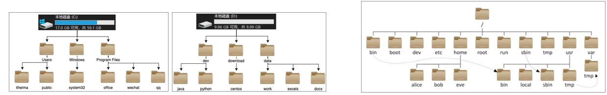

---

## 命令介绍

**通用的命令格式**

**command [- options] [parameter]**

- command：命令本身
- -options：命令可选项；可以不写、可以连写多个
- parameter：命令参数，命令的作用目标

**在线的命令查询网站**

[https://wangchujiang.com/linux-command/https://wangchujiang.com/linux-command/](https://wangchujiang.com/linux-command/)

## 目录相关命令

### 相关概念

**目录结构对比**



| Windows                              | Linux                                         |
| ------------------------------------ | --------------------------------------------- |
| 多个盘符                             | 没有盘符概念，只有一个根目录/，存储了所有文件 |
| 针对某一特定盘符，其内目录结构为树形 | 目录结构为树形                                |

**路径描述对比**

| Windows                | Linux                                                                |
| ---------------------- | -------------------------------------------------------------------- |
| D:\data\work\hello.txt | /usr/local/hello.txt（开头的斜杠表示根目录，后续的斜杠表示层次关系） |

**路径概念：相对路径、绝对路径、特殊路径符**

特殊路径符号

|        |                        |
| ------ | ---------------------- |
| `.`  | 表示当前目录           |
| `..` | 表示当前目录的父目录   |
| `~`  | 表示当前用户的home目录 |
| `/`  | 表示根目录             |

---

如果命令的参数如果是一个路径，就有如下不同写法：相对路径写法、绝对路径写法。

| 以cd命令为例，展示两种路径写法 | 特点         |
| ------------------------------ | ------------ |
| `cd /home/itheima/Desktop`   | 绝对路径写法 |
| `cd Desktop`                 | 相对路径写法 |
| `cd ./Desktop`               | 相对路径写法 |
| `cd ../Desktop`              | 相对路径写法 |
| `cd ~/Desktop`               | 绝对路径写法 |

**常见的压缩格式**

| 压缩格式 | 适配系统                      |
| :------: | ----------------------------- |
| `zip` | Linux、Windows、MacOS（常用） |
| `7zip` | Windows系统常用               |
| `rar` | Windows系统常用               |
| `tar` | Linux、MacOS常用              |
| `gzip` | Linux、MacOS常用              |

### 目录切换

|             |                |
| ----------- | -------------- |
| `cd 路径` | 切换到指定路径 |

### 目录操作

|                                                              |                                                                             |
| ------------------------------------------------------------ | --------------------------------------------------------------------------- |
| `ls`                                                       | 显示当前目录下的文件和子目录的列表（可指定目录路径）                        |
| `ll`                                                       | `ls -l`的别名，展示当前目录下所有子目录和文件的详细信息（可指定目录路径） |
| `mkdir [] 目录名`                                          | 创建目录（可指定目录的权限信息）                                            |
| `find [路径] [表达式]`                                     | 在指定目录及其子目录下搜索文件或目录                                        |
| `pwd`                                                      | 显示当前工作目录的路径                                                      |
| `rmdir [选项] 目录名`                                      | 删除空目录，并递归删除父空目录，直到遇到非空目录或者根目录                  |
| `cp [选项] 源文件 目标文件`、`cp [选项] 源目录 目标目录` | 复制文件或目录（保留源文件的属性和目录结构）                                |
| `mv [选项] 源文件 目标文件`、`mv [选项] 源目录 目标目录` | 移动文件或目录（保留源文件的属性和目录结构）                                |

## 文件相关命令

### 文件操作

|                                            |                                                    |
| ------------------------------------------ | -------------------------------------------------- |
| `touch [选项] 文件名..`                  | 创建新文件，可连续创建多个（若文件已存在，则替换） |
| `ln [选项] <源文件> <硬链接/软链接文件>` | 创建链接                                           |
| `cat/more/less/tail 文件名`              | 查看文件                                           |
| `vim 文件名`                             | 修改文件内容                                       |

==【八股】硬链接和软链接的区别？==

（1）两者作用：

- 软链接：某一文件在另外一个文件建立的一个同步链接，相当于C语言的指针；软链接的建立直接指向源文件的地址，不会占用额外的空间；需要在多个地方用到同一个文件时候，就可以用软链接。
- 硬链接：为文件提供了一个新的名字，指向同一个文件的物理地址；除了存储本身名字所需要的少量空间外，不需要额外其他的空间；硬链接双方任意内容发生变化后，另一个都会同步修改。

---

（2）两者相同点

- 提供文件的别名：软/硬链接，源文件和目标文件名字可以不一样；
- 节省空间：不会把源文件的内容复制一遍，不会占用额外的空间；
- 提高灵活性：可以更加简化的获取、访问源文件；

---

（3）两者区别

| 硬链接                                                | 软链接                      |
| ----------------------------------------------------- | --------------------------- |
| 指向同一个inode                                       | 指向文件的路径，而不是inode |
| 不可以跨文件系统（因为不同文件系统的inode号规则不同） | 可以跨文件系统              |
| 不可以链接目录                                        | 可以链接目录                |
| 删除源文件，硬链接不会失效                            | 删除源文件，软链接会失效    |

---

==【八股】cat、more、less、tail的区别？==

| 命令     | 适用场景 | 特点                                         |
| -------- | -------- | -------------------------------------------- |
| `cat`  | 小文件   | 一次性输出整个文件，不适合大文件             |
| `more` | 大文件   | 逐页显示，只能向前翻页（向没看过的方向翻页） |
| `less` | 大文件   | 逐页显示，支持前后翻页和搜索                 |
| `tail` | 日志监控 | 显示文件尾部，支持实时更新                   |

### 文件压缩/解压

**文件打包并压缩**

Linux中打包文件一般以 `.tar`结尾，压缩命令一般以 `.gz`结尾。打包和压缩一般是在一起的，所有后缀名一般为 `.tar.gz`

命令：`tar -zcvf 打包压缩后的文件名 要打包压缩的文件或者目录路径`

- z（gzip）：调用 gzip 压缩命令进行压缩
- c（create）：打包文件
- v（verbose）：显示运行过程
- f（file）：指定文件名

---

**解压缩压缩包**

命令：`tar [-xvf] 压缩文件`

- x（extract）：解压文件
- v（verbose）
- f（file）

### 文件传输

一般通过图形化界面，用鼠标来拖动文件传输。

Linux命令是：`scp`、`rsync`、`ftp`

## 系统相关命令

### 系统状态

|                                 |                                                                                  |
| ------------------------------- | -------------------------------------------------------------------------------- |
| `top [选项]`                  | 用于实时查看系统的CPU使用率、内存使用率、进程信息等                              |
| `htop [选项]`                 | 类似top命令，但是有更友好的界面和增加了交互式                                    |
| `ps [选项]`                   | 用于查看系统中的进程信息                                                         |
| `systemctl [命令] [服务名称]` | 用于管理系统的服务和单元，可以查看系统服务的状态、启动服务、停止服务、重启服务等 |
| `lsof -i:端口号`              | 查看端口的占用情况                                                               |

### 网络通信

|              |                                                                   |
| ------------ | ----------------------------------------------------------------- |
| `ping`     | 测试与目标主机的网络连接                                          |
| `ifconfig` | 用于查看系统的网络接口信息，包括网络接口的IP地址、MAC地址、状态等 |
| `netstat`  | 用于查看系统的网络连接状态和网络统计信息                          |

## 防火墙相关命令

- 开启防火墙端口

```
firewall-cmd --zone=public --add-port=端口号/tcp --permanent
```

- 重载防火墙（该命令用在任何对防火墙更改的命令后，立刻使更改生效！！！！）

```
firewall-cmd --reload
```

- 查看防火墙状态

```
systemctl status firewalld.service
```

- 查看已开放的端口

```
firewall-cmd --list-ports
```

## 其他命令

|                                     |                                            |
| :---------------------------------- | ------------------------------------------ |
| `                                   | `                                          |
| `echo`                            | 用于在终端输出一行字符                     |
| `>`                               | 将左侧命令的结果，覆盖写入到右侧指定文件中 |
| `>>`                              | 将左侧命令的结果，追加写入到右侧指定文件中 |
| `date`                            | 查看日期、时区信息                         |
| `hostname`                        | 查看系统的主机名字                         |
| `hostnamectl set-hostname 主机名` | 修改主机名，需要有root权限                 |
| `wget url`                        | 文件下载器，可以下载网络文件               |
| `curl url`                        | 发送http请求，可用于下载文件、获取信息     |
| `kill -9 id`                      | 关闭特定id的进程                           |
| `which 命令A`                     | 查找【命令A】的绝对路径                    |

## 快捷键

| 快捷键                        | 功能                                               |
| ----------------------------- | -------------------------------------------------- |
| `ctrl+c`                    | 程序强制终止；命令输入强制清空                     |
| `ctrl+d`                    | 退出账户的登录；退出某些程序的专属页面，如：Python |
| `history`                   | 查看历史输入过的命令                               |
| `ctrl + a`                  | 跳到命令开头                                       |
| `ctrl + e`                  | 跳到命令结尾                                       |
| `ctrl + 键盘左键`           | 向左跳一个单词                                     |
| `ctrl + 键盘右键`           | 向右跳一个单词                                     |
| `ctrl + l`  或者  `clear` | 清屏                                               |
