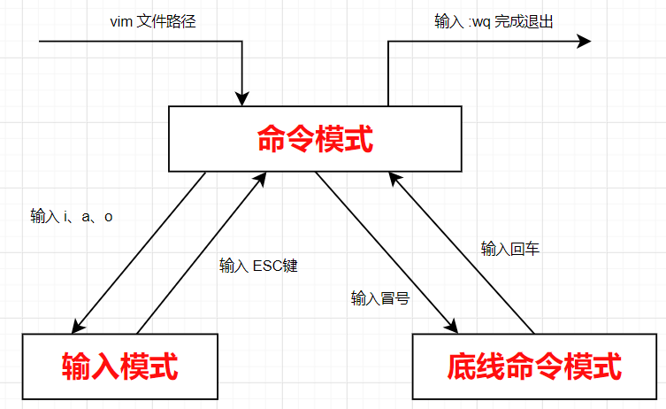
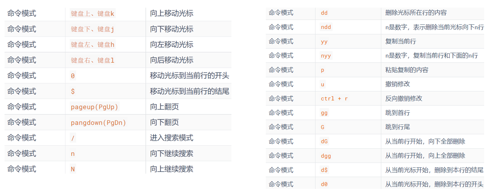
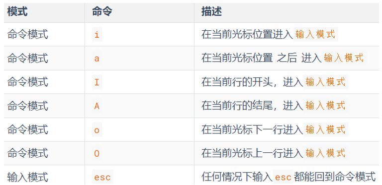
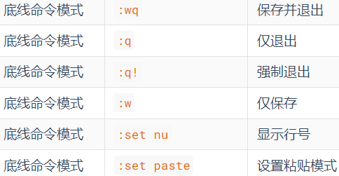

---

# 基本介绍

vi\vim是Linux中最经典的文本编辑器同图形化界面中的 文本编辑器一样

- vi是命令行下对文本文件进行编辑的绝佳选择
- vim 是 vi 的加强版本，兼容 vi 的所有指令，不仅能编辑文本，而且还具有 shell 程序编辑的功能，可以不同颜色的字体来辨别语法的正确性，极大方便了程序的设计和编辑性

# 三种工作模式

| 工作模式     | 特点                                                                                     |
| ------------ | ---------------------------------------------------------------------------------------- |
| 命令模式     | 敲的任何按键编辑器都理解为命令，以命令驱动执行不同的功能。此模型下，不能自由进行文本编辑 |
| 输入模式     | 即编辑模式、插入模式。此模式下，可以对文件内容进行自由编辑                               |
| 底线命令模式 | 以：开始，通常用于文件的保存、退出                                                       |

# 快捷键

## 命令模式

## 命令模式 --> 输入模式

## 底线命令模式

