# 基础知识


# 硬件结构


# 操作系统结构

## Linux内核 vs Windows内核

### 什么是内核？

**内核的基本概念**

计算机由各种外部设备组成，比如：CPU、内存、硬盘等，如果每个应用都要与一个个设备进行通信，就太麻烦，所以需要一个中间人：内核；

内核作为应用与设备之间的桥梁，应用程序只需要关心与内核的交互，不需要关心硬件的细节。

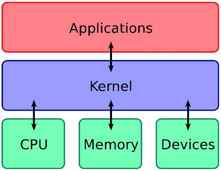

**内核的功能**

- 进程管理：管理进程、线程，决定谁使用CPU；

- 内存管理：管理内存，决定内存的分配和回收；
- 硬件通信：管理硬件设备，为进程与硬件设备之间提供通信能力；
- 提供系统调用：如果程序需要更高权限来运行服务，就需要系统调用；

**内核空间 和 用户空间**

内核具有很高的权限，可以控制CPU、内存、硬盘等硬件；应用程序具备很低的权限。因此大多数操作系统的内存会分为两部分：

- 内核空间：只有内核程序可以访问；
- 用户空间：专门给应用程序使用；

当应用程序需要执行高权限的功能，就可以发起系统调用：

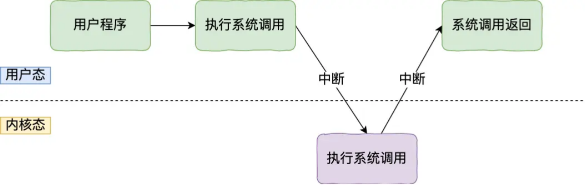

- 内核程序运行在内核态；用户程序运行在用户态；
- 当应用程序发起系统调用，会产生一个中断，CPU会暂停执行当前程序，转为执行中断处理程序，即提供的系统调用，也就是内核程序；
- 内核处理完毕，主动触发中断，把CPU的权限交给用户程序，回到用户态来工作；


### Linux的设计理念【待完成】


### Windows的设计理念【待完成】


# 内存管理


# 进程管理

## 概念 | 进程和线程

### 进程

**基本概念**

概念 | 进程，就是运行中的程序

- 理解进程：

```
我们编写的代码存储在硬盘中，通过编译就会生成二进制的可执行文件；
当我们运行这个可执行文件，他就会被装载到内存中，然后CPU会依次执行其中的每一条指令；

这个运行中的程序，就成为进程
```

- 进程的特点：
  - 独立性：进程是一个能独立运行的基本单位，同时也是系统分配资源和调度的【独立单位】
  - 动态性：进程的实质是程序的一次执行过程，进程是动态产生，动态消亡的
  - 并发性：任何进程都可以同其他进程一起并发执行

---

概念 | 中断，提高CPU的利用效率

```
当程序需要从磁盘中加载数据，加载过程较为缓慢，CPU就只能等待；这样效率较低
就可以在加载数据的时候，让CPU干其他的事情，等到数据加载完成，发出一个【中断】信号，让CPU再回来执行后续的命令
```

---

概念 | 并发和并行


- 并发：在同一时刻，有多个指令在单个CPU上交替执行，同一时刻在微观上的理解是【一个时间跨度很小的时间段内】
- 并行：在同一时刻，有多个指令在多个CPU上同时执行，同一时刻在微观上的理解是【真正的同一个时间点】

---

**进程的控制结构 | PCB**

PCB的概念：

- 在操作系统中，用来描述进程的数据结构，就是PCB（Process Control Block）；
- PCB是进程的唯一标识

PCB包含的内容：

- 进程描述信息：进程标识符，唯一标识一个进程；用户标识符，标识进程归属于哪个用户；
- 进程的控制和管理信息：进程的当前状态；进程的优先级；

- CPU相关信息：CPU各个寄存器的值，方便上下文切换后的重启；

PCB的数据结构：链表

- 将具有相同状态的进程组合在一起；

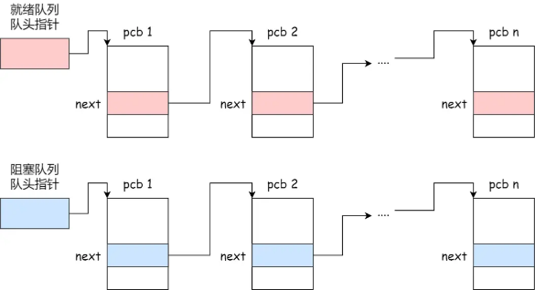

- 进程的状态会变动，链表的数据结构也方便进行创建、删除操作；


### 线程

**基本概念**

线程，是进程中的一条执行流程。

线程特点：

- 独立性：一个进程中的不同线程是独立的，有自己的执行栈和程序计数器，线程是操作系统OS能够进行运算调度的**最小单位**
- 轻量级/共享性：线程的创建和销毁所消耗的资源更少，因为共享了进程的大部分资源
- 并发性：一个进程中可以同时执行多个线程，即多线程程序

**线程的实现**

- 用户线程：在用户空间实现，由用户态的线程库来完成线程管理；
- 内核线程：在内核中实现的线程，由内核管理的线程；
- 轻量级线程：在内核中来支持用户线程；


## 概念 | 进程调度

### 调度时机

在进程的生命周期中，当进程从一个状态变为另一个状态，就会触发一次进程调度。

进程调度的分类：（按照是否对CPU中断做出响应来划分）

- 非抢占式调度：一个进程占用CPU，一直运行到该进程被阻塞或进程结束，才出让CPU的执行权，即不理会CPU的中断信号；
- 抢占式调度：有一个硬件时钟提供周期性的中断，一个进程仅执行固定的时间，时间结束没执行完毕，就会进入挂起状态，换另一个进程执行；


### 调度原则

总结一个字：就是要进程更【快】：

- CPU利用率：确保CPU始终是匆忙的状态；
- 系统吞吐量：提高CPU单位时间内，能够执行完毕的进程数量；
- 周转时间：使得进程的周转时间（进程运行时间 + 阻塞时间 + 等待时间）越短越好；
- 等待时间：进程在就绪队列中的等待时间越短越好；
- 响应时间：用户提交请求到请求被响应的时间，越短越好；


### 调度算法

**（1）先来先服务调度算法**

- 存在一个就绪队列，存储处于就绪状态的进程；
- 每次来一个进程，直到执行完毕；

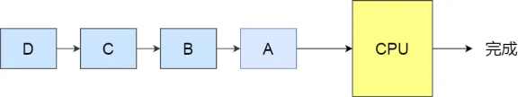

---

**（2）最短作业优先调度算法**

- 有助于提高吞吐量；
- 存在一个长任务进程一直无法执行的可能；

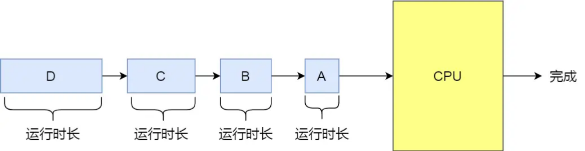

---

**（3）高响应比优先调度算法**

每次进程调度时，选择【响应比】最高的进程来执行；

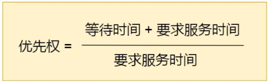

- 如果【等待时间】一致，【要求服务时间】越短，先执行，有助于提高吞吐量；
- 如果【要求服务时间】一致，【等待时间】越长，先执行，能兼顾到等待已久的进程；

---

**（4）时间片轮转调度算法**

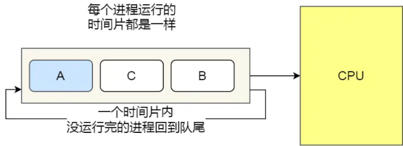

- 时间片设置的太短，容易导致过多的上下文切换；
- 时间片设置的太长，对短任务进程的响应时间就太长；

---

**（5）最高优先级调度算法**

概念：希望CPU从就绪队列中，选择优先级最高的进程执行；

优先级划分：

- 静态优先级：创建进程的时候就指定了，运行中不改变优先级大小；
- 动态优先级：运行过程中，优先级大小会变化。如果进程运行时间增加，优先级降低；如果进程等待时间增加，优先级升高；

调度分类：

- 非抢占式：当就绪队列中出现更高优先级的进程，等待运行完毕当前进程后，再运行优先级最高的进程；
- 抢占式：当就绪队列中出现更高优先级的进程，当前进程挂起，调度执行优先级更高的进程；

不足：

- 优先级低的进程可能永远不会被执行；

---

**（6）多级反馈队列调度算法**

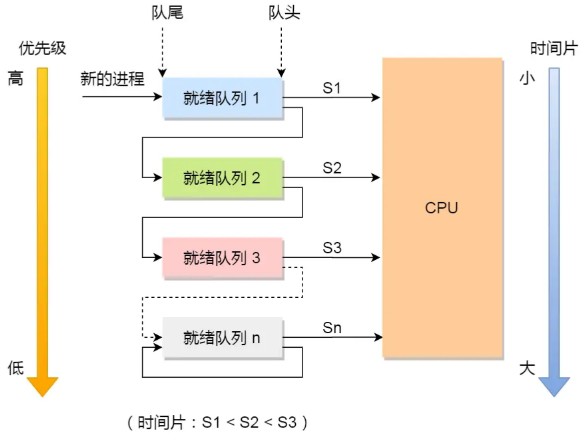

- 新创建的进程进入【最高优先级队列】，对应的CPU执行时间最小；
- 执行完毕后，如果进程没有执行完毕，就进入【低一级】的优先级队列，对应的CPU执行时间略长；
- 按照上述步骤，反复执行，直到进程执行完毕；


## 概念 | 进程间的通信方式

比较对比：

|          | 本质             | 生命周期                                                     | 数据格式           |
| :------: | ---------------- | ------------------------------------------------------------ | ------------------ |
|   管道   | 内核中的一串缓存 | 随进程的创建/消失而创建/消失                                 | 无格式             |
| 消息队列 | 内核中的消息链表 | 随内核，如果没有释放消息队列或者没有关闭操作系统，消息队列一直都在； | 双方可定义数据类型 |
| 共享内存 | 物理内存空间     | 不消失                                                       |                    |
|  信号量  | 数字             |                                                              | 数字               |
|  Socket  |                  |                                                              |                    |
|   信号   |                  |                                                              |                    |

---

**管道**

数据传输特点：

- 单向数据传输；
- 通信效率低，不适合频繁交换数据，且数据大小有限制；

管道分类：

- 匿名管道：通信范围是存在父子关系的进程；

```sh
ps auxf | grep mysql
```

- 命名管道：可以在不相关的进程间通信；

---

**消息队列**

数据传输特点：

- 通信不及时，接收方需要的时候才读取数据；
- 附件大小有限制，不适合大数据的传输；
- 存在用户态和内核态之间的数据拷贝开销：进程写入数据，涉及用户态->内核态；进程读取数据，涉及内核态->用户态；

---

**共享内存**

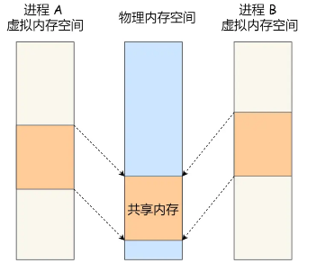

数据传输特点：

- 避免了数据在用户态和内核态之间的拷贝；
- 即使虚拟内存地址相同，如果映射到不同的物理内存地址，双方的增删改查也不会有影响；

---

**信号量**

数据传输特点：

- 不发生数据传输，仅涉及到公共变量（整数类型）的修改；
- 用于实现进程间的互斥与同步，提供一种多线程环境下，保护数据安全的机制

---

**Socket**

数据传输特点：

- 可以跨网络和不同主机上的进程之间通信；也支持同一主机上的不同进程间通信；

---

**信号**

用途：用于进程间的事件通知，而非数据传输；是**进程间唯一的异步通信机制**

信号分类：

- `SIGINT`信号：终止该进程，信号来源：键盘输入`Ctrl+C`
- `SIGSTOP`信号：暂停进程的执行；
- `SIGCONT`信号：恢复进程的执行；
- `SIGKILL`信号：强制终止进程，信号来源：`Kill -9 PID`
- ......

用户对信号的处理方式：

- 默认操作：每个信号都对应一个默认操作；
- 捕捉信号：接受到信号后，执行相应的自定义的信号函数；
- 忽略信号：当不希望执行信号对应的操作时，就可以忽略该信号，不做任何处理；

有的信号无法被忽略和捕捉，只能执行默认操作，比如：SIGKILL和SIGINT


## 应用 | 多线程冲突

**基本概念**

互斥：

- 在多线程/进程操作共享资源的时候，保证只有一个线程/进程能得到该资源；
- 示例：操作A 和 操作B 不能在同一时刻执行；

同步：

- 并发线程/进程在一些关键点上可能需要互相等待与互通消息，这种互相制约的关系就是进程/线程同步；
- 示例：操作C必须等待操作A、操作B执行完毕后才能执行；

---

**相关实现**

互斥：锁

同步：信号量


## 应用 | 常见的锁

**互斥锁与自旋锁**

|                      | 互斥锁                 | 自旋锁                                        |
| -------------------- | ---------------------- | --------------------------------------------- |
| 加锁失败后的动作     | 释放CPU，让给其他线程  | 忙等待（不出让CPU），持续尝试获取锁，直到成功 |
| 加锁失败后的线程状态 | 进入阻塞状态，切换线程 | 保持活跃                                      |
| 适用场景             | 临界区较大             | 临界区较小                                    |

【补充】：

临界区：

- 临界区就是共享资源，即需要同步的操作；
- 如果临界区很大，即同步操作的时间很长，加锁成功的线程不会出让CPU，对应自旋锁的话，就需要一直让CPU空转，无意义且消耗CPU资源；

---

**读写锁**

工作原理：

- 【写锁】被持有，其他线程获取【写锁】、【读锁】都会被阻塞；
- 【写锁】没有被持有，其他线程获取【读锁】无影响，可以极大程度提高并发量；

分类：

- 读优先锁：当【读锁】被持有后，其他线程有的获取【读锁】，有的获取【写锁】，只有还有线程在获取【读锁】，获取【写锁】的线程就会一直阻塞；
- 写优先锁：当【读锁】被持有后，来了获取【写锁】的线程会被阻塞，来了获取【读锁】的线程也会被阻塞，直到【读锁】释放，线程优先获取【写锁】

两种类别的读写锁，都会出现“线程饥饿”的现象。为了避免这种情况，可以使用“公平读写锁”，来避免线程饥饿。

---

**乐观锁和悲观锁**

- 悲观锁：假定共享资源总是会被人修改，所以先获取锁资源，再进行修改操作；
- 乐观锁：假定共享资源不会经常被人修改，所以先把共享资源拿到内存中修改，然后判断这段时间有没有其他线程修改共享资源：如果没有，就提交修改；如果有，就放弃修改。


## 应用 | 线程崩溃导致进程崩溃

现象：

- 在C++中，线程的崩溃会导致进程的崩溃；
- 在Java中，线程的崩溃并不会导致进程的崩溃（比如JVM进程）；

---

分析 | 线程崩溃导致进程崩溃的原因

- 线程共享进程的代码段、数据段、地址空间、打开文件等，线程拥有自己的寄存器、栈等；

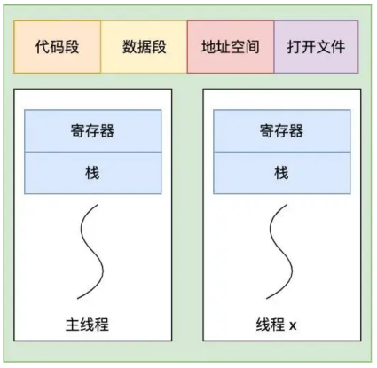

- 如果线程对地址空间进行了非法访问，就会导致内存的不确定性，进而可能影响到其他的线程，所以操作系统就会让进程也崩溃掉；

一些非法访问的操作：

- 只读内存中写入数据；
- 访问了没有访问权限的地址空间；
- 访问了不存在的内存；

---

分析 | 进程崩溃的过程：信号机制

Linux中可以通过`Kill -9 PID`的命令来终止进程，这背后的机制就是信号。整体的过程如下：

- CPU执行正常的进程指令；
- 用户调用Kill指令，向特定的进程发出信号；
- 进程收到操作系统发来的信号，CPU暂停当前进程执行，将控制权交给操作系统；
- 操作系统根据情况，执行对应的信号处理函数（默认是退出进程）；

---

分析 | Java中线程崩溃不会导致JVM崩溃的原因

因为JVM自定义了对应的信号处理函数，没有让进程崩溃。


# 调度算法

## 进程调度算法

在进程管理章节有所介绍。


## 内存页面置换算法

### 什么是【缺页中断】

> 缺页中断也叫缺页异常

当CPU访问的页面不在物理内存时，就会产生一个缺页中断，来请求操作系统将缺页调入到物理内存。

缺页中断 vs 一般中断：

- 缺页中断：在该指令【执行期间】产生并处理；中断返回后，重新执行该指令；
- 一般中断：在该指令【执行结束】后检查和处理中断；中断返回后，执行该指令的下一条指令；


### 缺页中断的处理流程

流程：

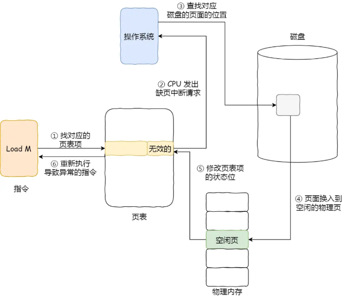

【页表】的基本组成：


- 状态位：标识该页是否在物理内存中；
- 访问字段：记录该页在一段时间内的访问次数；

- 修改位：标识该页在调入内存后是否被修改过；
- 硬盘地址：指出该页在硬盘上的地址，通常是物理块号，供调入该页时使用；


### 相关页面置换算法

**（1）最佳页面置换算法**

思路：置换在【未来】最长时间不访问的页面。即算法需要计算内存中每个逻辑页面的下一次访问时间，然后比较，选择最长不访问的页面置换；

特点：很理想但是无法实现，程序访问页面是动态的，无法预知下一个页面的访问时间；

用途：是一个标杆，用来衡量页面置换算法的效率，如果其他页面置换算法的效率跟最佳页面置换算法接近，就说明算法是高效的。

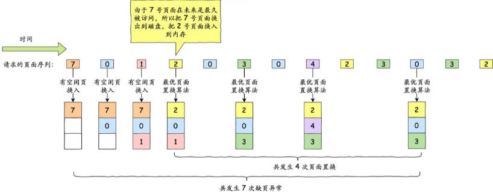

**（2）先进先出置换算法**

思路：置换在内存中停留最久的页面，即先入先出原则；

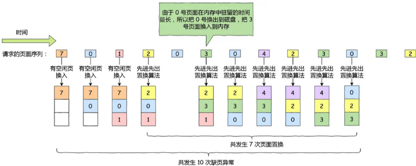


**（3）LRU置换算法**

思路：根据历史访问，选择最长时间没有被访问的页面进行置换；

特点：理论可行但是实现代价高，需要在内存中维护一个所有页面的链表，每次访问内存都要更新整个链表。实际很少使用该算法。

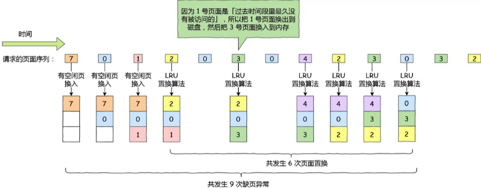

**（4）时钟页面置换算法**

思路：跟LRU近似，又是对FIFO的改进

原理：

- 将所有的页面保存在一个类似钟面的【环形链表】中，有一个表指针，指向最老的页面；
- 当发生缺页中断：
  - 算法检查指针指向的页面：访问位=0，淘汰该页面，换入新页面；访问位=1，清除访问位为0，顺时针指向下一个页面；
  - 重复上述操作，直到找到访问位=0的页面；

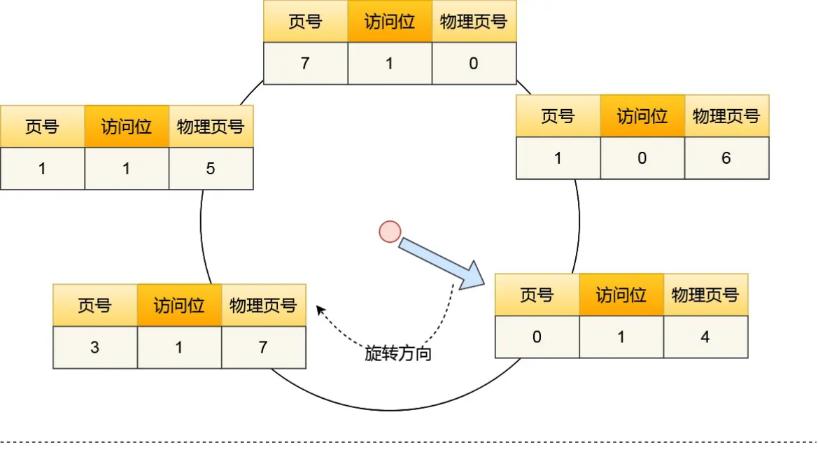

**（5）LFU置换算法**

思路：LFU原理，当发生缺页中断的时候，选择访问次数最少的页面进行淘汰置换；

特点：

- 需要增加一个计数器，硬件成本较高，并且要维护一个访问链表；
- 常规LFU只考虑了频率，没有考虑时间，即一个页面在很久前被高频访问，但是最近没有被访问，该页面也可能一直留存在物理内存中，所以可以借鉴Redis中的LFU优化思路：页面不访问，计数器的值就会衰减，防止居高不下；页面被访问，计数器的值就会增加；


## 磁盘调度算法

### 概述 | 磁盘的结构

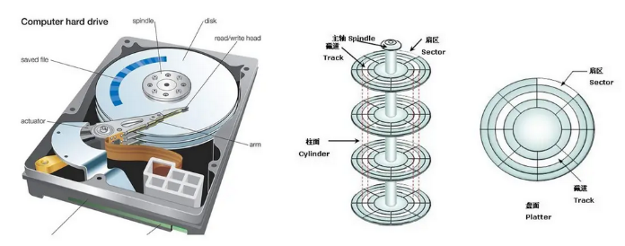

左图就是机械磁盘的样子，中间圆的部分是【磁盘的盘片】，一般有多个；

每一个盘片的盘面都有自己的【磁头】；每个盘面上有多个【环形磁道】；每个磁道分为多个【扇区】，每个扇区是512字节；

每个盘片中编号相同的磁道会形成一个圆柱，称为【磁盘的柱面】；


### 学习 | 相关调度算法

> 磁盘调度算法的目的很简单，提高磁盘的访问性能。

**（1）先来先服务调度算法**

思路：先来的请求，先访问；

特点：简单粗暴，如果大量进程来访问磁盘，访问位置会比较分散，该算法的效率会很低；

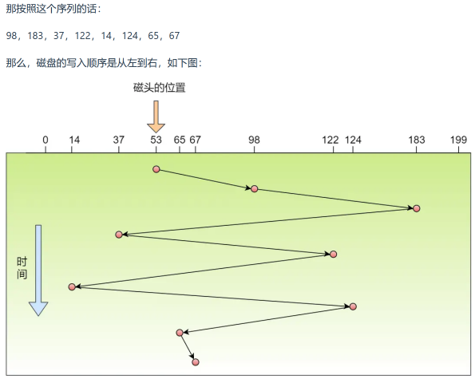

**（2）最短寻道时间优先调度算法**

思路：请求列表中，每次访问的请求都是距离磁头所在位置最近的请求；

特点：可能造成饥饿现象，每次都来新的请求，位置比183小，就会造成183位置的请求一致不被访问；

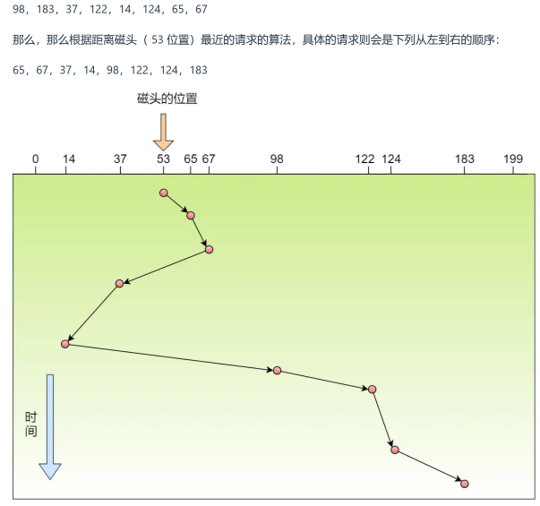

**（3）扫描算法**

思路：磁头按一个方向扫描，扫描到尽头，然后反向扫描；

特点：避免了饥饿现象，但是不同位置的磁道访问频率不同，中间的磁道会比较占便宜；

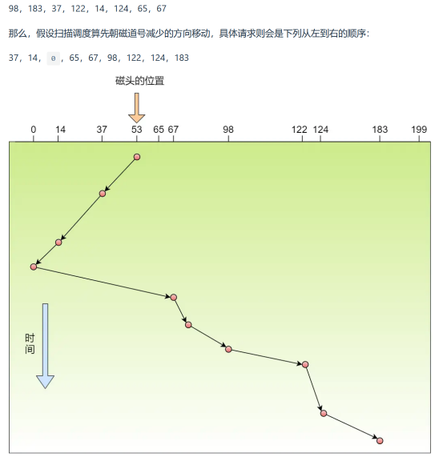

**（4）循环扫描算法**

思路：解决扫面算法的访问频率问题，磁头仅朝一个方向扫描，到尽头后进行复位（过程很快），复位期间不响应请求；

特点：对各个磁道的响应频率比较平均；

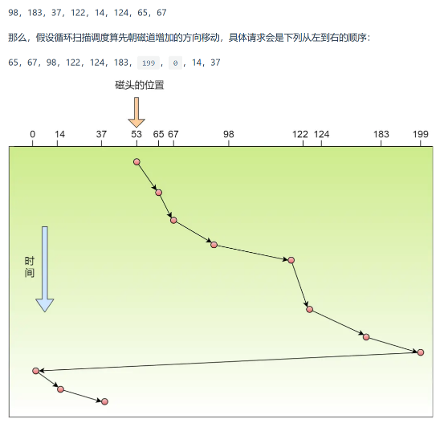

**（5）LOOK算法 与 C-LOOK算法**

LOOK算法：对扫描算法的优化

| 扫描算法                 | LOOK算法                         |
| ------------------------ | -------------------------------- |
| 磁头沿着一个方向走到尽头 | 磁头沿着一个方向，走到请求的尽头 |
| 反向扫描，响应请求       | 反向扫描，响应请求               |

C-LOOK算法：对循环扫描算法的优化

| 循环扫描算法                   | C-LOOK算法                                       |
| ------------------------------ | ------------------------------------------------ |
| 磁头沿着一个方向走到尽头       | 磁头沿着一个方向，走到请求的尽头                 |
| 复位到起点，复位过程不响应请求 | 复位到该方向上请求的最边缘点，复位过程不响应请求 |


# 文件系统

## 框架 | 文件系统的基本概念

**什么是文件系统**？

文件系统就是操作系统中负责管理持久数据的子系统，负责把用户的文件持久化到磁盘中。

---

**文件系统的分类**？

Linux中支持的文件系统不少，根据存储位置的不同，可以分为：

- 磁盘的文件系统：直接把数据存储在磁盘中；
- 内存的文件系统：占用内存空间来存储数据；
- 网络的文件系统：用来访问其他计算机数据，比如NFS、SMB等；

---

**文件系统的基本单位**？

文件系统的基本数据单位是【文件】，文件系统就是对磁盘上的文件进行组织管理。组织的方式不同，就会形成不同的文件系统。

Linux中【一切皆文件】，无论是普通的文件和目录，还是设备、管道、Socket等，都是统一交给文件系统来管理。

---

**Linux中文件的组成**？

Linux文件系统给每个文件分配2个数据结构：

（1）索引节点，inode：

- 记录文件的元数据（索引节点编号、文件大小、访问权限、创建时间、修改时间等）；
- 索引节点是文件的【唯一】标识，他们之间一一对应；
- 索引节点也是存储在【磁盘】中，占据一定磁盘空间；

（2）目录项，dentry：

- 记录文件的名字、索引节点指针、与其他目录项的层级关系；多个目录项关联起来，就形成了目录结构；
- 频繁从磁盘查询目录效率很低下，所以内核会把读过的目录用【目录项】这个数据结构缓存在内存中；
- 目录项是由内核维护的数据结构，【不存放在磁盘，而是存放在内存】；

---

**索引节点、目录项、文件数据的图示**

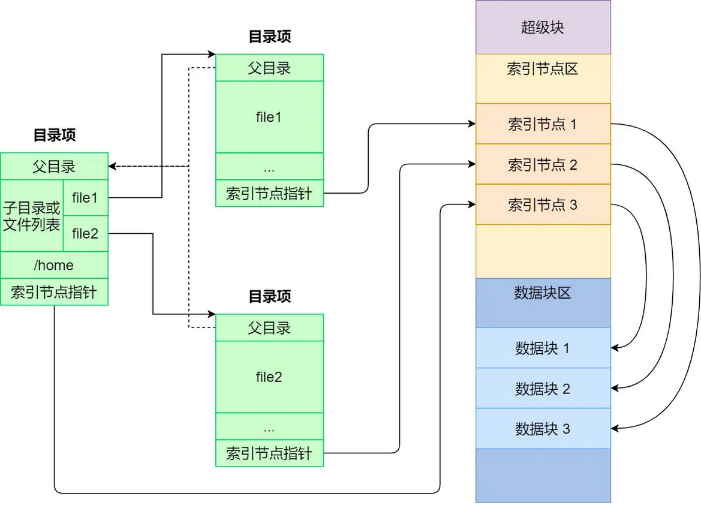

（1）磁盘格式化的时候会被分为3个存储区域：

- 超级块：存储文件系统的详细信息，比如块个数、块大小、空闲块等；【当文件系统挂载时，载入内存】

- 索引节点区：用来存储索引节点；【当文件被访问时，载入内存】
- 数据块区：用来存储文件或目录数据；

---

==【八股】目录和目录项的区别？==

存储位置：

- 【目录】是个文件，持久化在磁盘中；
- 【目录项】是个数据结构，由内核维护，出现在内存中；

相互关系：

- 查询目录需要从磁盘中读取，如果频繁查询，效率就很低；所以内核把读过的目录用目录项缓存在内存中，提高后续的访问效率。


## 框架 | 虚拟文件系统

**为什么需要虚拟文件系统**？

文件系统种类众多，操作系统希望提供统一的接口，来屏蔽不同文件系统间的差异；

在用户层与文件系统中间引入一个中间层，就是虚拟文件系统（Virtual File System）；

---

**图示（用户空间、内核空间、文件系统、虚拟文件系统）**

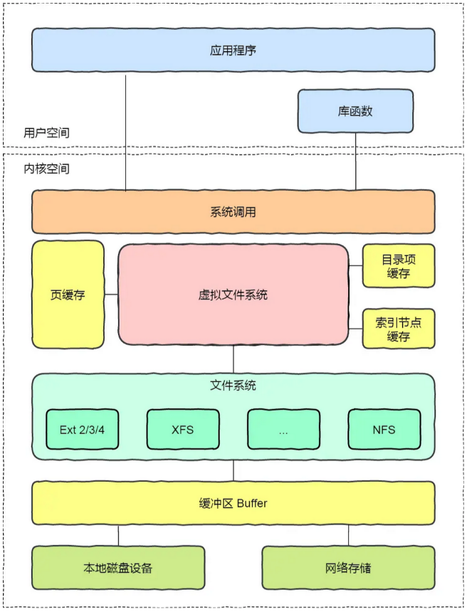


# 设备管理


# 网络系统

## 零拷贝

> [参考文章](https://xiaolincoding.com/os/8_network_system/zero_copy.html#%E4%B8%BA%E4%BB%80%E4%B9%88%E8%A6%81%E6%9C%89-dma-%E6%8A%80%E6%9C%AF)

### 演进 | 传统数据传输 + DMA

==【八股】DMA技术出现前后，IO读取文件的过程有什么区别？==

（1）DMA技术出现前，IO读取文件的过程：

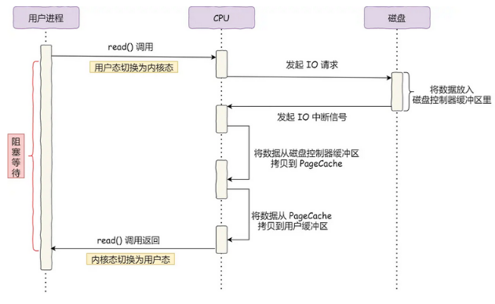

特点：

- CPU全程参与数据从磁盘到用户进程的copy过程；
- IO操作非常占用CPU资源，这个过程中CPU无法做其他的事情；

---

（2）DMA技术出现后，IO读取文件的过程：

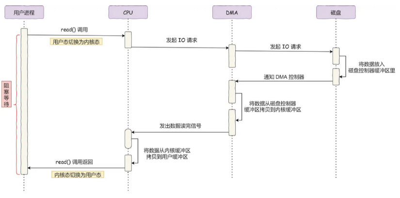

概念：

- DMA：Direct Memory Access，直接内存访问；
- DMA技术：在进行IO设备（磁盘）与内存的数据传输时，数据搬运的工作交给DMA控制器来执行，从而代替CPU，使得CPU可以处理别的事务；

特点：

- CPU不再参与数据从【磁盘控制器缓冲区】搬运到【内核空间】的工作，这部分交给DMA来完成；
- CPU仅仅负责【在用户线程执行read()调用的时候，向DMA发起IO请求】以及【将已经拷贝到内核缓冲区的数据拷贝到用户缓冲区】

---

==【八股】传统的文件传输方式？向服务端获取文件数据==

整体思路：

- 服务端将数据从磁盘加载到内存中；
- 通过网络协议，将数据发送给客户端；

存在的系统函数调用：

```c
read(file, tmp_buf, len);
write(socket, tmp_buf, len);
```

图解过程：

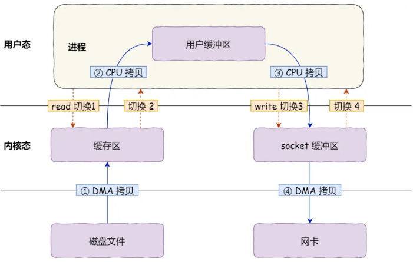

- 用户态与内核态的切换次数：4次；
- 同一份数据，总共的拷贝次数：4次（2次DMA拷贝；2次CPU拷贝）；

该过程可以有如下的优化空间：

- 减少用户态和内核态的切换次数；
- 减少数据的拷贝次数；


### 演进 | 零拷贝技术：mmap+write

==【八股】什么是零拷贝技术？==

> 零拷贝技术可以优化传统文件传输方式的效率，通过减少用户态和内核态的切换次数以及减少数据的拷贝次数；
>
> 有两种实现方式：
>
> - mmap + write
> - sendfile


存在的系统函数调用：

```
buf = mmap(file, len);
write(sockfd, buf, len);
```

图解过程：

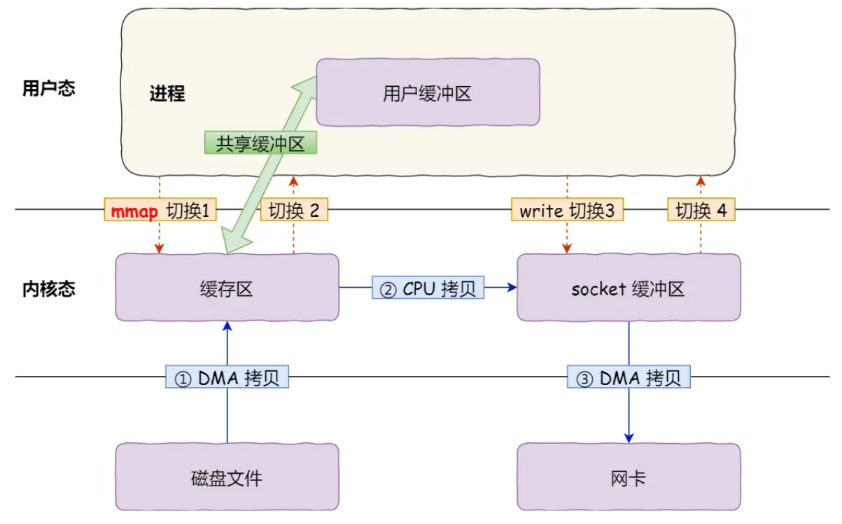

- `mmap`：可以将【内核缓冲区】的数据映射到用户空间，就不需要在进行拷贝操作；
- 该方法可以减少一次数据拷贝的操作，但效率还有待提高；

---

==【八股】内存映射文件mmap的原理和优点？==

概念：

- mmap是一种将文件内容直接映射到进程的虚拟内存空间的机制；
- 通过这种方式，应用程序可以像访问内存一样直接读写文件，省去了调用I/O函数进行文件操作的开销；

原理：

（1）文件和内存的映射

- 操作系统将磁盘文件的部分内容映射到进程的虚拟内存地址空间中，文件内容被直接加载到内存页中；

- 当进程访问内存页时，操作系统就会将对应的内容部分加载到内存，或是将修改后的内存内容写回文件；

（2）分页机制

- 操作系统将文件分为多个页，通过虚拟内存机制，这些页可以动态的加载、刷新或释放；
- 通过分页机制，mmap可以有效的处理大文件，只在需要的时候将内容加载到内存，节省空间；

（3）同步机制

- 文件映射若是私有的，对文件的修改只有当前进程可见，且不会写回到文件；
- 文件映射若是公有的，对文件的修改会影响所有对文件进行映射的进程，并会将对应修改写回到磁盘上；
- 也可通过`msync()`等函数主动进行数据同步；

优点：

- 减少拷贝：减少了内核空间和用户空间之间的数据拷贝；
- 内存共享：不同进程可以共享同一个文件的内存页，避免了额外的数据共享开销；

- 支持随机访问：对于大型文件的修改也更得心应手；


### 演进 | 零拷贝技术：sendfile

**（1）sendfile**

存在的系统函数调用：

```c
#include <sys/socket.h>
ssize_t sendfile(int out_fd, int in_fd, off_t* offset, size_t count);
```

图解过程：

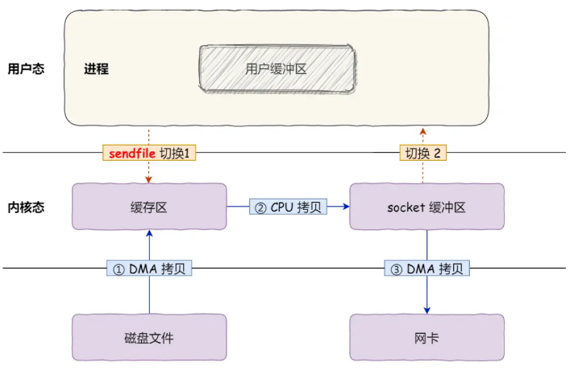

- `sendfile`：将用户态和内核态的切换次数减少至2次；

---

**（2）sendfile + SG-DMA技术**

图解过程：

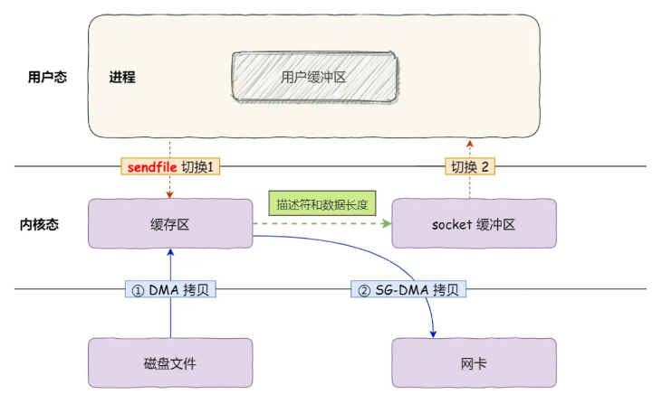

- DMA拷贝操作：将数据从磁盘拷贝到内核缓冲区，并把描述符和数据长度发送至socket缓冲区；
- 网卡的SG-DMA控制器：可以根据描述符和数据长度，从内核缓存区中将数据拷贝到网卡；

---

**总结：零拷贝技术**

- 没有在CPU层面进行数据拷贝，所有的拷贝过程均有DMA来完成；
- 对比传统的数据传输方式：内核态和用户态的切换次数减少一半，数据的拷贝次数减少一半，整体的数据传输效率能提高一倍；

| 方法                          | 涉及的方法           | 用户态和内核态切换次数 | 数据拷贝次数 |
| ----------------------------- | -------------------- | ---------------------- | ------------ |
| 传统的文件数据传输            | `read() + write()`   | 4                      | 4            |
| 零拷贝：`mmap` + `write`      | `mmap()` + `write()` | 4                      | 3            |
| 零拷贝：`sendfile`            | `sendfile()`         | 2                      | 3            |
| 零拷贝：`sendfile` + `SG-DMA` | `sendfile()`         | 2                      | 2            |


### 对比 | SG-DMA vs DMA

==【八股】SG-DMA技术比DMA技术厉害在什么地方？==

支持数据的分散和聚集传输：

- 传统DMA：一般只能进行线性的数据传输，即从一块连续的内存地址中读取数据，然后写入到另一个连续的内存地址中；限制了数据传输的灵活性
- SG-DMA：支持分散 和 聚集 传输，可以从多个不连续的内存块中读取数据，并将数据写入到多个不连续的内存块；使得数据传输更灵活，能够处理复杂的数据结构

提高内存使用效率：通过分散和聚集传输，SG-DMA技术可以减少内存碎片，优化内存使用；

---

==【八股】为什么零拷贝需要设备支持SG-DMA？==

如果是DMA技术，就需要将数据拷贝至连续的内存空间，就避免不了往用户态拷贝；

如果是SG-DMA技术，就可以将数据从不连续的内存空间拷贝，就可以


### 概念 | PageCache的作用

概念：

- 将磁盘数据拷贝至【内核缓冲区】，就是PageCache（磁盘高速缓存）；
- 零拷贝技术就是用了PageCache，来提升性能，将【磁盘读写】改为【内存读写】；

优点：

- 缓存最近访问的数据

```
问题：内存空间远比磁盘空间小，注定只能拷贝磁盘中的部分数据，那么拷贝哪些数据呢？

分析：程序运行具有【局部性】，刚被访问的数据，再次访问的概率较大；

操作：PageCache就缓存最近被访问的数据。读磁盘的时候，优先在PageCache中找，找不到的话再从磁盘中读取，放入PageCache；
```

- 预读功能

```
问题：读磁盘数据的时候，需要找到数据的位置，对于机械磁盘来说，是通过磁头需按照到数据所在的扇区，再开始顺序读取数据。这个旋转的物理操作比较耗时；

分析：为了减少旋转这个物理操作的影响，就需要减少该动作。

操作：数据预读。
	- read()方法调用每次只会读取32kb的数据，但是内核会把32-64kb的数据也读取到pageCache中；
	- 这样读取后续数据，磁头就不需要旋转，数据读取成本就会很低；
```

使用场景：

- 小文件数据传输的场景；
- 针对大文件数据传输的场景，不太适用；

```
一方面：文件太大，某些部分的文件数据被再次访问的概率较低；

另一方面：文件太大，大量占用了PageCache的空间，其他的一些【热点】小文件，就没法利用PageCache；
```


### 概念 | 大文件传输数据的方式

通过【异步IO】+【直接IO】的方式来实现：

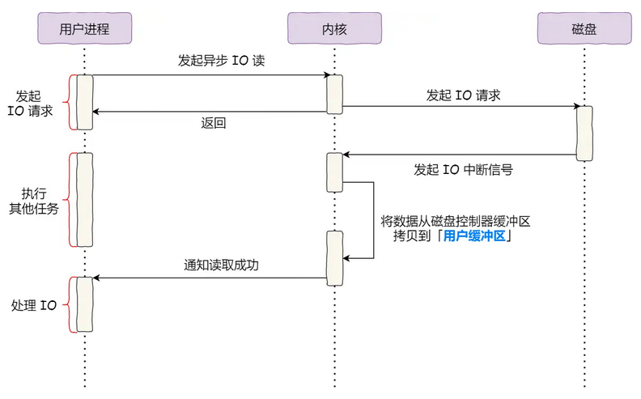

- 异步IO：解决阻塞问题；
- 直接IO：绕过PageCache，直接将数据从【磁盘】拷贝至【用户缓冲区】；


### 八股 | 相关细琐的知识点

==【八股】Linux中的read()、write()调用，返回值是什么？==

`read()调用`：

| 状态 | 结果                       | 补充                                                         |
| ---- | -------------------------- | ------------------------------------------------------------ |
| 成功 | 返回实际读取的字节数       | 结果可能 < 请求读取的字节数。原因：（1）到达文件末尾；（2）可用数据少于请求的字节数； |
|      | 返回0                      | 表示读取文件时已到达文件末尾，没有读取到数据                 |
| 失败 | 返回-1 + 设置errno错误类型 | `EINTR`：调用被信号中断；<br />`EFAULT`：缓冲区指针无效；<br />`EBADF`：文件描述符无效 |

`write`调用：

| 状态 | 结果                        | 补充                                                         |
| ---- | --------------------------- | ------------------------------------------------------------ |
| 成功 | 返回实际写入的字节数        | 结果可能 < 请求写入的字节数。原因：设备不允许一次写入这么多数据 |
| 失败 | 返回 -1 + 设置errno错误类型 | `EPIPE`：写入到已关闭的通道或套接字；`EFAULT`：缓冲区指针无效；`EBADF`：文件描述符无效 |

---

`mmap()调用`：

| 状态 | 结果                                             | 补充 |
| ---- | ------------------------------------------------ | ---- |
| 成功 | 返回映射区域的起始地址，即一个指向映射内存的指针 |      |
| 失败 | 返回`MAP_FAILED` + 设置errno来指示具体错误       |      |

`sendfile()`调用：

| 状态 | 结果                        | 补充                                                    |
| ---- | --------------------------- | ------------------------------------------------------- |
| 成功 | 返回实际传输的字节数        | 结果可能 < 请求传输的字节数。原因：读取的文件到达末尾； |
| 失败 | 返回 -1 + 设置errno错误类型 |                                                         |


## IO多路复用

### 演进 | 基本的Socket通信

概念：

- 服务端和客户端想要通信，就必须使用Socket编程；
- 他是进程间通信中，比较特殊的一个方式，能够实现跨主机通信；

图解过程：

|   服务端   |   客户端    | 补充描述                                                     |
| :--------: | :---------: | ------------------------------------------------------------ |
| `socket()` | `socket()`  | 创建socket的时候，可以指定网络协议（IPv4 or IPv6）；指定传输协议（TCP连接）； |
|  `bind()`  |             | 给该socket绑定IP地址 + 端口号，服务端就可以通过该IP+端口号接受客户端的连接请求； |
| `listen()` |             | 调用该函数，监听客户端的连接；                               |
| `accept()` | `connect()` | 服务端通过调用accept()函数，从内核中获取连接，如果没有连接，则进入阻塞状态；<br />客户端若建立好socket，通过connect()函数发起连接，需要指明IP+端口号，进入后续的TCP三次握手； |
|  `read()`  |  `write()`  | 相互传输数据：客户端向服务端传输；                           |
| `write()`  |  `read()`   | 相互传输数据：服务端向客户端传输；                           |

补充：

- TCP连接过程中，服务器的内核会为每个Socket维护两个队列

```
一个是【还没完全建立】连接的队列，称为【TCP半连接队列】，服务端处于syn_rcvd的状态，没有调用accept()函数，来处理客户端的连接；

一个是【已经建立】连接的队列，称为【TCP全连接队列】，服务端处于established的状态；
	- 当服务端调用accept()函数，就会从【TCP半连接队列】中取一个客户端连接，然后服务端生成一个新的套接字，用于和该客户端通信；
	- 建立TCP三次握手后，将该socket套接字放入【TCP全连接队列】；
```

- 服务端的socket套接字，仅起到监听的作用，不用于实际的数据传输；

```
对于客户端的连接请求，服务端会通过accept()函数，从内核中的TCP全连接队列里拿一个已经完成连接的socket返回应用程序，后续数据传输就用这个socket
```

- 客户端的socket套接字，不仅起到建立连接的作用，也负责传输数据；

---

**如何服务更多的用户**？

现状：

- 最简单的socket套接字方式建立连接是最简单的；
- 它只能一对一通信；而且是同步阻塞的方式，当服务端没有处理完一个客户端的IO时，其他客户端无法与服务端建立连接；

怎么提高效率：

- 改进服务器的网络IO模型；


### 演进 | 多进程/线程

==【八股】多进程的IO模型？==

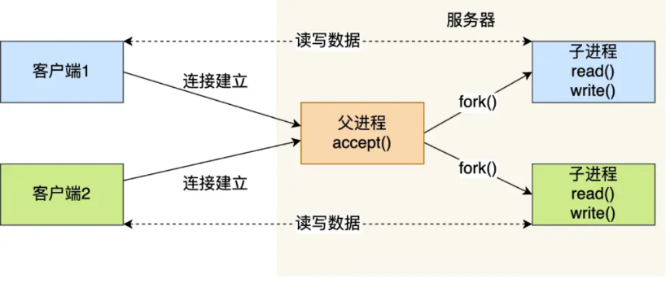

服务器的主进程（父进程）：

- 负责监听客户端的连接，一旦连接完成，accept()函数会返回一个【已连接的socket】；
- 通过fork()函数创建一个子进程，即将父进程的所有数据复制一份，包括：文件描述符、内存空间地址、程序计数器、执行的代码等；
- 刚创建子进程的时候，父子进程内容是一致的，通过fork()函数的返回值来判断谁是父进程，谁是子进程

```
父进程中，fork()函数的返回值是子进程的PID（进程ID），是一个正数；如果fork()失败，比如系统资源不足，会返回-1；

子进程中，fork()函数的返回值是0，表示他是子进程；
```

- 仅需要关心【监听】操作，不需要关心后续【数据传输】

服务器的子进程：

- 仅需要关心【数据传输】，不需要关心监听操作；
- 当子进程退出的时候，内核中还是会保留该进程的一些信息，需要做好回收工作，不然就会变成僵尸进程；

---

模型不足：

- 当连接数较少时，还能应付过来；一旦连接数上来，每次都要新建一个进程，资源占用较大，性能会大打折扣；
- 进程的上下文切换比较耗时；

---

==【八股】IO的多线程模型？==

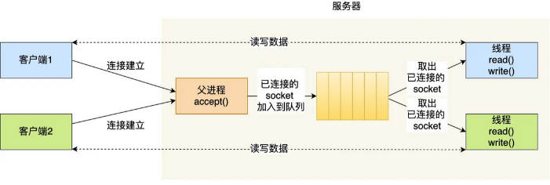

对比多进程模型的提升：

- 减少上下文切换的消耗；
- 通过池化技术，创建线程池，来减少线程创建销毁带来的资源开销；
- 通过创建队列，来存放已经建立连接的socket套接字。队列是全局的，所以线程从队列中获取socket套接字的时候，需要加锁；

---

服务器的父进程：

- 负责建立连接，建立完成后，将socket套接字放入全局队列；
- 若无线程池，是通过`pthread_create()`函数创建线程；有线程池的情况下，就可以避免线程的频繁创建与销毁；

服务器的子线程：

- 服务端与客户端的通信是放在线程中来完成；

---

模型不足：

- 当连接数上来后，N个连接就对应N个线程；或者就固定的线程，当线程满了，就阻塞其他的客户端连接；
- 效率还是不够高；

---

==【八股】IO多路复用？==

概念：

- 既然为一个socket套接字分配一个进程/线程的方法不合适；能不能用一个进程处理多个socket套接字？
- 假设一个进程每处理一个套接字的时间控制在1ms，那么一个进程1s就可以处理1k个套接字；

相关实现：

- `select` / `poll`
- `epoll`


### 演进 | IO多路复用：select/poll、epoll

==【八股】讲述一下select / poll实现IO多路复用的原理？==

| 步骤                                                         | select                  | poll                         |
| ------------------------------------------------------------ | ----------------------- | ---------------------------- |
| 将已连接的socket放入文件描述符集合；                         | 使用固定长度的`BitsMap` | 使用动态数组，以链表形式组装 |
| 调用select函数：                                             | -                       | -                            |
| -  将上述集合拷贝至内核，内核通过【遍历】的方式来检查是否有网络事件产生，对于检测到的socket，标记为可读或者可写； | -                       | -                            |
| -  再把整个集合拷贝至用户态，用户态通过【遍历】的方式，找到可读或者可写的socket，然后再处理； | -                       | -                            |

- `BitsMap`所支持的文件描述符个数有限，受到内核中`FD_SETSIZE`的限制，默认最大值为1024；
- 动态数组突破了文件描述符的个数限制，但还是会受到系统文件描述符的限制；

这两种方法没有本质的区别，都是通过【线性结构】来存储socket集合，随着并发上来，性能的损耗会呈指数级增长；

---

==【八股】epoll实现IO多路复用？==

大概用法：

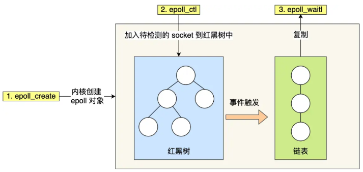

```c
int s= socket(AF_INET, SOCK_STREAM, 0);
bind(s, ...);
listen(s,...);

int epfd = epoll_create(...);		// 建立与内核的连接
epoll_ctl(epfd, ...);				// 注册事件

while(1){
    int n = epoll_wait(...)			// 阻塞用户进程，等待IO事件
    for(接收到数据的socket){
        // 处理
    }
}
```

对于select / poll 的改进：

（1）高效的数据结构--红黑树：

- 在内核中使用红黑树来跟踪待检测的文件描述符（通过`epoll_ctl()`函数实现）；
- 因为内核中维护了一个红黑树的数据结构，所以`epoll_ctl()`函数的传参是【待检测的socket集合】，而不是所有的文件描述符，也就避免了数据的拷贝；

（2）基于事件驱动的机制：

- 基于事件驱动，内核维护了一个链表来记录就绪的事件；即当某个socket有事件发生的时候，通过回调函数，将其加入就绪列表；
- 当用户调用`epoll_wait()`函数时，仅返回有事件发生的文件描述符的个数，就不需要通过【遍历】的方式来获取结果；

---

`epoll`的两种事件触发方式：

|          | 水平触发                                                  | 边缘触发                                                     |
| -------- | --------------------------------------------------------- | ------------------------------------------------------------ |
| 触发条件 | socket满足状态条件，`epoll`会不断报告事件，直到事件被处理 | socket发生状态变更时，`epoll`才报告事件，且只报告一次        |
| 调用频率 | 只要没处理，`epoll_wait()`调用时，会不断报告该事件        | 事件没处理，后续`epoll_wait()`调用时，不会再报告该事件       |
| 编程模型 | 较为简单                                                  | 更加复杂，需要防止事件遗漏                                   |
| 使用场景 | 较为简单的IO操作和较少的并发连接                          | 高并发和高性能的场景，可以减少`epoll_wait()`的调用，减少开销 |

---

对比：

- select / poll：仅支持水平触发；
- epoll：默认水平触发，可设置边缘触发；

```
若设置边缘触发，尽量搭配非阻塞IO使用，原因如下：

- 边缘触发只报告一次，为了防止事件遗漏，尽可能使用循环的方式来获取事件；
- 假设使用了阻塞IO，那么没有数据可读写的时候，程序就会阻塞，无法继续执行；
```


## 高性能网络模式：Reactor和Proactor

### 概念 | Reactor模式

基本概念：

- **Reactor是一种设计模式**：是一种高效的网络IO模型。高效的本质是：IO多路复用，常规的IO多路复用是面向过程编程的，实现比较麻烦，所以大佬们对此使用面向对象的思想进行封装，就叫Reactor模式；

- **Reactor使用面向对象的思想**：对多路复用的复杂性进行了抽象和封装，将【事件的监听】和【事件的处理】解耦，由【Reactor】负责管理事件的分发，由【不同的处理器对象】处理具体的事件，使得代码更容易扩展和维护；
- **Reactor的核心是【事件驱动】**：通过回调机制来处理不同的事件：当某个socket上有事件发生时，Reactor调用相应的事件处理器（回调函数或对象方法），执行具体的逻辑；
- **Reactor是灵活多变的**：根据Reactor的数量和事件处理器的数量，有多种实现：

| Reactor数量 | 事件处理器数量 | 补充                         |
| ----------- | -------------- | ---------------------------- |
| 单一        | 单一进程/线程  |                              |
| 单一        | 多进程/线程    |                              |
| 多          | 单一进程/线程  | 复杂且无优势，相当于将多兵少 |
| 多          | 多进程/线程    |                              |

补充：

- Java语言实现的是【单Reactor  单线程】：Java本身是运行在JVM进程上的，有很多线程，Java代码只是其中的一个线程；
- C语言实现的是【单Reactor 单进程】：C语言编写完成的程序，运行后就是一个独立的进程；


### 模型 | 单Reactor/单进程

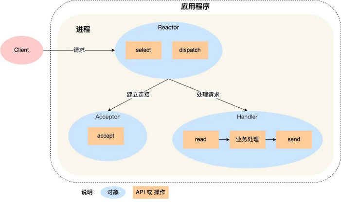

三个组成对象：

- Reactor：负责监听和分发事件；
- Acceptor：负责获取连接；
- Handler：负责处理业务；

多个组成部分：

- select、accept、read、send：是系统调用函数；
- dispatch、业务处理：是需要完善的操作；

---

整体实现流程：

- Reactor通过select实现监听操作，收到事件后进行dispatch分发：
  - 如果是连接建立的事件：则分发给acceptor处理；
  - 如果不是连接建立的事件：则分发给Handler对象；
- Acceptor通过accept()方法获取连接，并创建一个Handler对象来处理后续的响应事件；
- Handler通过定义的流程来完成业务处理。

---

优点：

- 全部工作在一个进程内完成，实现简单，不用考虑进程间通信，不用担心进程竞争；

缺点：

- 无法充分利用CPU的多核；
- Handler对象在处理业务时，整个进程无法处理其他连接的事件，【如果业务处理比较耗时，那么响应的延迟就比较严重】

所以该模式适用于：业务响应快的场景，不适用于计算机密集型的场景。


### 模型 | 单Reactor/多线程

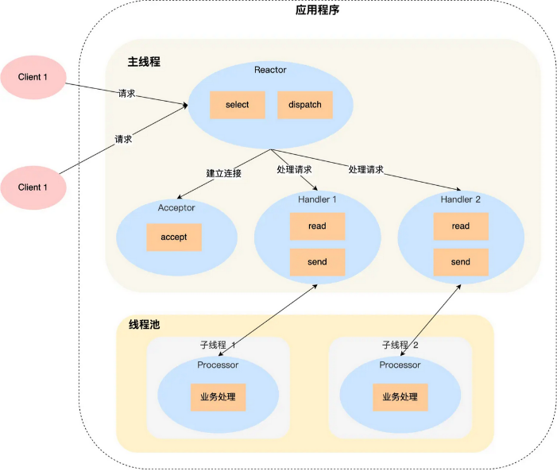

整体实现流程：

- Reactor的作用和Acceptor的作用没有变化；Handler对象的作用有所变更。
- Handler对象不再负责业务处理，只负责数据的接受和发送：Handler在通过read读取到数据后，发送给子线程里面的Processor对象来处理；
- 子线程Processor对象处理完成后，将结果返回给主进程中的Handler对象，用Handler对象调用send方法，将数据发送给客户端；

---

优点：

- 能充分利用多核CPU；

缺点：

- 引入多线程，就存在线程竞争的问题，需要在操作共享资源前，加互斥锁；
- 单Reactor模式共同的缺点：容易在流量上来后，Reactor成为性能的瓶颈；


### 模型 | 多Reactor/多线程

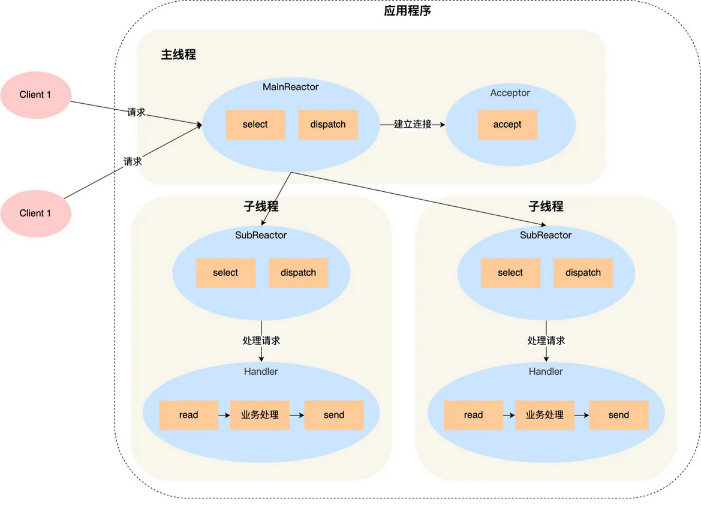

整体的实现流程：

- `MainReactor`：通过select监控连接建立事件，收到事件后通过Acceptor对象中的accept方法获取连接，并将该连接分配给子线程；
- `SubReactor`：子线程中的`subReactor`，将`MainReactor`分配的连接继续加入select进行监听，并创建一个Handler对象，用于后续响应；
- `Handler`：如果有新的事件，`SubReactor`对象会回调当前连接对应的Handler对象进行响应，响应完成后，由Handler对象，将数据发给客户端；


## 一致性哈希

> [参考文章](https://xiaolincoding.com/os/8_network_system/hash.html)
>
> 一致性哈希是用来解决：分布式缓存中的负载均衡问题

**【演进】增加负载均衡层分配请求**

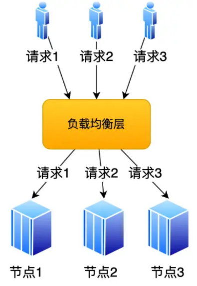

思路：

- 采用轮询的方法，将请求分配到不同的节点上；
- 不同的节点配置不一样，可以采取加权的方式，将更多的请求分配到某个配置较好的节点上；

不足：

- 加权轮询的方式，是假设每个节点都有完整的数据；请求分配到任一节点，都能获取到想要的数据；
- 假设要提高系统容量，必然要对数据进行水平分片，即【分布式系统】，每个系统存储部分数据；加权轮询算法无法满足分布式系统的负载均衡诉求；

---

**【演进】使用哈希算法来分配请求，应对分布式系统**

思路：

- 最简单的哈希算法就是取模运算；只要key确定，访问的节点也就能通过哈希算法确定；

不足：

- 当节点数量发生变化，哈希算法就需要更新；
- 相同的key，在经过新的哈希算法后，可能分配到新的节点上；最坏的情况是所有的节点数据，都要进行迁移；

---

**【演进】一致性哈希算法分配请求，应对分布式系统**

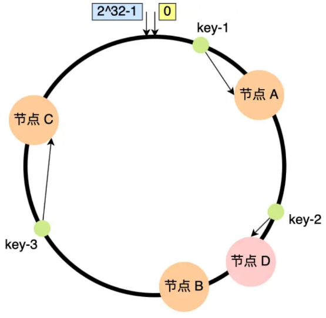

哈希算法：

- 根据节点数量，来对【key】做哈希分配，不同的key经过哈希映射后，映射到对应的节点上；

一致性哈希算法：

- 根据固定值（2^32），来做哈希分配；
- 既需要对【key】进行哈希分配，也需要对【存储数据的节点】进行哈希分配；

怎样找到某个key对应的数据存储节点？

- 某个key，在哈希环上顺时针查找，找到的第一个节点就是存储其对应数据的节点；

---

优点：

- 假设节点A不能用了，仅需要将节点A的数据复制到最近的节点D上；其他节点不受影响；

不足：

- 节点分配可能并不均匀，可能会出现大量key，集中访问同一个节点的情况；
- 当这个节点不能工作，会将请求一次性落在节点B上，有可能将节点B压垮；

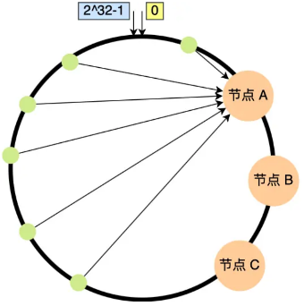

---

**【演进】基于虚拟节点的一致性哈希算法，应对分布式系统**

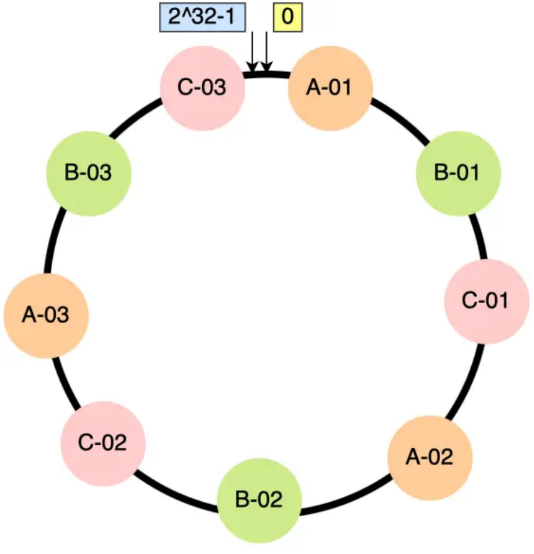

思路：

- key映射：正常；

- 节点映射：先是虚拟节点与实际节点的映射（一个实际节点对应多个虚拟节点）；将虚拟节点映射到哈希环中，而不是实际节点
- key访问节点数据的思路不变，顺时针找到最近的虚拟节点，查找该虚拟节点对应的真实节点，获取数据；

好处：

- 当某一个真实节点无法正常工作，其对应的所有虚拟节点消失，按照顺时针分配，将数据分发到临近虚拟节点对应的真实节点中；
- 因为临近的虚拟节点，可能对应不同的真实节点，所以能够有效避免一致性哈希算法中的问题（大量的key，访问一个节点）；
