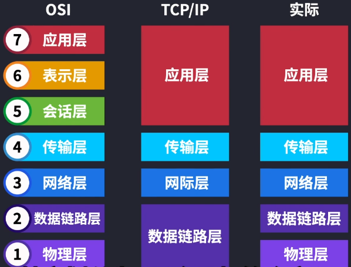
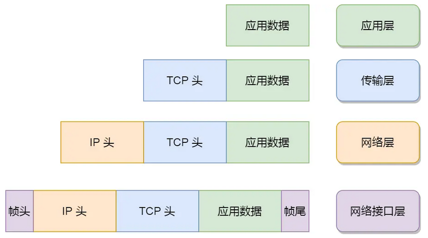
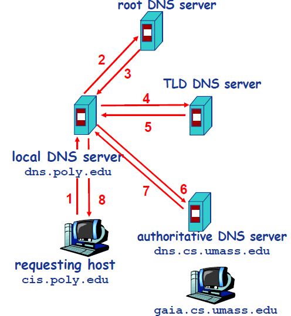

---


# OSI模型介绍

## OSI模型的组成及变种



OSI网络模型分为7层（图示左边部分），但仅作为参考，实际中有不同的划分方案：

- 早期的TCP/IP模型划分为4层（图示中间部分）
- 实际上TCP/IP模型划分为5层更合适（图示右边部分）


## OSI模型各层的协议、数据格式、设备名称

| 模型       | 协议            | 数据格式                            | 相关设备                         |
| ---------- | --------------- | ----------------------------------- | -------------------------------- |
| 应用层     | HTTP、SMTP、DNS | Message                             | 应用程序、软件                   |
| 表示层     |                 |                                     | 应用程序、软件                   |
| 会话层     |                 |                                     | 应用程序、软件                   |
| 传输层     | TCP、UDP        | 段（TCP头+Message）                 | 应用程序、软件                   |
| 网络层     | IP、ICMP        | 包（IP头 + TCP头 + Message）        | 路由器                           |
| 数据链路层 |                 | 帧（帧头 + IP头 + TCP头 + Message） | 交换机                           |
| 物理层     |                 | 比特                                | 网卡、集线器、中继器、调制解调器 |


## 简要介绍OSI模型【未完成】

> 一边学一边深入理解吧，不太好总结

OSI模型的目的：解决主机之间的网络通讯。以一个例子来理解7层网络模型各自的作用：`电脑A访问电脑B搭建的网站`

**7、应用层**

- 两个应用之间如何进行交互连接，便是应用层要管理的事情；

- 应用层不关注具体实现，而是一种逻辑实现，规定了一套应用间网络传输的协议，如：HTTP协议、SMTP协议；
- 应用层是最接近用户的一层；

**6、表示层**

- 不同计算机内部各自的表达方式可能不同，该层就负责数据的编码和解码，使得不同的系统之间能够相互理解
- 数据的压缩瘦身、数据的加密解密（SSL/TLS）也是这一层来处理

**5、会话层**

- 负责建立、管理和结束会话，提供了会话控制、同步、重同步等服务，保证应用程序间的对话能够顺利进行
- 实际一点的说法就是：网站登录过后短时间内无需再次登录；电影观看一部分后退出，再次观看定位到上一次的位置。这些功能的实现都依赖于会话层

**4、传输层**

- 负责数据端到端的传输（源站和目的站）


**1、物理层**

作用：应用层在逻辑上，将两个应用之间连通；物理层在实际上，真正连通两个应用

特点：

- 物理层传输数据的基本单位是比特（Bit），通过真实的媒介传输：光纤介质、电磁波介质等
- 数据在物理层通过网口传输出去，需要经过不同的网络拓扑，不是一条线走到底，因此需要中继器和集线器这样的设备

```
- 中继器：对衰减的信号进行放大，保证信号的强度和传输距离
- 集线器：对接收到的信号进行整形再放大，以扩大传输距离
```

- 除上述设备之外（强化信号），还需要让信号知道传输到哪里去，需要更高层次的网络模型

**2、数据链路层**

作用：在通信的实体间建立数据链路连接，主要将物理层传输的比特组成数据帧，通过物理链接将数据帧传输到目标节点

特点：

- 在该层数据会被封装为帧进行传输（比特数据+MAC地址），每一块网卡都有唯一的MAC地址
- 为了通过MAC地址对不同设备进行数据传输，就有了交换机；发送端在发送数据的时候，交换机就知道了发送端的MAC地址，如果交换机知道接收端的MAC地址，就可以直接将数据发送过去
- 仅用MAC地址作为唯一的寻址方法是不科学的，相当于我知道你的名字，但是不知道你的位置，因此需要其他的手段配合定位

**3、网络层**

作用：

特点：

- MAC地址：跳到跳的传输；IP地址：实现端到端传输的基础了
- 路由器是该网络层的核心，用来实现寻址和路由选择
- 在该层数据封装为包


# TCP/IP的网络模型【未完成】

==【八股】为什么要有TCP/IP网络模型？==

对于同一台设备的进程间通信，可以有多种传输方式：管道、消息队列、共享内存等方式；

对于不同设备的进程间通信，就需要网络传输了，而且设备多种多样，传输方式要有兼容性，就需要一套通用的网络协议，就有了TCP/IP网络模型。

---

==【八股】TCP/IP网络模型组成？各层协议？各层功能特点？==

| 模型       | 协议                             | 模型层特点                                                   |
| ---------- | -------------------------------- | ------------------------------------------------------------ |
| 应用层     | HTTP、SMTP、FTP                  | 给应用程序提供网络服务，不关注具体实现                       |
| 传输层     | TCP、UDP                         | 负责向用户提供端到端的通信服务                               |
| 网络层     | IP、ICMP协议                     | 为分组交换网上的不同主机提供通信服务，创建逻辑链路，以实现数据包的分片和重组。实现拥塞控制、网络互联等功能 |
| 数据链路层 | 以太网协议、点对点协议           | 在通信的实体间建立数据链路连接，主要将物理层传输的比特组成数据帧，通过物理链接将数据帧传输到目标节点 |
| 物理层     | 不涉及特定协议，直接物理媒介处理 | 在物理线路上传输原始的二进制数据，定义了数据传输的物理媒介：电缆、光纤、无线电波等 |

---

==【八股】TCP/IP网络模型每层的数据特点？==




TCP/IP网络模型由4层组成（单写一个文章，常看常新，不太好一次理解全）：

- 应用层（Application Layer）：

  - 功能提供：提供两个终端设备上应用程序之间信息交换的服务，定义了信息交换的格式，由传输层完成

  - 不关注实现：应用层定义了不同的网络通信协议，来实现不同网络应用之间的数据传输。常见的协议有：HTTP、SMTP、SSH、DNS

- 传输层（Transport Layer）：

  - 作用：为两台终端设备进程之间的通信提供通用的数据传输服务。

  - 两个主要的数据传输协议：TCP协议、UDP协议


  ```
  - 有两个不同的数据传输协议：TCP协议（Transmission Control Protocol，传输控制协议）和UDP协议（User Datagram Protocol，用户数据报协议）
  - 例如TCP协议传输数据：数据过大，会将数据**分段**传输；数据报文中**携带端口**信息，用于确认将数据给应用层的哪个应用
  
  端口作用：
  	- 软件在应用层运行时，会监听特定端口的数据。
  	- 作为接收方，当传输层接受到数据后，要发送给应用层，需要知道发送给哪个软件，就可以通过端口号来明确。
  	- 因此传输层的数据包中带有端口号信息
  ```

- 网络层（Internet Layer）：【IP协议、数据分片、IP寻址：网络号+主机号、IP路由】

  ```
  IP协议：IP协议传输数据，会将传输层的数据包作为数据部分，加上IP包头后组装成IP报文。如果数据过大，会将数据进行**分片**。
  
  网络层和传输层的理解区分：
      传输层：
          - 该层其实不负责将数据从一个设备传输到另一个设备，这个过程比较繁琐，传输层的设计理念是简单、高效、专注。
      网络层：
          - 网络层负责将数据送往对应的地方
  
      传输层好比导航，网络层好比方向盘：一个提供目的地和方向，一个真正的带你去目的地
  
  IP地址：用于给设备编号，方便发送数据后找到对应的设备。IPv4协议的地址组成有32位
      怎么通过IP地址找到对应的设备？
          - IP地址可以理解生成两个概念：网络号、主机号
          - 通过网络号确定设置所在的子网，通过主机号确定具体的设备
  
      怎么通过IP地址确认网络号、主机号？
          - 需要借助子网掩码
          - 网络号：IP地址和子网掩码按位与运算
          - 主机号：IP地址与子网掩码取反后的值进行按位与运算
  ```

- 网络接口层：【MAC、ARP协议】

  ```
  通过IP地址，根据网络号和主机号找到设备在以太网中是不太行的
  	- 原因之一：以太网将附近多个设备连接组成局域网，局域网内设备的IP是动态分配的，会变。
  	- 需要额外使用MAC地址，通过ARP协议来获取对方的MAC地址，来确认设备。
  ```

---


# 输入URL到展示结果经历的步骤？

## 整体步骤

大概有如下步骤：

- 客户端：解析URL  -->  DNS查询目标服务器IP地址 -->  与服务器建立TCP链接  -->  发送Http/Https请求

- 服务端：服务器处理Http/Https请求  -->  服务器返回Http响应

- 客户端：浏览器接收到响应，根据响应结果，渲染网页结构和样式  -->  结果展示

上述过程的实现，依赖于TCP/IP网络通信模型，上述步骤在该模型的不同层中各有体现：

- 应用层：URL的键入（可以讲一讲URL的组成）、DNS域名解析（DNS相关知识）、浏览器向目标IP发送HTTP/HTTPS报文（HTTP协议相关知识）

- 传输层：TCP协议封装应用层传来的HTTP报文，TCP协议是数据包传输的主力协议（讲一讲TCP协议）

- 网络层：用来转发和路由

```
转发：将分组从路由器的输入端口转移到合适的输出端口。
路由：确定分组从源到目的经过的路径。
```


## 知识补充 | URL

==【八股】URL的组成？==

URL全称`Uniform Resource Locators`，即统一资源定位器。网络上的资源都靠URL进行定位。

URL组成如下：


- 协议：表示该网址采用何种应用层协议，常见的有：http、https；不常见的有：ftp（用于文件传输）

- 域名：不好记忆的IP地址的通用名
- 端口：如果指名的话，端口在域名后面跟着；如果不指名，默认访问80端口
- 资源路径：资源在服务器上的路径
- 参数：浏览器向服务器提交请求时，携带的参数；采用Key-Value的形式存在url中
- 锚点：相当于书签，浏览的页面大多大于一页，如果指定锚点，网页显示的时候就会定位到锚点位置。锚点不会作为请求的一部分发给服务端

---

==【八股】URL和URI的区别？==

从概念上来讲：

- URL：Uniform Resource Locators，统一资源定位符
- URI：Uniform Resource Identifier，统一资源标识符

从示例理解：

```
一个URL请求：http://www.example.com:8080/myapp/servlet/MyServlet/path/to/resource?param1=value1&param2=value2

使用Java提供的API获取其对应的URL：http://www.example.com:8080/myapp/servlet/MyServlet/path/to/resource（不包含查询字符串）
使用Java提供的API获取其对应的URI：/myapp/servlet/MyServlet/path/to/resource（不包含访问方式、协议）
```

- URI是RUL的父类，是一种更加抽象的标识
- 上述示例中，URI给定了资源路径，但是没有给定资源的访问方式


## 知识补充 | DNS

参考文章：[https://javaguide.cn/cs-basics/network/dns.html](https://javaguide.cn/cs-basics/network/dns.html)

==【八股】DNS协议有什么作用？==

- DNS，Domain Name System，域名管理系统；DNS协议主要用于解决域名和IP之间的映射关系；DNS协议属于应用层协议，默认端口为53

- DNS协议的工作流程如下：


---

==【八股】讲一讲DNS服务器，有哪些层级？==

DNS服务器自上而下，分为如下几个层级：

- 根DNS服务器：用来提供顶级域服务器的IP地址
- 顶级域DNS服务器：用来提供权威DNS服务器的IP地址
  - 顶级域指域名的后缀为：`com、org、net、edu`等
  - 国家也有自己的顶级域，例如：`uk、fr、cn`等
- 权威DNS服务器：存有特定顶级域下所有子域名的IP地址映射信息
  - 一般用户访问的目标网站，就会在权威DNS服务器中找到对应的IP地址
  - 在互联网上具有公共可访问主机的每个组织机构必须提供公共可访问的DNS记录，白话就是：你提供了一个能够公共访问的主机，你就需要把主机域名对应的IP给提供出来。
- 本地DNS服务器：用户计算机或网络接入点（如路由器、交换机等）所配置的DNS服务器，用于处理用户的DNS查询请求。
  - 本地DNS服务器可以不列入DNS服务器的层级关系中，主要是负责一个转发的作用
  - 放入DNS层级中讨论也没问题

URL链接中的域名从右到左，对应DNS层级关系为从上到下。

---

==【八股】DNS的工作流程？==

主要有两种工作流程：迭代、递归。

递归方式：

- 常用、方便
- 每个DNS服务器只负责指路，不负责带路



迭代方式：


【补充】：

- 实际查询过程中，不会访问根DNS服务器，不然就13台根DNS服务器，每个请求都走一遍，早就崩了
- 本地DNS一般缓存了不少顶级域DNS服务器的地址，可以跳过对根DNS服务器的访问，减少其压力


