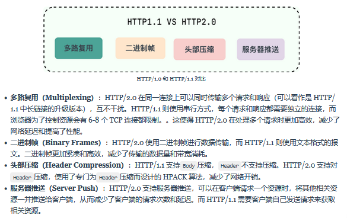

## HTTP基础知识

### HTTP的基本概念

==【八股】什么是HTTP？==

HTTP，HyperText Transfer Protocol，超文本数据传输协议

- 超文本：超越了普通文本，可以是文字、图片、视频的混合体；
- 传输：把数据从A运输到B，或者从B运输到A，包含一个关键概念：**双向数据传输**
- 协议：

```
【协】 2个及2个以上参与者，例如三方协议中的：你、公司、学校
【议】 表示约束或规范，例如三方协议中的：试用期、毁约金；例如租房协议中的：租赁日期、每月租金、违约处理

【HTTP协议】可以理解为计算机世界中，用来对两点之间传输数据的约定和规范
```

---

==【八股】HTTP协议主要的状态码？==

| 状态码 | 含义                                                   | 常见               |
| ------ | ------------------------------------------------------ | ------------------ |
| 1xx    | 提示信息：表示目前是协议处理的中间状态，还有后续操作； |                    |
| 2xx    | 成功信息：表示报文数据已经收到并成功处理；             | 200、204、206      |
| 3xx    | 资源重定向：表示资源位置发生变动，需要重新发起请求；   | 301、302、304      |
| 4xx    | 客户端资源错误：表示请求报文有误，服务端无法处理；     | 400、403、404      |
| 5xx    | 服务端错误：表示服务器在处理请求时，内部发生了错误；   | 500、501、502、503 |

---

==【八股】HTTP协议头中常见的字段有哪些？==

常见的：

| 字段               | 作用                             | 示例                                    |
| ------------------ | -------------------------------- | --------------------------------------- |
| `Host`             | 指定服务器的域名+端口号          | `Host: www.A.com`                       |
| `Content-Length`   | 本次响应的数据长度               | `Content-Length: 1000`                  |
| `Connection`       | 设置TCP的连接状态（长连接）      | `Connection: Keep-Alive`                |
| `Content-Type`     | 服务端响应的数据类型格式         | `Content-Type: text/html;charset=utf-8` |
| `Accept`           | 客户端能够接收的数据类型格式     | `Accept: */*`                           |
| `Content-Encoding` | 服务端响应的数据采用何种压缩方法 | `Content-Encoding: gzip`                |
| `Accept-Encoding`  | 客户端能够接受的数据压缩方法     | `Accept-Encoding: gzip, deflate`        |

详细的：[JavaGuide](https://javaguide.cn/cs-basics/network/other-network-questions.html#http-%E7%8A%B6%E6%80%81%E7%A0%81%E6%9C%89%E5%93%AA%E4%BA%9B)


### GET vs POST

==【八股】Get与Post的区别？==

语义上：

- GET：用于获取或查询资源
- POST：用于创建或修改资源

幂等与缓存：

- GET：是幂等的，多次重复执行不改变资源状态；可以被缓存，以提高性能和效率
- POST：不是幂等的，每次执行可能产生不同的结果或影响资源的状态；不适合被缓存，每次的结果基本都不一样

格式：

- GET：请求参数放置在URL中，形成查询字符串；限制URL长度；GET也可以使用body传输数据，只是不建议
- POST：请求参数放置在body中，可以有多种编码格式；一般不限制body大小；

安全性：

- GET：若使用HTTP协议明文传输数据，不安全；使用HTTPS会好一点；
- POST：若使用HTTP协议明文传输数据，不安全；使用HTTPS会好一点；
- 两相对比之下，还是GET请求更容易泄露数据，因为数据就附在URL中。


### HTTP缓存

==【八股】什么是HTTP缓存？==

对于一些具有重复性的HTTP请求，比如每次请求的数据都一样，就可以把【请求-响应】的数据缓存在本地；

下次请求的时候，直接返回本地数据即可，从而提升HTTP数据传输性能。

---

==【八股】HTTP缓存的实现方式？==

**强制缓存**：

- 特点：只要浏览器判定缓存没有过期，就使用本地缓存，决定权在浏览器
- 实现手段：基于时间判断
  - `Cache-Control` ：表示缓存的相对过期时间；（Cache-Control的优先级要更高一点）
  - `Expires` ：表示缓存的绝对过期时间；
- 流程：

```
【浏览器】第一次发出请求，访问服务器资源；【服务器】在返回资源的同时，在Response头加上Cache-Control字段，设置过期时间大小；

【浏览器】再次发出请求，访问服务器资源，浏览器会计算缓存是否失效：若不失效，则使用缓存，若失效，则发起请求；

缓存是否失效的计算：
- Cache-Control：需要借助一个字段：response_time，即响应的到达时间；
- Expires：直接利用本身，与当前时间进行对比；
```

**协商缓存**：

- 特点：某些请求的响应码为304，表示告知客户端，可以使用本地缓存，这种协商的方式就是协商缓存，决定权在服务器
- 实现手段：基于数据一致性
  - `If-Modified-Since`  + `Last-Modified`（基于时间的判断）
  - `If-None-Match` + `Etag`（基于数据一致性的判断）

- 流程：

```
If-Modified-Since  + Last-Modified：

【浏览器】第一次请求，【服务器】返回资源的同时，返回该资源的最后修改时间Last-Modified，【浏览器】缓存资源的同时，保存该时间字段；

【浏览器】再次发出请求，发现缓存已经过期，则携带If-Modified-Since字段（值就是保存的Last-Modified字段的值）；
【服务器】将If-Modified-Since字段的值，与自身记录的该资源的最后修改时间进行对比：
- 若无更改：返回304 Not Modified，不传输资源，表示可继续使用缓存；
- 若有更改：返回200，传输资源，并返回最新的Last-Modified
```

```
If-None-Match + Etag：

【浏览器】第一次请求，【服务器】返回资源的同时，返回该资源的唯一标识符ETag，【浏览器】缓存资源的同时，保存该标识符；

【浏览器】再次发出请求，携带If-None-Match字段（值就是保存的ETag标识符的值）；
【服务器】将If-None-Match字段的值，与当前资源进行对比：
- 若无更改：返回304 Not Modified，无内容返回；
- 若有更改：返回200，传输资源，并返回最新的ETag；
```

整体流程：[小林Coding](https://xiaolincoding.com/network/2_http/http_interview.html#%E4%BB%80%E4%B9%88%E6%98%AF%E5%8D%8F%E5%95%86%E7%BC%93%E5%AD%98)


### HTTP协议的特点

==【八股】HTTP协议的优点？==

- 简单：报文格式是head+body，head信息是简单的key-value形式，易于理解；
- 易于扩展：
  - 协议本身：HTTP协议的请求方法、状态码、头字段组成等都没有限定死，可以自定义；
  - OSI模型：HTTP协议位于应用层，其下层可以随意变化，比如HTTPS协议就是在HTTP协议的基础上，加了SSL/TLS层；
- 应用广泛和跨平台

---

==【八股】HTTP协议的缺点？==

- 无状态：一方面，服务器不需要记忆HTTP的状态，减少服务器资源消耗；另一方面，服务器在执行关联操作的时候就比较麻烦，需要借助额外手段，比如Cookie、Session；
- 明文传输：一方面，明文传输方便理解；另一方面，明文传输更容易造成信息泄露；

---


## HTTP协议的演变过程

### 整体总结


### HTTP/1.0 vs HTTP/1.1

连接方式上：

- HTTP/1.0：为短连接；即每次http请求对应新的tcp连接，用完就关通道；适用于不需要持续交互的场景，比如静态资源请求；
- HTTP/1.1：支持长连接，`Connection: keep-alive`字段设置开启；即多个http请求可以放在一个tcp连接上来实现；适用于需要频繁交互或实时通信的场景，比如Web应用程序、聊天应用等；

状态响应码上：

- HTTP/1.0：
- HTTP/1.1：增加了更多的状态响应码；

缓存机制上：

- HTTP/1.0：
- HTTP/1.1：引入了更多的缓存策略；

Host头处理：

- HTTP/1.0：无Host头字段，无法实现虚拟主机；
- HTTP/1.1：引入Host头字段，允许在同一个IP地址上托管多个域名，从而支持虚拟主机的功能；


### HTTP/1.1 vs HTTP/2.0【未完成】




### HTTP/2.0 vs HTTP/3.0【未完成】


## HTTP vs HTTPS

### 对比 | 两者的区别

默认端口号：

- HTTP：默认80端口
- HTTPS：默认443端口

URL前缀：

- HTTP：`http:\\`
- HTTPS：`https:\\`

连接方式：

- HTTP：TCP三次握手之后即可传输HTTP报文
- HTTPS：TCP三次握手之后还需要进行SSL/TLS的握手过程，才可传输加密的报文

安全性：

- HTTP：采用明文传输，存在安全泄露风险
- HTTPS：加入SSL/TLS安全协议，使得数据能够加密传输


### 学习 | HTTPS协议如何建立连接过程？

**整体流程**：

HTTPS协议先经过TCP协议的三次握手，再经过TLS/SSL协议的四次握手阶段，建立连接。

- 四次握手阶段：客户端向服务端索要服务器的公钥 + 双方协商生产【会话密钥】
- 后续加密通信：使用协商的【会话密钥】，进行加密通信

---

**TLS/SSL协议四次握手的主要内容**：

ClientHello：客户端向服务端发起加密通信请求，传输的内容如下：
- 客户端支持的TLS版本号；
- 客户端生成的随机数（Client Random）；
- 客户端支持的密码套件列表，一般会从其中选出一个对称加密算法，比如AES、HS256；

ServerHello：服务器收到客户端请求后，给出回应，内容如下：
- 确认TLS版本；
- 服务器生成的随机数（Server Random）；
- 确认的密码套件，比如选用AES对称加密算法；
- 服务器的数字证书；

客户端回应：收到服务器的回应后，有如下操作：

- 验证服务器的数字证书的合法性；若证书真实，传输一个随机数（pre-master key），该随机数经过服务器的公钥加密；

- 至此，客户端已经拥有3个完整的随机数，自行按照协商的对称加密算法，计算会话密钥；
- 同时生成一个【先前会话内容的摘要】，供服务器验证；

服务器的最后回应：

- 验证传来的摘要；

- 收到第三个随机数后，用自己的CA私钥，解密随机数，自行按照协商的对称加密算法，计算会话密钥；
- 应答，TLS连接建立完毕；

TLS的四个步骤到此结束。

---

==【八股】第三次握手会生成一个摘要，这个摘要包含哪些内容？生成流程是什么？==

摘要内容：先前所有握手阶段传递的信息；

摘要生成的过程：

- 至此，客户端有所有的随机数信息，通过约定的密钥算法，计算【主密钥】；
- 生成一个Finish信息：对上述摘要内容进行哈希运算，并结合【主密钥】和【伪随机函数】，生成摘要；

- 发送该Finish信息给服务端；

服务端用相同的手段，生成一个Finish信息，然后验证两个Finish信息是否一致；


### 总结 | HTTPS解决HTTP的什么问题？解决手段？

**三个风险维度及解决思路**：

|       | HTTP                                       | HTTPS                         |
| ----- | ------------------------------------------ | ----------------------------- |
| 维度1 | 窃听风险（被别人获取报文内容）             | 信息加密（混合加密）          |
| 维度2 | 篡改风险（被别人篡改报文内容）             | 校验机制（摘要算法+数字签名） |
| 维度3 | 冒充风险（接收冒充的目标服务器发送的内容） | 数字证书（CA+数字签名）       |

---

**信息加密**：混合加密

- 在会话建立阶段，使用非对称加密方式交换信息，生成会话密钥（3个随机数 + 协商的对称加密算法）；
- 在数据交互阶段，使用上述【会话密钥】来加密明文数据；

---

**校验机制**：摘要算法+数字签名（非对称加密）

手段1：


- 不足：可以保证内容不被篡改，但是不能保证【内容+哈希值】一并被篡改；

手段2：


- 优点：既能保证内容不被篡改，也能保证内容是由服务端发出的，因为私钥只有服务端自身知道；

---

**数字证书**：CA+数字签名

问题背景：

- 混合加密 + 校验机制，保证了数据的安全性和不被更改，但是无法解决冒充风险；
- 即：客户端手中的公钥是冒充的，是黑客服务器对应的公钥，这样还是有信息安全问题；

解决手段：CA机构 + 数字签名


（1）服务器注册CA：将自己的公钥交给CA机构；

（2）CA机构颁发数字证书：CA用自己的私钥，对服务器的公钥进行数字签名，将【服务器公钥 + CA的数字签名】打包，给服务器办法数字证书；

（3）客户端验证数字证书：CA的公钥已经内嵌到浏览器或操作系统中，客户端就可以拿着CA的公钥来验证数字证书的真实性；

（4）客户端发送加密消息：客户端使用从CA证书中获取的服务器公钥，加密消息，发送给服务器；

（5）服务器解密消息：服务器用自己的私钥，解密消息；

---

==【八股】数字证书有哪些信息？==：

- 证书的持有者的信息：公司的域名、组织名称、组织单位、所属国家、省份、城市等；
- 证书的颁发者的消息：CA的名称、CA的组织信息；
- 证书的有效期：该证书的起始时间、终止时间；
- 证书的序列号：唯一标识该证书；
- 证书的签名算法：一般包含摘要算法 + 非对称加密算法，比如：SHA256 with RSA encryption；
- 证书的数字签名：是经过签名算法计算后的结果
- 服务器的公钥；

---

==【八股】客户端校验数字证书的过程？==

> 是一个验证CA证书是否真实的过程；
>
> 换个问法：验证一个证书是否是由该CA颁发；


步骤1：验证证书本身是否是真的：

（1）签发过程：

- CA将持有者的公钥、用途、颁发者、有效时间等信息，通过Hash摘要算法进行压缩打包；
- 再通过CA私钥，对Hash值进行非对称加密；

（2）验证：

- 客户端使用相同的算法，对数字证书中的基本信息进行Hash摘要压缩；
- 同时使用浏览器自带的CA公钥，对证书中的数字签名进行解密；
- 对比两个Hash值，若一致，则证书安全；

步骤2：验证证书是否是由受信任的根证书颁发的（证书链验证）：


### 总结 | 相关八股

==【八股】HTTPS协议一定安全可靠吗？若假基站截取数据进行TLS握手，并且假基站再与真实服务器握手，数据不就泄露了？==

HTTPS协议本身是安全可靠的，上述情况的出现，一定是浏览器信任了不该信任的证书。

- 首先，服务端与假基站建立连接没问题，因为服务端不会校验客户端的合法性；
- 然后，客户端与假基站建立连接，会索要假基站的公钥，然后去CA验证，一定是验证不通过的，但如果人工点击信任未知的TLS/SSL证书，后续出问题，就不是HTTPS协议的问题，而是人为操作的问题。

---

==【八股】抓包工具是怎么获取HTTP/HTTPS协议的内容的？==

抓包工具获取HTTP协议内容：HTTP是明文传输，想要获取是没问题的。

抓包工具获取HTTPS协议内容：类似假基站一样，需要一个中间代理人角色；

- 中间代理人与服务器建立连接：作为客户端的存在，连接建立过程是没问题的
- 中间代理人与客户端建立连接：作为服务端的存在，需要被客户端信任，有如下实现手段：
  - 拿到服务端的私钥，充当真正的服务端（不可能）
  - 去CA处签发自己的私钥（也不现实，不划算）
  - 自己签发证书，且被浏览器信任（最可能的方法）

抓包工具工作原理：抓包工具工作时，会在客户端受信任的根证书列表中安装Fiddler的根证书，从而被浏览器信任；


