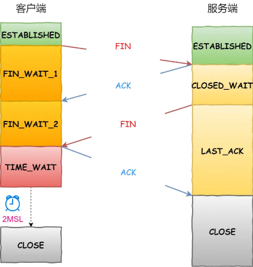

# 概念 | TCP相关基本概念

==【八股】什么是TCP？==

TCP是面向连接的、可靠的、基于字节流的传输层通信协议。

- 面向连接：需要建立【一对一】关系，不能像UDP一样，一个主机向多个主机发消息；
- 可靠的：TCP可以保证一个报文一定能到达接收端；
- 基于字节流：基于字节传输，将【整个数据】划分为多个【TCP报文】；

---

==【八股】如何确定一个唯一的TCP连接？==

TCP四元组：源地址、源端口号、目标地址和目标端口号；

---

==【八股】一个服务端监听某个端口，它的理论最大TCP连接数是多少？==

相当于TCP四元组中的源地址、源端口号确定了；那最大连接数 = 客户端IP数 + 客户端端口数（2^32 * 2^16）;

但实际的连接数，受到如下因素限制：

- 文件描述符个数限制：每个TCP连接都是一个文件，对应一个文件描述符；文件描述符的个数有：系统级限制、用户级限制、进程级限制；
- 内存限制：每个TCP连接要占用一定内存，操作系统的内存是有限制的。

---

==【八股】TCP报文头有哪些内容？==


序列号：每次发送TCP报文，都会设置；

确认应答号：每次收到TCP报文，为了让对方直到自己收到了，会予以响应，设置的值 = 收到报文的序列号 + 1

状态位：

- SYN：用于建立连接的报文标志位；
- RST：用于终止连接的报文标志位；
- FIN：用于断开连接的报文标志位；
- ACK：用于回应对方的报文标志位；
- PSH：表示该报文数据需要立即处理，发送至应用层；
- URG：表示该报文数据需要有限紧急处理，结合紧急指针一起使用（紧急指针：指向紧急数据在TCP数据段中的结束位置）

---

==【八股】TCP三次握手建立连接的过程中，除了进行序列号及ACK应答的编号，还确定了哪些信息？==

- **MSS（Maximun Segment Size，最大报文段大小）**：双方通过SYN报文交换各自的MSS，决定了每个TCP报文段可以承载的最大数据量，防止发送的数据包超出对方的能力；（客户端发送数据不超过服务端的MSS；服务端发送数据不超过客户端的MSS，服务端和客户端各自有一个MSS）
- **窗口大小、窗口探测和零窗口检测**：进行流量控制，防止无脑发送数据，超出接收方的处理能力；
- **SACK**：流量控制方式中的选择性应答；


# 概念 | TCP连接：三次握手

## 连接流程

**整体流程**：


**初始**：

客户端和服务端都处于close状态；

服务端启动后，处于监听状态，监听客户端的连接请求；

---

**握手过程 | 第1次：SYN 报文**： 

|                     |                                                              |
| ------------------- | ------------------------------------------------------------ |
| 发送对象            | 客户端 -> 服务端                                             |
| 设置的内容          | 1、设置序列号：客户端随机初始化的值<br />2、设置SYN标志位：SYN（Synchronize）= 1，表示用于双方数据同步 |
| 客户端 / 服务端状态 | 客户端发送完，进入SYN_SENT状态，等待服务端的应答；           |

**握手过程 | 第2次：SYN + ACK 报文**： 

|                     |                                                              |
| ------------------- | ------------------------------------------------------------ |
| 发送对象            | 服务端 -> 客户端                                             |
| 设置的内容          | 1、设置序列号：服务端随机初始化的值；<br />2、设置应答号：客户端发来的序列号值 + 1<br />2、设置SYN + ACK标志位：SYN = 1，表示用于双方数据同步；ACK=1，表示响应客户端发送的连接请求； |
| 客户端 / 服务端状态 | 服务端发送完，进入SYN_RCVD状态，等待客户端的应答；           |

**握手过程 | 第3次：ACK 报文**： 

|                     |                                                              |
| ------------------- | ------------------------------------------------------------ |
| 发送对象            | 客户端 -> 服务端                                             |
| 设置的内容          | 1、设置应答号：服务端发来的序列号值 + 1<br />2、设置ACK标志位：ACK=1，表示响应服务端发送的连接请求； |
| 客户端 / 服务端状态 | 客户端发送后，进入ESTABLISH阶段；服务端收到后，也进入ESTABLISH阶段。两者可以相互传输数据了。 |


## 相关八股

==【八股】TCP的三次握手，第三次握手可以携带数据嘛？==

可以。因为服务端在收到第三次握手的信息之后，就进入ESTABLISH阶段，因此第三次握手可以携带数据信息。

---

==【八股】TCP的三次握手，为什么需要三次？能改为两次嘛？==

总的回答：保证双方都具备接收和发送数据的能力。

更细致一点：

- 避免历史连接的问题，防止因为网络阻塞，连接先前的SYN报文；（客户端发送报文后出现夯机 + 网络阻塞，服务端没收到，客户端再次重启，再发报文）


- 同步双方的序列号至少需要三次握手；


---

==【八股】为什么建立TCP连接超时时，初始化的序列号要不一样？==

原因1：防止建立连接后，收到历史的合法报文；

原因2：防止黑客模拟SYN报文，产生数据安全问题；

---

==【八股】TCP建立连接的三次握手过程，每一次握手丢失，会发生什么？==

记住要点：ACK应答是不会重新传递的，只有SYN同步握手才会被重新发送。

第一次握手丢失：

- case：客户端收不到服务端的应答；
- 操作：客户端超时重传；

第二次握手丢失：

- case：客户端收不到服务端的应答，认为自己的第一次握手没有送达；服务端收不到客户端的应答；
- 操作：客户端超时重传；服务端超时重传；

第三次握手丢失：

- case：客户端发送完毕之后，进入ESTABLISH阶段；服务端认为自己的第二次握手应答没有送到；
- 操作：服务端超时重传；

---

==【八股】什么是SYN攻击？怎么避免？==

SYN攻击：

- TCP连接过程，服务端会维护两个队列：【TCP半连接队列】和【TCP全连接队列】
- 当黑客在短时间内变化多个IP，向服务器发送SYN报文，但是不应答，就会把【TCP半连接队列】占满，从而影响服务端正常使用；

避免措施：

- 增大TCP半连接队列；
- 减少SYN-ACK的重传次数（第二次握手），让TCP半连接队列中的连接快点断开；
- 开启tcp_syncookies，保证在TCP半连接队列满的情况下，也能响应请求连接；


```
1、收到SYN连接，发现SYN队列满了，也不丢弃，而是生成一个cookie；

2、将该cookie放入SYN-ACK报文的序列号里面；

3、当收到客户端的第三次握手反馈，如果合法，则将连接放入TCP全连接队列；
```


# 概念 | TCP连接：四次挥手

## 断开流程

**图示**：




**初始**：

客户端和服务端都处于ESTABLISH状态；

双方都有主动断开连接的权力，假设客户端主动断开连接。

---

**挥手过程 | 第1次：FIN 报文**： 

|                     |                                                              |
| ------------------- | ------------------------------------------------------------ |
| 发送对象            | 客户端 -> 服务端                                             |
| 设置的内容          | 1、设置序列号：客户端随机初始化的值<br />2、设置FIN标志位：FIN = 1，表示客户端没有数据要传输了，请求断开连接 |
| 客户端 / 服务端状态 | 客户端发送完，进入FIN_WAIT_1状态，等待服务端的响应；         |

**挥手过程 | 第2次：ACK 报文**： 

|                     |                                                              |
| ------------------- | ------------------------------------------------------------ |
| 发送对象            | 服务端 -> 客户端                                             |
| 设置的内容          | 1、设置序列号：服务端随机初始化的值<br />2、设置ACK标志位：ACK = 1，表示服务端收到客户端的断开连接请求 |
| 客户端 / 服务端状态 | 服务端发送完，进入CLOSED_WAIT状态，此时仍可传输数据；客户端收到后，进入FIN_WAIT_2状态； |

**挥手过程 | 第3次：FIN 报文**： 

|                     |                                                              |
| ------------------- | ------------------------------------------------------------ |
| 发送对象            | 服务端 -> 客户端                                             |
| 设置的内容          | 1、设置序列号：服务端随机初始化的值<br />2、设置FIN标志位：FIN = 1，表示服务端处理好最后的数据，也准备断开连接了 |
| 客户端 / 服务端状态 | 服务端发送完，进入LAST_ACK状态，等待客户端响应；             |

**挥手过程 | 第4次：ACK 报文**： 

|                     |                                                              |
| ------------------- | ------------------------------------------------------------ |
| 发送对象            | 客户端 -> 服务端                                             |
| 设置的内容          | 1、设置序列号：服务端随机初始化的值<br />2、设置ACK标志位：ACK = 1，表示客户端收到服务端的断开连接确认，准备断开连接 |
| 客户端 / 服务端状态 | 客户端发送完，进入TIME_WAIT状态，仍可接收服务端报文（防止ACK报文发送失败），超过一定事件，断开连接；<br />服务端若正常收到报文，进入CLOSE状态，断开连接； |


## 相关八股

==【八股】为什么需要四次挥手？==

保证双方都有不再发送数据的能力。

---

==【八股】TCP断开连接四次挥手，每一次挥手丢失，会出现什么case？==

第一次挥手丢失：

- case：客户端收不到服务端的应答；
- 操作：客户端超时重传；超过设置时间，直接断掉连接；

第二次挥手丢失：

- case：还是客户端收不到服务端的应答；
- 操作：客户端超时重传；超过设置时间，直接断掉连接；

第三次挥手丢失：

- case：服务端收不到客户端的应答；
- 操作：服务端超时重传；服务端超过设置次数，直接断掉连接；客户端超过设置时间，没有收到服务端报文，直接断掉连接；

第四次挥手丢失：

- case：还是服务端收不到客户端的应答；
- 操作：服务端超时重传；服务端超过设置次数，直接断掉连接；客户端超过设置时间，没有收到服务端报文，直接断掉连接；

---


# 概念 | TCP保证可靠的机制

## 重传机制

==【八股】TCP重传机制的作用？==

作用：用于保证TCP可靠的手段之一；

触发场景：TCP通过序列号与确认应答机制，来保证数据传输的可靠，如果在发出序列号的一定时间内，没有收到应答，就会触发重传机制；

---

**总结**

| 方法     | 设置        | 特点                                                         |
| -------- | ----------- | ------------------------------------------------------------ |
| 超时重传 | RTO值的设置 | 等待时间达到RTO，才能触发重传；                              |
| 快速重传 |             | 无论重传丢失部分数据，还是重传所有数据，都有问题；           |
| SACK     |             | 可以告知发送方【接收方所收到的数据】，这样就能定位到所有丢失的数据； |
| D-SACK   |             | 可以在SACK的基础上，告知【发送方重复发送的数据】，方便发送方调整数据发送策略； |

---

**重传机制 | 超时重传**

场景：


触发case：发送报文后，在RTO时间内，未收到应答报文；

相关设置：

- 【超时重传时间（RTO，Retransmission Timeout）】 应当略微大于 【往返时延（Round-Trip Time）】；
- RTO的设置有相关的经验公式，是变化的；
- 超时重传的策略：超时间隔加倍，即每次遇到超时重传，下次的超时时间是当前的两倍；


- RTO 和 RTT 之间大小关系变化，可能出现的问题：


---

**重传机制 | 快速重传**

图示：


触发case：发送端收到三条ACK一样的应答报文，就会在定时器过期之前，重传丢失的报文；

不足：

- 若触发了超时重传，是重新传递所有的报文还是仅传递丢失的那一条报文？无论怎样设置，都有问题。
  - 若重传一条数据，ACK仅能定位到第一个丢失的数据，后续的丢失数据，需要前边丢失的数据被接受到，才能被发送端感知；
  - 若重传所有数据，徒增负担；

---

**重传机制 | SACK（Selective Acknowledgement，选择性确认）**

图示：


触发case：发送端收到三条ACK一样的应答报文，重传丢失的报文；

相关设置：

- 在TCP头部中的【选项】字段里面，增加一个SACK的东西，用来将接收方接收到的数据范围，传递给发送方；

---

**重传机制 | Duplicate SACK（D-SACK）**

图示：


触发case：

- 不管是ACK丢包导致的重传，还是网络延迟导致的重传，都会出现数据的重复发送，这样就可以借助S-ACK字段，发送重复部分数据的信息；
- 发送端得知数据有重复发送，就可以调整相关的发送策略；

相关设置：

- D-SACK的实现是基于SACK的，没有在TCP头中单独使用一个字段；


## 滑动窗口

==【八股】介绍一下TCP中的滑动窗口机制？==

背景 | 为什么需要滑动窗口？：

- 正常的【发出-应答】模式，效率低下，而且数据往返时间越长，效率越低下；

- 因此引入窗口的概念，提高数据传输效率；

---

概念 | 什么是滑动窗口？

- 无需等待确认应答，而可以继续发送数据的最大值；
- 假设窗口值=3，即可以连续发送3个TCP段，而不用等待ACK应答；


---

原理 | 滑动窗口的实现？

- 操作系统开辟了一个缓存空间，在对方ACK应答到来之前，必须缓存已发送的数据；
- 当收到ACK应答后，可以将相应发送数据从缓存中剔除；

---

好处 | 累计确认 / 累计应答

- 假设ACK=600的应答丢失，可以等待下一个ACK应答；
- 如果下一个ACK应答=700，说明ACK=600的数据已收到，只是ACK应答丢失了，也就不会触发重传；

---

参数 | 窗口大小的确定：

- TCP头里面有个字段：Window，表示窗口的大小；
- 这个字段是：接收端告诉发送端，自己还有多少缓冲区可以接收数据，于是发送端就按照这个窗口大小来发送数据；
- 所以窗口大小通常由【接收方】来确定。


## 流量控制

==【八股】介绍一下TCP的流量控制？==

背景 | 为什么需要流量控制？

- 发送方不能无脑发送数据给对方，需要考虑对方的接受能力；
- 如果接收方处理不过来数据，就会触发超时重传，就会造成网络流量的浪费；
- 为了避免这种情况，就出现了流量控制，即：使得【发送方】根据【接收方】的实际接收能力来控制发送的数据量；

---

原理 | 流量控制实现的原理？

- 滑动窗口协议：
  - 发送方维护一个发送窗口，表示可以连续发送的数据量；
  - 接收方维护一个接收窗口，表示还有多少空间可以接收数据；
  - 发送方根据接收方的接收窗口大小，来动态调整发送窗口的大小，以控制发送的数据量；
- 基于确认的流量控制：
  - 上述流量的控制是基于确认机制，来保证流量控制的可靠性；

---

相关概念及可能出现的问题及解决手段 | **窗口关闭**

（1）概念：如果接收方的窗口大小为0，就会组织发送方发送数据，直到窗口变为非0，这就是窗口关闭

（2）潜在的危险：

- 当窗口变为0时，发送方会发送一个探测报文，探测窗口是否变为非0；
- 假设接收方窗口变为非0，需要给出一个ACK应答；
- 假设这个ACK应答丢失，双方就会陷入无尽的等待，出现死锁；


（3）解决手段：设定一个持续计时器

- 发送方收到【窗口为0】的ACK报文，启动持续计时器，并发送窗口探测报文；假设【窗口非0】的ACK应答报文丢失；
- 发送方等待时间超过持续计时器时，会重新发送窗口探测报文，然后重新设定持续计时器的值；
- 设定窗口探测的次数=3，每次持续时间为30-60s，这样就打破了死循环；
- 当3次窗口探测，都没有收到ACK应答报文，就会发送RST报文来中断连接。

---

相关概念及可能出现的问题及解决手段 | **糊涂窗口综合征**

（1）概念：

- 当接收方腾出几个字节的空间，发送方就会毫不犹豫的发送数据；
- 假设就几个字节的空间，整个TCP+IP的报文头大小就有40字节，这样就很浪费资源；

（2）解决措施：

- 防止接收方发送【小窗口】的ACK应答给发送方：当窗口大小 < min(MSS, 缓存空间 / 2)，统一发送【窗口为0】的ACK应答；
- 防止发送方发送【小窗口】的报文数据给接收方：当窗口大小 >= MSS && 数据大小 >= MSS，才允许发送数据；


## 拥塞控制

==【八股】介绍一下TCP中的拥塞控制？==

作用：保证整个网络空间的通畅；

背景：

- 流量控制机制，避免了发送方发送的数据量，超过接收方的处理能力；
- 当时所有的TCP连接均处在一个网络空间中，如果网络比较拥堵的时候，还大量发送数据，就会容易造成数据丢失；
- 因此引入拥塞控制，避免发送方的数据填满整个网络。

原理：

- 引入【拥塞窗口】的概念；加入拥塞窗口的概念后，发送窗口、接收窗口、拥塞窗口的关系：**发送窗口 = min( 接收窗口， 拥塞窗口)**；

- 拥塞窗口的变化规则：只要网络没有阻塞，拥塞窗口就【变大】；有网络阻塞，拥塞窗口就【减小】；校验标准就是是否发生了超时重传；

---

**拥塞控制 | 慢启动**

概念：

- 在TCP刚建立连接的时候，一点一点的增大拥塞窗口；
- 一句话概括算法：每当收到一个ACK应答，拥塞窗口大小+1；


特点：

- 拥塞窗口的变化呈现指数增长；
- 有个增长上限：ssthresh - 慢启动门限。当拥塞窗口 < ssthresh，使用慢启动算法；当拥塞窗口 >= ssthresh，使用【拥塞避免算法】


**拥塞控制 | 拥塞避免**

概念：

- 随着TCP收到的ACK应答增加，拥塞窗口也越来越大，但是不能指数级无限增大；
- 当拥塞窗口 >= ssthresh，就使用拥塞避免算法，即每收到一个ACK，拥塞窗口大小 += 1 / 拥塞窗口；


特点：

- 使得拥塞窗口的增长呈现线性；
- 虽然拥塞窗口的增长从指数级变为线性增长，但还是在增长，还是会出现拥塞。当出现超时重传的时候，就改为【拥塞发生算法】

---

**拥塞控制 | 拥塞发生**

概念：

- 当网络出现拥塞，会发生数据包的重传，重传机制主要有两种：超时重传、快速重传；
- 针对不同的重传机制，有不同的应对算法；

超时重传 - 拥塞发生算法：

- 相关参数设置：

```
慢启动门限 = 拥塞窗口 / 2

拥塞窗口 = 1
```


- 特点：流量波动极大，一下子打回原形了；

快速重传 - 快速恢复算法：见下文

---

**拥塞控制 | 快速恢复** 

概念：

- 上述拥塞发生算法，对于拥塞窗口的变动太激进；
- 假设发生了快速重传，证明能收到3个一致的ACK应答，起码网络不至于那么糟糕，不用像RTO那样反应剧烈，就可以采取柔和一点的参数控制；

参数控制：

```
拥塞窗口 = 拥塞窗口 / 2

慢启动门限 = 拥塞窗口
```


# 概念 | TCP vs UDP

==【八股】TCP和UDP的区别？==

|                        | TCP            | UDP        |
| ---------------------- | -------------- | ---------- |
| 是否面向连接           | 是             | 否         |
| 是否可靠               | 是             | 否         |
| 是否有状态             | 是             | 否         |
| 传输效率               | 较慢           | 较快       |
| 传输形式               | 字节流         | 数据报文段 |
| 首部开销               | 20 ～ 60 bytes | 8 bytes    |
| 是否提供广播或多播服务 | 否             | 是         |

- 是否面向连接：UDP 在传送数据之前不需要先建立连接。而 TCP 提供面向连接的服务，在传送数据之前必须先建立连接，数据传送结束后要释放连接。

- 是否是可靠传输：远地主机在收到 UDP 报文后，不需要给出任何确认，并且不保证数据不丢失，不保证是否顺序到达。TCP 提供可靠的传输服务，TCP 在传递数据之前，会有三次握手来建立连接，而且在数据传递时，有确认、窗口、重传、拥塞控制机制。通过 TCP 连接传输的数据，无差错、不丢失、不重复、并且按序到达。

- 是否有状态：这个和上面的“是否可靠传输”相对应。TCP 传输是有状态的，这个有状态说的是 TCP 会去记录自己发送消息的状态比如消息是否发送了、是否被接收了等等。为此 ，TCP 需要维持复杂的连接状态表。而 UDP 是无状态服务，简单来说就是不管发出去之后的事情了。

- 传输效率：由于使用 TCP 进行传输的时候多了连接、确认、重传等机制，所以 TCP 的传输效率要比 UDP 低很多。

- 传输形式：TCP 是面向字节流的，UDP 是面向报文的。

- 首部开销：TCP 首部开销（20 ～ 60 字节）比 UDP 首部开销（8 字节）要大。

- 是否提供广播或多播服务：TCP 只支持点对点通信，UDP 支持一对一、一对多、多对一、多对多；

---

==【八股】TCP对比UDP，做了哪些事情来保证可靠性？==

TCP（传输控制协议）相较于UDP（用户数据报协议）提供了许多机制来保障数据传输的可靠性。以下是一些关键的方式：

- **建立连接**：TCP采用三次握手机制建立连接。这个过程包括发送方发送连接请求，接收方回复确认，最后发送方再次回复确认。这种机制确保了通信双方之间的连接是可靠的，为后续的数据传输打下了基础。

- **序列号与确认机制**：TCP将应用层发送的数据划分成以字节为单位的报文段（Segment），并为每个报文段分配一个序列号。接收方在接收到数据后会发送一个确认消息（Ack），告知发送方哪些数据已经成功接收。如果发送方在一定时间内没有收到确认，则会重传对应的数据包。这种机制确保了数据的可靠传输。

- **流量控制与拥塞控制**：TCP利用滑动窗口机制实现流量控制和拥塞控制。通过限制发送方窗口大小，可以防止发送速度过快，导致接收方处理不及时而引发的包丢失等问题。同时，TCP还可以根据网络拥塞情况来动态调整窗口大小，保证网络的稳定性和可靠性。

- **头部校验和**：在TCP传输过程中，每个报文段都会添加一个头部校验和。当数据在传输过程中被损坏或篡改时，接收方可以通过校验和检测出来，并要求发送方重传，从而确保数据的完整性和准确性。

- **重传机制**：当TCP检测到数据包丢失或损坏时，会启动重传机制。这种机制确保了即使在网络环境不稳定的情况下，TCP也能确保数据的可靠传输。

综上所述，TCP通过一系列机制来保障数据传输的可靠性，这些机制使得TCP适用于对数据完整性要求较高的应用场景，如文件传输、电子邮件、网页浏览等。

而UDP则更注重传输效率，不保证数据的可靠传输，适用于对实时性要求较高的应用场景，如音频、视频传输等。

