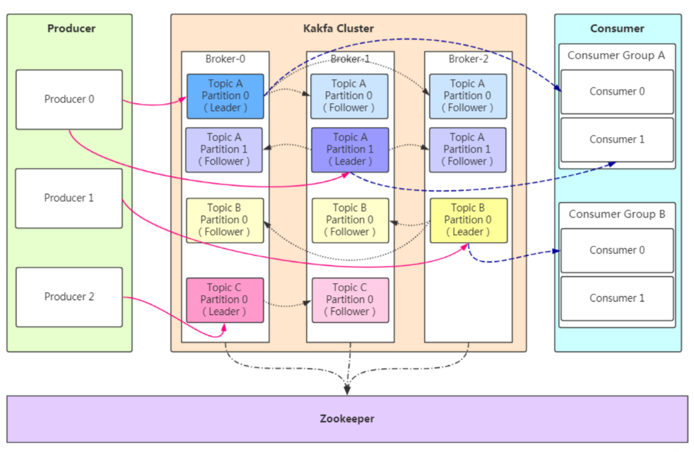
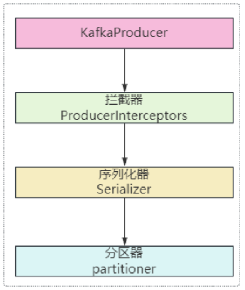

# Kafka基本

==【八股】Kafka有哪些特点？==

- **高吞吐量、低延迟**：kafka每秒可以处理几十万条消息，它的延迟最低只有几毫秒；

- **可扩展性**：kafka集群支持热扩展；

- **持久性、可靠性**：消息被持久化到本地磁盘，并且支持数据备份防止数据丢失；

- **容错性**：允许集群中节点失败（若副本数量为n,则允许n-1个节点失败）；

- **高并发**：支持数千个客户端同时读写；

---

==【八股】使用Kafka的场景？==

- **收集日志**：用Kafka收集各个服务的日志，通过Kafka以统一接口服务的方式开放给各种consumer，例如Hadoop、HBase等；

- **消息队列**：用作消息队列，解耦各个服务间的关系；
- **用户活动跟踪**：记录web用户或者app用户的各种活动，如浏览网页、搜索、点击等活动，这些活动信息被各个服务器发布到kafka的topic中，然后订阅者通过订阅这些topic来做实时的监控分析，或者装载到hadoop、数据仓库中做离线分析和挖掘；

# Kafka架构设计

|                |                                                              |
| -------------- | ------------------------------------------------------------ |
| Producer       | 消息生产者，向Kafka发送消息的客户端                          |
| Consumer       | 消息消费者，向Kafka Broker取消息的客户端                     |
| Topic          | 可以理解为一个队列，一个Topic可以分为一个或多个分区（Partition） |
| Consumer Group | 是Kafka实现广播（发给所有Consumer）和单播（发给任一Consumer）的手段，一个Topic可以有多个Consumer Group |
| Broker         | 一台Kafka服务器就是一个Broker（1个Broker可以容纳多个Topic），一个集群由多个Broker组成。 |
| Partition      | （1）为了实现扩展性，一个非常大的Topic可能有多个Partition，分布到多个Broker上，每个Partition是一个有序的队列。Partition中的消息都会被分配一个有序的id（Offset）； （2）Kafka只保证一个Partition中消息消费的有序性，无法保证一个Topic整体消息消费的顺序（涉及多个Partition） |
| Offset         | Kafka的存储文件都是按照`offset.kafka`来命名，方便查找（比如2049的消息，找最近的且编号小于2049的文件，例如2048.kafka） |

# 相关八股 | 架构

## Producer

==【八股】集群下，Kafka中Producer的执行过程？==

1、Producer生产消息，确定要写入的Topic和对应的Partition；

2、从zookeeper中找到对应Partition的Leader；

3、通过ISR列表将消息通知给对应的Follower；

4、Follower从Leader拉取消息，并发送Ack；

5、Leader收到所有副本的Ack，更新Offset，并向Producer发送Ack，表示消息写入成功；

---

==【八股】生产者发送消息的流程？==

- 拦截器：可以自定义，默认没有拦截器；
- 序列化器：可以在配置文件中为消息的键、值各自选择合适的序列化器；
- 分区器：可以根据业务场景，自定义分区器，用于将消息写入对应的Partition；

---

==【八股】Kafka的消息是Push模式还是Pull模式？==

Kafka的消息模式是：

- Producer -> Broker：**Push模式**，即生产者主动将消息发送给Kafka；
- Broker -> Consumer：**Pull模式**，即消费者从Kafka中拉取消息；

---

Pull模式的优点：

- 【消费者可以控制消费节奏】：不同消费者的消费能力不同，Pull的方式可以让消费者按照自己的节奏消费消息，消费能力比较灵活；
- 【方便实现批量消费】：Pull模式下，消费者可以决定是单独消费消息还是批量消费消息，比较灵活；

- 【消费策略更灵活】：比如手动提交offset、延迟消费、重试机制等都更容易实现；

Pull模式的缺点：

- 【轮询消耗资源】：如果Broker没有可供消费的消息，将导致Consumer不断在循环中轮询；
- 【Kafka解决措施】：Kafka可以设置参数，让Consumer能阻塞式的知道是否有新消息到达（或到达消息的数量是否到某个数值）；

---

Push模式的优点：

- 【低延迟】：消息一旦产生就立即推送，延迟小，适合对实时性要求比较高的场合，比如：实时报警
- 【对消费者来说，实现简单】：消费者无需关注消息拉取的细节、Offset等逻辑，只需要接收消息并处理即可；

Push模式的缺点：

- 【缺乏消费节奏的控制】
- 【不易实现批量处理】

- 【难实现重试和容错】

- 【对Broker的调度能力要求高】

---

## Consumer

==【八股】消费者消费消息的流程？==

==【八股】讲一下Kafka Consumer消费消息时的线程模型，为何如此设计？==

待定。

## Partition

==【八股】Kafka分区（Partition）的目的是什么？==

**对于生产者 | 提高Kafka集群的数据生产能力并实现负载均衡**

- 一个Topic的不同Partition，可以分布在不同的Broker上，生产者可以并行写入，提高写入速度；
- 当多个生产者同时写入同一个主题时，由于分区机制，写入操作可以分布在不同Broker上，减少单点压力，实现负载均衡；

**对于消费者 | 提高Kafka集群的数据消费能力**：

- 每个Topic可以有多个Partition，Kafka的Consumer Group可以并行消费不同Partition的数据；
- 通过设置分区，可以让更多的消费者同时消费，提升吞吐量；

**对于消费者 | 保证数据有序性**

- Kafka只能在Partition内保证消息消费的有序性；
- 如果某类业务场景的消息需要按照顺序消费，可以使用分区键（Partition Key），使得相同键的消息进入同一分区，再被同一个消费者来消费；

---

==【八股】Kafka如何做到消息的有序性？==

- Kafka中每个Partition是一个有序的、不可变的日志队列；并且单独的一个Partition只能由一个Consumer来消费；
- 将同一类型的消息，通过分区键来写入到同一个Partition，就能保证该类型消息消费的有序性；

---

==【八股】为什么Kafka的Partition只能增加不能减少？==

Kafka的Partition数量可以变更，但是只能增加不能减少，原因如下：

- 数据存放问题：如果减少分区，对应的数据如何处理？删除数据，就会导致数据丢失；保留数据到其他Partition，就会破坏Partition的分区有序性；

- 增加实现复杂度：如果保留数据并且保证Partition的分区有序性，实现难度会很大，所以就禁止减少分区数量；

---

==【八股】生产者将消息写入Partition的策略是啥？==

> 即：怎么确定一条消息写入到Topic中哪个Partition里面

**消息写入策略有如下**：

轮询策略（Round-Robin）：

- 当没有指定Key的时候，生产者按照轮询方式将消息依次分配到所有可用的Partition；
- 能保证负载均衡，但无法保证消息有序；

Key分区策略：

- 当消息包含Key，Kafka对Key进行哈希处理，来确定消息分配到哪个Partition；
- 可以保证消息的顺序性；

自定义分区策略：

- 通过自定义`Partitioner`，来实现特定的消息写入策略；
- 灵活性高，但是需要开发者自行实现和维护；

**消息写入策略的最佳实践**：

- 【选择合适的分区数量】：保证平衡负载；过多分区数量会增加管理开销，过少分区数量会影响并行处理能力；
- 【优化Key的选取】：使得消息能够均匀分布到各个Partition，避免数据倾斜。对于需要保证消息有序性的业务场景，Key的选择更为重要，可以通过选择唯一标识的内容来作为Key，比如：用户ID、订单ID。
- 【监控和调整分区策略】：实时监控分区效果（监控Partition的负载和性能），合理进行动态调整（包括分区策略和分区数量），保证系统的高效运行。

- 【实现高性能生产者】：批量发送消息（提高网络和存储效率，减少延迟）和异步发送消息（提高消息的发送性能）

## Offset

# 相关八股 | 机制

## Replica

> 参考文章：[链接](https://www.cnblogs.com/caoweixiong/p/12049462.html)

# 其他

==【八股】Kafka如何实现高吞吐率？==

**顺序读写**

- Kafka的消息是不断追加写到文件中，这个特性可以减少硬盘磁头的寻道时间，充分利用磁盘的顺序读写性能；

**零拷贝**

- 消费者消费消息涉及数据从Broker到Consumer的传递，这个网络传递信息的过程需要数据拷贝；
- 零拷贝可以在数据复制过程中，减少2次上下文切换的开销，提升一倍的性能；

**文件分段**

- Kafka中的Topic分为多个Partition，每个Partition可以分为多个Segment段；
- 每次都是针对一部分数据进行操作，轻便快捷，并且可以增加并行处理能力；

**批量发送**

- Producer -> Broker：Producer可以将消息缓存到本地，等满足要求后，批量发送给Broker；
- Broker -> Consumer：Consumer可以通过Pull模式，批量拉取消息进行消费；

**数据压缩**

- Kafka支持对消息集合进行压缩，Producer负责压缩消息，Consumer负责解压缩，从而减少传输的数据量，减轻网络传输的压力；

- 上述过程虽然增加了CPU的工作，但在面对大数据处理上，瓶颈在网络IO上，所以这点成本开销可以接受；

**其他**

- Kafka不保存消息“是否被消费的状态”，而是通过Offset来确认（Offset之前的是已消费的消息，Offset之后是未消费的消息），并且Offset可以任意移动；
