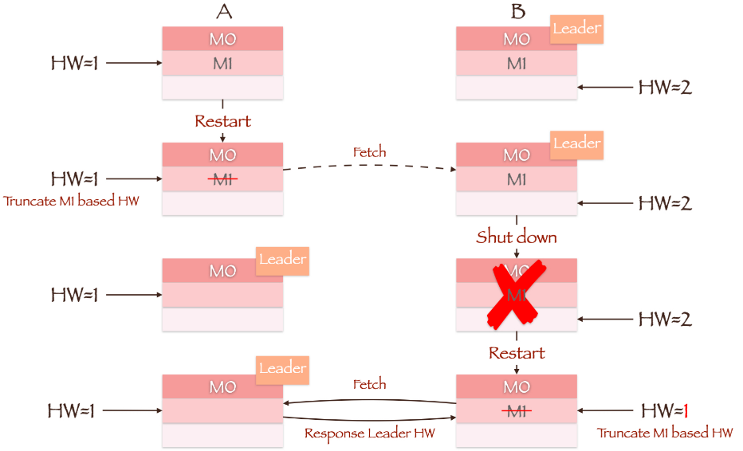

## Kafka基本

==【八股】Kafka是什么？==

Kafka是一个分布式的流处理平台，主要用于高吞吐量、可扩展、容错的消息发布和订阅系统，广泛用于日志收集、消息队列、实时数据处理等场景；

简单来说：Kafka就是一个消息中间件。

---

==【八股】Kafka有哪些特点？==

- **高吞吐量、低延迟**：kafka每秒可以处理几十万条消息，它的延迟最低只有几毫秒；

- **可扩展性**：kafka集群支持热扩展；

- **持久性、可靠性**：消息被持久化到本地磁盘，并且支持数据备份防止数据丢失；

- **容错性**：允许集群中节点失败（若副本数量为n,则允许n-1个节点失败）；

- **高并发**：支持数千个客户端同时读写；

---

==【八股】使用Kafka的场景？==

**收集日志**：

背景：多个系统服务产生的日志，需要统一的收集、存储、分析；

- 每个服务将日志发送到Kafka的一个或多个Topic中；
- 下游系统（Hadoop、ELK）作为Consumer订阅这些Topic，异步消费并处理日志；

**用户行为分析**

背景：电商平台、内容平台需要分析用户的浏览行为、点击、搜索等；

- Web应用/前端埋点把用户行为发送到Kafka；
- 实时分析平台（Spark、Flink）从Kafka消费数据，计算指标、输出分析结果；

**用作消息队列，解耦服务**

背景：服务之间有大量的数据传递需求，传统的同步调用（HTTP、RPC）会导致耦合严重

- 用Kafka在各个微服务之间传递消息；
- 比如订单服务下单后，将订单信息写入Kafka；库存服务、通知服务订阅Topic进行库存扣减、发送通知等；

---

==【八股】Kafka如何实现高吞吐率？==

**顺序读写**

- Kafka的消息是不断追加写到文件中，这个特性可以减少硬盘磁头的寻道时间，充分利用磁盘的顺序读写性能；

**零拷贝**

- 消费者消费消息涉及数据从Broker到Consumer的传递，这个网络传递信息的过程需要数据拷贝；
- 零拷贝可以在数据复制过程中，减少2次上下文切换的开销，提升一倍的性能；

**文件分段**

- Kafka中的Topic分为多个Partition，每个Partition可以分为多个Segment段；
- 每次都是针对一部分数据进行操作，轻便快捷，并且可以增加并行处理能力；

**批量发送**

- Producer -> Broker：Producer可以将消息缓存到本地，等满足要求后，批量发送给Broker；
- Broker -> Consumer：Consumer可以通过Pull模式，批量拉取消息进行消费；

**数据压缩**

- Kafka支持对消息集合进行压缩，Producer负责压缩消息，Consumer负责解压缩，从而减少传输的数据量，减轻网络传输的压力；

- 上述过程虽然增加了CPU的工作，但在面对大数据处理上，瓶颈在网络IO上，所以这点成本开销可以接受；

**其他**

- Kafka不保存消息“是否被消费的状态”，而是通过Offset来确认（Offset之前的是已消费的消息，Offset之后是未消费的消息），并且Offset可以任意移动；

---


## Kafka架构设计

### 整体介绍


**Producer**

消息生产者，负责把数据发送到Kafka中的Topic。

---

**Topic**

主题，Kafka中的==逻辑==分类单位。

- Producer将消息发送到Kafka，Consumer从Topic中读取消息；
- 每个Topic可以有1个或多个Partition；

---

**Partition**

分区，Kafka对于消息的==物理分片==。

- 一个大的Topic可以有多个Partition，分布在不同的Broker上，这样可以提升并发读写能力；
- 每个Partition是一个有序队列，单个Partition内的消息是有序的；
- 一个Topic内若有多个Partition，则无法保证整个Topic的消息消费是有序的；同一个Partition的数据只能由Consumer Group中的一个Consumer消费，可以保证消费顺序；

---

**Broker**

Kafka集群中的服务器节点，负责存储Partition中的数据、处理Producer的写入请求、处理Consumer的读取请求

- 一个Kafka集群由多个Broker构成；
- 每个Broker可以处理多个Topic/Partition；

---

**Consumer**

消息消费者，从Kafka中的Topic中读取消息进行处理。

- 一个Consumer Group由多个Consumer组成；
- 一个Consumer只能消费一个Partition中的数据；

**Consumer Group**

消费者组，其中的每个消费者都消费同一个Topic的消息。

- Kafka会自动将Partition分配给组内的每一个消费者；
- 通过消费者组，可以实现负载均衡消费；

---

**zooKeeper**

协调服务，Kafka用来管理集群元数据、Leader选取、Broker状态等

- 新版的Kafka在逐渐脱离zooKeeper的依赖（Kafka 2.8版本之后，可以使用“Kafka Raft”模式来代替zooKeeper）；

---

**Replica**

副本，为了容灾和高可用，Kafka支持每个Partition有多个副本

- 一个Partition可以有多个副本，他们之间有相同的数据；
- 副本分为Leader副本和Follower副本：Leader处理所有的读写请求；Follower仅用来做数据备份，在Leader副本挂了的时候，会从Follower中选取新Leader

---

**Offset**

位置标识，是Kafka中每条消息在Partition中的唯一编号，表示消息在该分区中的位置索引（偏移量）

- 标识消息位置，例如：`offset=3`，表示前三条消息我一定读取了，接下来读取第4条消息；
- Kafka读完消息并不会删除消息内容（会保留一段时间），因此只要记录好offset的位置，就可以重复消费旧消息；这样做方便补数据、测试回放、故障恢复；


### 架构 | Producer

==【八股】集群下，Kafka中Producer的执行过程？==

1、Producer生产消息，确定要写入的Topic和对应的Partition；

2、从zookeeper中找到对应Partition的Leader；

3、通过ISR列表将消息通知给对应的Follower；

4、Follower从Leader拉取消息，并发送Ack；

5、Leader收到所有副本的Ack，更新Offset，并向Producer发送Ack，表示消息写入成功；

---

==【八股】生产者发送消息的流程？==


- 拦截器：可以自定义，默认没有拦截器；
- 序列化器：可以在配置文件中为消息的键、值各自选择合适的序列化器；
- 分区器：可以根据业务场景，自定义分区器，用于将消息写入对应的Partition；

---

==【八股】Kafka的消息是Push模式还是Pull模式？==

Kafka的消息模式是：

- Producer -> Broker：**Push模式**，即生产者主动将消息发送给Kafka；
- Broker -> Consumer：**Pull模式**，即消费者从Kafka中拉取消息；

---

Pull模式的优点：

- **消费者可以控制消费节奏**：不同消费者的消费能力不同，Pull的方式可以让消费者按照自己的节奏消费消息，消费能力比较灵活；
- **方便实现批量消费**：Pull模式下，消费者可以决定是单独消费消息还是批量消费消息，比较灵活；

- **消费策略更灵活**：比如手动提交offset、延迟消费、重试机制等都更容易实现；

Pull模式的缺点：

- **轮询消耗资源**：如果Broker没有可供消费的消息，将导致Consumer不断在循环中轮询；
- **Kafka解决措施**：Kafka可以设置参数，让Consumer能阻塞式的知道是否有新消息到达（或到达消息的数量是否到某个数值）；

---

Push模式的优点：

- **低延迟**：消息一旦产生就立即推送，延迟小，适合对实时性要求比较高的场合，比如：实时报警
- **对消费者来说，实现简单**：消费者无需关注消息拉取的细节、Offset等逻辑，只需要接收消息并处理即可；

Push模式的缺点：

- 缺乏消费节奏的控制
- 不易实现批量处理；

- 难实现重试和容错；

- 对Broker的调度能力要求高；

---


### 架构 | Consumer

==【八股】消费者消费消息的流程？==

1、订阅Topic + Partition；

2、Pull模式拉取消息；

3、消息反序列化：将消息从二进制或字符串格式，反序列化为业务对象；

4、处理消息；

5、确认消息（ACK/Commit）：表示消息消费成功，可以自动确认 或 手动确认（推荐）

6、异常处理和重试：

- 消息消费失败，可以重试（立即或延时）；
- 消息消费失败，进入死信队列；
- 消息消费失败，记录失败日志或报警；


==【八股】讲一下Kafka Consumer消费消息时的线程模型，为何如此设计？==

待定。


### 架构 | Partition

#### 基础内容

==【八股】Kafka分区（Partition）的目的是什么？==

**对于生产者 | 提高Kafka集群的数据生产能力并实现负载均衡**

- 一个Topic的不同Partition，可以分布在不同的Broker上，生产者可以并行写入，提高写入速度；
- 当多个生产者同时写入同一个主题时，由于分区机制，写入操作可以分布在不同Broker上，减少单点压力，实现负载均衡；

**对于消费者 | 提高Kafka集群的数据消费能力**：

- 每个Topic可以有多个Partition，Kafka的Consumer Group可以并行消费不同Partition的数据；
- 通过设置分区，可以让更多的消费者同时消费，提升吞吐量；

**对于消费者 | 保证数据有序性**

- Kafka只能在Partition内保证消息消费的有序性；
- 如果某类业务场景的消息需要按照顺序消费，可以使用分区键（Partition Key），使得相同键的消息进入同一分区，再被同一个消费者来消费；

---

==【八股】Kafka如何做到消息的有序性？==

- Kafka中每个Partition是一个有序的、不可变的日志队列；并且单独的一个Partition只能由一个Consumer来消费；
- 将同一类型的消息，通过分区键来写入到同一个Partition，就能保证该类型消息消费的有序性；

---

==【八股】为什么Kafka的Partition只能增加不能减少？==

Kafka的Partition数量可以变更，但是只能增加不能减少，原因如下：

- 数据存放问题：如果减少分区，对应的数据如何处理？删除数据，就会导致数据丢失；保留数据到其他Partition，就会破坏Partition的分区有序性；

- 增加实现复杂度：如果保留数据并且保证Partition的分区有序性，实现难度会很大，所以就禁止减少分区数量；

---

==【八股】生产者将消息写入Partition的策略是啥？==

> 即：怎么确定一条消息写入到Topic中哪个Partition里面

**消息写入策略有如下**：

轮询策略（Round-Robin）：

- 当没有指定Key的时候，生产者按照轮询方式将消息依次分配到所有可用的Partition；
- 能保证负载均衡，但无法保证消息有序；

Key分区策略：

- 当消息包含Key，Kafka对Key进行哈希处理，来确定消息分配到哪个Partition；
- 可以保证消息的顺序性；

自定义分区策略：

- 通过自定义`Partitioner`，来实现特定的消息写入策略；
- 灵活性高，但是需要开发者自行实现和维护；

---

**消息写入策略的最佳实践**：

选择合适的分区数量：

- 保证平衡负载；过多分区数量会增加管理开销，过少分区数量会影响并行处理能力；

优化Key的选取：

- 使消息能够均匀分布到各个Partition，避免数据倾斜；
- 对于需要保证消息有序性的业务场景，Key的选择更为重要，可以通过选择唯一标识的内容来作为Key，比如：用户ID、订单ID。

监控和调整分区策略：

- 实时监控分区效果（监控Partition的负载和性能）；
- 合理进行动态调整（包括分区策略和分区数量），保证系统的高效运行。

实现高性能生产者：

- 批量发送消息（提高网络和存储效率，减少延迟）；
- 异步发送消息（提高消息的发送性能）；


#### partition、segmengt、offset

==概念间的对应关系==

（Topic）、Partiton、segment、offset之间存在相互关系。如下是一个Kafka中某个Topic中的某个Partition所对应的文件夹：

```lua
/tmp/kafka-logs/user_log-0/     <-- partition 0 的目录
├── 00000000000000000000.log    <-- segment 数据文件
├── 00000000000000000000.index  <-- segment 索引文件
├── 00000000000000000000.timeindex	<--存储时间戳到物理位置的索引
├── 00000000000000000000.snapshot	<--存储状态快照，用于 Leader 切换场景（可选）
├── 00000000000000001000.log    <-- 下一个 segment（起始 offset 是 1000）
├── 00000000000000001000.index
...
/tmp/kafka-logs/user_log-1/     <-- partition 1 的目录
...
```

他们之间的对应关系如下：

`Topic`：

- 主题，物理概念，没有对应的文件夹；
- 上述主题的名字为：**user_log**

`Partition`：

- 是Topic物理上的分组，每个Partition是一个有序队列，存储了Topic的部分消息；

- 有对应的文件夹，命名规则：**topic名称 + 有序序号**，例如上述的**user_log_0**；

`segment`：

- Partition由多个segment组成，每个segment由两大部分组成：index_file（存储索引）和log_file（存储数据）；

- 上述文件夹内，编号相同的一组文件是一个segment；一个segment内的不同文件有不同的意义；

`offset`：

- 消息偏移量，可以用来定位消息位置；

- 针对上述内容而言：`offset=100`的消息，就定位到第1个segment中；`offset=1005`的消息，就定位到第2个segment中

---

==segment文件的存储结构：.index文件和.log文件的详细内容==

图示：


`3, 497`：

- 3表示是该segment内的第3条消息，在整个Partition内的offset为368772（3+368769），即：segment内的数据偏移量 + segment本身的偏移量；
- 497表示该消息在.log文件中的物理偏移地址，即第497个字节的位置；

---

上述Message的组成：

|        概念         | 大小（byte） | 含义                                                     |
| :-----------------: | :----------: | :------------------------------------------------------- |
|       offset        |      8       | Partition里面的偏移量，表示该Partition内的第offset条消息 |
|    message size     |      4       | message大小                                              |
|        CRC32        |      4       | 用crc32校验message                                       |
|        magic        |      1       | 表示本次发布Kafka服务程序协议版本号                      |
|     attributes      |      1       | 表示为独立版本、或标识压缩类型、或编码类型。             |
|     key length      |      4       | 表示key的长度,当key为-1时，K byte key字段不填            |
|         key         |              | 可选                                                     |
| value bytes payload |              | 表示实际消息数据。                                       |

---

==【八股】如何在Partition中通过offset查找到消息内容？==

步骤1：找到对应的segment

- 第一个.index文件的起始偏移量为0；后续文件（假设文件名为00001000.index），起始偏移量为1000+1=1001；
- 通过二分查找，即可找到对应的segment；

步骤2：在segment内找到对应的消息

- 根据offset和segment本身的起始偏移量，顺序查找消息内容；

---

==【八股】Kafka中消息读写的特点：==

写消息：

- 消息从`Java堆`转入到`page cache`（物理内存）；
- 由异步线程刷盘，消息从`page cache`刷入磁盘；

读消息：

- 消息能在`page cache`中找到，直接从socket发送；
- 消息不在`page cache`中，先从磁盘Load消息（会产生IO），再从socket发从出去；

---

==【八股】每个segment内存储的消息数量是否一致？==

不一致。

segment的划分标准是**按照大小**或**按照时间**：

- `segment.bytes`：segment达到指定大小，就划分新的segment；
- `segment.ms`：segment存在时间达到指定时间，就划分新的segment；

---

==【八股】Kafka设置segment的好处？==

方便写入：

- Kafka使用segment做**追加写**，完全顺序写磁盘，IO速度块；
- 只有当前活跃的segment可写，旧的segment封存（只读状态）；

方便定位：

- segment文件提供baseOffset + `.index`文件的索引定位（消息的逻辑位置offset -> 消息的物理内存）

方便管理老旧数据：

- Kafka按照segment滚动写入，可以很方便的删除旧数据；
- 删除方式可以有：按照时间（segment的最后修改时间超过一定标准，就删除） 和 按照大小（partition总大小超过一定标准，就删除）

日志压缩和副本复制更高效：

- kafka按照segment为单位来扫描、压缩；
- 副本同步时，只同步未同步的segment文件；


### 架构 | Offset

==【八股】Kafka如何维护消费状态跟踪？==

**【1】维护消费状态跟踪的好处？**

确保数据的可靠性和一致性：

- 避免数据丢失：Kafka通过offset来确定当前消费到哪条消息，即使消费者崩溃或重启，也会在offset处重启，从而避免数据丢失；
- 避免重复消费：offset之前的消息是已消费的，之后的消息是未消费的；每个Partition单独维护自己的offset，可以避免重复消费；

方便故障恢复：

- 消费者崩溃恢复：可以通过offset，来确定消费消息的位置；
- 重新平衡消费者组：消费者属于消费者组，如果消费者数量发生变化，消费者组会重新平衡。这样新来的消费者就可以通过offset来继续进行消费；

方便消息的负载均衡和水平扩展：

- 负载均衡：通过跟踪每个Partition的offset，Kafka可以确保消费者组内的各消费者均衡的分配工作，避免过载和空闲的情况出现；
- 水平扩展：当需要增加吞吐量时，可以添加更多的消费者；当消费者离开时，可以平衡剩余的消费者正常工作；

---

**【2】Kafka的消费状态跟踪机制？**

Kafka通过以下几个关键机制来实现：

`Offset`（偏移量）：

- 每个消息在Kafka中都有唯一的一个偏移量表示。通过offset，可以知道哪些消息被消费以及下次从哪个地方开始消费；
- Kafka允许将offset存储在外部系统（zooKeeper或Kafka自身），以确保在消费者故障或重启的时候，能准确恢复；

`Commit`（提交）：

- 消费者不会在消息消费后立即更新偏移量，而是定期或手动的将偏移量提交到Kafka或外部系统，以方便故障恢复；
- 自动提交模式：消费者消费累计一定数量的消息后，自动提交偏移量；可能导致发生故障时丢失部分已消费但未提交的消息；
- 手动提交模式：允许消费者自定义偏移量的提交时机；这种方式更灵活，也更加需要关注和管理；

`Checkpoint`（检查点）

- 检查点代表消费者已经成功消费并确认的消息位置。当消费者启动或故障恢复时，会从最近的检查点开始消费消息；
- 检查点和偏移量的提交是相结合的，可以有效保证故障恢复；

`Rebalance`（再均衡）：

- 当消费者组的消费者实例数量发生变化时，Kafka会触发再均衡操作，重新分配Partition给消费者，以确保每个Partition都有一个消费者实例；
- 在再均衡过程中，消费者暂停消费，保存当前状态（偏移量和检查点）；然后等待Kafka重新分配消费者实例；从正确的位置读取并继续进行消费；

---

**【3】有哪些优化消费者状态跟踪的措施？**

- 合理设置偏移量的提交间隔；
- 使用手动提交模式；
- 监控消费者的状态和性能；
- 优化消费者配置：根据实际需求，调整消费者的配置参数，以提高消费效率和性能；

----


### 机制 | Replica

> 参考文章：[链接](https://www.cnblogs.com/caoweixiong/p/12049462.html)

#### 基本概念

==副本的定义==

Kafka中有主题Topic的概念。在Topic下面，有分区Partition的概念，副本Replica就是在分区层次中的概念。

每个分区有多个副本Replica，即有多份数据备份。

---

==副本中的角色==


在Kafka中，副本间保持数据同步的方式是【基于领导者（Leader-Based）的副本机制】

- 每个Partition的副本分为2类：领导者副本和追随者副本。每个Partition在创建的时候会选取一个领导者副本，其余副本就是追随者副本；
- ==Kafka的副本机制比其他分布式系统要更严格一些==，追随者副本不对外提供服务（读写请求都不响应，仅领导者副本会提供该Partition的读写请求），仅是作为数据备份，从领导者副本中异步拉取消息，并写入到自己的提交日志中，从而完成数据同步。
- 当领导者副本挂掉了，或者说领导者副本所在的 Broker宕机时，Kafka 依托于 ZooKeeper  提供的监控功能能够实时感知到，并立即开启新一轮的领导者选举，从追随者副本中选一个作为新的领导者。老 Leader  副本重启回来后，只能作为追随者副本加入到集群中。

---

==【八股】Kafka中的副本不对外提供读、写服务，这样设计的好处？==

方便实现“Read-your-writes”

- 即：当数据写入成功的时候，就能读取到数据；
- 若允许追随者副本提供读服务，因为消息的异步同步需要时间，则会造成延迟，客户端就无法立即看到最新的消息。

方便实现单调读：

- 什么是单调读呢？就是对于一个消费者用户而言，在多次消费消息时，它不会看到某条消息一会儿存在一会儿不存在。
- 如果允许追随者副本提供读服务，那么假设当前有 2 个追随者副本 F1 和 F2，它们异步地拉取领导者副本数据。倘若 F1 拉取了 Leader 的最新消息而 F2  还未及时拉取，那么，此时如果有一个消费者先从 F1 读取消息之后又从 F2  拉取消息，它可能会看到这样的现象：第一次消费时看到的最新消息在第二次消费时不见了，这就不是单调读一致性。但是，如果所有的读请求都是由  Leader 来处理，那么 Kafka 就很容易实现单调读一致性。


#### AR、OSR、ISR

==概念解释==

数量上的关系：`AR = ISR + OSR`

AR（Assigned Replicas）：

- 分区中所有的副本；

ISR（In-Sync Replicas）：

- ISR是AR的一个子集，由领导者副本来维护；
- ISR里面包含领导者副本本身和能正常完成数据同步的追随者副本；

OSR（Outof-Sync Replicas）：

- 追随者副本从领导者副本同步数据的时候，存在一定延迟。当延迟超过某个阈值，就会把该追随者副本踢出ISR列表，并加入到OSR列表中；
- 新加入的追随者副本也会先存放在OSR中；
- 故障恢复的Follower也会先加入OSR中；

---

==【八股】Kafka判定一个追随者副本是否正常同步领导者副本消息的依据是什么？==

依据是**时间**，不是**数量**。有个阈值参数：`replica.lag.time.max.ms`。

- 当领导者副本消息的写入速度 > 追随者副本的消息同步速度，就会造成数据同步延迟，这个延迟的持续时间如果超过上述阈值后，就会认为数据是不同步的，即将该追随者副本踢出ISR；
- 若被踢出ISR列表的追随者副本，其消息逐渐与领导者副本同步，还会被重新加入ISR列表。

---

==【八股】Kafka中维护ISR列表的地方有哪些？==

Controller维护

- Kafka从集群中选取一个Broker为Controller，负责Partition的管理和副本状态管理；

Leader来维护

- 领导者副本有单独的线程，定期检测ISR中的追随者副本是否脱离ISR。如果发生变化，会将新的ISR消息返回到zookeeper的相关饥饿点中；

---


#### Unclean领导者选举

**情景**

ISR是可以动态调整的，如果ISR列表为空，即领导者副本也挂掉了，该怎么选取新的Leader？

**面临的问题**

ISR列表为空，表明所有追随者副本的消息是落后于领导者副本的。

- 如果从这些追随者副本中选取Leader，就会造成数据丢失，但能保证服务正常提供；
- 如果不从中选取Leader，虽然维护了数据一致性，但是不得不对外停止服务；

**参数设置**

Broker端的参数` unclean.leader.election.enable`

- 开启该参数，表明允许从消息落后的追随者副本中选取Leader；
- 关闭该参数，即不允许从消息落后的追随者副本中选取Ledaer；

建议**不要**开始开启该参数

---


#### 主从同步机制 | HW

> 即Follower副本向Leader副本同步数据的过程。

==Kafka实现副本同步的机制？==

Consumer正在消费Leader中`offset=10`的数据，此时Follower仅同步到`offset=8`；当Leader所在的Broker宕机后，当前的Follower选举为新的Leader，Consumer再次消费时，就会发生错误。

如何避免上述问题？Kafka引入HW（High Watermark）机制来解决。

---

==HW机制介绍==

HW机制定义了消息的可见性，即标识了Partition中哪些消息是可以被Consumer消费的。

每个Partition副本都有其自己的HW和LEO。


相关概念如下：

- `LEO`（Log End Offset）：Partition副本要写入下一条消息的Offset；

- `HW`（High Watermark）：Partition副本中已经备份或提交的消息的下一个Offset；

两个概念之间有如下数学关系：

- `HW <= LEO`；
- `[0, HW]`之间的消息是可见的；`[HW, LEO)`之间的消息是不可见的；

当集群中的副本所在的Broker发生宕机并恢复后，副本会将数据从HW处截断，然后再开始从Leader同步数据。

---

==HW的更新机制==


1、Producer向.log写入数据，首先更新`Leader LEO`；

2、等到Follower向Leader发送同步请求时（Fetch），根据请求携带的信息来更新`Remote LEO`；

3、Leader计算所有的副本LEO，选取最小的一个作为`Leader HW`；而HW是递增的，为了避免HW的值减小，就定义了`max[Leader HW, min(all LEO)]`；

4、Follower在收到Leader的响应后（带着未同步的消息和Leader HW），写入消息到.log文件；然后更新自身的`Follower LEO`；再更新自身的`Follower HW`；

---

**假设Leader和Follower中没有任何数据，现在向Leader中写入一条数据，各项参数值的变化如下**：


可以看出：Follower想要跟Leader同步数据，需要2轮的Fetch请求。

---

==HW机制的隐患？==

从上述同步过程可知，`Follower HW`在某一阶段内总是落后于`Leader HW`，因此副本在根据HW值截取数据时，就有可能发生数据的丢失和不一致。

**数据丢失现象**



|          | A                                                    | B                                                            |
| :------: | ---------------------------------------------------- | ------------------------------------------------------------ |
| 初始条件 | `LEO=2`、`HW=1`                                      | `LEO=2`、`HW=2`                                              |
|   Case   | A准备根据B的响应，将自身的`HW`更新为2，但此时A重启了 |                                                              |
|   结果   | A根据自身的`HW`截断消息，并更改`LEO=HW=1`            |                                                              |
|   Case   |                                                      | A向B发起Fetch请求的时候，B宕机了，于是A成为Leader            |
|          |                                                      | B准备重启，向A同步消息                                       |
|   结果   |                                                      | B的`LEO`仍然为2；然后向A发起Fetch请求，更新自身`HW=1`，数据M1被截断 |
|          |                                                      | 如果`min.insync.replicas=1`，Producer不会因为同步未成功而重新发送消息，那么M1就永远丢失了 |

---

**数据不一致现象**


|          | A                                                 | B                                      |
| :------: | ------------------------------------------------- | -------------------------------------- |
| 初始条件 | `LEO=2`、`HW=1`                                   | `LEO=2`、`HW=2`                        |
|   Case   | A向B发起Fetch请求，以此同步数据，但是两者均宕机了 |                                        |
|          | A先重启成功，并且成为新的Leader                   |                                        |
|          | 此时A是唯一副本，Producer向A写入数据M2            |                                        |
|   结果   | A更新其`HW=2`                                     |                                        |
|   Case   |                                                   | B重启成功                              |
|          |                                                   | B向A发起Fetch请求，同步数据            |
|   结果   |                                                   | 两者的`HW`相等，无需更新，无需截断处理 |
|          |                                                   | 两者的第2条数据就永远不一致了          |


#### 主从同步机制 | Leader Epoch

> 用来弥补HW机制的不足

==基本概念==

- `Leader Epoch`：一个32位单调递增的数字，代表每一个Leader副本时代。每个副本的Leader Epoch既要缓存在内存中，也要定期写入消息目录下的`leader-epoch-checkpoint`文件中。

- `Leader Epoch Start Offset`：每一个Leader副本时代的第一条消息的偏移量（位移）；

- `Leader Epoch Sequence File`：一个序列文件，每一个Leader副本时代，`Leader Epoch Start Offset`的变化就记录在里面；

- `Leader Epoch Request`：Follower副本向Leader发起请求，用于寻找日志一致的起点，从而避免数据误删或错误的追加。

---

示例：

```file
0, 0
1, 100
...
```

- Leader副本时代`0`的位移为`0`，表示从`offset=0`开始写入数据；Leader副本时代`1`的位移为`100`，表示从`offset=100`开始写入数据；
- Leader副本时代`n`的`LEO` = Leader副本时代`n+1`的位移。上述例子中：Leader副本时代`0`的 `LEO` = 100 = Leader副本时代`1`的 位移（`Leader Epoch Start Offset`） 

---


==当一个Follower副本（故障前非Leader）从故障中恢复后，相关流程如下：==

1、Follower恢复后加入OSR列表，尝试与Leader进行同步；

2、Follower向Leader发送`Leader Epoch Request`请求，请求中包含该Broker里面每个Partition的`Epoch`和`LEO`（该Follower中当前保存日志中的LEO）；

3、Leader检查发送来的请求，根据Follower发送过来的`Epoch`，查询自己的`LeaderEpochCache`（维护了每个Epoch对应的位移），确认差异点：

- 如果Leader和Follower处于同一个Epoch，则返回Leader的`LEO`；
- 如果Leader和Follower处于不同的Epoch，则返回Follower所在的Epoch的位移；

4、Follower进行日志追平：

- Follower对比自己的Offset和Leader返回的Offset，如果Follower自身的Offset大，则需要进行数据截断，从而避免不一致的数据；
- 然后再从Leader拉取缺失的日志；

5、完成日志同步，更新本地Leader Epoch表；并加入ISR，以参与后续的副本复制和Leader选举；

---


==避免上述HW机制中出现的数据丢失和数据不一致现象==

**防止数据丢失**


|          | A                                                            | B                                                            |
| :------: | ------------------------------------------------------------ | ------------------------------------------------------------ |
| 初始条件 | `LEO=2`、`HW=1`                                              | `LEO=2`、`HW=2`                                              |
|   Case   | A准备根据B的响应，将自身的`HW`更新为2，但此时A重启了         |                                                              |
|   结果   | A向B发起`LeaderEpochRequest`，因为两者处于同一个`Epoch`，所以B返回其`Offset=LEO=2` |                                                              |
|          | A中的`offset=2`，所以无需截断任何数据                        |                                                              |
|   Case   |                                                              | A向B发起Fetch请求的时候，B宕机了，于是A成为Leader            |
|          |                                                              | B准备重启，向A同步消息                                       |
|   结果   | A更新自己的`Epoch`，将自身的`LEO`写为新Epoch的位移           |                                                              |
|          |                                                              | A和B处于不同的Epoch，于是A返回`Epoch=0`所在的偏移量，即`Offset=2` |
|          |                                                              | B的偏移量 = A返回的偏移量，无需进行数据截断                  |
|          |                                                              | 追平日志后，更新B的LE                                        |


**防止数据不一致**


|          | A                                                 | B                                                            |
| :------: | ------------------------------------------------- | ------------------------------------------------------------ |
| 初始条件 | `LEO=2`、`HW=1`                                   | `LEO=2`、`HW=2`                                              |
|   Case   | A向B发起Fetch请求，以此同步数据，但是两者均宕机了 |                                                              |
|          | A先重启成功，并且成为新的Leader，更新LE为`(1, 1)` |                                                              |
|          | 此时A是唯一副本，Producer向A写入数据M2            |                                                              |
|   结果   | A更新其`HW=2`                                     |                                                              |
|   Case   |                                                   | B重启成功                                                    |
|          |                                                   | B向A发起请求，同步数据                                       |
|   结果   |                                                   | A和B不在一个Epoch内，于是A接受B的请求后，返回`Epoch=0`所在的偏移量，即`offset=1` |
|          |                                                   | 此时B的`Offset=2`，于是进行数据截断，将M1给剔除掉；          |
|          |                                                   | 后续进行日志追平，并更新自己的LE                             |

---

==【八股】为什么有了Leader Epoch机制后，还需要HW机制？==

两种机制的侧重点不同，都需要使用：

- `Leader Epoch`用于确保主从副本切换时，副本的正确性和一致性，弥补了HW机制再这方面的不足；
- `HW`用于控制消费者只能消费那些**已确认**的消息，即Partition所有副本中，都已经同步完成的数据；


## 其他
