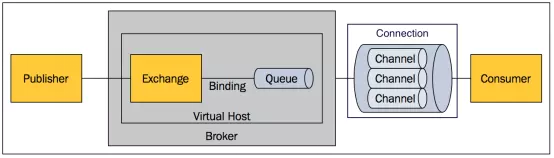
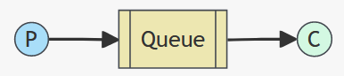
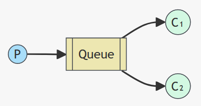
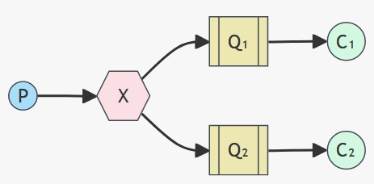
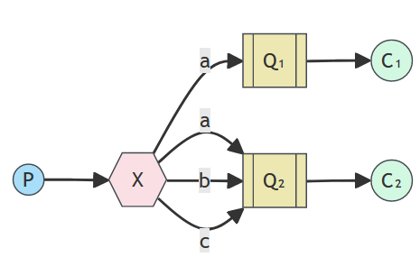
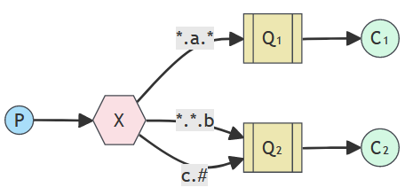
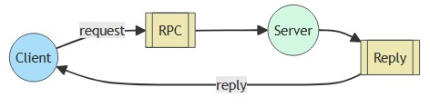

## 基本概念

==【八股】什么是RabbitMQ？==

RabbitMQ是一个erlang语言开发的消息队列，用于应用间的异步协作。

==【八股】使用消息队列有什么好处？==

- 异步：通过异步处理提高系统性能，减少系统等待时间
- 削锋/限流：
  - 大量的访问先放到消息队列里面，然后均匀的分发给消费端，避免流量峰值，完成削锋；
  - 通过参数限制消费端最多消费的消息数量，完成限流，避免消费端压力过大
- 解耦：降低系统的耦合性

==【八股】使用消息队列回带来哪些问题？==

- 系统可用性降低
- 系统复杂性提高
- 数据一致性问题

---

==【八股】消息队列的选择？==

|            | **RabbitMQ**            | **ActiveMQ**                   | **RocketMQ** | **Kafka**  |
| ---------- | ----------------------- | ------------------------------ | ------------ | ---------- |
| 公司/社区  | Rabbit                  | Apache                         | 阿里         | Apache     |
| 开发语言   | Erlang                  | Java                           | Java         | Scala&Java |
| 协议支持   | AMQP，XMPP，SMTP，STOMP | OpenWire,STOMP，REST,XMPP,AMQP | 自定义协议   | 自定义协议 |
| 可用性     | 高                      | 一般                           | 高           | 高         |
| 单机吞吐量 | 一般                    | 差                             | 高           | 非常高     |
| 消息延迟   | 微秒级                  | 毫秒级                         | 毫秒级       | 毫秒以内   |
| 消息可靠性 | 高                      | 一般                           | 高           | 一般       |

==【八股】为什么选择RabbitMQ作为消息队列？==

- 消息延迟低
- 稳定可靠，RabbitMQ公司专门做RabbitMQ

---

==【八股】RabbitMQ的组件有哪些？==



| 名称           | 中文名称     | 作用                                                         |
| -------------- | ------------ | ------------------------------------------------------------ |
| `Message`      | 消息         | 由消息头和消息体组成。消息头可设置相关属性；消息体不透明     |
| `Publisher`    | 消息的生产者 | 用于生产消息                                                 |
| `Exchange`     | 交换机       | 用于接受消息并将消息路由到一个或多个`Queue`上                |
| `Binding`      |              | 通过`Binding`将交换机和队列关联，给交换机指定可以路由分发的队列集合 |
| `Queue`        | 消息队列     | 用于存储消息                                                 |
| `Virtual host` | 虚拟主机     | 每个`Virtual host`都有独立的上述组件内容。<br />可以类比Docker的容器概念。不同的应用使用同一个`RabbitMQ`，为了确保不同应用间的隔离性，就可以创建不同的`Virtual host` |
| `Broker`       |              | 可以理解为消息队列服务器的实体。                             |
| `Consumer`     | 消息的消费者 | 用于消费消息                                                 |

可以简单理解为：`Broker`包含除了`Publisher、Consumer`之外的所有组件

---

==【八股】Exchange交换机有哪些类型？==

Exchange交换机用于将消息分发到不同的Queue上，本身不具备消息存储的功能。

按照类型，交换机有四种：`fanout`、`direct`、`topic`、`headers`

|           |            |                                                              |
| --------- | ---------- | ------------------------------------------------------------ |
| `Fanout`  | 广播类型   | 将消息交给所有绑定到交换机的队列                             |
| `Direct`  | 订阅类型   | `Binding`绑定交换机和路由的时候会指定`binding key`；`Publisher`发送消息的时候会指定`routing Key`<br /> `Direct`交换机根据`binding key == routing Key`，将消息分发给特定的`Queue` |
| `Topic`   | 通配符订阅 | 增强版的`Direct`型交换机，支持`binding key`和` routing Key`之间的模糊匹配规则 |
| `Headers` | 头匹配     | 根据消息中消息头的属性进行匹配，用途较少                     |

---

==【八股】什么情况下消息队列会存在消息丢失？==

从消息的产生到消费这个过程分析，有三种消息丢失的情况：

- 从消息生产者到RabbitMQ
- RabbitMQ存储的消息丢失
- 从RabbitMQ到消息消费者

三种场景，也有分别对应的“防消息丢失”策略。

---

==【八股】为什么要进行消息限流？消费端怎么进行限流？==

**为什么要限流**？当RabbitMQ堆积了大量的消息时，队列里面的消息会大量涌入消费端，可能导致消费端的服务器崩溃。因此有必要对消费端进行消息限流。

限流措施：设置消费端可以消费的最大消息数量，通过Spring RabbitMQ提供的`prefatch`参数进行限流

限流原理：该参数表示消费者同时处理消息的最大值，当达到最大值的时候，该消费者会阻塞，不会消费新的消息，直到有消息ack之后才会消费新的消息

---

==【八股】RabbitMQ能保证消息按照顺序被消费嘛？==


## 如何保证消息可靠？

### 生产者发送消息可靠

==【八股】怎么保证消息发送者发送消息的可靠性？==（主要确保消息从消息生产者到RabbitMQ的可靠性）

方式1、生产者重试机制

- 原理：消息发送到RabbitMQ，等待响应。若发送失败，会重新发送，直到发送成功；发送成功后接受到响应，发送下一条消息
- 缺点：重试机制是阻塞式的，会禁止发送消息代码后边的代码；尽量指定重试次数，避免无限重试，影响业务使用。
- 解决场景：主要解决消息发送失败问题，比如因为网络波动，短暂无法连接MQ

方式2、生产者确认机制

- 原理：包括`Publisher Confirm`和`Publisher Return`两种。

  - 开启`Publisher Confirm`后：

  ```
  当消息成功发送到交换机之后，RabbitMQ返回一个ack给生产者
  
  当消息发送到交换机失败，RabbitMQ返回一个nack给生产者
  ```

  - 开启`Publisher Return`后：

  ```
  当消息成功发送到交换机之后，且后续正常，不会返回return
  
  当消息成功发送到交换机之后，后续出现异常，会返回return
  - 异常情况：消息投递到交换机，但是路由失败
  ```

- 解决场景：

  - MQ内部处理消息的进程发生异常
  - 生产者发送消息到达MQ后未找到`Exchange`
  - 生产者发送消息到达MQ的`Exchange`后，未找到合适的`Queue`，因此无法路由

---

【上述八股的补充内容】

==【八股】SpringBoot中关于MQ的Publisher Confirm有几种模式可选？==

有3中模式可选：

- `none`  ：即关闭`Publisher Confirm`

- `simple`  ：通过同步阻塞方式等待MQ的回执
- `correlated【常用】`  ：MQ通过异步回调方式返回回执


### MQ处理消息可靠

==【八股】怎么保证MQ处理消息的可靠性？==

方式1、数据持久化

- 默认情况下MQ的数据是在内存中的，一旦断电会数据丢失；通过数据持久化可以保证将数据写入磁盘。

- 数据持久化的要求：
  - 交换机持久化：默认使用
  - 队列持久化：默认使用
  - 消息持久化：发送消息的时候指定消息参数，来完成消息持久化

方式2、设置`LazyQueue`惰性队列

- 原理：接受到消息后直接将消息存入磁盘而不是内存中，当消费者需要消费消息的时候，才会从磁盘中读取消息加载到内存中
- 特点：在3.12版本之后，LazyQueue已经成为所有队列的默认格式

方式3、采用普通模式

- 即MQ不存储消息，直接将消息给消费者消费。用的少

方式4、设置集群

方式5、设置镜像模式

---

【上述八股的补充内容】

==【八股】LazyQueue和队列持久化的区别？==

两者虽然都涉及队列和消息的存储与恢复，但是侧重点不同：

- LazyQueue：侧重如何管理大量消息，减轻内存压力
- 队列持久化：侧重在如何确保MQ重启后，消息依旧存在（队列持久化需要配合消息持久化同时使用）


### 消费者消费消息可靠

==【八股】如何保证消费者消费消息的可靠性？==

**方式1、开启消费者确认机制`Consumer Acknowledgement`**

- 原理：当消费者处理消息后，向RabbitMQ发送一个回执，告知消息的处理结果，然后MQ根据回执结果，采取不同的策略处理消息

```
消息回执的类别及MQ处理策略：
- ack：消费者成功处理消息，MQ将该消息从队列删除
- nack：消费者处理消息失败，MQ再次投递该消息给消费者
- reject：消费者处理消息失败并且拒绝该消息，MQ将消息从队列中删除

reject回执用的少，一般是消息格式出现问题才用这个回执
```

**方式2、消费者重试机制**

- 原理：当消费者出现异常，消息会不断的重入队（requeue），再次发送给消费者。极端情况下会无限重试，占用资源，通常会设置有限的重试次数，避免无限重试

**方式3、业务幂等性**

- 原理：保证业务接口的幂等性来防止消息重复投递带来的影响
- 应用场景：主要用在可能产生重复消息的业务

```
可能产生重复消息的场景：
- 页面卡顿时频繁刷新导致表单重复提交
- 服务间调用的重试
- MQ消息的重复投递
```

- 实现手段：唯一消息ID、业务状态判断

```
唯一消息ID：（该方式与消息队列有关）
- 每一条消息都生成一个唯一的id，与消息一起投递给消费者。
- 消费者接收到消息后处理自己的业务，业务处理成功后将消息ID保存到数据库
- 如果下次又收到相同消息，去数据库查询判断是否存在，存在则为重复消息放弃处理。

业务判断：（该方式是保证幂等的通用操作）
- 在执行业务逻辑前，先判断相关数据状态
- 若状态表示已执行，就跳过业务逻辑的执行
- 若状态表示未执行，就继续执行后续业务逻辑

推荐后者。前者若在设计数据表的时候没有考虑相关字段，就需要改动相关表结构，比较麻烦。
```

**方式4、兜底方案**

- 原理：MQ消息通知终归有通知不到位的情况，若上述方式都失效，可以让消费者所在业务，直接去访问生产者所在业务的相关数据状态，从而决定是否执行相关业务逻辑

---

【上述八股的补充内容】

==【八股】SpringBoot中关于Consumer Acknowledgement机制的模式有哪几种可选？==

SpringBoot中关于消费者确认机制，提供了三种模式：

- `none`  ：不处理。消息投递给消费者之后立刻ack，删除消息；缺点就是非常不安全
- `manual`  ：手动模式。自己在业务代码中通过`try...catch...`调用对应的API；缺点是会对业务代码造成侵入
- `auto`  ：自动模式。SpringAMQP利用AOP对消息处理逻辑做环绕增强，根据业务执行情况，返回不同的回执

```
- 业务正常，返回ack
- 业务异常，返回nack
- 消息处理异常或检验异常，返回reject
	- o.s.amqp…MessageConversionException
	- o.s.messaging…MessageConversionException
	- o.s.messaging…MethodArgumentNotValidException
	- o.s.messaging…MethodArgumentTypeMismatchException
	- java.lang.NoSuchMethodException
	- java.lang.ClassCastException
```

---

==【八股】MQ中关于消费者重试机制，有哪些失败处理策略？==

有三种策略：

-  `RejectAndDontRequeueRecoverer`：重试耗尽后，直接`reject`，丢弃消息【默认方式】 
-  `ImmediateRequeueMessageRecoverer`：重试耗尽后，返回`nack`，消息重新入队 
-  `RepublishMessageRecoverer`：重试耗尽后，将失败消息投递到指定的交换机

第三种应用比较多，即将消费者无法消费的消息最终都放到一个队列中，最后人工处理。 


## 进阶概念

### 死信队列

==【八股】什么是死信队列？==

当队列满足以下条件之一，可以成为死信（dead letter）队列：

- 消费者使用`basic.reject`或 `basic.nack`声明消费失败，并且消息的`requeue`参数设置为false

- 消息过期，无人消费
- 消息队列消息已满，又有新的消息到来，消息队列头部的一个或几个消息就会成为死信，给新的消息腾出空间；

死信队列里面的消息称为：死信

---

==【八股】什么是死信交换机？有什么作用？==

概念：若一个队列是死信队列，并且通过一个队列属性`dead-letter-exchange`指定了一个交换机，那么队列中的死信就会投递到这个交换机中，这个交换机就是死信交换机

作用：收集死信消息，可以用于后续人工处理

---

==【八股】什么是Pull模式？==

Pull模式是指消费者主动从消息队列拉取消息进行消费的模式。与之对应的是Push模式（推模式）：消费者被动的接受消息并进行消费

Pull模式的优点：

- 消费端可以根据自己的需求和能力，控制消息拉取的频率和数量

- 可以避免因为消息过多过快导致的消费端服务器压力过大

Pull模式的缺点：

- 主动拉取消息，会额外产生网络开销
- 如果消息队列中没有消息可以拉取，消费者会进入等待状态，导致消费效率降低

---

==【八股】怎么设置消息的过期时间？==

方式1：生产者发送消息的时候给消息设置过期时间

方式2：创建队列的时候指定ttl，从消息入队列开始，当超过该时间，消息会被队列移除

---

==【八股】怎么发送延迟消息？==

方式1：通过死信队列和死信交换机以及消息过期时间，完成延迟消息的发送

```
- 将消息设置过期时间，投入队列，不绑定消费者，使其过期，成为死信
- 将队列绑定一个死信交换机
- 过期的消息会进入死信交换机，再进行消费处理，就实现了延迟消息

该方式的缺点是：实际延迟时间可能大于过期时间。因为消息成为死信后不是立马投递到死信交换机，而是恰巧死信在队列头部的时候，才会投递给死信交换机。
```

方式2：通过插件DelayExchange


### RabbitMQ的工作模式

==【八股】RabbitMQ有哪些工作模式？==

- 普通模式



- work模式



- publish/subscribe 发布订阅模式



- routing模式



- topics模式



- RPC模式




## 牛客看到的综合八股

==【八股】什么是幂等？使用rabbitMQ时幂等要怎么实现？==

幂等：一个操作，多次执行的结果和单次执行的结果一致

在使用消息队列的时候，保证接口的幂等性，主要是保证消费者消费消息的可靠性。

---

==【八股】怎么保证业务接口的幂等性？==

- 前端层面：当用户点击提交按钮后，可以将按钮设置为不可点击状态。效果有限
- 数据库层面：加锁、建立唯一索引，保证多个相同请求到来时，单一时刻只处理一个请求，不会出现多线程并发问题
- 业务层面：设计合理的状态判断，比如订单状态更新的接口，可以在更新前对订单的状态进行判断，如果发现订单状态已经修改，就不再执行相关逻辑
- 前后端交互：利用Token机制，当访问某接口前，需要先获取一个Token，请求中携带Token才能访问接口，访问后让Token失效

---

==【八股】RabbitMQ中消息积压该如何解决？==

- 增加消费者数量
- 优化消费者系统
- 设置消息过期时间

---

==【八股】MQ中的消息过期失效了怎么办？==

- 检查消息的过期时间设置的是否合理
- 设置死信队列，方便后续人工处理
- 批量重导：将这些消息丢弃，等高峰过去，再批量导入到MQ里面

---

