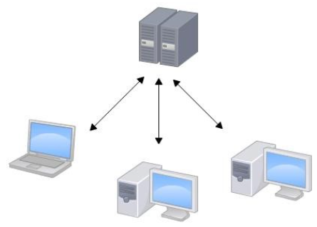
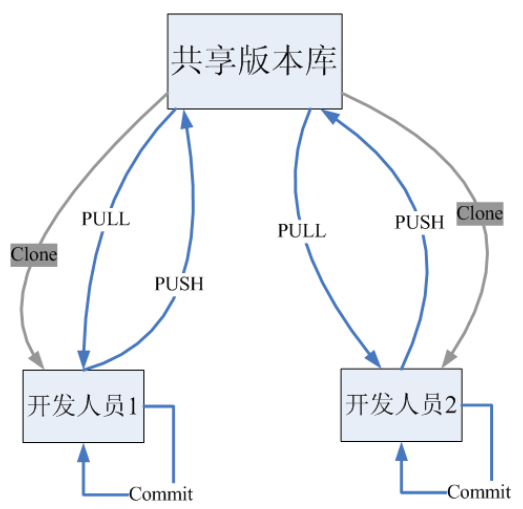
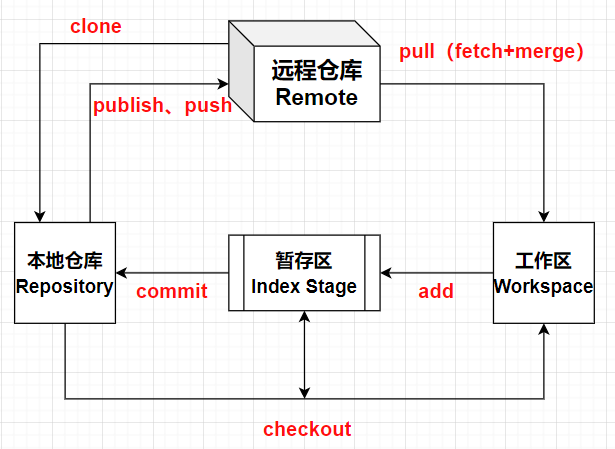

---

# 概念 | 版本控制

==【八股】为什么要进行版本控制？==

- 个人角度：代码的修改繁杂，如果一点点修改代码，不利于开发。进行版本控制，可以在特定历史状态下进行修改。即可以进行回退和撤销操作
- 团队角度：每个人负责各自的模块开发，多人的项目开发可能会操作相同文件，一般的服务器会直接覆盖文件，也不利于团队开发

---

==【八股】版本控制软件应该具备什么功能？==

**协同修改**：多人并行不悖的修改服务器端的同一个文件；

**数据备份**：不仅保存目录和文件的当前状态，还能够保存每一个提交过的历史状态；

**版本管理**：管理迭代过程中的每一个版本。在保存每一个版本的文件信息的时候要做到：不保存重复数据，以节约存储空间，提高运行效率

- SVN 采用增量式管理的方式（每次只保存有修改的那一点点，查看文件的时候把修改的和之前的文件拼起来）
- Git 采取了文件系统快照的方式（每次保存的是文件系统的快照）

**权限控制**：对团队中参与开发的人员进行权限控制；

**对团队外开发者贡献的代码进行审核**：Git 独有，SVN不能接受没有授权的人员修改代码；

**历史记录及恢复**：查看修改人、修改时间、修改内容、日志信息。将本地文件恢复到某一个历史状态；

**分支管理**：允许开发团队在工作过程中多条生产线同时推进任务，进一步提高效率（git简洁优雅）。

---

==【八股】常见的版本控制系统有哪些？有何特点==

常见的版本控制系统有：

- 集中式版本控制：例如SVN
- 分布式版本控制：例如Git

---

原理 | 集中式版本控制工具

- 每一个开发人员是一个客户端，文件和版本信息是存储在服务器的，然后客户端和服务器进行交互。

- 缺点：如果服务器一旦宕机，所有的历史数据就丢失了，那个本机（客户端）保存的只是当前的状态，这个叫单点故障。

---

原理 | 分布式版本控制工具

- 每一个开发人员在本地就可以进行完整的版本控制，本地就有完整的历史。任何一个人都可以把数据传给别人，这样就避免了单点故障。

- 优点：避免单点故障

# Git基础知识

**什么是Git**？

Git是一个免费开源的分布式版本控制工具，可以用来控制从小到大的任何项目，十分快速和高效

**Git的优势**：

- 操作便捷：大部分操作在本地完成，不需要联网，仅将本地修改推送到远程时需要联网（SVN如果断网了就不行）
- 保障完整性保证：提交每条数据进行hash运算，同一个数据不管进行hash运算多少次，得到的数据都是不变的；输入的数据一旦稍微变一点，输出的数据可能就会变很多。
- 保证可逆：Git尽可能添加数据而不是删除或修改数据，很少有不可逆的操作。Git在面对删除数据时，也仅是将指向该数据的指针取消，并非把文件删除掉；
- 分支操作流畅：Git使用快照，针对每个分支只是创建一个指针，并没有将已有数据重新创建一份，所以分支操作非常流畅；

---

**Git安装**

- 下载地址：[https://git-scm.com/](https://git-scm.com/)
- 安装步骤：傻瓜式安装，一直Next就行（建议换个安装目录）

# Git基本工作流程

**流程图示**：

**概念理解**：

| 概念         | 解释                                                                                                                                                                      |
| ------------ | ------------------------------------------------------------------------------------------------------------------------------------------------------------------------- |
| 本地仓库     | .git文件夹下的内容                                                                                                                                                        |
| 远程仓库     | 在服务器上的Git仓库：可以是github，可以是gitee，可以是公司服务器上的仓库                                                                                                  |
| 工作区       | 写代码的地方。一般就是.git文件夹同级的其他目录                                                                                                                            |
| 暂存区       | 在本地仓库中的一个文件（index），临时存储即将要提交的文件                                                                                                                 |
|              |                                                                                                                                                                           |
| `clone`    | 将远程仓库的代码复制到本地仓库                                                                                                                                            |
| `push`     | 将本地仓库的代码推送到远程仓库                                                                                                                                            |
| `pull`     | 将远程仓库下载到本地仓库，并将代码克隆到本地工作区                                                                                                                        |
| `add`      | 将工作区的代码提交到暂存区。本地仓库中已有的文件不会被提交（即本地仓库和工作区共同的文件），仅提交在工作区修改后的文件 只有提交到暂存区域的文件才能在后续中被Git追踪 |
| `commit`   | 将暂存区的文件提交到本地仓库                                                                                                                                              |
| `chenkout` | 检查本地仓库和工作区文件的不同                                                                                                                                            |

**开发常用的流程**：

1、在工作区修改文件内容；

2、将文件添加到暂存区，暂存文件；

3、提交文件到本地仓库；

4、将本次仓库的文件内容托管到远程第三方仓库。

---

==【八股】Git的三种状态？==

Git的三种状态对应三个工作区域的概念：

- 已提交：数据已保存到本地仓库。对应仓库的概念
- 已修改：数据已经被修改。对应工作区的概念
- 已暂存：数据的修改已被记录，等待后续提交。对应暂存区的概念
