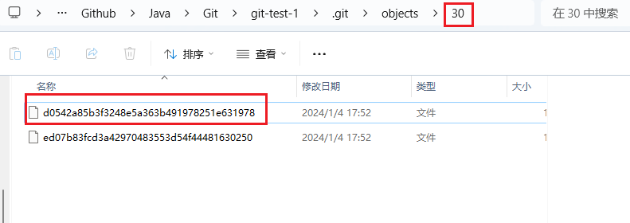

---


## 概述

本文通过一个简单的示例，来理解Git的底层原理。


## 示例

### 1、新建本地仓库

```sh
HMTeen@LAPTOP-46U4TV6K MINGW64 /d/GSF_Data/Github/Java/Git/git-test-1
$ git init  	# 初始化一个空的仓库
Initialized empty Git repository in D:/GSF_Data/Github/Java/Git/git-test-1/.git/

HMTeen@LAPTOP-46U4TV6K MINGW64 /d/GSF_Data/Github/Java/Git/git-test-1 (master)
$ git status	# 查看当前状态
On branch master

No commits yet

nothing to commit (create/copy files and use "git add" to track)
```


### 2、创建第一个文件a.txt

```sh
HMTeen@LAPTOP-46U4TV6K MINGW64 /d/GSF_Data/Github/Java/Git/git-test-1 (master)
$ touch a.txt	# 创建文件

HMTeen@LAPTOP-46U4TV6K MINGW64 /d/GSF_Data/Github/Java/Git/git-test-1 (master)
$ vi a.txt		# 编辑文件

HMTeen@LAPTOP-46U4TV6K MINGW64 /d/GSF_Data/Github/Java/Git/git-test-1 (master)
$ cat a.txt		# 查看文件内容
创建a.txt，并提交到本地仓库

HMTeen@LAPTOP-46U4TV6K MINGW64 /d/GSF_Data/Github/Java/Git/git-test-1 (master)
$ git status	# 查看当前状态，工作区有文件更改，但是没有添加到暂存区
On branch master

No commits yet

Untracked files:
  (use "git add <file>..." to include in what will be committed)
        a.txt

nothing added to commit but untracked files present (use "git add" to track)
```


### 3、上传文件到暂存区

```sh
HMTeen@LAPTOP-46U4TV6K MINGW64 /d/GSF_Data/Github/Java/Git/git-test-1 (master)
$ git add .		# 将文件添加到暂存区，警告可以不用管
warning: in the working copy of 'a.txt', LF will be replaced by CRLF the next time Git touches it

HMTeen@LAPTOP-46U4TV6K MINGW64 /d/GSF_Data/Github/Java/Git/git-test-1 (master)
$git status		# 查看当前状态，追踪到文件在暂存区，但是还没有提交到本地仓库
On branch master

No commits yet

Changes to be committed:
  (use "git rm --cached <file>..." to unstage)
        new file:   a.txt
```


### 4、提交文件到本地仓库

```sh
HMTeen@LAPTOP-46U4TV6K MINGW64 /d/GSF_Data/Github/Java/Git/git-test-1 (master)
$ git commit -m "创建a.txt文件" .		# 将所有文件提交到本地仓库，并添加注释
warning: in the working copy of 'a.txt', LF will be replaced by CRLF the next time Git touches it
[master (root-commit) 30d0542] 创建a.txt文件
 1 file changed, 1 insertion(+)
 create mode 100644 a.txt

HMTeen@LAPTOP-46U4TV6K MINGW64 /d/GSF_Data/Github/Java/Git/git-test-1 (master)
$ git status		# 查看当前状态
On branch master
nothing to commit, working tree clean
```


### 5、查看本次提交的版本号

```sh
HMTeen@LAPTOP-46U4TV6K MINGW64 /d/GSF_Data/Github/Java/Git/git-test-1 (master)
$ git log	# 查看历史记录
commit 30d0542a85b3f3248e5a363b491978251e631978 (HEAD -> master)	# 版本号（从HEAD指向主分支master）
Author: hmteen <sfguo1@126.com>
Date:   Thu Jan 4 17:52:28 2024 +0800

    创建a.txt文件
```

- 版本号是：30d0542a85b3f3248e5a363b491978251e631978


#### 概念介绍 | 版本号

**版本号组成**：

- 常规的版本号可能是：v1、v2...v10。
- Git的版本号通过SHA-1算法，生成40位的十六进制数字。40位数字中，分成2+38：前两位用来定位文件夹，后38位用来定位文件。

**Git为什么要这样选择版本号**？

- 因为Git是一个分布式的版本控制软件，通过这样算法生成的版本号，可以大概率避免文件重复。

**查看文件位置**

- 所处文件夹：`.git/objects`
- 版本号前两位是具体文件夹名称；
- 版本号后续内容是文件名字；




#### 查看版本号对应的文件内容

> 常规编辑器无法查看，需要使用Git命令查看文件内容

```sh
HMTeen@LAPTOP-46U4TV6K MINGW64 /d/GSF_Data/Github/Java/Git/git-test-1 (master)
$ git log
commit 30d0542a85b3f3248e5a363b491978251e631978 (HEAD -> master)	# 第一次提交的版本号
Author: hmteen <sfguo1@126.com>
Date:   Thu Jan 4 17:52:28 2024 +0800

    创建a.txt文件

HMTeen@LAPTOP-46U4TV6K MINGW64 /d/GSF_Data/Github/Java/Git/git-test-1 (master)
$ git cat-file -p 30d0542a85b3f3248e5a363b491978251e631978		# 查看第一次提交的版本号的内容
tree 30ed07b83fcd3a42970483553d54f44481630250			# 是一个状态信息，对应一个新的版本号
author hmteen <sfguo1@126.com> 1704361948 +0800
committer hmteen <sfguo1@126.com> 1704361948 +0800

创建a.txt文件		# commit时候的信息

HMTeen@LAPTOP-46U4TV6K MINGW64 /d/GSF_Data/Github/Java/Git/git-test-1 (master)
$ git cat-file -p 30ed07b83fcd3a42970483553d54f44481630250		# 查看状态信息
100644 blob 04b3abdeac873dcf8d7d9fafe35ecaac711abe45    a.txt	# 普通文件 blob对象 文件内容对应的版本号 文件名字

HMTeen@LAPTOP-46U4TV6K MINGW64 /d/GSF_Data/Github/Java/Git/git-test-1 (master)
$ git cat-file -p 04b3abdeac873dcf8d7d9fafe35ecaac711abe45		# 查看文件内容
创建a.txt，并提交到本地仓库

HMTeen@LAPTOP-46U4TV6K MINGW64 /d/GSF_Data/Github/Java/Git/git-test-1 (master)
$
```

**总结**：

- 可以看到Git在提交一个文件到本地仓库后，创建了三个版本号：提交信息的版本号、文件状态的版本号、文件内容的版本号；
- 三个版本号有明显的单向传递特点；


### 6、对文件b.txt，依次完成新增、修改、删除操作

**创建b.txt并上传**

```sh
HMTeen@LAPTOP-46U4TV6K MINGW64 /d/GSF_Data/Github/Java/Git/git-test-1 (master)
$ vi b.txt		# 创建并编辑b.txt文件

HMTeen@LAPTOP-46U4TV6K MINGW64 /d/GSF_Data/Github/Java/Git/git-test-1 (master)
$ cat b.txt		# 查看b.txt文件内容
新增b.txt文件

HMTeen@LAPTOP-46U4TV6K MINGW64 /d/GSF_Data/Github/Java/Git/git-test-1 (master)
$ git add .		# 文件送到暂存区
warning: in the working copy of 'b.txt', LF will be replaced by CRLF the next time Git touches it

HMTeen@LAPTOP-46U4TV6K MINGW64 /d/GSF_Data/Github/Java/Git/git-test-1 (master)
$ git commit -m "新增b.txt文件" .		# 文件送到本地仓库
warning: in the working copy of 'b.txt', LF will be replaced by CRLF the next time Git touches it
[master 7952e76] 新增b.txt文件
 1 file changed, 1 insertion(+)
 create mode 100644 b.txt

HMTeen@LAPTOP-46U4TV6K MINGW64 /d/GSF_Data/Github/Java/Git/git-test-1 (master)
$ git log		# 查询历史日志信息
commit 7952e76b009d616902d9e804d3f17c29580ed967 (HEAD -> master)
Author: hmteen <sfguo1@126.com>
Date:   Thu Jan 4 18:57:32 2024 +0800

    新增b.txt文件

commit 30d0542a85b3f3248e5a363b491978251e631978
Author: hmteen <sfguo1@126.com>
Date:   Thu Jan 4 17:52:28 2024 +0800

    创建a.txt文件

HMTeen@LAPTOP-46U4TV6K MINGW64 /d/GSF_Data/Github/Java/Git/git-test-1 (master)
$ git cat-file -p 7952e76b009d616902d9e804d3f17c29580ed967		# 查询最后一次提交的内容
tree 54996d3d5053ca3730310752ed0b7779e87df134					# 最后一次提交指向的状态信息的版本号
parent 30d0542a85b3f3248e5a363b491978251e631978					# 其父版本号，即提交a.txt对应的版本号
author hmteen <sfguo1@126.com> 1704365852 +0800
committer hmteen <sfguo1@126.com> 1704365852 +0800

新增b.txt文件

HMTeen@LAPTOP-46U4TV6K MINGW64 /d/GSF_Data/Github/Java/Git/git-test-1 (master)
$ git cat-file -p 54996d3d5053ca3730310752ed0b7779e87df134		# 最后一次提交的状态内容，包含前一次提交的文件和最新提交的文件
100644 blob 04b3abdeac873dcf8d7d9fafe35ecaac711abe45    a.txt	# 对比上一次提交，版本号不变
100644 blob 3f6facf24a61f2aeba635f4220bf5b66b6896921    b.txt	# 新建的文件，拥有一个版本号

HMTeen@LAPTOP-46U4TV6K MINGW64 /d/GSF_Data/Github/Java/Git/git-test-1 (master)
$ git cat-file -p 3f6facf24a61f2aeba635f4220bf5b66b6896921		# 查看文件内容
新增b.txt文件

HMTeen@LAPTOP-46U4TV6K MINGW64 /d/GSF_Data/Github/Java/Git/git-test-1 (master)
$ git cat-file -p 04b3abdeac873dcf8d7d9fafe35ecaac711abe45		# 查看文件内容
创建a.txt，并提交到本地仓库

```


**修改b.txt并上传**

```sh
HMTeen@LAPTOP-46U4TV6K MINGW64 /d/GSF_Data/Github/Java/Git/git-test-1 (master)
$ vi b.txt		# 编辑修改文件

HMTeen@LAPTOP-46U4TV6K MINGW64 /d/GSF_Data/Github/Java/Git/git-test-1 (master)
$ git add .
warning: in the working copy of 'b.txt', LF will be replaced by CRLF the next time Git touches it

HMTeen@LAPTOP-46U4TV6K MINGW64 /d/GSF_Data/Github/Java/Git/git-test-1 (master)
$ git commit -m "修改b.txt文件" .
warning: in the working copy of 'b.txt', LF will be replaced by CRLF the next time Git touches it
[master 0fb383a] 修改b.txt文件
 1 file changed, 1 insertion(+)

HMTeen@LAPTOP-46U4TV6K MINGW64 /d/GSF_Data/Github/Java/Git/git-test-1 (master)
$ git log
commit 0fb383ae5f814aa3d8a5af44f7371a048a96b6a6 (HEAD -> master)
Author: hmteen <sfguo1@126.com>
Date:   Thu Jan 4 19:01:09 2024 +0800

    修改b.txt文件

commit 7952e76b009d616902d9e804d3f17c29580ed967
Author: hmteen <sfguo1@126.com>
Date:   Thu Jan 4 18:57:32 2024 +0800

    新增b.txt文件

commit 30d0542a85b3f3248e5a363b491978251e631978
Author: hmteen <sfguo1@126.com>
Date:   Thu Jan 4 17:52:28 2024 +0800

    创建a.txt文件

HMTeen@LAPTOP-46U4TV6K MINGW64 /d/GSF_Data/Github/Java/Git/git-test-1 (master)
$ git cat-file -p 0fb383ae5f814aa3d8a5af44f7371a048a96b6a6		# 查看最新一次提交
tree ad1dc728a75b0b9cd6f4113e0dc0d9b0a2125c1f					# 最新一次提交对应的文件状态信息
parent 7952e76b009d616902d9e804d3f17c29580ed967					# 父版本，倒数第二次提交的版本号
author hmteen <sfguo1@126.com> 1704366069 +0800
committer hmteen <sfguo1@126.com> 1704366069 +0800

修改b.txt文件

HMTeen@LAPTOP-46U4TV6K MINGW64 /d/GSF_Data/Github/Java/Git/git-test-1 (master)
$ git cat-file -p ad1dc728a75b0b9cd6f4113e0dc0d9b0a2125c1f
100644 blob 04b3abdeac873dcf8d7d9fafe35ecaac711abe45    a.txt	# 未作修改，版本号不变
100644 blob 647f137f6e509673f5681ed2f6a4cfda7cb075c5    b.txt	# 对比新建该文件时候的版本号，版本号已经改变了，说明是一个新的文件

HMTeen@LAPTOP-46U4TV6K MINGW64 /d/GSF_Data/Github/Java/Git/git-test-1 (master)
$ git cat-file -p 647f137f6e509673f5681ed2f6a4cfda7cb075c5
新增b.txt文件
修改b.txt问价

HMTeen@LAPTOP-46U4TV6K MINGW64 /d/GSF_Data/Github/Java/Git/git-test-1 (master)
$ git cat-file -p 04b3abdeac873dcf8d7d9fafe35ecaac711abe45
创建a.txt，并提交到本地仓库
```


**删除b.txt并上传**

```sh
HMTeen@LAPTOP-46U4TV6K MINGW64 /d/GSF_Data/Github/Java/Git/git-test-1 (master)
$ rm b.txt		# 删除文件内容

HMTeen@LAPTOP-46U4TV6K MINGW64 /d/GSF_Data/Github/Java/Git/git-test-1 (master)
$ git add .

HMTeen@LAPTOP-46U4TV6K MINGW64 /d/GSF_Data/Github/Java/Git/git-test-1 (master)
$ git commit -m "删除b.txt文件" .
[master d512d7f] 删除b.txt文件
 1 file changed, 2 deletions(-)
 delete mode 100644 b.txt

HMTeen@LAPTOP-46U4TV6K MINGW64 /d/GSF_Data/Github/Java/Git/git-test-1 (master)
$ git log
commit d512d7f86477af65af85710770ee252b713f04cc (HEAD -> master)
Author: hmteen <sfguo1@126.com>
Date:   Thu Jan 4 19:04:47 2024 +0800

    删除b.txt文件

commit 0fb383ae5f814aa3d8a5af44f7371a048a96b6a6
Author: hmteen <sfguo1@126.com>
Date:   Thu Jan 4 19:01:09 2024 +0800

    修改b.txt文件

commit 7952e76b009d616902d9e804d3f17c29580ed967
Author: hmteen <sfguo1@126.com>
Date:   Thu Jan 4 18:57:32 2024 +0800

    新增b.txt文件

commit 30d0542a85b3f3248e5a363b491978251e631978
Author: hmteen <sfguo1@126.com>
Date:   Thu Jan 4 17:52:28 2024 +0800

    创建a.txt文件

HMTeen@LAPTOP-46U4TV6K MINGW64 /d/GSF_Data/Github/Java/Git/git-test-1 (master)
$ git cat-file -p d512d7f86477af65af85710770ee252b713f04cc
tree 30ed07b83fcd3a42970483553d54f44481630250
parent 0fb383ae5f814aa3d8a5af44f7371a048a96b6a6
author hmteen <sfguo1@126.com> 1704366287 +0800
committer hmteen <sfguo1@126.com> 1704366287 +0800

删除b.txt文件

HMTeen@LAPTOP-46U4TV6K MINGW64 /d/GSF_Data/Github/Java/Git/git-test-1 (master)
$ git cat-file -p 30ed07b83fcd3a42970483553d54f44481630250		# b.txt文件已删除，只剩下a.txt文件
100644 blob 04b3abdeac873dcf8d7d9fafe35ecaac711abe45    a.txt

HMTeen@LAPTOP-46U4TV6K MINGW64 /d/GSF_Data/Github/Java/Git/git-test-1 (master)
$ git cat-file -p 04b3abdeac873dcf8d7d9fafe35ecaac711abe45
创建a.txt，并提交到本地仓库

HMTeen@LAPTOP-46U4TV6K MINGW64 /d/GSF_Data/Github/Java/Git/git-test-1 (master)
$ git cat-file -p 647f137f6e509673f5681ed2f6a4cfda7cb075c5		# 查询修改b.txt文件时的版本号，依旧可以看到文件内容，证明只是删除了引用，文件的内容并没有被删除
新增b.txt文件
修改b.txt问价
```


#### Git底层原理图示


第一次：创建a.txt

- 仅有1个log信息，一个提交版本号，一个状态版本号，一个文件版本号

第二次：创建b.txt

- 有2个log信息，新增一个提交版本号，新增一个状态版本号（指向上一个父版本），新增一个文件版本号

第三次：修改b.txt

- 有3个log信息，新增一个提交版本号，新增一个状态版本号（指向上一个父版本），新增一个文件版本号

第四次：删除b.txt

- 有4个log信息，新增一个提交版本号，新增一个状态版本号（指向上一个父版本），没有新增文件版本号
- 可以得知，在删除b.txt文件并提交后，文件b.txt本身并没有被删除，依然可以通过版本号访问，只是在最新的文件版本号当中，去掉对该文件的引用。


### 7、新建一个user分支

```sh
HMTeen@LAPTOP-46U4TV6K MINGW64 /d/GSF_Data/Github/Java/Git/git-test-1 (master)
$ git branch user		# 新建user分支
```


#### 怎么查看数据最新版本？

**疑问**：如果创建了多个不同的分支，每个分支下又有不同的提交版本，该怎么确定使用的是哪个分支？怎么确定使用的是哪个版本？

**答案**：查看.git目录下的HEAD文件


```sh
HMTeen@LAPTOP-46U4TV6K MINGW64 /d/GSF_Data/Github/Java/Git/git-test-1 (master)
$ cat .git/HEAD		# HEAD内容：给出了当前使用的是哪个版本
ref: refs/heads/master

HMTeen@LAPTOP-46U4TV6K MINGW64 /d/GSF_Data/Github/Java/Git/git-test-1 (user)
$ cat .git/refs/heads/master	# master内容：记录了最新的版本号信息
d512d7f86477af65af85710770ee252b713f04cc
```


#### 不同分支下查看数据的最新版本

```sh
HMTeen@LAPTOP-46U4TV6K MINGW64 /d/GSF_Data/Github/Java/Git/git-test-1 (master)
$ cat .git/HEAD
ref: refs/heads/master

HMTeen@LAPTOP-46U4TV6K MINGW64 /d/GSF_Data/Github/Java/Git/git-test-1 (user)
$ cat .git/refs/heads/master
d512d7f86477af65af85710770ee252b713f04cc

HMTeen@LAPTOP-46U4TV6K MINGW64 /d/GSF_Data/Github/Java/Git/git-test-1 (master)
$ git checkout user
Switched to branch 'user'

HMTeen@LAPTOP-46U4TV6K MINGW64 /d/GSF_Data/Github/Java/Git/git-test-1 (user)
$ cat .git/HEAD
ref: refs/heads/user

HMTeen@LAPTOP-46U4TV6K MINGW64 /d/GSF_Data/Github/Java/Git/git-test-1 (user)
$ cat .git/refs/heads/user
d512d7f86477af65af85710770ee252b713f04cc
```

可以看到：新增分支后，仅HEAD文件指向的路径发生了变化，指向了一个新增的文件（以新增的分支名字命名的文件），文件内容是最新一次修改的版本号

- 说明1：新增分支并没有复制已有文件内容，而仅仅是新增了一个地址指向
- 说明2：新增的分支user，是以master主分支为基础的，指向了master分支最新更改的内容


## 总结

- .git文件夹里面的内容就是本地仓库；其同目录下的其他文件及文件夹是工作区；远程仓库是第三方代码托管平台，比如：GitHub、Gitee
- 文件的新增、修改都会创建一个新的文件；文件的删除不会创建新的文件
- .git文件夹下的内容总空间 > 工作区文件、文件夹占用空间
