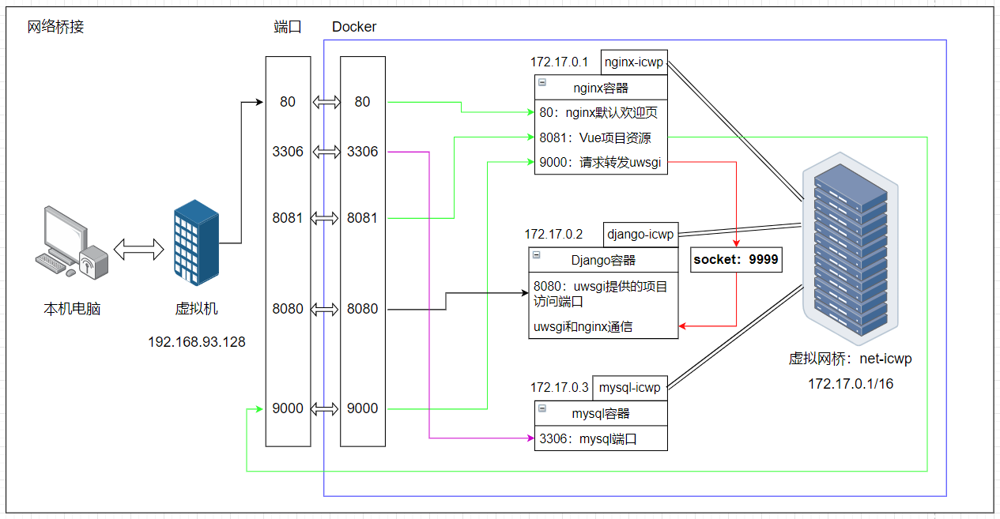
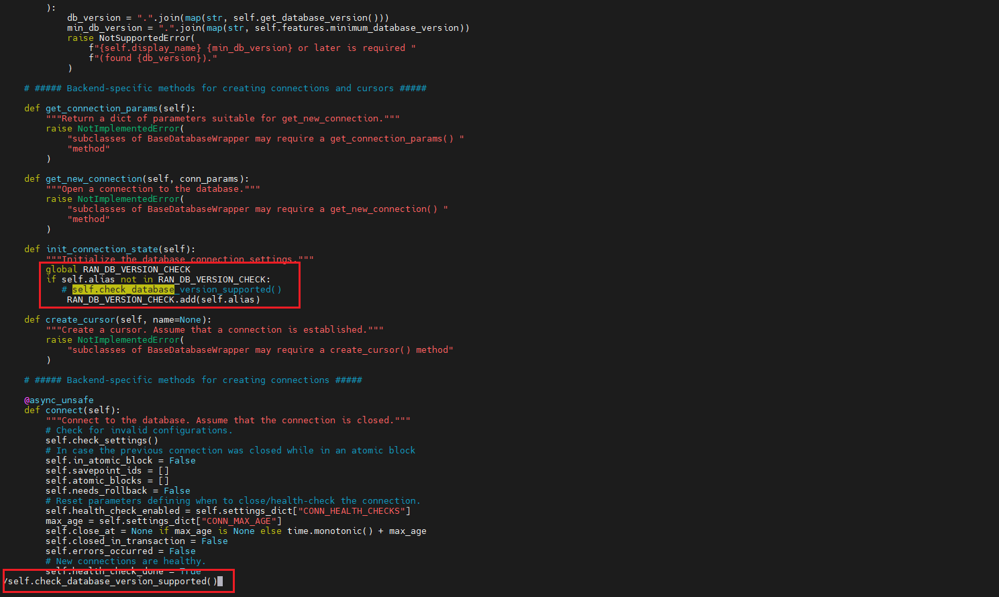
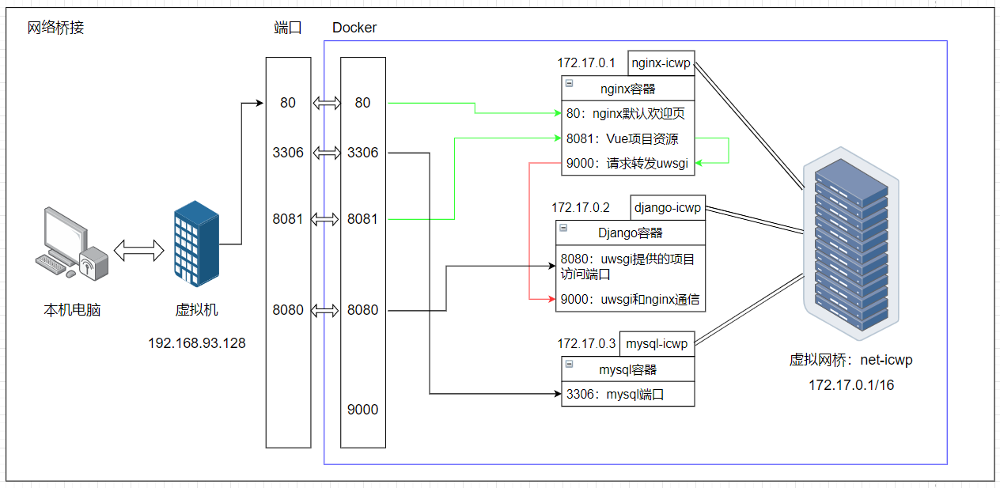

---


# 本文概述

- 基于Linux CentOS 7系统（虚拟机），使用Docker，多容器部署Django+Vue项目
- 整体部署用到了：Django+Vue+nginx+mysql+uwsgi
- 先每一个容器单独部署，最后用Docker compose 语法整合，统一部署

# Docker安装

参考文章：[https://blog.csdn.net/qq_45445505/article/details/135563784](https://blog.csdn.net/qq_45445505/article/details/135563784)

- 章标题：Docker介绍
- 节标题：Docker安装

# 总结梳理【写在开头】

> 总结梳理放在前边，方便整体理解

## 各容器间通信情况



**【镜像数量】**：最终项目部署，用到了3个镜像，部署运行了3个容器

|      容器      | 用途                                                        |
| :-------------: | ----------------------------------------------------------- |
| nginx-icwp容器 | 运行nginx程序，负责部署前端Vue资源、跟uwsgi联动完成请求转发 |
| django-icwp容器 | 负责部署后端Django项目、配置uwsgi来和nginx呼应              |
| mysql-icwp容器 | 运行mysql数据库，负责项目数据存储                           |

---

**【端口绑定】**

| 端口 |  容器归属  | 用途                                                                                  |
| :--: | :---------: | ------------------------------------------------------------------------------------- |
|  80  | nginx-icwp | 访问nginx默认页【演示用，与整体部署无关】                                             |
| 8081 | nginx-icwp | 访问前端Vue工程资源                                                                   |
| 9000 | nginx-icwp | 监听Vue工程发来的ajax请求（动态请求），并将请求转发给uwsgi，由uwsgi移交后端django处理 |
| 8080 | django-icwp | uwsgi方式启动django项目时开放的端口，可以直接用于访问后端【演示用，与整体部署无关】   |
| 3306 | mysql-icwp | 存储项目数据                                                                          |

**【docker网络】**：网络名：net-icwp

- 将3个容器实例都加入到同一个网络下，这样就可以增加通过容器别名+端口的形式，来访问不同的容器实例
- **这样做的用意是**：

  - 不使用网络的话，只能用容器实例的ip+端口来访问
  - 但是容器的ip地址容易变化，随着容器的部署、销毁、再部署，ip就会变化，想要django项目再能访问mysql数据库，就需要更改settings.py配置
  - 但是用网络的话，ip地址无论如何变化，都与容器名绑定，不需要反复修改配置

---

**【项目运行流程】**

- 本机电脑浏览器输入：`http://192.168.93.128:8081`，进入Vue项目的默认页（等同于：`http://192.168.93.128:8081/index.html`）
- 默认页面需要登录，假如已经输入了账号密码，点击登录发送ajax请求：`http://192.168.93.128:9000/user_login_icwp/`
- （动态）请求通过9000端口，被nginx监听，由于配置了uwsgi，将请求转发给uwsgi：通过9999端口，用socket通信的方式完成请求转发
- uwsgi将请求转发给django处理，django响应后将结果再返回给本机电脑浏览器

**【容器部署测试】**

- 本机电脑浏览器访问：`http://192.168.93.128:8081`，来判断前端Vue项目是否部署成功
- postman访问请求：`http://192.168.93.128:8080`，来判断后端是否已经部署并启动
- postman访问请求：`http://192.168.93.128:9000`，来判断nginx与uwsgi的通信是否配置成功
  - 效果等价于：浏览器访问Vue默认页面，输入账号密码，点击登录，完成响应并实现页面跳转
- navicat连接：`192.168.93.128:3306 -- root -- 密码`，来判断MySQL数据库是否已经部署并启动

---

**【容器间依赖】**：mysql-icwp -> django-icwp -> nginx-icwp

- mysql-icwp容器仅存储项目数据，无依赖，第1个部署
- django-icwp容器部署django项目，依赖mysql数据库存储数据，第2个部署
- nginx-icwp容器部署Vue项目，逻辑交互依赖后端django接口，第3个部署

## 总结

写项目部署步骤的时候，总有步骤”想当然“而没有展示出来。本文已尽可能展示所有的修改动作，希望文章对你有所帮助。

# Docker项目部署：一个一个构建、运行

## 部署mysql-icwp容器

### 目录结构【内容解释】

```sh
[root@localhost mysql_env]# tree -L 2
./
├── conf
│   └── my.conf					# mysql的配置文件
├── data						# 挂载mysql容器内的数据
│   └── xxxxxxx
├── init						# 放置初始化脚本，在创建容器后，会执行文件夹里面的脚本，完成数据初始化
								# 若是项目没有需要初始化的数据，该文件夹下不用放置任何内容
│   └── icwp_full_data.sql
├── log							# 挂载mysql容器内的日志
```

### 各文件内容【内容解释】

**my.conf**

网上随便复制的

```
###### [client]配置模块 ######
[client]
default-character-set=utf8mb4
socket=/var/lib/mysql/mysql.sock

###### [mysql]配置模块 ######
[mysql]
# 设置MySQL客户端默认字符集
default-character-set=utf8mb4
socket=/var/lib/mysql/mysql.sock

###### [mysqld]配置模块 ######
[mysqld]
port=3306
user=mysql
# 设置sql模式 sql_mode模式引起的分组查询出现*this is incompatible with sql_mode=only_full_group_by，这里最好剔除ONLY_FULL_GROUP_BY
sql_mode=STRICT_TRANS_TABLES,NO_ZERO_IN_DATE,NO_ZERO_DATE,ERROR_FOR_DIVISION_BY_ZERO,NO_ENGINE_SUBSTITUTION
datadir=/var/lib/mysql
socket=/var/lib/mysql/mysql.sock
server-id = 1

# MySQL8 的密码认证插件 如果不设置低版本navicat无法连接
default_authentication_plugin=mysql_native_password

# 禁用符号链接以防止各种安全风险
symbolic-links=0

# 允许最大连接数
max_connections=1000

# 服务端使用的字符集默认为8比特编码的latin1字符集
character-set-server=utf8mb4

# 创建新表时将使用的默认存储引擎
default-storage-engine=INNODB

# 表名存储在磁盘是小写的，但是比较的时候是不区分大小写
lower_case_table_names=0
max_allowed_packet=16M 

# 设置时区
default-time_zone='+8:00'
```

**icwp_full_data.sql：通过mysqldump工具，导出的windows平台上的项目数据，包含：建库命令-建表命令-数据插入命令**

若是你的项目有数据需要初始化，获取该sql文件的方法如下：

- 在存有数据的平台上以管理员身份打开cmd命令（我的是win平台）：


- 导出数据：

```
C:\Users\HMTeen>mysqldump -u root -p --host=127.0.0.1 --port=3306 --databases django_icwp_v3 > C:\Users\HMTeen\Desktop\icwp-mysql-data\mysqldump\icwp_full_data-1.sql
Enter password: ******
```

该操作将django_icwp_v3数据库的所有数据导出到sql文件中：包含建库命令-建表命令-数据插入命令......

- 将保存的数据，放到上述init文件夹下面，名字不重要，后缀是sql就行

### 容器运行命令【执行】

**确保上述提到的目录、文件都创建了，假设你将这些内容放到了：/xxx/www/mysql_env/路径下**

- 路径切换

```sh
cd /xxx/www/mysql_env/
```

- 启动容器

```sh
docker run \
  -d \		
  --name mysql-icwp-alone \
  -p 3306:3306 \
  -e TZ=Asia/Shanghai \
  -e MYSQL_ROOT_PASSWORD=123456 \
  -v ./data:/var/lib/mysql \
  -v ./conf:/etc/mysql/conf.d \
  -v ./init:/docker-entrypoint-initdb.d \
  -v ./log:/var/log/mysql \
  --network icwp-alone \
  mysql:5.7
```

| 参数                                      | 解释                                                  |
| ----------------------------------------- | ----------------------------------------------------- |
| `-d`                                    | 后台运行                                              |
| `--name mysql-icwp-alone`               | 设置容器名字                                          |
| `-p 3306:3306`                          | 端口映射                                              |
| `-e TZ=Asia/Shanghai`                   | 设置mysql时区                                         |
| `-e MYSQL_ROOT_PASSWORD=123456`         | 设置mysql密码                                         |
| `-v ./data:/var/lib/mysql`              | 挂载mysql数据                                         |
| `-v ./conf:/etc/mysql/conf.d`           | 挂载配置文件                                          |
| `-v ./init:/docker-entrypoint-initdb.d` | 挂载初始化.sql文件                                    |
| `-v ./log:/var/log/mysql`               | 挂载log文件                                           |
| `--network icwp-alone`                  | 将容器加入网络（方便后续用容器名字代替ip来访问mysql） |
| mysql:5.7                                 | 容器所基于的镜像名字                                  |

启动命令里面涉及的目录都是相对路径写法，只要执行命令前路径cd过来，该有的文件夹都有，不会执行错误

### 测试是否部署成功

**navicat工具测试连接mysql：成功！**

直接访问成功了，mysql镜像应该是默认给了root远程连接的权限

若无法成功访问，原因无外乎：

- 防火墙没有开放3306端口
- mysql没有赋予root用户远程连接的权限
- my.conf配置文件要这样设置：`bind-address=0.0.0.0`

## 部署django-icwp容器

### 目录结构

```sh
[root@localhost python_env]# tree -L 3
.
├── 1_ssh_centos						# 创建sshd镜像
│   ├── dockerfile
│   └── run.sh
├── 2_python3_centos					# 创建python3镜像
│   └── dockerfile
├── 3_django-fixed_centos				# 创建django-fixed镜像
│   ├── django-fixed_centos.tar.gz		# django-fixed镜像的压缩包，创建后打包出来的
└── 4_icwp_centos						# 创建django-icwp镜像
    ├── data_mount						# 挂载项目产生的日志
    ├── Django_ICWP_v3					# 项目
    │   ├── Django_ICWP_v3
    │   ├── icwp_basic_data
    │   ├── icwp_process_data
    │   ├── manage.py
    │   ├── requirements.txt			# 项目依赖
    │   ├── start.sh					# 项目启动脚本
    │   ├── templates
    │   └── uwsgi.ini					# uwsgi的配置文件
    ├── dockerfile
    ├── mysqlclient-2.2.1-cp38-cp38-linux_x86_64.whl	# mysqlclient安装包
```

关于django-icwp容器的镜像获取，创建了3个前置镜像：

```
[root@localhost python_env]# docker images
REPOSITORY     TAG       IMAGE ID       CREATED        SIZE
django-icwp    alone     cb12104296c8   25 hours ago   2.75GB
django-fixed   centos    d001e67470d8   27 hours ago   2.49GB
python3        centos    468cfd407ce1   27 hours ago   1.9GB
sshd           centos    3e420fd22699   27 hours ago   644MB
```

其中各个镜像的作用：

|     镜像     | 作用                                                                                |
| :----------: | ----------------------------------------------------------------------------------- |
|     sshd     | 提供具有ssh远程连接功能的centos镜像（因为官方提供的centos 7镜像不具备远程连接功能） |
|   python3   | 在sshd镜像的基础上，提供python3.8环境                                               |
| django-fixed | 在python3镜像的基础上，提供django4.1环境，并修复无法连接mysql 8以下版本的问题       |

主要是体验以下从0创建的过程，也有一些特殊原因，文中会讲。

### 1_ssh_centos

#### 检查默认centos镜像是否具备远程连接功能【内容解释】

1、下载centos 7镜像

```sh
[root@localhost ssh_centos]# docker pull centos:7
7: Pulling from library/centos
2d473b07cdd5: Pull complete
Digest: sha256:9d4bcbbb213dfd745b58be38b13b996ebb5ac315fe75711bd618426a630e0987
Status: Downloaded newer image for centos:7
docker.io/library/centos:7
```

2、以交互方式创建centos 7镜像的容器实例

```sh
[root@localhost ssh_centos]# docker run -it -d centos:7 /bin/bash
a11d32ed7075756449e27c5b9bf3b064ce2347c7a97a9ec5291d11e9d00ca137
```

3、进入容器里面，并查看是否有sshd服务

```sh
[root@localhost ssh_centos]# docker ps
CONTAINER ID   IMAGE      COMMAND       CREATED         STATUS         PORTS     NAMES
a11d32ed7075   centos:7   "/bin/bash"   6 seconds ago   Up 6 seconds             vibrant_ritchie
[root@localhost ssh_centos]# docker exec -it a11d32ed7075 /bin/bash
[root@a11d32ed7075 /]# sshd
bash: sshd: command not found
```

- 发现没有，那就后续创建一个带有ssh的centos容器

4、删除上述启动的实例

```sh
[root@a11d32ed7075 /]# exit
exit
[root@localhost ssh_centos]# docker rm -f a11d32ed7075
a11d32ed7075
[root@localhost ssh_centos]# docker ps -a
CONTAINER ID   IMAGE     COMMAND   CREATED   STATUS    PORTS     NAMES
[root@localhost ssh_centos]#
```

#### 各文件内容【内容解释】

**dockerfile**

```dockerfile
# 设置继承镜像
FROM centos:7

# 开始运行命令
RUN yum install -y openssh-server
RUN yum install -y passwd
RUN ssh-keygen -t rsa -f /etc/ssh/ssh_host_rsa_key
RUN ssh-keygen -t rsa -f /etc/ssh/ssh_host_ecdsa_key
RUN ssh-keygen -t rsa -f /etc/ssh/ssh_host_ed25519_key
RUN echo "123456" | passwd --stdin root  # 系统密码，可自行更改
ADD run.sh /run.sh

EXPOSE 22

CMD ["/run.sh"]
```

**run.sh**

```sh
#! /bin/bash
# 以非后台守护的方式运行sshd
/usr/sbin/sshd -D
```

#### 构建sshd镜像【执行】

**确保上述提到的目录、文件都创建了，假设你将这些内容放到了：/xxx/www/python_env/1_ssh_centos/路径下**

- 路径切换

```
cd /xxx/www/python_env/1_ssh_centos/
```

- 执行容器构建命令

```sh
docker build -t sshd:centos .
```

### 2_python3_centos

#### 各文件内容【内容解释】

**dockerfile**

```dockerfile
# 指定操作的镜像
FROM sshd:centos

# 创建文件夹
RUN mkdir -p /opt/install

# 安装软件
# 安装centos的yum源
RUN yum install epel-release -y
RUN yum -y install wget
# 安装python 3.6
RUN yum install -y libffi-devel zlib-devel bzip2-devel openssl-devel ncurses-devel sqlite-devel readline-devel tk-devel gcc make
# 存放安装包的路径
WORKDIR /opt/install
RUN wget https://registry.npmmirror.com/-/binary/python/3.8.6/Python-3.8.6.tgz
# 解压
RUN tar -zxvf Python-3.8.6.tgz
WORKDIR Python-3.8.6
RUN ./configure --prefix=/usr/local/python38
RUN make&&make install
# 配置环境变量
RUN ln -s /usr/local/python38/bin/python3 /usr/bin/python3.8
RUN ln -s /usr/local/python38/bin/pip3 /usr/bin/pip3.8
```

注意：通过配置环境变量，该镜像里面访问python的命令变成了 `python3.8`，访问pip的命令变成了 `pip3.8`

#### 构建python3镜像【执行】

**确保上述提到的目录、文件都创建了，假设你将这些内容放到了：/xxx/www/python_env/2_python3_centos/路径下**

- 路径切换

```
cd /xxx/www/python_env/2_python3_centos/
```

- 执行容器构建命令

```
docker build -t python3:centos .
```

### 3_django-fixed_centos

#### 解释为啥要有该镜像【内容解释】

我之前在python3环境下，下载所有我项目需要的依赖包（其中django版本为4.1），运行我的Django项目，出现了如下错误：

```sh
[root@272957a62a37 Django_ICWP_v3]# python3.8 manage.py runserver 0.0.0.0:8000
Performing system checks...

System check identified no issues (0 silenced).
Exception in thread django-main-thread:
Traceback (most recent call last):
  File "/usr/local/python38/lib/python3.8/threading.py", line 932, in _bootstrap_inner
    self.run()
  File "/usr/local/python38/lib/python3.8/threading.py", line 870, in run
    self._target(*self._args, **self._kwargs)
  File "/usr/local/python38/lib/python3.8/site-packages/django/utils/autoreload.py", line 64, in wrapper
    fn(*args, **kwargs)
  File "/usr/local/python38/lib/python3.8/site-packages/django/core/management/commands/runserver.py", line 136, in inner_run
    self.check_migrations()
  File "/usr/local/python38/lib/python3.8/site-packages/django/core/management/base.py", line 574, in check_migrations
    executor = MigrationExecutor(connections[DEFAULT_DB_ALIAS])
  File "/usr/local/python38/lib/python3.8/site-packages/django/db/migrations/executor.py", line 18, in __init__
    self.loader = MigrationLoader(self.connection)
  File "/usr/local/python38/lib/python3.8/site-packages/django/db/migrations/loader.py", line 58, in __init__
    self.build_graph()
  File "/usr/local/python38/lib/python3.8/site-packages/django/db/migrations/loader.py", line 235, in build_graph
    self.applied_migrations = recorder.applied_migrations()
  File "/usr/local/python38/lib/python3.8/site-packages/django/db/migrations/recorder.py", line 81, in applied_migrations
    if self.has_table():
  File "/usr/local/python38/lib/python3.8/site-packages/django/db/migrations/recorder.py", line 57, in has_table
    with self.connection.cursor() as cursor:
  File "/usr/local/python38/lib/python3.8/site-packages/django/utils/asyncio.py", line 26, in inner
    return func(*args, **kwargs)
  File "/usr/local/python38/lib/python3.8/site-packages/django/db/backends/base/base.py", line 330, in cursor
    return self._cursor()
  File "/usr/local/python38/lib/python3.8/site-packages/django/db/backends/base/base.py", line 306, in _cursor
    self.ensure_connection()
  File "/usr/local/python38/lib/python3.8/site-packages/django/utils/asyncio.py", line 26, in inner
    return func(*args, **kwargs)
  File "/usr/local/python38/lib/python3.8/site-packages/django/db/backends/base/base.py", line 289, in ensure_connection
    self.connect()
  File "/usr/local/python38/lib/python3.8/site-packages/django/utils/asyncio.py", line 26, in inner
    return func(*args, **kwargs)
  File "/usr/local/python38/lib/python3.8/site-packages/django/db/backends/base/base.py", line 272, in connect
    self.init_connection_state()
  File "/usr/local/python38/lib/python3.8/site-packages/django/db/backends/mysql/base.py", line 257, in init_connection_state
    super().init_connection_state()
  File "/usr/local/python38/lib/python3.8/site-packages/django/db/backends/base/base.py", line 239, in init_connection_state
    self.check_database_version_supported()
  File "/usr/local/python38/lib/python3.8/site-packages/django/db/backends/base/base.py", line 214, in check_database_version_supported
    raise NotSupportedError(
django.db.utils.NotSupportedError: MySQL 8 or later is required (found 5.7.44).
```

这个错误意思是说django4以上的web项目需要8及以上的mysql版本，但我的是5.7.44。

这个错误有两个解决方法：

- 方法1：mysql版本换成8或者最新的，但是8及以上要收费【不推荐】
- 方法2：这个错误就是Django的版本提示，可以通过注释掉django库中的源码来解决该问题【推荐】

**网上查阅有关资料，说这个错误，不一定有，win平台下，用pycharm运行项目，有时候没有这个问题**

**因此，这个镜像制作的目的就是单纯的提供：在Linux平台下的python3 django环境，这个环境“仅”有django包，而且解决了mysql版本提示问题**

**所以，在后续安装项目需要依赖的时候，requirements.txt文件中不要再出现django的安装，不然就替换了，等于白修改！！！**

#### 各文件内容【内容解释】

里面的压缩包，是基于python3镜像的容器，在下载django4.1版本并修改mysql版本提示问题后，导出的镜像文件

#### 构建django-fixed镜像【执行】

**创建python3:centos镜像的容器实例**

```sh
[root@localhost ~]# docker run -it python3:centos /bin/bash
```

不加 `-d`参数，不后台运行，会直接进入容器

**查看python版本**

```sh
[root@c39b55bb0c4b Python-3.8.6]# python
Python 2.7.5 (default, Oct 14 2020, 14:45:30)
[GCC 4.8.5 20150623 (Red Hat 4.8.5-44)] on linux2
Type "help", "copyright", "credits" or "license" for more information.
>>> exit()
```

可以看到Linux默认的python版本是2.7.5

```sh
[root@c39b55bb0c4b Python-3.8.6]# python3.8
Python 3.8.6 (default, Jan 13 2024, 03:43:52)
[GCC 4.8.5 20150623 (Red Hat 4.8.5-44)] on linux
Type "help", "copyright", "credits" or "license" for more information.
>>> exit()
```

由于制作python3镜像的时候，将运行命令命名为python3.8，安装库命名命名为pip3.8，所以运行python3.8可以看到正确的python版本

**安装django依赖**

```sh
[root@c39b55bb0c4b Python-3.8.6]# pip3.8 install django==4.1 -i https://mirrors.aliyun.com/pypi/simple
......安装过程......
```

**寻找Django版本检查代码所在的文件**：

- 方法1：若是一路按照本文镜像制作安装过来，直接定位：`/usr/local/python38/lib/python3.8/site-packages/django/db/backends/base/`
- 方法2：进入容器内，命令行执行python3.8，导入django，展示文件位置

  - 基础位置：`/usr/local/python38/lib/python3.8/site-packages/django/`
  - 补上后缀：`db/backends/base/`
  - 路径全称：`/usr/local/python38/lib/python3.8/site-packages/django/db/backends/base/`

```sh
[root@b11ef39bca1a Python-3.8.6]# python3.8
Python 3.8.6 (default, Jan 13 2024, 03:43:52)
[GCC 4.8.5 20150623 (Red Hat 4.8.5-44)] on linux
Type "help", "copyright", "credits" or "license" for more information.
>>> import django
>>> django
<module 'django' from '/usr/local/python38/lib/python3.8/site-packages/django/__init__.py'>
```

**安装vim编辑器**

```sh
yum -y install vim*
```

因为默认Linux镜像不带有vim编辑器，无法对容器内的文件访问。Vim编辑器安装处理后，可以卸载，可以不卸载，都行，建议留着，以免后续使用

**打开base.py**

```sh
[root@c39b55bb0c4b base]# vim base.py
```

**命令模式搜索：self.check_database_version_supported()，然后注释代码，保存退出**



**退出容器，基于该容器打包新的镜像**

```sh
[root@b11ef39bca1a Python-3.8.6]# cd /usr/local/python38/lib/python3.8/site-packages/django/db/backends/base/
[root@b11ef39bca1a base]# vim base.py
[root@b11ef39bca1a base]# exit
exit
[root@localhost ~]# docker ps -a
CONTAINER ID   IMAGE             COMMAND       CREATED         STATUS                        PORTS              NAMES
c39b55bb0c4b   python3:centos    "/bin/bash"   7 minutes ago   Exited (0) 4 seconds ago                         charming_aryabhata
[root@localhost ~]# docker commit -a HMTeen -m "修复Django提示mysql版本过低的问题" c39b55bb0c4b django-fixed:centos
sha256:c17f1aee5b5e9b996099e94810b3d3c1acb09d7ffc3a8c8015d3e3e3a703acf6
```

**检查镜像，有该镜像，说明创建成功**

```sh
[root@localhost ~]# docker images
REPOSITORY     TAG           IMAGE ID       CREATED          SIZE
django-fixed   centos        c17f1aee5b5e   22 minutes ago   2.49GB
python3        centos        87ae7d9e7f21   14 hours ago     1.9GB
sshd           centos        018a4d0b973e   14 hours ago     644MB
centos         7             eeb6ee3f44bd   2 years ago      204MB
```

可以看到，安装了vim编辑器，容器变大了0.32G

**以新的镜像：django-fixed，创建容器示例，按照上述修改base.py的步骤，查看里面的代码是否是已经注释掉的**

经检查，base.py的版本检查代码确实已经注释掉了，修改成功！！！

**将django-fixed:centos这个镜像导出，后续其他地方用，就不必要再重新创建了**

```sh
# 将镜像导出
docker save -o django-fixed_centos.tar django-fixed:centos

# 将导出的镜像压缩
tar -zcvf django-fixed_centos.tar.gz django-fixed_centos.tar
```

### 4_icwp_centos

#### 各文件内容【内容解释】

**requirements.txt**

```txt
xlwt~=1.3.0
Django~=4.1
xlrd~=2.0.1
xlutils~=2.0.0
loguru~=0.7.0
pandas~=2.0.1
pdfplumber~=0.9.0
numpy~=1.24.3
djangorestframework~=3.14.0
requests~=2.31.0
openpyxl~=3.1.2
python-dateutil~=2.8.2
# 以下是手动添加的内容
django-cors-headers~=4.3.1
djangorestframework-simplejwt~=5.3.1
pyjwt~=2.8.0
django-extensions~=3.2.3
pymysql~=1.1.0
memory_profiler~=0.61.0
psutil~=5.9.7
django_pandas~=0.6.6
urllib3~=1.26.15 # 这个版本高了还不行
mysqlclient~=2.2.1
uWSGI~=2.0.23
```

**start.sh**

```sh
python3.8 manage.py collectstatic --noinput;
python3.8 manage.py makemigrations;
python3.8 manage.py migrate;
uwsgi --http :8000 --ini uwsgi.ini;
```

**uwsgi.ini**

```ini
[uwsgi]
socket= :9999
chdir=/icwp/code/Django_ICWP_v3/
static-map=/static/=/icwp/code/Django_ICWP_v3/static
module=Django_ICWP_v3.wsgi
uid=root
gid=root
master=true
pidfile=uwsgi.pid
processes=8
threads=2
vacuum=true
daemonize=/icwp/Log/icwp-uwsgi.log
thunder-lock=true
enable-threads=true
```

**dockerfile**

```dockerfile
# 指定操作的镜像
FROM django-fixed:centos
# 指定语言，防止中文日志乱码
ENV LANG en_US.UTF-8  
ENV LANGUAGE en_US:en  
ENV LC_ALL en_US.UTF-8
# 创建文件夹
# 项目存放路径
RUN mkdir -p /icwp/code/Django_ICWP_v3

# 存放mysqlclient的安装包
RUN mkdir -p /icwp/code/mysqlclient

# 拷贝Django项目到指定地址
# 注意：只拷贝内容，不拷贝Django_ICWP_v3这个文件夹本身
COPY Django_ICWP_v3 /icwp/code/Django_ICWP_v3


# 传入mysqlclient的whl包，这玩意命令行安装简直折磨
COPY mysqlclient-2.2.1-cp38-cp38-linux_x86_64.whl /icwp/code/mysqlclient

# 更新pip：注意这里的python3.8，以及后续的pip3.8
# 这样写是因为创建这个镜像的时候python3:centos，通过软连接加入系统变量的是python3.8
# 更新pip操作视情况给出，若安装顺利，则无需更新pip
# RUN python3.8 -m pip install --upgrade pip

WORKDIR /icwp/code/mysqlclient
RUN pip3.8 install mysqlclient-2.2.1-cp38-cp38-linux_x86_64.whl


#这句指令相当与：cd django项目
WORKDIR /icwp/code/Django_ICWP_v3

# 这句话意思是排除掉requirements.txt文件中关于Django和mysqlclient的安装信息，并将剩余内容存入到requirements_new.txt
# 虽然可以在txt文件中注释掉Django和mysqlclient的，但是为了体现自动化的思想，多了这样一行命令
RUN grep -v '^ *#\|^Django\|^mysqlclient' requirements.txt | grep . > requirements_new.txt

# 安装依赖包
RUN pip3.8 --default-timeout=100 install -r requirements_new.txt -i http://pypi.douban.com/simple/ --trusted-host pypi.douban.com

# 配置uwsgi的系统变量
RUN ln -s /usr/local/python38/bin/uwsgi /usr/bin/uwsgi

EXPOSE 8000
```

##### mysqlclienta安装包的获取【执行】

这玩意的安装及其恶心，所以本文提供了这个第三方库的whl安装包

获取教程：[https://blog.csdn.net/qq_45445505/article/details/135680075](https://blog.csdn.net/qq_45445505/article/details/135680075)

##### Django项目需要进行的修改【执行】

**settings.py文件**

```py
# 设置静态文件的存放地址，一般是：/xx路径/项目根目录/static文件夹
STATIC_ROOT = '/icwp/code/Django_ICWP_v3/static'

# 数据库连接设置
DATABASES = {
    'default': {
        'ENGINE': 'django.db.backends.mysql',
        # 数据库的名字
        'NAME': 'django_icwp_v3',
        # 服务器数据库地址：用容器名字代替写入ip地址的方式
        'HOST': 'mysql-icwp-alone',
        # 端口
        'PORT': '3306',
        # 用户名
        'USER': 'root',
        # 服务器密码
        "PASSWORD": '123456',
    }
}
```

#### 构建django-icwp镜像【执行】

**确保上述提到的目录、文件都创建了，假设你将这些内容放到了：/xxx/www/python_env/4_icwp_centos/路径下**

- 路径切换

```
cd /xxx/www/python_env/4_icwp_centos/
```

- 执行容器构建命令

```
docker build -t django-icwp:alone .
```

#### 容器运行【执行】

- 在上述执行构建命令的路径下，执行容器启动命令

```sh
docker run -it -d \
  --name django-icwp-alone \
  -p 8000:8000 \
  -v ./data_mount/Log:/icwp/Log \
  --network icwp-alone \
  django-icwp:alone
```

- 进入容器，启动django项目

```sh
docker exec -it django-icwp-alone /bin/bash start.sh
```

#### 测试是否部署成功

在端口已经成功开放的基础上，本机电脑浏览器上访问：`http://192.168.93.128:8000/`，看看是否有项目给出的提示内容：

```sh
# 我的项目给出的提示内容：

{"states": 0, "message": "INFO", "warning": "", "data": "请先完成用户登录，再访问其他页面"}
```

## 部署nginx-icwp容器

### 目录结构【内容解释】

```sh
[root@localhost nginx_env]# tree -L 3 .
.
├── conf							# 存放配置文件
│   ├── conf.d				
│   │   ├── default.conf			# 定义了80端口的默认配置文件
│   │   ├── icwp-django.conf		# 自定义后端django有关的配置文件
│   │   └── icwp-vue.conf			# 自定义前端Vue有关的配置文件
│   └── nginx.conf					# 主配置文件，主要用于引用conf.d文件夹下的配置文件到主配置文件中
├── html
│   ├── 50x.html					# nginx默认50x.html页面
│   ├── index.html					# nginx默认的欢迎页面
│   ├── dist						# Vue工程构建打包后的静态资源文件
│   │   ├── favicon.ico
│   │   ├── index.html
│   │   └── static
├── log								# 用于挂载ngingx的日志
```

### 各文件内容【内容解释】

**default.conf & nginx.conf**

从运行的nginx容器中拷贝出来的，不做任何修改，按照上述目录结构放着就行

```sh
# 运行nginx容器
docker run  -it -d --name=test_nginx  -p 80:80 nginx

# 拷贝文件到当前路径下
docker cp test_nginx:/etc/nginx/nginx.conf nginx.conf
docker cp test_nginx:/etc/nginx/conf.d/default.conf default.conf
```

理解这两个配置文件及自定义配置文件的用途：[https://blog.csdn.net/qq_45445505/article/details/135733522](https://blog.csdn.net/qq_45445505/article/details/135733522)

**icwp-django.conf**

```conf
upstream django {
   ip_hash;
   server django-icwp-alone:9999;
}

server{
	listen 9000;
	access_log /var/log/nginx/icwp-django.access.log main;
    charset utf-8;

	location /{
		include /etc/nginx/uwsgi_params;
		uwsgi_connect_timeout 30;
		uwsgi_pass django;
	}
 
	location /static/{
		alias /icwp/code/Django_ICWP_v3/static;
	}
}
```

**icwp-vue.conf**

```
server {
    listen       8081;
    server_name  localhost;
    access_log  /var/log/nginx/icwp-vue.access.log  main;

    location / {
        root   /usr/share/nginx/html/dist;
        index  index.html index.htm;
        try_files $uri $uri/ /index.html;
    }

    error_page   500 502 503 504  /50x.html;
    location = /50x.html {
        root   /usr/share/nginx/html;
    }
}
```

**dist**

- 打开Vue工程
- 运行命令：`npm run build`
- 将生成的dist文件夹复制过来即可

```
Vue工程里面，所有ajax请求的基础url："http://192.168.93.128:9000/"
```

### 容器运行

**确保上述提到的目录、文件都创建了，假设你将这些内容放到了：/xxx/www/nginx_env/路径下**

- 路径切换

```sh
cd /xxx/www/nginx_env/
```

- 执行容器构建命令

```sh
docker run -d \
    -p 80:80 \
    -p 8081:8081 \
    -p 9000:9000 \
    --name nginx-icwp-alone \
    -v ./conf/nginx.conf:/etc/nginx/nginx.conf \
    -v ./conf/conf.d:/etc/nginx/conf.d \
    -v ./log:/var/log/nginx \
    -v ./html:/usr/share/nginx/html \
    --network icwp-alone \
    nginx:latest
```

## 总结

至此，三个容器都已成功启动，可以在客户端用浏览器访问项目，并进行操作，来验证是否能够成功交互

# Docker-Compose部署项目

> 通过docker compose语法，一键部署上述3个docker容器

## 项目结构

```sh
├── data								# 挂载容器数据：综合下来，只有mysql数据需要保存
│   └── mysql
├── log									# 挂载各容器产生的日志
│   ├── icwp
│   ├── mysql
│   └── nginx
└── project								# docker-compose构建的整个工程
    ├── docker-compose.yml				# 总的配置文件
    ├── mysql_env						# mysql有关的配置文件
    │   ├── conf
    │   │   └── my.conf
    │   ├── dockerfile					# mysql的dockerfile文件
    │   ├── init
    │   │   └── icwp_full_data.sql
    ├── nginx_env						# nginx的配置文件
    │   ├── conf
    │   │   ├── conf.d
    │   │   │   ├── default.conf
    │   │   │   ├── icwp-django.conf
    │   │   │   └── icwp-vue.conf
    │   │   └── nginx.conf
    │   ├── dockerfile					# nginx的dockerfile文件
    │   ├── html
    │   │   ├── 50x.html
    │   │   ├── dist
    │   │   │   ├── favicon.ico
    │   │   │   ├── index.html
    │   │   │   └── static
    │   │   ├── index.html
    │   │   └── ReadMe.txt
    └── python_env						# python的配置文件
        ├── Django_ICWP_v3				# Django项目
        │   ├── Django_ICWP_v3
        │   ├── icwp_basic_data
        │   ├── icwp_process_data
        │   ├── manage.py
        │   ├── requirements.txt
        │   ├── start.sh
        │   ├── templates
        │   └── uwsgi.ini
        ├── dockerfile
        ├── mysqlclient-2.2.1-cp38-cp38-linux_x86_64.whl
```

## 项目运行

启动docker-compose

```sh
docker compose up -d
```

关闭并删除docker-compose

```sh
docker compose down
```

## 各文件内容

### docker-compose.yml

```yml
# /icwp_docker_compose/project/

version: '1'
services:
   mysql:
      build: ./mysql_env
      image: mysql-5.7:compose
      container_name: mysql-icwp-compose
      environment:
         - MYSQL_ROOT_PASSWORD=123456
         - TZ=Asia/Shanghai
      volumes:
         - /mysql_env/conf:/etc/mysql/conf.d                   # 挂载配置文件
         - ./mysql_env/init:/docker-entrypoint-initdb.d/       # 挂载初始化文件
         - ../data/mysql:/var/lib/mysql                        # 挂载数据库数据
         - ../log/mysql:/var/log/mysql                         # 挂载日志
      ports:
         - "3306:3306"
      restart: always

      networks:
         - net-icwp

   django:
      build: ./python_env
      image: django-icwp:compose
      container_name: django-icwp-compose
      ports:
         - "8000:8000"
      volumes:
         - ../log/icwp:/icwp/Log   # 挂载项目生成的log文件
       
      stdin_open: true
      tty: true
      restart: always

      networks:
         - net-icwp

      depends_on:
         - mysql

   nginx:
      build: ./nginx_env
      image: nginx-icwp:compose
      container_name: nginx-icwp-compose
      ports:
         - "80:80"
         - "8081:8081"
         - "9000:9000"

      volumes:
         - ./nginx_env/conf/nginx.conf:/etc/nginx/nginx.conf      # 挂载默认配置文件
         - ./nginx_env/conf/conf.d:/etc/nginx/conf.d              # 挂载自定义配置文件
         - ./nginx_env/html:/usr/share/nginx/html                 # 挂载静态文件
         - ../log/nginx:/var/log/nginx                            # 挂载日志

      restart: always

      networks:
         - net-icwp

      depends_on:
         - django

networks:
   net-icwp:
      name: net-icwp-compose
```

### 其他内容

对比单独部署时候的内容，有的内容有变化，有的内容移动到了其他地方。

这里记录下有变化的部分

|    内容    | 变化内容                                                           |  所属容器  |
| :---------: | :----------------------------------------------------------------- | :---------: |
|    data    | 移动到project同级目录data/mysql下，统一管理                        | mysql-icwp |
|     log     | 移动到project同级目录下log/mysql下，统一管理                       | mysql-icwp |
| dockerfile | 新增的配置文件，主要是方便docker-compose配置的时候，自定义镜像名字 | mysql-icwp |
|            |                                                                    |            |
| data_mount | 移动到project同级目录log/icwp下，统一管理                          | django-icwp |
| settings.py | 关于数据库连接的配置有变化，mysql的容器名变了                      | django-icwp |
| dockerfile | 加入了启动脚本的命令                                               | django-icwp |
|  start.sh  | 加入了保持前端交互式操作的命令                                     | django-icwp |
|            |                                                                    |            |
|     log     | 移动到project同级目录log/nginx下，统一管理                         |    nginx    |

**【mysql-icwp】dockerfile**

```dockerfile
FROM mysql:5.7

EXPOSE 3306
```

**【django-icwp】settings.py**

```
DATABASES = {
    'default': {
        'ENGINE': 'django.db.backends.mysql',
        # 数据库的名字
        'NAME': 'django_icwp_v3',
        # 服务器数据库地址
        'HOST': 'mysql-icwp-compose',		# 这里改了，原先是：mysql-icwp-alone
        # 端口
        'PORT': '3306',
        # 用户名
        'USER': 'root',
        # 服务器密码
        "PASSWORD": '123456',
    }
}
```

**【django-icwp】dockerfile**

```dockerfile
FROM django-fixed:centos

ENV LANG en_US.UTF-8  
ENV LANGUAGE en_US:en  
ENV LC_ALL en_US.UTF-8

RUN mkdir -p /icwp/code/Django_ICWP_v3

RUN mkdir -p /icwp/code/mysqlclient

COPY Django_ICWP_v3 /icwp/code/Django_ICWP_v3


COPY mysqlclient-2.2.1-cp38-cp38-linux_x86_64.whl /icwp/code/mysqlclient

WORKDIR /icwp/code/mysqlclient
RUN pip3.8 install mysqlclient-2.2.1-cp38-cp38-linux_x86_64.whl

WORKDIR /icwp/code/Django_ICWP_v3

RUN grep -v '^ *#\|^Django\|^mysqlclient' requirements.txt | grep . > requirements_new.txt

RUN pip3.8 --default-timeout=100 install -r requirements_new.txt -i http://pypi.douban.com/simple/ --trusted-host pypi.douban.com

RUN ln -s /usr/local/python38/bin/uwsgi /usr/bin/uwsgi

# 以下是新增的内容

# 解决启动脚本的换行问题
RUN sed -i 's/\r//' start.sh

# 赋予脚本执行权限
RUN chmod +x start.sh

EXPOSE 8000

ENTRYPOINT ["/bin/bash","start.sh"]
```

**【django-icwp】start.sh**

```
python3.8 manage.py collectstatic --noinput&&
python3.8 manage.py makemigrations&&
python3.8 manage.py migrate&&
uwsgi --http :8000 --ini uwsgi.ini&&
python3.8
```

新增最后一行，是为了让容器执行完start.sh脚本之后，有个交互式的界面，阻塞进程，避免容器退出、停止

# 心得总结

## docker-compose使用心得

- 要删掉构建的镜像后再执行启动程序，不然重新执行启动命令后，用的还是已有的镜像

## nginx部署前端资源的理解

正确的通信流程图是文章开始展示的那个，这个流程图有一个错误，就是关于9000端口，uwsgi转发请求这一部分（红线部分）：



先前我在部署Vue项目的时候，项目里面所有的ajax请求，用的公共前缀是：`http://nginx-icwp:9000/`。

当时的理解是：本地浏览器通过：`http://192.168.93.128:8081/`访问到登录页面，然后点击登录按钮，发送ajax请求到9000端口，这个发送的主体是nginx-icwp这个容器，但这是错误的，所以当时无论如何都调试不通顺。

正确的理解是：本地浏览器通过：`http://192.168.93.128:8081/`访问到登录页面，获取到静态资源，展示到浏览器上，然后点击登录按钮，发送ajax请求到9000端口，这个请求发送的主体是浏览器，是本地的浏览器，所以这个请求发起的ip应该是虚拟机的地址：192.168.93.128，然后通过端口映射，发送到nginx-icwp的9000端口。

即项目里面所有的ajax请求，用的公共前缀**应该**是：`http://192.168.93.128:9000/`。
