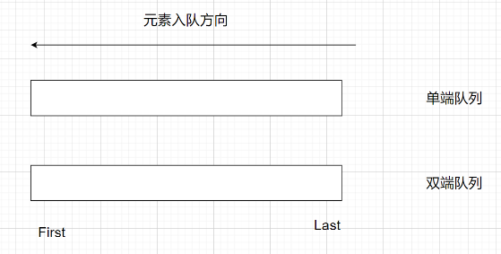
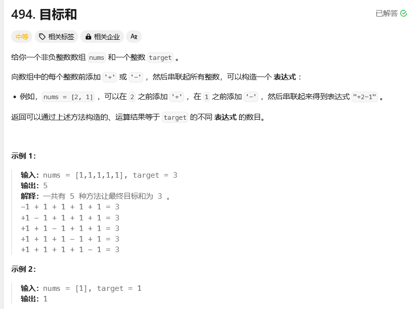
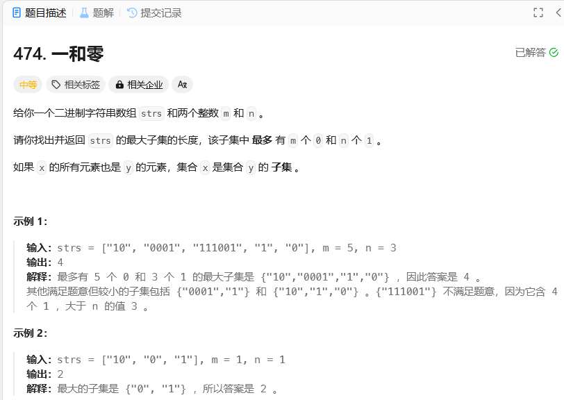

## 公共方法

> 任何题型都有可能用到的方法、函数、工具类


**获取长度**：

|                  |                  |                   |
| ---------------- | ----------------- | ----------------- |
| 数组 | `int[] arrays` | `arrays.length` |
| 字符串  | `String s`     | `s.length()`    |
| 列表  | `List<> ls`    | `ls.size()`     |
| 集合  | `Set<> set`    | `set.size()`    |
| 集合  | `Map<> map`    | `map.size()`    |


**数值计算**：

|                                    |                                          |
| :--------------------------------- | ---------------------------------------- |
| `Math.min()、Math.max()`         | 求最小值、求最大值                       |
| `Math.log10(a)`、`Math.log(a)` | 求log：以10为底、以2为底                 |
| `Math.pow(a, b)`                 | 求a^b                                    |
| `Math.sqrt(a)`                   | 开平方                                   |
| `Math.round(a)`                  | 四舍五入                                 |
| `Math.floor(a)`                  | 向下取整                                 |
| `Math.ceil(a)`                   | 向上取整                                 |
| `Integer.MAX_VALUE`              | 给出int类型的最大值                      |
| `Integer.MIN_VALUE`              | 给出int类型的最小值（这样写是不的，数据会溢出：`-Integer.MAX_VALUE`） |
| `Long.MAX_VALUE`                 | 给出long类型的最大值                     |
| `Long.MIN_VALUE`                 | 给出long类型的最小值（同理） |


**排序的工具类**：

|                        |                |
| ---------------------- | -------------- |
| `Collections.sort()` | 对集合进行排序 |
| `Arrays.sort()`      | 对数组进行排序 |


对二维数组排序：按照二维数组中每个一维数组的第一个元素，升序排序

```java
Arrays.sort(intervals, new Comparator<int[]>(){
    public int compare(int[] obj1, int[] obj2){
        return obj1[0] - obj2[0];
    }
});
```


## 前缀和

**理论**

有一个整数数组 `int[] arr`；

可以计算出前缀和数组 `sum[i]`：表示区间 `[0, i]`的元素和；

如果要计算区间 `[i, j]`的和：

- `i=0`，区间 `[i, j]`的和为：`sum[j]`；
- `i!=0`，区间 `[i, j]`的和为：`sum[j] - sum[i-1]`；


## 位运算

**基础 | 交换元素的值**

```java
int a = 5;
int b = 10;

a = a ^ b;
b = a ^ b;
a = a ^ b;
```


## 滑动窗口

### 做题模板 | 整体写法

非固定长度的滑动窗口

```java
// 外层循环扩展右边界，内层循环扩展左边界
for (int l = 0, r = 0 ; r < n ; r++) {
	// 当前考虑的元素
	
    while (l <= r && check()) {
        //扩展左边界
    }
    
    // 区间[left,right]符合题意，统计相关信息
}
```


### 做题思路 | 区间定义

滑动窗口的实现，也是用两个指针的移动来处理的；

左指针的初始值可以是0，也可以是-1；


## 拓扑排序

经典题目：[207.课程表](https://leetcode.cn/problems/course-schedule/description/?envType=study-plan-v2&envId=top-100-liked)


## 字符串

> 关于字符串的考察，也是同哈希表一样：难一点的字符串题目都是以考察其他内容为主体。总结就记录一些字符串常用函数。

### 基础方法

**构造字符串**

|                                              |  |
| -------------------------------------------- | - |
| `new String( String s )`                   |  |
| `new String( char[] arr )`                 |  |
| `new String( char[] arr ), offset, length` |  |
| `new String( byte[] arr )`                 |  |
| `new String( StringBuffer sb )`            |  |
| `String.valueOf(xxxxx)`                    |  |


**字符串本身的函数**

| 方法                                                | 功能                                                                                 |
| --------------------------------------------------- | ------------------------------------------------------------------------------------ |
| 无                                                  | 增                                                                                   |
| 无                                                  | 删                                                                                   |
| 无                                                  | 改                                                                                   |
| `char charAt(index)`                              | 查（结果是一个字符）                                                                 |
|                                                     |                                                                                      |
| `String replace(char oldChar,  char newChar)`     | 替换                                                                                 |
| `String substring(int beginIndex,  int endIndex)` | 剪切（**注意函数名字都是小写！！**），前闭后开区间：`[beginIndex, endIndex)` |
| `char[] toCharArray()`                            | 转为 `char`数组                                                                    |
| `boolean isEmpty()`                               | 是否为空                                                                             |
| `String trim()`                                   | 去除字符串前后的空白字符并返回一个新的字符串                                         |
| `int length()`                                    | 求字符串中字符的长度                                                                 |


**`StringBuilder()`类**

| 方法                                               | 功能                              |
| -------------------------------------------------- | --------------------------------- |
| `StringBuilder append(char[] str)`               | 增                                |
| `StringBuilder delete(int s_index, int e_index)` | 删 --- 区间 [s_index, e_index)    |
| `StringBuilder deleteCharAt(str.length()-1)`     | 删 --- 删除最后一个元素           |
| `StringBuilder setCharAt(int index, char ch)`    | 改                                |
| `char charAt(int index)`                         | 查（结果是一个字符）              |
| `StringBuilder reverse()`                        | 翻转                              |
| `String toString()`                              | 转字符串                          |
| `String substring(int start, int end)`           | 截取，前闭后开区间： [start, end) |


**其他工具类**

|                                                         |                                               |
| ------------------------------------------------------- | --------------------------------------------- |
| `static boolean Character.isDigit(char ch)`           | 判断指定的字符是否是数字                      |
| `static boolean Character.isDigit(int codePoint)`     | 判断指定的字符是否是数字（Unicode代码点）     |
| `static boolean Character.isLowerCase(char ch)`       | 判断指定的字符是否是小写字母                  |
| `static boolean Character.isLowerCase(int codePoint)` | 判断指定的字符是否是小写字母（Unicode代码点） |
| `int Integer.parseInt(String)`                        | 将字符串转为整型                              |
| `double Double.parseDouble(String)`                   | 将字符串转为浮点数类型                        |


### 场景 | 处理数字

- 从前往后遍历字符串类型的数字：

```java
public class Main {
    public static void main(String[] args) {
        String A = "123456";
        int k = 0;
        for(char item : A.toCharArray()){
            k = k * 10 + (item - '0');		// 神之一手
        }
        System.out.println(k);
    }
}
```

- 从后往前遍历字符串类型的数字：

```java
public class Main {
    public static void main(String[] args) {
        String A = "654321";
        int k = 0;
        int res = 0;
        for(char item : A.toCharArray()){
            res += (item - '0') * Math.pow(10, k);		// 常规操作
            k++;
        }

        System.out.println(res);
    }
}
```


### 场景 | 字母异位词

**什么是字母异位词**？

字符串中长度相同，字符组成相同，字符位置不同的字符串，互为字母异位词，比如：abc、cba、bca

---

**字母异位词的比较手段**？

方法1 | 转字符数组 -> 排序 -> 比较

```java
char[] strChar1 = str1.toCharArray();
Arrays.sort( strChar1 );
String str1New = new String( strChar1 );

char[] strChar2 = str2.toCharArray();
Arrays.sort( strChar2 );
String str2New = new String( strChar2 );

str1New.equals( str2New );
```

方法2 | 用数组统计各字符出现元素的次数 -> 比较数组是否一致

```java
// 定义数组
int[] sArr = new int[26];
int[] pArr = new int[26];

// 存储元素出现的次数
for(int i = 0; i < pLen; i++){
    ++sArr[ s.charAt(i) - 'a' ];
    ++pArr[ p.charAt(i) - 'a' ];
}

// 数组比较
Arrays.equals( sArr, pArr );
```

---

**总结**

方法1，lc49原题，适合对字母异位词进行分组统计；

方法2，lc438原题，适合统计一个字符串中，哪些字串与给定的字符串是字母异位词；


## 数组

> 数组的题目，重点的考察内容不在数组，而在思维。
>
> 数组题目常见的解决方法：二分法、双指针（前后、快慢、相向）、滑动窗口、模拟、动态规划。这些思想都可以单独拿出来讲述讲述，就不再这里总结了。

### 做题模板 | 二分法

**二分的难度就在于对区间的讨论，几个关键点：while的终止条件、left的变化条件、right的变化条件；**

```java
class Solution {
    public int search(int[] nums, int target) {
        // 剪枝：避免当target不在区间内的无效二分
        if (target < nums[0] || target > nums[nums.length - 1]) {
            return -1;
        }
        int left = 0, right = nums.length - 1;
      
        // 注意while条件：[left, left]的区间是有效的，只是区间的元素个数=1，而且这个元素也还没验证是否=target
        while (left <= right) {
            int mid = (left + right) / 2;
            if (nums[mid] == target) {
                return mid;
            }
            else if (nums[mid] < target) {
                left = mid + 1;
            }
            else {
                right = mid - 1;
            }
        }
        // 未找到目标值
        return -1;
    }
}
```


## 哈希表、集合

### 基础方法

List、Set、Map集合的常用方法：[Java集合常用的函数](/ToBeABD/Java/unfp1zj2/)

哈希表定义：

```java
// 哈希集合
Set<Character> occ = new HashSet<Character>();

// 哈希map
Map<Character, TreeNode> occ = new HashMap<Character, TreeNode>();
```

遍历方法：

```java
// 增强for：第一种
for (Integer key : testMap.keySet()) {
    key
    testMap.get(key)
}

// 增强for：第二种
for (String value : testMap.values()) {
    value
}

// 增强for：第三种
for (Map.Entry<Integer, String> entry : testMap.entrySet()) {
    entry.getKey()
    entry.getValue()
}
```


## 排序

> LeetCode中用来练习排序算法的题目：[题目链接](https://leetcode.cn/problems/sort-an-array/solutions/178305/pai-xu-shu-zu-by-leetcode-solution/)

### 做题模板 | 快速排序

```java
class Solution {
    public int[] sortArray(int[] nums) {
        int arrLen = nums.length;
        DefSort(nums, 0, arrLen-1);
        return nums;
    }

    public static void DefSort(int[] nums, int left, int right){
        // 递归终止条件：既然是递归，肯定要在逻辑处理前，写递归终止条件
        if( left >= right ){
            return;
        }

        // 递归调用逻辑
        int k = partion(nums, left, right);
        DefSort(nums, left, k-1);
        DefSort(nums, k+1, right);
    }

    public static int partion(int[] nums, int left, int right){
        int l, r, base;

        // 这一行加上，算法就是随机快速初始化
        // 思路：随机找一个元素，将其与区间最左边元素交换位置，后续选基准元素，一直选区间最左边的
        // Random方法使用心得：
        // - [左闭，右开)，需要在[left, right]中任意寻找一个元素，就是在[left, right+1)中任意寻找元素
        // - [left, right+1)  =>  [0, right-left+1) + left => new Random().nextInt(right - left + 1) + left
        swap(nums, left, new Random().nextInt(right - left + 1) + left);

        // 始终选区间的最左边为基准元素
        base = nums[left];
        l = left;
        r = right;

        // while条件：要交换元素，l和r的值就不能相等
        while(l < r){
          
            // 条件处理：可以有等号；指针移动条件要满足l < r，这样才能保证指针相遇，而不是相交之后再错过
            // 先后顺序：因为选择的基准点是区间左侧，就需要让区间右侧的指针先行移动！！！（反之，左侧指针先行移动）
            while( nums[r] >= base && l < r ){
                r--;
            }

            while( nums[l] <= base && l < r ){
                l++;
            }

            // 指针移动后，也要判断是否满足元素交换的条件：l != r && l < r
            if(l < r){
                swap(nums, l, r);
            }
        }

        // 将相交位置的元素与基准元素交换位置
        nums[left] = nums[l];
        nums[l] = base;

        return l;
    }

    public static void swap(int[] nums, int left, int right){
        int temp = nums[left];
        nums[left] = nums[right];
        nums[right] = temp;
    }
}
```


## 双指针

关于双指针的考题，也经常与其他类型的题目混合在一起考。关于双指针，主要有以下几种类型的使用：

**常规双指针**

首先定义两个指针，题目中可能操作一个数组。

这两个指针：一个指向起始位置；另一个指向终止位置；然后两个指针向中间靠拢，直到相遇

---

**逆序双指针**

首先定义两个指针，题目中可能操作两个数组。

这两个指针：各自指向对应数组的终止位置；然后两个指针均向前靠拢，直到都到达各自的左边界。

---

**快慢双指针**

首先定义两个指针，题目中可能操作链表。

这两个指针：起始均指向链表头部，然后一个一次走两步，一个一次走一步（快指针的速度是慢指针速度的两倍），直到跑的快的指针先到达链表边界。

---

**常规双指针 + for循环**

首先定义两个指针，题目中为操作数组。

这两个指针：一个指向起始位置；另一个指向终止位置；然后还有一个For循环从头到尾进行遍历，直到与终止指针相遇，停止循环。

[题目链接](https://leetcode.cn/problems/sort-colors/solutions/437968/yan-se-fen-lei-by-leetcode-solution/?envType=study-plan-v2&envId=top-100-liked)


## 链表

### 基础方法

链表类型的题目，所用到的大多数知识点不算在链表里面，而是归属于：双指针、递归、迭代这些。

自定义链表结构：

```java
public class ListNode {
    int val;
    ListNode next;
    ListNode() {}
    ListNode(int val) { this.val = val; }
    ListNode(int val, ListNode next) { this.val = val; this.next = next; }
}
```


### 场景 | 虚拟头节点

|          |                                                                      |
| -------- | -------------------------------------------------------------------- |
| 应用场景 | 在有可能对链表头节点做操作的题目中应用                               |
| 应用方法 | 在对链表进行操作时，在给定头节点的前边自定义一个节点，并指向该头节点 |
| 好处     | 这样使得原有链表上的所有节点都是子节点，角色权重一样                 |


### 做题模板 | 原地反转

```java
public ListNode reverseList(ListNode head) {
    ListNode prev = null;
    ListNode curr = head;
    while (curr != null){
        ListNode next = curr.next;
        curr.next = prev;
        prev = curr;
        curr = next;
    }
    return prev;
}
```

- 返回的是 `prev`的值，而不是 `cur`的值


### 做题模板 | 寻找链表中间点

> 快慢双指针

```java
ListNode slow=head, fast=head;

while(fast!=null && fast.next != null){
    slow = slow.next;
    fast = fast.next.next;
}
ListNode mid = slow;
```

对于奇数元素的链表：返回中间结点

对于偶数元素的链表：返回两个中间结点的后一个

```java
ListNode demmy = new ListNode(-1);
demmy.next = head;
ListNode slow=demmy, fast=demmy;

while(fast!=null && fast.next != null){
    slow = slow.next;
    fast = fast.next.next;
}
ListNode mid = slow;
```

对于奇数元素的链表：返回中间结点

对于偶数元素的链表：返回两个中间结点的前一个


### 做题模板 | 寻找链表倒数第N个结点

> 前后双指针

```java
class Solution {
    public ListNode trainingPlan(ListNode head, int cnt) {
        ListNode demmy = new ListNode(-1);
        demmy.next = head;

        ListNode slow = demmy;
        ListNode fast = demmy;
	
        // 前指针先走N步
        for(int i=0; i<cnt; i++){
            fast = fast.next;
        }

        // 两人一起走
        while(fast != null){
            slow = slow.next;
            fast = fast.next;          
        }

        return slow;
    }
}
```


## 栈和队列

### 基础方法 | 栈

```java
Deque<Integer> stack = new ArrayDeque<>();	// 双端队列的数组实现
Deque<Integer> stack = new LinkedList<>();	// 双端队列的链表实现
Stack<Integer> s = new Stack();				// 堆栈
```

|                       |                                |
| :-------------------- | :----------------------------- |
| `E push(E e)`       | 入栈，方法返回值就是元素本身   |
| `E pop()`           | 弹栈，方法返回值是被弹出的元素 |
| `E peek()`          | 查看栈顶元素，但是不弹出该元素 |
| `boolean isEmpty()` | 判断栈是否是空的               |


### 场景 | 单调栈

**用法上保证栈内元素是单调的**

- 入栈元素 < 栈顶元素，入栈；
- 入栈元素 > 栈顶元素，栈内所有比入栈元素小的数，都删除掉；

---

**例题**

- [739.每日温度](https://leetcode.cn/problems/daily-temperatures/description/?envType=study-plan-v2&envId=top-100-liked)、[84.柱状图中最大的矩形](https://leetcode.cn/problems/largest-rectangle-in-histogram/description/?envType=study-plan-v2&envId=top-100-liked)


### 基础方法 | 队列（单端 + 双端）

图示：



实现：

```java
// 单端队列
Queue<Integer> layer = new LinkedList<Integer>();

// 双端队列
Deque<Integer> layer = new LinkedList<Integer>();
```

单端队列与双端队列方法对比：

|     Queue     |             Deque             |                  |
| :-----------: | :----------------------------: | ---------------- |
| `offer(e)` |  `offerLast(e)、addLast()`  | 从队尾进         |
|              | `offerFirst(e)、addFirst()` | 从队头进         |
|  `poll()`  | `pollFirst()、removeFirst()` | 取队列头数据     |
|              |  `pollLast()、removeLast()`  | 取队列尾数据     |
|  `peek()`  |  `peekFirst()、getFirst()`  | 查看队列头的数据 |
|              |   `peekLast()、getLast()`   | 查看队列尾的数据 |
| `isEmpty()` |         `isEmpty()`         | 查看队列是否为空 |


### 基础方法 | 优先级队列

**底层实现**

- 常规队列遵循先入先出的原则，而优先队列是遵循 `优先级最高`的一个元素出队列；
- Java中优先队列的底层是 `堆`，堆的底层是 `数组`；

---

**代码实现**

自定义优先级策略

```java
 PriorityQueue<int[]> pq = new PriorityQueue<int[]>(new Comparator<int[]>() {
            public int compare(int[] pair1, int[] pair2) {
                return pair1[0] != pair2[0] ? pair2[0] - pair1[0] : pair2[1] - pair1[1];
            }
        });
```

**常用方法**

同单端队列

|     Queue     |                  |
| :-----------: | ---------------- |
| `offer(e)` | 从队尾进         |
|  `poll()`  | 取队列头数据     |
|  `peek()`  | 查看队列头的数据 |
| `isEmpty()` | 查看队列是否为空 |


### 场景 | 单调队列

**用法上的单调队列**

- 用单端队列、双端队列都可以实现（用双端队列更方便，可以操作两头的数据）；
- 人为保证队列里面的元素是单调的；

---

**例题**

- [239.滑动窗口最大值](https://leetcode.cn/problems/sliding-window-maximum/description/?envType=study-plan-v2&envId=top-100-liked)


## 二叉树

### 模板 | 二叉树遍历

二叉树的遍历方式主要分为两种：

- 深度优先：递归、迭代
- 广度优先：迭代

二叉树的前序、中序、后序，指的是：中间节点的遍历顺序在整体中的遍历位置：

- 前序：中间节点，左子节点，右子节点；
- 中序：左子节点，中间节点，右子节点；
- 后序：左子节点，右子节点，中间节点；


#### 前/中/后序遍历 | 递归写法：DFS

递归函数的写法主要分为两部分：

- 先写递归的终止条件；
- 再写递归调用的顺序；

```java
class Solution {
    public List<Integer> preorderTraversal(TreeNode root) {
        List<Integer> res = new ArrayList<Integer>();
        inorder(root, res);
        return res;
    }

    public void inorder(TreeNode root, List<Integer> res){
        if(root == null){
            return;
        }

        /**
        	三种遍历方式的区别，仅在下边三行代码的相对顺序
        */
      
        // ============= 前序遍历
        res.add(root.val);
        inorder(root.left, res);
        inorder(root.right, res);

        // ============= 中序遍历
        inorder(root.left, res);
        res.add(root.val);
        inorder(root.right, res);

        // ============= 后序遍历
        inorder(root.left, res);
        inorder(root.right, res);
        res.add(root.val);
    }
}
```


#### 前/中/后序遍历 | 迭代写法：BFS

迭代写法主要是将栈的隐式调用给手动实现了，模板主要组成部分：

- 定义栈结构，根节点入栈
- 观察栈顶元素，并分情况处理（先观察，不取出）
  - 栈顶元素不为空：先取出栈顶元素，再按照遍历方式，合理的反向塞入：`不为空的左结点`、`不为空的右节点`、`取出的栈顶元素+null空值`
  - 栈顶元素为空：表示可以取结果并保存，先弹出空结点，再弹出一个结点加入处理结果中

---

**前序遍历**：遍历顺序：中-左-右，所以入栈顺序：右-左-中-空

```java
class Solution {
    public List<Integer> preorderTraversal(TreeNode root) {
        List<Integer> result = new LinkedList<>();
        Stack<TreeNode> st = new Stack<>();
        if (root != null) st.push(root);
        while (!st.empty()) {
            TreeNode node = st.peek();	// ！观察栈顶元素，而不弹出
          
            if (node != null) {
                // 将该节点弹出，避免重复操作，下面再将右中左节点添加到栈中
                st.pop(); 
              
                // 添加右节点（空节点不入栈）
                if (node.right!=null) st.push(node.right); 
              
                // 添加左节点（空节点不入栈）
                if (node.left!=null) st.push(node.left);   

                // =============区别所在==================
                // 添加中节点
                st.push(node);   
                // 中节点访问过，但是还没有处理，加入空节点做为标记。
                st.push(null); 
                // ===============================
              
            } else { // 只有遇到空节点的时候，才将下一个节点放进结果集
                st.pop();           // 将空节点弹出
                node = st.pop();    // 重新取出栈中元素
                result.add(node.val); // 加入到结果集
            }
        }
        return result;
    }
}
```

**中序遍历**：遍历顺序：左-中-右，所以入栈顺序：右-中-空-左

```java
class Solution {
    public List<Integer> inorderTraversal(TreeNode root) {
        List<Integer> result = new LinkedList<>();
        Stack<TreeNode> st = new Stack<>();
        if (root != null) st.push(root);
        while (!st.empty()) {
            TreeNode node = st.peek();
          
            if (node != null) {
                // 将该节点弹出，避免重复操作，下面再将右中左节点添加到栈中
                st.pop(); 

                // 添加右节点（空节点不入栈）
                if (node.right!=null) st.push(node.right); 

                // =============区别所在==================
                // 添加中节点
                st.push(node);   
                // 中节点访问过，但是还没有处理，加入空节点做为标记。
                st.push(null); 
                // ===============================

                // 添加左节点（空节点不入栈）
                if (node.left!=null) st.push(node.left);   

              
            } else { // 只有遇到空节点的时候，才将下一个节点放进结果集
                st.pop();           // 将空节点弹出
                node = st.pop();    // 重新取出栈中元素
                result.add(node.val); // 加入到结果集
            }
        }
        return result;
    }
}
```

**后续遍历**：遍历顺序：左-右-中，所以入栈顺序：中-空-右-左

```java
class Solution {
    public List<Integer> postorderTraversal(TreeNode root) {
        List<Integer> result = new LinkedList<>();
        Stack<TreeNode> st = new Stack<>();
        if (root != null) st.push(root);
        while (!st.empty()) {
            TreeNode node = st.peek();
          
            if (node != null) {
                // 将该节点弹出，避免重复操作，下面再将右中左节点添加到栈中
                st.pop(); 
              
                // =============区别所在==================
                // 添加中节点
                st.push(node);   
                // 中节点访问过，但是还没有处理，加入空节点做为标记。
                st.push(null); 
                // ===============================

                // 添加右节点（空节点不入栈）
                if (node.right!=null) st.push(node.right); 

                // 添加左节点（空节点不入栈）
                if (node.left!=null) st.push(node.left);   

              
            } else { // 只有遇到空节点的时候，才将下一个节点放进结果集
                st.pop();           // 将空节点弹出
                node = st.pop();    // 重新取出栈中元素
                result.add(node.val); // 加入到结果集
            }
        }
        return result;
    }
}
```


#### 层序遍历 | 迭代写法：BFS

**从上到下，从左到右遍历**

```java
class Solution {
    public List<List<Integer>> levelOrder(TreeNode root) {
        // 定义基本数据结构
        List<List<Integer>> res = new ArrayList<List<Integer>>();
      
        // 特殊情况处理
        if(root==null){
            return res;
        }
      
        // 定义队列
        Queue<TreeNode> queue_st = new LinkedList<TreeNode>();
        queue_st.offer(root);

        while(!queue_st.isEmpty()){
            // 存储
            List<Integer> level = new ArrayList<Integer>();
            int len = queue_st.size();
            for(int i=0; i < len; ++i){
                TreeNode node_cur = queue_st.poll();
                level.add(node_cur.val);	// 区别
              
                if(node_cur.left != null){
                    queue_st.offer(node_cur.left);
                }
                if(node_cur.right != null){
                    queue_st.offer(node_cur.right);
                }
            }
          
            res.add(level);		// 区别
        }
        return res;
    }
}
```

**从下到上，从右到左遍历**

```java
class Solution {
    public List<List<Integer>> levelOrder(TreeNode root) {
        // 定义基本数据结构
        List<List<Integer>> res = new ArrayList<List<Integer>>();
      
        // 特殊情况处理
        if(root==null){
            return res;
        }
      
        // 定义队列
        Queue<TreeNode> queue_st = new LinkedList<TreeNode>();
        queue_st.offer(root);

        while(!queue_st.isEmpty()){
            // 存储
            List<Integer> level = new ArrayList<Integer>();
            int len = queue_st.size();
            for(int i=0; i < len; ++i){
                TreeNode node_cur = queue_st.poll();
                level.add(0, node_cur.val);		// 区别
              
                if(node_cur.left != null){
                    queue_st.offer(node_cur.left);
                }
                if(node_cur.right != null){
                    queue_st.offer(node_cur.right);
                }
            }
            res.add(0, level);		// 区别
        }
        return res;
    }
}
```


## 回溯

### 模板 | 统一解题思路

**单处理逻辑的回溯**

```java
void backtracking(参数) {
    if (终止条件) {
        存放结果;
        return;
    }

    for (选择：本层集合中元素（树中节点孩子的数量就是集合的大小）) {
        处理节点;
        backtracking(路径，选择列表); 	// 递归
        回溯，撤销处理结果
    }
}
```

- 题目参考：[131.分割回文串](https://leetcode.cn/problems/palindrome-partitioning/?envType=study-plan-v2&envId=top-100-liked)


**多处理逻辑的回溯**

```java
void backtracking(参数) {
    if (终止条件) {
        存放结果;
        return;
    }
  
    处理逻辑1;
    backtracking(路径，选择列表); 	// 递归
    回溯，撤销处理结果；

    处理逻辑2;
    backtracking(路径，选择列表); 	// 递归
    回溯，撤销处理结果；
}
```

- 题目参考：[22.括号生成](https://leetcode.cn/problems/generate-parentheses/?envType=study-plan-v2&envId=top-100-liked)


## 动态规划

### 模板 | 统一解题思路

| 五步法                            |
| --------------------------------- |
| `确定dp数组及其下标dp[i]的含义` |
| `确定递推公式`                  |
| `初始化dp数组`                  |
| `确定遍历顺序`                  |
| `返回dp数组的结果`              |


### 题型 | 0-1背包问题

#### 解决模板：二维数组

```java
/**
问题描述：
	有一组物品，第i个物品的重量为weight[i]，价值为value[i]，有一个最大装重量为bagSize的背包；
	求问：这个背包能装的物品的最大价值
*/

// ===== dp定义：dp[i][j]：从区间[0, i]的物品中，任意取物品放入容量为j的背包，每个物品只能使用一次，所能存储的最大价值
int dp[] new int[weight.length][bagSize+1]

// ===== dp初始化-第1行初始化
for (int j = 0; j < bagSize+1; j++) {
    if( j < weight[0] ){
        // 从区间[0, 0]中选物品，如果背包容量 < 该物品的重量，则装不了，dp值为0
        dp[0][j] = 0;
    } else{
        // 从区间[0, 0]中选物品，如果背包容量 >= 该物品的重量，则装得了，dp值为该物品的价值
        dp[0][j] = value[0];
    }
}

// ===== dp初始化-第1列初始化：容量为0，dp值就为0，因为数组默认值=0，所以该初始化可不写
for(int i = 0; i < weight.length, i++){
    dp[i][0] = 0;
}


// ===== 遍历（均从前到后遍历）
// 起始值：i=1，因为i=0的结果已经初始化；j=1，因为j=0的结果是0；
for (int i = 1; i < weight.length; i++) {
    for (int j = 1; j <= bagSize; j++) {
        if (j < weight[i]) {
            /**
             * 当前背包的容量都没有当前物品i大的时候，是不放物品i的
             * 那么前i-1个物品能放下的最大价值就是当前情况的最大价值
             */
            dp[i][j] = dp[i-1][j];
        } else {
            /**
             * 当前背包的容量可以放下物品i
             * 那么此时分两种情况：
             *    1、不放物品i
             *    2、放物品i
             * 比较这两种情况下，哪种背包中物品的最大价值最大
             */
            dp[i][j] = Math.max(dp[i-1][j] , dp[i-1][j-weight[i]] + value[i]);
        }
    }
}
```


#### 解决模板：一维滚动数组

> 能理解，就用一维，理解不了就用二维

```java
/**	问题描述
	有一组物品，第i个物品的重量为weight[i]，价值为value[i]，有一个最大装重量为bagSize的背包；
	求问：这个背包能装的物品的最大价值
*/

// dp定义：dp[j]：容量为j的背包，所能存储的最大价值
int[] dp = new int[bagSize+1];

/**	递推公式分析

二维数组的递推公式：
	dp[i][j] = dp[i-1][j];
	dp[i][j] = Math.max(dp[i-1][j] , dp[i-1][j-weight[i]] + value[i]);
分析：
	第i行的值，均从第i-1行来获取，那就可以简化为一维数组；

新的递推公式：
	dp[i][j] = dp[i][j];
	dp[i][j] = Math.max(dp[i][j] , dp[i][j-weight[i]] + value[i]);
即：
	dp[j] = Math.max(dp[j] , dp[j-weight[i]] + value[i]);
*/


/** 初始化
根据递推公式分析，dp[0] = 0;

递推公式是求最大值：
	不涉及负数，都是正整数，初始化为0即可，默认
	若涉及负数，为了避免结果被覆盖，初始化为整数最小值：Integer.MIN_VALUE
*/

// 遍历：正向遍历物品，反向遍历容量
for (int i = 0; i < weight.length; i++){
    for (int j = bagWeight; j >= weight[i]; j--){
        dp[j] = Math.max(dp[j], dp[j - weight[i]] + value[i]);
    }
}
```

一维动态数组，遍历顺序的分析：[代码随想录](https://www.programmercarl.com/%E8%83%8C%E5%8C%85%E7%90%86%E8%AE%BA%E5%9F%BA%E7%A1%8001%E8%83%8C%E5%8C%85-2.html#%E6%80%9D%E8%B7%AF)


#### 各种变种case解析

> 参考：[代码随想录](https://www.programmercarl.com/1049.%E6%9C%80%E5%90%8E%E4%B8%80%E5%9D%97%E7%9F%B3%E5%A4%B4%E7%9A%84%E9%87%8D%E9%87%8FII.html)
>
> 记录下那些猛的一看，不能意识到是0-1背包问题的题目

**题目**：



分析：

- 满足取值仅取一次的都是0-1背包问题；
- 常规0-1背包问题，求的是最大容量；
- 本题的0-1背包问题，求的是组合个数

直接从二维动态数组的代码实现来分析本题：

```java
class Solution {
    public int findTargetSumWays(int[] nums, int target) {

        // 求总和
        int sum = 0;
        for(int i = 0; i < nums.length; i++) {
            sum += nums[i];
        }

        // 总和 < target的绝对值，没人任何方案能满足要求
        if(sum < Math.abs(target)){
            return 0;
        }

		/**
			part_正 + part_负 = sum
			part_正 - part_负 = target
			part_正 = (sum + target)/2
		
			如果part_正不是整数，那么就没有方案能满足要求，对应：sum+target不能被2整除
		*/
        if((sum + target) % 2 != 0) {
            return 0;
        }

        // ===== dp数组定义：dp[i][j]，从0-i个数中任选，和为j的组合个数
        int left = (sum + target) / 2;
        int[][] dp = new int[nums.length][left + 1];

        // ===== dp数组初始化-第1行初始化：
        for(int j=0; j<left+1; j++){
            if( j == nums[0]){
                dp[0][j] = 1;
            } else{
                dp[0][j] = 0;
            }
        }

        // ===== dp数组初始化-第1列初始化：
		/**
        	如果有元素0，那么和为0的方法个数就是：2^count_zero（每个0可以取+/-）
        	如果没有元素0，那么和为0的方法个数就是：1（不选取任何元素）
        */
        int numZeros = 0;
        for(int i = 0; i < nums.length; i++) {
            if(nums[i] == 0) {
                numZeros++;
            }
            dp[i][0] = (int) Math.pow(2, numZeros);
        }

        // ===== dp遍历
        for(int i = 1; i < nums.length; i++) {
            for(int j = 1; j <= left; j++) {
                if(nums[i] > j) {
					/**
						nums[i]本身 > 总和j，nums[i]不能选
					*/
                    dp[i][j] = dp[i - 1][j];
                } else {
                    /**
						nums[i]本身 < 总和j：
							不选nums[i]：dp[i - 1][j]
							选nums[i]：dp[i - 1][j - nums[i]]
					*/
                    dp[i][j] = dp[i - 1][j] + dp[i - 1][j - nums[i]];
                }
            }
        }
        return dp[nums.length - 1][left];
    }
}
```

---

**题目**



分析：

- 0-1背包问题，比较绕

代码分析：

```java
class Solution {
    public int findMaxForm(String[] strs, int m, int n) {
        // dp数组定义：dp[i][j]，表示i个0和j个1时的最大子集长度
        int[][] dp = new int[m + 1][n + 1];

        // dp数组初始化：只需要初始化dp[0][0] = 0
        int oneNum, zeroNum;
      
        // dp遍历
      
        // 数组正向遍历
        for (String str : strs) {
            oneNum = 0;
            zeroNum = 0;
            for (char ch : str.toCharArray()) {
                if (ch == '0') {
                    zeroNum++;
                } else {
                    oneNum++;
                }
            }
          
            // 容量倒序遍历
            for (int i = m; i >= zeroNum; i--) {
                for (int j = n; j >= oneNum; j--) {
                    dp[i][j] = Math.max(dp[i][j], dp[i - zeroNum][j - oneNum] + 1);
                }
            }
        }
        return dp[m][n];
    }
}

// 这个解法应该是简化后的一维动态数组，只不过背包有两个维度，看起来像二维动态数组；
// 真正的“二维动态数组”定义，应该是：dp[i][m][n]
// 没必要细细追究那么多，点到为止
```

### 题型 | 完全背包问题

**定义上的区别**

|              | 0-1背包              | 完全背包                             |
| ------------ | -------------------- | ------------------------------------ |
| 物品使用次数 | 每个物品限制使用一次 | 每个物品不限制使用次数，可以无限使用 |

- 仅上述表格中提到的内容有区别，其他地方都一样；

**0-1背包 vs 完全背包**

> 常见问题的对比

二维数组模板

|                          | 0-1背包                                        | 完全背包      |
| ------------------------ | ---------------------------------------------- | ------------- |
| 遍历顺序                 | 外层-正向遍历-物品列表；内层-正向遍历-背包容量 | 同【0-1】背包 |
| 内外层遍历对象是否可换位 | 可                                             | 可            |
| 是否可反向遍历           | 不可                                           | 不可          |

一维数组模板

|                          | 0-1背包                                                  | 完全背包                                                 |
| ------------------------ | -------------------------------------------------------- | -------------------------------------------------------- |
| 遍历顺序                 | 外层-正向遍历-物品列表；内层-**反向**遍历-背包容量 | 外层-正向遍历-物品列表；内层-**正向**遍历-背包容量 |
| 内外层遍历对象是否可换位 | 不可                                                     | 可                                                       |

**补充**

完全背包问题中，【物品列表】 和 【背包容量】的先后遍历顺序是可以交换的，但是在具体的题目中，往往会限制其遍历顺序。

例题：[279.完全平方数](https://leetcode.cn/problems/perfect-squares/?envType=study-plan-v2&envId=top-100-liked)

- 物品列表：完全平方数；背包容量：给定的n；
- 该题目下，【先遍历背包容量，再遍历物品列表】是最方便的，因为物品列表随着背包容量的增大是变化的；

例题：[322.零钱兑换](https://leetcode.cn/problems/coin-change/?envType=study-plan-v2&envId=top-100-liked)

- 物品列表：零钱列表；背包容量：给定的金额；
- 该题目下，【无论先遍历物品列表，还是先遍历背包容量】都可以；


### 题型 | 其他

思路类似：[300.最长递增子序列](https://leetcode.cn/problems/longest-increasing-subsequence/description/?envType=study-plan-v2&envId=top-100-liked)、[152.乘积最大子数组](https://leetcode.cn/problems/maximum-product-subarray/description/?envType=study-plan-v2&envId=top-100-liked)
